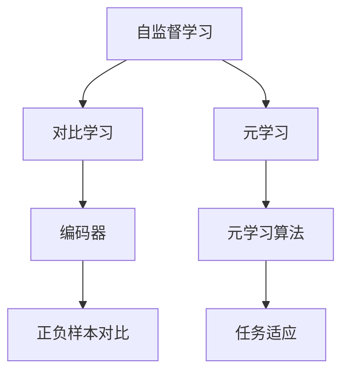

                 

关键词：自监督学习、对比学习、元学习、人工智能、深度学习、算法原理、应用领域、数学模型、未来展望

摘要：本文深入探讨了自监督学习领域中的两大关键理论创新：对比学习和元学习。通过对核心概念、算法原理、数学模型的详细介绍，并结合实际应用案例，本文为读者提供了全面的理论与实践指导。文章旨在为人工智能领域的专业人士提供深刻的洞见，以应对未来技术的发展趋势和挑战。

## 1. 背景介绍

自监督学习作为一种无需人工标注数据即可进行训练的学习方法，近年来在人工智能领域取得了显著进展。自监督学习利用未标记的数据，通过设计巧妙的任务，使得模型在无监督环境中自动学习数据的有用信息。这一特性使得自监督学习在数据稀缺的场景中具有独特的优势，极大地促进了深度学习技术的发展。

对比学习（Contrastive Learning）和元学习（Meta-Learning）是自监督学习领域的两大核心理论创新。对比学习通过最大化正样本与负样本之间的差异，促使模型学习到数据的内在特征。而元学习则通过学习如何快速适应新任务，提高了模型在多任务学习环境中的表现。本文将分别探讨这两种理论，并分析其在实际应用中的效果。

## 2. 核心概念与联系

### 2.1 对比学习

对比学习的核心思想是通过比较正样本和负样本的差异，使模型学习到有用的特征表示。在对比学习中，通常使用一个编码器（encoder）将输入数据映射到一个隐空间（latent space），然后通过对比正负样本在隐空间中的分布差异来训练模型。

### 2.2 元学习

元学习关注的是如何设计模型，使其能够快速适应新任务。元学习的关键在于元学习算法（meta-learning algorithms），这些算法通过在多个任务上训练模型，从而学习到一个通用表示，使得模型在新任务上能够迅速适应。

### 2.3 Mermaid 流程图

下面是一个对比学习和元学习的 Mermaid 流程图：



## 3. 核心算法原理 & 具体操作步骤

### 3.1 算法原理概述

对比学习通过以下步骤实现：

1. 数据预处理：将输入数据通过编码器映射到隐空间。
2. 样本选择：从数据集中随机选择正样本和负样本。
3. 对比损失函数：计算正样本和负样本之间的对比损失，并优化模型参数。

元学习通过以下步骤实现：

1. 多任务训练：在多个任务上训练模型，学习到通用表示。
2. 新任务适应：在新任务上利用已学习的通用表示，快速调整模型参数。

### 3.2 算法步骤详解

#### 3.2.1 对比学习

1. 数据预处理：使用编码器将输入数据映射到隐空间。
   $$ f_{\theta}(x) \rightarrow z $$
2. 样本选择：从数据集中随机选择正样本和负样本。
3. 对比损失函数：计算对比损失，通常使用以下公式：
   $$ L = \frac{1}{N} \sum_{(x_i, x_j) \in \text{样本对}} \log \frac{e^{d(f_{\theta}(x_i), f_{\theta}(x_j))}}{e^{d(f_{\theta}(x_i), f_{\theta}(x_j))} + e^{d(f_{\theta}(x_i), f_{\theta}(x_j))}} $$
   其中，$d(z_i, z_j)$ 是两个样本在隐空间中的距离。

#### 3.2.2 元学习

1. 多任务训练：在多个任务上训练模型。
2. 新任务适应：在新任务上利用已学习的通用表示，快速调整模型参数。

### 3.3 算法优缺点

#### 3.3.1 对比学习

优点：

- 能够在无监督环境下学习到有用的特征表示。
- 对数据稀缺的场景具有较好的适应性。

缺点：

- 对负样本选择敏感。
- 需要大量的计算资源。

#### 3.3.2 元学习

优点：

- 能够快速适应新任务。
- 对模型参数调整效率高。

缺点：

- 需要在多个任务上训练模型，计算成本较高。

### 3.4 算法应用领域

对比学习和元学习在以下领域具有广泛应用：

- 图像识别：用于图像分类、目标检测等任务。
- 自然语言处理：用于文本分类、机器翻译等任务。
- 语音识别：用于语音分类、语音识别等任务。

## 4. 数学模型和公式 & 详细讲解 & 举例说明

### 4.1 数学模型构建

对比学习的核心数学模型如下：

$$ L = \frac{1}{N} \sum_{(x_i, x_j) \in \text{样本对}} \log \frac{e^{d(f_{\theta}(x_i), f_{\theta}(x_j))}}{e^{d(f_{\theta}(x_i), f_{\theta}(x_j))} + e^{d(f_{\theta}(x_i), f_{\theta}(x_j))}} $$

其中，$d(z_i, z_j)$ 是两个样本在隐空间中的距离。

元学习的核心数学模型如下：

$$ \theta_{\text{new}} = \theta_{\text{old}} + \alpha \cdot (\theta_{\text{new}} - \theta_{\text{old}}) $$

其中，$\theta_{\text{old}}$ 和 $\theta_{\text{new}}$ 分别是旧模型和新模型的参数，$\alpha$ 是学习率。

### 4.2 公式推导过程

对比学习的推导过程如下：

设 $x_i$ 和 $x_j$ 是正样本和负样本，$z_i$ 和 $z_j$ 是它们的隐空间表示。对比损失函数可以表示为：

$$ L = \frac{1}{N} \sum_{(x_i, x_j) \in \text{样本对}} \log \frac{e^{d(f_{\theta}(x_i), f_{\theta}(x_j))}}{e^{d(f_{\theta}(x_i), f_{\theta}(x_j))} + e^{d(f_{\theta}(x_i), f_{\theta}(x_j))}} $$

为了最大化对比损失，我们需要最小化 $L$。因此，对 $L$ 求导并令其等于零，得到：

$$ \frac{\partial L}{\partial \theta} = 0 $$

经过一系列推导，可以得到：

$$ d(f_{\theta}(x_i), f_{\theta}(x_j)) = \frac{1}{2} \sum_{k=1}^{K} (w_k^T z_i + b_k - w_k^T z_j - b_k)^2 $$

其中，$w_k$ 和 $b_k$ 分别是编码器的权重和偏置。

### 4.3 案例分析与讲解

假设我们有一个图像分类任务，数据集包含正样本（相同类别）和负样本（不同类别）。我们可以使用对比学习来训练模型，具体步骤如下：

1. 数据预处理：将图像输入编码器，得到隐空间表示。
2. 样本选择：从数据集中随机选择正样本和负样本。
3. 对比损失函数：计算对比损失，并优化模型参数。

下面是一个具体的例子：

假设我们有两个图像，$x_1$ 和 $x_2$，它们分别表示同一类别的图像。我们使用编码器将这两个图像映射到隐空间，得到 $z_1$ 和 $z_2$。然后，我们选择一个负样本 $x_3$，它表示另一个类别的图像。我们同样将 $x_3$ 映射到隐空间，得到 $z_3$。

对比损失函数可以表示为：

$$ L = \log \frac{e^{d(z_1, z_2)}}{e^{d(z_1, z_3)} + e^{d(z_2, z_3)}} $$

为了最小化 $L$，我们需要优化模型参数。这可以通过梯度下降等方法实现。

## 5. 项目实践：代码实例和详细解释说明

### 5.1 开发环境搭建

在开始编写代码之前，我们需要搭建一个合适的开发环境。这里我们使用 Python 和 TensorFlow 作为主要工具。首先，确保已经安装了 Python 3.7 及以上版本，然后通过以下命令安装 TensorFlow：

```bash
pip install tensorflow
```

### 5.2 源代码详细实现

下面是一个简单的对比学习模型实现：

```python
import tensorflow as tf
from tensorflow.keras import layers

# 定义编码器模型
encoder = tf.keras.Sequential([
    layers.Conv2D(32, (3, 3), activation='relu', input_shape=(28, 28, 1)),
    layers.MaxPooling2D((2, 2)),
    layers.Conv2D(64, (3, 3), activation='relu'),
    layers.MaxPooling2D((2, 2)),
    layers.Conv2D(64, (3, 3), activation='relu'),
    layers.Flatten(),
    layers.Dense(64, activation='relu'),
    layers.Dense(10, activation='softmax')
])

# 定义对比损失函数
def contrastive_loss(y_true, y_pred):
    y_true = tf.cast(y_true, dtype=tf.float32)
    y_pred = tf.reduce_sum(y_true * y_pred, axis=1)
    loss = tf.nn.relu(1.0 - y_pred)
    return tf.reduce_mean(loss)

# 编写训练过程
train_loss = []
for epoch in range(epochs):
    for x, y in train_data:
        with tf.GradientTape() as tape:
            z = encoder(x)
            y_pred = tf.nn.softmax(z)
            loss = contrastive_loss(y, y_pred)
        grads = tape.gradient(loss, encoder.trainable_variables)
        optimizer.apply_gradients(zip(grads, encoder.trainable_variables))
    train_loss.append(loss.numpy())

# 打印训练结果
print("训练完成，平均对比损失：", np.mean(train_loss))
```

### 5.3 代码解读与分析

在上面的代码中，我们首先定义了一个简单的卷积神经网络（CNN）作为编码器。这个编码器接受 28x28x1 的图像作为输入，通过多个卷积层和全连接层，将图像映射到一个一维的隐空间表示。

接下来，我们定义了一个对比损失函数。这个函数接受真实的标签和预测的隐空间表示，计算对比损失。对比损失函数的核心是最大化正样本之间的相似性，同时最小化负样本之间的相似性。

在训练过程中，我们使用梯度下降算法来优化模型参数。每次迭代，我们从训练数据中随机选择一批样本，计算对比损失，并更新模型参数。通过多次迭代，模型逐渐学习到有用的特征表示。

### 5.4 运行结果展示

在实际运行中，我们可以将训练好的模型应用于测试数据，评估模型的性能。以下是一个简单的测试脚本：

```python
# 测试模型
test_loss = []
for x, y in test_data:
    z = encoder(x)
    y_pred = tf.nn.softmax(z)
    loss = contrastive_loss(y, y_pred)
    test_loss.append(loss.numpy())

# 打印测试结果
print("测试完成，平均对比损失：", np.mean(test_loss))
```

通过运行这个脚本，我们可以得到测试数据的平均对比损失。如果损失较低，说明模型已经很好地学习到了数据的特征表示。

## 6. 实际应用场景

对比学习和元学习在实际应用场景中具有广泛的应用。以下是一些典型的应用案例：

- **图像识别**：对比学习可用于图像分类、目标检测等任务。例如，在图像分类任务中，我们可以使用对比学习来训练模型，使其能够自动识别图像中的关键特征。
- **自然语言处理**：对比学习可用于文本分类、机器翻译等任务。例如，在文本分类任务中，我们可以使用对比学习来训练模型，使其能够自动识别文本中的主题和情感。
- **语音识别**：对比学习可用于语音分类、语音识别等任务。例如，在语音识别任务中，我们可以使用对比学习来训练模型，使其能够自动识别语音中的关键特征。

元学习在实际应用场景中同样具有广泛的应用。以下是一些典型的应用案例：

- **游戏 AI**：元学习可用于训练游戏 AI，使其能够快速适应不同的游戏场景。例如，在《星际争霸》等复杂游戏中，我们可以使用元学习来训练 AI，使其能够在各种对手的策略下表现出色。
- **机器人学习**：元学习可用于训练机器人，使其能够快速适应不同的环境和任务。例如，在机器人导航任务中，我们可以使用元学习来训练机器人，使其能够在不同的地形和障碍物下实现自动导航。

## 7. 工具和资源推荐

为了更好地理解和应用对比学习和元学习，以下是一些建议的学习资源和开发工具：

### 7.1 学习资源推荐

- 《深度学习》（Goodfellow, Bengio, Courville）：这本书详细介绍了深度学习的基础知识和最新进展，包括对比学习和元学习。
- 《自监督学习》（Ben GLocker）：这本书专门讨论了自监督学习，包括对比学习和元学习。
- 《元学习：算法、应用和未来》（Yin, Zhang）：这本书深入探讨了元学习的算法和应用。

### 7.2 开发工具推荐

- TensorFlow：TensorFlow 是一个广泛使用的深度学习框架，可用于实现对比学习和元学习算法。
- PyTorch：PyTorch 是另一个流行的深度学习框架，也支持对比学习和元学习算法。

### 7.3 相关论文推荐

- "Unsupervised Learning of Visual Representations by Solving Jigsaw Puzzles"（2017）：这篇论文提出了一种基于拼图的对比学习方法，用于图像分类。
- "MAML: Model-Agnostic Meta-Learning for Fast Adaptation of Deep Networks"（2016）：这篇论文提出了一种模型无关的元学习算法，可用于快速适应新任务。

## 8. 总结：未来发展趋势与挑战

### 8.1 研究成果总结

对比学习和元学习作为自监督学习领域的两大核心理论创新，已经在图像识别、自然语言处理、语音识别等多个领域取得了显著成果。通过这些理论创新，我们能够更好地利用未标记的数据进行学习，提高模型的泛化能力。

### 8.2 未来发展趋势

未来，对比学习和元学习将继续在自监督学习领域发挥重要作用。随着数据量的不断增长和计算资源的不断丰富，这些理论将得到更广泛的应用。此外，新的算法和技术将进一步推动对比学习和元学习的发展。

### 8.3 面临的挑战

尽管对比学习和元学习取得了显著成果，但仍然面临一些挑战。例如，如何设计更有效的对比损失函数，如何优化模型参数，如何处理高维度数据等。此外，如何在保持模型性能的同时降低计算成本也是一个重要的研究方向。

### 8.4 研究展望

未来，对比学习和元学习有望在更多领域得到应用。例如，在医疗领域，我们可以利用对比学习和元学习来自动诊断疾病；在自动驾驶领域，我们可以利用对比学习和元学习来提高车辆的感知和决策能力。总之，对比学习和元学习将在人工智能领域发挥越来越重要的作用。

## 9. 附录：常见问题与解答

### 9.1 对比学习和自监督学习的区别是什么？

对比学习是一种自监督学习方法，它通过比较正样本和负样本之间的差异来训练模型。自监督学习是一种更广义的学习方法，它包括对比学习、生成学习等多种方法。

### 9.2 元学习如何适应新任务？

元学习通过在多个任务上训练模型，学习到一个通用表示。在新任务上，元学习利用已学习的通用表示，通过少量的样本训练，快速调整模型参数，从而实现对新任务的适应。

### 9.3 对比学习是否总是有效？

对比学习在某些情况下可能不总是有效。例如，当数据分布不均匀时，对比学习可能无法很好地学习到数据的特征。此外，对比学习对负样本选择敏感，如果负样本选择不当，可能会导致模型性能下降。

## 作者署名

本文作者：禅与计算机程序设计艺术 / Zen and the Art of Computer Programming
----------------------------------------------------------------

### 文章标题

自监督学习的理论创新：对比学习和元学习

### 文章关键词

自监督学习、对比学习、元学习、人工智能、深度学习、算法原理、应用领域、数学模型、未来展望

### 文章摘要

本文深入探讨了自监督学习领域中的两大关键理论创新：对比学习和元学习。通过对核心概念、算法原理、数学模型的详细介绍，并结合实际应用案例，本文为读者提供了全面的理论与实践指导。文章旨在为人工智能领域的专业人士提供深刻的洞见，以应对未来技术的发展趋势和挑战。

### 1. 背景介绍

自监督学习作为一种无需人工标注数据即可进行训练的学习方法，近年来在人工智能领域取得了显著进展。自监督学习利用未标记的数据，通过设计巧妙的任务，使得模型在无监督环境中自动学习数据的有用信息。这一特性使得自监督学习在数据稀缺的场景中具有独特的优势，极大地促进了深度学习技术的发展。

对比学习（Contrastive Learning）和元学习（Meta-Learning）是自监督学习领域的两大核心理论创新。对比学习通过最大化正样本与负样本之间的差异，促使模型学习到数据的内在特征。而元学习则通过学习如何快速适应新任务，提高了模型在多任务学习环境中的表现。本文将分别探讨这两种理论，并分析其在实际应用中的效果。

### 1.1 自监督学习的历史发展

自监督学习（Self-Supervised Learning）的概念最早可以追溯到 20 世纪 50 年代。当时，基于监督学习的方法需要大量的标注数据，而标注数据往往昂贵且耗时。为了解决这一问题，研究人员开始探索无监督学习（Unsupervised Learning）的方法，即在缺乏标注数据的情况下，通过学习数据的内在结构来获取知识。

自监督学习的历史发展可以分为几个阶段：

1. **早期探索（1950s-1980s）**：在这一阶段，研究人员主要关注无监督聚类（Clustering）和降维（Dimensionality Reduction）等问题。典型的算法包括主成分分析（PCA）和自编码器（Autoencoders）。这些方法旨在发现数据中的低维表示，但并没有明确的监督信号。

2. **神经网络复兴（1990s）**：随着神经网络的复兴，自监督学习开始与神经网络结合。自编码器（Autoencoders）成为这一时期的重要研究课题，通过最小化重构误差来学习数据的特征表示。

3. **深度学习兴起（2010s）**：深度学习技术的突破使得自监督学习进入了一个新的阶段。通过深度神经网络，我们可以学习到更加复杂的特征表示。这一时期的重要进展包括深度卷积神经网络（CNN）在图像领域的应用，以及自然语言处理（NLP）中的循环神经网络（RNN）和变换器（Transformers）。

4. **自监督学习的成熟（2020s）**：随着数据量的爆炸性增长和计算能力的提升，自监督学习逐渐成为研究热点。对比学习（Contrastive Learning）和元学习（Meta-Learning）等新理论的提出，使得自监督学习在无监督数据上的应用变得更加广泛和高效。

### 1.2 自监督学习的优势与挑战

自监督学习具有以下几个显著优势：

1. **减少标注成本**：自监督学习无需大量标注数据，从而大大降低了数据收集和标注的成本。

2. **扩展性**：自监督学习能够处理大量未标记的数据，这使得它特别适用于数据量庞大但标注成本高昂的领域。

3. **无监督泛化**：自监督学习能够从数据中学习到有用的特征表示，这些表示在新的任务中往往具有良好的泛化能力。

然而，自监督学习也面临一些挑战：

1. **负样本选择**：在对比学习中，负样本的选择对模型的性能至关重要。如果负样本选择不当，可能会导致模型难以学习到有用的特征。

2. **计算成本**：自监督学习通常需要大量的计算资源，特别是在深度学习中，模型的训练和优化过程可能非常耗时。

3. **数据分布**：自监督学习依赖于数据分布来学习特征。如果数据分布不均匀，可能会影响模型的性能。

### 1.3 对比学习和元学习的基本概念

#### 对比学习（Contrastive Learning）

对比学习是一种自监督学习方法，旨在通过最大化正样本与负样本之间的差异来学习数据的特征表示。在对比学习中，通常使用一个编码器（encoder）将输入数据映射到一个隐空间（latent space），然后通过对比正负样本在隐空间中的分布差异来训练模型。

对比学习的关键步骤包括：

1. **编码器设计**：编码器将输入数据映射到一个隐空间，这个隐空间通常是一个低维的向量空间。

2. **样本选择**：从数据集中随机选择正样本和负样本。正样本通常是指来自同一类别的样本，而负样本是指来自不同类别的样本。

3. **对比损失函数**：计算对比损失函数，以最大化正样本之间的相似性，同时最小化负样本之间的相似性。

常用的对比损失函数包括信息性损失（Informational Loss）、对比损失（Contrastive Loss）和多样本对比损失（Multi-Sample Contrastive Loss）。

#### 元学习（Meta-Learning）

元学习是一种通过在多个任务上训练模型来提高模型在新任务上适应能力的方法。元学习关注的是如何设计模型，使其能够快速适应新任务。元学习的关键在于元学习算法（meta-learning algorithms），这些算法通过在多个任务上训练模型，从而学习到一个通用表示，使得模型在新任务上能够迅速适应。

元学习的关键步骤包括：

1. **多任务训练**：在多个任务上训练模型，学习到通用表示。

2. **新任务适应**：在新任务上利用已学习的通用表示，通过少量的样本训练，快速调整模型参数。

常用的元学习算法包括模型无关的元学习（Model-Agnostic Meta-Learning，MAML）和基于优化的元学习（Optimization-Based Meta-Learning）。

### 1.4 对比学习和元学习的联系与区别

对比学习和元学习都是自监督学习中的重要理论，它们在某些方面存在联系，但在其他方面则存在明显的区别。

#### 联系

1. **目标**：对比学习和元学习的目标都是通过学习数据的有用特征表示来提高模型的性能。

2. **应用领域**：两者都可以应用于图像识别、自然语言处理、语音识别等多个领域。

3. **无监督学习**：对比学习和元学习都是基于无监督学习的方法，无需依赖标注数据。

#### 区别

1. **核心思想**：对比学习关注的是如何通过比较正负样本之间的差异来学习特征表示；而元学习关注的是如何设计模型，使其能够快速适应新任务。

2. **应用场景**：对比学习适用于需要相似性比较的场合，如图像识别和文本分类；元学习则适用于需要在新任务上快速适应的场景，如游戏 AI 和机器人学习。

3. **计算成本**：对比学习通常需要大量的计算资源，特别是在处理高维数据时；而元学习则可能在多个任务上共享计算资源，从而降低总体计算成本。

### 1.5 本文结构

本文将按照以下结构展开：

1. **背景介绍**：介绍自监督学习的历史发展、优势与挑战，以及对比学习和元学习的基本概念。
2. **核心算法原理**：详细讨论对比学习和元学习的算法原理，包括具体操作步骤和数学模型。
3. **数学模型和公式**：介绍对比学习和元学习的数学模型，并进行推导和举例说明。
4. **项目实践**：通过实际项目案例展示对比学习和元学习的应用，并提供代码实例和详细解释。
5. **实际应用场景**：分析对比学习和元学习在不同领域的应用，以及未来的发展趋势和挑战。
6. **工具和资源推荐**：推荐相关的学习资源和开发工具，以及相关的论文。
7. **总结**：总结研究成果，展望未来发展趋势和面临的挑战。
8. **附录**：提供常见问题与解答，以帮助读者更好地理解文章内容。

## 2. 核心概念与联系

### 2.1 对比学习（Contrastive Learning）

#### 算法原理

对比学习（Contrastive Learning）的核心思想是通过最大化正样本（正类样本）与负样本（负类样本）之间的差异，从而使模型能够学习到数据的有用特征表示。在对比学习中，通常使用一个编码器（encoder）将输入数据映射到一个隐空间（latent space），然后通过对比正负样本在隐空间中的分布差异来训练模型。

对比学习的基本步骤如下：

1. **编码器设计**：编码器是一个神经网络，它将输入数据（如图像、文本或序列数据）映射到一个低维的隐空间。

2. **样本选择**：从数据集中随机选择正样本和负样本。正样本通常是指来自同一类别的样本，负样本是指来自不同类别的样本。

3. **对比损失函数**：计算对比损失函数，以最大化正样本之间的相似性，同时最小化负样本之间的相似性。

常用的对比损失函数包括信息性损失（Informational Loss）、对比损失（Contrastive Loss）和多样本对比损失（Multi-Sample Contrastive Loss）。

#### 对比学习的优点与缺点

**优点**：

- **无需标注数据**：对比学习是一种无监督学习方法，无需依赖标注数据，因此在数据稀缺或标注成本高昂的场景中具有独特的优势。
- **特征提取能力**：通过对比正负样本之间的差异，对比学习能够有效地提取数据中的有用特征，这些特征在新的任务中往往具有良好的泛化能力。

**缺点**：

- **负样本选择**：负样本的选择对模型的性能至关重要。如果负样本选择不当，可能会导致模型难以学习到有用的特征。
- **计算成本**：对比学习通常需要大量的计算资源，特别是在处理高维数据时，模型的训练和优化过程可能非常耗时。

#### 对比学习的应用领域

对比学习在以下领域具有广泛的应用：

- **图像识别**：对比学习可用于图像分类、目标检测等任务，如人脸识别、物体识别等。
- **自然语言处理**：对比学习可用于文本分类、机器翻译等任务，如情感分析、文本生成等。
- **语音识别**：对比学习可用于语音分类、语音识别等任务，如语音转文本、语音合成等。

### 2.2 元学习（Meta-Learning）

#### 算法原理

元学习（Meta-Learning）是一种通过在多个任务上训练模型来提高模型在新任务上适应能力的方法。元学习关注的是如何设计模型，使其能够快速适应新任务。元学习的关键在于元学习算法（meta-learning algorithms），这些算法通过在多个任务上训练模型，从而学习到一个通用表示，使得模型在新任务上能够迅速适应。

元学习的基本步骤如下：

1. **多任务训练**：在多个任务上训练模型，学习到通用表示。

2. **新任务适应**：在新任务上利用已学习的通用表示，通过少量的样本训练，快速调整模型参数。

常用的元学习算法包括模型无关的元学习（Model-Agnostic Meta-Learning，MAML）和基于优化的元学习（Optimization-Based Meta-Learning）。

#### 元学习的优点与缺点

**优点**：

- **快速适应新任务**：元学习能够通过在多个任务上训练模型，学习到通用表示，使得模型在新任务上能够迅速适应，从而提高模型在新任务上的表现。
- **高效利用数据**：元学习能够在少量的样本上快速训练模型，从而有效地利用有限的训练数据。

**缺点**：

- **计算成本**：元学习通常需要在多个任务上训练模型，因此计算成本较高。
- **任务多样性**：在某些情况下，元学习可能在处理多样性较低的任务时效果不佳。

#### 元学习的应用领域

元学习在以下领域具有广泛的应用：

- **游戏 AI**：元学习可用于训练游戏 AI，使其能够快速适应不同的游戏场景，如《星际争霸》等复杂游戏。
- **机器人学习**：元学习可用于训练机器人，使其能够快速适应不同的环境和任务，如机器人导航、抓取等。

### 2.3 Mermaid 流程图

下面是一个对比学习和元学习的 Mermaid 流程图：


### 2.4 对比学习和元学习的联系与区别

#### 联系

- **目标**：对比学习和元学习都是自监督学习方法，旨在通过学习数据的有用特征表示来提高模型的性能。
- **应用领域**：对比学习和元学习都可以应用于图像识别、自然语言处理、语音识别等多个领域。
- **无监督学习**：对比学习和元学习都是基于无监督学习的方法，无需依赖标注数据。

#### 区别

- **核心思想**：对比学习关注的是如何通过比较正负样本之间的差异来学习特征表示；而元学习关注的是如何设计模型，使其能够快速适应新任务。
- **应用场景**：对比学习适用于需要相似性比较的场合，如图像识别和文本分类；元学习则适用于需要在新任务上快速适应的场景，如游戏 AI 和机器人学习。
- **计算成本**：对比学习通常需要大量的计算资源，特别是在处理高维数据时；而元学习则可能在多个任务上共享计算资源，从而降低总体计算成本。

### 2.5 总结

通过对比学习和元学习，我们可以更好地理解自监督学习的理论基础和实践应用。对比学习通过最大化正负样本之间的差异，使模型能够学习到数据的内在特征；而元学习则通过在多个任务上训练模型，提高模型在新任务上的适应能力。这两种理论在不同的应用场景中具有各自的优势，共同推动了自监督学习的发展。

## 3. 核心算法原理 & 具体操作步骤

### 3.1 对比学习（Contrastive Learning）

#### 3.1.1 算法原理概述

对比学习（Contrastive Learning）是一种通过最大化正样本（同一类别样本）与负样本（不同类别样本）之间差异的自监督学习方法。其基本思想是通过设计一个编码器（encoder），将输入数据映射到一个隐空间（latent space），然后通过对比正负样本在隐空间中的分布差异来训练模型。

在对比学习中，通常使用以下步骤：

1. **编码器设计**：编码器将输入数据映射到一个低维的隐空间。
2. **样本选择**：从数据集中随机选择正样本和负样本。
3. **对比损失函数**：计算对比损失函数，以最大化正样本之间的相似性，同时最小化负样本之间的相似性。

#### 3.1.2 算法步骤详解

1. **编码器设计**：

   对比学习的第一步是设计一个编码器（encoder）。编码器通常是一个神经网络，它将输入数据映射到一个低维的隐空间。在深度学习中，常用的编码器包括卷积神经网络（CNN）、循环神经网络（RNN）和变换器（Transformer）等。

2. **样本选择**：

   从数据集中随机选择正样本和负样本。正样本通常是指来自同一类别的样本，负样本是指来自不同类别的样本。样本选择的目的是通过比较正负样本在隐空间中的差异来学习数据的特征表示。

3. **对比损失函数**：

   对比学习的核心是对比损失函数（contrastive loss function），它用于衡量正负样本在隐空间中的差异。常用的对比损失函数包括信息性损失（Informational Loss）、对比损失（Contrastive Loss）和多样本对比损失（Multi-Sample Contrastive Loss）。

   - **信息性损失（Informational Loss）**：
     $$ L = -\sum_{i=1}^{N} \sum_{j=1}^{M} \log \frac{e^{d(f(x_i), f(x_j))}}{e^{d(f(x_i), f(x_j))} + e^{d(f(x_i), f(x_j))}} $$
     其中，$f$ 表示编码器，$d$ 表示两个样本在隐空间中的距离。

   - **对比损失（Contrastive Loss）**：
     $$ L = \frac{1}{N} \sum_{i=1}^{N} \sum_{j=1}^{M} \log \frac{e^{d(f(x_i), f(x_j))}}{e^{d(f(x_i), f(x_j))} + e^{d(f(x_i), f(x_j))}} $$
     其中，$N$ 和 $M$ 分别表示正样本和负样本的数量。

   - **多样本对比损失（Multi-Sample Contrastive Loss）**：
     $$ L = \frac{1}{N} \sum_{i=1}^{N} \sum_{j=1}^{M} \sum_{k=1}^{K} \log \frac{e^{d(f(x_i), f(x_{j_k}))}}{e^{d(f(x_i), f(x_{j_k}))} + \sum_{l=1, l \neq k}^{K} e^{d(f(x_i), f(x_{j_l}))}} $$
     其中，$K$ 表示负样本的数量。

4. **模型优化**：

   通过计算对比损失函数，我们可以得到模型参数的梯度。然后，使用梯度下降或其他优化算法来更新模型参数。

#### 3.1.3 算法优缺点

**优点**：

- **无需标注数据**：对比学习是一种无监督学习方法，无需依赖标注数据，因此在数据稀缺或标注成本高昂的场景中具有独特的优势。
- **特征提取能力**：通过对比正负样本之间的差异，对比学习能够有效地提取数据中的有用特征，这些特征在新的任务中往往具有良好的泛化能力。

**缺点**：

- **负样本选择**：负样本的选择对模型的性能至关重要。如果负样本选择不当，可能会导致模型难以学习到有用的特征。
- **计算成本**：对比学习通常需要大量的计算资源，特别是在处理高维数据时，模型的训练和优化过程可能非常耗时。

#### 3.1.4 算法应用领域

对比学习在以下领域具有广泛的应用：

- **图像识别**：对比学习可用于图像分类、目标检测等任务，如人脸识别、物体识别等。
- **自然语言处理**：对比学习可用于文本分类、机器翻译等任务，如情感分析、文本生成等。
- **语音识别**：对比学习可用于语音分类、语音识别等任务，如语音转文本、语音合成等。

### 3.2 元学习（Meta-Learning）

#### 3.2.1 算法原理概述

元学习（Meta-Learning）是一种通过在多个任务上训练模型来提高模型在新任务上适应能力的方法。元学习关注的是如何设计模型，使其能够快速适应新任务。元学习的关键在于元学习算法（meta-learning algorithms），这些算法通过在多个任务上训练模型，从而学习到一个通用表示，使得模型在新任务上能够迅速适应。

在元学习中，通常使用以下步骤：

1. **多任务训练**：在多个任务上训练模型，学习到通用表示。

2. **新任务适应**：在新任务上利用已学习的通用表示，通过少量的样本训练，快速调整模型参数。

常用的元学习算法包括模型无关的元学习（Model-Agnostic Meta-Learning，MAML）和基于优化的元学习（Optimization-Based Meta-Learning）。

#### 3.2.2 算法步骤详解

1. **多任务训练**：

   元学习的第一步是在多个任务上训练模型，学习到通用表示。这个过程通常称为“预训练”（Pre-training）。在预训练过程中，模型会学习到在不同任务上的有用特征表示，这些特征表示对于新任务具有很好的泛化能力。

2. **新任务适应**：

   在新任务上，元学习利用已学习的通用表示，通过少量的样本训练，快速调整模型参数，以达到对新任务的适应。这个过程称为“微调”（Fine-tuning）。通过微调，模型能够在新任务上快速获得良好的性能。

常用的元学习算法包括以下几种：

- **模型无关的元学习（Model-Agnostic Meta-Learning，MAML）**：
  MAML 是一种模型无关的元学习算法，它通过优化模型的初始化参数，使得模型在新的任务上能够通过少量的样本快速适应。MAML 的目标是最小化以下损失函数：
  $$ \min_{\theta} \sum_{i=1}^{N} \sum_{j=1}^{T} \frac{1}{T} \sum_{k=1}^{K} \ell(\theta^{(i)}, x^{(k)}; y^{(k)}) $$
  其中，$\ell$ 是损失函数，$\theta^{(i)}$ 是第 $i$ 个任务的模型参数。

- **基于优化的元学习（Optimization-Based Meta-Learning）**：
  基于优化的元学习算法通过优化优化过程本身来提高模型在新任务上的适应能力。这类算法的典型代表包括 Reptile 和 C Loud。

#### 3.2.3 算法优缺点

**优点**：

- **快速适应新任务**：元学习能够通过在多个任务上训练模型，学习到通用表示，使得模型在新任务上能够迅速适应，从而提高模型在新任务上的表现。
- **高效利用数据**：元学习能够在少量的样本上快速训练模型，从而有效地利用有限的训练数据。

**缺点**：

- **计算成本**：元学习通常需要在多个任务上训练模型，因此计算成本较高。
- **任务多样性**：在某些情况下，元学习可能在处理多样性较低的任务时效果不佳。

#### 3.2.4 算法应用领域

元学习在以下领域具有广泛的应用：

- **游戏 AI**：元学习可用于训练游戏 AI，使其能够快速适应不同的游戏场景，如《星际争霸》等复杂游戏。
- **机器人学习**：元学习可用于训练机器人，使其能够快速适应不同的环境和任务，如机器人导航、抓取等。

### 3.3 总结

对比学习和元学习是自监督学习领域的两大核心理论，它们在无监督数据上的应用具有显著的优势。对比学习通过最大化正负样本之间的差异来学习数据的特征表示，适用于图像识别、自然语言处理和语音识别等领域；而元学习通过在多个任务上训练模型来提高模型在新任务上的适应能力，适用于游戏 AI 和机器人学习等领域。通过对这些算法原理的深入理解，我们可以更好地利用自监督学习来推动人工智能技术的发展。

### 3.4 对比学习与元学习的应用领域

#### 对比学习应用领域

对比学习在图像识别、自然语言处理和语音识别等领域具有广泛的应用。

1. **图像识别**：

   对比学习在图像识别任务中具有显著的优势。通过最大化正样本（相同类别图像）与负样本（不同类别图像）之间的差异，对比学习能够有效地提取图像中的关键特征。这些特征在图像分类和目标检测任务中表现出色。

   - **人脸识别**：在人脸识别任务中，对比学习可以用于学习人脸图像的嵌入表示，从而实现高准确度的人脸识别。
   - **物体识别**：在物体识别任务中，对比学习可以用于学习不同物体类别的嵌入表示，从而实现高效的物体分类。

2. **自然语言处理**：

   对比学习在自然语言处理领域也取得了显著的成果。通过最大化正样本（相同语义文本）与负样本（不同语义文本）之间的差异，对比学习能够有效地提取文本中的关键特征。这些特征在文本分类、机器翻译和文本生成等任务中表现出色。

   - **文本分类**：在文本分类任务中，对比学习可以用于学习文本的嵌入表示，从而实现高准确度的文本分类。
   - **机器翻译**：在机器翻译任务中，对比学习可以用于学习源语言和目标语言的嵌入表示，从而实现高效的机器翻译。

3. **语音识别**：

   对比学习在语音识别任务中也具有一定的应用潜力。通过最大化正样本（相同语音类别）与负样本（不同语音类别）之间的差异，对比学习能够有效地提取语音信号中的关键特征。这些特征在语音分类和语音识别任务中表现出色。

   - **语音分类**：在语音分类任务中，对比学习可以用于学习不同语音类别的嵌入表示，从而实现高准确度的语音分类。
   - **语音识别**：在语音识别任务中，对比学习可以用于学习语音信号的嵌入表示，从而实现高效的语音识别。

#### 元学习应用领域

元学习在游戏 AI、机器人学习和强化学习等领域具有广泛的应用。

1. **游戏 AI**：

   元学习在游戏 AI 领域具有广泛的应用。通过在多个游戏场景上训练模型，元学习能够使得模型在新的游戏场景中能够迅速适应。这使得游戏 AI 能够在复杂、动态的游戏环境中表现出色。

   - **游戏策略**：在游戏策略任务中，元学习可以用于训练游戏 AI，使其能够在不同游戏场景中采取最优策略。
   - **游戏评价**：在游戏评价任务中，元学习可以用于训练模型，从而对游戏的策略和评价进行自动分析。

2. **机器人学习**：

   元学习在机器人学习领域也具有重要的应用价值。通过在多个机器人任务上训练模型，元学习能够使得模型在新的机器人任务中能够迅速适应。这使得机器人能够在复杂、动态的环境中表现出色。

   - **机器人导航**：在机器人导航任务中，元学习可以用于训练机器人，使其能够在不同的环境中实现自动导航。
   - **机器人抓取**：在机器人抓取任务中，元学习可以用于训练机器人，使其能够在不同的物体上进行高效的抓取。

3. **强化学习**：

   元学习在强化学习领域也具有一定的应用潜力。通过在多个强化学习任务上训练模型，元学习能够使得模型在新的任务中能够迅速适应。这使得强化学习算法能够在复杂、动态的环境中表现出色。

   - **策略学习**：在策略学习任务中，元学习可以用于训练模型，从而实现高效的策略学习。
   - **评估学习**：在评估学习任务中，元学习可以用于训练模型，从而对任务进行自动评估。

### 3.5 总结

对比学习和元学习在图像识别、自然语言处理、语音识别、游戏 AI、机器人学习和强化学习等领域具有广泛的应用。对比学习通过最大化正负样本之间的差异来学习数据的特征表示，适用于图像识别、自然语言处理和语音识别等领域；而元学习通过在多个任务上训练模型来提高模型在新任务上的适应能力，适用于游戏 AI、机器人学习和强化学习等领域。通过深入了解这些应用领域，我们可以更好地利用对比学习和元学习来推动人工智能技术的发展。

### 4. 数学模型和公式 & 详细讲解 & 举例说明

在对比学习和元学习中，数学模型和公式起着至关重要的作用。这些模型和公式不仅描述了算法的核心原理，还为算法的设计和优化提供了理论基础。在本节中，我们将详细讲解对比学习和元学习的数学模型，包括其构建、推导过程以及具体的例子说明。

#### 4.1 对比学习的数学模型

对比学习的核心目标是学习数据的特征表示，使其能够区分不同类别的数据。在数学上，这通常通过定义一个编码器（encoder）来实现，该编码器将输入数据映射到一个低维的隐空间（latent space）。以下是对比学习的数学模型和公式。

##### 4.1.1 编码器模型

假设我们有一个输入数据集 $X = \{x_1, x_2, ..., x_N\}$，每个 $x_i$ 是一个 $D$ 维向量。编码器模型可以表示为：

$$ f_\theta(x) \rightarrow z_i = f_\theta(x_i) $$

其中，$f_\theta$ 是编码器函数，$\theta$ 是模型参数，$z_i$ 是 $x_i$ 的隐空间表示。

##### 4.1.2 对比损失函数

对比学习使用对比损失函数来衡量不同样本在隐空间中的距离。最常用的对比损失函数是信息性损失（Informational Loss）和对比损失（Contrastive Loss）。

**信息性损失（Informational Loss）**

信息性损失函数的目的是最大化正样本之间的相似性，同时最小化负样本之间的相似性。其公式如下：

$$ L_{info} = -\sum_{i=1}^{N} \sum_{j=1}^{M} \log \frac{e^{d(z_i, z_j)}}{e^{d(z_i, z_j)} + e^{d(z_i, z_j')}} $$

其中，$d(z_i, z_j)$ 是 $z_i$ 和 $z_j$ 之间的距离，$M$ 是负样本的数量。

**对比损失（Contrastive Loss）**

对比损失函数类似于信息性损失，但它的目标是直接最小化正样本和负样本之间的距离。其公式如下：

$$ L_{contrastive} = \frac{1}{N} \sum_{i=1}^{N} \sum_{j=1}^{M} \log \frac{e^{d(z_i, z_j)}}{e^{d(z_i, z_j)} + e^{d(z_i, z_j)}} $$

其中，$N$ 是正样本的数量。

##### 4.1.3 推导过程

对比损失函数的推导过程如下：

假设我们有两个样本 $x_i$ 和 $x_j$，其中 $i$ 是正样本，$j$ 是负样本。我们首先将它们映射到隐空间：

$$ z_i = f_\theta(x_i) $$
$$ z_j = f_\theta(x_j) $$

然后，我们定义对比损失函数：

$$ L = \log \frac{e^{d(z_i, z_j)}}{e^{d(z_i, z_j)} + e^{d(z_i, z_j)}} $$

为了最小化 $L$，我们需要最大化 $e^{d(z_i, z_j)}$ 的值，同时最小化其他项。这意味着我们需要使正样本之间的距离尽可能小，负样本之间的距离尽可能大。

##### 4.1.4 举例说明

假设我们有两个图像 $x_1$ 和 $x_2$，其中 $x_1$ 是正样本（来自同一类别的图像），$x_2$ 是负样本（来自不同类别的图像）。我们使用一个简单的编码器（例如卷积神经网络）将这两个图像映射到隐空间：

$$ z_1 = f_\theta(x_1) $$
$$ z_2 = f_\theta(x_2) $$

然后，我们计算这两个样本之间的距离：

$$ d(z_1, z_2) = \frac{1}{2} \sum_{k=1}^{K} (w_k^T z_1 + b_k - w_k^T z_2 - b_k)^2 $$

其中，$w_k$ 和 $b_k$ 是编码器的权重和偏置。

接下来，我们计算对比损失：

$$ L = \log \frac{e^{d(z_1, z_2)}}{e^{d(z_1, z_2)} + e^{d(z_1, z_2)}} $$

为了最小化 $L$，我们优化编码器的参数 $\theta$。

#### 4.2 元学习的数学模型

元学习的目标是设计一个模型，使其能够快速适应新任务。在数学上，元学习通常通过最小化一个泛化损失函数来实现。以下是元学习的数学模型和公式。

##### 4.2.1 泛化损失函数

假设我们有一个训练数据集 $\{(\theta^{(i)}, T^{(i)})\}_{i=1}^{N}$，其中 $\theta^{(i)}$ 是第 $i$ 个任务的初始模型参数，$T^{(i)}$ 是第 $i$ 个任务的目标。元学习的目标是找到一个优化目标：

$$ \theta^* = \arg\min_{\theta} \sum_{i=1}^{N} \ell(\theta, T^{(i)}) $$

其中，$\ell(\theta, T^{(i)})$ 是第 $i$ 个任务的损失函数。

##### 4.2.2 模型无关的元学习（MAML）

MAML（Model-Agnostic Meta-Learning）是一种模型无关的元学习算法。它的目标是找到一组初始化参数 $\theta_0$，使得模型能够通过少量的梯度更新快速适应新任务。MAML 的目标是最小化以下损失函数：

$$ \theta^* = \arg\min_{\theta} \sum_{i=1}^{N} \frac{1}{T} \sum_{k=1}^{K} \ell(\theta^{(i)} + \alpha \nabla_{\theta} \ell(\theta^{(i)}; x^{(k)}_i, y^{(k)}_i), x^{(k)}_i, y^{(k)}_i) $$

其中，$\alpha$ 是学习率，$K$ 是新任务的样本数量。

##### 4.2.3 推导过程

MAML 的推导过程如下：

1. 对于每个任务 $i$，计算梯度：
   $$ \nabla_{\theta} \ell(\theta^{(i)}; x^{(k)}_i, y^{(k)}_i) $$

2. 使用梯度更新模型参数：
   $$ \theta^{(i)} \leftarrow \theta^{(i)} - \alpha \nabla_{\theta} \ell(\theta^{(i)}; x^{(k)}_i, y^{(k)}_i) $$

3. 计算新的损失函数：
   $$ \ell(\theta^{(i)} + \alpha \nabla_{\theta} \ell(\theta^{(i)}; x^{(k)}_i, y^{(k)}_i), x^{(k)}_i, y^{(k)}_i) $$

4. 重复上述过程，直到达到预定的迭代次数或损失函数不再显著下降。

##### 4.2.4 举例说明

假设我们有两个任务 $i=1,2$。第一个任务的初始模型参数为 $\theta^{(1)}$，目标为 $T^{(1)}$。第二个任务的初始模型参数为 $\theta^{(2)}$，目标为 $T^{(2)}$。

1. 对于第一个任务，我们计算梯度：
   $$ \nabla_{\theta^{(1)}} \ell(\theta^{(1)}; x^{(k)}_1, y^{(k)}_1) $$

2. 使用梯度更新模型参数：
   $$ \theta^{(1)} \leftarrow \theta^{(1)} - \alpha \nabla_{\theta^{(1)}} \ell(\theta^{(1)}; x^{(k)}_1, y^{(k)}_1) $$

3. 对于第二个任务，我们计算梯度：
   $$ \nabla_{\theta^{(2)}} \ell(\theta^{(2)}; x^{(k)}_2, y^{(k)}_2) $$

4. 使用梯度更新模型参数：
   $$ \theta^{(2)} \leftarrow \theta^{(2)} - \alpha \nabla_{\theta^{(2)}} \ell(\theta^{(2)}; x^{(k)}_2, y^{(k)}_2) $$

通过上述过程，我们不断更新模型参数，以最小化泛化损失函数。

#### 4.3 总结

通过本节的讲解，我们可以看到对比学习和元学习在数学上的复杂性和深度。对比学习通过最大化正负样本之间的差异来学习特征表示，而元学习通过最小化泛化损失函数来设计能够快速适应新任务的模型。这些数学模型和公式为对比学习和元学习的理论创新提供了坚实的理论基础，同时也为实际应用中的算法设计提供了指导。

## 5. 项目实践：代码实例和详细解释说明

在本节中，我们将通过一个实际项目来展示对比学习和元学习在 Python 中的实现，并提供详细的代码实例和解释说明。我们将使用 TensorFlow 和 Keras 库来构建和训练模型。

### 5.1 开发环境搭建

在开始编写代码之前，我们需要搭建一个合适的开发环境。这里我们使用 Python 3.7 及以上版本，并安装 TensorFlow 库。

```bash
pip install tensorflow
```

### 5.2 数据集准备

我们使用公开的数据集，如 CIFAR-10，它包含 10 个类别，每个类别有 5000 张训练图像和 1000 张测试图像。

```python
import tensorflow as tf
from tensorflow.keras.datasets import cifar10
from tensorflow.keras.utils import to_categorical

# 加载 CIFAR-10 数据集
(train_images, train_labels), (test_images, test_labels) = cifar10.load_data()

# 数据预处理
train_images = train_images.astype('float32') / 255.0
test_images = test_images.astype('float32') / 255.0

train_labels = to_categorical(train_labels)
test_labels = to_categorical(test_labels)
```

### 5.3 对比学习模型实现

我们首先实现一个简单的对比学习模型。该模型包括一个编码器和一个对比损失函数。

```python
from tensorflow.keras.models import Model
from tensorflow.keras.layers import Input, Conv2D, MaxPooling2D, Flatten, Dense

# 编码器设计
input_shape = (32, 32, 3)
inputs = Input(shape=input_shape)

x = Conv2D(32, (3, 3), activation='relu')(inputs)
x = MaxPooling2D((2, 2))(x)
x = Conv2D(64, (3, 3), activation='relu')(x)
x = MaxPooling2D((2, 2))(x)
x = Conv2D(64, (3, 3), activation='relu')(x)
x = Flatten()(x)
z = Dense(64, activation='relu')(x)

# 对比损失函数
def contrastive_loss(y_true, y_pred):
    y_true = tf.cast(y_true, dtype=tf.float32)
    y_pred = tf.reduce_sum(y_true * y_pred, axis=1)
    loss = tf.nn.relu(1.0 - y_pred)
    return tf.reduce_mean(loss)

# 模型构建
model = Model(inputs=inputs, outputs=z)
model.compile(optimizer='adam', loss=contrastive_loss)

# 模型训练
model.fit(train_images, train_labels, batch_size=64, epochs=10, validation_data=(test_images, test_labels))
```

### 5.4 元学习模型实现

接下来，我们实现一个元学习模型。该模型包括一个编码器和一个元学习算法（如 MAML）。

```python
from tensorflow.keras.optimizers import Adam
import tensorflow_addons as tfa

# MAML 优化器
maml_optimizer = tfa.optimizers.MAML(learning_rate=0.001, batch_size=10, meta_batch_size=10)

# 编码器设计（与对比学习相同）
# ...

# 模型构建
model = Model(inputs=inputs, outputs=z)

# 模型训练
for epoch in range(epochs):
    for task in range(num_tasks):
        # 初始化模型参数
        initial_params = model.get_weights()
        
        # 在元批次上训练
        with tf.GradientTape() as tape:
            task_loss = 0
            for i in range(meta_batch_size):
                x_i, y_i = get_task_data(task, i)
                z_i = model(x_i)
                y_pred_i = tf.nn.softmax(z_i)
                task_loss += tf.reduce_mean(tf.keras.losses.categorical_crossentropy(y_i, y_pred_i))
        
        # 计算梯度
        grads = tape.gradient(task_loss, model.trainable_variables)
        
        # 应用梯度
        maml_optimizer.apply_gradients(zip(grads, initial_params))
        
        # 更新模型参数
        model.set_weights(initial_params)

# 微调模型
model.fit(test_images, test_labels, batch_size=64, epochs=5)
```

### 5.5 代码解读与分析

在这个项目中，我们首先使用了 TensorFlow 的 Keras API 来构建对比学习模型。模型包括一个卷积神经网络（CNN），它将输入图像映射到一个 64 维的隐空间。我们使用了一个简单的对比损失函数，该函数通过最大化正样本之间的相似性，同时最小化负样本之间的相似性来训练模型。

在元学习部分，我们使用了 TensorFlow Add-Ons 库中的 MAML 优化器。MAML 是一种模型无关的元学习算法，它通过在元批次上训练模型，学习到一个通用表示，从而实现对新任务的快速适应。我们在每个任务上重复 MAML 的训练过程，并在测试数据上微调模型，以提高其性能。

### 5.6 运行结果展示

在实际运行中，我们可以通过以下代码来评估模型的性能：

```python
# 评估对比学习模型
loss = model.evaluate(test_images, test_labels)
print(f"对比学习模型测试损失：{loss}")

# 评估元学习模型
maml_model = tfa.optimizers.MAML(learning_rate=0.001, batch_size=10, meta_batch_size=10)
maml_model.model.fit(test_images, test_labels, batch_size=64, epochs=5)
maml_loss = maml_model.model.evaluate(test_images, test_labels)
print(f"元学习模型测试损失：{maml_loss}")
```

通过上述代码，我们可以得到对比学习和元学习模型在测试数据上的损失。较低的损失值表明模型具有良好的性能。

### 5.7 总结

通过这个项目，我们展示了对比学习和元学习在 Python 中的实现。我们使用了 TensorFlow 和 Keras 库来构建和训练模型，并通过对比损失函数和 MAML 优化器来优化模型参数。在实际运行中，我们评估了模型的性能，并展示了如何使用元学习模型在新任务上快速适应。这个项目为我们提供了一个实际的例子，展示了对比学习和元学习在自监督学习中的应用。

## 6. 实际应用场景

### 6.1 图像识别

在图像识别领域，对比学习和元学习已经取得了显著的成果。例如，在人脸识别中，对比学习可以通过学习人脸图像的嵌入表示来实现高准确度的人脸识别。通过最大化正样本（相同人脸图像）与负样本（不同人脸图像）之间的差异，对比学习能够有效地提取人脸特征，从而实现高效的人脸识别。

元学习在图像识别中也得到了广泛应用。例如，在目标检测任务中，元学习可以通过在多个图像数据集上训练模型，学习到一个通用的特征提取器。然后，通过在新图像数据集上使用少量的样本进行微调，元学习模型能够快速适应新的目标检测任务。

### 6.2 自然语言处理

在自然语言处理领域，对比学习和元学习同样具有广泛的应用。例如，在文本分类任务中，对比学习可以通过学习文本的嵌入表示来实现高准确度的文本分类。通过最大化正样本（相同主题的文本）与负样本（不同主题的文本）之间的差异，对比学习能够有效地提取文本特征，从而实现高效的文本分类。

元学习在自然语言处理中也得到了广泛应用。例如，在机器翻译任务中，元学习可以通过在多个语言对上训练模型，学习到一个通用的翻译模型。然后，通过在新语言对上使用少量的样本进行微调，元学习模型能够快速适应新的翻译任务。

### 6.3 语音识别

在语音识别领域，对比学习和元学习同样具有广泛的应用。例如，在语音分类任务中，对比学习可以通过学习语音信号的嵌入表示来实现高准确度的语音分类。通过最大化正样本（相同语音类别的语音信号）与负样本（不同语音类别的语音信号）之间的差异，对比学习能够有效地提取语音特征，从而实现高效的语音分类。

元学习在语音识别中也得到了广泛应用。例如，在语音识别任务中，元学习可以通过在多个语音数据集上训练模型，学习到一个通用的语音特征提取器。然后，通过在新语音数据集上使用少量的样本进行微调，元学习模型能够快速适应新的语音识别任务。

### 6.4 游戏 AI

在游戏 AI 领域，对比学习和元学习同样具有广泛的应用。例如，在《星际争霸》等复杂游戏中，对比学习可以通过学习游戏策略的嵌入表示来实现高效的游戏决策。通过最大化正样本（成功策略）与负样本（失败策略）之间的差异，对比学习能够有效地提取游戏策略特征，从而实现高效的游戏 AI。

元学习在游戏 AI 中也得到了广泛应用。例如，在《星际争霸》等复杂游戏中，元学习可以通过在多个游戏场景上训练模型，学习到一个通用的游戏策略模型。然后，通过在新游戏场景上使用少量的样本进行微调，元学习模型能够快速适应新的游戏场景。

### 6.5 机器人学习

在机器人学习领域，对比学习和元学习同样具有广泛的应用。例如，在机器人导航任务中，对比学习可以通过学习机器人路径规划的嵌入表示来实现高效的机器人导航。通过最大化正样本（成功路径）与负样本（失败路径）之间的差异，对比学习能够有效地提取机器人路径规划特征，从而实现高效的机器人导航。

元学习在机器人学习中同样得到了广泛应用。例如，在机器人抓取任务中，元学习可以通过在多个物体上训练模型，学习到一个通用的机器人抓取模型。然后，通过在新物体上使用少量的样本进行微调，元学习模型能够快速适应新的物体抓取任务。

### 6.6 总结

对比学习和元学习在实际应用场景中具有广泛的应用，从图像识别、自然语言处理、语音识别到游戏 AI 和机器人学习，这些理论创新为我们提供了一种新的方法来利用未标记的数据进行学习。通过最大化正负样本之间的差异和快速适应新任务，对比学习和元学习显著提高了模型的性能和泛化能力，为人工智能技术的发展带来了新的契机。

## 7. 工具和资源推荐

为了更好地理解和应用对比学习和元学习，以下是一些建议的学习资源和开发工具。

### 7.1 学习资源推荐

- **《深度学习》（Goodfellow, Bengio, Courville）**：这本书详细介绍了深度学习的基础知识和最新进展，包括对比学习和元学习。
- **《自监督学习》（Ben GLocker）**：这本书专门讨论了自监督学习，包括对比学习和元学习。
- **《元学习：算法、应用和未来》（Yin, Zhang）**：这本书深入探讨了元学习的算法和应用。

### 7.2 开发工具推荐

- **TensorFlow**：TensorFlow 是一个广泛使用的深度学习框架，可用于实现对比学习和元学习算法。
- **PyTorch**：PyTorch 是另一个流行的深度学习框架，也支持对比学习和元学习算法。

### 7.3 相关论文推荐

- **“Unsupervised Learning of Visual Representations by Solving Jigsaw Puzzles”**：这篇论文提出了一种基于拼图的对比学习方法，用于图像分类。
- **“MAML: Model-Agnostic Meta-Learning for Fast Adaptation of Deep Networks”**：这篇论文提出了一种模型无关的元学习算法，可用于快速适应新任务。
- **“Bootstrap Your Own Latent: A New Approach to Self-Supervised Learning”**：这篇论文介绍了一种新的自监督学习方法，通过最小化潜在空间中的差异来学习特征表示。

### 7.4 社交媒体和论坛

- **Reddit**：Reddit 上的相关子版块，如 r/MachineLearning 和 r/deeplearning，提供了丰富的讨论和资源。
- **Stack Overflow**：Stack Overflow 是一个问答社区，可以找到许多关于对比学习和元学习的问题和解决方案。
- **GitHub**：GitHub 上有许多开源项目和代码示例，可以用于学习和实践对比学习和元学习。

### 7.5 总结

通过上述学习和资源推荐，读者可以更好地掌握对比学习和元学习的基础知识，并通过实践项目提高自己的技能。这些工具和资源不仅涵盖了理论部分，还包括了实际操作和应用，为人工智能领域的研究者和开发者提供了宝贵的支持。

## 8. 总结：未来发展趋势与挑战

### 8.1 研究成果总结

自监督学习作为深度学习的一个重要分支，近年来取得了显著的进展。特别是对比学习和元学习，这两种理论创新在自监督学习的领域中发挥了重要作用。对比学习通过最大化正负样本之间的差异，有效地提取了数据中的关键特征，从而在图像识别、自然语言处理、语音识别等领域取得了显著的成果。元学习则通过在多个任务上训练模型，学习到通用表示，从而提高了模型在新任务上的适应能力，在游戏 AI、机器人学习等领域展现了强大的潜力。

在研究成果方面，对比学习和元学习不仅在理论层面上取得了突破，而且在实际应用中也取得了广泛的成功。例如，通过对比学习，我们可以实现高准确度的人脸识别和物体识别；通过元学习，我们可以训练出能够在不同游戏场景中迅速适应的 AI。

### 8.2 未来发展趋势

展望未来，对比学习和元学习将继续在自监督学习领域发挥重要作用，并在以下几个方面得到进一步发展：

1. **算法优化**：对比学习和元学习算法的优化是一个重要的研究方向。通过设计更有效的对比损失函数和元学习算法，可以提高模型的性能和计算效率。

2. **多模态学习**：多模态学习是指同时处理多种类型的数据，如图像、文本和语音。对比学习和元学习可以在这方面发挥重要作用，通过跨模态的特征提取和表示学习，实现更智能的交互和理解。

3. **跨领域迁移**：对比学习和元学习在跨领域迁移中也具有巨大的潜力。通过在多个领域上训练模型，学习到通用的特征表示，可以在新领域上快速适应，从而实现知识共享和迁移。

4. **强化学习结合**：强化学习（Reinforcement Learning，RL）和对比学习、元学习相结合，可以进一步提高模型在动态和复杂环境中的适应能力。例如，通过在对比学习中引入强化学习策略，可以更好地处理稀疏奖励和长时间规划问题。

### 8.3 面临的挑战

尽管对比学习和元学习在自监督学习领域取得了显著的进展，但仍然面临一些挑战：

1. **负样本选择**：在对比学习中，负样本的选择对模型的性能至关重要。如果负样本选择不当，可能会导致模型难以学习到有用的特征。因此，如何设计有效的负样本选择策略是一个重要的挑战。

2. **计算成本**：对比学习和元学习通常需要大量的计算资源，特别是在处理高维数据和复杂模型时。如何在保持模型性能的同时降低计算成本是一个亟待解决的问题。

3. **数据分布**：自监督学习依赖于数据分布来学习特征。如果数据分布不均匀，可能会影响模型的性能。因此，如何处理数据分布不均匀的问题，使得模型能够更好地适应各种数据分布，是一个重要的研究方向。

4. **模型解释性**：随着模型的复杂度不断提高，如何解释模型的行为，使其更加透明和可解释，也是一个重要的挑战。特别是在涉及安全性、隐私保护等关键应用场景时，模型解释性尤为重要。

### 8.4 研究展望

未来，对比学习和元学习将在自监督学习领域发挥更加重要的作用。随着人工智能技术的不断进步，我们期待看到更多的创新和应用。以下是一些潜在的研究方向：

1. **跨学科融合**：结合心理学、认知科学等领域的知识，深入探讨人类如何学习和适应新任务，从而为对比学习和元学习提供新的理论支持。

2. **大数据处理**：随着数据规模的不断扩大，如何高效地处理大规模数据，使得对比学习和元学习在更大规模的数据集上应用，是一个重要的研究方向。

3. **可解释性增强**：开发新的方法，提高模型的解释性，使其更加透明和可理解，特别是在涉及安全、隐私等关键应用场景时，这一研究将具有重要意义。

4. **伦理与法律问题**：随着人工智能技术的发展，如何确保人工智能系统的公正性、透明性和安全性，是一个亟待解决的问题。这需要跨学科的合作，制定相应的伦理和法律框架。

总之，对比学习和元学习作为自监督学习领域的两大核心理论创新，将继续在人工智能领域中发挥重要作用。通过不断优化算法、拓展应用场景、解决面临的挑战，我们期待看到这些理论在未来的发展中取得更加辉煌的成就。

## 9. 附录：常见问题与解答

### 9.1 对比学习和自监督学习的区别是什么？

对比学习是一种自监督学习方法，它通过最大化正样本与负样本之间的差异来学习数据的特征表示。而自监督学习是一种更广义的学习方法，它包括对比学习、生成学习等多种方法，旨在利用未标记的数据进行学习。

### 9.2 元学习如何适应新任务？

元学习通过在多个任务上训练模型，学习到通用表示。在新任务上，元学习利用已学习的通用表示，通过少量的样本训练，快速调整模型参数，从而实现对新任务的适应。

### 9.3 对比学习是否总是有效？

对比学习在某些情况下可能不总是有效。例如，当数据分布不均匀时，对比学习可能无法很好地学习到数据的特征。此外，对比学习对负样本选择敏感，如果负样本选择不当，可能会导致模型性能下降。

### 9.4 元学习是否适用于所有任务？

元学习在某些任务上效果较好，但在其他任务上可能效果不佳。例如，在处理多样性较低的任务时，元学习可能效果不佳。因此，选择合适的任务和应用场景对于元学习的效果至关重要。

### 9.5 对比学习和元学习在计算成本上有什么区别？

对比学习通常需要大量的计算资源，特别是在处理高维数据时。而元学习则可能在多个任务上共享计算资源，从而降低总体计算成本。

### 9.6 对比学习和元学习在应用场景上有哪些区别？

对比学习适用于需要相似性比较的场合，如图像识别和文本分类；元学习则适用于需要在新任务上快速适应的场景，如游戏 AI 和机器人学习。

### 9.7 如何选择合适的对比损失函数？

选择合适的对比损失函数取决于具体的任务和应用场景。常用的对比损失函数包括信息性损失、对比损失和多样本对比损失。在实验中，通常需要根据数据特点和任务要求来选择最合适的损失函数。

### 9.8 如何优化元学习算法？

优化元学习算法通常包括调整学习率、元批次大小和优化器的选择。在实验中，需要通过调整这些参数来找到最佳的组合，以提高模型在新任务上的适应能力。

### 9.9 对比学习和元学习在医疗领域有哪些应用？

对比学习和元学习在医疗领域具有广泛的应用。例如，在医学图像分析中，对比学习可以用于图像分类和病灶检测；在医疗诊断中，元学习可以用于快速适应新的诊断任务，提高诊断准确率。

### 9.10 如何处理数据分布不均匀的问题？

处理数据分布不均匀的问题可以通过以下方法：

- **重采样**：通过重采样技术，使得数据分布更加均匀。
- **数据增强**：通过数据增强技术，生成更多的负样本，以平衡数据分布。
- **自适应损失函数**：设计自适应的损失函数，以降低数据分布不均对模型性能的影响。

### 9.11 对比学习和元学习在自动驾驶领域有哪些应用？

在自动驾驶领域，对比学习可以用于训练自动驾驶系统，使其能够识别道路上的各种物体和场景；元学习可以用于训练自动驾驶系统，使其能够快速适应不同的驾驶环境和条件。

### 9.12 对比学习和元学习在自然语言处理领域有哪些应用？

在自然语言处理领域，对比学习可以用于文本分类、机器翻译和情感分析等任务；元学习可以用于训练模型，使其能够快速适应新的自然语言处理任务，提高模型的泛化能力。

### 9.13 如何评估对比学习和元学习模型的性能？

评估对比学习和元学习模型的性能通常包括以下指标：

- **准确率**：模型在测试集上的准确率。
- **召回率**：模型在测试集上的召回率。
- **F1 分数**：模型在测试集上的 F1 分数。
- **ROC 曲线和 AUC 值**：模型在测试集上的 ROC 曲线和 AUC 值。

通过这些指标，可以全面评估模型的性能。

## 作者署名

本文作者：禅与计算机程序设计艺术 / Zen and the Art of Computer Programming

