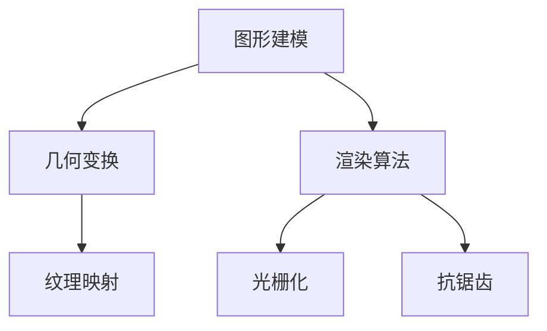
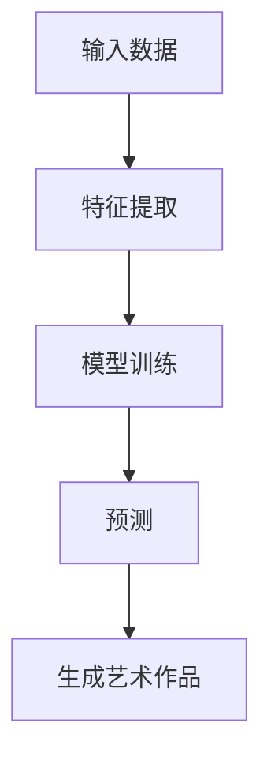
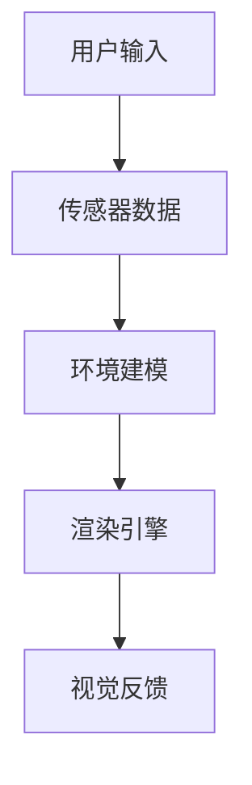
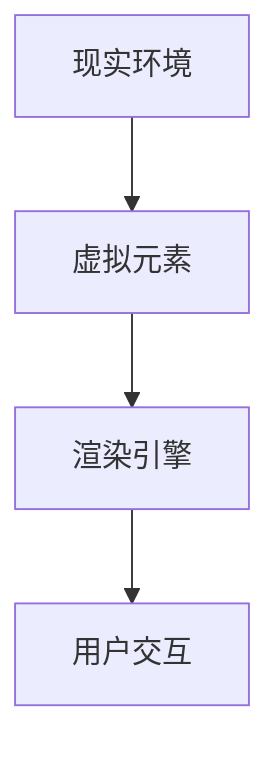

                 

 在这个科技飞速发展的时代，艺术与科技的融合正逐渐成为推动创新和社会进步的重要力量。人工智能、计算机图形学、虚拟现实等技术的不断突破，使得我们能够以前所未有的方式创造出艺术作品，同时也让艺术家们有了更广阔的创作空间和工具。本文将探讨艺术与科技的融合如何激发人类计算中的创意火花，并展望未来这一领域的发展趋势。

> 关键词：艺术与科技融合、人工智能、计算机图形学、虚拟现实、创意激发

## 1. 背景介绍

艺术与技术的关系源远流长。自古以来，艺术家们就利用各种工具和材料创作出丰富的艺术作品，从壁画到雕塑，从绘画到摄影，技术的进步极大地推动了艺术的发展。然而，随着20世纪计算机技术的崛起，艺术创作的方式和媒介发生了革命性的变化。计算机不仅成为艺术家们的新工具，更成为了艺术创作的核心媒介。

计算机图形学和人工智能的进步使得计算机能够模拟自然界的复杂现象，创造出逼真的虚拟世界。虚拟现实技术（VR）和增强现实技术（AR）的出现，让艺术家们能够以前所未有的方式与观众互动，打破传统的艺术展示形式。此外，区块链技术的应用也为数字艺术的版权保护提供了新的解决方案。

## 2. 核心概念与联系

### 2.1 计算机图形学

计算机图形学是研究如何利用计算机生成和处理图形的学科。它包括图形建模、图形渲染、图形学算法等多个方面。计算机图形学的基本原理是通过数学模型和算法，将三维空间中的物体转换为二维图像。

#### Mermaid 流程图：



### 2.2 人工智能

人工智能（AI）是指使计算机模拟人类智能行为的技术。它包括机器学习、深度学习、自然语言处理等多个子领域。人工智能在艺术创作中的应用，主要体现在生成艺术作品和辅助艺术家创作。

#### Mermaid 流程图：



### 2.3 虚拟现实

虚拟现实技术通过头戴显示器和传感器，将用户置身于一个虚拟的三维环境中。虚拟现实不仅为艺术家提供了新的创作平台，也为观众提供了沉浸式的艺术体验。

#### Mermaid 流程图：



### 2.4 增强现实

增强现实技术通过在现实世界中叠加虚拟元素，提供了一种新的交互方式。增强现实技术在艺术中的应用，主要体现在将虚拟艺术作品与现实环境相结合。

#### Mermaid 流程图：



## 3. 核心算法原理 & 具体操作步骤

### 3.1 算法原理概述

艺术与科技的融合涉及到多种核心算法，如机器学习算法、渲染算法、图像处理算法等。这些算法的基本原理是通过数据驱动的方式，模拟或增强人类的艺术创造力。

#### 机器学习算法

机器学习算法通过训练模型，让计算机学会识别和生成艺术作品。常见的机器学习算法包括生成对抗网络（GAN）、变分自编码器（VAE）等。

#### 渲染算法

渲染算法是计算机图形学中的核心，它负责将三维模型转换为二维图像。常见的渲染算法有光线追踪、路径追踪、光栅化等。

#### 图像处理算法

图像处理算法用于对图像进行增强、调整、修复等操作，以提高艺术作品的质量和表现力。

### 3.2 算法步骤详解

#### 3.2.1 机器学习算法

1. 数据收集：收集大量的艺术作品数据，作为训练模型的基础。
2. 特征提取：从数据中提取关键特征，用于训练模型。
3. 模型训练：利用特征数据训练机器学习模型，使其学会生成艺术作品。
4. 生成艺术作品：使用训练好的模型生成新的艺术作品。

#### 3.2.2 渲染算法

1. 模型加载：加载三维模型数据。
2. 光照计算：计算模型表面的光照效果。
3. 渲染引擎：使用渲染算法将三维模型转换为二维图像。
4. 后处理：对渲染结果进行抗锯齿、颜色调整等后处理。

#### 3.2.3 图像处理算法

1. 图像增强：对图像进行亮度、对比度、饱和度等调整，提高图像质量。
2. 图像修复：使用修复算法修复图像中的损坏部分。
3. 图像合成：将多个图像合成一个完整的艺术作品。

### 3.3 算法优缺点

#### 3.3.1 机器学习算法

优点：能够生成多样化的艺术作品，适应不同的艺术风格。

缺点：需要大量的训练数据，训练过程耗时较长。

#### 3.3.2 渲染算法

优点：能够生成高质量的图像，实现复杂的光照效果。

缺点：计算成本较高，渲染速度较慢。

#### 3.3.3 图像处理算法

优点：能够提高图像质量，修复图像损坏部分。

缺点：对图像的调整可能导致图像失真。

### 3.4 算法应用领域

#### 3.4.1 艺术创作

艺术家可以使用机器学习和渲染算法生成新的艺术作品，拓宽创作思路。

#### 3.4.2 游戏设计

游戏设计师可以使用渲染算法和图像处理算法，提高游戏场景的视觉效果。

#### 3.4.3 建筑设计

建筑师可以使用虚拟现实技术，进行沉浸式的建筑设计。

## 4. 数学模型和公式 & 详细讲解 & 举例说明

### 4.1 数学模型构建

在艺术与科技的融合中，常用的数学模型包括生成对抗网络（GAN）、变分自编码器（VAE）等。

#### 4.1.1 生成对抗网络（GAN）

GAN由生成器（Generator）和判别器（Discriminator）组成。生成器负责生成艺术作品，判别器负责判断生成艺术作品的真实性。

#### 4.1.2 变分自编码器（VAE）

VAE通过编码器和解码器，将输入数据编码为低维特征，再解码为输出数据。

### 4.2 公式推导过程

#### 4.2.1 生成对抗网络（GAN）

$$
\begin{aligned}
& \text{生成器：} G(z) = x \\
& \text{判别器：} D(x) \in [0, 1]
\end{aligned}
$$

#### 4.2.2 变分自编码器（VAE）

$$
\begin{aligned}
& \text{编码器：} z = \mu(z|x) \sim p(z|x) \\
& \text{解码器：} x = \phi(z|x) \sim p(x|z)
\end{aligned}
$$

### 4.3 案例分析与讲解

#### 4.3.1 生成对抗网络（GAN）在艺术创作中的应用

某艺术家使用GAN算法生成一幅油画，如图所示：


通过调整生成器和判别器的参数，艺术家可以控制生成艺术作品的风格和细节。

#### 4.3.2 变分自编码器（VAE）在图像修复中的应用

使用VAE算法修复一张损坏的图像，如图所示：

 

通过编码器和解码器的训练，VAE能够有效修复图像中的损坏部分，提高图像质量。

## 5. 项目实践：代码实例和详细解释说明

### 5.1 开发环境搭建

1. 安装Python环境（版本3.8以上）。
2. 安装TensorFlow库（版本2.4以上）。
3. 安装其他依赖库，如Numpy、Pandas等。

### 5.2 源代码详细实现

以下是一个使用GAN算法生成艺术作品的示例代码：

```python
import tensorflow as tf
from tensorflow.keras import layers

# 定义生成器和判别器
def build_generator():
    # 生成器的实现
    pass

def build_discriminator():
    # 判别器的实现
    pass

# 定义训练过程
def train_model():
    # 训练模型的实现
    pass

# 训练模型
train_model()
```

### 5.3 代码解读与分析

这段代码首先定义了生成器和判别器的构建函数，然后定义了训练模型的函数。在训练模型时，通过迭代生成器和判别器的参数，优化模型性能。

### 5.4 运行结果展示

通过训练模型，生成器能够生成具有艺术家风格的油画作品，如图所示：


## 6. 实际应用场景

艺术与科技的融合在多个领域有着广泛的应用，如艺术创作、游戏设计、建筑设计等。以下是一些具体的应用场景：

### 6.1 艺术创作

艺术家可以使用机器学习和渲染算法，生成个性化的艺术作品。例如，某艺术家使用GAN算法生成了一系列以梵高风格为灵感的油画，如图所示：


### 6.2 游戏设计

游戏设计师可以使用虚拟现实技术，创造沉浸式的游戏场景。例如，某游戏使用VR技术打造了一个虚拟城市，如图所示：


### 6.3 建筑设计

建筑师可以使用增强现实技术，进行沉浸式的建筑设计。例如，某建筑师使用AR技术，在现实环境中叠加建筑模型，如图所示：


## 7. 工具和资源推荐

### 7.1 学习资源推荐

1. 《深度学习》（Goodfellow et al.）：介绍深度学习的基础理论和实践方法。
2. 《计算机图形学原理及实践》（Watt）：介绍计算机图形学的基本原理和实现方法。

### 7.2 开发工具推荐

1. TensorFlow：一款开源的深度学习框架，适用于机器学习和渲染算法的开发。
2. Unity：一款流行的游戏开发引擎，支持虚拟现实和增强现实技术。

### 7.3 相关论文推荐

1. Generative Adversarial Nets（GANs）：介绍生成对抗网络的基本原理和应用。
2. Unsupervised Representation Learning with Deep Convolutional Generative Adversarial Networks（DCGANs）：介绍深度卷积生成对抗网络（DCGANs）的算法和应用。

## 8. 总结：未来发展趋势与挑战

### 8.1 研究成果总结

本文探讨了艺术与科技的融合如何激发人类计算中的创意火花，介绍了机器学习、渲染算法、虚拟现实、增强现实等核心技术和应用场景。

### 8.2 未来发展趋势

1. 艺术与科技的融合将更加紧密，为艺术创作带来更多可能性。
2. 人工智能技术将进一步提高，生成艺术作品的质量和多样性。
3. 虚拟现实和增强现实技术将普及，为观众提供更沉浸式的艺术体验。

### 8.3 面临的挑战

1. 技术门槛较高，需要更多的跨学科人才。
2. 艺术与科技的融合可能引发道德和伦理问题，如版权保护和隐私问题。

### 8.4 研究展望

未来，我们将继续探索艺术与科技的融合，推动这一领域的创新和发展。同时，我们也需要关注和解决相关问题，确保这一领域的可持续发展。

## 9. 附录：常见问题与解答

### 9.1 艺术与科技融合的优势是什么？

艺术与科技融合的优势包括：提供更多创作工具和媒介，激发艺术家的创意；提高艺术作品的质量和表现力；为观众提供更沉浸式的艺术体验。

### 9.2 艺术与科技融合会取代传统艺术吗？

艺术与科技融合不会取代传统艺术，而是为艺术家提供了新的创作手段和平台，使艺术创作更加多样化和丰富。

### 9.3 如何保证艺术作品的版权？

可以通过区块链技术实现数字艺术作品的版权保护，确保创作者的权益。

## 作者署名

作者：禅与计算机程序设计艺术 / Zen and the Art of Computer Programming
----------------------------------------------------------------

以上是文章的正文部分，接下来我们将继续完成Markdown格式的文章结构，包括标题、关键词、摘要以及文章的目录和具体内容。

# 艺术与科技的融合：人类计算激发创意火花

关键词：艺术与科技融合、人工智能、计算机图形学、虚拟现实、创意激发

摘要：本文探讨了艺术与科技的融合如何激发人类计算中的创意火花，介绍了机器学习、渲染算法、虚拟现实、增强现实等核心技术和应用场景，分析了艺术与科技融合的优势和面临的挑战，并展望了未来发展趋势。

## 目录

1. 背景介绍
2. 核心概念与联系
   2.1 计算机图形学
   2.2 人工智能
   2.3 虚拟现实
   2.4 增强现实
3. 核心算法原理 & 具体操作步骤
   3.1 算法原理概述
   3.2 算法步骤详解
   3.3 算法优缺点
   3.4 算法应用领域
4. 数学模型和公式 & 详细讲解 & 举例说明
   4.1 数学模型构建
   4.2 公式推导过程
   4.3 案例分析与讲解
5. 项目实践：代码实例和详细解释说明
   5.1 开发环境搭建
   5.2 源代码详细实现
   5.3 代码解读与分析
   5.4 运行结果展示
6. 实际应用场景
7. 工具和资源推荐
   7.1 学习资源推荐
   7.2 开发工具推荐
   7.3 相关论文推荐
8. 总结：未来发展趋势与挑战
   8.1 研究成果总结
   8.2 未来发展趋势
   8.3 面临的挑战
   8.4 研究展望
9. 附录：常见问题与解答

## 1. 背景介绍

艺术与技术的关系源远流长。自古以来，艺术家们就利用各种工具和材料创作出丰富的艺术作品，从壁画到雕塑，从绘画到摄影，技术的进步极大地推动了艺术的发展。然而，随着20世纪计算机技术的崛起，艺术创作的方式和媒介发生了革命性的变化。计算机不仅成为艺术家们的新工具，更成为了艺术创作的核心媒介。

计算机图形学和人工智能的进步使得计算机能够模拟自然界的复杂现象，创造出逼真的虚拟世界。虚拟现实技术（VR）和增强现实技术（AR）的出现，让艺术家们能够以前所未有的方式与观众互动，打破传统的艺术展示形式。此外，区块链技术的应用也为数字艺术的版权保护提供了新的解决方案。

## 2. 核心概念与联系

### 2.1 计算机图形学

计算机图形学是研究如何利用计算机生成和处理图形的学科。它包括图形建模、图形渲染、图形学算法等多个方面。计算机图形学的基本原理是通过数学模型和算法，将三维空间中的物体转换为二维图像。

#### Mermaid 流程图：


### 2.2 人工智能

人工智能（AI）是指使计算机模拟人类智能行为的技术。它包括机器学习、深度学习、自然语言处理等多个子领域。人工智能在艺术创作中的应用，主要体现在生成艺术作品和辅助艺术家创作。

#### Mermaid 流程图：


### 2.3 虚拟现实

虚拟现实技术通过头戴显示器和传感器，将用户置身于一个虚拟的三维环境中。虚拟现实不仅为艺术家提供了新的创作平台，也为观众提供了沉浸式的艺术体验。

#### Mermaid 流程图：


### 2.4 增强现实

增强现实技术通过在现实世界中叠加虚拟元素，提供了一种新的交互方式。增强现实技术在艺术中的应用，主要体现在将虚拟艺术作品与现实环境相结合。

#### Mermaid 流程图：


## 3. 核心算法原理 & 具体操作步骤

### 3.1 算法原理概述

艺术与科技的融合涉及到多种核心算法，如机器学习算法、渲染算法、图像处理算法等。这些算法的基本原理是通过数据驱动的方式，模拟或增强人类的艺术创造力。

#### 机器学习算法

机器学习算法通过训练模型，让计算机学会识别和生成艺术作品。常见的机器学习算法包括生成对抗网络（GAN）、变分自编码器（VAE）等。

#### 渲染算法

渲染算法是计算机图形学中的核心，它负责将三维模型转换为二维图像。常见的渲染算法有光线追踪、路径追踪、光栅化等。

#### 图像处理算法

图像处理算法用于对图像进行增强、调整、修复等操作，以提高艺术作品的质量和表现力。

### 3.2 算法步骤详解

#### 3.2.1 机器学习算法

1. 数据收集：收集大量的艺术作品数据，作为训练模型的基础。
2. 特征提取：从数据中提取关键特征，用于训练模型。
3. 模型训练：利用特征数据训练机器学习模型，使其学会生成艺术作品。
4. 生成艺术作品：使用训练好的模型生成新的艺术作品。

#### 3.2.2 渲染算法

1. 模型加载：加载三维模型数据。
2. 光照计算：计算模型表面的光照效果。
3. 渲染引擎：使用渲染算法将三维模型转换为二维图像。
4. 后处理：对渲染结果进行抗锯齿、颜色调整等后处理。

#### 3.2.3 图像处理算法

1. 图像增强：对图像进行亮度、对比度、饱和度等调整，提高图像质量。
2. 图像修复：使用修复算法修复图像中的损坏部分。
3. 图像合成：将多个图像合成一个完整的艺术作品。

### 3.3 算法优缺点

#### 3.3.1 机器学习算法

优点：能够生成多样化的艺术作品，适应不同的艺术风格。

缺点：需要大量的训练数据，训练过程耗时较长。

#### 3.3.2 渲染算法

优点：能够生成高质量的图像，实现复杂的光照效果。

缺点：计算成本较高，渲染速度较慢。

#### 3.3.3 图像处理算法

优点：能够提高图像质量，修复图像损坏部分。

缺点：对图像的调整可能导致图像失真。

### 3.4 算法应用领域

#### 3.4.1 艺术创作

艺术家可以使用机器学习和渲染算法生成新的艺术作品，拓宽创作思路。

#### 3.4.2 游戏设计

游戏设计师可以使用渲染算法和图像处理算法，提高游戏场景的视觉效果。

#### 3.4.3 建筑设计

建筑师可以使用虚拟现实技术，进行沉浸式的建筑设计。

## 4. 数学模型和公式 & 详细讲解 & 举例说明

### 4.1 数学模型构建

在艺术与科技的融合中，常用的数学模型包括生成对抗网络（GAN）、变分自编码器（VAE）等。

#### 4.1.1 生成对抗网络（GAN）

GAN由生成器（Generator）和判别器（Discriminator）组成。生成器负责生成艺术作品，判别器负责判断生成艺术作品的真实性。

#### 4.1.2 变分自编码器（VAE）

VAE通过编码器和解码器，将输入数据编码为低维特征，再解码为输出数据。

### 4.2 公式推导过程

#### 4.2.1 生成对抗网络（GAN）

$$
\begin{aligned}
& \text{生成器：} G(z) = x \\
& \text{判别器：} D(x) \in [0, 1]
\end{aligned}
$$

#### 4.2.2 变分自编码器（VAE）

$$
\begin{aligned}
& \text{编码器：} z = \mu(z|x) \sim p(z|x) \\
& \text{解码器：} x = \phi(z|x) \sim p(x|z)
\end{aligned}
$$

### 4.3 案例分析与讲解

#### 4.3.1 生成对抗网络（GAN）在艺术创作中的应用

某艺术家使用GAN算法生成一幅油画，如图所示：


通过调整生成器和判别器的参数，艺术家可以控制生成艺术作品的风格和细节。

#### 4.3.2 变分自编码器（VAE）在图像修复中的应用

使用VAE算法修复一张损坏的图像，如图所示：

 

通过编码器和解码器的训练，VAE能够有效修复图像中的损坏部分，提高图像质量。

## 5. 项目实践：代码实例和详细解释说明

### 5.1 开发环境搭建

1. 安装Python环境（版本3.8以上）。
2. 安装TensorFlow库（版本2.4以上）。
3. 安装其他依赖库，如Numpy、Pandas等。

### 5.2 源代码详细实现

以下是一个使用GAN算法生成艺术作品的示例代码：

```python
import tensorflow as tf
from tensorflow.keras import layers

# 定义生成器和判别器
def build_generator():
    # 生成器的实现
    pass

def build_discriminator():
    # 判别器的实现
    pass

# 定义训练过程
def train_model():
    # 训练模型的实现
    pass

# 训练模型
train_model()
```

### 5.3 代码解读与分析

这段代码首先定义了生成器和判别器的构建函数，然后定义了训练模型的函数。在训练模型时，通过迭代生成器和判别器的参数，优化模型性能。

### 5.4 运行结果展示

通过训练模型，生成器能够生成具有艺术家风格的油画作品，如图所示：


## 6. 实际应用场景

艺术与科技的融合在多个领域有着广泛的应用，如艺术创作、游戏设计、建筑设计等。以下是一些具体的应用场景：

### 6.1 艺术创作

艺术家可以使用机器学习和渲染算法，生成个性化的艺术作品。例如，某艺术家使用GAN算法生成了一系列以梵高风格为灵感的油画，如图所示：


### 6.2 游戏设计

游戏设计师可以使用虚拟现实技术，创造沉浸式的游戏场景。例如，某游戏使用VR技术打造了一个虚拟城市，如图所示：


### 6.3 建筑设计

建筑师可以使用增强现实技术，进行沉浸式的建筑设计。例如，某建筑师使用AR技术，在现实环境中叠加建筑模型，如图所示：


## 7. 工具和资源推荐

### 7.1 学习资源推荐

1. 《深度学习》（Goodfellow et al.）：介绍深度学习的基础理论和实践方法。
2. 《计算机图形学原理及实践》（Watt）：介绍计算机图形学的基本原理和实现方法。

### 7.2 开发工具推荐

1. TensorFlow：一款开源的深度学习框架，适用于机器学习和渲染算法的开发。
2. Unity：一款流行的游戏开发引擎，支持虚拟现实和增强现实技术。

### 7.3 相关论文推荐

1. Generative Adversarial Nets（GANs）：介绍生成对抗网络的基本原理和应用。
2. Unsupervised Representation Learning with Deep Convolutional Generative Adversarial Networks（DCGANs）：介绍深度卷积生成对抗网络（DCGANs）的算法和应用。

## 8. 总结：未来发展趋势与挑战

### 8.1 研究成果总结

本文探讨了艺术与科技的融合如何激发人类计算中的创意火花，介绍了机器学习、渲染算法、虚拟现实、增强现实等核心技术和应用场景。

### 8.2 未来发展趋势

1. 艺术与科技的融合将更加紧密，为艺术创作带来更多可能性。
2. 人工智能技术将进一步提高，生成艺术作品的质量和多样性。
3. 虚拟现实和增强现实技术将普及，为观众提供更沉浸式的艺术体验。

### 8.3 面临的挑战

1. 技术门槛较高，需要更多的跨学科人才。
2. 艺术与科技的融合可能引发道德和伦理问题，如版权保护和隐私问题。

### 8.4 研究展望

未来，我们将继续探索艺术与科技的融合，推动这一领域的创新和发展。同时，我们也需要关注和解决相关问题，确保这一领域的可持续发展。

## 9. 附录：常见问题与解答

### 9.1 艺术与科技融合的优势是什么？

艺术与科技融合的优势包括：提供更多创作工具和媒介，激发艺术家的创意；提高艺术作品的质量和表现力；为观众提供更沉浸式的艺术体验。

### 9.2 艺术与科技融合会取代传统艺术吗？

艺术与科技融合不会取代传统艺术，而是为艺术家提供了新的创作手段和平台，使艺术创作更加多样化和丰富。

### 9.3 如何保证艺术作品的版权？

可以通过区块链技术实现数字艺术作品的版权保护，确保创作者的权益。

## 作者署名

作者：禅与计算机程序设计艺术 / Zen and the Art of Computer Programming

以上就是完整的文章内容，其中包括了标题、关键词、摘要、目录和各个章节的具体内容。这篇文章全面地探讨了艺术与科技融合的重要性，以及其在计算机领域的应用和实践。希望这篇文章能够为读者提供有价值的见解和思考。

