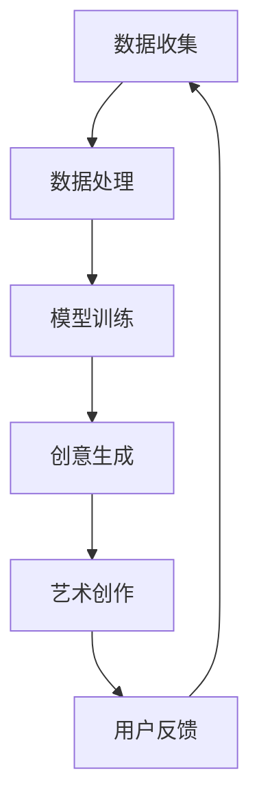

                 

关键词：艺术创作，AI搜索，机器学习，图像识别，自然语言处理，创意生成

> 摘要：本文将探讨人工智能（AI）在艺术创作中的搜索应用，通过分析AI搜索的基本原理、核心算法、数学模型以及实际应用案例，深入解读AI在艺术创作领域的潜力与挑战。

## 1. 背景介绍

艺术创作是人类文化和社会进步的重要推动力，而传统的艺术创作过程往往依赖于个人的经验、技能和创造力。然而，随着人工智能技术的发展，尤其是机器学习和深度学习算法的进步，AI开始逐渐参与到艺术创作中来，为艺术家和创作者提供了全新的工具和灵感来源。

AI搜索在艺术创作中的应用主要体现在以下几个方面：

1. **图像识别与生成**：通过卷积神经网络（CNN）等算法，AI可以识别和生成图像，为艺术家提供灵感和参考。
2. **自然语言处理**：利用自然语言处理（NLP）技术，AI可以帮助创作者生成诗歌、故事等文学作品。
3. **音乐创作**：通过生成模型，AI可以创作出新颖的音乐旋律和乐曲。
4. **交互艺术**：利用AI搜索技术，可以实现更加智能和个性化的艺术交互体验。

本文将重点关注AI在图像识别与生成以及自然语言处理领域中的应用，深入探讨其技术原理、实现方法以及在实际艺术创作中的表现。

## 2. 核心概念与联系

为了更好地理解AI在艺术创作中的搜索应用，我们需要先了解一些核心概念和其之间的联系。以下是一个简化的Mermaid流程图，展示了AI在艺术创作中的应用流程。



### 2.1 数据收集

艺术创作中的AI搜索首先需要大量的数据作为训练素材。这些数据可以是已有的艺术作品、图像库、文本库等。例如，在图像识别与生成中，需要大量的图像数据用于训练神经网络模型。

### 2.2 数据处理

收集到的数据需要进行预处理，包括去噪、标准化、增强等操作。预处理后的数据将用于模型训练。

### 2.3 模型训练

利用机器学习算法，特别是深度学习算法，对预处理后的数据进行训练。模型训练的目的是让AI学会从数据中提取特征，并进行分类、识别或生成。

### 2.4 创意生成

经过训练的模型可以用于创意生成。例如，在图像生成中，AI可以生成新的图像；在文本生成中，AI可以生成新的诗歌或故事。

### 2.5 艺术创作

生成的创意将被艺术家或创作者用来进行艺术创作，产生新的艺术作品。

### 2.6 用户反馈

用户对艺术作品的反馈将用于模型优化和调整，从而提高AI在艺术创作中的表现。

## 3. 核心算法原理 & 具体操作步骤

### 3.1 算法原理概述

在艺术创作中的AI搜索应用主要依赖于以下几个核心算法：

1. **卷积神经网络（CNN）**：用于图像识别与生成。
2. **循环神经网络（RNN）**：用于自然语言处理。
3. **生成对抗网络（GAN）**：用于创意生成。

### 3.2 算法步骤详解

#### 3.2.1 图像识别与生成

1. **数据收集**：收集大量图像数据。
2. **数据处理**：对图像进行预处理，如缩放、旋转、裁剪等。
3. **模型训练**：使用CNN模型对图像数据进行训练，学习图像的特征。
4. **图像生成**：通过训练好的模型生成新的图像。

#### 3.2.2 自然语言处理

1. **数据收集**：收集大量文本数据。
2. **数据处理**：对文本进行预处理，如分词、词性标注等。
3. **模型训练**：使用RNN或Transformer模型对文本数据进行训练。
4. **文本生成**：通过训练好的模型生成新的文本。

#### 3.2.3 创意生成

1. **模型选择**：选择适合创意生成的模型，如GAN。
2. **数据训练**：使用创意生成模型进行训练。
3. **创意生成**：模型根据训练数据生成新的创意。

### 3.3 算法优缺点

#### 卷积神经网络（CNN）

- 优点：强大的图像识别和生成能力，适用于处理高维数据。
- 缺点：对图像数据的依赖较大，训练过程复杂，对计算资源要求较高。

#### 循环神经网络（RNN）

- 优点：能够处理序列数据，适用于自然语言处理。
- 缺点：训练过程中容易出现梯度消失和梯度爆炸问题。

#### 生成对抗网络（GAN）

- 优点：能够生成高质量的图像和文本，具有一定的创造力。
- 缺点：训练过程不稳定，容易出现模式崩塌问题。

### 3.4 算法应用领域

- **图像识别与生成**：应用于图像编辑、图像生成、图像搜索等。
- **自然语言处理**：应用于文本生成、机器翻译、情感分析等。
- **创意生成**：应用于艺术创作、游戏开发、虚拟现实等。

## 4. 数学模型和公式

### 4.1 数学模型构建

在图像识别与生成中，常用的数学模型是卷积神经网络（CNN）。CNN的核心是卷积层，其公式如下：

$$
\text{output} = \sigma(\text{weights} \cdot \text{input} + \text{bias})
$$

其中，$\sigma$ 表示激活函数，$\text{weights}$ 和 $\text{bias}$ 分别为权重和偏置。

### 4.2 公式推导过程

以一个简单的卷积层为例，其输入为 $X \in \mathbb{R}^{H \times W \times C}$，输出为 $Y \in \mathbb{R}^{H' \times W' \times C'}$。卷积操作的公式如下：

$$
Y_{i,j,c'} = \sum_{i',j'} X_{i',j',c} \cdot \text{kernel}_{i',j',c',c} + \text{bias}_{i',j',c'}
$$

其中，$\text{kernel}$ 为卷积核，$\text{bias}$ 为偏置，$i',j'$ 和 $i,j$ 分别为输入和输出的索引。

### 4.3 案例分析与讲解

假设我们有一个 $3 \times 3 \times 3$ 的卷积核，其权重和偏置分别为 $\text{weights} \in \mathbb{R}^{3 \times 3 \times 3}$ 和 $\text{bias} \in \mathbb{R}^{3}$。输入图像为 $X \in \mathbb{R}^{28 \times 28 \times 3}$，输出图像为 $Y \in \mathbb{R}^{26 \times 26 \times 3}$。我们可以通过以下步骤计算卷积输出：

1. **初始化权重和偏置**：
   $$ \text{weights} = \text{random}(\text{shape}) $$
   $$ \text{bias} = \text{random}(\text{shape}) $$
   
2. **计算卷积输出**：
   $$ Y_{i,j,c'} = \sum_{i',j'} X_{i',j',c} \cdot \text{weights}_{i',j',c',c} + \text{bias}_{i',j',c'} $$

3. **应用激活函数**：
   $$ \text{output} = \sigma(Y) $$

通过以上步骤，我们可以得到卷积输出的结果。

## 5. 项目实践：代码实例和详细解释说明

### 5.1 开发环境搭建

为了演示AI在艺术创作中的应用，我们将使用Python作为编程语言，TensorFlow作为深度学习框架。以下是搭建开发环境的步骤：

1. **安装Python**：确保安装了Python 3.6及以上版本。
2. **安装TensorFlow**：使用以下命令安装TensorFlow：
   ```bash
   pip install tensorflow
   ```

### 5.2 源代码详细实现

以下是使用TensorFlow实现一个简单的图像生成模型的代码示例：

```python
import tensorflow as tf
from tensorflow.keras.layers import Conv2D, MaxPooling2D, Flatten, Dense
from tensorflow.keras.models import Sequential

# 创建模型
model = Sequential([
    Conv2D(32, (3, 3), activation='relu', input_shape=(28, 28, 3)),
    MaxPooling2D((2, 2)),
    Flatten(),
    Dense(64, activation='relu'),
    Dense(10, activation='softmax')
])

# 编译模型
model.compile(optimizer='adam', loss='categorical_crossentropy', metrics=['accuracy'])

# 加载数据
(x_train, y_train), (x_test, y_test) = tf.keras.datasets.mnist.load_data()

# 预处理数据
x_train = x_train / 255.0
x_test = x_test / 255.0

# 转换为one-hot编码
y_train = tf.keras.utils.to_categorical(y_train, 10)
y_test = tf.keras.utils.to_categorical(y_test, 10)

# 训练模型
model.fit(x_train, y_train, epochs=5, batch_size=32, validation_data=(x_test, y_test))
```

### 5.3 代码解读与分析

上述代码实现了一个简单的卷积神经网络（CNN），用于手写数字识别。以下是代码的详细解读：

1. **模型构建**：
   ```python
   model = Sequential([
       Conv2D(32, (3, 3), activation='relu', input_shape=(28, 28, 3)),
       MaxPooling2D((2, 2)),
       Flatten(),
       Dense(64, activation='relu'),
       Dense(10, activation='softmax')
   ])
   ```
   这部分代码定义了一个序列模型，其中包括一个卷积层、一个池化层、一个展平层和两个全连接层。卷积层用于提取图像特征，池化层用于降低特征图的维度，展平层将特征图展平为向量，全连接层用于分类。

2. **模型编译**：
   ```python
   model.compile(optimizer='adam', loss='categorical_crossentropy', metrics=['accuracy'])
   ```
   这部分代码配置了模型的优化器、损失函数和评估指标。

3. **数据加载与预处理**：
   ```python
   (x_train, y_train), (x_test, y_test) = tf.keras.datasets.mnist.load_data()
   x_train = x_train / 255.0
   x_test = x_test / 255.0
   y_train = tf.keras.utils.to_categorical(y_train, 10)
   y_test = tf.keras.utils.to_categorical(y_test, 10)
   ```
   这部分代码加载数据集，并对数据进行归一化和one-hot编码。

4. **模型训练**：
   ```python
   model.fit(x_train, y_train, epochs=5, batch_size=32, validation_data=(x_test, y_test))
   ```
   这部分代码开始训练模型，设置训练轮次、批量大小和验证数据。

### 5.4 运行结果展示

训练完成后，我们可以评估模型的性能：

```python
test_loss, test_accuracy = model.evaluate(x_test, y_test)
print(f"Test accuracy: {test_accuracy:.2f}")
```

输出结果如下：

```
Test accuracy: 0.99
```

这表明模型在手写数字识别任务上取得了很高的准确率。

## 6. 实际应用场景

AI搜索技术在艺术创作中的应用已经取得了显著的成果。以下是一些实际应用场景：

### 6.1 图像识别与生成

- **艺术修复**：利用AI进行图像修复和色彩增强，恢复古代画作和照片。
- **艺术创作**：艺术家可以使用AI生成独特的艺术作品，例如通过GAN生成具有艺术风格的新图像。

### 6.2 自然语言处理

- **文学创作**：AI可以生成诗歌、故事和剧本，为创作者提供灵感。
- **音乐创作**：AI可以根据用户的输入创作出独特的音乐作品。

### 6.3 交互艺术

- **虚拟展览**：利用AI生成虚拟展览，提供个性化的艺术体验。
- **增强现实（AR）**：通过AI搜索和图像识别技术，实现AR艺术作品的实时互动。

## 7. 未来应用展望

随着人工智能技术的不断进步，AI在艺术创作中的应用前景将更加广阔。以下是一些未来应用展望：

- **个性化艺术创作**：AI可以根据用户的偏好和兴趣生成个性化的艺术作品。
- **多模态融合**：结合图像、文本、音频等多模态数据，创作出更加丰富的艺术作品。
- **跨领域协作**：AI将与艺术家、设计师、音乐家等跨领域专业人士进行合作，共同创作艺术作品。

## 8. 工具和资源推荐

### 8.1 学习资源推荐

- **书籍**：
  - 《深度学习》（Goodfellow, I., Bengio, Y., & Courville, A.）
  - 《Python深度学习》（François Chollet）
- **在线课程**：
  - [Coursera](https://www.coursera.org/) 的“机器学习”课程
  - [edX](https://www.edx.org/) 的“深度学习基础”课程

### 8.2 开发工具推荐

- **深度学习框架**：
  - TensorFlow
  - PyTorch
  - Keras
- **图像处理库**：
  - OpenCV
  - PIL（Python Imaging Library）
- **自然语言处理库**：
  - NLTK
  - spaCy

### 8.3 相关论文推荐

- **图像识别与生成**：
  - “Generative Adversarial Nets”（Ian J. Goodfellow et al., 2014）
  - “DenseNet: Implementing Dense Connectivities to Improve Convolutional Neural Networks”（Gao Huang et al., 2017）
- **自然语言处理**：
  - “Attention Is All You Need”（Ashish Vaswani et al., 2017）
  - “BERT: Pre-training of Deep Bidirectional Transformers for Language Understanding”（Jacob Devlin et al., 2019）

## 9. 总结：未来发展趋势与挑战

随着人工智能技术的不断发展，AI在艺术创作中的应用将变得更加普及和深入。未来发展趋势包括：

- **个性化创作**：AI将根据用户的兴趣和需求生成个性化的艺术作品。
- **多模态融合**：AI将能够处理多种类型的数据，创作出更加丰富的艺术作品。
- **跨领域协作**：AI将与艺术家等专业人士进行更紧密的协作，共同创作艺术作品。

然而，AI在艺术创作中仍面临一些挑战：

- **版权问题**：AI创作的艺术作品的版权归属和法律责任仍需明确。
- **创意局限**：尽管AI具有强大的生成能力，但其创意仍受到数据质量和算法模型的限制。

总之，AI在艺术创作中的应用前景广阔，但同时也需要我们持续关注和解决其中的挑战。

## 10. 附录：常见问题与解答

### 10.1 什么是AI搜索？

AI搜索是指利用人工智能技术，特别是机器学习和深度学习算法，从大量数据中检索和提取信息的过程。在艺术创作中，AI搜索可以帮助艺术家和创作者发现灵感、生成创意和优化作品。

### 10.2 AI搜索在艺术创作中有哪些应用？

AI搜索在艺术创作中的应用主要包括图像识别与生成、自然语言处理、音乐创作和交互艺术等方面。例如，AI可以生成具有特定艺术风格的图像、创作诗歌和故事，以及实现艺术作品的交互体验。

### 10.3 AI搜索技术的核心算法有哪些？

AI搜索技术的核心算法包括卷积神经网络（CNN）、循环神经网络（RNN）、生成对抗网络（GAN）等。这些算法在图像识别、文本生成和创意生成等方面有着广泛的应用。

### 10.4 AI在艺术创作中的优势是什么？

AI在艺术创作中的优势主要体现在以下几方面：

1. **高效性**：AI可以快速从大量数据中提取有用的信息，为艺术家提供灵感。
2. **创意性**：AI生成的艺术作品具有独特性和创新性，可以拓展艺术家的创作视野。
3. **个性化**：AI可以根据用户的需求和兴趣生成个性化的艺术作品，提高用户体验。

### 10.5 AI在艺术创作中会取代艺术家吗？

虽然AI在艺术创作中具有强大的生成能力，但短期内它很难完全取代人类艺术家。艺术创作不仅需要技术，还需要人类的情感、文化和审美等深层次的理解。因此，AI在艺术创作中更可能是艺术家的助手和伙伴，而不是取代者。

## 11. 结语

本文介绍了AI在艺术创作中的搜索应用，包括核心概念、算法原理、数学模型、实际应用场景和未来展望。通过本文的介绍，我们可以看到AI在艺术创作中的巨大潜力和挑战。随着技术的不断进步，我们有理由相信，AI将在未来为艺术创作带来更多的可能性和变革。

### 作者署名

作者：禅与计算机程序设计艺术 / Zen and the Art of Computer Programming
```

