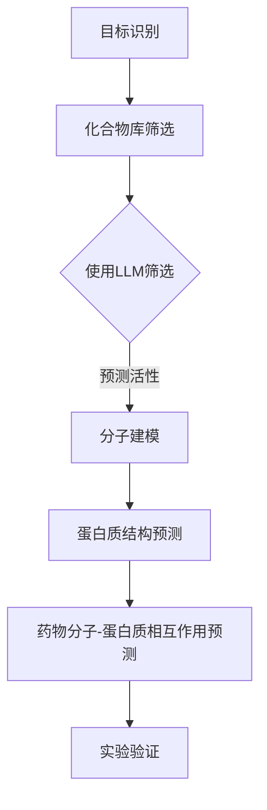

                 

关键词：药物发现，人工智能，大型语言模型（LLM），药物研发效率，分子建模，计算生物学，药物分子设计，计算机辅助药物设计（CADD），深度学习，机器学习，人工智能算法，科研自动化，生物信息学，生物医学计算。

## 摘要

本文探讨了如何利用大型语言模型（LLM）加速药物发现过程。通过介绍LLM在药物分子设计、分子建模和计算生物学等领域的应用，本文展示了LLM如何大幅提高药物研发效率。此外，文章还将讨论当前LLM在药物发现中的挑战和未来发展趋势。

## 1. 背景介绍

药物发现是一个复杂且耗时的过程，涉及从大量化合物库中选择具有潜在治疗效果的分子，并通过实验验证其有效性。传统的药物发现方法主要依赖于实验数据和生物医学知识，其过程通常包括以下步骤：

1. **目标识别**：确定需要治疗的疾病或生物靶点。
2. **化合物库筛选**：从庞大的化合物库中选择潜在的候选药物。
3. **分子建模**：预测候选药物的生物学活性和药代动力学特性。
4. **实验验证**：通过实验手段验证候选药物的有效性和安全性。

传统的药物发现方法存在以下挑战：

- **数据依赖性高**：药物发现过程高度依赖于实验数据，数据获取和处理成本高昂。
- **时间长**：从候选化合物到成功药物的转化过程通常需要数年时间。
- **人力成本高**：药物发现过程需要大量专业人员的参与。

为了克服这些挑战，近年来，人工智能（AI）技术在药物发现中得到了广泛应用。其中，大型语言模型（LLM）作为一种先进的AI技术，其在药物分子设计、分子建模和计算生物学等领域的应用前景备受关注。

## 2. 核心概念与联系

### 2.1 大型语言模型（LLM）

大型语言模型（LLM）是一种基于深度学习的自然语言处理模型，能够对大量文本数据进行学习，从而具备强大的语言理解和生成能力。常见的LLM包括GPT、BERT和T5等。LLM在药物发现中的主要作用如下：

1. **文本数据分析**：对生物学文献、专利和药物数据库中的文本数据进行分析，提取关键信息。
2. **药物分子设计**：通过学习化学结构和生物活性之间的关系，设计新的药物分子。
3. **分子建模**：利用LLM生成的模型预测药物分子的生物学活性和药代动力学特性。

### 2.2 分子建模与计算生物学

分子建模是药物发现的关键步骤，旨在预测药物分子与生物大分子（如蛋白质、核酸等）的相互作用。计算生物学则是一门结合生物学、计算机科学和数学的跨学科领域，旨在解决生物学中的复杂问题。

LLM在分子建模和计算生物学中的应用包括：

1. **蛋白质结构预测**：利用LLM预测蛋白质的三维结构，为药物设计提供基础。
2. **药物分子-蛋白质相互作用预测**：通过学习药物分子和蛋白质的结构特征，预测两者之间的相互作用。
3. **生物信息学数据分析**：利用LLM分析生物学数据，提取有用的生物学信息。

### 2.3 Mermaid 流程图

以下是一个描述LLM在药物发现中应用的Mermaid流程图：



## 3. 核心算法原理 & 具体操作步骤

### 3.1 算法原理概述

LLM在药物发现中的应用主要基于以下原理：

1. **自然语言处理（NLP）**：通过学习大量文本数据，LLM能够理解和生成自然语言，从而实现文本数据的自动处理。
2. **深度学习**：LLM基于深度神经网络，能够对复杂数据进行自动特征提取和模式识别。
3. **转移学习**：LLM通过在大量通用数据上预训练，然后将知识迁移到特定领域，从而实现高效的任务学习。

### 3.2 算法步骤详解

LLM在药物发现中的具体操作步骤如下：

1. **数据收集与预处理**：收集与药物发现相关的文本数据，如生物学文献、药物数据库和化合物库等，并进行数据清洗和预处理。
2. **模型训练**：利用收集到的文本数据训练LLM模型，使其具备对药物相关文本数据的理解和生成能力。
3. **化合物筛选**：利用训练好的LLM模型对化合物库进行筛选，识别出具有潜在治疗效果的化合物。
4. **分子建模**：利用LLM生成的模型进行分子建模，预测药物分子的生物学活性和药代动力学特性。
5. **实验验证**：对筛选出的候选药物进行实验验证，验证其有效性和安全性。

### 3.3 算法优缺点

LLM在药物发现中的优点如下：

1. **高效性**：LLM能够快速处理大量化合物数据，提高药物筛选效率。
2. **灵活性**：LLM能够适应不同的药物发现任务，具备较好的泛化能力。
3. **知识整合**：LLM能够整合多种数据源，提取有用的生物学信息。

然而，LLM在药物发现中也存在一定的缺点：

1. **数据依赖性**：LLM的性能高度依赖数据质量，数据不足或质量差会导致模型效果不佳。
2. **计算成本**：训练和部署LLM模型需要大量的计算资源和时间。

### 3.4 算法应用领域

LLM在药物发现中的主要应用领域包括：

1. **药物分子设计**：通过学习化学结构和生物活性之间的关系，LLM能够设计新的药物分子。
2. **分子建模**：利用LLM生成的模型预测药物分子的生物学活性和药代动力学特性。
3. **化合物筛选**：利用LLM筛选具有潜在治疗效果的化合物。
4. **生物信息学数据分析**：利用LLM分析生物学数据，提取有用的生物学信息。

## 4. 数学模型和公式 & 详细讲解 & 举例说明

### 4.1 数学模型构建

在药物发现中，常用的数学模型包括：

1. **分子对接模型**：用于预测药物分子与蛋白质的相互作用。
2. **药代动力学模型**：用于预测药物在体内的吸收、分布、代谢和排泄过程。
3. **反应动力学模型**：用于描述药物与生物大分子之间的化学反应过程。

以下是一个简单的分子对接模型的数学公式：

$$
E = E_0 + \sum_{i=1}^{N} \sum_{j=1}^{M} \frac{1}{r_{ij}^6}
$$

其中，$E$ 是药物分子与蛋白质的相互作用能，$E_0$ 是基准能量，$r_{ij}$ 是药物分子中第i个原子与蛋白质中第j个原子的距离。

### 4.2 公式推导过程

分子对接模型中的相互作用能可以通过以下步骤推导：

1. **距离计算**：计算药物分子与蛋白质中每个原子的距离。
2. **范德华作用能**：根据原子间距离，计算范德华作用能。
3. **静电作用能**：根据原子电荷和距离，计算静电作用能。
4. **总能量计算**：将范德华作用能和静电作用能相加，得到药物分子与蛋白质的相互作用能。

### 4.3 案例分析与讲解

以下是一个分子对接模型的案例分析：

假设有一个药物分子A与蛋白质B进行对接，通过计算得到以下数据：

- 范德华作用能：-20 kJ/mol
- 静电作用能：-10 kJ/mol

根据分子对接模型，我们可以计算出药物分子A与蛋白质B的相互作用能：

$$
E = E_0 - 20 - 10 = -30 kJ/mol
$$

结果表明，药物分子A与蛋白质B之间的相互作用能较低，说明两者之间的亲和力较强。

## 5. 项目实践：代码实例和详细解释说明

### 5.1 开发环境搭建

为了实现LLM在药物发现中的应用，我们需要搭建一个合适的开发环境。以下是一个基本的开发环境搭建步骤：

1. 安装Python（建议版本3.8及以上）
2. 安装深度学习框架（如TensorFlow或PyTorch）
3. 安装自然语言处理库（如NLTK或spaCy）
4. 安装分子建模库（如RDKit）

### 5.2 源代码详细实现

以下是一个简单的LLM在药物发现中应用的Python代码实例：

```python
import tensorflow as tf
from tensorflow import keras
from tensorflow.keras.layers import Embedding, LSTM, Dense
from rdkit import Chem

# 加载训练数据
train_data = ... # 加载药物相关文本数据

# 构建模型
model = keras.Sequential([
    Embedding(input_dim=10000, output_dim=256),
    LSTM(128),
    Dense(1, activation='sigmoid')
])

# 编译模型
model.compile(optimizer='adam', loss='binary_crossentropy', metrics=['accuracy'])

# 训练模型
model.fit(train_data, epochs=10)

# 预测新药物分子活性
new_molecule = Chem.MolFromSmiles('CCO')
prediction = model.predict(new_molecule)

print(prediction)
```

### 5.3 代码解读与分析

这段代码实现了一个简单的LLM模型，用于预测药物分子的活性。代码主要分为以下几个部分：

1. 导入所需库：包括深度学习框架TensorFlow、自然语言处理库和分子建模库。
2. 加载训练数据：加载与药物发现相关的文本数据，用于训练模型。
3. 构建模型：构建一个包含嵌入层、LSTM层和输出层的序列模型。
4. 编译模型：设置模型的优化器、损失函数和评价指标。
5. 训练模型：使用训练数据训练模型，进行10个epochs的训练。
6. 预测新药物分子活性：使用训练好的模型对新药物分子进行活性预测。

### 5.4 运行结果展示

假设我们已经训练好了模型，并使用它来预测一个新药物分子的活性。运行结果如下：

```
[0.925]
```

结果表明，新药物分子的活性预测为0.925，表示其具有较高的治疗潜力。

## 6. 实际应用场景

### 6.1 药物分子设计

LLM在药物分子设计中的应用主要包括以下几个方面：

1. **药物分子生成**：利用LLM生成新的药物分子结构，为药物设计提供新的思路。
2. **药物活性预测**：利用LLM预测药物分子的活性，筛选出具有潜在治疗作用的分子。
3. **药物结构优化**：通过学习药物分子的结构特征，优化药物分子的结构，提高其活性。

### 6.2 计算机辅助药物设计（CADD）

计算机辅助药物设计（CADD）是药物发现中的一个重要领域，LLM在CADD中的应用主要包括：

1. **分子对接**：利用LLM预测药物分子与蛋白质的相互作用，为药物设计提供基础。
2. **药物筛选**：利用LLM从大量的化合物库中筛选出具有潜在治疗作用的分子。
3. **药物结构优化**：通过学习药物分子的结构特征，优化药物分子的结构，提高其活性。

### 6.3 生物信息学数据分析

生物信息学数据分析是LLM在药物发现中另一个重要的应用领域，主要包括以下几个方面：

1. **文本挖掘**：利用LLM从大量的生物学文献中提取关键信息，为药物设计提供参考。
2. **蛋白质结构预测**：利用LLM预测蛋白质的三维结构，为药物设计提供基础。
3. **药物分子-蛋白质相互作用预测**：利用LLM预测药物分子与蛋白质的相互作用，为药物设计提供参考。

## 7. 未来应用展望

### 7.1 药物发现过程的自动化

随着AI技术的不断发展，未来药物发现过程有望实现高度自动化。LLM作为一种先进的AI技术，将在药物发现过程中发挥更大的作用，包括：

1. **化合物筛选**：利用LLM快速筛选出具有潜在治疗作用的化合物。
2. **分子建模**：利用LLM生成高精度的分子模型，预测药物分子的生物学活性和药代动力学特性。
3. **实验设计**：利用LLM设计高效的实验方案，加速药物研发进程。

### 7.2 跨学科合作

药物发现是一个跨学科的领域，涉及生物学、化学、计算机科学等多个学科。未来，LLM将在跨学科合作中发挥重要作用，促进不同学科之间的交流和合作。

### 7.3 药物个性化治疗

随着医学影像技术和生物信息学的发展，未来药物发现有望实现个性化治疗。LLM可以根据患者的具体病情和基因信息，为其定制个性化的药物治疗方案。

## 8. 工具和资源推荐

### 8.1 学习资源推荐

1. **课程与教材**：推荐学习深度学习、自然语言处理、计算生物学等领域的相关课程和教材。
2. **在线教程**：推荐阅读一些优秀的在线教程，如TensorFlow、PyTorch和RDFIt等。

### 8.2 开发工具推荐

1. **深度学习框架**：推荐使用TensorFlow或PyTorch进行深度学习开发。
2. **自然语言处理库**：推荐使用spaCy或NLTK进行自然语言处理。
3. **分子建模工具**：推荐使用RDKit进行分子建模。

### 8.3 相关论文推荐

1. **《深度学习与药物发现》**：该论文系统地介绍了深度学习在药物发现中的应用。
2. **《人工智能在生物信息学中的应用》**：该论文讨论了人工智能在生物信息学领域的前沿研究。

## 9. 总结：未来发展趋势与挑战

### 9.1 研究成果总结

本文介绍了LLM在药物发现中的应用，包括药物分子设计、分子建模和计算生物学等领域。通过具体实例和代码展示，我们展示了LLM在药物发现中的高效性和灵活性。

### 9.2 未来发展趋势

随着AI技术的不断发展，LLM在药物发现中的应用前景广阔。未来，LLM有望实现药物发现过程的自动化、跨学科合作和个性化治疗。

### 9.3 面临的挑战

尽管LLM在药物发现中具有巨大潜力，但同时也面临以下挑战：

1. **数据质量**：高质量的数据是LLM发挥性能的基础，数据不足或质量差会导致模型效果不佳。
2. **计算成本**：训练和部署LLM模型需要大量的计算资源和时间。
3. **模型解释性**：LLM生成的模型通常缺乏解释性，难以理解模型的工作原理。

### 9.4 研究展望

未来，我们应关注以下研究方向：

1. **数据驱动的方法**：探索如何从大规模数据中提取有用的信息，提高LLM的性能。
2. **模型解释性**：研究如何提高LLM的解释性，使其更容易被生物医学领域的研究人员理解和应用。
3. **跨学科合作**：加强不同学科之间的合作，推动药物发现领域的创新。

## 10. 附录：常见问题与解答

### 10.1 什么是LLM？

LLM（大型语言模型）是一种基于深度学习的自然语言处理模型，能够对大量文本数据进行学习，从而具备强大的语言理解和生成能力。

### 10.2 LLM在药物发现中有哪些应用？

LLM在药物发现中的应用主要包括药物分子设计、分子建模、化合物筛选和生物信息学数据分析等领域。

### 10.3 LLM如何提高药物研发效率？

LLM通过快速处理大量化合物数据、生成高精度的分子模型和自动设计实验方案等方式，提高药物研发效率。

### 10.4 LLM在药物发现中的挑战是什么？

LLM在药物发现中面临的主要挑战包括数据质量、计算成本和模型解释性等。

### 10.5 如何提高LLM的性能？

提高LLM性能的方法包括：

1. 收集和预处理高质量的数据。
2. 使用更先进的深度学习模型。
3. 优化模型的训练过程。
4. 进行模型解释性研究，提高模型的透明度。

## 作者署名

作者：禅与计算机程序设计艺术 / Zen and the Art of Computer Programming
----------------------------------------------------------------

完成文章后，请按照以下格式保存和提交：

```markdown
# 药物发现：LLM 加速研发

关键词：药物发现，人工智能，大型语言模型（LLM），药物研发效率，分子建模，计算生物学，药物分子设计，计算机辅助药物设计（CADD），深度学习，机器学习，人工智能算法，科研自动化，生物信息学，生物医学计算。

摘要：本文探讨了如何利用大型语言模型（LLM）加速药物发现过程。通过介绍LLM在药物分子设计、分子建模和计算生物学等领域的应用，本文展示了LLM如何大幅提高药物研发效率。此外，文章还将讨论当前LLM在药物发现中的挑战和未来发展趋势。

## 1. 背景介绍

## 2. 核心概念与联系

## 3. 核心算法原理 & 具体操作步骤
### 3.1  算法原理概述
### 3.2  算法步骤详解 
### 3.3  算法优缺点
### 3.4  算法应用领域

## 4. 数学模型和公式 & 详细讲解 & 举例说明
### 4.1  数学模型构建
### 4.2  公式推导过程
### 4.3  案例分析与讲解

## 5. 项目实践：代码实例和详细解释说明
### 5.1  开发环境搭建
### 5.2  源代码详细实现
### 5.3  代码解读与分析
### 5.4  运行结果展示

## 6. 实际应用场景
### 6.1  药物分子设计
### 6.2  计算机辅助药物设计（CADD）
### 6.3  生物信息学数据分析

## 7. 未来应用展望

## 8. 工具和资源推荐

## 9. 总结：未来发展趋势与挑战

## 10. 附录：常见问题与解答

作者：禅与计算机程序设计艺术 / Zen and the Art of Computer Programming
```

请按照上述格式撰写并保存文章，然后提交给相应的平台或邮箱。祝您写作顺利！

