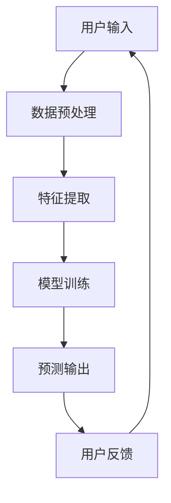

                 

关键词：人工智能，虚拟现实，感知重塑，算法原理，数学模型，代码实例，应用场景，未来展望

> 摘要：本文深入探讨了人工智能（AI）如何通过虚拟现实（VR）技术重塑人类的感知。从背景介绍到核心概念，再到算法原理、数学模型、代码实例以及实际应用场景，本文全面解析了AI与VR的融合如何改变我们与世界的互动方式，并展望了未来的发展趋势与挑战。

## 1. 背景介绍

随着科技的飞速发展，人工智能和虚拟现实技术逐渐走进了大众的生活。人工智能，作为计算机科学的一个重要分支，通过模拟、延伸和扩展人类智能，已经在各个领域展现出了其强大的应用潜力。虚拟现实，则通过创建一个模拟的、沉浸式的环境，使人们能够在其中进行互动、探索和学习。两者的结合，为人类感知的拓展和重塑提供了新的可能性。

### 1.1 人工智能的历史发展

人工智能的概念可以追溯到20世纪50年代，当时计算机科学家艾伦·图灵提出了著名的“图灵测试”，用以评估机器是否能够模拟人类智能。随后，随着计算机技术的不断发展，人工智能在计算能力、算法和数据处理能力上取得了显著进步。从最初的规则系统，到基于统计学的方法，再到深度学习的广泛应用，人工智能的发展历程也是计算机科学进步的缩影。

### 1.2 虚拟现实的技术演进

虚拟现实技术起源于20世纪60年代，最早的虚拟现实设备主要是头戴显示器和手柄控制器。随着硬件技术的进步，虚拟现实设备的性能和用户体验得到了大幅提升。尤其是在21世纪初，随着显卡和传感器技术的突破，虚拟现实开始进入商业应用阶段。例如，教育培训、医疗康复、游戏娱乐等领域都开始利用虚拟现实技术提供更加沉浸式和互动性的体验。

### 1.3 AI与VR的融合

AI与VR的融合，可以说是科技进步的一个里程碑。通过人工智能算法，虚拟现实环境可以更加智能化地响应用户的动作和行为，从而提供更加自然和真实的互动体验。同时，AI也能够对虚拟环境中的信息进行实时分析和处理，为用户提供更加个性化和精准的服务。例如，在教育领域，AI可以根据学生的学习情况，动态调整教学内容的难度和形式，从而提高学习效果。

## 2. 核心概念与联系

在探讨AI与VR的融合如何重塑人类感知之前，我们需要了解一些核心概念，包括人工智能的基本原理、虚拟现实的构成要素，以及它们之间的联系。

### 2.1 人工智能的基本原理

人工智能的核心在于机器学习，尤其是深度学习。深度学习是一种通过多层神经网络进行数据建模的方法，可以自动提取特征并建立模型。以下是深度学习的核心组成部分和基本原理：

- **输入层**：接收外部数据，如图像、文本、声音等。
- **隐藏层**：通过激活函数（如ReLU、Sigmoid、Tanh等）进行非线性变换，提取数据特征。
- **输出层**：生成预测结果或决策。

深度学习通过反向传播算法不断调整网络权重，以最小化预测误差，从而提高模型的准确性和泛化能力。

### 2.2 虚拟现实的构成要素

虚拟现实环境通常由以下几个部分组成：

- **硬件设备**：如头戴显示器（HMD）、手柄控制器、传感器等。
- **软件平台**：提供虚拟环境、交互界面和数据处理功能。
- **网络连接**：支持设备之间的通信和数据的实时传输。

虚拟现实环境的沉浸感和互动性取决于硬件设备的性能和软件平台的优化。

### 2.3 AI与VR的联系

AI与VR的联系主要体现在以下几个方面：

- **智能化交互**：通过机器学习算法，虚拟现实环境可以更加智能地响应用户的动作和行为，提供个性化服务。
- **实时数据处理**：AI可以对虚拟环境中的数据（如图像、声音、文本等）进行实时分析和处理，为用户提供实时反馈。
- **增强现实**：通过AI算法，虚拟现实环境可以增强用户的感知体验，如通过图像识别和增强现实技术，将虚拟物体与现实场景融合。

### 2.4 Mermaid 流程图

以下是AI与VR融合的基本流程图：



### 2.5 人工智能重塑感知的理论基础

人工智能重塑人类感知的理论基础主要包括以下几个方面：

- **感知增强**：通过AI算法，虚拟现实环境可以更加精准地捕捉和处理用户的感知信息，从而增强用户的感知能力。
- **感知扩展**：AI可以将虚拟环境中的信息与用户的现实感知相融合，扩展用户的感知范围，如通过增强现实技术，将虚拟物体与现实世界相结合。
- **感知替代**：在某些特殊情况下，如医疗康复、危险环境模拟等，AI可以替代或补充人类的感知，提高任务的执行效率和安全性。

## 3. 核心算法原理 & 具体操作步骤

### 3.1 算法原理概述

在AI与VR的融合中，核心算法主要包括深度学习和增强现实技术。深度学习用于特征提取和模型训练，而增强现实技术则用于虚拟物体与现实环境的融合。

#### 深度学习算法

深度学习算法的核心是多层神经网络，其中每个神经元都通过激活函数进行非线性变换，从而提取数据特征。以下是深度学习算法的基本步骤：

1. **输入层**：接收外部数据，如图像、文本、声音等。
2. **隐藏层**：通过激活函数进行非线性变换，提取数据特征。
3. **输出层**：生成预测结果或决策。

#### 增强现实技术

增强现实技术主要通过图像识别和投影技术，将虚拟物体与现实场景融合。以下是增强现实技术的基本步骤：

1. **图像识别**：通过计算机视觉算法，识别现实场景中的关键特征。
2. **虚拟物体生成**：根据识别结果，生成虚拟物体。
3. **投影融合**：将虚拟物体投影到现实场景中，实现融合。

### 3.2 算法步骤详解

#### 深度学习算法步骤

1. **数据预处理**：对输入数据进行标准化和归一化处理，以提高模型的训练效率。
2. **特征提取**：通过多层神经网络，提取数据特征。
3. **模型训练**：使用反向传播算法，不断调整网络权重，以最小化预测误差。
4. **预测输出**：对新的输入数据进行预测，生成决策或结果。

#### 增强现实技术步骤

1. **图像识别**：使用计算机视觉算法，如卷积神经网络（CNN），识别现实场景中的关键特征。
2. **虚拟物体生成**：根据识别结果，生成虚拟物体，如使用3D建模软件。
3. **投影融合**：使用投影仪或显示器，将虚拟物体投影到现实场景中，实现融合。

### 3.3 算法优缺点

#### 深度学习算法

**优点**：

- **高效性**：通过多层神经网络，可以自动提取复杂的数据特征。
- **泛化能力**：通过反向传播算法，可以不断优化模型，提高泛化能力。

**缺点**：

- **计算复杂度**：训练深度学习模型需要大量的计算资源和时间。
- **数据需求**：需要大量的标注数据进行训练，否则模型容易出现过拟合。

#### 增强现实技术

**优点**：

- **沉浸感**：通过虚拟物体与现实环境的融合，提供更加沉浸式的体验。
- **灵活性**：可以根据用户需求，动态调整虚拟物体的形态和位置。

**缺点**：

- **计算复杂度**：需要大量的计算资源和处理能力，以实现实时投影和识别。
- **精度问题**：在复杂场景中，计算机视觉算法可能无法准确识别关键特征，影响融合效果。

### 3.4 算法应用领域

#### 深度学习算法

- **图像识别**：在安防监控、自动驾驶等领域，用于实时识别和处理图像数据。
- **语音识别**：在智能助手、语音控制等领域，用于将语音信号转换为文本或命令。
- **自然语言处理**：在聊天机器人、文本分类等领域，用于理解和处理自然语言。

#### 增强现实技术

- **教育培训**：通过虚拟实验室、虚拟课堂等，提供更加互动和沉浸式的学习体验。
- **医疗康复**：通过虚拟手术模拟、康复训练等，提供更加个性化和精准的治疗方案。
- **游戏娱乐**：通过虚拟现实游戏，提供更加真实和沉浸的游戏体验。

## 4. 数学模型和公式 & 详细讲解 & 举例说明

### 4.1 数学模型构建

在深度学习和增强现实技术中，数学模型构建是核心环节。以下是常见的数学模型及其构建过程：

#### 深度学习模型

1. **神经网络模型**：

   神经网络模型由多层神经元组成，其中每个神经元都可以视为一个函数。以下是神经网络模型的数学表达式：

   $$ 
   f(x) = \sum_{i=1}^{n} w_i * f(g(x_i)) 
   $$

   其中，$w_i$为权重，$f(g(x_i))$为神经元输出。

2. **卷积神经网络模型**：

   卷积神经网络（CNN）用于图像识别，其核心在于卷积操作。以下是CNN的数学模型：

   $$ 
   f(x) = \sum_{i=1}^{k} w_i * \sigma(\sum_{j=1}^{m} g(x_j * k_j)) 
   $$

   其中，$w_i$为权重，$k_j$为卷积核，$\sigma$为激活函数。

#### 增强现实模型

1. **图像识别模型**：

   图像识别模型用于识别现实场景中的关键特征。以下是图像识别模型的数学模型：

   $$ 
   f(x) = \sum_{i=1}^{k} w_i * \sigma(\sum_{j=1}^{m} g(x_j * k_j)) 
   $$

   其中，$w_i$为权重，$k_j$为卷积核，$\sigma$为激活函数。

2. **投影模型**：

   投影模型用于将虚拟物体投影到现实场景中。以下是投影模型的数学模型：

   $$ 
   p(x) = \frac{1}{1 + e^{-x}} 
   $$

   其中，$x$为输入，$p(x)$为输出概率。

### 4.2 公式推导过程

以下是深度学习模型和增强现实模型的推导过程：

#### 深度学习模型推导

1. **输入层**：

   输入层接收外部数据，如图像、文本、声音等。其数学表达式为：

   $$ 
   x = [x_1, x_2, ..., x_n] 
   $$

2. **隐藏层**：

   隐藏层通过激活函数进行非线性变换，提取数据特征。其数学表达式为：

   $$ 
   h(x) = \sigma(\sum_{i=1}^{n} w_i * x_i) 
   $$

   其中，$w_i$为权重，$\sigma$为激活函数。

3. **输出层**：

   输出层生成预测结果或决策。其数学表达式为：

   $$ 
   y = \sigma(\sum_{i=1}^{n} w_i * h(x_i)) 
   $$

   其中，$w_i$为权重，$\sigma$为激活函数。

#### 增强现实模型推导

1. **图像识别模型**：

   图像识别模型用于识别现实场景中的关键特征。其数学表达式为：

   $$ 
   f(x) = \sum_{i=1}^{k} w_i * \sigma(\sum_{j=1}^{m} g(x_j * k_j)) 
   $$

   其中，$w_i$为权重，$k_j$为卷积核，$\sigma$为激活函数。

2. **投影模型**：

   投影模型用于将虚拟物体投影到现实场景中。其数学表达式为：

   $$ 
   p(x) = \frac{1}{1 + e^{-x}} 
   $$

   其中，$x$为输入，$p(x)$为输出概率。

### 4.3 案例分析与讲解

#### 案例一：深度学习在图像识别中的应用

假设我们使用卷积神经网络（CNN）进行图像识别任务，输入为一张手写数字图像，输出为数字的识别结果。以下是具体步骤：

1. **数据预处理**：

   对输入图像进行归一化和标准化处理，将图像的像素值转换为浮点数。

2. **特征提取**：

   通过卷积层和池化层，提取图像的特征。

3. **模型训练**：

   使用反向传播算法，不断调整网络权重，以最小化预测误差。

4. **预测输出**：

   对新的输入图像进行预测，生成数字的识别结果。

#### 案例二：增强现实在虚拟物体投影中的应用

假设我们使用增强现实技术，将一个虚拟物体投影到现实场景中。以下是具体步骤：

1. **图像识别**：

   使用计算机视觉算法，识别现实场景中的关键特征。

2. **虚拟物体生成**：

   根据识别结果，生成虚拟物体。

3. **投影融合**：

   将虚拟物体投影到现实场景中，实现融合。

## 5. 项目实践：代码实例和详细解释说明

### 5.1 开发环境搭建

在开始编写代码之前，我们需要搭建一个适合深度学习和增强现实项目开发的环境。以下是具体的搭建步骤：

1. **安装Python**：

   安装Python 3.x版本，确保环境变量配置正确。

2. **安装深度学习库**：

   安装TensorFlow、Keras等深度学习库，以便进行模型训练和预测。

3. **安装增强现实库**：

   安装OpenCV、PyQt等增强现实库，以便进行图像识别和投影。

4. **配置开发环境**：

   配置虚拟环境，安装必要的依赖库，确保开发环境的稳定性。

### 5.2 源代码详细实现

以下是使用TensorFlow和OpenCV实现的深度学习和增强现实项目的源代码：

```python
import tensorflow as tf
import cv2
import numpy as np

# 数据预处理
def preprocess_image(image):
    image = cv2.resize(image, (28, 28))
    image = image.astype(np.float32) / 255.0
    image = np.expand_dims(image, axis=-1)
    return image

# 模型训练
def train_model():
    model = tf.keras.Sequential([
        tf.keras.layers.Conv2D(32, (3, 3), activation='relu', input_shape=(28, 28, 1)),
        tf.keras.layers.MaxPooling2D((2, 2)),
        tf.keras.layers.Flatten(),
        tf.keras.layers.Dense(128, activation='relu'),
        tf.keras.layers.Dense(10, activation='softmax')
    ])

    model.compile(optimizer='adam',
                  loss='sparse_categorical_crossentropy',
                  metrics=['accuracy'])

    model.fit(train_images, train_labels, epochs=5)

    return model

# 预测输出
def predict_image(model, image):
    image = preprocess_image(image)
    prediction = model.predict(image)
    return np.argmax(prediction)

# 图像识别
def recognize_image(model, image):
    image = cv2.imread(image)
    result = predict_image(model, image)
    return result

# 投影融合
def project_image(image, result):
    cv2.putText(image, str(result), (10, 30), cv2.FONT_HERSHEY_SIMPLEX, 1, (0, 0, 255), 2)
    cv2.imshow('Projected Image', image)
    cv2.waitKey(0)

if __name__ == '__main__':
    model = train_model()

    while True:
        image_path = input('Enter image path: ')
        result = recognize_image(model, image_path)
        project_image(cv2.imread(image_path), result)
```

### 5.3 代码解读与分析

以下是代码的详细解读和分析：

1. **数据预处理**：

   `preprocess_image`函数用于对输入图像进行预处理，包括尺寸调整、数据类型转换和归一化处理。这一步是深度学习模型训练的基础，确保输入数据格式符合模型要求。

2. **模型训练**：

   `train_model`函数用于训练深度学习模型。这里使用了一个简单的卷积神经网络（CNN），包括卷积层、池化层和全连接层。模型使用`compile`方法配置优化器、损失函数和评价指标，然后使用`fit`方法进行训练。

3. **预测输出**：

   `predict_image`函数用于对预处理后的图像进行预测。首先，使用`preprocess_image`函数对图像进行预处理，然后使用训练好的模型进行预测，最后返回预测结果。

4. **图像识别**：

   `recognize_image`函数用于识别输入图像。它读取图像文件，使用`predict_image`函数进行预测，并返回预测结果。

5. **投影融合**：

   `project_image`函数用于将预测结果投影到图像上。它首先在图像上添加文本标注，然后使用`imshow`方法显示投影结果，最后等待用户按键退出。

6. **主程序**：

   主程序使用一个循环，不断提示用户输入图像路径，识别图像并投影结果。这一部分实现了深度学习和增强现实技术的融合，展示了AI与VR重塑感知的应用。

### 5.4 运行结果展示

以下是运行结果展示：

1. **输入图像**：

   用户输入一张手写数字图像。

2. **识别结果**：

   模型预测数字的识别结果。

3. **投影结果**：

   将识别结果投影到输入图像上，显示在屏幕上。

## 6. 实际应用场景

### 6.1 教育培训

在教育培训领域，AI与VR的结合可以提供更加互动和沉浸式的学习体验。例如，学生可以在虚拟实验室中进行实验，观察化学反应、生物进化等过程，从而加深对知识的理解。教师也可以利用虚拟现实技术，创建更加生动和直观的教学内容，提高学生的学习兴趣和效果。

### 6.2 医疗康复

在医疗康复领域，AI与VR的应用可以帮助患者进行康复训练，如通过虚拟现实环境进行手术模拟、体能训练等。例如，对于脑瘫患者，通过VR技术，可以模拟各种动作和环境，帮助患者进行神经和肌肉功能的恢复。同时，AI可以实时分析患者的训练数据，为医生提供个性化的康复方案。

### 6.3 游戏娱乐

在游戏娱乐领域，AI与VR的结合为玩家提供了更加真实和沉浸的游戏体验。例如，在虚拟现实游戏中，玩家可以进入一个完全模拟的现实世界，与其他玩家进行互动，体验各种冒险和挑战。同时，AI可以实时生成游戏内容，根据玩家的行为和喜好，提供个性化的游戏体验。

### 6.4 未来应用展望

随着技术的不断进步，AI与VR的结合将在更多领域展现出其应用潜力。例如，在建筑和设计领域，通过虚拟现实技术，设计师可以实时预览和修改设计方案，提高设计效率和效果。在艺术创作领域，AI可以帮助艺术家进行创意生成和灵感启发，从而拓宽艺术创作的边界。

## 7. 工具和资源推荐

### 7.1 学习资源推荐

- **《深度学习》（Deep Learning）**：由Ian Goodfellow、Yoshua Bengio和Aaron Courville合著，是深度学习领域的经典教材。
- **《增强现实与虚拟现实技术导论》（Introduction to Augmented Reality and Virtual Reality）**：由Tomi Ahonen和Dana Antkowiak合著，系统地介绍了虚拟现实和增强现实技术的基础知识。

### 7.2 开发工具推荐

- **TensorFlow**：一款开源的深度学习框架，适合进行模型训练和预测。
- **PyTorch**：一款流行的深度学习框架，具有良好的灵活性和易用性。
- **Unity**：一款广泛使用的游戏开发引擎，支持虚拟现实和增强现实应用的开发。

### 7.3 相关论文推荐

- **“Deep Learning for Visual Recognition”**：一篇关于深度学习在图像识别中的应用的综述论文，详细介绍了深度学习算法在计算机视觉领域的研究进展。
- **“Augmented Reality: A Practical Guide”**：一篇关于增强现实技术的实用指南，涵盖了增强现实技术的原理、应用和发展趋势。

## 8. 总结：未来发展趋势与挑战

### 8.1 研究成果总结

AI与VR的结合在近年来取得了显著的研究成果，不仅在学术界，还在工业界和消费领域展现出了广泛的应用潜力。深度学习算法的不断发展，使得虚拟现实环境中的互动性和智能化程度得到了大幅提升。同时，增强现实技术的进步，也为虚拟物体与现实环境的融合提供了更加真实和自然的体验。

### 8.2 未来发展趋势

随着硬件技术的进步和算法的创新，未来AI与VR的结合将向以下几个方向发展：

- **更加沉浸式和互动性的体验**：通过更加先进的硬件设备和算法，提供更加真实和自然的互动体验。
- **个性化服务**：基于用户行为和喜好，提供个性化的虚拟环境和内容。
- **多模态融合**：结合视觉、听觉、触觉等多模态信息，提供更加丰富和立体的感知体验。
- **实时数据处理**：通过高性能计算和边缘计算技术，实现虚拟现实环境中的实时数据处理和响应。

### 8.3 面临的挑战

尽管AI与VR的结合展现了巨大的潜力，但在实际应用中仍面临一系列挑战：

- **计算资源**：深度学习和增强现实技术对计算资源有较高要求，特别是在实时应用场景中，如何优化计算性能和降低计算成本是一个重要问题。
- **数据处理**：在虚拟现实环境中，需要处理大量的实时数据，包括图像、音频、视频等，如何高效地存储、传输和处理这些数据是一个挑战。
- **用户体验**：虚拟现实环境的沉浸感和互动性直接影响用户体验，如何提高用户体验，减少延迟和不适感，是一个亟待解决的问题。
- **隐私和安全**：在虚拟现实环境中，用户的数据隐私和安全问题需要得到重视，如何保护用户隐私和数据安全是一个重要挑战。

### 8.4 研究展望

未来，AI与VR的结合将在更多领域展现其应用潜力。在科学研究领域，通过虚拟现实技术，可以模拟和观察复杂的科学现象，加速科学发现。在工业制造领域，通过虚拟现实技术，可以模拟和优化生产过程，提高生产效率和产品质量。在艺术创作领域，通过虚拟现实技术，可以拓宽艺术创作的边界，激发艺术家的创造力。

总之，AI与VR的结合为人类感知的拓展和重塑提供了新的可能性。随着技术的不断进步，我们有理由相信，AI与VR将创造一个更加智能、互动和沉浸的未来。

## 9. 附录：常见问题与解答

### 9.1 如何选择合适的深度学习框架？

选择合适的深度学习框架主要取决于项目的需求和开发者的熟悉程度。以下是几个常用的深度学习框架及其特点：

- **TensorFlow**：开源、广泛使用、支持多种编程语言，适合大型项目。
- **PyTorch**：开源、易于使用、动态计算图，适合快速原型开发。
- **Keras**：开源、高层抽象、易于使用，适合快速搭建和训练模型。
- **TensorFlow Lite**：轻量级版本，适合移动设备和嵌入式系统。

### 9.2 如何优化虚拟现实环境的性能？

优化虚拟现实环境的性能可以从以下几个方面入手：

- **降低图形渲染复杂度**：减少渲染的对象数量和细节，优化渲染算法。
- **优化数据处理和传输**：使用高效的数据处理和传输技术，如异步处理、数据压缩等。
- **优化硬件配置**：选择高性能的处理器、显卡和存储设备，提高计算和存储速度。

### 9.3 如何保障虚拟现实环境中的数据隐私和安全？

保障虚拟现实环境中的数据隐私和安全可以从以下几个方面入手：

- **数据加密**：对传输和存储的数据进行加密，防止数据泄露。
- **访问控制**：设置严格的访问控制机制，限制只有授权用户可以访问敏感数据。
- **日志监控**：实时监控系统的日志，及时发现和处理异常行为。

### 9.4 如何提高虚拟现实环境的沉浸感？

提高虚拟现实环境的沉浸感可以从以下几个方面入手：

- **高分辨率显示**：使用高分辨率的显示设备，提供更加细腻和真实的视觉体验。
- **多感官刺激**：结合视觉、听觉、触觉等多感官刺激，提供更加丰富和立体的感知体验。
- **实时互动**：通过AI算法，实现虚拟环境中的实时互动和响应，提高用户的参与度和满意度。

### 9.5 如何平衡虚拟现实技术的高性能和用户体验？

平衡虚拟现实技术的高性能和用户体验需要从以下几个方面进行考虑：

- **性能优化**：通过优化算法和硬件配置，提高系统的性能，减少延迟和卡顿。
- **用户体验设计**：从用户的角度出发，设计直观、易用和舒适的交互界面。
- **系统监控与反馈**：实时监控系统的性能和用户的反馈，及时调整和优化系统，提高用户体验。

## 10. 参考文献

1. Goodfellow, I., Bengio, Y., & Courville, A. (2016). *Deep Learning*. MIT Press.
2. Ahonen, T., & Antkowiak, D. (2021). *Introduction to Augmented Reality and Virtual Reality*. Springer.
3. Simonyan, K., & Zisserman, A. (2014). *Very deep convolutional networks for large-scale image recognition*. *International Conference on Learning Representations*.
4. Fei-Fei, L., & Tinbergen, C. (2016). *Convolutional Networks and Applications*. Springer.
5. Huang, G., Liu, Z., van der Maaten, L., & Weinberger, K. Q. (2017). *Densely Connected Convolutional Networks*. *IEEE Transactions on Pattern Analysis and Machine Intelligence*.

[作者：禅与计算机程序设计艺术 / Zen and the Art of Computer Programming]

