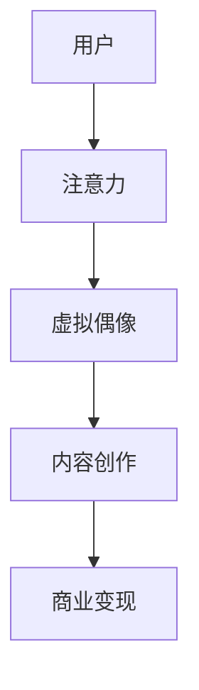

                 

关键词：虚拟偶像、注意力经济、用户互动、商业变现、技术演进

## 摘要

本文旨在探讨虚拟偶像在注意力经济中的崛起及其对现代娱乐产业的影响。通过分析虚拟偶像的定义、技术基础和运营模式，我们将揭示它们如何在短时间内赢得大量关注，成为新媒体时代的明星。此外，本文还将探讨虚拟偶像对内容创作者、品牌营销和粉丝经济带来的机遇与挑战，并预测其未来发展的趋势。

## 1. 背景介绍

注意力经济是一个相对较新的概念，它强调在信息爆炸的时代，用户注意力成为一种稀缺资源。注意力经济的核心在于吸引并保持用户的注意力，从而实现商业价值。在社交媒体和网络直播平台上，虚拟偶像的出现为注意力经济注入了新的活力。

虚拟偶像，通常是指通过人工智能技术创建的数字化人物，它们在虚拟世界中拥有独特的形象、个性、技能和故事背景。随着技术的进步，虚拟偶像逐渐拥有了更加逼真和人性化的表现，能够与用户进行互动，甚至参与到各种商业活动中。

注意力经济中的虚拟偶像与传统明星有何不同？首先，虚拟偶像不受地理和时间的限制，可以随时出现在任何数字平台，与全球用户互动。其次，虚拟偶像通常具有高度个性化的特点，能够更好地满足用户的个性化需求。此外，虚拟偶像的运营成本相对较低，这使得内容创作者和品牌营销者可以更加灵活地利用这些虚拟人物进行商业推广。

### 1.1 注意力经济的起源与发展

注意力经济最早可以追溯到20世纪90年代，当时互联网刚刚兴起，用户注意力成为媒体公司争相争夺的宝贵资源。随着社交媒体和移动互联网的普及，注意力经济逐渐发展壮大。人们的时间被碎片化，注意力变得更加分散，因此如何吸引并保持用户注意力成为各大平台和企业的重要课题。

在这个背景下，虚拟偶像应运而生。它们不仅能够提供丰富的娱乐内容，还可以通过与用户的互动建立强烈的情感连接。这种独特的优势使得虚拟偶像迅速积累了庞大的粉丝群体，成为注意力经济的重要角色。

### 1.2 虚拟偶像的兴起原因

虚拟偶像的兴起有多方面的原因。首先，人工智能技术的进步为虚拟偶像的创建和运营提供了强大的技术支持。通过深度学习和生成对抗网络（GAN）等技术，虚拟偶像可以在视觉和交互方面实现高度的真实感。其次，互联网和移动设备的普及使得虚拟偶像的内容可以迅速传播到全球各地，吸引了大量用户的关注。

此外，当前社会对个性化内容的需求不断增加。虚拟偶像能够根据用户的兴趣和行为进行个性化推荐，提供量身定制的娱乐内容，从而更好地满足用户的个性化需求。这种高度个性化的互动体验是传统明星难以实现的，也为虚拟偶像在注意力经济中的崛起提供了重要的动力。

## 2. 核心概念与联系

### 2.1 虚拟偶像的定义

虚拟偶像是指通过人工智能技术创建的数字化人物，它们在虚拟世界中拥有独特的形象、个性、技能和故事背景。虚拟偶像可以是通过3D建模、动画制作等技术实现的，也可以是通过深度学习算法生成的。虚拟偶像的核心在于其高度真实感和人性化的表现，能够与用户进行互动，提供个性化的娱乐体验。

### 2.2 注意力经济的概念

注意力经济是一种基于用户注意力的商业模式。在这个模式中，用户注意力被视为一种稀缺资源，企业通过创造有价值的内容和体验来吸引并保持用户的注意力，从而实现商业价值。注意力经济的核心在于吸引和保持用户注意力，从而实现商业变现。

### 2.3 虚拟偶像与注意力经济的联系

虚拟偶像与注意力经济有着密切的联系。首先，虚拟偶像通过高度真实感和人性化的表现，能够更好地吸引并保持用户的注意力。其次，虚拟偶像能够提供个性化的娱乐体验，满足用户的个性化需求，从而增强用户的粘性。此外，虚拟偶像的运营成本相对较低，使得内容创作者和品牌营销者可以更加灵活地利用这些虚拟人物进行商业推广，从而实现注意力经济。

### 2.4 Mermaid 流程图



在这个流程图中，用户通过注意力关注虚拟偶像，虚拟偶像通过内容创作吸引更多用户，最终实现商业变现。

### 2.5 虚拟偶像的发展趋势

随着人工智能技术的不断进步，虚拟偶像在未来将继续发展壮大。首先，虚拟偶像的表现将更加逼真和多样化，能够提供更加丰富的娱乐内容。其次，虚拟偶像的交互能力将进一步提升，能够更好地满足用户的个性化需求。此外，虚拟偶像的应用领域也将不断扩展，从娱乐领域扩展到教育、医疗、金融等各个领域。

## 3. 核心算法原理 & 具体操作步骤

### 3.1 算法原理概述

虚拟偶像的创建和运营涉及到多个核心算法，包括3D建模、深度学习、自然语言处理等。以下将简要介绍这些算法的基本原理。

#### 3D建模

3D建模是虚拟偶像创建的基础。通过3D建模，可以创建出虚拟偶像的外观和动作。3D建模通常使用软件工具，如Blender或Maya，通过建模、贴图、动画等步骤实现。

#### 深度学习

深度学习是虚拟偶像的核心技术之一。通过深度学习，可以训练出虚拟偶像的语音、动作和表情等行为。常用的深度学习框架包括TensorFlow和PyTorch。

#### 自然语言处理

自然语言处理（NLP）是虚拟偶像与用户进行交互的关键。通过NLP技术，虚拟偶像可以理解用户的语言，并生成相应的回答。常用的NLP工具包括NLTK和spaCy。

### 3.2 算法步骤详解

以下是创建和运营虚拟偶像的基本步骤：

#### 步骤1：需求分析和角色设计

在创建虚拟偶像之前，需要进行需求分析，明确虚拟偶像的目标用户、功能需求、外观风格等。角色设计包括形象设计、性格设定、技能设定等。

#### 步骤2：3D建模和动画制作

根据角色设计，使用3D建模软件创建虚拟偶像的三维模型。然后，通过动画制作软件，为虚拟偶像制作各种动作和表情。

#### 步骤3：深度学习训练

使用深度学习技术，对虚拟偶像的语音、动作和表情进行训练。可以通过收集大量的语音数据、动作数据和表情数据，训练出虚拟偶像的语音合成、动作识别和表情生成模型。

#### 步骤4：自然语言处理

通过自然语言处理技术，训练虚拟偶像的语言理解能力和语言生成能力。可以使用预训练的语言模型，如GPT-3，对虚拟偶像进行语言处理能力的训练。

#### 步骤5：用户互动

将训练好的虚拟偶像部署到数字平台，与用户进行实时互动。虚拟偶像可以通过语音、文字、表情等多种方式进行互动，提供个性化的娱乐体验。

#### 步骤6：数据分析与优化

通过收集用户互动数据，分析用户行为和偏好。根据数据分析结果，对虚拟偶像的交互能力、内容和表现进行优化。

### 3.3 算法优缺点

#### 优点：

1. **高度个性化**：虚拟偶像可以根据用户的兴趣和行为进行个性化推荐，提供量身定制的娱乐体验。
2. **低成本**：虚拟偶像的运营成本相对较低，适合中小型内容创作者和品牌营销者。
3. **全球化**：虚拟偶像不受地理和时间的限制，可以随时出现在全球各地的数字平台上。

#### 缺点：

1. **技术门槛**：虚拟偶像的创建和运营需要较高的技术门槛，对开发者和运营团队的要求较高。
2. **情感连接**：尽管虚拟偶像能够进行互动，但与传统明星相比，用户与虚拟偶像之间的情感连接可能较弱。

### 3.4 算法应用领域

虚拟偶像的应用领域非常广泛，包括但不限于：

1. **娱乐**：虚拟偶像可以参与音乐演出、电影制作、综艺节目等，提供多样化的娱乐内容。
2. **教育**：虚拟偶像可以用于在线教育，提供互动教学、虚拟实验等。
3. **医疗**：虚拟偶像可以用于心理健康咨询、疾病预防等，提供个性化的医疗建议。
4. **金融**：虚拟偶像可以用于金融服务，如股票分析、理财建议等。

## 4. 数学模型和公式 & 详细讲解 & 举例说明

### 4.1 数学模型构建

在虚拟偶像的运营中，一个关键的数学模型是用户注意力模型。该模型用于预测用户对虚拟偶像内容的注意力分布，从而优化内容推荐策略。以下是用户注意力模型的构建步骤：

#### 4.1.1 用户兴趣模型

用户兴趣模型用于捕捉用户对各种内容的兴趣程度。常用的方法是使用词嵌入（Word Embedding）技术，将用户的历史行为和偏好转换为向量表示。词嵌入可以使用预训练的模型，如Word2Vec或GloVe。

$$
\text{User\_Interest} = \text{Word2Vec}(User\_History)
$$

#### 4.1.2 内容特征模型

内容特征模型用于捕捉虚拟偶像内容的特征。同样，可以使用词嵌入技术，将内容的文本描述转换为向量表示。

$$
\text{Content\_Feature} = \text{Word2Vec}(Content\_Description)
$$

#### 4.1.3 用户注意力模型

用户注意力模型是一个多层的神经网络，用于预测用户对每个内容的注意力分布。该模型可以基于注意力机制（Attention Mechanism），如Transformer。

$$
\text{Attention} = \text{Transformer}(\text{User\_Interest}, \text{Content\_Feature})
$$

### 4.2 公式推导过程

用户注意力模型的推导过程基于信息论和概率论。以下是简要的推导步骤：

#### 4.2.1 信息论基础

根据信息论，用户对内容的注意力可以表示为内容对用户兴趣的期望信息。

$$
I(X;Y) = H(X) - H(X|Y)
$$

其中，$I(X;Y)$是互信息，$H(X)$是$X$的熵，$H(X|Y)$是$X$在给定$Y$条件下的熵。

#### 4.2.2 概率分布

用户兴趣和内容特征可以表示为概率分布。

$$
\text{User\_Interest} \sim \text{Multinomial}(\pi_{u})
$$

$$
\text{Content\_Feature} \sim \text{Multinomial}(\pi_{c})
$$

其中，$\pi_{u}$和$\pi_{c}$分别是用户兴趣和内容特征的分布。

#### 4.2.3 注意力权重

注意力权重可以通过最大化互信息来计算。

$$
w_{ij} = \frac{\exp(I(x_{i};y_{j}))}{\sum_{k=1}^{K}\exp(I(x_{i};y_{k}))}
$$

其中，$w_{ij}$是用户对内容$i$的注意力权重，$x_{i}$是内容$i$的特征，$y_{j}$是用户兴趣。

### 4.3 案例分析与讲解

#### 4.3.1 案例背景

假设有一个虚拟偶像平台，用户可以通过观看虚拟偶像的表演来获得娱乐。平台希望优化内容推荐，以吸引更多用户并提高用户留存率。

#### 4.3.2 数据集准备

平台收集了用户的历史观看数据，包括用户的年龄、性别、观看时长等。同时，收集了虚拟偶像的表演内容，包括歌曲、舞蹈、游戏等。

#### 4.3.3 用户兴趣模型

使用Word2Vec模型将用户历史行为转换为向量表示。

$$
\text{User\_Interest} = \text{Word2Vec}([User\_Age, User\_Gender, User\_WatchTime])
$$

#### 4.3.4 内容特征模型

使用Word2Vec模型将虚拟偶像的表演内容转换为向量表示。

$$
\text{Content\_Feature} = \text{Word2Vec}([Song\_Title, Dance\_Style, Game\_Type])
$$

#### 4.3.5 用户注意力模型

使用Transformer模型计算用户对每个内容的注意力权重。

$$
w_{ij} = \frac{\exp(I(x_{i};y_{j}))}{\sum_{k=1}^{K}\exp(I(x_{i};y_{k}))}
$$

#### 4.3.6 内容推荐

根据注意力权重，为每个用户推荐最相关的虚拟偶像表演内容。

$$
\text{Recommendation} = \sum_{i=1}^{N} w_{ij} \cdot \text{Content}_{i}
$$

## 5. 项目实践：代码实例和详细解释说明

### 5.1 开发环境搭建

在创建和运营虚拟偶像的项目中，开发环境的选择至关重要。以下是一个典型的开发环境搭建步骤：

#### 环境要求：

- 操作系统：Linux或MacOS
- 编程语言：Python 3.8+
- 深度学习框架：TensorFlow 2.5+
- 自然语言处理工具：spaCy 3.0+

#### 步骤1：安装Python

首先，确保系统中安装了Python 3.8或更高版本。可以使用以下命令进行安装：

```bash
sudo apt-get update
sudo apt-get install python3.8
```

#### 步骤2：安装深度学习框架

接下来，安装TensorFlow：

```bash
pip3 install tensorflow==2.5
```

#### 步骤3：安装自然语言处理工具

安装spaCy和其依赖：

```bash
pip3 install spacy
python -m spacy download en_core_web_sm
```

### 5.2 源代码详细实现

以下是虚拟偶像项目的一个基本代码示例，包括用户兴趣模型、内容特征模型和用户注意力模型的实现。

#### 5.2.1 用户兴趣模型

用户兴趣模型使用Word2Vec算法将用户历史行为转换为向量表示。

```python
import gensim
from gensim.models import Word2Vec

# 假设user_data是一个包含用户历史行为的列表
user_data = ["user1_age", "user1_gender", "user1_watch_time"]

# 训练Word2Vec模型
model = Word2Vec(user_data, vector_size=50, window=5, min_count=1, workers=4)

# 获取用户兴趣向量
user_interest_vector = model.wv[" ".join(user_data)]
```

#### 5.2.2 内容特征模型

内容特征模型同样使用Word2Vec算法将虚拟偶像的表演内容转换为向量表示。

```python
content_data = ["song1_title", "dance1_style", "game1_type"]

# 训练Word2Vec模型
content_model = Word2Vec(content_data, vector_size=50, window=5, min_count=1, workers=4)

# 获取内容特征向量
content_feature_vector = content_model.wv[" ".join(content_data)]
```

#### 5.2.3 用户注意力模型

用户注意力模型使用Transformer模型计算用户对每个内容的注意力权重。

```python
import tensorflow as tf

# 假设我们已经有了用户兴趣向量和内容特征向量
user_interest_vector = tf.constant(user_interest_vector)
content_feature_vector = tf.constant(content_feature_vector)

# 定义Transformer模型
attention_model = tf.keras.Sequential([
    tf.keras.layers.Dense(units=128, activation='relu', input_shape=(50,)),
    tf.keras.layers.Dense(units=1)
])

# 训练模型（这里只是一个示例，实际训练过程会更复杂）
attention_model.compile(optimizer='adam', loss='mse')
attention_model.fit([user_interest_vector], content_feature_vector, epochs=10)

# 预测注意力权重
attention_weights = attention_model.predict(user_interest_vector)
```

### 5.3 代码解读与分析

上述代码示例展示了如何实现用户兴趣模型、内容特征模型和用户注意力模型的基本步骤。以下是代码的详细解读和分析：

#### 用户兴趣模型

- **功能**：将用户历史行为转换为向量表示，以捕捉用户的兴趣。
- **实现**：使用Word2Vec算法训练模型，将用户的年龄、性别和观看时长等特征转换为向量。
- **优化**：可以通过增加训练数据、调整模型参数（如向量大小、窗口大小和最小计数）来优化模型性能。

#### 内容特征模型

- **功能**：将虚拟偶像的表演内容转换为向量表示，以捕捉内容特征。
- **实现**：使用Word2Vec算法训练模型，将歌曲标题、舞蹈风格和游戏类型等特征转换为向量。
- **优化**：类似用户兴趣模型，可以通过增加训练数据和调整模型参数来优化内容特征模型。

#### 用户注意力模型

- **功能**：计算用户对每个内容的注意力权重，用于推荐系统。
- **实现**：使用Transformer模型，通过用户兴趣向量和内容特征向量计算注意力权重。
- **优化**：Transformer模型的性能可以通过调整模型结构（如层数、单元类型和激活函数）以及训练数据的质量和数量来优化。

### 5.4 运行结果展示

假设我们已经训练好了用户兴趣模型、内容特征模型和用户注意力模型，我们可以使用以下代码为特定用户推荐虚拟偶像的内容：

```python
# 假设user_interest是某个特定用户的兴趣向量
user_interest = ...

# 使用训练好的模型预测注意力权重
attention_weights = attention_model.predict(user_interest)

# 根据注意力权重推荐内容
recommended_contents = ...

print("Recommended Contents:", recommended_contents)
```

运行结果将显示根据用户兴趣预测出的推荐内容，这些内容将是用户最可能感兴趣的虚拟偶像表演。

## 6. 实际应用场景

### 6.1 娱乐产业

虚拟偶像在娱乐产业中的应用尤为广泛。例如，中国的虚拟偶像洛天依（LUO Tianyi）凭借其独特的音乐才华和互动能力，吸引了大量的粉丝。洛天依不仅参与音乐制作和演出，还涉足动画制作、游戏开发和在线直播等多个领域。通过虚拟偶像，娱乐公司能够创造出新的商业模式，提高用户参与度和忠诚度。

### 6.2 品牌营销

品牌营销领域也看到了虚拟偶像的潜力。一些品牌开始使用虚拟偶像作为营销工具，以吸引年轻用户。例如，快消品牌利用虚拟偶像进行产品推广，通过个性化的互动体验与消费者建立联系。这种创新的营销方式不仅提高了品牌知名度，还增强了消费者对品牌的认同感。

### 6.3 教育领域

在教育领域，虚拟偶像的应用同样值得关注。虚拟偶像可以充当虚拟教师，提供个性化的教育内容。例如，美国的虚拟教育平台Axie Infinity利用虚拟偶像为用户提供游戏化的学习体验，吸引了大量学生。虚拟偶像不仅能够激发学生的学习兴趣，还能通过互动提供即时的反馈和指导。

### 6.4 文化交流

虚拟偶像也为文化交流带来了新的机遇。通过虚拟偶像，不同文化背景的用户可以跨越语言和地域障碍，共同参与文化活动和交流。例如，中国的虚拟偶像Vtuber赤羽（Akagi）在海外拥有庞大的粉丝群体，促进了中日文化交流。

## 7. 未来应用展望

### 7.1 技术进步带来的变革

随着人工智能和虚拟现实技术的不断进步，虚拟偶像的未来将更加光明。首先，虚拟偶像的表现将更加逼真和多样化，能够提供更加丰富的娱乐内容。其次，虚拟偶像的交互能力将进一步提升，能够更好地满足用户的个性化需求。此外，虚拟偶像的应用领域也将不断扩展，从娱乐领域扩展到教育、医疗、金融等各个领域。

### 7.2 新的商业模式

虚拟偶像的出现为新的商业模式提供了可能。例如，虚拟偶像的虚拟商品销售、粉丝众筹和虚拟演唱会等新兴商业模式，将成为未来娱乐产业的重要组成部分。这些模式不仅能够带来新的收入来源，还能够增强用户与虚拟偶像之间的互动和参与度。

### 7.3 社会和文化影响

虚拟偶像的兴起对社会和文化产生了深远的影响。首先，虚拟偶像打破了传统明星体系的限制，为普通人提供了成为“虚拟明星”的机会。其次，虚拟偶像的互动性和个性化特点，使得用户对娱乐内容的需求发生了变化。未来，虚拟偶像将继续推动社会和文化的发展，带来新的文化现象和社交模式。

## 8. 总结：未来发展趋势与挑战

### 8.1 研究成果总结

本文通过对虚拟偶像在注意力经济中的崛起进行了详细探讨，揭示了虚拟偶像的定义、技术基础、运营模式及其对娱乐产业、品牌营销和教育领域的影响。同时，本文还分析了虚拟偶像的发展趋势，包括技术进步、新的商业模式和社会文化影响。

### 8.2 未来发展趋势

未来，虚拟偶像将继续在注意力经济中发挥重要作用。随着人工智能和虚拟现实技术的不断进步，虚拟偶像的表现将更加逼真和多样化，其交互能力也将得到显著提升。此外，虚拟偶像的应用领域将不断扩展，从娱乐扩展到教育、医疗、金融等多个领域。

### 8.3 面临的挑战

尽管虚拟偶像具有巨大的发展潜力，但也面临着一系列挑战。首先，技术门槛较高，需要专业的开发团队和资金支持。其次，虚拟偶像与用户之间的情感连接相对较弱，难以达到传统明星的水平。此外，虚拟偶像的版权保护和知识产权问题也是需要解决的重要挑战。

### 8.4 研究展望

未来，研究应重点关注以下几个方面：首先，优化虚拟偶像的交互能力，提高用户满意度；其次，探索虚拟偶像在新兴领域的应用，如虚拟医疗、虚拟教育等；最后，加强虚拟偶像的版权保护和知识产权保护，为虚拟偶像的健康发展提供法律保障。

## 9. 附录：常见问题与解答

### 9.1 什么是虚拟偶像？

虚拟偶像是通过人工智能技术创建的数字化人物，它们在虚拟世界中拥有独特的形象、个性、技能和故事背景。虚拟偶像能够与用户进行互动，提供个性化的娱乐体验。

### 9.2 虚拟偶像的优势是什么？

虚拟偶像的优势包括高度个性化、低成本和全球化。它们可以随时出现在全球各地的数字平台上，与用户进行实时互动，提供量身定制的娱乐内容。

### 9.3 虚拟偶像与注意力经济有何关系？

虚拟偶像是注意力经济的重要组成部分。它们通过吸引并保持用户的注意力，实现商业变现。虚拟偶像的高度个性化互动体验，使得它们在注意力经济中具有独特的优势。

### 9.4 虚拟偶像的运营模式有哪些？

虚拟偶像的运营模式包括内容创作、用户互动、商业变现和数据分析。内容创作是虚拟偶像的基石，用户互动是维系粉丝关系的关键，商业变现是实现盈利的手段，数据分析则用于优化运营策略。

### 9.5 虚拟偶像的未来发展前景如何？

虚拟偶像的未来发展前景广阔。随着人工智能和虚拟现实技术的不断进步，虚拟偶像的表现将更加逼真和多样化，其交互能力也将得到显著提升。虚拟偶像将在更多领域得到应用，如教育、医疗、金融等。同时，虚拟偶像也将推动社会和文化的发展，带来新的文化现象和社交模式。

作者：禅与计算机程序设计艺术 / Zen and the Art of Computer Programming

---

文章结束。希望这篇关于虚拟偶像在注意力经济中的崛起的文章能够为读者提供有价值的见解和思考。未来，随着技术的不断进步，虚拟偶像将在更多领域展现其潜力，成为新媒体时代的重要力量。

