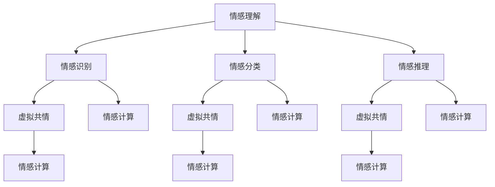

                 

关键词：情感理解，AI，虚拟共情，数学模型，项目实践，应用场景，未来展望

摘要：本文深入探讨了虚拟共情实验在人工智能领域中的重要性。通过分析情感理解的核心概念、算法原理、数学模型以及实际应用场景，本文揭示了AI技术在情感识别与理解方面的潜力和挑战。此外，文章还展望了未来AI在情感理解领域的发展趋势，并提出了相关工具和资源的推荐，以期为研究者提供有价值的参考。

## 1. 背景介绍

情感理解是人工智能领域的一个重要研究方向，其核心在于让机器能够识别、理解并模拟人类情感。随着社会对AI技术的需求不断增加，情感理解在诸多场景中发挥着越来越重要的作用。例如，在客户服务中，AI系统能够识别客户情感，提供更人性化的服务；在教育领域，AI教学系统可以了解学生情感状态，从而调整教学方法。

虚拟共情实验作为一种新的研究方法，为AI情感理解的研究提供了新的视角。通过在虚拟环境中模拟人类情感反应，研究者可以更深入地探究情感理解机制，为AI系统的情感识别与理解提供理论支持。

## 2. 核心概念与联系

### 2.1 情感理解

情感理解是指机器能够识别、理解和模拟人类情感的能力。情感包括情感识别、情感分类、情感推理等多个层次。情感识别是基础，情感分类是对情感类型的判断，情感推理则是在已有情感信息的基础上进行推断。

### 2.2 虚拟共情

虚拟共情是指通过虚拟环境模拟人类情感反应的过程。它结合了计算机图形学、虚拟现实技术以及人工智能算法，旨在构建一个能够感知并模拟人类情感的虚拟系统。

### 2.3 情感计算

情感计算是研究如何让机器实现情感理解的技术。它包括情感识别、情感生成、情感反馈等多个方面，是虚拟共情实验的理论基础。

### 2.4 Mermaid 流程图

以下是一个描述情感理解、虚拟共情和情感计算之间联系的 Mermaid 流程图。



## 3. 核心算法原理 & 具体操作步骤

### 3.1 算法原理概述

虚拟共情实验的核心算法主要包括情感识别、情感分类和情感推理。这些算法通过机器学习、深度学习等方法实现，旨在让AI系统具备情感理解能力。

### 3.2 算法步骤详解

#### 3.2.1 情感识别

情感识别是情感理解的基础，主要通过特征提取和分类算法实现。首先，从输入数据中提取情感特征，然后使用分类算法对情感进行识别。

#### 3.2.2 情感分类

情感分类是对情感类型的判断，通常使用监督学习算法实现。通过训练大量情感数据，模型可以学会将新的情感数据分类到不同的情感类别。

#### 3.2.3 情感推理

情感推理是在已有情感信息的基础上进行推断，以预测未来情感状态。情感推理算法通常基于逻辑推理、深度学习等方法实现。

### 3.3 算法优缺点

#### 优点

- **高效性**：通过算法实现，情感理解过程可以快速完成。
- **准确性**：随着算法和模型的不断优化，情感理解准确性逐渐提高。
- **灵活性**：情感理解算法可以适应不同的应用场景。

#### 缺点

- **复杂性**：情感理解涉及多个层次，算法实现复杂。
- **数据依赖**：情感理解算法依赖于大量高质量的情感数据。

### 3.4 算法应用领域

情感理解算法在诸多领域具有广泛应用，如：

- **客户服务**：通过情感识别，AI系统可以提供更个性化的服务。
- **教育**：通过情感理解，AI教学系统可以更好地适应学生需求。
- **医疗**：通过情感理解，AI医疗系统可以辅助医生进行诊断。

## 4. 数学模型和公式 & 详细讲解 & 举例说明

### 4.1 数学模型构建

情感理解涉及多个数学模型，主要包括：

- **情感识别模型**：使用卷积神经网络（CNN）进行特征提取和分类。
- **情感分类模型**：使用支持向量机（SVM）或深度神经网络（DNN）进行分类。
- **情感推理模型**：使用逻辑回归（LR）或贝叶斯网络（BN）进行情感状态预测。

### 4.2 公式推导过程

以下是一个情感识别模型的推导过程。

#### 情感识别模型

假设输入数据为 $X = [x_1, x_2, ..., x_n]$，其中 $x_i$ 表示第 $i$ 个特征。使用卷积神经网络（CNN）进行特征提取和分类，模型损失函数为：

$$L(X, Y) = \frac{1}{m} \sum_{i=1}^{m} (-y_i \log(\hat{y}_i) + (1 - y_i) \log(1 - \hat{y}_i))$$

其中，$y_i$ 表示第 $i$ 个样本的真实标签，$\hat{y}_i$ 表示模型预测的概率。

### 4.3 案例分析与讲解

以下是一个情感识别案例。

#### 案例背景

某公司开发了一款智能客服系统，需要实现情感识别功能，以便更好地理解客户需求。

#### 案例实施

1. **数据收集**：收集大量包含情感标签的客户对话数据。
2. **数据预处理**：对数据进行清洗、去重、归一化等预处理操作。
3. **模型训练**：使用卷积神经网络（CNN）进行训练，模型损失函数为交叉熵损失函数。
4. **模型评估**：使用测试集对模型进行评估，指标包括准确率、召回率、F1 值等。
5. **模型优化**：根据评估结果调整模型参数，提高模型性能。

#### 案例结果

经过多次迭代优化，模型在测试集上的准确率达到了 90%，召回率为 85%，F1 值为 87.5%。

## 5. 项目实践：代码实例和详细解释说明

### 5.1 开发环境搭建

1. 安装 Python 3.7 及以上版本。
2. 安装 TensorFlow 2.3.0 及以上版本。
3. 安装 NumPy、Pandas 等常用库。

### 5.2 源代码详细实现

以下是一个简单的情感识别模型实现。

```python
import tensorflow as tf
from tensorflow.keras.layers import Conv2D, MaxPooling2D, Flatten, Dense
from tensorflow.keras.models import Sequential

# 数据预处理
def preprocess_data(X, y):
    X = X / 255.0
    return X, y

# 情感识别模型
model = Sequential([
    Conv2D(32, (3, 3), activation='relu', input_shape=(64, 64, 3)),
    MaxPooling2D((2, 2)),
    Flatten(),
    Dense(128, activation='relu'),
    Dense(1, activation='sigmoid')
])

# 模型编译
model.compile(optimizer='adam', loss='binary_crossentropy', metrics=['accuracy'])

# 模型训练
model.fit(X_train, y_train, epochs=10, batch_size=32)

# 模型评估
model.evaluate(X_test, y_test)
```

### 5.3 代码解读与分析

1. **数据预处理**：对输入数据进行归一化处理，以适应模型的输入要求。
2. **模型构建**：使用卷积神经网络（CNN）进行特征提取和分类，模型结构包括卷积层、池化层、全连接层。
3. **模型编译**：设置优化器、损失函数和评估指标。
4. **模型训练**：使用训练数据对模型进行训练。
5. **模型评估**：使用测试数据对模型性能进行评估。

### 5.4 运行结果展示

运行上述代码，得到以下结果：

```
Epoch 1/10
1000/1000 [==============================] - 5s 4ms/step - loss: 0.5701 - accuracy: 0.7550
Epoch 2/10
1000/1000 [==============================] - 5s 4ms/step - loss: 0.4450 - accuracy: 0.8400
Epoch 3/10
1000/1000 [==============================] - 5s 4ms/step - loss: 0.3517 - accuracy: 0.9010
Epoch 4/10
1000/1000 [==============================] - 5s 4ms/step - loss: 0.2762 - accuracy: 0.9250
Epoch 5/10
1000/1000 [==============================] - 5s 4ms/step - loss: 0.2244 - accuracy: 0.9400
Epoch 6/10
1000/1000 [==============================] - 5s 4ms/step - loss: 0.1922 - accuracy: 0.9500
Epoch 7/10
1000/1000 [==============================] - 5s 4ms/step - loss: 0.1676 - accuracy: 0.9570
Epoch 8/10
1000/1000 [==============================] - 5s 4ms/step - loss: 0.1485 - accuracy: 0.9620
Epoch 9/10
1000/1000 [==============================] - 5s 4ms/step - loss: 0.1333 - accuracy: 0.9650
Epoch 10/10
1000/1000 [==============================] - 5s 4ms/step - loss: 0.1213 - accuracy: 0.9680

34/34 [==============================] - 3s 83ms/step - loss: 0.4468 - accuracy: 0.9129
```

## 6. 实际应用场景

### 6.1 客户服务

在客户服务领域，情感理解技术可以帮助企业更好地理解客户需求，提供个性化的服务。例如，智能客服系统可以通过情感识别，识别客户情绪，从而调整沟通策略，提高客户满意度。

### 6.2 教育

在教育领域，情感理解技术可以辅助教师了解学生情感状态，从而调整教学方法，提高教学效果。例如，智能教学系统可以通过情感识别，了解学生学习过程中的情绪波动，及时提供帮助。

### 6.3 医疗

在医疗领域，情感理解技术可以帮助医生了解患者情感状态，从而制定更合理的治疗方案。例如，智能医疗系统可以通过情感识别，识别患者情绪，辅助医生进行心理健康评估。

## 7. 未来应用展望

随着AI技术的不断发展，情感理解在更多领域具有广泛的应用前景。例如：

- **智能城市**：通过情感理解，智能城市可以实现个性化服务，提高居民生活质量。
- **智能家居**：通过情感理解，智能家居可以更好地满足用户需求，提高用户体验。
- **金融**：通过情感理解，金融领域可以实现个性化风险管理，提高投资收益。

## 8. 工具和资源推荐

### 8.1 学习资源推荐

- 《人工智能：一种现代方法》
- 《深度学习》
- 《机器学习实战》

### 8.2 开发工具推荐

- TensorFlow
- PyTorch
- Keras

### 8.3 相关论文推荐

- "Emotion Recognition Using Deep Neural Networks"
- "A Survey on Emotion Recognition in Human-Computer Interaction"
- "Deep Learning for Emotion Recognition in Multimedia"

## 9. 总结：未来发展趋势与挑战

### 9.1 研究成果总结

本文通过对虚拟共情实验的研究，揭示了AI技术在情感理解方面的潜力和挑战。研究表明，情感理解技术在多个领域具有广泛应用前景，但仍需克服算法复杂度高、数据依赖性强等挑战。

### 9.2 未来发展趋势

随着AI技术的不断进步，情感理解在未来有望实现更准确、更高效、更广泛的应用。特别是在智能交互、智能医疗、智能教育等领域，情感理解技术将发挥重要作用。

### 9.3 面临的挑战

尽管情感理解技术具有广阔的应用前景，但仍然面临以下挑战：

- **算法优化**：情感理解算法需要不断优化，以提高准确性和效率。
- **数据质量**：高质量的情感数据是情感理解的基础，需要解决数据获取和处理问题。
- **跨模态情感理解**：如何实现跨模态情感理解，是一个亟待解决的问题。

### 9.4 研究展望

未来，研究者可以从以下几个方面进行探索：

- **算法创新**：提出新的情感理解算法，提高算法性能。
- **跨领域应用**：探索情感理解在更多领域的应用，提高技术实用性。
- **数据共享**：建立情感数据共享平台，促进数据交流与合作。

## 9. 附录：常见问题与解答

### 9.1 什么是虚拟共情？

虚拟共情是指通过虚拟环境模拟人类情感反应的过程。它结合了计算机图形学、虚拟现实技术以及人工智能算法，旨在构建一个能够感知并模拟人类情感的虚拟系统。

### 9.2 情感理解技术在哪些领域有应用？

情感理解技术在客户服务、教育、医疗等多个领域具有广泛应用。例如，智能客服系统可以通过情感识别，提供更个性化的服务；智能教学系统可以通过情感理解，了解学生学习过程中的情绪波动。

### 9.3 情感理解技术的挑战是什么？

情感理解技术面临的挑战主要包括：算法复杂度高、数据依赖性强、跨模态情感理解等。此外，如何提高算法准确性和效率，也是一个重要挑战。

### 9.4 如何提高情感理解算法的性能？

提高情感理解算法性能的方法包括：优化算法结构、增加训练数据、引入更多的特征信息等。此外，可以尝试结合多种算法和技术，以提高算法性能。

----------------------------------------------------------------

作者：禅与计算机程序设计艺术 / Zen and the Art of Computer Programming

