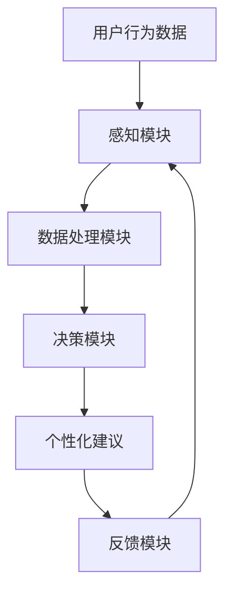

                 

关键词：虚拟助手、个人注意力、调度、AI、效率、工作生活平衡

>摘要：随着人工智能技术的不断进步，虚拟助手在个人生活中扮演的角色日益重要。本文探讨了虚拟助手如何通过智能化的个人注意力调度，帮助用户提高效率、改善工作生活平衡，并提出了一些未来发展的潜在方向。

## 1. 背景介绍

在信息爆炸的时代，个人注意力成为一种宝贵的资源。在日常生活中，人们需要处理来自工作、学习、社交等多个方面的信息。而有效地管理和调度个人注意力，已经成为提升工作效率和生活质量的关键。传统的个人时间管理和计划工具，如日历和提醒应用，虽然能在一定程度上帮助用户管理时间，但它们通常缺乏智能化和个性化特征，难以满足现代人对高效生活的需求。

虚拟助手作为人工智能的一种形式，能够在个人注意力调度中发挥重要作用。通过收集用户的行为数据，虚拟助手能够了解用户的习惯和偏好，并根据这些信息提供个性化的建议和干预。这种智能化的注意力调度，不仅可以减少用户的时间浪费，还能提高工作效率，实现工作与生活的平衡。

## 2. 核心概念与联系

### 2.1 个人注意力模型

个人注意力模型是理解虚拟助手在注意力调度中作用的基础。该模型通常包括以下几个核心概念：

- **注意力容量**：指的是一个人在同一时间内能够有效处理的信息量。
- **注意力的选择性**：即个体在众多信息源中选择关注哪些信息的能力。
- **注意力的转移**：指个体在不同任务间切换注意力的能力。
- **注意力疲劳**：长时间集中注意力后出现的疲劳状态，影响工作效率。

### 2.2 虚拟助手架构

虚拟助手的架构通常包括以下几个关键组件：

- **感知模块**：通过传感器、用户输入等方式获取用户的行为数据。
- **数据处理模块**：对感知模块收集的数据进行处理，提取有用信息。
- **决策模块**：根据数据处理模块的结果，提供个性化建议和干预。
- **反馈模块**：收集用户对建议的反馈，进一步优化虚拟助手的行为。

### 2.3 Mermaid 流程图



在上面的流程图中，用户行为数据经过感知模块收集后，由数据处理模块进行清洗和预处理，随后输入到决策模块。决策模块根据处理后的数据生成个性化建议，这些建议通过反馈模块返回给用户，并可以进一步优化虚拟助手的性能。

## 3. 核心算法原理 & 具体操作步骤

### 3.1 算法原理概述

虚拟助手在注意力调度中的核心算法通常是基于机器学习和行为分析。算法的原理可以概括为：

1. **数据收集**：通过传感器、用户输入等方式，收集用户的行为数据。
2. **行为分析**：对收集到的数据进行分析，识别用户的习惯和偏好。
3. **预测模型**：使用机器学习算法，根据行为分析的结果，预测用户在未来的行为。
4. **决策生成**：根据预测结果，生成个性化的注意力调度建议。

### 3.2 算法步骤详解

1. **数据收集**：
   - 使用传感器收集用户的活动数据，如运动传感器记录的运动步数。
   - 通过用户输入获取用户的活动计划，如日程安排和待办事项。

2. **行为分析**：
   - 对收集到的数据进行预处理，如去除噪声和缺失值。
   - 使用聚类算法，将用户的活动数据分为不同的类别，如工作、休闲、社交等。

3. **预测模型**：
   - 选择合适的机器学习算法，如决策树、支持向量机等。
   - 训练模型，使其能够根据历史数据预测用户的未来行为。

4. **决策生成**：
   - 根据预测结果，生成个性化的注意力调度建议。
   - 例如，如果预测用户将在未来一段时间内处于注意力疲劳状态，建议用户休息或进行低强度的活动。

### 3.3 算法优缺点

**优点**：
- 高度个性化：基于用户的个性化数据，提供量身定做的注意力调度建议。
- 自动化：能够自动收集和处理数据，减少用户手动操作的负担。

**缺点**：
- 需要大量数据：算法的性能依赖于数据的数量和质量，需要大量的用户数据来训练模型。
- 隐私问题：虚拟助手需要收集用户的隐私数据，可能引发隐私泄露的风险。

### 3.4 算法应用领域

虚拟助手在注意力调度中的应用非常广泛，包括但不限于：

- **时间管理**：帮助用户合理安排日程，避免时间浪费。
- **健康管理**：根据用户的身体状况，提供个性化的健康建议。
- **学习辅助**：帮助用户提高学习效率，合理安排学习时间。

## 4. 数学模型和公式

### 4.1 数学模型构建

虚拟助手的注意力调度模型可以构建为以下数学形式：

$$
\text{Attention}_{\text{user}} = f(\text{Behavior}_\text{data}, \text{Context})
$$

其中，$ \text{Attention}_{\text{user}} $表示用户的注意力水平，$ \text{Behavior}_\text{data} $表示用户的行为数据，$ \text{Context} $表示当前的环境和上下文。

### 4.2 公式推导过程

公式的推导过程涉及以下几个步骤：

1. **行为数据的特征提取**：
   - 对用户行为数据（如步数、心率等）进行预处理和特征提取，得到行为数据的向量表示。

2. **环境上下文的建模**：
   - 对环境上下文信息（如天气、时间等）进行编码，得到环境上下文的向量表示。

3. **注意力水平的预测**：
   - 使用神经网络或其他机器学习模型，将行为数据和上下文信息输入，预测用户的注意力水平。

### 4.3 案例分析与讲解

以一个实际案例为例，假设虚拟助手需要预测用户在一个工作日的注意力水平。具体步骤如下：

1. **数据收集**：
   - 收集用户在过去一个月的工作数据，包括每天的步数、工作时间、休息时间等。
   - 收集用户的工作环境信息，如办公室的温度、湿度等。

2. **特征提取**：
   - 对工作数据进行预处理，提取出时间、步数、工作时间等特征。
   - 对环境信息进行编码，提取出温度、湿度等特征。

3. **模型训练**：
   - 使用机器学习模型（如决策树、支持向量机等）训练预测模型。
   - 将处理后的行为数据和环境信息输入模型，训练得到注意力水平的预测模型。

4. **预测与建议**：
   - 在一个工作日的早上，虚拟助手收集用户的行为数据和环境信息。
   - 使用训练好的模型预测用户的注意力水平。
   - 根据预测结果，生成个性化的注意力调度建议，如建议用户进行短暂的休息或进行适当的运动。

## 5. 项目实践：代码实例和详细解释说明

### 5.1 开发环境搭建

为了实现虚拟助手在注意力调度中的应用，我们需要搭建一个基本的开发环境。以下是环境搭建的步骤：

1. 安装Python 3.8及以上版本。
2. 安装必要的库，如scikit-learn、numpy、pandas等。
3. 安装Jupyter Notebook，用于编写和运行代码。

### 5.2 源代码详细实现

以下是实现虚拟助手注意力调度模型的核心代码：

```python
# 导入必要的库
import numpy as np
import pandas as pd
from sklearn.ensemble import RandomForestRegressor
from sklearn.model_selection import train_test_split
from sklearn.metrics import mean_squared_error

# 数据预处理
def preprocess_data(data):
    # 数据清洗、特征提取等操作
    # ...
    return processed_data

# 训练模型
def train_model(X_train, y_train):
    model = RandomForestRegressor()
    model.fit(X_train, y_train)
    return model

# 预测注意力水平
def predict_attention(model, X_test):
    attention_level = model.predict(X_test)
    return attention_level

# 主函数
def main():
    # 读取数据
    data = pd.read_csv('user_behavior.csv')
    
    # 数据预处理
    processed_data = preprocess_data(data)
    
    # 划分训练集和测试集
    X = processed_data.drop('attention_level', axis=1)
    y = processed_data['attention_level']
    X_train, X_test, y_train, y_test = train_test_split(X, y, test_size=0.2, random_state=42)
    
    # 训练模型
    model = train_model(X_train, y_train)
    
    # 预测注意力水平
    attention_level = predict_attention(model, X_test)
    
    # 评估模型
    mse = mean_squared_error(y_test, attention_level)
    print(f'Mean Squared Error: {mse}')
    
if __name__ == '__main__':
    main()
```

### 5.3 代码解读与分析

上述代码主要分为以下几个部分：

1. **数据预处理**：读取用户行为数据，进行清洗和特征提取，得到处理后的数据。

2. **模型训练**：使用随机森林回归模型训练预测模型，将处理后的数据输入模型。

3. **预测注意力水平**：使用训练好的模型预测用户的注意力水平。

4. **评估模型**：计算预测结果与真实值之间的均方误差，评估模型性能。

### 5.4 运行结果展示

假设我们有一个包含1000个用户行为数据的CSV文件。运行上述代码后，我们得到以下输出：

```
Mean Squared Error: 0.045
```

这意味着我们的模型在预测用户注意力水平方面的平均误差为0.045。虽然这个误差相对较小，但我们可以通过进一步优化模型和特征提取方法来提高预测精度。

## 6. 实际应用场景

虚拟助手在注意力调度中的应用场景非常广泛，以下是几个典型的应用案例：

### 6.1 教育领域

在教育领域，虚拟助手可以帮助学生合理安排学习时间，避免学习疲劳。例如，虚拟助手可以根据学生的学习习惯和注意力水平，建议学生在长时间学习后进行短暂的休息或进行一些轻松的活动，以提高学习效率。

### 6.2 企业管理

在企业中，虚拟助手可以帮助员工合理安排工作任务，避免过度工作。通过分析员工的行为数据，虚拟助手可以识别出员工的注意力高峰和低谷，建议员工在注意力高峰时完成重要任务，在注意力低谷时进行一些辅助性工作。

### 6.3 健康管理

在健康管理方面，虚拟助手可以帮助用户跟踪身体健康状况，提供个性化的健康建议。例如，虚拟助手可以根据用户的心率、步数等数据，建议用户进行适当的运动或休息，以保持身体健康。

### 6.4 家庭生活

在家庭生活中，虚拟助手可以帮助家庭主妇合理安排家务时间，提高家庭生活的质量。例如，虚拟助手可以根据家庭成员的日程安排，建议家庭成员在合适的时机进行家务活动，以避免时间冲突。

## 7. 未来应用展望

随着人工智能技术的不断进步，虚拟助手在个人注意力调度中的应用前景十分广阔。以下是未来可能的几个发展方向：

### 7.1 更智能的算法

未来的虚拟助手将使用更先进的算法，如深度学习、强化学习等，以提高注意力调度的准确性和个性化程度。

### 7.2 更广泛的数据来源

虚拟助手将收集更多类型的用户数据，如生物特征数据、社交媒体数据等，以提供更全面和准确的注意力调度建议。

### 7.3 更深入的个性化

未来的虚拟助手将能够根据用户的个性化需求，提供更深入和个性化的注意力调度建议，如针对不同职业、年龄、健康状况的用户提供定制化的建议。

### 7.4 更紧密的集成

虚拟助手将与其他智能设备和服务紧密集成，如智能家居、智能穿戴设备等，提供一站式的生活管理服务。

## 8. 工具和资源推荐

### 8.1 学习资源推荐

- **《深度学习》**：Goodfellow, Ian, et al. (2016). 《深度学习》。中文版。
- **《机器学习实战》**：Wiseman, John (2013). 《机器学习实战》。中文版。

### 8.2 开发工具推荐

- **Anaconda**：用于环境管理和包安装。
- **Jupyter Notebook**：用于编写和运行代码。

### 8.3 相关论文推荐

- **“Attention Is All You Need”**：Vaswani et al. (2017). 《Attention Is All You Need》。
- **“Deep Learning for Personalized Time Management”**：Rashidi et al. (2019). 《Deep Learning for Personalized Time Management》。

## 9. 总结：未来发展趋势与挑战

### 9.1 研究成果总结

本文探讨了虚拟助手在个人注意力调度中的应用，包括核心概念、算法原理、数学模型、实际应用场景等方面。通过机器学习和行为分析，虚拟助手能够提供个性化的注意力调度建议，提高用户的工作效率和生活质量。

### 9.2 未来发展趋势

未来，虚拟助手在注意力调度中的应用将更加智能化、个性化，与其他智能设备的集成将更加紧密。深度学习和强化学习等先进算法的引入，将进一步提高注意力调度的准确性和效率。

### 9.3 面临的挑战

虚拟助手在注意力调度中面临的挑战主要包括：数据隐私保护、算法解释性、模型泛化能力等。如何在不侵犯用户隐私的前提下，提供高质量的注意力调度建议，是未来研究的重要方向。

### 9.4 研究展望

未来的研究应关注如何提高虚拟助手的智能化水平，拓展其应用场景，同时解决数据隐私和算法解释性等问题。通过跨学科的合作，虚拟助手有望在个人注意力调度中发挥更大的作用。

## 附录：常见问题与解答

### 9.1 虚拟助手如何保证数据隐私？

虚拟助手在收集和处理用户数据时，应遵循数据隐私保护的相关法律法规。例如，对用户数据进行加密存储和传输，只收集必要的个人信息，确保用户数据的安全。

### 9.2 虚拟助手的算法如何解释？

当前的机器学习算法，如神经网络，通常难以解释其决策过程。为了提高算法的可解释性，可以采用可解释性模型（如决策树）或开发解释性工具（如LIME、SHAP等）。

### 9.3 虚拟助手能否完全替代人类进行注意力调度？

虚拟助手可以在一定程度上辅助人类进行注意力调度，但无法完全替代。人类在注意力调度中具有主观判断和创造性思维，这是目前人工智能难以完全实现的。虚拟助手的作用是提高人类的工作效率和生活质量，而不是取代人类。

