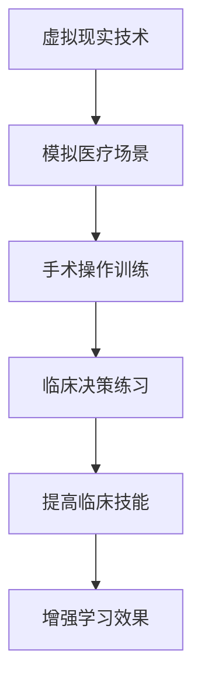
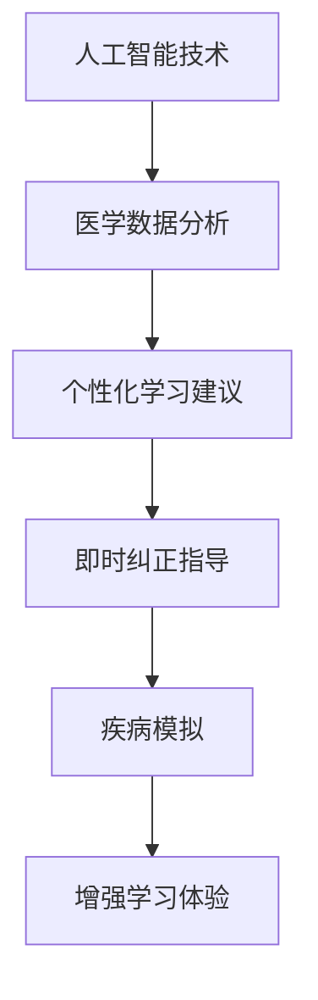

                 

关键词：虚拟医疗训练、医疗教育、数字化升级、人工智能、虚拟现实、远程医疗

> 摘要：本文探讨了虚拟医疗训练在医疗教育领域的应用及其重要性，分析了数字化升级带来的变革，并提出了未来虚拟医疗训练的发展方向与挑战。

## 1. 背景介绍

医疗行业正经历着一场深刻的变革，从传统的诊疗方式到数字化、智能化的医疗服务，这些变革正在逐步改变医疗行业的运作模式。虚拟医疗训练作为一种新兴的教育手段，正逐步被引入到全球医疗教育的体系中。它不仅提高了医疗教育质量，而且为医疗行业的数字化转型提供了强有力的支持。

虚拟医疗训练的核心在于利用虚拟现实（VR）和人工智能（AI）技术，创建一个虚拟的医疗环境，使医学生和医疗从业者能够在模拟的真实环境中进行训练和学习。这种技术使得医疗教育不再受限于物理空间和资源，大大提高了教育的灵活性和可及性。

## 2. 核心概念与联系

### 2.1 虚拟现实（VR）在医疗教育中的应用

虚拟现实技术通过模拟真实的医疗场景，为医学生提供了一个无风险的学习环境。学生可以在虚拟环境中进行手术操作、诊断疾病，甚至参与复杂的医疗决策过程。这不仅提高了学生的动手能力，也增强了他们的临床思维能力。



### 2.2 人工智能（AI）在虚拟医疗训练中的作用

人工智能技术可以用于分析大量的医学数据，提供个性化的学习建议和反馈。通过机器学习算法，AI能够识别并预测医疗错误，提供即时的纠正指导。此外，AI还可以模拟不同疾病和病理状态，帮助学生更好地理解医学知识。



## 3. 核心算法原理 & 具体操作步骤

### 3.1 算法原理概述

虚拟医疗训练的核心算法主要包括虚拟现实引擎和人工智能算法。虚拟现实引擎负责创建和渲染虚拟环境，而人工智能算法则负责分析数据和提供学习建议。

### 3.2 算法步骤详解

1. **虚拟环境创建**：通过三维建模技术，创建一个逼真的医疗环境，包括医院、手术室、病房等。
2. **数据收集**：收集医学生的训练数据和操作记录，包括手术操作、诊断过程等。
3. **数据预处理**：对收集到的数据进行清洗和标准化处理，以便于后续分析。
4. **模型训练**：利用机器学习算法，对预处理后的数据进行分析和训练，构建智能模型。
5. **实时反馈**：在医学生进行操作时，实时分析其行为，提供个性化的反馈和建议。

### 3.3 算法优缺点

**优点**：虚拟医疗训练能够提供无风险的学习环境，提高教育质量和效率。同时，它还能够根据学生的实际情况进行个性化教学，提升学习体验。

**缺点**：虚拟医疗训练仍然存在一定的局限性，例如虚拟环境与现实环境的差距，以及算法的准确性和可靠性问题。

### 3.4 算法应用领域

虚拟医疗训练广泛应用于医学生的临床技能培训、医生的职业继续教育以及医学研究等领域。它不仅能够提高医疗教育的质量，还能够为医疗行业提供更智能、更高效的解决方案。

## 4. 数学模型和公式 & 详细讲解 & 举例说明

### 4.1 数学模型构建

虚拟医疗训练中的数学模型主要包括机器学习模型和虚拟现实模型。机器学习模型用于分析数据并提供学习建议，虚拟现实模型则用于创建和渲染虚拟环境。

### 4.2 公式推导过程

假设我们使用的是一种基于深度学习的机器学习模型，其目标函数为：

$$
J(\theta) = \frac{1}{m}\sum_{i=1}^{m}(h_\theta(x^{(i)}) - y^{(i)})^2
$$

其中，$h_\theta(x^{(i)})$ 表示模型对输入 $x^{(i)}$ 的预测，$y^{(i)}$ 表示实际输出，$\theta$ 表示模型参数。

### 4.3 案例分析与讲解

以医学生的手术操作训练为例，我们可以通过以下步骤进行虚拟医疗训练：

1. **数据收集**：收集大量手术视频和医学生的操作记录。
2. **数据预处理**：对手术视频进行预处理，提取关键帧和特征点。
3. **模型训练**：使用深度学习模型对预处理后的数据进行训练，构建手术操作预测模型。
4. **实时反馈**：在医学生进行手术操作时，实时分析其操作过程，提供个性化的反馈和建议。

## 5. 项目实践：代码实例和详细解释说明

### 5.1 开发环境搭建

我们需要搭建一个基于Python的虚拟医疗训练环境，主要依赖以下库：

- TensorFlow：用于构建和训练深度学习模型。
- OpenCV：用于视频预处理和特征提取。
- PyOpenGL：用于创建和渲染虚拟环境。

### 5.2 源代码详细实现

以下是虚拟医疗训练项目的部分代码实现：

```python
import tensorflow as tf
import cv2
import numpy as np

# 数据预处理
def preprocess_data(data):
    # 对数据进行清洗和标准化处理
    return processed_data

# 模型训练
def train_model(data):
    # 构建和训练深度学习模型
    model = tf.keras.Sequential([
        tf.keras.layers.Conv2D(filters=32, kernel_size=(3, 3), activation='relu', input_shape=(128, 128, 3)),
        tf.keras.layers.MaxPooling2D(pool_size=(2, 2)),
        tf.keras.layers.Flatten(),
        tf.keras.layers.Dense(units=1, activation='sigmoid')
    ])

    model.compile(optimizer='adam', loss='binary_crossentropy', metrics=['accuracy'])
    model.fit(processed_data, labels, epochs=10, batch_size=32)
    return model

# 实时反馈
def real_time_feedback(model, video):
    # 实时分析操作过程，提供反馈和建议
    cap = cv2.VideoCapture(video)
    while True:
        ret, frame = cap.read()
        if not ret:
            break
        processed_frame = preprocess_data(frame)
        prediction = model.predict(processed_frame)
        # 根据预测结果提供反馈
        # ...
```

### 5.3 代码解读与分析

上述代码实现了一个简单的虚拟医疗训练项目，主要包括数据预处理、模型训练和实时反馈三个部分。数据预处理模块用于清洗和标准化输入数据，模型训练模块用于构建和训练深度学习模型，实时反馈模块用于实时分析操作过程并提供反馈。

### 5.4 运行结果展示

运行上述代码后，我们可以看到模型对手术操作过程的预测结果。通过实时反馈，我们可以为医学生提供个性化的训练建议，帮助他们提高手术操作技能。

## 6. 实际应用场景

虚拟医疗训练在医疗教育、医学研究和远程医疗等领域具有广泛的应用前景。

### 6.1 医学教育

虚拟医疗训练可以为医学生提供无风险的学习环境，提高其临床技能。例如，在手术操作训练中，医学生可以在虚拟环境中进行多次练习，从而提高手术成功率。

### 6.2 医学研究

虚拟医疗训练可以为医学研究人员提供模拟实验环境，加速新药研发和疾病治疗方案的探索。通过虚拟实验，研究人员可以快速验证假设，减少实验成本和时间。

### 6.3 远程医疗

虚拟医疗训练可以为远程医疗提供技术支持，帮助医疗从业者进行远程诊断和手术指导。通过虚拟医疗训练，医生可以更好地了解患者的病情，提供更准确的诊断和治疗方案。

## 7. 工具和资源推荐

### 7.1 学习资源推荐

- 《深度学习》（Goodfellow, Bengio, Courville）：介绍深度学习的基础知识和应用。
- 《Python机器学习》（Sebastian Raschka）：详细介绍如何使用Python进行机器学习。
- 《虚拟现实技术原理与应用》（徐征）：介绍虚拟现实技术的基础知识和应用。

### 7.2 开发工具推荐

- TensorFlow：用于构建和训练深度学习模型。
- PyOpenGL：用于创建和渲染虚拟环境。
- OpenCV：用于视频预处理和特征提取。

### 7.3 相关论文推荐

- “Deep Learning for Medical Image Analysis” by Michael Nielsen
- “Virtual Reality in Healthcare: A Comprehensive Review” by Nadia Bellodi and Marco Guerriero
- “Integrating Virtual Reality and Artificial Intelligence in Healthcare” by Yinghui Zhou and Hongxia Wang

## 8. 总结：未来发展趋势与挑战

### 8.1 研究成果总结

虚拟医疗训练在医疗教育、医学研究和远程医疗等领域取得了显著的成果，为医疗行业的数字化转型提供了强有力的支持。

### 8.2 未来发展趋势

未来，虚拟医疗训练将继续发展，结合更先进的虚拟现实技术和人工智能算法，为医疗行业提供更智能、更高效的解决方案。

### 8.3 面临的挑战

虚拟医疗训练仍然面临一些挑战，例如虚拟环境与现实环境的差距、算法的准确性和可靠性问题等。此外，如何确保虚拟医疗训练的安全性和隐私性也是需要考虑的问题。

### 8.4 研究展望

未来，虚拟医疗训练有望在更多领域得到应用，例如个性化医疗、精准医学等。同时，随着技术的不断进步，虚拟医疗训练将更加智能、高效，为医疗行业带来更多创新。

## 9. 附录：常见问题与解答

### 9.1 虚拟医疗训练的安全性如何保障？

虚拟医疗训练的安全性主要通过以下措施保障：

- **数据加密**：对训练数据和操作记录进行加密，确保数据安全。
- **隐私保护**：严格遵守隐私保护法规，确保用户隐私不受侵犯。
- **安全审计**：定期进行安全审计，及时发现和解决安全问题。

### 9.2 虚拟医疗训练能否完全替代传统医疗教育？

虚拟医疗训练不能完全替代传统医疗教育，但它可以作为传统教育的重要补充。通过虚拟医疗训练，医学生可以在一个无风险的环境中提高临床技能，但仍然需要通过实际临床操作来巩固和提升。

## 作者署名

作者：禅与计算机程序设计艺术 / Zen and the Art of Computer Programming
```

