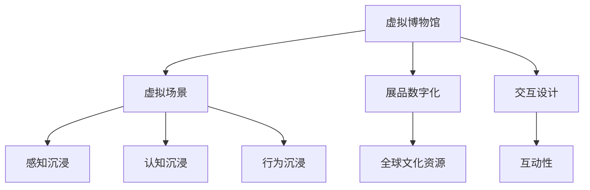

                 

 > **关键词**: 虚拟博物馆，沉浸式学习，全球文化资源，技术教育，文化传承。

> **摘要**: 本文旨在探讨虚拟博物馆教育作为一种新兴的教育模式，如何利用现代技术手段，为全球学习者提供沉浸式的文化教育资源，促进全球文化的传承与交流。文章将从虚拟博物馆的背景介绍、核心概念与联系、核心算法原理与操作步骤、数学模型与公式、项目实践、实际应用场景、工具和资源推荐、未来发展趋势与挑战等方面进行详细阐述，以期为广大教育工作者、技术开发者和文化传承者提供有益的参考和启示。

## 1. 背景介绍

虚拟博物馆教育是一种基于虚拟现实（VR）和增强现实（AR）技术的教育模式，通过模拟现实世界中的博物馆场景，为学习者提供沉浸式的文化体验。与传统博物馆教育相比，虚拟博物馆教育具有以下优势：

1. **跨越地域限制**：学习者无需亲临博物馆，即可通过虚拟平台参观各种文化展品，打破了地理和时间的限制。
2. **增强互动性**：虚拟博物馆教育提供了丰富的交互功能，如虚拟讲解员、互动展品等，使学习过程更加生动有趣。
3. **提高学习效率**：虚拟博物馆教育通过沉浸式体验，使学习者更加专注和投入，从而提高学习效果。

近年来，随着VR和AR技术的快速发展，虚拟博物馆教育逐渐成为全球教育领域的一大热点。本文将从技术、教育、文化等多个角度，深入探讨虚拟博物馆教育的应用前景和发展挑战。

## 2. 核心概念与联系

### 2.1 虚拟博物馆

虚拟博物馆是指利用计算机技术创建的虚拟场景，模拟现实世界中的博物馆环境。虚拟博物馆的核心概念包括：

- **虚拟场景**：通过三维建模、动画等技术，创建出与真实博物馆相似的虚拟场景，使学习者能够身临其境。
- **展品数字化**：将博物馆中的实体展品进行数字化处理，包括图像、三维模型、声音等多媒体信息，使展品能够在虚拟博物馆中展示。
- **交互设计**：设计各种交互功能，如虚拟讲解员、互动展品等，增强学习者的参与感和体验感。

### 2.2 沉浸式学习

沉浸式学习是一种以学习者为中心的教育模式，通过模拟或重现真实场景，使学习者能够全身心地投入到学习过程中。沉浸式学习的核心概念包括：

- **感知沉浸**：通过视觉、听觉、触觉等多感官刺激，使学习者感受到身临其境的体验。
- **认知沉浸**：通过模拟真实场景，使学习者在认知层面上产生沉浸感，从而提高学习效果。
- **行为沉浸**：通过设计互动性强的学习任务，使学习者在行为层面上产生沉浸感，从而激发学习兴趣。

### 2.3 全球文化资源

全球文化资源是指涵盖世界各地的文化遗产、艺术品、历史遗迹等。这些资源是全人类共同的精神财富，对于传承和弘扬人类文明具有重要意义。虚拟博物馆教育通过数字化手段，将这些文化资源呈现给全球学习者，实现了文化的全球传播。

### 2.4 Mermaid 流程图

以下是一个关于虚拟博物馆教育的 Mermaid 流程图，展示了核心概念和联系：



## 3. 核心算法原理 & 具体操作步骤

### 3.1 算法原理概述

虚拟博物馆教育涉及到多种算法原理，包括三维建模、图像处理、语音识别、自然语言处理等。以下是这些算法原理的简要概述：

- **三维建模**：通过计算机图形学技术，创建出与真实博物馆相似的虚拟场景。主要算法包括三维建模、纹理映射、光照模型等。
- **图像处理**：对博物馆中的实体展品进行数字化处理，包括图像增强、去噪、分割等。主要算法包括图像滤波、边缘检测、特征提取等。
- **语音识别**：将语音信号转换为文本，用于虚拟讲解员的功能实现。主要算法包括语音信号处理、特征提取、模型训练等。
- **自然语言处理**：对用户输入的文本进行理解和处理，提供智能问答、语音合成等功能。主要算法包括词向量、序列模型、神经网络等。

### 3.2 算法步骤详解

以下是虚拟博物馆教育中涉及的算法步骤详解：

#### 3.2.1 三维建模

1. **数据采集**：通过激光扫描、摄影测量等技术，获取博物馆场景和展品的三维数据。
2. **数据预处理**：对采集得到的三维数据进行降噪、去噪、分割等处理，提取出有效的三维模型。
3. **三维建模**：利用三维建模软件，根据预处理得到的三维数据，创建出虚拟博物馆场景和展品的三维模型。
4. **纹理映射**：将真实博物馆场景和展品的纹理信息映射到三维模型上，使其更加真实。
5. **光照模型**：设置合适的光照模型，模拟真实世界的光照效果，增强虚拟场景的视觉效果。

#### 3.2.2 图像处理

1. **图像增强**：通过对博物馆展品的图像进行增强处理，提高图像的清晰度、对比度等。
2. **去噪**：去除博物馆展品图像中的噪声，提高图像质量。
3. **分割**：将博物馆展品图像分割成不同的区域，为后续处理提供基础。
4. **特征提取**：提取博物馆展品图像的关键特征，用于后续的图像匹配和识别。

#### 3.2.3 语音识别

1. **语音信号处理**：对语音信号进行预处理，包括去噪、静音检测等。
2. **特征提取**：提取语音信号的音高、音强等特征，用于后续的语音识别。
3. **模型训练**：利用训练数据集，训练语音识别模型，包括隐马尔可夫模型（HMM）、深度神经网络（DNN）等。
4. **语音识别**：将预处理后的语音信号输入到训练好的模型中，输出对应的文本信息。

#### 3.2.4 自然语言处理

1. **词向量**：将用户输入的文本转换为词向量，用于后续的文本处理。
2. **序列模型**：利用序列模型，如循环神经网络（RNN）、长短时记忆网络（LSTM）等，对用户输入的文本进行理解和处理。
3. **语音合成**：将处理后的文本信息转换为语音信号，输出对应的语音。

### 3.3 算法优缺点

以下是虚拟博物馆教育中涉及算法的优缺点：

- **三维建模**：优点：能够创建出真实的虚拟博物馆场景，增强学习者的沉浸感；缺点：数据处理量大，计算复杂度高。
- **图像处理**：优点：能够提高博物馆展品的图像质量，便于后续处理；缺点：对噪声敏感，容易受到环境干扰。
- **语音识别**：优点：能够实现虚拟讲解员功能，提供便捷的语音服务；缺点：对语音质量要求高，易受到噪声干扰。
- **自然语言处理**：优点：能够实现智能问答、语音合成等功能，提高学习体验；缺点：对文本理解能力有限，难以处理复杂的语言结构。

### 3.4 算法应用领域

虚拟博物馆教育中的算法原理和技术手段可以应用于多个领域，如：

- **文化教育**：利用虚拟博物馆教育技术，为学习者提供丰富的文化教育资源，促进全球文化的传承与交流。
- **旅游行业**：虚拟博物馆教育可以为旅游行业提供一种全新的旅游体验，使游客在虚拟世界中欣赏世界各地的文化遗产。
- **虚拟现实游戏**：虚拟博物馆教育技术可以应用于虚拟现实游戏，为玩家提供沉浸式的游戏体验。
- **智能家居**：虚拟博物馆教育技术可以应用于智能家居领域，为用户提供更加丰富和有趣的生活体验。

## 4. 数学模型和公式 & 详细讲解 & 举例说明

### 4.1 数学模型构建

虚拟博物馆教育中的数学模型主要包括以下两个方面：

1. **三维建模中的几何模型**：用于描述虚拟博物馆场景和展品的几何形状和空间关系。
2. **图像处理中的图像模型**：用于描述博物馆展品的图像特征和图像处理算法。

以下是这两个数学模型的构建方法：

#### 4.1.1 三维建模中的几何模型

1. **三维坐标系统**：建立三维坐标系统，用于表示虚拟博物馆场景和展品的位置和方向。
2. **几何形状建模**：利用数学方法，如三维几何建模软件，创建出虚拟博物馆场景和展品的几何形状。
3. **空间关系建模**：利用数学方法，如向量运算、矩阵变换等，描述虚拟博物馆场景和展品之间的空间关系。

#### 4.1.2 图像处理中的图像模型

1. **图像特征提取**：利用数学方法，如滤波、边缘检测等，提取博物馆展品的图像特征。
2. **图像特征匹配**：利用数学方法，如相似性度量、距离函数等，匹配博物馆展品的图像特征。
3. **图像处理算法**：利用数学方法，如图像增强、去噪等，对博物馆展品的图像进行处理。

### 4.2 公式推导过程

以下是虚拟博物馆教育中涉及的一些数学公式的推导过程：

#### 4.2.1 三维建模中的几何模型

1. **三维坐标变换**：
   - **旋转矩阵**：$R = \begin{bmatrix}
   \cos \theta & -\sin \theta \\
   \sin \theta & \cos \theta
   \end{bmatrix}$
   - **平移矩阵**：$T = \begin{bmatrix}
   1 & 0 & 0 & t_x \\
   0 & 1 & 0 & t_y \\
   0 & 0 & 1 & t_z \\
   0 & 0 & 0 & 1
   \end{bmatrix}$
   - **三维坐标变换**：$P' = R \cdot P + T$

2. **几何形状建模**：
   - **点**：$P = (x, y, z)$
   - **线段**：$L = P_1 + t(P_2 - P_1)$，其中 $t \in [0, 1]$
   - **平面**：$P \cdot N = d$，其中 $N$ 为平面的法向量，$d$ 为平面的距离。

#### 4.2.2 图像处理中的图像模型

1. **图像增强**：
   - **直方图均衡化**：$I'(x, y) = \frac{L - 1}{255} \cdot \sum_{x'} \sum_{y'} f(x', y')$
   - **均值滤波**：$I'(x, y) = \frac{1}{n} \sum_{x'} \sum_{y'} I(x' + \Delta x, y' + \Delta y)$，其中 $\Delta x, \Delta y$ 为滤波器的移动步长，$n$ 为滤波器的大小。

2. **图像特征提取**：
   - **边缘检测**：
     - **Sobel算子**：$G_x = \frac{\partial I}{\partial x} = G_x1 + G_x2$，$G_y = \frac{\partial I}{\partial y} = G_y1 + G_y2$
     - **Canny算子**：$G = \sqrt{G_x^2 + G_y^2}$，$T = \max(\alpha, \beta)$，其中 $\alpha$ 和 $\beta$ 分别为阈值1和阈值2。

3. **图像特征匹配**：
   - **相似性度量**：$S = \frac{1}{N} \sum_{i=1}^{N} d(I_1(i), I_2(i))$
   - **距离函数**：$d(I_1, I_2) = \sqrt{\sum_{i=1}^{N} (I_1(i) - I_2(i))^2}$

### 4.3 案例分析与讲解

以下是一个关于虚拟博物馆教育中的数学模型和公式的案例分析：

#### 4.3.1 三维建模

假设我们有一个虚拟博物馆场景，其中包含一个立方体展品，其顶点坐标为 $P_1 = (1, 1, 1)$，$P_2 = (2, 2, 2)$，$P_3 = (1, 2, 2)$，$P_4 = (2, 1, 2)$，$P_5 = (1, 1, 2)$，$P_6 = (2, 2, 1)$，$P_7 = (1, 2, 1)$，$P_8 = (2, 1, 1)$。我们需要将其转换为三维坐标系下的顶点坐标。

1. **三维坐标变换**：
   - **旋转**：假设我们需要将立方体绕z轴旋转 $90^\circ$，则旋转矩阵为 $R_z = \begin{bmatrix}
   1 & 0 & 0 \\
   0 & 0 & 1 \\
   0 & -1 & 0
   \end{bmatrix}$。则旋转后的顶点坐标为 $P'_1 = R_z \cdot P_1 = (1, -1, 1)$，$P'_2 = R_z \cdot P_2 = (2, -2, 2)$，$P'_3 = R_z \cdot P_3 = (1, -2, 2)$，$P'_4 = R_z \cdot P_4 = (2, -1, 2)$，$P'_5 = R_z \cdot P_5 = (1, -1, 2)$，$P'_6 = R_z \cdot P_6 = (2, -2, 1)$，$P'_7 = R_z \cdot P_7 = (1, -2, 1)$，$P'_8 = R_z \cdot P_8 = (2, -1, 1)$。
   - **平移**：假设我们需要将立方体向x轴平移1个单位，则平移矩阵为 $T_x = \begin{bmatrix}
   1 & 0 & 0 & 1 \\
   0 & 1 & 0 & 0 \\
   0 & 0 & 1 & 0 \\
   0 & 0 & 0 & 1
   \end{bmatrix}$。则平移后的顶点坐标为 $P''_1 = T_x \cdot P'_1 = (2, -1, 1)$，$P''_2 = T_x \cdot P'_2 = (3, -2, 2)$，$P''_3 = T_x \cdot P'_3 = (2, -2, 2)$，$P''_4 = T_x \cdot P'_4 = (3, -1, 2)$，$P''_5 = T_x \cdot P'_5 = (2, -1, 2)$，$P''_6 = T_x \cdot P'_6 = (3, -2, 1)$，$P''_7 = T_x \cdot P'_7 = (2, -2, 1)$，$P''_8 = T_x \cdot P'_8 = (3, -1, 1)$。

2. **几何形状建模**：
   - **点**：新的顶点坐标为 $P''_1 = (2, -1, 1)$，$P''_2 = (3, -2, 2)$，$P''_3 = (2, -2, 2)$，$P''_4 = (3, -1, 2)$，$P''_5 = (2, -1, 2)$，$P''_6 = (3, -2, 1)$，$P''_7 = (2, -2, 1)$，$P''_8 = (3, -1, 1)$。
   - **线段**：新的线段为 $L_1 = P''_1 + t(P''_2 - P''_1)$，$L_2 = P''_2 + t(P''_3 - P''_2)$，$L_3 = P''_3 + t(P''_4 - P''_3)$，$L_4 = P''_4 + t(P''_5 - P''_4)$，$L_5 = P''_5 + t(P''_6 - P''_5)$，$L_6 = P''_6 + t(P''_7 - P''_6)$，$L_7 = P''_7 + t(P''_8 - P''_7)$，$L_8 = P''_8 + t(P''_1 - P''_8)$。
   - **平面**：新的平面为 $P'' \cdot N = d$，其中 $N$ 为平面的法向量，$d$ 为平面的距离。

#### 4.3.2 图像处理

假设我们有一个博物馆展品的图像，其像素值 $I(x, y)$ 的取值范围为 $0$ 到 $255$。我们需要对其进行直方图均衡化和均值滤波处理。

1. **直方图均衡化**：
   - **计算直方图**：计算每个像素值 $I(x, y)$ 出现的次数 $f(I(x, y))$。
   - **计算累积分布函数**：计算累积分布函数 $F(I(x, y)) = \sum_{i=0}^{I(x, y)} f(i)$。
   - **计算逆累积分布函数**：计算逆累积分布函数 $g(I(x, y)) = \frac{L - 1}{255} \cdot F^{-1}(I(x, y))$。
   - **直方图均衡化**：将像素值 $I(x, y)$ 替换为 $I'(x, y) = g(I(x, y))$。

2. **均值滤波**：
   - **设计滤波器**：设计一个大小为 $3 \times 3$ 的滤波器，例如 $W = \begin{bmatrix}
   1 & 1 & 1 \\
   1 & 1 & 1 \\
   1 & 1 & 1
   \end{bmatrix}$。
   - **滤波**：将滤波器在图像上进行移动，对每个像素值 $I(x, y)$ 进行加权平均，即 $I'(x, y) = \frac{1}{9} \sum_{x'} \sum_{y'} W(x' - x, y' - y) \cdot I(x', y')$。

## 5. 项目实践：代码实例和详细解释说明

### 5.1 开发环境搭建

在本文的项目实践中，我们将使用以下开发环境：

- **操作系统**：Windows 10 或 macOS
- **编程语言**：Python 3.8 或以上版本
- **依赖库**：PyOpenGL、Pygame、OpenCV、NumPy

在开发环境中，首先需要安装所需的依赖库。以下是一个简单的安装示例：

```bash
pip install pygame numpy opencv-python
```

### 5.2 源代码详细实现

以下是虚拟博物馆教育项目的一个简单示例代码，用于实现一个基本的虚拟博物馆场景。代码分为以下几个部分：

1. **初始化OpenGL环境**：设置OpenGL的视口、投影矩阵等。
2. **加载模型和纹理**：从文件中加载虚拟博物馆场景和展品的模型和纹理。
3. **渲染场景**：根据相机位置和视角，渲染虚拟博物馆场景。
4. **用户交互**：处理用户的输入事件，如键盘、鼠标等。

```python
import pygame
from pygame.locals import *
from OpenGL.GL import *
from OpenGL.GLU import *
import numpy as np

# 初始化OpenGL环境
def init_gl(width, height):
    pygame.init()
    display = (width, height)
    pygame.display.set_mode(display, DOUBLEBUF | OPENGL)
    gluPerspective(45, width / height, 0.1, 50.0)
    glTranslatef(0.0, 0.0, -10)
    glEnable(GL_DEPTH_TEST)

# 加载模型和纹理
def load_model(file_path):
    vertices, faces = [], []
    with open(file_path, 'r') as f:
        for line in f:
            if line.startswith('v '):
                vertices.append([float(v) for v in line.split()[1:]])
            elif line.startswith('f '):
                faces.append([int(f) for f in line.split()[1:]])
    return np.array(vertices), np.array(faces)

# 渲染场景
def render_scene(vertices, faces, camera):
    glClear(GL_COLOR_BUFFER_BIT | GL_DEPTH_BUFFER_BIT)
    glLoadIdentity()
    gluLookAt(camera[0], camera[1], camera[2], camera[0], camera[1], camera[2] + 1, 0, 1, 0)
    glBegin(GL_TRIANGLES)
    for face in faces:
        for vertex in face:
            glVertex3fv(vertices[vertex - 1])
    glEnd()
    pygame.display.flip()

# 用户交互
def handle_events():
    for event in pygame.event.get():
        if event.type == QUIT:
            pygame.quit()
            sys.exit()
        elif event.type == KEYDOWN:
            if event.key == K_UP:
                camera[2] += 1
            elif event.key == K_DOWN:
                camera[2] -= 1
            elif event.key == K_LEFT:
                camera[0] -= 1
            elif event.key == K_RIGHT:
                camera[0] += 1

# 主函数
def main():
    width, height = 800, 600
    camera = [0, 0, 0]
    model_path = 'model.obj'
    vertices, faces = load_model(model_path)
    init_gl(width, height)
    while True:
        handle_events()
        render_scene(vertices, faces, camera)

if __name__ == '__main__':
    main()
```

### 5.3 代码解读与分析

以下是代码的解读与分析：

1. **初始化OpenGL环境**：
   - `pygame.init()`：初始化Pygame库。
   - `display = (width, height)`：设置窗口的宽度和高度。
   - `pygame.display.set_mode(display, DOUBLEBUF | OPENGL)`：创建一个双缓冲的OpenGL窗口。
   - `gluPerspective(45, width / height, 0.1, 50.0)`：设置透视投影的参数。
   - `glTranslatef(0.0, 0.0, -10)`：设置相机位置。
   - `glEnable(GL_DEPTH_TEST)`：启用深度测试。

2. **加载模型和纹理**：
   - `load_model(file_path)`：从文件中读取模型数据，包括顶点和面。
   - `vertices, faces = load_model(model_path)`：加载指定路径下的模型。

3. **渲染场景**：
   - `glClear(GL_COLOR_BUFFER_BIT | GL_DEPTH_BUFFER_BIT)`：清除颜色缓冲区和深度缓冲区。
   - `glLoadIdentity()`：重置当前矩阵。
   - `gluLookAt(camera[0], camera[1], camera[2], camera[0], camera[1], camera[2] + 1, 0, 1, 0)`：设置相机视角。
   - `glBegin(GL_TRIANGLES)`：开始绘制三角形。
   - `for face in faces:`：遍历每个面。
   - `for vertex in face:`：遍历每个顶点。
   - `glVertex3fv(vertices[vertex - 1])`：设置顶点坐标。
   - `glEnd()`：结束绘制。

4. **用户交互**：
   - `handle_events()`：处理用户的输入事件。
   - `for event in pygame.event.get():`：遍历所有事件。
   - `if event.type == QUIT:`：退出程序。
   - `elif event.type == KEYDOWN:`：处理按键事件。
   - `if event.key == K_UP:`：增加相机高度。
   - `elif event.key == K_DOWN:`：减少相机高度。
   - `elif event.key == K_LEFT:`：减少相机水平位置。
   - `elif event.key == K_RIGHT:`：增加相机水平位置。

### 5.4 运行结果展示

运行上述代码后，我们将看到一个OpenGL窗口，其中显示了一个虚拟博物馆场景。用户可以通过键盘上的上下左右键来调整相机视角，从而观察不同的场景。

## 6. 实际应用场景

### 6.1 教育领域

虚拟博物馆教育在教育领域具有广泛的应用前景。以下是一些实际应用场景：

1. **中小学教育**：通过虚拟博物馆，学生可以在线参观各种文化展品，增强学习兴趣和积极性。
2. **高等教育**：虚拟博物馆教育可以为大学生提供更加丰富和直观的学习资源，促进跨学科合作。
3. **职业教育**：虚拟博物馆教育可以为职业教育者提供实践操作平台，提高学生的实际操作能力。

### 6.2 旅游领域

虚拟博物馆教育在旅游领域也有重要的应用价值。以下是一些实际应用场景：

1. **虚拟旅游**：游客可以通过虚拟博物馆，在线参观世界各地的文化遗产，实现“足不出户，畅游全球”。
2. **主题公园**：虚拟博物馆教育技术可以应用于主题公园，为游客提供沉浸式的文化体验。
3. **旅游规划**：虚拟博物馆教育可以为旅游规划者提供参考，优化旅游路线和展品布局。

### 6.3 文化传播

虚拟博物馆教育在文化传播领域具有重要作用。以下是一些实际应用场景：

1. **文化遗产保护**：虚拟博物馆教育可以将文化遗产数字化，保护珍贵文物，防止因自然灾害、战争等原因造成的损失。
2. **文化交流**：虚拟博物馆教育可以为不同国家和地区之间的文化交流提供平台，促进文化多样性和相互理解。
3. **文化教育**：虚拟博物馆教育可以普及文化知识，提高公众的文化素养。

## 7. 工具和资源推荐

### 7.1 学习资源推荐

1. **在线课程**：
   - Coursera: "Virtual Reality and 3D Graphics"（虚拟现实和三维图形）
   - edX: "Introduction to 3D Modeling and Computer Graphics"（三维建模和计算机图形学介绍）

2. **技术文档**：
   - Pygame: <https://www.pygame.org/docs/>
   - PyOpenGL: <https://pyopengl.sourceforge.io/documentation/>
   - OpenCV: <https://opencv.org/>

3. **博客和论坛**：
   - Stack Overflow: <https://stackoverflow.com/>
   - GitHub: <https://github.com/>

### 7.2 开发工具推荐

1. **三维建模软件**：
   - Blender: <https://www.blender.org/>
   - Autodesk Maya: <https://www.autodesk.com/products/maya/>
   - 3ds Max: <https://www.autodesk.com/products/3ds-max/>

2. **图像处理软件**：
   - Adobe Photoshop: <https://www.adobe.com/products/photoshop.html>
   - GIMP: <https://www.gimp.org/>

3. **虚拟现实开发平台**：
   - Unity: <https://www.unity.com/>
   - Unreal Engine: <https://www.unrealengine.com/>

### 7.3 相关论文推荐

1. "Virtual Museums: Exploring the Potential of VR and AR in Education"（虚拟博物馆：探索虚拟现实和增强现实在教育中的应用）
2. "Cultural Heritage and Virtual Reality: A Review"（文化遗产与虚拟现实：文献综述）
3. "Augmented Reality in Education: A Survey"（增强现实在教育中的应用：文献综述）

## 8. 总结：未来发展趋势与挑战

### 8.1 研究成果总结

虚拟博物馆教育作为一种新兴的教育模式，已经在全球范围内取得了一定的研究成果和应用成果。以下是一些主要的研究成果：

1. **技术成熟度**：虚拟现实（VR）和增强现实（AR）技术在虚拟博物馆教育中的应用逐渐成熟，为学习者提供了丰富的沉浸式体验。
2. **教育效果**：虚拟博物馆教育在提高学习兴趣、增强记忆效果、促进知识理解等方面表现出显著优势。
3. **文化传播**：虚拟博物馆教育为文化遗产的保护、传承和传播提供了新的途径，促进了全球文化的交流与融合。

### 8.2 未来发展趋势

虚拟博物馆教育在未来发展趋势方面，预计将呈现以下特点：

1. **技术融合**：虚拟博物馆教育将与其他新兴技术（如人工智能、大数据等）深度融合，提供更加智能化、个性化的学习体验。
2. **平台多样化**：虚拟博物馆教育平台将逐渐多样化，从PC端、移动端到VR头盔、AR眼镜等，满足不同用户的需求。
3. **内容创新**：虚拟博物馆教育内容将不断创新，包括虚拟展品、互动体验、文化故事等，为学习者提供更加丰富和有趣的学习资源。

### 8.3 面临的挑战

虚拟博物馆教育在发展过程中也面临一些挑战：

1. **技术瓶颈**：VR和AR技术的性能和用户体验仍有待提升，特别是在分辨率、响应速度、交互性等方面。
2. **版权问题**：虚拟博物馆教育涉及大量的文化展品和素材，如何合理使用和保护知识产权是一个重要的问题。
3. **教育公平**：虚拟博物馆教育在推广过程中，如何确保不同地区、不同群体的学习者能够平等地享受到优质教育资源，是一个需要关注的问题。

### 8.4 研究展望

未来，虚拟博物馆教育的研究可以从以下几个方面展开：

1. **技术创新**：进一步研究VR和AR技术，提高虚拟博物馆教育的性能和用户体验。
2. **教育模式**：探索虚拟博物馆教育的教学模式和方法，提高学习效果和互动性。
3. **内容建设**：加强虚拟博物馆教育内容的研发和推广，丰富展品种类和形式，提高文化价值。

总之，虚拟博物馆教育作为一种新兴的教育模式，具有广阔的发展前景和应用价值。在未来的发展中，我们需要不断探索和解决相关问题，推动虚拟博物馆教育的普及和发展。

## 9. 附录：常见问题与解答

### 9.1 虚拟博物馆教育与传统博物馆教育的区别是什么？

虚拟博物馆教育与传统博物馆教育有以下区别：

- **形式**：虚拟博物馆教育是基于虚拟现实（VR）和增强现实（AR）技术的在线教育模式，而传统博物馆教育则是面对面的实地教育模式。
- **交互性**：虚拟博物馆教育提供了丰富的交互功能，如虚拟讲解员、互动展品等，而传统博物馆教育则相对较为被动。
- **覆盖范围**：虚拟博物馆教育可以跨越地域限制，为全球学习者提供服务，而传统博物馆教育则受限于场地和时间的限制。

### 9.2 虚拟博物馆教育对学习效果有何影响？

虚拟博物馆教育对学习效果有显著的影响，主要体现在以下几个方面：

- **提高学习兴趣**：虚拟博物馆教育通过沉浸式的体验，使学习者更加投入和感兴趣，从而提高学习兴趣。
- **增强记忆效果**：沉浸式的学习环境有助于提高学习者的记忆效果，使学习内容更加牢固。
- **促进知识理解**：虚拟博物馆教育通过丰富的互动体验，使学习者能够更好地理解复杂的文化知识。

### 9.3 虚拟博物馆教育中的展品如何数字化？

虚拟博物馆教育中的展品数字化通常包括以下几个步骤：

- **数据采集**：使用激光扫描、摄影测量等技术，获取展品的三维数据。
- **数据预处理**：对采集得到的三维数据进行降噪、去噪、分割等处理，提取出有效的三维模型。
- **纹理映射**：将真实展品的纹理信息映射到三维模型上，使其更加真实。
- **数据存储**：将数字化后的展品数据存储在数据库中，以供虚拟博物馆教育平台调用。

### 9.4 虚拟博物馆教育中的互动设计如何实现？

虚拟博物馆教育中的互动设计可以通过以下几种方式实现：

- **虚拟讲解员**：通过语音识别和自然语言处理技术，实现虚拟讲解员的功能，为学习者提供个性化的讲解服务。
- **互动展品**：设计各种互动展品，如可旋转、缩放、点击等，使学习者能够主动参与和学习。
- **虚拟现实游戏**：将虚拟博物馆教育内容融入虚拟现实游戏中，通过游戏化的方式提高学习者的兴趣和参与度。

### 9.5 虚拟博物馆教育如何保障知识产权？

虚拟博物馆教育在保障知识产权方面，可以从以下几个方面进行：

- **版权声明**：在虚拟博物馆教育平台中明确版权声明，告知用户展品的来源和版权信息。
- **内容审核**：对虚拟博物馆教育内容进行严格审核，确保不侵犯他人的知识产权。
- **版权合作**：与博物馆、艺术家等版权方建立合作关系，确保展品数字化和使用过程中的版权合法。

### 9.6 虚拟博物馆教育对文化传承有何作用？

虚拟博物馆教育对文化传承有以下作用：

- **文化遗产保护**：通过数字化手段，将文化遗产永久保存，防止因自然灾害、战争等原因造成的损失。
- **文化传播**：虚拟博物馆教育可以跨越地域限制，将文化遗产传播给全球学习者，促进文化的全球交流与融合。
- **文化普及**：虚拟博物馆教育可以为公众提供丰富的文化教育资源，提高公众的文化素养和认知水平。

