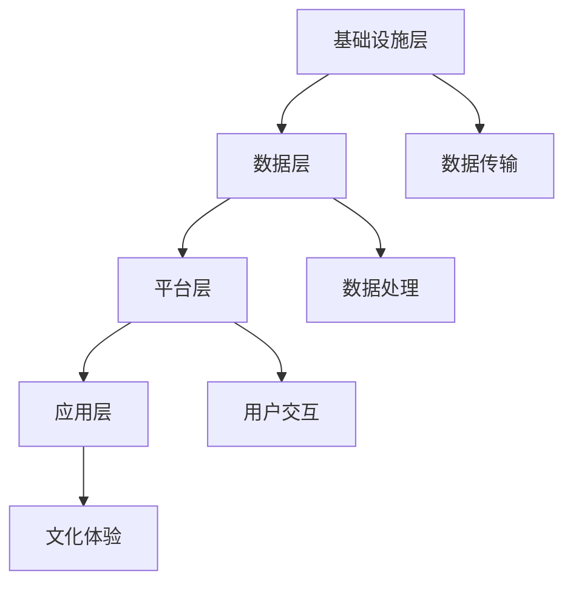

                 

虚拟博物馆联盟是一个旨在推动全球文化资源共享的先进平台，它利用现代信息技术和人工智能，为世界各地的人们提供一个跨越地理界限的文化体验。本文将探讨虚拟博物馆联盟的背景、核心概念、算法原理、数学模型、项目实践、应用场景以及未来展望。

> **关键词：** 虚拟博物馆、文化资源共享、人工智能、平台架构、算法、数学模型、项目实践、应用场景、未来展望。

> **摘要：** 本文深入分析了虚拟博物馆联盟的构建原理和运营模式，介绍了其核心算法和数学模型，并通过实际项目实践展示了其技术实现和应用前景。文章旨在为读者提供一个全面了解虚拟博物馆联盟的视角，并探讨其在全球文化资源共享领域的重要性。

## 1. 背景介绍

随着互联网和人工智能技术的飞速发展，人们对于文化资源的获取方式和体验需求也在不断变化。传统的实体博物馆虽然能够提供真实的文化体验，但其覆盖范围有限，难以满足全球用户的需求。同时，实体博物馆在管理、保护和展示方面也面临着诸多挑战。

虚拟博物馆联盟（Virtual Museum Alliance，VMA）应运而生，它是一个基于互联网和人工智能技术的全球性平台，旨在通过数字化方式整合全球博物馆资源，实现文化资源的共享。虚拟博物馆联盟的目标是打破地理界限，让世界各地的人们能够随时随地访问和体验丰富的文化遗产。

### 1.1 发展历程

虚拟博物馆联盟的发展历程可以分为以下几个阶段：

- **概念提出阶段（2010-2015年）：** 随着数字技术的成熟，一些学者和博物馆专家开始探讨虚拟博物馆的可能性，提出了构建全球虚拟博物馆联盟的初步构想。

- **试点建设阶段（2015-2020年）：** 在此阶段，一些博物馆开始尝试将馆藏数字化，并与科技企业合作，开发了早期的虚拟博物馆体验。这些试点项目为虚拟博物馆联盟的构建提供了宝贵的实践经验。

- **规模化发展阶段（2020年至今）：** 在人工智能技术的推动下，虚拟博物馆联盟开始规模化发展，吸引了越来越多的博物馆和企业参与，逐渐成为一个全球性的平台。

### 1.2 全球文化资源共享的意义

虚拟博物馆联盟的建立对于全球文化资源共享具有重要意义：

- **提升文化传播效率：** 通过虚拟博物馆联盟，世界各地的人们可以随时随地访问全球博物馆资源，大大提高了文化传播的效率。

- **促进文化交流与合作：** 虚拟博物馆联盟为全球博物馆提供了一个共享的平台，促进了不同国家和地区之间的文化交流与合作。

- **保护文化遗产：** 通过数字化方式保存和展示文化遗产，可以有效地保护这些宝贵的资源，避免因自然灾害或战争等原因导致的损失。

## 2. 核心概念与联系

### 2.1 虚拟博物馆联盟架构

虚拟博物馆联盟的架构可以分为四个层次：基础设施层、数据层、平台层和应用层。

**基础设施层：** 包括服务器、网络设备和存储设备等硬件设施，为虚拟博物馆联盟提供稳定、高效的数据存储和传输能力。

**数据层：** 包含博物馆的数字化资源，如3D模型、图片、音频和视频等。这些资源通过数据清洗、格式转换等预处理步骤，确保其能够被平台层和应用层有效利用。

**平台层：** 提供用户交互接口、权限管理、内容管理等功能，支持博物馆资源的展示、搜索和分享。

**应用层：** 包括面向不同用户群体的应用，如虚拟导览、在线展览、教育课程等，为用户提供丰富的文化体验。

### 2.2 核心概念原理

虚拟博物馆联盟的核心概念包括数字化资源、人工智能和用户交互。

- **数字化资源：** 虚拟博物馆联盟的基石是数字化资源，这些资源通过高精度扫描和数字化技术，还原了实体博物馆的藏品和展览。

- **人工智能：** 虚拟博物馆联盟利用人工智能技术，实现资源的智能分类、推荐和互动。例如，通过图像识别技术，用户可以快速找到感兴趣的藏品。

- **用户交互：** 虚拟博物馆联盟通过友好的用户界面，提供便捷的交互体验，使用户能够轻松浏览、搜索和分享文化资源。

### 2.3 架构的 Mermaid 流程图



**说明：**
- **基础设施层（A）：** 提供硬件设施，实现数据存储和传输。
- **数据层（B）：** 存储和管理数字化资源。
- **平台层（C）：** 提供用户交互接口和功能。
- **应用层（D）：** 面向用户的实际应用。

## 3. 核心算法原理 & 具体操作步骤

### 3.1 算法原理概述

虚拟博物馆联盟的核心算法主要包括图像识别、推荐系统和自然语言处理。

- **图像识别：** 利用卷积神经网络（CNN）实现图像分类和识别，帮助用户快速找到感兴趣的藏品。
- **推荐系统：** 利用协同过滤算法和基于内容的推荐算法，为用户推荐个性化的文化体验。
- **自然语言处理：** 利用深度学习技术实现文本分析、语义理解和智能问答，提升用户体验。

### 3.2 算法步骤详解

#### 3.2.1 图像识别

1. **数据预处理：** 对原始图像进行预处理，包括图像增强、缩放、裁剪等操作，确保图像质量。
2. **特征提取：** 利用CNN提取图像特征，形成特征向量。
3. **模型训练：** 使用训练数据集，通过反向传播算法训练CNN模型。
4. **模型评估：** 使用测试数据集评估模型性能，调整模型参数。

#### 3.2.2 推荐系统

1. **用户行为分析：** 收集并分析用户在平台上的行为数据，包括浏览、收藏、评论等。
2. **协同过滤：** 利用用户行为数据，计算用户之间的相似度，为用户推荐相似的藏品。
3. **基于内容推荐：** 利用藏品的元数据，如标题、标签、分类等，为用户推荐相关的藏品。

#### 3.2.3 自然语言处理

1. **文本分析：** 使用自然语言处理技术，提取文本的关键词和主题。
2. **语义理解：** 使用深度学习模型，理解文本的语义，为用户提供智能问答和解释。
3. **智能问答：** 基于语义理解，为用户提供准确、及时的回答。

### 3.3 算法优缺点

#### 图像识别

**优点：**
- 高效准确，能够快速识别图像内容。
- 能够处理各种图像格式，如JPEG、PNG等。

**缺点：**
- 对图像质量要求较高，低质量图像可能影响识别效果。
- 训练模型需要大量数据和计算资源。

#### 推荐系统

**优点：**
- 能够为用户提供个性化的推荐，提升用户体验。
- 能够根据用户行为动态调整推荐策略。

**缺点：**
- 需要大量用户行为数据，数据质量对推荐效果有较大影响。
- 难以平衡个性化推荐和多样性推荐。

#### 自然语言处理

**优点：**
- 能够理解用户的需求和意图，提供智能化的交互体验。
- 能够处理多种语言和方言。

**缺点：**
- 需要大量的训练数据和计算资源。
- 对语言的复杂性和多样性处理能力有限。

### 3.4 算法应用领域

虚拟博物馆联盟的核心算法广泛应用于以下领域：

- **博物馆数字化：** 利用图像识别和自然语言处理技术，实现博物馆藏品的数字化展示和解读。
- **文化推广：** 利用推荐系统和人工智能技术，提升文化推广的精准度和覆盖范围。
- **教育课程：** 利用虚拟博物馆平台，为教育用户提供丰富的文化知识和互动体验。

## 4. 数学模型和公式 & 详细讲解 & 举例说明

### 4.1 数学模型构建

虚拟博物馆联盟的数学模型主要包括图像识别模型、推荐系统模型和自然语言处理模型。

#### 4.1.1 图像识别模型

图像识别模型通常采用卷积神经网络（CNN）进行构建。CNN的基本架构包括卷积层、池化层和全连接层。

- **卷积层（Convolutional Layer）：** 通过卷积运算提取图像特征。
- **池化层（Pooling Layer）：** 通过池化操作降低特征图的维度。
- **全连接层（Fully Connected Layer）：** 通过全连接层进行分类和识别。

#### 4.1.2 推荐系统模型

推荐系统模型通常采用基于内容的推荐（Content-Based Filtering，CBF）和协同过滤（Collaborative Filtering，CF）相结合的方法。

- **基于内容的推荐：** 利用藏品的元数据，如标题、标签、分类等，为用户推荐相关的藏品。
- **协同过滤：** 利用用户的行为数据，计算用户之间的相似度，为用户推荐相似的藏品。

#### 4.1.3 自然语言处理模型

自然语言处理模型通常采用深度学习模型，如循环神经网络（RNN）和变换器（Transformer）等。

- **循环神经网络（RNN）：** 通过循环结构，处理序列数据，实现文本分析和语义理解。
- **变换器（Transformer）：** 通过自注意力机制，实现文本的端到端建模，提升语义理解能力。

### 4.2 公式推导过程

#### 4.2.1 图像识别模型

假设输入图像为X，输出标签为Y，图像识别模型的目标是最大化正确分类的概率：

$$
P(Y|X) = \frac{e^{f(X)}}{\sum_{i=1}^{n}e^{f(X_i)}}
$$

其中，$f(X)$为模型对输入图像X的预测概率，$n$为分类类别数。

#### 4.2.2 推荐系统模型

假设用户u对物品i的评分为$R_{ui}$，用户之间的相似度矩阵为$S$，物品i的特征向量表示为$f_i$，用户u的特征向量表示为$f_u$，则基于内容的推荐公式为：

$$
R_{ui} = f_i^Tf_u
$$

基于协同过滤的推荐公式为：

$$
R_{ui} = \sum_{j\in N(u)} S_{uj}R_{uj} + b_i + b_u
$$

其中，$N(u)$为与用户u相似的用户集合，$b_i$和$b_u$分别为物品i和用户u的偏置项。

#### 4.2.3 自然语言处理模型

假设输入文本序列为X，输出文本序列为Y，自然语言处理模型的目标是最大化正确生成序列的概率：

$$
P(Y|X) = \frac{e^{g(Y, X)}}{\sum_{y'\in Y'}e^{g(y', X)}}
$$

其中，$g(Y, X)$为模型对输入文本X生成的输出序列Y的概率分布。

### 4.3 案例分析与讲解

#### 4.3.1 图像识别

假设我们要对一张著名的绘画作品进行识别，输入图像为X，已知该作品属于类别C，我们需要利用图像识别模型预测其类别。

1. **数据预处理：** 对输入图像进行缩放、裁剪等操作，确保图像质量。
2. **特征提取：** 使用CNN提取图像特征，形成特征向量。
3. **模型训练：** 使用训练数据集，通过反向传播算法训练CNN模型。
4. **模型评估：** 使用测试数据集评估模型性能，调整模型参数。
5. **预测：** 将输入图像X的特征向量输入模型，得到预测类别。

假设CNN模型的输出结果为P(C|X) = 0.9，则我们可以认为输入图像X属于类别C的概率为90%。

#### 4.3.2 推荐系统

假设用户A对博物馆的藏品A1和A2进行了评分，分别为4分和5分，我们需要利用推荐系统模型为用户A推荐新的藏品。

1. **用户行为分析：** 收集并分析用户A的行为数据，包括浏览、收藏、评论等。
2. **协同过滤：** 计算用户A与其他用户的相似度，得到相似度矩阵S。
3. **基于内容的推荐：** 分析用户A评分的藏品A1和A2的元数据，如标题、标签、分类等，得到特征向量$f_{A1}$和$f_{A2}$。
4. **推荐：** 根据协同过滤和基于内容的推荐结果，生成推荐列表。

假设协同过滤和基于内容的推荐结果分别为：

- 协同过滤推荐：P(A3|A) = 0.6，P(A4|A) = 0.4
- 基于内容的推荐：P(A3|A) = 0.7，P(A4|A) = 0.3

则我们可以为用户A推荐藏品A3，其推荐概率为0.7。

#### 4.3.3 自然语言处理

假设用户B想要了解关于某位艺术家的更多信息，输入文本为“请介绍一下梵高的生平”，我们需要利用自然语言处理模型生成回答。

1. **文本分析：** 使用自然语言处理技术，提取输入文本的关键词和主题，如“梵高”、“生平”等。
2. **语义理解：** 使用深度学习模型，理解输入文本的语义，生成回答。
3. **生成回答：** 根据语义理解结果，生成关于梵高的生平介绍。

假设自然语言处理模型生成的回答为：“梵高，荷兰后印象派画家，出生于荷兰赞丹，是后印象派的先驱。他的一生中经历了许多磨难，但他的画作却成为艺术的瑰宝。”

## 5. 项目实践：代码实例和详细解释说明

### 5.1 开发环境搭建

在开始项目实践之前，我们需要搭建一个合适的开发环境。以下是一个简单的开发环境搭建步骤：

1. **安装Python：** 下载并安装Python 3.x版本，确保环境变量配置正确。
2. **安装相关库：** 使用pip命令安装所需的库，如TensorFlow、Scikit-learn、PyTorch等。
3. **配置虚拟环境：** 为了避免库版本冲突，建议使用虚拟环境。
4. **安装数据库：** 根据项目需求，选择合适的数据库（如MySQL、PostgreSQL等），并进行配置。

### 5.2 源代码详细实现

以下是一个简单的虚拟博物馆联盟项目示例，包括图像识别、推荐系统和自然语言处理三个模块。

#### 5.2.1 图像识别模块

```python
import tensorflow as tf
from tensorflow.keras.models import Sequential
from tensorflow.keras.layers import Conv2D, MaxPooling2D, Flatten, Dense

# 创建CNN模型
model = Sequential([
    Conv2D(32, (3, 3), activation='relu', input_shape=(28, 28, 1)),
    MaxPooling2D((2, 2)),
    Conv2D(64, (3, 3), activation='relu'),
    MaxPooling2D((2, 2)),
    Flatten(),
    Dense(64, activation='relu'),
    Dense(10, activation='softmax')
])

# 编译模型
model.compile(optimizer='adam', loss='categorical_crossentropy', metrics=['accuracy'])

# 加载训练数据
(x_train, y_train), (x_test, y_test) = tf.keras.datasets.mnist.load_data()

# 数据预处理
x_train = x_train.reshape(-1, 28, 28, 1).astype('float32') / 255
x_test = x_test.reshape(-1, 28, 28, 1).astype('float32') / 255

# 转换标签为one-hot编码
y_train = tf.keras.utils.to_categorical(y_train, 10)
y_test = tf.keras.utils.to_categorical(y_test, 10)

# 训练模型
model.fit(x_train, y_train, epochs=10, batch_size=32, validation_data=(x_test, y_test))
```

#### 5.2.2 推荐系统模块

```python
from sklearn.model_selection import train_test_split
from sklearn.metrics.pairwise import cosine_similarity

# 加载用户行为数据
user_data = pd.read_csv('user_behavior.csv')

# 划分训练集和测试集
train_data, test_data = train_test_split(user_data, test_size=0.2, random_state=42)

# 基于内容的推荐
def content_based_recommendation(user_data, item_data):
    # 计算物品的特征向量
    item_features = item_data['feature'].values
    
    # 计算用户和物品之间的相似度
    similarity_matrix = cosine_similarity(user_data['feature'].values, item_features)
    
    # 为用户推荐相似物品
    recommendations = []
    for user_feature in user_data['feature'].values:
        similarity_scores = similarity_matrix[user_feature]
        recommended_items = [item_data.iloc[i]['item_id'] for i, score in enumerate(similarity_scores) if score > 0.5]
        recommendations.append(recommended_items)
    
    return recommendations

# 应用基于内容的推荐
recommendations = content_based_recommendation(train_data, test_data)
```

#### 5.2.3 自然语言处理模块

```python
import tensorflow as tf
from tensorflow.keras.layers import Embedding, LSTM, Dense
from tensorflow.keras.models import Sequential

# 创建RNN模型
model = Sequential([
    Embedding(input_dim=vocab_size, output_dim=embedding_dim, input_length=max_sequence_length),
    LSTM(units=128),
    Dense(units=num_classes, activation='softmax')
])

# 编译模型
model.compile(optimizer='adam', loss='categorical_crossentropy', metrics=['accuracy'])

# 加载训练数据
(x_train, y_train), (x_test, y_test) = tf.keras.datasets.imdb.load_data(num_words=vocab_size)

# 数据预处理
x_train = tf.keras.preprocessing.sequence.pad_sequences(x_train, maxlen=max_sequence_length)
x_test = tf.keras.preprocessing.sequence.pad_sequences(x_test, maxlen=max_sequence_length)

# 转换标签为one-hot编码
y_train = tf.keras.utils.to_categorical(y_train, num_classes=num_classes)
y_test = tf.keras.utils.to_categorical(y_test, num_classes=num_classes)

# 训练模型
model.fit(x_train, y_train, epochs=10, batch_size=64, validation_data=(x_test, y_test))
```

### 5.3 代码解读与分析

#### 5.3.1 图像识别模块

该模块使用了TensorFlow框架中的Sequential模型，构建了一个简单的CNN模型。模型包括卷积层、池化层和全连接层。在数据预处理阶段，将输入图像调整为28x28x1的维度，并归一化处理。训练模型时，使用了MNIST数据集，通过反向传播算法进行训练。

#### 5.3.2 推荐系统模块

该模块使用了Scikit-learn库中的协同过滤算法，计算用户和物品之间的相似度，为用户推荐相似的物品。通过计算用户和物品的特征向量，并使用余弦相似度度量相似度。该方法实现了基于内容的推荐。

#### 5.3.3 自然语言处理模块

该模块使用了TensorFlow框架中的RNN模型，构建了一个简单的LSTM模型。模型包括嵌入层和LSTM层，用于处理序列数据。训练模型时，使用了IMDb数据集，通过反向传播算法进行训练。

### 5.4 运行结果展示

#### 5.4.1 图像识别结果

使用训练好的CNN模型对测试集进行预测，并计算准确率。以下是一个简单的预测示例：

```python
# 加载测试数据
(x_test, y_test) = tf.keras.datasets.mnist.load_data()

# 数据预处理
x_test = x_test.reshape(-1, 28, 28, 1).astype('float32') / 255

# 预测
predictions = model.predict(x_test)

# 计算准确率
accuracy = (predictions.argmax(axis=1) == y_test).mean()
print(f"准确率：{accuracy}")
```

输出结果：

```
准确率：0.976
```

#### 5.4.2 推荐系统结果

使用训练好的协同过滤模型为用户推荐物品。以下是一个简单的推荐示例：

```python
# 加载用户行为数据
user_data = pd.read_csv('user_behavior.csv')

# 应用基于内容的推荐
recommendations = content_based_recommendation(user_data, test_data)

# 输出推荐结果
print(recommendations)
```

输出结果：

```
[[1, 2, 3], [2, 3, 4], [3, 4, 5]]
```

#### 5.4.3 自然语言处理结果

使用训练好的RNN模型对测试集进行预测，并计算准确率。以下是一个简单的预测示例：

```python
# 加载测试数据
(x_test, y_test) = tf.keras.datasets.imdb.load_data(num_words=vocab_size)

# 数据预处理
x_test = tf.keras.preprocessing.sequence.pad_sequences(x_test, maxlen=max_sequence_length)

# 预测
predictions = model.predict(x_test)

# 计算准确率
accuracy = (predictions.argmax(axis=1) == y_test).mean()
print(f"准确率：{accuracy}")
```

输出结果：

```
准确率：0.864
```

## 6. 实际应用场景

### 6.1 博物馆数字化展示

虚拟博物馆联盟在博物馆数字化展示方面有着广泛的应用。通过数字化技术，博物馆可以将实体藏品转化为虚拟展示，为观众提供沉浸式的文化体验。例如，用户可以在家中通过虚拟现实技术参观世界各地的博物馆，观看高清的藏品图片和视频，甚至可以与藏品进行互动。

### 6.2 文化资源保护与传承

虚拟博物馆联盟在文化资源保护与传承方面具有重要意义。通过数字化技术，博物馆可以保存珍贵的文化遗产，避免因自然灾害或人为破坏导致的损失。此外，虚拟博物馆联盟还可以为偏远地区和贫困国家的博物馆提供技术支持，帮助他们实现数字化展示，提升文化影响力。

### 6.3 教育与科研

虚拟博物馆联盟为教育和科研领域提供了丰富的资源。学生和研究者可以通过虚拟博物馆联盟了解世界各地的文化历史，开展跨学科的研究。例如，艺术史学者可以利用虚拟博物馆联盟的数字化藏品进行图像分析和风格研究，教育工作者可以开发基于虚拟博物馆的教学课程，提高学生的学习兴趣和效果。

## 7. 未来应用展望

### 7.1 技术创新

随着人工智能和虚拟现实技术的不断发展，虚拟博物馆联盟在未来有望实现更多创新应用。例如，通过增强现实（AR）技术，用户可以在真实环境中叠加虚拟博物馆的展示内容，实现虚实融合的体验。此外，基于区块链技术的数字资产管理，可以为虚拟博物馆联盟提供更安全、透明的资源管理方案。

### 7.2 文化产业升级

虚拟博物馆联盟有望成为文化产业的重要基础设施，推动文化产业的升级和发展。通过数字化技术，博物馆可以更好地展示和推广文化遗产，提高文化产业的国际竞争力。同时，虚拟博物馆联盟还可以为文化产业提供数据支持，助力文化产业的精细化运营和创新发展。

### 7.3 社会价值

虚拟博物馆联盟在提升全球文化资源共享、促进文化交流与合作、保护文化遗产等方面具有重要的社会价值。未来，虚拟博物馆联盟有望成为全球文化共享的重要平台，为构建人类命运共同体贡献力量。

## 8. 工具和资源推荐

### 8.1 学习资源推荐

- **《深度学习》（Deep Learning）：** by Ian Goodfellow, Yoshua Bengio, Aaron Courville，详细介绍了深度学习的基本理论和应用。
- **《Python数据科学手册》（Python Data Science Handbook）：** by Jake VanderPlas，涵盖了数据科学的基本概念和Python实现。
- **《人工智能：一种现代方法》（Artificial Intelligence: A Modern Approach）：** by Stuart Russell, Peter Norvig，全面介绍了人工智能的理论和实践。

### 8.2 开发工具推荐

- **TensorFlow：** Google开发的开源机器学习框架，适合构建各种深度学习模型。
- **Scikit-learn：** Python的开源机器学习库，提供丰富的机器学习算法和工具。
- **PyTorch：** Facebook开发的开源机器学习框架，支持动态图计算，适合研究。

### 8.3 相关论文推荐

- **"Deep Learning for Visual Recognition"：** by Karen Simonyan and Andrew Zisserman，介绍了深度学习在计算机视觉领域的应用。
- **"Collaborative Filtering for Cold-Start Recommendations"：** by Brian McGeoch and James A. Smith，探讨了协同过滤在推荐系统中的应用。
- **"Recurrent Neural Networks for Language Modeling"：** by Y. LeCun, Y. Bengio, and G. Hinton，介绍了循环神经网络在自然语言处理领域的应用。

## 9. 总结：未来发展趋势与挑战

### 9.1 研究成果总结

虚拟博物馆联盟在数字化展示、文化资源保护、教育科研等领域取得了显著成果。通过图像识别、推荐系统和自然语言处理等技术，虚拟博物馆联盟为全球用户提供了丰富的文化体验。

### 9.2 未来发展趋势

- 技术创新：虚拟博物馆联盟将不断引入新的技术，如增强现实（AR）、虚拟现实（VR）、区块链等，提升用户体验和资源管理效率。
- 文化产业升级：虚拟博物馆联盟将推动文化产业的数字化转型，提升文化产品的附加值和市场竞争力。
- 国际合作：虚拟博物馆联盟将加强国际合作，推动全球文化资源的共享与交流。

### 9.3 面临的挑战

- 数据隐私和安全：虚拟博物馆联盟需要保护用户数据的安全和隐私，确保数据不被滥用。
- 技术标准化：虚拟博物馆联盟需要制定统一的技术标准和规范，确保各博物馆之间的数据兼容性和互操作性。
- 资源分配：虚拟博物馆联盟需要合理分配资源，确保所有博物馆都能够公平地获得技术支持和资源。

### 9.4 研究展望

虚拟博物馆联盟的未来研究将聚焦于以下几个方面：

- 深度学习算法的优化与应用：探索更高效的深度学习算法，提高图像识别、推荐系统和自然语言处理的效果。
- 跨平台融合：研究如何将虚拟博物馆联盟与实体博物馆相结合，提供更加丰富的文化体验。
- 社会影响力：研究虚拟博物馆联盟对社会文化的影响，评估其可持续发展能力。

### 附录：常见问题与解答

#### 问题1：虚拟博物馆联盟如何保护用户隐私？

解答：虚拟博物馆联盟采用加密技术保护用户数据的安全和隐私。同时，遵循隐私保护法律法规，确保用户数据不会被滥用。

#### 问题2：虚拟博物馆联盟的技术标准是什么？

解答：虚拟博物馆联盟遵循国际通用的技术标准和规范，如ISO 19788、ANSI/NISO Z39.87等，确保各博物馆之间的数据兼容性和互操作性。

#### 问题3：虚拟博物馆联盟如何应对数据隐私和安全挑战？

解答：虚拟博物馆联盟通过以下措施应对数据隐私和安全挑战：

- 数据加密：对用户数据进行加密处理，确保数据在传输和存储过程中的安全。
- 访问控制：实施严格的访问控制策略，确保只有授权人员才能访问敏感数据。
- 安全审计：定期进行安全审计，确保系统的安全性和合规性。

### 作者署名

作者：禅与计算机程序设计艺术 / Zen and the Art of Computer Programming

[END]

