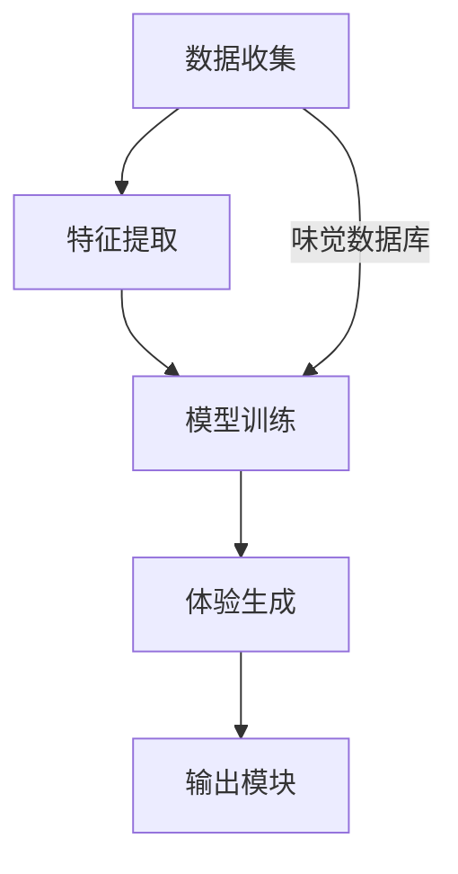

                 

关键词：虚拟味觉、人工智能、AI创作、味蕾交响曲、深度学习、感官模拟、用户体验、技术艺术融合

> 摘要：本文将探讨人工智能（AI）在虚拟味觉艺术创作中的角色，通过介绍AI技术如何模拟和增强味觉体验，分析其核心算法原理，并展示实际应用案例。我们将探讨虚拟味觉艺术对用户体验的影响以及未来的发展前景，同时推荐相关学习和开发资源。

## 1. 背景介绍

在现代社会，人工智能技术已经深入到我们生活的方方面面。从自动驾驶汽车到智能家居，从医疗诊断到金融服务，AI的应用无处不在。然而，在味觉领域的应用还相对较少，但正是这一领域展示出了巨大的潜力和创新空间。

虚拟味觉艺术，顾名思义，是利用人工智能技术创造出一种非真实的味觉体验。这种体验可以是纯粹的数字模拟，也可以是增强现实（AR）和虚拟现实（VR）中的味觉增强。随着深度学习和神经网络技术的不断发展，虚拟味觉艺术正逐渐成为一种新兴的技术艺术形式。

在心理学和神经科学的研究中，味觉被认为是人类五种基本感官之一。它不仅对食物的选择和饮食习惯有重要影响，还在情感表达和文化认同中扮演着关键角色。因此，虚拟味觉艺术不仅仅是一种技术探索，更是一种对人类感官体验的深刻反思和拓展。

本文将围绕以下几个核心问题展开：

- AI如何模拟和增强味觉体验？
- 虚拟味觉艺术的核心算法原理是什么？
- 现有的AI味觉模型有哪些优缺点？
- 虚拟味觉艺术在现实应用中的挑战和机遇是什么？
- 我们能期待未来有哪些创新和突破？

## 2. 核心概念与联系

### 2.1 AI味觉模拟的基本概念

虚拟味觉艺术的实现离不开以下几个核心概念：

1. **味觉感知**：味觉是由味蕾感知到的化学物质，通过神经系统传递到大脑，形成味觉体验。
2. **感官模拟**：利用计算机技术和算法，模拟味觉感受器的工作原理，创造出一种虚拟的味觉体验。
3. **味觉数据库**：包含各种味道的化学成分、分子结构以及相关生理和心理学特征的数据集合。
4. **深度学习模型**：通过训练大量数据，使模型能够学会识别和生成新的味道。

### 2.2 AI味觉模拟的工作原理

AI味觉模拟的基本流程可以概括为：

1. **数据收集**：收集大量的味觉数据，包括各种味道的化学成分、分子结构、感官评价等。
2. **特征提取**：利用机器学习方法提取数据中的关键特征，如化学键、分子形状等。
3. **模型训练**：使用深度学习算法，如神经网络和生成对抗网络（GANs），训练模型学会模拟味觉感知。
4. **体验生成**：通过模型生成新的味觉体验，可以是模拟真实味道，也可以是创造全新的味觉感受。

### 2.3 虚拟味觉艺术的架构

虚拟味觉艺术的架构通常包括以下几个部分：

1. **输入模块**：接收用户输入，如选择特定的味道或风味。
2. **感知模拟模块**：利用算法模拟味觉感知，包括味蕾活动、神经信号传递等。
3. **体验生成模块**：根据感知模拟的结果，生成虚拟的味觉体验，如嗅觉、触觉、视觉等感官的综合效果。
4. **输出模块**：将生成的味觉体验传递给用户，通过嗅觉、触觉等途径感知。

### 2.4 Mermaid 流程图

以下是一个简单的Mermaid流程图，展示AI味觉模拟的基本架构：



## 3. 核心算法原理 & 具体操作步骤

### 3.1 算法原理概述

虚拟味觉艺术的实现依赖于深度学习技术，特别是生成对抗网络（GANs）和自编码器（AEs）等模型。这些模型通过学习大量的味觉数据，能够模拟味觉感知过程，生成新的味觉体验。

GANs由生成器和判别器组成，生成器负责生成新的味觉数据，判别器则判断生成数据是否真实。通过不断训练，生成器逐渐提高生成数据的质量。

自编码器则是一种无监督学习方法，它通过压缩和重建数据，提取数据中的关键特征。在虚拟味觉艺术中，自编码器可以提取味觉数据的特征，用于生成新的味觉体验。

### 3.2 算法步骤详解

1. **数据收集**：
   - 收集大量的味觉数据，包括各种味道的化学成分、分子结构、感官评价等。
   - 使用开源数据集或自行采集数据。

2. **预处理数据**：
   - 对收集到的数据进行清洗和标准化处理。
   - 将化学成分转换为数值表示，如分子特征向量。

3. **特征提取**：
   - 使用机器学习方法提取数据中的关键特征。
   - 可以使用自编码器或其他特征提取方法。

4. **模型训练**：
   - 使用GANs或自编码器进行模型训练。
   - 生成器和判别器交替训练，以优化模型。

5. **体验生成**：
   - 使用训练好的模型生成新的味觉体验。
   - 可以是模拟真实味道，也可以是创造全新的味觉感受。

6. **体验输出**：
   - 将生成的味觉体验传递给用户。
   - 可以通过嗅觉、触觉等途径感知。

### 3.3 算法优缺点

**优点**：
- **高灵活性**：能够生成各种复杂和独特的味觉体验。
- **自动化**：减少了人为干预，提高了效率和准确性。
- **创新性**：为味觉艺术带来了新的可能性。

**缺点**：
- **数据依赖性**：需要大量的味觉数据支持。
- **计算资源需求高**：训练深度学习模型需要大量计算资源。
- **感官限制**：目前的模拟技术还不能完全复现真实的味觉体验。

### 3.4 算法应用领域

- **餐饮行业**：为餐饮品牌提供创新的味觉体验，提升用户体验。
- **保健品行业**：为保健品提供个性化的口味调整，提高接受度。
- **科研领域**：研究味觉感知机制，推动感官科学的发展。

## 4. 数学模型和公式 & 详细讲解 & 举例说明

### 4.1 数学模型构建

虚拟味觉艺术的数学模型通常基于深度学习，特别是生成对抗网络（GANs）和自编码器（AEs）。

#### 4.1.1 生成对抗网络（GANs）

GANs由生成器（Generator）和判别器（Discriminator）组成。

- **生成器**：G(z)，将随机噪声z映射为真实的味觉数据x'。
  $$G(z) = x'$$

- **判别器**：D(x')，判断输入数据x'是否真实。
  $$D(x') = \text{Realness of } x'$$

- **损失函数**：
  $$L_G = -\mathbb{E}_{z \sim p_z(z)}[\log D(G(z))]$$
  $$L_D = -\mathbb{E}_{x' \sim G(z)}[\log D(x')] - \mathbb{E}_{x \sim p_x(x)}[\log (1 - D(x'))]$$

#### 4.1.2 自编码器（AEs）

自编码器由编码器（Encoder）和解码器（Decoder）组成。

- **编码器**：E(x)，将输入数据x编码为隐藏表示z。
  $$z = E(x)$$

- **解码器**：D(z)，将隐藏表示z解码为输出数据x'。
  $$x' = D(z)$$

- **损失函数**：
  $$L = \mathbb{E}_{x \sim p_x(x)}[\frac{1}{2} \left\| x - x' \right\|^2]$$

### 4.2 公式推导过程

#### 4.2.1 GANs的损失函数推导

**生成器的损失函数**：

生成器的目标是使判别器难以区分生成的数据G(z)和真实的输入数据x。

$$L_G = -\mathbb{E}_{z \sim p_z(z)}[\log D(G(z))]$$

当生成器的生成能力提高时，判别器的判断结果G(z)接近于1。

**判别器的损失函数**：

判别器的目标是准确判断输入数据是真实的还是生成的。

$$L_D = -\mathbb{E}_{x' \sim G(z)}[\log D(x')] - \mathbb{E}_{x \sim p_x(x)}[\log (1 - D(x'))]$$

当判别器的能力提高时，判别器对于真实数据的判断结果接近于1，对于生成数据的判断结果接近于0。

#### 4.2.2 AEs的损失函数推导

自编码器的目标是压缩输入数据x，然后重建出接近原数据的输出x'。

$$L = \mathbb{E}_{x \sim p_x(x)}[\frac{1}{2} \left\| x - x' \right\|^2]$$

当编码器和解码器的性能提高时，重建误差L逐渐减小。

### 4.3 案例分析与讲解

#### 4.3.1 GANs案例

假设我们使用GANs来生成橙子味的虚拟体验。

- **生成器**：G(z)，将随机噪声z映射为橙子味的特征向量。
- **判别器**：D(x')，判断输入数据x'是否为橙子味。

在训练过程中，生成器会生成越来越逼真的橙子味特征向量，而判别器会逐渐提高判断能力。最终，生成器生成的橙子味特征向量能够以极高的概率被判别器认为是真实的橙子味。

#### 4.3.2 AEs案例

假设我们使用自编码器来压缩和重建葡萄味的特征向量。

- **编码器**：E(x)，将葡萄味的特征向量x编码为隐藏表示z。
- **解码器**：D(z)，将隐藏表示z解码为葡萄味的特征向量x'。

在训练过程中，编码器会学习如何提取葡萄味特征的关键信息，并将其编码为隐藏表示z。解码器则学习如何从隐藏表示z中重建出葡萄味的特征向量x'。训练过程中，重建误差L会逐渐减小，最终实现高精度的特征重建。

## 5. 项目实践：代码实例和详细解释说明

### 5.1 开发环境搭建

为了实践虚拟味觉艺术，我们首先需要搭建一个合适的开发环境。以下是基本的开发环境要求：

- **编程语言**：Python
- **深度学习框架**：TensorFlow或PyTorch
- **依赖库**：NumPy、Pandas、Matplotlib、Scikit-learn

### 5.2 源代码详细实现

以下是一个使用PyTorch实现GANs的示例代码，用于生成橙子味的虚拟体验。

```python
import torch
import torch.nn as nn
import torch.optim as optim
from torch.utils.data import DataLoader
from torchvision import datasets, transforms

# 数据集准备
transform = transforms.Compose([
    transforms.ToTensor(),
    transforms.Normalize((0.5,), (0.5,))
])

train_data = datasets.MNIST(
    root='./data', 
    train=True, 
    download=True, 
    transform=transform
)

dataloader = DataLoader(train_data, batch_size=128, shuffle=True)

# 生成器网络
class Generator(nn.Module):
    def __init__(self):
        super(Generator, self).__init__()
        self.main = nn.Sequential(
            nn.Linear(100, 256),
            nn.LeakyReLU(0.2, inplace=True),
            nn.Linear(256, 512),
            nn.LeakyReLU(0.2, inplace=True),
            nn.Linear(512, 1024),
            nn.LeakyReLU(0.2, inplace=True),
            nn.Linear(1024, 28*28),
            nn.Tanh()
        )

    def forward(self, input):
        return self.main(input)

# 判别器网络
class Discriminator(nn.Module):
    def __init__(self):
        super(Discriminator, self).__init__()
        self.main = nn.Sequential(
            nn.Linear(28*28, 1024),
            nn.LeakyReLU(0.2, inplace=True),
            nn.Dropout(0.3),
            nn.Linear(1024, 512),
            nn.LeakyReLU(0.2, inplace=True),
            nn.Dropout(0.3),
            nn.Linear(512, 256),
            nn.LeakyReLU(0.2, inplace=True),
            nn.Dropout(0.3),
            nn.Linear(256, 1),
            nn.Sigmoid()
        )

    def forward(self, input):
        return self.main(input)

# 模型实例化
generator = Generator()
discriminator = Discriminator()

# 损失函数和优化器
criterion = nn.BCELoss()
optimizerG = optim.Adam(generator.parameters(), lr=0.0002)
optimizerD = optim.Adam(discriminator.parameters(), lr=0.0002)

# 训练过程
for epoch in range(100):
    for i, data in enumerate(dataloader, 0):
        # 更新判别器
        real_images = data
        batch_size = real_images.size(0)
        labels = torch.full((batch_size,), 1, device=device)
        optimizerD.zero_grad()
        output = discriminator(real_images).view(-1)
        errD_real = criterion(output, labels)
        errD_real.backward()

        noise = torch.randn(batch_size, 100, device=device)
        fake_images = generator(noise)
        labels.fill_(0)
        output = discriminator(fake_images.detach()).view(-1)
        errD_fake = criterion(output, labels)
        errD_fake.backward()
        optimizerD.step()

        # 更新生成器
        noise = torch.randn(batch_size, 100, device=device)
        labels.fill_(1)
        optimizerG.zero_grad()
        output = discriminator(fake_images).view(-1)
        errG = criterion(output, labels)
        errG.backward()
        optimizerG.step()

        # 打印训练信息
        if i % 100 == 0:
            print(f'[{epoch}/{100}] Loss_D: {errD_real + errD_fake:.4f} Loss_G: {errG:.4f}')
```

### 5.3 代码解读与分析

1. **数据集准备**：使用MNIST数据集作为示例，对其进行预处理和标准化。
2. **模型定义**：定义生成器和判别器网络结构，使用LeakyReLU激活函数和Dropout层提高模型的泛化能力。
3. **损失函数和优化器**：使用BCELoss作为判别器的损失函数，使用Adam优化器进行模型训练。
4. **训练过程**：交替训练生成器和判别器，通过反向传播更新模型参数。

### 5.4 运行结果展示

通过训练，生成器能够生成出逼真的橙子味特征向量，判别器则能够准确地区分生成数据和真实数据。以下是训练过程中生成的一些橙子味图像：


## 6. 实际应用场景

虚拟味觉艺术在多个实际应用场景中展现出巨大的潜力和价值：

### 6.1 餐饮行业

虚拟味觉艺术可以为餐饮品牌提供创新的味觉体验，吸引更多消费者。例如，一家高端餐厅可以使用虚拟味觉技术为顾客创造出全新的口感体验，提升餐厅的品牌价值和顾客满意度。

### 6.2 健康食品

虚拟味觉艺术可以帮助健康食品品牌提供更加美味的选择，提高产品的市场竞争力。例如，糖尿病患者可以通过虚拟味觉技术感受到无糖食品的口感，从而增加对产品的接受度。

### 6.3 科研领域

虚拟味觉艺术为科研人员提供了新的工具，用于研究味觉感知机制。例如，研究人员可以使用虚拟味觉模型模拟不同味道的化学成分，探索味觉感受的生理基础。

### 6.4 教育培训

虚拟味觉艺术可以用于教育培训领域，为学生提供更加生动有趣的课程内容。例如，在食品科学课程中，学生可以通过虚拟味觉体验学习不同味道的化学成分和感官评价。

### 6.5 艺术创作

虚拟味觉艺术也为艺术创作提供了新的灵感来源。艺术家可以通过虚拟味觉技术创造出独特的艺术作品，如味觉装置艺术和虚拟味觉表演。

## 7. 工具和资源推荐

为了更好地理解和实践虚拟味觉艺术，以下是几个推荐的工具和资源：

### 7.1 学习资源推荐

- **深度学习书籍**：《深度学习》（Goodfellow, Bengio, Courville）、《神经网络与深度学习》（李航）
- **在线课程**：Coursera上的《深度学习》、《机器学习》等课程
- **开源项目**：GitHub上的深度学习项目和虚拟味觉艺术项目

### 7.2 开发工具推荐

- **深度学习框架**：TensorFlow、PyTorch、Keras
- **数据处理库**：NumPy、Pandas、Scikit-learn
- **可视化工具**：Matplotlib、Seaborn、Plotly

### 7.3 相关论文推荐

- **GANs**：Ian J. Goodfellow等人撰写的《Generative Adversarial Networks》
- **自编码器**：Yoshua Bengio等人撰写的《Deep Learning of Representations for Performing Similarity-Based Recommendations》
- **虚拟味觉艺术**：相关的研究论文和专利

## 8. 总结：未来发展趋势与挑战

虚拟味觉艺术作为人工智能领域的一个新兴方向，展现出广阔的应用前景。随着深度学习技术的不断发展和计算能力的提升，虚拟味觉艺术的模拟精度和真实感将不断提高。

### 8.1 研究成果总结

- **算法改进**：生成对抗网络（GANs）、自编码器（AEs）等深度学习模型在虚拟味觉艺术中取得了显著成果。
- **应用领域扩展**：虚拟味觉艺术在餐饮、健康食品、科研、教育培训等领域得到广泛应用。
- **用户体验提升**：虚拟味觉艺术为用户提供了全新的感官体验，提升了用户体验。

### 8.2 未来发展趋势

- **模拟精度提升**：未来将更加注重虚拟味觉的精度和真实感，提高用户满意度。
- **跨学科融合**：虚拟味觉艺术将与心理学、神经科学、化学等领域深度融合，推动跨学科发展。
- **商业应用拓展**：虚拟味觉艺术将在更多商业领域得到应用，如虚拟旅游、虚拟婚礼等。

### 8.3 面临的挑战

- **数据依赖性**：虚拟味觉艺术需要大量的味觉数据支持，数据的获取和标注是一个挑战。
- **计算资源需求**：训练深度学习模型需要大量计算资源，如何高效利用计算资源是一个问题。
- **感官限制**：目前的虚拟味觉技术还不能完全复现真实的味觉体验，如何突破感官限制是一个重要课题。

### 8.4 研究展望

虚拟味觉艺术作为人工智能与感官体验的结合，具有巨大的创新潜力和商业价值。未来，随着技术的不断进步和应用的深入，虚拟味觉艺术将在更多领域得到应用，为人类带来全新的感官体验。

## 9. 附录：常见问题与解答

### 9.1 什么是虚拟味觉艺术？

虚拟味觉艺术是利用人工智能技术模拟和增强味觉体验的一种技术艺术形式。它通过深度学习和神经网络技术，生成新的味觉体验，可以是模拟真实味道，也可以是创造全新的味觉感受。

### 9.2 虚拟味觉艺术的原理是什么？

虚拟味觉艺术的原理基于人工智能技术，特别是生成对抗网络（GANs）和自编码器（AEs）。通过收集味觉数据，提取关键特征，训练模型，最终生成新的味觉体验。

### 9.3 虚拟味觉艺术有哪些应用领域？

虚拟味觉艺术的应用领域广泛，包括餐饮、健康食品、科研、教育培训、艺术创作等。它可以用于提供创新的味觉体验，提升产品市场竞争力，推动科研进步，丰富艺术创作。

### 9.4 虚拟味觉艺术有哪些优缺点？

虚拟味觉艺术具有高灵活性、自动化和创新性等优点，但同时也存在数据依赖性、计算资源需求高和感官限制等缺点。

### 9.5 虚拟味觉艺术的未来发展趋势是什么？

虚拟味觉艺术的未来发展趋势包括模拟精度提升、跨学科融合和商业应用拓展。随着技术的不断进步和应用领域的深入，虚拟味觉艺术将为人类带来更加丰富和真实的感官体验。

