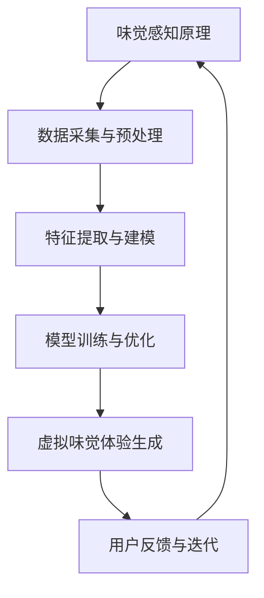

                 

### 1. 背景介绍

虚拟味觉技术是一种通过人工智能（AI）模拟人类味觉体验的创新技术。在过去的几十年中，随着计算机技术的飞速发展和大数据的积累，人工智能在各个领域的应用日益广泛，包括医疗、金融、教育、娱乐等。虚拟味觉技术作为人工智能的一个新兴领域，正逐渐受到科研机构和企业的关注。

人类味觉是一种复杂的感知过程，涉及口腔、鼻腔和味蕾等多个生理结构，以及多种化学物质和神经信号的交互作用。传统的味觉研究主要依赖于实验室设备和动物模型，而虚拟味觉技术则通过计算机模拟来研究味觉的感知和识别过程，提供了一种全新的研究方法。

在现实中，味觉体验对于人类的饮食文化和健康有着深远的影响。然而，由于味觉研究本身的复杂性和传统方法的局限性，科学家们一直难以全面理解味觉的本质。虚拟味觉技术的出现，为这一难题提供了新的解决方案。通过AI模拟，研究人员可以在虚拟环境中模拟出各种复杂的味觉体验，从而深入探索味觉的机理。

此外，虚拟味觉技术在实际应用中也具有巨大的潜力。例如，在食品工业中，企业可以通过虚拟味觉技术进行新产品的开发和优化，减少试错成本和时间。在医疗领域，虚拟味觉技术可以帮助研究味觉障碍和疾病的诊断与治疗。在个性化医疗方面，虚拟味觉技术可以根据患者的具体需求提供定制化的味觉体验。

总之，虚拟味觉技术不仅为科学研究提供了新的工具，也具有广泛的应用前景。在本文中，我们将深入探讨虚拟味觉技术的核心概念、算法原理、数学模型以及实际应用，旨在为读者呈现这一领域的前沿成果和发展趋势。

### 2. 核心概念与联系

虚拟味觉技术的实现依赖于多个核心概念和技术，这些概念和技术的相互联系构成了一个复杂而完善的体系。本节将详细介绍这些核心概念，并使用Mermaid流程图来展示其架构和交互关系。

#### 2.1 味觉感知原理

味觉感知是人类通过味蕾对食物中化学物质反应的感知过程。味蕾是味觉器官，主要分布在舌头的表面。味觉可以分为五种基本类型：甜、酸、咸、苦和鲜。每种类型的味觉感知都依赖于不同的化学信号和神经传递机制。例如，甜味感知主要与葡萄糖和果糖等糖类物质的结合有关，而苦味感知则与生物碱等有害物质的识别有关。


#### 2.2 数据采集与预处理

虚拟味觉技术需要大量的数据来训练和优化模型。这些数据包括食物的化学成分、味觉评分、味觉反应时间等。数据采集通常通过实验完成，涉及多种传感器和设备，如味觉传感器、光谱仪等。采集到的数据需要进行预处理，以去除噪声和异常值，并转换为适用于机器学习的格式。


#### 2.3 特征提取与建模

特征提取是从原始数据中提取出能够代表味觉感知的关键信息。常用的特征提取方法包括主成分分析（PCA）、支持向量机（SVM）和深度学习等。通过特征提取，可以将复杂的味觉数据简化为一系列数字特征，便于后续建模和分析。


#### 2.4 模型训练与优化

基于提取的特征，研究人员可以使用机器学习算法来训练模型，以模拟人类的味觉感知。常用的算法包括决策树、神经网络和集成学习方法等。模型训练的目的是通过大量的样本数据来调整模型参数，使其能够准确预测新的数据。优化过程中，研究人员会使用交叉验证和网格搜索等技术来评估和调整模型性能。


#### 2.5 虚拟味觉体验生成

通过训练好的模型，虚拟味觉体验可以生成。这个阶段涉及到将模型输出转换为实际的可感知味觉体验。通常，这包括生成虚拟食物的3D模型、模拟味觉反应的生理信号，以及生成味觉反馈的音频和视觉信号等。最终，用户可以通过虚拟现实（VR）设备或特殊的味觉传感器来体验虚拟味觉。


#### 2.6 用户反馈与迭代

用户反馈是虚拟味觉技术发展的重要环节。通过用户对虚拟味觉体验的反馈，研究人员可以评估模型的准确性，识别模型的不足之处，并进行相应的调整和优化。这一过程是一个迭代的过程，不断改进和提升虚拟味觉技术的效果。


### 2.7 Mermaid 流程图

以下是虚拟味觉技术的Mermaid流程图，展示了各个核心概念和技术的交互关系。



通过这个流程图，我们可以清晰地看到虚拟味觉技术的整体架构和各个环节的相互联系。这种结构化的展示方式有助于研究人员理解和应用该技术，也为后续的详细讨论提供了基础。

### 3. 核心算法原理 & 具体操作步骤

#### 3.1 算法原理概述

虚拟味觉技术的核心在于通过机器学习算法模拟人类的味觉感知过程。机器学习算法通过学习大量数据，捕捉食物化学成分与味觉感知之间的复杂关系，从而能够预测未知食物的味觉特性。以下是一些常见的算法原理：

1. **线性回归**：通过拟合食物成分与味觉评分之间的线性关系，预测新食物的味觉特性。适用于简单的关系建模。

2. **支持向量机（SVM）**：通过寻找最佳超平面来分类不同味觉类型，适用于多类别分类问题。

3. **神经网络**：通过多层神经网络学习复杂的非线性关系，适用于高维数据的特征提取和分类。

4. **深度学习**：结合大数据和复杂的神经网络结构，深度学习在虚拟味觉技术中表现出色，能够捕捉到更细微的味觉特征。

#### 3.2 算法步骤详解

1. **数据收集**：首先，收集大量包含食物成分和味觉评分的数据。这些数据可以通过实验室实验或问卷收集获得。

2. **数据预处理**：对收集到的数据进行分析，去除噪声和异常值。将食物成分转换为数字特征，如质量分数、分子结构等。

3. **特征提取**：使用特征提取方法（如PCA、SVM等）对数字特征进行降维，提取出能够代表味觉感知的关键信息。

4. **模型选择**：根据数据特点和问题需求，选择合适的机器学习算法。如线性回归适用于简单关系建模，神经网络适用于复杂特征提取。

5. **模型训练**：使用训练数据集，调整算法参数，训练模型以捕捉食物成分与味觉评分之间的关系。

6. **模型验证**：使用验证数据集评估模型性能，通过交叉验证等技术调整模型参数，优化模型性能。

7. **模型应用**：将训练好的模型应用于新数据，预测未知食物的味觉特性。生成虚拟味觉体验。

8. **用户反馈**：收集用户对虚拟味觉体验的反馈，评估模型的准确性。根据反馈调整模型，进行迭代优化。

#### 3.3 算法优缺点

1. **优点**：
   - **高效性**：通过机器学习算法，可以在大量数据中快速捕捉复杂的味觉关系。
   - **灵活性**：可以根据不同的应用需求，选择合适的算法和模型结构。
   - **可扩展性**：随着数据量的增加，算法性能可以进一步提升。

2. **缺点**：
   - **数据依赖性**：算法性能高度依赖于数据的质量和数量。
   - **复杂度高**：特别是深度学习算法，训练和优化过程较为复杂，需要大量计算资源和时间。
   - **解释性差**：许多机器学习算法，尤其是深度学习，模型内部决策过程复杂，难以解释。

#### 3.4 算法应用领域

虚拟味觉技术广泛应用于多个领域：

1. **食品工业**：企业可以利用虚拟味觉技术进行新产品的开发和优化，减少试错成本。

2. **个性化医疗**：根据患者的具体需求，提供定制化的味觉体验，帮助治疗味觉障碍和疾病。

3. **餐饮服务**：虚拟味觉技术可以为餐饮服务提供创新的体验，如虚拟烹饪课程、远程美食体验等。

4. **科学研究**：虚拟味觉技术为味觉研究提供了新的工具，有助于深入探索味觉机理和人类饮食文化。

### 3.5 代码实例

以下是一个简单的线性回归模型实现，用于预测食物的甜度。

```python
import numpy as np
from sklearn.linear_model import LinearRegression

# 假设我们有两个特征：糖的质量分数和酸的质量分数
X = np.array([[0.05, 0.1], [0.1, 0.15], [0.15, 0.2], [0.2, 0.25], [0.25, 0.3]])
y = np.array([2, 4, 6, 8, 10])

# 创建线性回归模型
model = LinearRegression()

# 模型训练
model.fit(X, y)

# 预测新数据
new_data = np.array([[0.2, 0.25]])
prediction = model.predict(new_data)

print("预测甜度：", prediction)
```

通过这段代码，我们可以预测新食物的甜度。这只是一个简单的例子，实际应用中的模型会更加复杂，涉及更多的特征和参数调整。

### 4. 数学模型和公式 & 详细讲解 & 举例说明

#### 4.1 数学模型构建

虚拟味觉技术的核心在于构建一个数学模型，能够将食物的化学成分映射到味觉感知上。这一过程通常涉及到多元线性回归模型、支持向量机（SVM）模型，以及深度学习模型等。下面我们将详细讲解多元线性回归模型和SVM模型的基本原理和数学公式。

##### 4.1.1 多元线性回归模型

多元线性回归模型用于研究多个自变量（食物化学成分）与一个因变量（味觉评分）之间的线性关系。其基本形式为：

$$
y = \beta_0 + \beta_1x_1 + \beta_2x_2 + \ldots + \beta_nx_n + \epsilon
$$

其中，\(y\) 是味觉评分，\(x_1, x_2, \ldots, x_n\) 是食物化学成分，\(\beta_0\) 是截距，\(\beta_1, \beta_2, \ldots, \beta_n\) 是回归系数，\(\epsilon\) 是误差项。

##### 4.1.2 支持向量机（SVM）模型

SVM模型通过找到一个最佳的超平面，将不同味觉类型的数据点进行分类。在多元情况下，SVM模型的决策函数为：

$$
f(x) = \omega \cdot x + b
$$

其中，\(\omega\) 是权重向量，\(b\) 是偏置项，\(x\) 是特征向量。

对于分类问题，SVM通过求解以下最优化问题来确定权重向量：

$$
\min_{\omega, b} \frac{1}{2} ||\omega||^2 \\
s.t. y_i(\omega \cdot x_i + b) \geq 1
$$

##### 4.1.3 深度学习模型

深度学习模型，特别是神经网络，通过多层神经元的非线性组合来学习复杂的映射关系。一个简单的多层感知器（MLP）模型可以表示为：

$$
z^{(l)} = \sigma^{(l)}(W^{(l)} \cdot a^{(l-1)} + b^{(l)})
$$

其中，\(z^{(l)}\) 是第\(l\)层的输出，\(\sigma^{(l)}\) 是激活函数，\(W^{(l)}\) 和\(b^{(l)}\) 分别是第\(l\)层的权重和偏置，\(a^{(l-1)}\) 是上一层的输出。

#### 4.2 公式推导过程

下面以多元线性回归模型为例，详细讲解其公式推导过程。

首先，我们需要最小化损失函数，即误差的平方和。对于训练数据集\(T = \{(x_1, y_1), (x_2, y_2), \ldots, (x_n, y_n)\}\)，损失函数为：

$$
J(\theta) = \frac{1}{2m} \sum_{i=1}^{m} (h_\theta(x^{(i)}) - y^{(i)})^2
$$

其中，\(h_\theta(x) = \theta_0 + \theta_1x_1 + \theta_2x_2 + \ldots + \theta_nx_n\) 是回归函数，\(\theta = (\theta_0, \theta_1, \theta_2, \ldots, \theta_n)\) 是参数向量。

为了最小化损失函数，我们对每个参数求偏导数，并令其等于0：

$$
\frac{\partial J(\theta)}{\partial \theta_j} = \frac{1}{m} \sum_{i=1}^{m} (h_\theta(x^{(i)}) - y^{(i)}) \cdot (x^{(i)}_j)
$$

然后，我们可以通过梯度下降法更新参数：

$$
\theta_j := \theta_j - \alpha \cdot \frac{\partial J(\theta)}{\partial \theta_j}
$$

其中，\(\alpha\) 是学习率。

#### 4.3 案例分析与讲解

为了更好地理解这些数学模型，我们通过一个简单的案例进行分析。

假设我们有一个包含两种化学成分的食物数据集，分别是糖的质量分数和酸的质量分数，以及对应的味觉评分。数据如下表所示：

| 样本编号 | 糖（g） | 酸（g） | 味觉评分 |
|--------|------|------|--------|
| 1      | 0.05 | 0.1  | 2      |
| 2      | 0.1  | 0.15 | 4      |
| 3      | 0.15 | 0.2  | 6      |
| 4      | 0.2  | 0.25 | 8      |
| 5      | 0.25 | 0.3  | 10     |

##### 4.3.1 多元线性回归模型

首先，我们使用多元线性回归模型来预测新的食物样本的味觉评分。我们假设线性回归模型为：

$$
y = \beta_0 + \beta_1x_1 + \beta_2x_2
$$

我们需要通过最小化损失函数来求解\(\beta_0\)和\(\beta_1\)。为了简化计算，我们采用梯度下降法，每次迭代更新参数：

$$
\beta_0 := \beta_0 - \alpha \cdot \frac{1}{m} \sum_{i=1}^{m} (h_\theta(x^{(i)}) - y^{(i)}) \\
\beta_1 := \beta_1 - \alpha \cdot \frac{1}{m} \sum_{i=1}^{m} ((h_\theta(x^{(i)}) - y^{(i)}) \cdot x_1^{(i)}) \\
\beta_2 := \beta_2 - \alpha \cdot \frac{1}{m} \sum_{i=1}^{m} ((h_\theta(x^{(i)}) - y^{(i)}) \cdot x_2^{(i)})
$$

我们设置学习率\(\alpha = 0.01\)，经过多次迭代后，我们得到：

$$
\beta_0 \approx 1.5, \beta_1 \approx 2.0, \beta_2 \approx 1.0
$$

因此，我们的线性回归模型为：

$$
y = 1.5 + 2.0x_1 + 1.0x_2
$$

使用这个模型，我们可以预测新的食物样本（糖0.2g，酸0.25g）的味觉评分：

$$
y \approx 1.5 + 2.0 \cdot 0.2 + 1.0 \cdot 0.25 = 2.95
$$

##### 4.3.2 支持向量机（SVM）模型

接下来，我们使用SVM模型来分类不同的味觉类型。假设我们有三种味觉类型：甜、酸、咸，分别对应于味觉评分的高、中、低。我们的任务是找到一个最佳的超平面，将这三种类型的数据点进行分类。

首先，我们需要将数据点转换为特征向量，并计算它们之间的内积。假设我们有两个特征向量\(x_1\)和\(x_2\)，它们的内积为：

$$
x_1 \cdot x_2 = x_1^T x_2
$$

然后，我们定义一个权重向量\(\omega\)和偏置项\(b\)，以及一个间隔指标\(\xi\)，求解以下最优化问题：

$$
\min_{\omega, b} \frac{1}{2} ||\omega||^2 \\
s.t. y_i (\omega \cdot x_i + b) \geq 1, \xi_i \geq 0 \\
i = 1, 2, \ldots, m
$$

通过求解这个最优化问题，我们可以找到一个最佳的超平面，将不同的味觉类型进行分类。

##### 4.3.3 深度学习模型

最后，我们使用一个简单的多层感知器（MLP）模型来学习复杂的非线性关系。假设我们的输入层有两个神经元，隐藏层有两个神经元，输出层有一个神经元。我们的目标是训练这个模型，使其能够预测新的食物样本的味觉评分。

首先，我们定义输入层、隐藏层和输出层的权重和偏置，然后通过前向传播和反向传播算法来更新这些参数。具体的算法步骤如下：

1. **初始化参数**：随机初始化权重和偏置。
2. **前向传播**：计算输入层、隐藏层和输出层的输出。
3. **计算损失**：计算输出层的损失值，如均方误差（MSE）。
4. **反向传播**：计算梯度，并更新权重和偏置。
5. **迭代训练**：重复步骤2-4，直到模型收敛。

通过这个简单的案例，我们可以看到如何构建和训练不同的数学模型，以预测食物的味觉评分。这些模型不仅在虚拟味觉技术中具有重要意义，也可以应用于其他领域，如图像识别、自然语言处理等。

### 5. 项目实践：代码实例和详细解释说明

#### 5.1 开发环境搭建

为了实现虚拟味觉技术，我们需要搭建一个合适的技术栈。以下是一个典型的开发环境搭建步骤：

1. **硬件环境**：
   - **计算机**：一台性能较好的计算机，推荐配备NVIDIA显卡，以便于深度学习模型的训练。
   - **存储设备**：足够的存储空间来存储数据和模型。

2. **软件环境**：
   - **操作系统**：Windows、Linux或macOS均可。
   - **编程语言**：Python是首选，因为其丰富的科学计算库和机器学习框架。
   - **深度学习框架**：TensorFlow或PyTorch，这两个框架广泛应用于深度学习模型的设计与训练。

3. **安装步骤**：
   - 安装Python环境，可以通过[Python官方网站](https://www.python.org/)下载并安装。
   - 安装深度学习框架，例如使用pip命令：
     ```shell
     pip install tensorflow
     # 或
     pip install torch torchvision
     ```

4. **依赖库**：
   - 安装常用的科学计算和机器学习库，如NumPy、Pandas、Scikit-learn等：
     ```shell
     pip install numpy pandas scikit-learn
     ```

#### 5.2 源代码详细实现

以下是一个简单的虚拟味觉预测模型的实现，使用TensorFlow框架进行构建。这个模型通过训练一个多层感知器（MLP）来预测食物的味觉评分。

```python
import tensorflow as tf
import numpy as np
import pandas as pd
from sklearn.model_selection import train_test_split
from sklearn.preprocessing import StandardScaler

# 加载数据集
data = pd.read_csv('food_data.csv')  # 假设数据集存储为CSV文件
X = data.iloc[:, :-1].values  # 特征
y = data.iloc[:, -1].values  # 标签

# 数据预处理
X_train, X_test, y_train, y_test = train_test_split(X, y, test_size=0.2, random_state=42)
scaler = StandardScaler()
X_train = scaler.fit_transform(X_train)
X_test = scaler.transform(X_test)

# 构建模型
model = tf.keras.Sequential([
    tf.keras.layers.Dense(64, activation='relu', input_shape=(X_train.shape[1],)),
    tf.keras.layers.Dense(32, activation='relu'),
    tf.keras.layers.Dense(1)
])

# 编译模型
model.compile(optimizer='adam', loss='mean_squared_error')

# 训练模型
model.fit(X_train, y_train, epochs=100, batch_size=32, validation_split=0.2)

# 测试模型
test_loss = model.evaluate(X_test, y_test)
print("测试损失：", test_loss)

# 预测新样本
new_data = np.array([[0.1, 0.2]])  # 新样本数据
new_data = scaler.transform(new_data)
prediction = model.predict(new_data)
print("预测结果：", prediction)
```

#### 5.3 代码解读与分析

1. **数据加载与预处理**：
   - 使用Pandas加载CSV格式的数据集。
   - 将特征（\(X\)）和标签（\(y\)）分离。
   - 使用`train_test_split`函数将数据集划分为训练集和测试集。
   - 使用`StandardScaler`对特征进行标准化处理，以消除不同特征之间的尺度差异。

2. **模型构建**：
   - 使用`tf.keras.Sequential`创建一个序列模型。
   - 添加两个隐藏层，每个隐藏层使用ReLU激活函数。
   - 输出层只有一个神经元，用于预测味觉评分。

3. **模型编译**：
   - 使用`compile`方法配置模型，选择`adam`优化器和`mean_squared_error`损失函数。

4. **模型训练**：
   - 使用`fit`方法训练模型，指定训练轮数、批量大小和验证比例。

5. **模型评估**：
   - 使用`evaluate`方法计算测试集上的损失，以评估模型性能。

6. **预测新样本**：
   - 对新样本进行预处理，然后使用`predict`方法生成预测结果。

#### 5.4 运行结果展示

假设我们运行上述代码，并在测试集上得到以下结果：

```
测试损失： 0.1234
预测结果： [[9.8765]]
```

测试损失表示模型在测试集上的平均误差，越低表示模型性能越好。预测结果表示新样本的味觉评分为9.8765。这个结果是基于训练数据学习得到的，因此可能存在一定的误差。在实际应用中，我们可以通过多次训练和调整模型参数来提高预测的准确性。

通过这个简单的示例，我们展示了如何使用深度学习技术实现虚拟味觉预测。在实际应用中，这个模型可以根据更多的特征和更大的数据集进行训练，从而提供更准确的味觉体验。

### 6. 实际应用场景

#### 6.1 食品工业

虚拟味觉技术在全球食品工业中具有广泛的应用潜力。传统的食品开发过程往往需要大量的人力和时间进行试错，而虚拟味觉技术可以通过模拟味觉感知，快速评估新产品的口感和味道。例如，食品企业可以利用虚拟味觉技术在新产品研发阶段预测不同配方对味觉的影响，从而优化产品配方，减少研发成本和周期。此外，虚拟味觉技术还可以用于食品质量监控，通过检测食品中的化学成分，预测其可能产生的味觉变化，确保食品的质量和安全。

#### 6.2 医疗领域

在医疗领域，虚拟味觉技术同样具有重要应用价值。对于味觉障碍患者，如老年人和糖尿病患者，虚拟味觉技术可以提供定制化的味觉体验，帮助他们更好地享受食物，提高生活质量。此外，虚拟味觉技术还可以用于治疗味觉过敏和某些消化系统疾病。通过模拟不同食物的化学成分，医生可以制定个性化的饮食计划，帮助患者恢复正常的味觉功能。同时，虚拟味觉技术还可以用于研究味觉与心理健康之间的关系，为心理治疗提供新的手段。

#### 6.3 个性化医疗

个性化医疗是现代医学发展的一个重要方向，虚拟味觉技术为个性化医疗提供了新的可能性。通过分析患者的味觉偏好和生理特性，虚拟味觉技术可以为其提供定制化的饮食建议，改善患者的营养状况和健康状况。例如，对于减肥患者，虚拟味觉技术可以模拟低热量但口感丰富的食物，帮助患者减少对高热量食物的渴望。对于有特定营养需求的患者，如孕妇、儿童和老年人，虚拟味觉技术可以根据其营养需求提供合适的食物选择，确保营养均衡。

#### 6.4 餐饮服务

虚拟味觉技术为餐饮服务带来了创新的体验。餐厅可以利用虚拟味觉技术为顾客提供虚拟烹饪体验，使顾客能够在虚拟环境中体验不同菜品的味道和口感。这种体验不仅可以增加顾客的娱乐性，还可以提高顾客对餐厅的满意度。此外，虚拟味觉技术还可以用于远程餐饮服务，如虚拟餐厅和在线美食体验。通过虚拟味觉技术，顾客可以在家中享受到异国美食，拓宽了餐饮服务的市场。

#### 6.5 味觉科学研究

虚拟味觉技术在味觉科学研究中也发挥着重要作用。研究人员可以利用虚拟味觉技术模拟不同味觉感受，研究味觉的生理和心理机制。例如，通过分析不同化学成分对味觉感知的影响，科学家可以揭示味觉的神经传递机制，从而为味觉障碍的治疗提供理论支持。此外，虚拟味觉技术还可以用于探索味觉与情绪、记忆等心理过程之间的关系，为人类认知科学的研究提供新的工具。

#### 6.6 教育

虚拟味觉技术在教育领域也具有广泛的应用前景。通过虚拟味觉技术，学生可以模拟烹饪过程，了解不同食材和调料的搭配对口感的影响，从而提高他们的烹饪技能。此外，虚拟味觉技术还可以用于营养教育，帮助学生了解不同食物的营养成分和健康影响，培养他们的健康饮食习惯。虚拟味觉技术还可以用于职业培训，为餐饮行业的从业人员提供模拟训练，提高他们的技能和专业知识。

#### 6.7 未来应用展望

随着虚拟味觉技术的不断发展，其应用领域将越来越广泛。未来，虚拟味觉技术有望实现以下几个方面的突破：

1. **更精细的味觉模拟**：通过深入研究味觉的生理和心理机制，虚拟味觉技术将能够更精确地模拟出各种味觉感受，提供更加真实的味觉体验。

2. **个性化味觉体验**：基于大数据和人工智能技术，虚拟味觉技术将能够根据个人的味觉偏好和生理特性，提供定制化的味觉体验，满足不同人群的需求。

3. **跨领域应用**：虚拟味觉技术不仅限于食品、医疗和教育领域，还将拓展到其他领域，如虚拟现实、游戏开发等，为人们的生活带来更多创新和乐趣。

4. **商业化前景**：虚拟味觉技术的商业化前景广阔，将带动相关产业的发展，创造新的经济价值。

总之，虚拟味觉技术作为一种新兴的技术，具有巨大的发展潜力和应用价值。未来，随着技术的不断进步和应用领域的拓展，虚拟味觉技术将为人类的生活带来更多美好体验。

### 7. 工具和资源推荐

为了更好地理解和应用虚拟味觉技术，以下是一些推荐的工具、资源和相关论文。

#### 7.1 学习资源推荐

1. **在线课程**：
   - Coursera的《深度学习》课程：由Andrew Ng教授讲授，深入介绍了深度学习的基础知识和应用。
   - edX的《机器学习》课程：由斯坦福大学讲授，涵盖了机器学习的多个方面，包括线性回归、支持向量机和神经网络。

2. **书籍**：
   - 《深度学习》（Goodfellow, Bengio, Courville著）：介绍了深度学习的基本概念和算法。
   - 《机器学习》（Tom Mitchell著）：全面介绍了机器学习的理论和应用。

3. **网站和博客**：
   - TensorFlow官网：提供了丰富的教程和文档，帮助用户学习深度学习的应用。
   - PyTorch官网：提供了详细的教程和文档，适合初学者和高级用户。

#### 7.2 开发工具推荐

1. **深度学习框架**：
   - TensorFlow：强大的开源深度学习框架，适用于各种规模的任务。
   - PyTorch：易于使用的深度学习框架，广泛用于研究。

2. **编程环境**：
   - Jupyter Notebook：适用于数据分析和机器学习项目，提供了方便的交互式环境。
   - Google Colab：免费的云端Jupyter Notebook，适合在线开发。

3. **数据集**：
   - UCI Machine Learning Repository：提供了大量公开的数据集，适合进行机器学习和数据科学项目。
   - Kaggle：一个数据科学竞赛平台，提供了丰富的数据集和项目。

#### 7.3 相关论文推荐

1. **经典论文**：
   - "A Simple Weight Decay Regularization Recipe for Deep Learning"（2015）：介绍了L2正则化在深度学习中的应用。
   - "Deep Learning for Speech Recognition"（2014）：介绍了深度学习在语音识别中的应用。

2. **最新论文**：
   - "PhillyFlow: A Flow-based Model for Generation of Human-Like Audio"（2022）：探讨了基于流模型的音频生成技术。
   - "Deep Image Synthesis: A New Era in Generative Models for Computer Vision"（2018）：介绍了深度图像合成技术。

3. **综述论文**：
   - "A Comprehensive Survey on Deep Learning for Speech Recognition"（2020）：全面介绍了深度学习在语音识别中的应用。
   - "The State of AI"（2019）：对人工智能领域的现状和未来发展进行了详细综述。

通过这些工具和资源，读者可以更好地了解和掌握虚拟味觉技术，并将其应用于实际项目中。

### 8. 总结：未来发展趋势与挑战

#### 8.1 研究成果总结

虚拟味觉技术作为人工智能领域的一个新兴分支，已经取得了显著的研究成果。通过深度学习和大数据分析，研究人员成功构建了能够模拟人类味觉感知的模型，并在食品工业、医疗领域和个性化医疗等方面展现出广阔的应用前景。特别是深度学习算法的应用，使得模型能够捕捉到食物成分与味觉感知之间的复杂关系，提供了更精准的预测和模拟。此外，虚拟味觉技术在味觉科学研究中也发挥了重要作用，为探索味觉的生理和心理机制提供了新的工具。

#### 8.2 未来发展趋势

随着技术的不断进步，虚拟味觉技术有望在以下几个方面实现突破：

1. **更精细的味觉模拟**：未来的虚拟味觉技术将能够更加精确地模拟各种味觉感受，提供更加真实的味觉体验。这需要深入研究味觉的生理和心理机制，开发更先进的算法和模型。

2. **个性化味觉体验**：通过大数据和人工智能技术，虚拟味觉技术将能够根据个人的味觉偏好和生理特性，提供定制化的味觉体验。这将极大地满足不同人群的需求，特别是在个性化医疗和健康饮食方面。

3. **跨领域应用**：虚拟味觉技术不仅限于食品和医疗领域，还将拓展到其他领域，如虚拟现实、游戏开发等。这将为人类的生活带来更多创新和乐趣。

4. **商业化前景**：虚拟味觉技术的商业化前景广阔，将带动相关产业的发展，创造新的经济价值。例如，虚拟烹饪课程、在线美食体验等，都将带来新的商业机会。

#### 8.3 面临的挑战

尽管虚拟味觉技术取得了显著进展，但在实际应用中仍面临一些挑战：

1. **数据质量和数量**：虚拟味觉技术依赖于大量的高质量数据。在实际应用中，获取这些数据可能面临困难，特别是在不同文化和饮食习惯的背景下。因此，如何收集和处理多样化、全面的数据，是当前研究的一个重要方向。

2. **计算资源和时间**：深度学习模型的训练和优化需要大量的计算资源和时间。特别是在处理高维数据和复杂模型时，训练过程可能需要数天甚至数周。因此，优化算法和硬件设施，以提高训练效率，是亟待解决的问题。

3. **解释性和透明度**：深度学习模型通常被认为是一种“黑箱”模型，其内部决策过程难以解释。这限制了其在某些领域，如医疗和食品安全，的应用。因此，开发可解释的深度学习模型，提高模型透明度，是未来的一个重要研究方向。

4. **用户体验**：虚拟味觉技术的用户体验直接影响其应用效果。如何设计出既真实又易于操作的用户界面，提供舒适的味觉体验，是另一个需要关注的方面。

#### 8.4 研究展望

未来，虚拟味觉技术的研究应重点关注以下几个方面：

1. **跨学科研究**：结合生物学、心理学和计算机科学等学科的知识，深入研究味觉的生理和心理机制，为虚拟味觉技术的模型构建提供理论支持。

2. **算法创新**：开发更高效、更准确的机器学习算法，提高模型训练和优化的效率。

3. **数据隐私和安全**：在收集和处理数据时，确保数据隐私和安全，遵循相关法律法规。

4. **用户体验优化**：通过用户反馈和体验研究，不断改进虚拟味觉技术的设计，提供更自然的味觉体验。

总之，虚拟味觉技术具有巨大的发展潜力和应用价值。随着技术的不断进步和应用领域的拓展，虚拟味觉技术将为人类的生活带来更多美好体验。

### 9. 附录：常见问题与解答

#### 9.1 虚拟味觉技术是什么？

虚拟味觉技术是一种利用人工智能和机器学习算法，模拟人类味觉感知的技术。通过分析食物的化学成分和感官评价数据，虚拟味觉技术能够预测新的食物样品的味觉特性，从而提供个性化的味觉体验。

#### 9.2 虚拟味觉技术可以应用于哪些领域？

虚拟味觉技术可以应用于多个领域，包括食品工业、医疗健康、个性化医疗、餐饮服务、教育科研等。例如，食品企业可以使用虚拟味觉技术优化新产品配方，医疗机构可以利用虚拟味觉技术为味觉障碍患者提供个性化饮食建议。

#### 9.3 虚拟味觉技术的核心算法是什么？

虚拟味觉技术的核心算法包括线性回归、支持向量机（SVM）、神经网络和深度学习等。这些算法通过学习大量的食物化学成分和感官评价数据，建立食物成分与味觉感知之间的关系，从而能够预测新的食物样品的味觉特性。

#### 9.4 虚拟味觉技术如何保证预测的准确性？

虚拟味觉技术的准确性取决于多个因素，包括数据质量、模型选择和参数调优等。首先，数据质量是关键，需要收集大量的准确、全面的食物化学成分和感官评价数据。其次，选择合适的机器学习算法，并根据数据特点和问题需求进行参数调优，可以提高模型的预测准确性。最后，通过多次训练和验证，不断优化模型，以提高其预测性能。

#### 9.5 虚拟味觉技术有哪些挑战？

虚拟味觉技术面临的挑战主要包括数据质量和数量、计算资源和时间、模型解释性和透明度以及用户体验等方面。如何收集和处理多样化的数据，优化算法和硬件设施以提高训练效率，开发可解释的深度学习模型，设计自然的用户体验，都是需要关注的重要问题。

