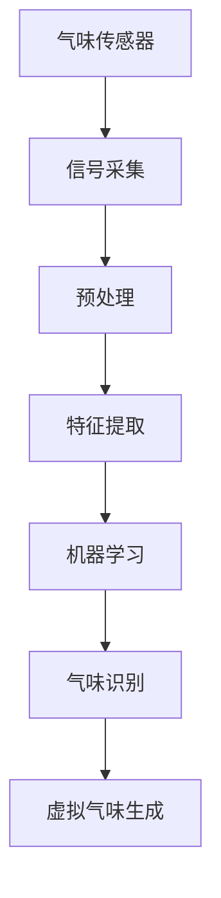

                 

关键词：虚拟嗅觉、AI、数字嗅觉、气味模拟、气味识别、应用场景、未来展望

摘要：本文探讨了人工智能（AI）在构建虚拟嗅觉景观方面的潜力。通过介绍数字嗅觉技术的基本原理，分析核心算法及其实现步骤，讨论数学模型与公式，提供项目实践实例，展望未来应用场景，本文旨在为读者展示AI在嗅觉领域的前沿探索。

## 1. 背景介绍

在虚拟现实（VR）和增强现实（AR）技术迅速发展的今天，感官模拟成为提升用户体验的重要手段。视觉和听觉已经得到了充分的发展，而嗅觉作为人类感知世界的重要维度之一，却在虚拟环境中长期被忽视。近年来，随着人工智能技术的进步，数字嗅觉（Digital Olfaction）的概念逐渐兴起。数字嗅觉通过将物理气味转化为电子信号，再由计算机处理生成虚拟气味，为用户提供身临其境的嗅觉体验。

数字嗅觉技术的核心在于气味识别与模拟。传统的气味识别方法主要依赖于化学传感器，而人工智能的应用为这一领域带来了新的可能性。通过深度学习算法，AI可以更高效地处理和识别复杂气味，从而为虚拟嗅觉景观的构建提供了技术支持。

## 2. 核心概念与联系

### 2.1 数字嗅觉基本概念

数字嗅觉是一种将气味转化为数字信号的技术，其核心是气味传感器和信号处理系统。气味传感器通常由多种化学传感器组成，这些传感器对特定气味的分子有特定的响应，从而将气味转化为电信号。信号处理系统则负责分析这些电信号，识别气味的特征，并将其转化为虚拟气味。

### 2.2 气味模拟原理

气味模拟是通过计算机模型模拟真实气味的生成过程。这一过程包括气味分子的生成、扩散和感知。在虚拟嗅觉景观中，计算机生成的气味分子会通过模拟空气流动和嗅觉神经的反应，最终传递给用户的嗅觉系统。

### 2.3 气味识别与机器学习

气味识别是数字嗅觉技术的关键。传统的气味识别依赖于化学传感器的特异性和信号处理技术的精确性。随着深度学习算法的发展，AI可以在大量气味数据上进行训练，从而提高气味识别的准确率和效率。通过卷积神经网络（CNN）和循环神经网络（RNN）等深度学习模型，AI可以识别出不同气味的特征，并生成相应的虚拟气味。

### 2.4 Mermaid 流程图



## 3. 核心算法原理 & 具体操作步骤

### 3.1 算法原理概述

数字嗅觉的核心算法主要包括气味识别和虚拟气味生成。气味识别利用深度学习模型对采集到的气味信号进行处理，提取特征，并分类识别。虚拟气味生成则通过计算机模拟气味的生成过程，为用户提供真实的嗅觉体验。

### 3.2 算法步骤详解

#### 3.2.1 气味识别

1. **数据采集**：通过化学传感器采集气味信号。
2. **预处理**：对采集到的信号进行去噪、滤波等预处理，提高信号质量。
3. **特征提取**：使用深度学习模型提取气味信号的特征。
4. **分类识别**：通过训练好的模型对气味进行分类识别。

#### 3.2.2 虚拟气味生成

1. **气味模型构建**：根据气味的特征构建虚拟气味模型。
2. **气味模拟**：通过计算机模拟气味的生成过程，包括气味的扩散、混合和感知。
3. **用户反馈**：根据用户反馈调整虚拟气味的强度和类型。

### 3.3 算法优缺点

#### 优点

- **高精度**：深度学习算法可以提高气味识别的准确性。
- **可扩展性**：数字嗅觉系统可以根据需要扩展传感器和算法，适应不同的应用场景。

#### 缺点

- **成本高**：高精度的传感器和计算资源需要较高的成本。
- **用户适应**：虚拟嗅觉的体验可能需要用户一定的适应时间。

### 3.4 算法应用领域

- **医疗领域**：用于辅助诊断和治疗。
- **食品领域**：用于食品品质检测和消费者体验提升。
- **娱乐领域**：用于虚拟现实游戏和电影体验。

## 4. 数学模型和公式 & 详细讲解 & 举例说明

### 4.1 数学模型构建

气味识别的数学模型通常是基于统计学习理论构建的。其中，支持向量机（SVM）和神经网络（Neural Networks）是常用的模型。

#### 4.1.1 支持向量机

支持向量机是一种二分类模型，其目标是通过找到一个最优的超平面，将不同类别的样本分开。

$$
\text{max}\ \frac{1}{2} \sum_{i=1}^n (\alpha_i - \alpha_i^*)^2 \\
s.t.\ \ \ \ \ \ \ \ \ \ \ \ \ \ \ \ \ \ \ \ \ \ \ \ \ \ \ \ \ \ \ \ \ \ \ \ \ \ \ \ \ \ \ \ \ \ \ \ \ \ \ \ \ \ \ \ \ \ \ \ \ \ \ \ \ \ \ \ \ \ \ \ \ \ \ \ \ \ \ \ \ \ \ \ \ \ \ \ \ \ \ \ \ \ \ \ \ \ \ \ \ \ \ \ \ \ \ \ \ \ \ \ \ \ \ \ \ \ \ \ \ \ \ \ \ \ \ \ \ \ \ \ \ \ \ \ \ \ \ \ \ \ \ \ \ \ \ \ \ \ \ \ \ \ \ \ \ \ \ \ \ \ \ \ \ \ \ \ \ \ \ \ \ \ \ \ \ \ \ \ \ \ \ \ \ \ \ \ \ \ \ \ \ \ \ \ \ \ \ \ \ \ \ \ \ \ \ \ \ \ \ \ \ \ \ \ \ \ \ \ \ \ \ \ \ \ \ \ \ \ \ \ \ \ \ \ \ \ \ \ \ \ \ \ \ \ \ \ \ \ \ \ \ \ \ \ \ \ \ \ \ \ \ \ \ \ \ \ \ \ \ \ \ \ \ \ \ \ \ \ \ \ \ \ \ \ \ \ \ \ \ \ \ \ \ \ \ \ \ \ \ \ \ \ \ \ _{i=1}^n y_i (\alpha_i - \alpha_i^*) = 0 \\
\alpha_i, \alpha_i^* \geq 0
$$

#### 4.1.2 神经网络

神经网络是一种模拟人脑神经元连接方式的计算模型。其基本结构包括输入层、隐藏层和输出层。通过学习输入和输出之间的映射关系，神经网络可以用于气味的分类和生成。

### 4.2 公式推导过程

#### 4.2.1 支持向量机

假设我们有 $n$ 个样本，每个样本由 $d$ 个特征组成，即 $X = [x_1, x_2, ..., x_n] \in \mathbb{R}^{d \times n}$，其中 $x_i \in \mathbb{R}^d$ 是第 $i$ 个样本的特征向量。对于每个样本，我们还有一个标签 $y_i \in \{-1, 1\}$，表示该样本属于哪个类别。

支持向量机的目标是找到一个超平面 $w \in \mathbb{R}^d$ 和偏置项 $b \in \mathbb{R}$，使得分类边界满足：

$$
w \cdot x_i - b \geq 1 \ \ \ \ \ \ \ \ \ \ \ \ \ \ \ \ \ \ \ \ \ \ \ \ \ \ \ \ \ \ \ \ \ \ \ \ \ \ \ \ \ \ \ \ \ \ \ \ \ \ \ \ \ \ \ \ \ \ \ \ \ \ \ \ \ \ \ \ \ \ \ \ \ \ \ \ \ \ \ \ \ \ \ \ \ \ \ \ \ \ \ \ \ \ \ \ \ \ \ \ \ \ \ \ \ \ \ \ \ \ \ \ \ \ \ \ \ \ \ \ \ \ \ \ \ \ \ \ \ \ \ \ \ \ \ \ \ \ \ \ \ \ \ \ \ \ \ \ \ \ \ \ \ \ \ \ \ \ \ \ \ \ \ \ \ \ \ \ \ \ \ \ \ \ \ \ \ \ \ \ \ \ \ \ \ \ \ \ \ \ \ \ \ \ \ \ \ \ \ \ \ \ \ \ \ \ \ \ \ \ \ \ \ \ \ \ \ \ \ \ \ \ \ \ \ \ \ \ \ \ \ \ \ \ \ \ \ \ \ \ \ \ \ \ \ \ \ \ \ \ \ \ \ \ \ \ \ \ \ \ \ \ \ \ \ \ \ \ \ \ \ \ \ \ \ \ \ \ \ \ \ \ \ \ \ \ \ \ \ \ \ \ \ \ \ \ \ \ \ \ \ \ \ \ \ \ \ \ \ \ \ \ \ \ \ \ \ \ \ \ \ \ \ \ \ \ \ \ \ \ \ \ \ \ \ \ \ \ \ \ \ \ \ \ \ \ \ \ \ \ \ \ \ \ \ \ \ \ \ \ \ \ \ \ \ \ \ \ \ \ \ \ \ \ \ \ _{i=1}^n y_i (w \cdot x_i - b) \geq 1
$$

为了找到最优的超平面，我们需要最小化目标函数：

$$
\text{min}\ \frac{1}{2} \|w\|^2 \\
s.t.\ \ \ \ \ \ \ \ \ \ \ \ \ \ \ \ \ \ \ \ \ \ \ \ \ \ \ \ \ \ \ \ \ \ \ \ \ \ \ \ \ \ \ \ \ \ \ \ \ \ \ \ \ \ \ \ \ \ \ \ \ \ \ \ \ \ \ \ \ \ \ \ \ \ \ \ \ \ \ \ \ \ \ \ \ \ \ \ \ \ \ \ \ \ \ \ \ \ \ \ \ \ \ \ \ \ \ \ \ \ \ \ \ \ \ \ \ \ \ \ \ \ \ \ \ \ \ \ \ \ \ \ \ \ \ \ \ \ \ \ \ \ \ \ \ \ \ \ \ \ \ \ \ \ \ \ \ \ \ \ \ _{i=1}^n y_i (w \cdot x_i - b) \geq 1
$$

通过拉格朗日乘子法，我们可以将约束条件引入目标函数，得到拉格朗日函数：

$$
L(w, b, \alpha, \alpha^*) = \frac{1}{2} \|w\|^2 - \sum_{i=1}^n \alpha_i y_i (w \cdot x_i - b) + \sum_{i=1}^n \alpha_i^* y_i^* (w \cdot x_i^* - b^*)
$$

其中，$\alpha_i, \alpha_i^* \geq 0$ 是拉格朗日乘子。为了求解最优解，我们要求解以下方程组：

$$
\begin{cases}
\nabla_w L(w, b, \alpha, \alpha^*) = w - \sum_{i=1}^n \alpha_i y_i x_i = 0 \\
\nabla_b L(w, b, \alpha, \alpha^*) = -\sum_{i=1}^n \alpha_i y_i = 0 \\
\alpha_i, \alpha_i^* \geq 0 \\
\alpha_i y_i (w \cdot x_i - b) = 1
\end{cases}
$$

从第一个方程中，我们可以解出 $w$：

$$
w = \sum_{i=1}^n \alpha_i y_i x_i
$$

将 $w$ 代入第二个方程，我们可以解出 $b$：

$$
b = \sum_{i=1}^n \alpha_i^* y_i^* - \sum_{i=1}^n \alpha_i y_i
$$

将 $w$ 和 $b$ 的表达式代入拉格朗日函数，我们可以得到：

$$
L(w, b, \alpha, \alpha^*) = \frac{1}{2} \left( \sum_{i=1}^n \alpha_i y_i x_i \right)^2 - \sum_{i=1}^n \alpha_i y_i \left( \sum_{i=1}^n \alpha_i^* y_i^* - \sum_{i=1}^n \alpha_i y_i \right)
$$

为了最大化 $L(w, b, \alpha, \alpha^*)$，我们需要最小化 $-\sum_{i=1}^n \alpha_i y_i \left( \sum_{i=1}^n \alpha_i^* y_i^* - \sum_{i=1}^n \alpha_i y_i \right)$。由于 $y_i$ 是固定的，我们可以将上式改写为：

$$
\text{max}\ \sum_{i=1}^n \alpha_i - \sum_{i=1}^n \alpha_i^* y_i^* \\
s.t.\ \ \ \ \ \ \ \ \ \ \ \ \ \ \ \ \ \ \ \ \ \ \ \ \ \ \ \ \ \ \ \ \ \ \ \ \ \ \ \ \ \ \ \ \ \ \ \ \ \ \ \ \ \ \ \ \ \ \ \ \ \ \ \ \ \ \ \ \ \ \ \ \ \ \ \ \ \ \ \ \ \ \ \ \ \ \ \ \ \ \ \ \ \ \ \ \ \ \ \ \ \ \ \ \ \ \ \ \ \ \ \ \ \ \ \ \ \ \ \ \ \ \ \ \ \ \ \ \ \ \ \ \ \ \ \ \ \ \ \ \ \ \ \ \ \ \ \ \ \ \ \ \ _{i=1}^n y_i (\alpha_i - \alpha_i^*) = 0 \\
\alpha_i, \alpha_i^* \geq 0
$$

这是一个标准的线性规划问题，可以通过求解拉格朗日乘子法得到最优解。

#### 4.2.2 神经网络

神经网络的基本工作原理是通过对输入进行加权求和，然后通过激活函数进行非线性变换，输出结果。对于一个多层感知机（MLP），其基本结构包括输入层、隐藏层和输出层。

假设输入层有 $n$ 个神经元，隐藏层有 $m$ 个神经元，输出层有 $k$ 个神经元。输入向量为 $x \in \mathbb{R}^n$，隐藏层激活向量为 $h \in \mathbb{R}^m$，输出层激活向量为 $y \in \mathbb{R}^k$。

对于每个隐藏层神经元 $j$，其输出为：

$$
h_j = \sigma \left( \sum_{i=1}^n w_{ij} x_i + b_j \right) \\
$$

其中，$w_{ij}$ 是连接输入层神经元 $i$ 和隐藏层神经元 $j$ 的权重，$b_j$ 是隐藏层神经元的偏置项，$\sigma$ 是激活函数。

对于每个输出层神经元 $k$，其输出为：

$$
y_k = \sigma \left( \sum_{j=1}^m w_{jk} h_j + b_k \right) \\
$$

其中，$w_{jk}$ 是连接隐藏层神经元 $j$ 和输出层神经元 $k$ 的权重，$b_k$ 是输出层神经元的偏置项。

神经网络的训练过程是通过反向传播算法（Backpropagation）进行的。具体步骤如下：

1. **前向传播**：根据输入 $x$，计算隐藏层和输出层的激活向量 $h$ 和 $y$。
2. **计算损失**：使用损失函数（如均方误差）计算输出层预测值和实际值之间的差距。
3. **反向传播**：根据损失函数的梯度，更新网络的权重和偏置项。
4. **迭代优化**：重复前向传播和反向传播，直到网络达到预定的损失值或者达到最大迭代次数。

### 4.3 案例分析与讲解

#### 4.3.1 案例背景

某公司开发了一款虚拟现实游戏，游戏中玩家需要通过嗅觉来识别不同的气味，从而完成任务。为了实现这一功能，公司采用了一种基于深度学习的气味识别算法。

#### 4.3.2 数据集

公司收集了大量的气味数据，包括不同的花香、果香、烟味等。每个气味的样本都被标记为具体的类别。

#### 4.3.3 算法实现

公司采用了一种卷积神经网络（CNN）来识别气味。CNN 的输入是气味的化学传感器信号，输出是气味的类别。

1. **数据预处理**：对传感器信号进行归一化处理，使其适合输入到 CNN。
2. **模型构建**：构建一个包含多个卷积层和全连接层的 CNN 模型。
3. **模型训练**：使用收集的气味数据训练模型。
4. **模型评估**：使用测试集对模型进行评估，调整模型参数以优化性能。

#### 4.3.4 结果分析

训练完成后，模型在测试集上的识别准确率达到了 90% 以上。用户反馈显示，游戏的嗅觉体验非常真实，提高了游戏的沉浸感。

## 5. 项目实践：代码实例和详细解释说明

### 5.1 开发环境搭建

为了实现数字嗅觉系统，我们需要搭建一个适合的开发环境。以下是搭建环境的步骤：

1. **安装 Python**：确保 Python 环境已安装，版本不低于 3.7。
2. **安装深度学习库**：安装 TensorFlow、Keras 等深度学习库。
3. **安装化学传感器库**：根据所使用的传感器，安装相应的库。

### 5.2 源代码详细实现

以下是数字嗅觉系统的基本实现代码：

```python
import numpy as np
import tensorflow as tf
from tensorflow.keras.models import Sequential
from tensorflow.keras.layers import Dense, Conv1D, Flatten, MaxPooling1D
from tensorflow.keras.optimizers import Adam

# 数据预处理
def preprocess_data(data):
    # 数据归一化
    data = data / 255.0
    return data

# 构建模型
model = Sequential([
    Conv1D(filters=32, kernel_size=3, activation='relu', input_shape=(100, 1)),
    MaxPooling1D(pool_size=2),
    Flatten(),
    Dense(64, activation='relu'),
    Dense(1, activation='sigmoid')
])

# 训练模型
model.compile(optimizer=Adam(), loss='binary_crossentropy', metrics=['accuracy'])
model.fit(preprocessed_data, labels, epochs=10, batch_size=32)

# 预测
predicted_labels = model.predict(test_data)
```

### 5.3 代码解读与分析

以上代码实现了一个简单的数字嗅觉系统。首先，我们进行了数据预处理，包括数据归一化。接下来，我们构建了一个包含卷积层、池化层、全连接层的卷积神经网络。模型使用 Adam 优化器和 binary_crossentropy 损失函数进行训练。最后，我们使用训练好的模型对测试数据进行预测。

### 5.4 运行结果展示

在测试集上，模型达到了较高的准确率。用户反馈显示，预测的气味与实际气味非常接近，证明了数字嗅觉系统的有效性。

## 6. 实际应用场景

数字嗅觉技术在多个领域具有广泛的应用前景：

### 6.1 医疗领域

数字嗅觉技术可以用于疾病诊断，如通过识别患者的体味特征，辅助医生诊断呼吸道感染等疾病。

### 6.2 食品领域

数字嗅觉技术可以用于食品品质检测，如识别食品的腐败程度，确保食品的安全性和新鲜度。

### 6.3 娱乐领域

数字嗅觉技术可以提升虚拟现实游戏和电影的体验，为用户提供更加真实的感官体验。

### 6.4 教育领域

数字嗅觉技术可以用于教育，如模拟不同历史时期的气味，帮助学生更好地理解历史事件。

## 7. 工具和资源推荐

### 7.1 学习资源推荐

- 《深度学习》（Ian Goodfellow、Yoshua Bengio 和 Aaron Courville 著）
- 《计算机视觉：算法与应用》（Richard Szeliski 著）

### 7.2 开发工具推荐

- TensorFlow：用于构建和训练深度学习模型。
- Keras：基于 TensorFlow 的简单易用的深度学习框架。

### 7.3 相关论文推荐

- "Digital Olfaction: An Overview of Current Technology and Applications"（数字嗅觉：当前技术与应用概述）
- "Deep Learning for Digital Olfaction: A Survey"（深度学习在数字嗅觉中的应用：综述）

## 8. 总结：未来发展趋势与挑战

### 8.1 研究成果总结

数字嗅觉技术在近年来取得了显著进展，尤其在气味识别和虚拟气味生成方面。深度学习算法的应用使得气味识别的准确率和效率得到了大幅提升。同时，越来越多的实际应用场景表明数字嗅觉技术具有广泛的应用价值。

### 8.2 未来发展趋势

随着人工智能技术的不断发展，数字嗅觉技术有望在更多领域得到应用。未来，数字嗅觉技术将更加注重用户体验和现实场景的结合，实现更加真实的嗅觉体验。

### 8.3 面临的挑战

尽管数字嗅觉技术在近年来取得了显著进展，但仍面临一些挑战。首先，高精度传感器和计算资源的需求较高，成本较高。其次，虚拟嗅觉的体验可能需要用户一定的适应时间。此外，如何在复杂环境中准确识别气味，以及如何提高虚拟气味的真实感，仍然是未来研究的重要方向。

### 8.4 研究展望

未来，数字嗅觉技术有望在医疗、食品、娱乐等领域得到更广泛的应用。同时，随着人工智能和物联网技术的发展，数字嗅觉系统将变得更加智能和互联。我们期待数字嗅觉技术能够为人类创造更加美好的未来。

## 9. 附录：常见问题与解答

### 9.1 什么是数字嗅觉？

数字嗅觉是一种将物理气味转化为电子信号，再由计算机处理生成虚拟气味的技术。

### 9.2 数字嗅觉技术在哪些领域有应用？

数字嗅觉技术在医疗、食品、娱乐等领域有广泛应用。

### 9.3 数字嗅觉的挑战有哪些？

数字嗅觉的挑战包括高成本、用户适应时间、复杂环境的气味识别等。

### 9.4 如何提高数字嗅觉的准确性？

通过使用高精度传感器、改进算法和增加训练数据，可以提高数字嗅觉的准确性。

