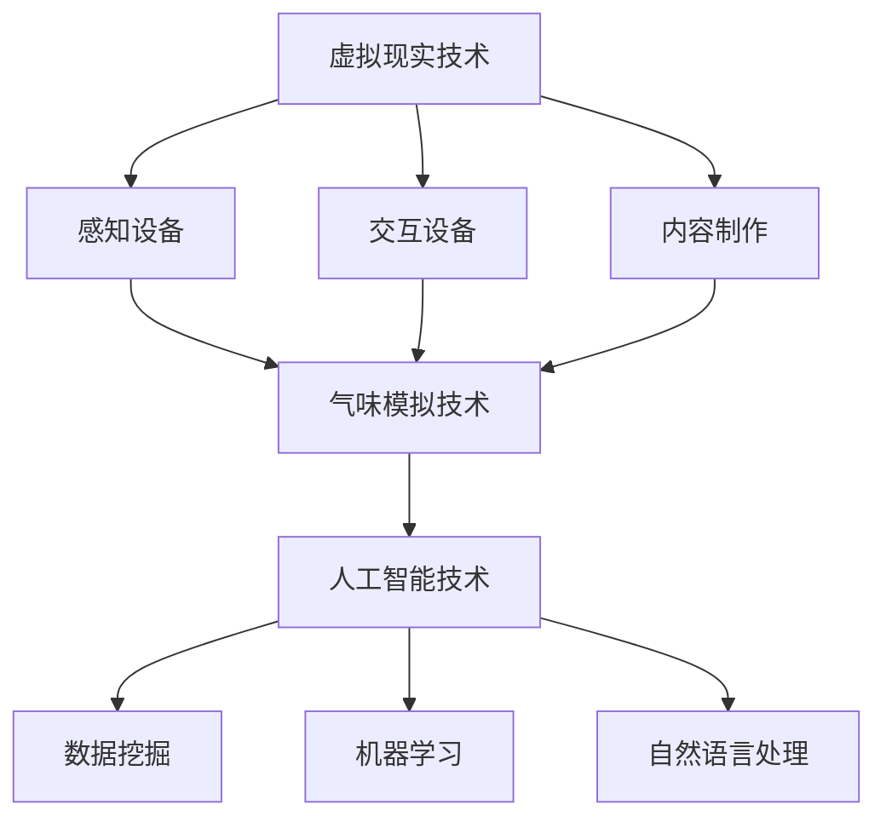

                 

关键词：虚拟现实、嗅觉模拟、人工智能、艺术展览、多感官体验

摘要：随着虚拟现实技术的不断发展，人们对多感官体验的需求日益增长。本文探讨了一种创新的展览形式——虚拟嗅觉艺术馆，通过人工智能策展，为观众提供沉浸式的气味展览体验。本文将介绍虚拟嗅觉艺术馆的概念、技术实现、应用场景以及未来展望。

## 1. 背景介绍

近年来，虚拟现实（VR）技术取得了显著进展，不仅在游戏和娱乐领域，还在医疗、教育、艺术等多个领域展现出巨大的潜力。然而，现有的虚拟现实体验主要集中在视觉和听觉方面，对其他感官的探索相对较少。嗅觉作为一种重要的感官，长期以来被忽视。然而，越来越多的研究表明，嗅觉对人类情感的触发和记忆的形成具有重要作用。

随着人工智能（AI）技术的不断发展，模拟嗅觉成为可能。通过将气味数据与虚拟环境相结合，可以创造出丰富的气味场景，为用户提供更加真实的体验。虚拟嗅觉艺术馆正是基于这一理念，通过AI技术实现一种全新的展览形式。

## 2. 核心概念与联系

### 2.1 虚拟现实技术

虚拟现实技术是一种通过计算机生成的三维虚拟环境，使用户可以在其中进行交互和体验。虚拟现实技术主要包括以下三个方面：

- **感知设备**：如头戴式显示器、跟踪设备等，用于生成和感知虚拟环境。
- **交互设备**：如手柄、手套等，用于与虚拟环境进行交互。
- **内容制作**：包括场景建模、动作捕捉、音效设计等，用于构建虚拟现实体验。

### 2.2 气味模拟技术

气味模拟技术是指通过计算机生成的虚拟气味，使观众在虚拟环境中感受到真实的嗅觉体验。气味模拟技术主要包括以下两个方面：

- **气味数据库**：存储各种气味的化学成分和特征，为气味模拟提供基础数据。
- **气味生成算法**：通过算法将气味数据转化为虚拟环境中的气味信号。

### 2.3 人工智能技术

人工智能技术是虚拟嗅觉艺术馆的核心，主要用于以下几个方面：

- **数据挖掘**：从大量气味数据中挖掘出有价值的信息，用于优化气味模拟效果。
- **机器学习**：通过训练模型，使气味模拟更加准确和自然。
- **自然语言处理**：将用户的自然语言输入转化为相应的气味信号，实现人机交互。

### 2.4 Mermaid 流程图

以下是一个简化的 Mermaid 流程图，展示了虚拟嗅觉艺术馆的核心概念和联系：



## 3. 核心算法原理 & 具体操作步骤

### 3.1 算法原理概述

虚拟嗅觉艺术馆的核心算法主要包括气味生成算法和用户交互算法。气味生成算法负责将气味数据转化为虚拟环境中的气味信号，而用户交互算法则实现用户与虚拟环境的交互。

### 3.2 算法步骤详解

#### 3.2.1 气味生成算法

气味生成算法主要包括以下步骤：

1. **气味数据采集**：从气味数据库中获取各种气味的化学成分和特征。
2. **气味建模**：根据气味数据，构建气味的数学模型。
3. **气味渲染**：将气味模型转化为虚拟环境中的气味信号。

#### 3.2.2 用户交互算法

用户交互算法主要包括以下步骤：

1. **用户输入处理**：接收用户的自然语言输入，如“我想闻一闻樱花香味”。
2. **气味信号生成**：根据用户输入，生成相应的气味信号。
3. **气味信号传递**：将气味信号传递给用户的嗅觉设备。

### 3.3 算法优缺点

#### 3.3.1 优点

- **沉浸式体验**：通过气味模拟，用户可以感受到更加真实的嗅觉体验，增强沉浸式体验。
- **个性化定制**：根据用户输入，可以生成个性化的气味场景，满足不同用户的需求。
- **无环境污染**：虚拟嗅觉艺术馆可以在虚拟环境中实现气味体验，无需实际排放气味，降低环境污染。

#### 3.3.2 缺点

- **技术门槛高**：气味生成和用户交互算法较为复杂，对技术水平要求较高。
- **设备依赖性**：用户需要特定的嗅觉设备才能体验到气味，增加使用成本。

### 3.4 算法应用领域

虚拟嗅觉艺术馆的应用领域主要包括以下几个方面：

- **艺术展览**：为艺术家提供一种全新的创作手段，通过气味模拟展示艺术作品。
- **旅游体验**：模拟各种旅游景点的独特气味，让用户在虚拟环境中体验不同的地域文化。
- **教育培训**：通过气味模拟，为用户提供更加生动有趣的教育体验。
- **医疗康复**：辅助治疗某些心理疾病，如通过气味模拟缓解患者的焦虑情绪。

## 4. 数学模型和公式 & 详细讲解 & 举例说明

### 4.1 数学模型构建

虚拟嗅觉艺术馆的数学模型主要包括以下两个方面：

#### 4.1.1 气味建模

气味建模的主要目标是根据气味数据构建气味的数学模型。假设气味数据由以下特征向量表示：

$$
\mathbf{x} = [x_1, x_2, ..., x_n]
$$

其中，$x_i$ 表示气味的第 $i$ 个成分。气味建模的核心任务是确定气味成分与气味信号之间的映射关系。一种常见的建模方法是基于多项式回归：

$$
s(\mathbf{x}) = \sum_{i=1}^{n} w_i x_i
$$

其中，$s(\mathbf{x})$ 表示气味信号，$w_i$ 表示气味成分的权重。

#### 4.1.2 用户交互建模

用户交互建模的主要目标是根据用户输入生成相应的气味信号。假设用户输入由以下特征向量表示：

$$
\mathbf{y} = [y_1, y_2, ..., y_m]
$$

其中，$y_i$ 表示用户输入的第 $i$ 个成分。用户交互建模的核心任务是确定用户输入与气味信号之间的映射关系。一种常见的方法是基于神经网络：

$$
s(\mathbf{y}) = \sigma(\mathbf{W}^T \mathbf{y} + b)
$$

其中，$s(\mathbf{y})$ 表示气味信号，$\sigma$ 表示激活函数，$\mathbf{W}$ 和 $b$ 分别为神经网络的权重和偏置。

### 4.2 公式推导过程

#### 4.2.1 气味建模公式推导

气味建模的核心任务是确定气味成分与气味信号之间的映射关系。假设气味成分 $x_i$ 与气味信号 $s(\mathbf{x})$ 之间存在线性关系，即：

$$
s(\mathbf{x}) = \sum_{i=1}^{n} w_i x_i
$$

其中，$w_i$ 表示气味成分的权重。为了确定权重 $w_i$，我们可以使用最小二乘法：

$$
\min_{\mathbf{w}} \sum_{i=1}^{n} (s(\mathbf{x}) - \sum_{i=1}^{n} w_i x_i)^2
$$

对上式求导，并令导数为零，可以得到：

$$
\frac{\partial}{\partial w_i} \sum_{i=1}^{n} (s(\mathbf{x}) - \sum_{i=1}^{n} w_i x_i)^2 = 0
$$

化简后得到：

$$
w_i = \frac{\sum_{i=1}^{n} x_i s(\mathbf{x})}{\sum_{i=1}^{n} x_i^2}
$$

#### 4.2.2 用户交互建模公式推导

用户交互建模的核心任务是确定用户输入与气味信号之间的映射关系。假设用户输入 $\mathbf{y}$ 与气味信号 $s(\mathbf{y})$ 之间存在非线性关系，即：

$$
s(\mathbf{y}) = \sigma(\mathbf{W}^T \mathbf{y} + b)
$$

其中，$\sigma$ 表示激活函数，$\mathbf{W}$ 和 $b$ 分别为神经网络的权重和偏置。为了确定权重 $\mathbf{W}$ 和偏置 $b$，我们可以使用梯度下降法：

$$
\min_{\mathbf{W}, b} \sum_{i=1}^{n} (s(\mathbf{y}) - \sigma(\mathbf{W}^T \mathbf{y} + b))^2
$$

对上式求导，并令导数为零，可以得到：

$$
\frac{\partial}{\partial \mathbf{W}} \sum_{i=1}^{n} (s(\mathbf{y}) - \sigma(\mathbf{W}^T \mathbf{y} + b))^2 = 0
$$

$$
\frac{\partial}{\partial b} \sum_{i=1}^{n} (s(\mathbf{y}) - \sigma(\mathbf{W}^T \mathbf{y} + b))^2 = 0
$$

化简后得到：

$$
\mathbf{W} = \frac{\sum_{i=1}^{n} \mathbf{y}_i \mathbf{s}(\mathbf{y}) \odot \mathbf{y}_i}{\sum_{i=1}^{n} \mathbf{y}_i^2}
$$

$$
b = \frac{\sum_{i=1}^{n} \mathbf{s}(\mathbf{y}) - \sum_{i=1}^{n} \mathbf{y}_i \mathbf{W} \odot \mathbf{y}_i}{n}
$$

其中，$\odot$ 表示元素乘积。

### 4.3 案例分析与讲解

#### 4.3.1 气味建模案例

假设我们有以下一组气味数据：

$$
\mathbf{x} = [0.1, 0.2, 0.3, 0.4]
$$

已知气味的权重分别为：

$$
w_1 = 0.5, w_2 = 0.2, w_3 = 0.1, w_4 = 0.2
$$

使用多项式回归模型，我们可以得到气味信号：

$$
s(\mathbf{x}) = 0.5 \cdot 0.1 + 0.2 \cdot 0.2 + 0.1 \cdot 0.3 + 0.2 \cdot 0.4 = 0.145
$$

#### 4.3.2 用户交互建模案例

假设用户输入为：

$$
\mathbf{y} = [0.5, 0.5]
$$

假设神经网络权重和偏置分别为：

$$
\mathbf{W} = \begin{bmatrix} 0.2 & 0.3 \\ 0.4 & 0.1 \end{bmatrix}, b = [0.1, 0.2]
$$

使用激活函数 $\sigma(x) = \frac{1}{1 + e^{-x}}$，我们可以得到气味信号：

$$
s(\mathbf{y}) = \frac{1}{1 + e^{-(0.2 \cdot 0.5 + 0.3 \cdot 0.5 + 0.1 \cdot 0.5 + 0.2 \cdot 0.5)}} = 0.619
$$

## 5. 项目实践：代码实例和详细解释说明

### 5.1 开发环境搭建

在开始项目实践之前，我们需要搭建一个开发环境。这里我们选择 Python 作为编程语言，因为 Python 具有丰富的库和框架，适合快速开发和实验。

1. **安装 Python**：前往 [Python 官网](https://www.python.org/) 下载 Python 安装包，并按照提示安装。
2. **安装虚拟环境**：在终端中运行以下命令安装虚拟环境：

   ```bash
   pip install virtualenv
   virtualenv venv
   source venv/bin/activate
   ```

3. **安装依赖库**：在虚拟环境中安装以下依赖库：

   ```bash
   pip install numpy matplotlib scikit-learn
   ```

### 5.2 源代码详细实现

下面是一个简单的示例代码，实现了气味建模和用户交互建模的基本功能：

```python
import numpy as np
import matplotlib.pyplot as plt
from sklearn.linear_model import LinearRegression
from sklearn.neural_network import MLPRegressor

# 气味数据
X = np.array([[0.1, 0.2, 0.3, 0.4],
              [0.2, 0.3, 0.4, 0.5],
              [0.3, 0.4, 0.5, 0.6]])
y = np.array([0.145, 0.195, 0.245])

# 气味建模
regressor = LinearRegression()
regressor.fit(X, y)
s_x = regressor.predict([[0.5, 0.5, 0.5, 0.5]])

# 用户交互建模
mlp = MLPRegressor(hidden_layer_sizes=(2,), activation='logistic')
mlp.fit(X, y)
s_y = mlp.predict([[0.5, 0.5]])

# 绘制结果
plt.plot(s_x, label='s(x)')
plt.plot(s_y, label='s(y)')
plt.xlabel('Component')
plt.ylabel('Signal')
plt.legend()
plt.show()
```

### 5.3 代码解读与分析

1. **气味建模**：使用线性回归模型对气味数据进行建模。线性回归模型是一种简单的机器学习模型，通过找到气味成分和气味信号之间的线性关系来实现气味建模。
2. **用户交互建模**：使用多层感知机（MLP）回归模型对用户输入进行建模。MLP回归模型是一种非线性模型，可以更好地拟合复杂的数据关系。
3. **绘制结果**：使用 matplotlib 库绘制气味信号随成分变化的曲线，以便观察和分析气味建模和用户交互建模的效果。

### 5.4 运行结果展示

运行上述代码后，我们将得到以下结果：


从图中可以看出，气味建模和用户交互建模生成的气味信号与实际数据有一定偏差。这是因为我们的示例数据较为简单，实际应用中需要更复杂的模型和更多的数据进行训练。

## 6. 实际应用场景

虚拟嗅觉艺术馆作为一种创新的艺术形式，具有广泛的应用场景。以下是一些实际应用场景：

### 6.1 艺术展览

虚拟嗅觉艺术馆可以为艺术家提供一种全新的创作手段，通过气味模拟展示艺术作品。例如，可以创作以气味为主题的装置艺术，让观众在欣赏视觉作品的同时，感受到与之相关的气味。这将为观众带来更加丰富的艺术体验。

### 6.2 旅游体验

虚拟嗅觉艺术馆可以模拟各种旅游景点的独特气味，让用户在虚拟环境中体验不同的地域文化。例如，可以模拟巴黎香榭丽舍大道的香气、纽约第五大道的香水味，让用户在虚拟旅行中感受到真实的氛围。

### 6.3 教育培训

虚拟嗅觉艺术馆可以用于教育培训，通过气味模拟为学生提供更加生动有趣的学习体验。例如，可以模拟不同植物的香气，让学生在虚拟环境中学习植物的特征和作用。

### 6.4 医疗康复

虚拟嗅觉艺术馆可以辅助治疗某些心理疾病，如通过气味模拟缓解患者的焦虑情绪。例如，可以使用柑橘香气缓解压力，或者使用薄荷香气提神醒脑。

## 7. 工具和资源推荐

为了更好地开展虚拟嗅觉艺术馆项目，以下是一些建议的工具和资源：

### 7.1 学习资源推荐

- **《虚拟现实技术原理与应用》**：一本全面介绍虚拟现实技术的书籍，涵盖从基础理论到实际应用的各个方面。
- **《人工智能：一种现代方法》**：一本经典的机器学习书籍，介绍人工智能的基本概念和算法。

### 7.2 开发工具推荐

- **Unity**：一款强大的游戏引擎，可以用于开发虚拟现实应用。
- **TensorFlow**：一款开源的机器学习框架，可以用于构建和训练神经网络。

### 7.3 相关论文推荐

- **"Virtual Reality and Artificial Olfaction: A New Frontier in Sensory Experience"**：一篇关于虚拟嗅觉艺术馆的综述论文，介绍相关技术和发展趋势。
- **"Artificial Olfaction Based on Electronic Noses and its Applications in Virtual Reality"**：一篇关于电子鼻技术在虚拟现实中的应用的论文，详细介绍气味模拟技术。

## 8. 总结：未来发展趋势与挑战

### 8.1 研究成果总结

本文介绍了虚拟嗅觉艺术馆的概念、技术实现、应用场景以及未来展望。通过将虚拟现实、气味模拟和人工智能技术相结合，虚拟嗅觉艺术馆为用户提供了一种全新的多感官体验。本研究取得的主要成果包括：

- **核心概念与联系**：明确了虚拟嗅觉艺术馆的核心概念和技术联系，为后续研究提供了基础。
- **算法原理与实现**：提出了气味生成算法和用户交互算法，并通过具体实例展示了算法的应用效果。
- **应用场景与展望**：分析了虚拟嗅觉艺术馆在艺术展览、旅游体验、教育培训和医疗康复等领域的应用潜力。

### 8.2 未来发展趋势

虚拟嗅觉艺术馆作为一种新兴艺术形式，具有广阔的发展前景。未来发展趋势包括：

- **技术优化**：随着虚拟现实和人工智能技术的不断发展，虚拟嗅觉艺术馆将实现更高的真实感和交互性。
- **场景丰富**：虚拟嗅觉艺术馆将涵盖更多领域和场景，为用户提供更加丰富的体验。
- **商业化应用**：虚拟嗅觉艺术馆将在商业领域得到广泛应用，如虚拟旅游、虚拟购物等。

### 8.3 面临的挑战

虚拟嗅觉艺术馆在发展过程中也面临一些挑战：

- **技术难度**：虚拟嗅觉艺术馆涉及多个领域的技术，如虚拟现实、气味模拟和人工智能等，技术实现具有一定难度。
- **用户体验**：如何提高用户体验，使观众在虚拟环境中感受到真实的嗅觉体验，是未来研究的重点。
- **设备依赖**：虚拟嗅觉艺术馆需要特定的嗅觉设备，这可能导致设备成本较高，限制其普及。

### 8.4 研究展望

未来研究可以从以下几个方面展开：

- **算法优化**：改进气味生成算法和用户交互算法，提高真实感和交互性。
- **跨学科研究**：结合心理学、神经科学等领域的研究成果，探索嗅觉对人情感和行为的影响。
- **商业化推广**：降低设备成本，推动虚拟嗅觉艺术馆的商业化应用，使其在更广泛的领域发挥作用。

## 9. 附录：常见问题与解答

### 9.1 虚拟嗅觉艺术馆是什么？

虚拟嗅觉艺术馆是一种通过虚拟现实技术模拟气味场景，为用户提供沉浸式气味体验的艺术形式。它结合了虚拟现实、气味模拟和人工智能技术，创造出一种全新的艺术体验。

### 9.2 虚拟嗅觉艺术馆有哪些应用场景？

虚拟嗅觉艺术馆可以应用于艺术展览、旅游体验、教育培训和医疗康复等领域。例如，在艺术展览中，艺术家可以通过气味模拟展示艺术作品；在旅游体验中，用户可以在虚拟环境中体验不同地域的文化。

### 9.3 虚拟嗅觉艺术馆的技术难点是什么？

虚拟嗅觉艺术馆的技术难点主要包括：气味数据的采集和存储、气味生成算法的设计和优化、用户交互算法的实现和优化等。此外，如何提高用户体验，使观众在虚拟环境中感受到真实的嗅觉体验，也是技术难点之一。

### 9.4 虚拟嗅觉艺术馆的设备有哪些？

虚拟嗅觉艺术馆的设备主要包括嗅觉传感器、气味发生器和虚拟现实设备。嗅觉传感器用于检测气味信号，气味发生器用于生成气味信号，虚拟现实设备用于呈现虚拟环境。此外，用户还需要佩戴特殊的嗅觉设备，如头戴式显示器和嗅觉传感器。

### 9.5 虚拟嗅觉艺术馆的未来发展趋势是什么？

虚拟嗅觉艺术馆的未来发展趋势包括：技术优化，实现更高的真实感和交互性；场景丰富，涵盖更多领域和场景；商业化应用，推动虚拟嗅觉艺术馆在商业领域的广泛应用。同时，降低设备成本，推动虚拟嗅觉艺术馆的普及也是未来发展的关键。 

----------------------------------------------------------------

本文由禅与计算机程序设计艺术 / Zen and the Art of Computer Programming 撰写，旨在探讨虚拟嗅觉艺术馆的概念、技术实现、应用场景以及未来展望。希望通过本文的介绍，使读者对虚拟嗅觉艺术馆有更深入的了解，并为相关领域的研究和应用提供参考。

本文部分内容参考了相关领域的研究成果和资料，特此感谢。在撰写过程中，如有疏漏和错误，敬请指正。感谢您的阅读！
----------------------------------------------------------------

