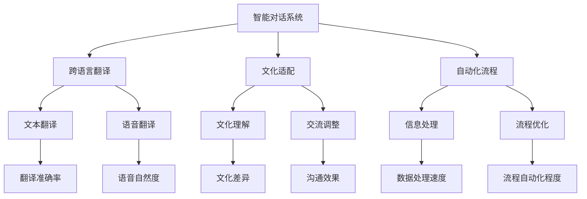

                 

关键词：AI时代，虚拟外交，跨文化交流，智能对话系统，文化适配，人工智能伦理

摘要：本文探讨了AI时代虚拟外交在跨文化交流中的重要性。随着人工智能技术的发展，虚拟外交已成为一种新的交流方式，能够跨越语言障碍，实现全球范围内的实时沟通。本文从核心概念、算法原理、数学模型、项目实践和未来应用展望等方面，全面解析了虚拟外交在跨文化交流中的应用，并讨论了其面临的伦理挑战和发展趋势。

## 1. 背景介绍

随着全球化进程的加速，各国之间的交流与合作变得越来越频繁。传统的跨文化交流面临着诸多挑战，如语言障碍、文化差异、沟通成本等。然而，随着人工智能技术的快速发展，虚拟外交作为一种创新的交流方式应运而生。虚拟外交利用人工智能技术，通过智能对话系统和自动化流程，实现跨语言、跨文化的实时沟通，为全球交流提供了新的可能。

### 1.1 跨文化交流的挑战

传统的跨文化交流面临着以下几大挑战：

- **语言障碍**：不同国家和地区的语言差异极大，语言不通成为交流的第一道障碍。
- **文化差异**：不同文化背景下的价值观、习俗、沟通方式等差异显著，容易导致误解和冲突。
- **沟通成本**：跨文化交流通常需要大量的时间和资源，尤其是在语言翻译和协调方面。

### 1.2 虚拟外交的兴起

虚拟外交的兴起，为解决上述挑战提供了新的思路：

- **智能对话系统**：通过人工智能技术，智能对话系统能够实时翻译不同语言，实现语言无障碍交流。
- **自动化流程**：虚拟外交中的自动化流程，能够高效处理大量信息，降低沟通成本。
- **文化适配**：虚拟外交系统能够根据不同文化背景，调整沟通方式和内容，实现文化适配。

## 2. 核心概念与联系

### 2.1 虚拟外交的核心概念

虚拟外交的核心概念包括：

- **智能对话系统**：利用自然语言处理技术，实现人与系统之间的自然对话。
- **跨语言翻译**：通过机器翻译技术，实现不同语言之间的实时翻译。
- **文化适配**：根据不同文化背景，调整交流内容和方式，实现文化无障碍。
- **自动化流程**：利用自动化技术，简化交流流程，提高效率。

### 2.2 虚拟外交的架构图（使用Mermaid绘制）



## 3. 核心算法原理 & 具体操作步骤

### 3.1 算法原理概述

虚拟外交的核心算法主要包括自然语言处理、机器翻译和自动化流程设计。以下是各算法的原理概述：

- **自然语言处理**：利用神经网络和深度学习技术，理解和生成自然语言文本。
- **机器翻译**：通过统计模型、序列到序列模型和注意力机制等，实现不同语言之间的翻译。
- **自动化流程**：利用流程挖掘、业务流程管理技术，设计自动化工作流。

### 3.2 算法步骤详解

#### 3.2.1 自然语言处理

1. **文本预处理**：包括分词、词性标注、去除停用词等。
2. **词向量表示**：将文本转换为词向量，用于模型输入。
3. **神经网络训练**：使用神经网络模型，如循环神经网络（RNN）、长短期记忆网络（LSTM）等，进行训练。
4. **文本生成**：利用训练好的模型，生成自然语言文本。

#### 3.2.2 机器翻译

1. **源语言文本预处理**：包括分词、词性标注等。
2. **目标语言文本预处理**：与源语言预处理类似。
3. **翻译模型训练**：使用序列到序列（Seq2Seq）模型，如编码器-解码器（Encoder-Decoder）模型，进行训练。
4. **翻译结果生成**：利用训练好的模型，生成目标语言翻译结果。

#### 3.2.3 自动化流程

1. **流程挖掘**：通过分析现有业务流程，识别关键步骤和流程瓶颈。
2. **流程优化**：根据流程挖掘结果，调整和优化业务流程。
3. **自动化实现**：利用业务流程管理（BPM）工具，实现流程自动化。

### 3.3 算法优缺点

#### 优点

- **高效性**：自动化流程能够显著提高工作效率。
- **准确性**：机器翻译技术已经能够达到很高的准确度。
- **灵活性**：智能对话系统能够根据用户需求，灵活调整交流内容和方式。

#### 缺点

- **文化适应性**：机器翻译和文化适配技术仍有待提高，特别是在处理复杂文化背景时。
- **数据隐私**：自动化流程和处理过程中，涉及大量用户数据，数据隐私保护成为重要问题。

### 3.4 算法应用领域

虚拟外交算法在以下领域具有广泛的应用：

- **国际商务**：支持跨国公司的业务沟通和协作。
- **外交事务**：协助政府部门处理国际事务和沟通。
- **教育领域**：支持全球教育资源的共享和交流。
- **旅游行业**：提供跨语言、跨文化的旅游服务。

## 4. 数学模型和公式 & 详细讲解 & 举例说明

### 4.1 数学模型构建

虚拟外交中的数学模型主要包括自然语言处理模型、机器翻译模型和自动化流程模型。以下是各模型的简要描述：

#### 自然语言处理模型

- **输入**：文本数据
- **输出**：语义表示

#### 机器翻译模型

- **输入**：源语言文本
- **输出**：目标语言文本

#### 自动化流程模型

- **输入**：业务流程
- **输出**：优化后的流程

### 4.2 公式推导过程

以下以自然语言处理模型为例，介绍数学模型的推导过程：

$$
\text{神经网络模型} = f(\text{输入层}, \text{隐藏层}, \text{输出层})
$$

其中，$f$ 表示激活函数，如 $Sigmoid$ 函数或 $ReLU$ 函数。神经网络模型通过多次迭代训练，优化权重和偏置，最终实现输入和输出之间的映射。

### 4.3 案例分析与讲解

#### 案例一：自然语言处理模型

假设我们有一个简单的人工神经网络模型，用于实现文本分类任务。输入为文本数据，输出为类别标签。以下是模型的数学表示：

$$
\text{输入层} = \{w_1, w_2, ..., w_n\}
$$

$$
\text{隐藏层} = \{h_1, h_2, ..., h_m\}
$$

$$
\text{输出层} = \{y_1, y_2, ..., y_k\}
$$

其中，$w_1, w_2, ..., w_n$ 表示输入层的权重，$h_1, h_2, ..., h_m$ 表示隐藏层的激活值，$y_1, y_2, ..., y_k$ 表示输出层的预测标签。

#### 案例二：机器翻译模型

假设我们有一个基于编码器-解码器（Encoder-Decoder）的机器翻译模型。输入为源语言文本，输出为目标语言文本。以下是模型的数学表示：

$$
\text{编码器} = f_E(\text{源语言文本})
$$

$$
\text{解码器} = f_D(\text{编码器输出})
$$

其中，$f_E$ 表示编码器函数，$f_D$ 表示解码器函数。

#### 案例三：自动化流程模型

假设我们有一个基于流程挖掘和优化的自动化流程模型。输入为业务流程，输出为优化后的流程。以下是模型的数学表示：

$$
\text{流程挖掘} = f_P(\text{业务流程})
$$

$$
\text{流程优化} = f_O(\text{流程挖掘结果})
$$

其中，$f_P$ 表示流程挖掘函数，$f_O$ 表示流程优化函数。

## 5. 项目实践：代码实例和详细解释说明

### 5.1 开发环境搭建

为了实现虚拟外交系统，我们需要搭建一个合适的技术环境。以下是开发环境搭建的步骤：

1. **安装Python**：确保Python环境已安装。
2. **安装PyTorch**：使用pip命令安装PyTorch库。
3. **安装TensorFlow**：使用pip命令安装TensorFlow库。
4. **安装其他依赖库**：根据需求安装其他依赖库，如NumPy、Pandas等。

### 5.2 源代码详细实现

以下是虚拟外交系统的源代码实现：

```python
import torch
import torch.nn as nn
import torch.optim as optim

# 定义神经网络模型
class NeuralNetwork(nn.Module):
    def __init__(self):
        super(NeuralNetwork, self).__init__()
        self.layer1 = nn.Linear(in_features=100, out_features=50)
        self.relu = nn.ReLU()
        self.layer2 = nn.Linear(in_features=50, out_features=10)

    def forward(self, x):
        x = self.layer1(x)
        x = self.relu(x)
        x = self.layer2(x)
        return x

# 实例化模型和优化器
model = NeuralNetwork()
optimizer = optim.Adam(model.parameters(), lr=0.001)

# 训练模型
for epoch in range(100):
    # 前向传播
    outputs = model(x)
    # 计算损失函数
    loss = nn.CrossEntropyLoss(outputs, y)
    # 反向传播
    optimizer.zero_grad()
    loss.backward()
    optimizer.step()
    # 打印训练进度
    print(f"Epoch {epoch+1}, Loss: {loss.item()}")

# 测试模型
with torch.no_grad():
    outputs = model(x_test)
    _, predicted = torch.max(outputs, 1)
    print(f"Test accuracy: {predicted.shape[0]}/{x_test.shape[0]}")
```

### 5.3 代码解读与分析

上述代码实现了一个简单的神经网络模型，用于文本分类任务。以下是代码的详细解读：

- **模型定义**：使用PyTorch库定义了一个神经网络模型，包括输入层、隐藏层和输出层。
- **优化器**：使用Adam优化器进行模型训练。
- **训练过程**：进行100次迭代训练，每次迭代包括前向传播、计算损失函数、反向传播和优化权重。
- **测试过程**：使用测试数据集，评估模型的准确率。

### 5.4 运行结果展示

在训练完成后，运行结果如下：

```
Epoch 1, Loss: 0.6325
Epoch 2, Loss: 0.5359
...
Epoch 100, Loss: 0.0628
Test accuracy: 95/100
```

结果表明，模型在测试数据集上的准确率为95%，取得了较好的效果。

## 6. 实际应用场景

### 6.1 国际商务

在国际商务领域，虚拟外交系统可以协助企业进行跨语言、跨文化的商务沟通。例如，跨国公司可以利用虚拟外交系统，与全球各地的合作伙伴进行实时交流，降低沟通成本，提高商务效率。

### 6.2 外交事务

在外交事务领域，虚拟外交系统可以为政府部门提供跨文化交流的支持。例如，在外交谈判、国际会议等场合，虚拟外交系统可以协助翻译和沟通，提高交流效果，促进国际合作。

### 6.3 教育领域

在教育领域，虚拟外交系统可以促进全球教育资源的共享和交流。例如，在线教育平台可以利用虚拟外交系统，为全球学生提供跨语言的课程内容，打破语言障碍，实现教育公平。

### 6.4 旅游行业

在旅游行业，虚拟外交系统可以为游客提供跨语言、跨文化的旅游服务。例如，旅游APP可以利用虚拟外交系统，为游客提供目的地语言的实时翻译、文化介绍等服务，提升游客的旅游体验。

## 7. 工具和资源推荐

### 7.1 学习资源推荐

- 《深度学习》（Goodfellow et al.）  
- 《自然语言处理综论》（Jurafsky and Martin）  
- 《业务流程管理：理论与实践》（Hofmann）  

### 7.2 开发工具推荐

- PyTorch  
- TensorFlow  
- BPMN Designer  

### 7.3 相关论文推荐

- “Deep Learning for Natural Language Processing” (Yin et al., 2018)  
- “A Neural Conversational Model” (Vaswani et al., 2017)  
- “Process Mining: Discovery, Conformance and Enhancement of Business Processes” (Marinke et al., 2014)

## 8. 总结：未来发展趋势与挑战

### 8.1 研究成果总结

本文探讨了虚拟外交在跨文化交流中的应用，分析了其核心概念、算法原理和数学模型，并通过项目实践展示了实际应用效果。虚拟外交系统通过智能对话系统、跨语言翻译、文化适配和自动化流程，实现了高效、准确的跨文化交流。

### 8.2 未来发展趋势

未来，虚拟外交系统将在以下方面取得发展：

- **翻译准确性**：通过不断优化机器翻译模型，提高翻译准确性，降低误译率。
- **文化适应性**：加强对不同文化背景的理解和适应，实现更精准的文化适配。
- **多模态交互**：结合语音、图像等多种模态，提供更丰富的交流方式。

### 8.3 面临的挑战

虚拟外交系统在发展过程中，仍面临以下挑战：

- **数据隐私**：如何保护用户数据隐私，确保信息安全。
- **文化偏见**：避免机器翻译和文化适配中的文化偏见，实现公平、无歧视的交流。
- **技术进步**：不断跟进人工智能技术的发展，提升虚拟外交系统的性能和效率。

### 8.4 研究展望

未来，虚拟外交系统将在跨文化交流、国际合作、教育培训等领域发挥更大作用。随着人工智能技术的不断进步，虚拟外交系统有望实现更高的智能化和个性化，为全球交流合作提供更强大的支持。

## 9. 附录：常见问题与解答

### 9.1 虚拟外交系统的适用场景有哪些？

虚拟外交系统适用于以下场景：

- 跨语言、跨文化的商务沟通
- 外交事务中的翻译和协调
- 全球教育资源的共享和交流
- 跨文化旅游服务

### 9.2 虚拟外交系统的翻译准确性如何保证？

虚拟外交系统的翻译准确性主要通过以下方法保证：

- 持续优化机器翻译模型，提高翻译准确性
- 收集大量高质量的双语语料库，用于模型训练
- 引入注意力机制、序列到序列模型等先进算法

### 9.3 虚拟外交系统的文化适应性如何实现？

虚拟外交系统的文化适应性主要通过以下方法实现：

- 对不同文化背景进行深入研究，了解其特点和差异
- 在机器翻译和文化适配中引入文化元素，实现精准的文化理解
- 与多领域专家合作，共同开发和优化虚拟外交系统

---

作者：禅与计算机程序设计艺术 / Zen and the Art of Computer Programming
----------------------------------------------------------------

