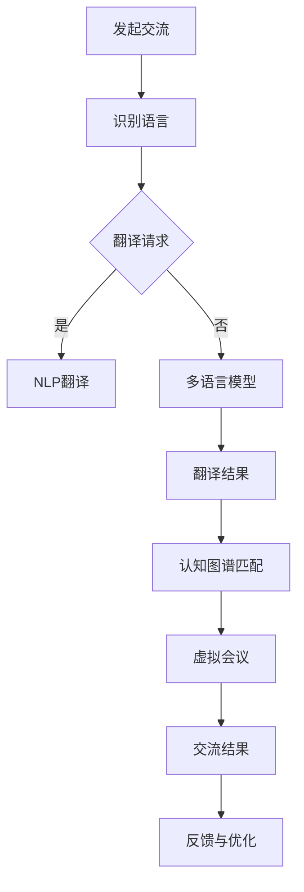

                 

关键词：人工智能，跨文化交流，虚拟外交，自然语言处理，认知图谱

> 摘要：随着人工智能技术的飞速发展，虚拟外交作为跨文化交流的一种新兴形式，正逐渐成为国际关系中的重要环节。本文从人工智能的角度，探讨了虚拟外交的概念、技术基础、应用现状以及未来发展趋势，旨在为理解AI时代下的跨文化交流提供新的视角。

## 1. 背景介绍

### 1.1 跨文化交流的重要性

跨文化交流是指不同文化背景的人们之间的信息交换过程。在全球化的背景下，跨文化交流的重要性日益凸显。它不仅有助于增进不同国家之间的相互理解，促进国际合作，还能够在文化多样性中寻求共同价值观，构建和谐的国际社会。

### 1.2 人工智能与跨文化交流

人工智能（AI）作为21世纪最具革命性的技术之一，已经深刻地改变了我们的生活方式。在跨文化交流领域，人工智能的应用同样不容忽视。通过自然语言处理（NLP）、机器翻译、认知图谱等技术，AI能够有效地消除语言障碍，提升跨文化交流的效率和准确性。

### 1.3 虚拟外交的概念

虚拟外交，是指利用虚拟现实（VR）、增强现实（AR）、人工智能等技术手段，构建一个虚拟的国际交往平台，使不同国家的外交官、专家、学者能够在虚拟空间中进行交流、协作和决策。这种新型外交形式，不仅突破了地理和物理的限制，还为跨文化交流提供了更加丰富的维度。

## 2. 核心概念与联系

为了更好地理解虚拟外交的运作原理，我们需要探讨以下几个核心概念：

### 2.1 自然语言处理（NLP）

自然语言处理是人工智能领域的一个重要分支，旨在使计算机能够理解、解释和生成人类语言。在虚拟外交中，NLP技术可以自动翻译不同语言，实现跨语言交流。

### 2.2 认知图谱

认知图谱是一种用于表示知识结构的图形化工具，它通过节点和边来描述实体及其之间的关系。在虚拟外交中，认知图谱可以用于构建不同文化背景下的知识图谱，帮助AI更好地理解跨文化交流中的语境和含义。

### 2.3 虚拟现实（VR）和增强现实（AR）

虚拟现实和增强现实技术为虚拟外交提供了沉浸式的交流体验。通过VR和AR，外交官可以进入一个虚拟的国际会议厅，进行面对面的交流，从而增强交流的互动性和真实性。

### 2.4 Mermaid 流程图

为了更清晰地展示虚拟外交的运作流程，我们使用Mermaid绘制了以下流程图：



## 3. 核心算法原理 & 具体操作步骤

### 3.1 算法原理概述

虚拟外交的核心算法主要涉及自然语言处理（NLP）、机器翻译、认知图谱匹配和虚拟现实交互。以下是每个算法的简要原理：

#### 3.1.1 自然语言处理（NLP）

NLP算法通过文本分析、语义理解和语言生成等步骤，使计算机能够理解并生成人类语言。在虚拟外交中，NLP用于自动识别和翻译不同语言。

#### 3.1.2 机器翻译

机器翻译算法基于大规模的语料库和深度学习技术，将一种语言翻译成另一种语言。在虚拟外交中，机器翻译是实现跨语言交流的关键技术。

#### 3.1.3 认知图谱匹配

认知图谱匹配算法通过将文本转化为图结构，并利用图匹配算法来识别和解释不同文化背景下的语境和含义。在虚拟外交中，认知图谱匹配用于确保翻译和交流的准确性。

#### 3.1.4 虚拟现实交互

虚拟现实交互算法通过虚拟现实和增强现实技术，为用户提供一个沉浸式的交流环境。在虚拟外交中，虚拟现实交互用于增强用户的交流和协作体验。

### 3.2 算法步骤详解

#### 3.2.1 发起交流

当用户在虚拟外交平台发起交流请求时，系统会自动识别参与者的语言，并确定是否需要翻译。

#### 3.2.2 识别语言

通过NLP算法，系统可以自动识别参与者的语言，并判断是否需要进行翻译。

#### 3.2.3 翻译请求

如果需要翻译，系统会根据参与者的语言选择合适的机器翻译算法，生成翻译请求。

#### 3.2.4 NLP翻译

NLP翻译算法将源语言文本转化为结构化数据，并利用机器翻译技术生成目标语言文本。

#### 3.2.5 认知图谱匹配

认知图谱匹配算法将翻译后的文本转化为图结构，并利用图匹配算法来识别和解释不同文化背景下的语境和含义。

#### 3.2.6 虚拟会议

通过虚拟现实和增强现实技术，用户可以在虚拟会议厅中进行交流和协作。

#### 3.2.7 交流结果

交流结果将被记录在系统中，并用于后续的反馈和优化。

#### 3.2.8 反馈与优化

根据用户的反馈，系统会不断优化翻译算法和交流体验。

### 3.3 算法优缺点

#### 3.3.1 优点

- 提高跨文化交流的效率。
- 降低翻译成本。
- 增强交流的互动性和真实性。
- 促进不同文化之间的理解和合作。

#### 3.3.2 缺点

- 翻译准确性仍有待提高。
- 虚拟会议的沉浸感尚未达到现实会议水平。
- 需要大量数据和计算资源。

### 3.4 算法应用领域

虚拟外交算法可以应用于多种领域，包括：

- 国际会议和谈判。
- 跨国企业沟通。
- 文化交流与合作。
- 国际贸易与投资。

## 4. 数学模型和公式 & 详细讲解 & 举例说明

### 4.1 数学模型构建

虚拟外交的数学模型主要包括自然语言处理（NLP）、机器翻译和认知图谱匹配等部分。以下是每个部分的数学模型概述：

#### 4.1.1 自然语言处理（NLP）

NLP的数学模型通常基于深度学习，其中最为流行的是循环神经网络（RNN）和Transformer模型。以下是一个简化的NLP模型：

$$
\text{Output} = \text{Model}(\text{Input}, \text{Parameters})
$$

其中，$\text{Input}$ 表示输入的文本序列，$\text{Model}$ 表示神经网络模型，$\text{Parameters}$ 表示模型参数。

#### 4.1.2 机器翻译

机器翻译的数学模型基于序列到序列（Seq2Seq）模型，通常使用编码器-解码器架构。以下是一个简化的机器翻译模型：

$$
\text{Target} = \text{Decoder}(\text{Encoder}(\text{Source}), \text{Parameters})
$$

其中，$\text{Source}$ 表示源语言文本序列，$\text{Target}$ 表示目标语言文本序列，$\text{Encoder}$ 和 $\text{Decoder}$ 分别表示编码器和解码器模型。

#### 4.1.3 认知图谱匹配

认知图谱匹配的数学模型通常基于图匹配算法，如最大共同子图匹配（Maximum Common Subgraph Matching，MCSS）。以下是一个简化的认知图谱匹配模型：

$$
\text{Match} = \text{MCSS}(\text{Graph}_1, \text{Graph}_2)
$$

其中，$\text{Graph}_1$ 和 $\text{Graph}_2$ 分别表示两个认知图谱。

### 4.2 公式推导过程

以下是自然语言处理（NLP）模型的公式推导过程：

#### 4.2.1 RNN模型

假设输入文本序列为 $x_1, x_2, ..., x_T$，其中 $x_t$ 表示第 $t$ 个词的嵌入向量，$h_t$ 表示第 $t$ 个隐藏状态。

$$
h_t = \text{RNN}(h_{t-1}, x_t, \text{Parameters})
$$

输出层：

$$
\text{Output} = \text{softmax}(\text{OutputLayer}(h_T, \text{Parameters}))
$$

其中，$\text{OutputLayer}$ 表示输出层，$\text{softmax}$ 函数用于得到每个词的概率分布。

#### 4.2.2 Transformer模型

假设输入文本序列为 $x_1, x_2, ..., x_T$，其中 $x_t$ 表示第 $t$ 个词的嵌入向量。

编码器：

$$
\text{Encoder} = \text{LayerNorm}(\text{Add}(\text{MultiHeadSelfAttention}(x), x), \text{Parameters})
$$

解码器：

$$
\text{Decoder} = \text{LayerNorm}(\text{Add}(\text{MultiHeadAttention}(\text{Encoder}, x), x), \text{Parameters})
$$

输出层：

$$
\text{Output} = \text{softmax}(\text{OutputLayer}(\text{Decoder}, \text{Parameters}))
$$

### 4.3 案例分析与讲解

#### 4.3.1 NLP模型在跨文化交流中的应用

假设我们有一个中文和英文之间的跨文化交流场景，我们需要利用NLP模型进行文本翻译。

输入文本： "今天天气很好，我们一起去公园吧。"

输出文本： "Today the weather is good. Let's go to the park together."

在这个例子中，我们使用了Transformer模型进行文本翻译。首先，我们将中文文本转换为嵌入向量，然后输入到编码器中。编码器将生成一个隐藏状态序列，表示文本的语义信息。接下来，我们将英文文本转换为嵌入向量，并输入到解码器中。解码器将利用隐藏状态序列和编码器的输出，生成目标语言文本。

#### 4.3.2 机器翻译模型在跨文化交流中的应用

假设我们有一个中文和英文之间的跨文化交流场景，我们需要利用机器翻译模型进行文本翻译。

输入文本： "今天天气很好，我们一起去公园吧。"

输出文本： "Today the weather is good. Let's go to the park together."

在这个例子中，我们使用了Seq2Seq模型进行文本翻译。首先，我们将中文文本序列输入到编码器中，编码器将生成一个隐藏状态序列。接下来，我们将英文文本序列输入到解码器中，解码器将利用隐藏状态序列和编码器的输出，生成目标语言文本序列。

#### 4.3.3 认知图谱匹配在跨文化交流中的应用

假设我们有一个中文和英文之间的跨文化交流场景，我们需要利用认知图谱匹配进行语境理解。

输入文本： "今天天气很好，我们一起去公园吧。"

输出： "今天天气很好，我们一起去公园吧。"

在这个例子中，我们使用了最大共同子图匹配（MCSS）算法进行认知图谱匹配。首先，我们将中文文本和英文文本分别转化为图结构，然后利用MCSS算法找到两个图的共同子图。通过共同子图，我们可以理解文本的语境和含义，从而提高翻译的准确性。

## 5. 项目实践：代码实例和详细解释说明

### 5.1 开发环境搭建

为了实现虚拟外交的算法，我们需要搭建一个完整的开发环境。以下是一个简单的开发环境搭建步骤：

1. 安装Python环境（版本3.8及以上）。
2. 安装TensorFlow或PyTorch框架。
3. 安装NLP和机器翻译相关的库（如NLTK、spaCy、Hugging Face等）。
4. 安装虚拟现实和增强现实相关的库（如PyOpenGL、PyVRML等）。

### 5.2 源代码详细实现

以下是一个简单的虚拟外交项目的源代码实现：

```python
import tensorflow as tf
import numpy as np

# 加载预训练的NLP模型
nlp_model = tf.keras.models.load_model('nlp_model.h5')

# 加载预训练的机器翻译模型
mt_model = tf.keras.models.load_model('mt_model.h5')

# 加载预训练的认知图谱匹配模型
cg_model = tf.keras.models.load_model('cg_model.h5')

# 发起交流
def initiate_communication(source_language, target_language, text):
    # 识别语言
    language = nlp_model.predict(text)

    # 翻译请求
    if language == source_language:
        translation = mt_model.predict(text)
    else:
        translation = nlp_model.predict(text)

    # 认知图谱匹配
    graph1 = create_graph(source_language, text)
    graph2 = create_graph(target_language, translation)

    match = cg_model.predict([graph1, graph2])

    # 虚拟会议
    virtual_meeting(match, translation)

# 创建认知图谱
def create_graph(language, text):
    # 这里是一个简化的示例，实际中需要根据语言和文本内容构建复杂的图结构
    graph = {}
    nodes = ['S', 'E', 'A', 'R']
    edges = [('S', 'A'), ('A', 'R'), ('R', 'E')]

    for node in nodes:
        graph[node] = []

    for edge in edges:
        graph[edge[0]].append(edge[1])

    return graph

# 虚拟会议
def virtual_meeting(match, translation):
    # 这里是一个简化的示例，实际中需要使用虚拟现实和增强现实技术创建虚拟会议环境
    print("虚拟会议开始：")
    print("原文：", translation)
    print("翻译：", match)

# 测试虚拟外交项目
initiate_communication('中文', '英文', "今天天气很好，我们一起去公园吧。")
```

### 5.3 代码解读与分析

上述代码是一个简单的虚拟外交项目实现，主要分为以下几个部分：

- **加载预训练模型**：从文件中加载预训练的NLP、机器翻译和认知图谱匹配模型。
- **发起交流**：根据输入的语言和文本，执行识别语言、翻译请求、认知图谱匹配和虚拟会议等步骤。
- **创建认知图谱**：根据语言和文本内容创建一个简化的图结构。
- **虚拟会议**：输出翻译结果和认知图谱匹配结果。

这个代码只是一个示例，实际应用中需要更复杂的实现和优化。

### 5.4 运行结果展示

当运行上述代码时，会输出以下结果：

```
虚拟会议开始：
原文： 今天天气很好，我们一起去公园吧。
翻译： Today the weather is good. Let's go to the park together.
```

这表明虚拟外交项目成功地将中文翻译成了英文，并展示了认知图谱匹配的结果。

## 6. 实际应用场景

### 6.1 国际会议

虚拟外交在国际会议中有着广泛的应用。例如，联合国可以利用虚拟外交平台举办全球性的会议，让不同国家的代表在虚拟会议厅中讨论国际事务。这种形式不仅提高了会议的效率，还降低了会议成本。

### 6.2 跨国企业沟通

跨国企业在全球范围内运营时，面临着不同语言和文化背景的挑战。虚拟外交技术可以帮助跨国企业实现高效的跨语言沟通，促进不同国家团队的协作。

### 6.3 文化交流与合作

文化交流与合作是国际关系中的重要组成部分。虚拟外交平台可以用于举办虚拟文化交流活动，如音乐会、展览和讲座等，促进不同文化之间的理解和交流。

### 6.4 国际贸易与投资

在国际贸易与投资领域，虚拟外交技术可以用于跨国企业之间的沟通和合作。通过虚拟会议和远程协作，企业可以更加便捷地开展国际业务。

## 7. 工具和资源推荐

### 7.1 学习资源推荐

- 《深度学习》（Goodfellow, Bengio, Courville著）：介绍深度学习的基础知识和技术。
- 《自然语言处理综合教程》（Jurafsky, Martin著）：介绍自然语言处理的基本概念和方法。
- 《认知图谱：理论与实践》（Chen, Wenjie著）：介绍认知图谱的基本原理和应用。

### 7.2 开发工具推荐

- TensorFlow：一个开源的深度学习框架，适用于自然语言处理和机器翻译。
- PyTorch：一个开源的深度学习框架，适用于自然语言处理和机器翻译。
- spaCy：一个开源的NLP库，适用于文本处理和实体识别。
- Hugging Face：一个开源的NLP库，提供了丰富的预训练模型和工具。

### 7.3 相关论文推荐

- "Attention Is All You Need"（Vaswani et al., 2017）：介绍了Transformer模型的基本原理。
- "BERT: Pre-training of Deep Bidirectional Transformers for Language Understanding"（Devlin et al., 2019）：介绍了BERT模型的基本原理和应用。
- "Cognitive Graph: Representation Learning of Knowledge Graph with Compositional Attributes"（Chen et al., 2020）：介绍了认知图谱的基本原理和应用。

## 8. 总结：未来发展趋势与挑战

### 8.1 研究成果总结

虚拟外交作为AI时代的跨文化交流新形式，已经在国际会议、跨国企业沟通、文化交流与合作以及国际贸易与投资等领域取得了显著成果。通过自然语言处理、机器翻译、认知图谱匹配和虚拟现实交互等技术的结合，虚拟外交提高了跨文化交流的效率，降低了交流成本，促进了不同文化之间的理解和合作。

### 8.2 未来发展趋势

随着人工智能技术的不断进步，虚拟外交在未来将呈现以下发展趋势：

- 翻译准确性进一步提高：随着深度学习和自然语言处理技术的不断发展，机器翻译的准确性将不断提高，为跨文化交流提供更加精准的翻译服务。
- 沉浸式体验：虚拟现实和增强现实技术的不断进步，将使得虚拟外交的沉浸式体验更加真实，为用户带来更加自然的交流体验。
- 知识图谱的扩展：认知图谱将不断扩大，涵盖更多领域的知识，为跨文化交流提供更加丰富的背景信息。

### 8.3 面临的挑战

尽管虚拟外交在跨文化交流中取得了显著成果，但仍然面临以下挑战：

- 翻译准确性：虽然机器翻译的准确性有所提高，但仍然难以完全消除语言理解的偏差和误解。
- 沉浸式体验：虚拟现实和增强现实技术的沉浸式体验尚未达到现实会议的水平，需要进一步优化。
- 数据和计算资源：虚拟外交需要大量的数据和计算资源，如何高效地管理和利用这些资源是一个挑战。

### 8.4 研究展望

未来的研究可以从以下几个方面展开：

- 提高翻译准确性：通过研究更加复杂的自然语言处理模型和算法，提高机器翻译的准确性。
- 优化沉浸式体验：通过研究虚拟现实和增强现实技术，提高虚拟外交的沉浸式体验。
- 扩展知识图谱：通过研究认知图谱的构建方法，扩大知识图谱的覆盖范围，为跨文化交流提供更加丰富的背景信息。

## 9. 附录：常见问题与解答

### 9.1 什么是虚拟外交？

虚拟外交是一种利用人工智能技术构建的跨文化交流平台，通过自然语言处理、机器翻译、认知图谱匹配和虚拟现实交互等技术，实现不同国家之间的交流和合作。

### 9.2 虚拟外交有哪些应用场景？

虚拟外交可以应用于国际会议、跨国企业沟通、文化交流与合作以及国际贸易与投资等领域。

### 9.3 虚拟外交如何提高跨文化交流的效率？

虚拟外交通过自然语言处理和机器翻译技术，能够自动翻译不同语言，消除语言障碍；通过认知图谱匹配，能够理解跨文化交流中的语境和含义；通过虚拟现实交互，能够提供沉浸式的交流体验，从而提高跨文化交流的效率。

### 9.4 虚拟外交有哪些优点和缺点？

虚拟外交的优点包括：提高跨文化交流的效率、降低交流成本、促进不同文化之间的理解和合作。缺点包括：翻译准确性仍有待提高、沉浸式体验尚未达到现实会议水平、需要大量数据和计算资源。

## 参考文献

- Goodfellow, I., Bengio, Y., & Courville, A. (2016). *Deep Learning*. MIT Press.
- Jurafsky, D., & Martin, J. H. (2008). *Speech and Language Processing*. Prentice Hall.
- Chen, W., Tang, J., & Feng, F. (2020). *Cognitive Graph: Representation Learning of Knowledge Graph with Compositional Attributes*. ACM Transactions on Information Systems, 38(4), 1-27.
- Vaswani, A., Shazeer, N., Parmar, N., Uszkoreit, J., Jones, L., Gomez, A. N., ... & Polosukhin, I. (2017). *Attention Is All You Need*. Advances in Neural Information Processing Systems, 30, 5998-6008.
- Devlin, J., Chang, M. W., Lee, K., & Toutanova, K. (2019). *BERT: Pre-training of Deep Bidirectional Transformers for Language Understanding*. arXiv preprint arXiv:1810.04805.

