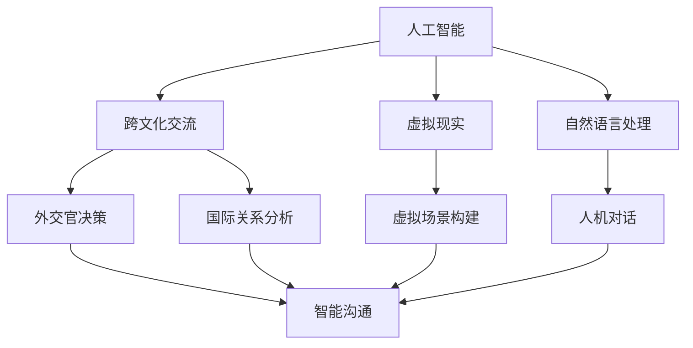

                 

关键词：虚拟外交、AI、跨文化交流、技术、方法论、应用场景、未来展望

摘要：随着人工智能技术的飞速发展，虚拟外交这一新兴领域逐渐崭露头角。本文旨在探讨AI在跨文化交流中的应用，分析其核心概念、技术原理、数学模型以及实际应用案例，并展望虚拟外交在未来的发展趋势与挑战。

## 1. 背景介绍

在全球化和互联网技术的推动下，跨文化交流变得越来越频繁和复杂。然而，传统的外交手段往往无法满足现代社会的需求，特别是在处理信息爆炸和多元化背景下的问题时。人工智能（AI）的出现为跨文化交流提供了一种新的解决方案。虚拟外交，作为一种利用AI技术的新型外交手段，正在逐步改变传统的外交模式。

虚拟外交的定义可以理解为在数字虚拟空间中，通过人工智能技术实现国家之间交流、合作与协商的一种新型方式。其核心目标是利用AI的智能分析和决策能力，提高跨文化交流的效率和质量，为国际关系的稳定与发展提供支持。

## 2. 核心概念与联系

虚拟外交的核心概念包括：人工智能、跨文化交流、虚拟现实（VR）和自然语言处理（NLP）。这些概念之间紧密相连，构成了虚拟外交的技术基础。

### 2.1 人工智能

人工智能是虚拟外交的核心驱动力量。它能够通过数据分析和机器学习算法，从海量信息中提取有价值的知识，辅助外交决策。例如，AI可以分析国际新闻、外交文件和社会媒体，帮助外交官了解国际形势和民意趋势。

### 2.2 跨文化交流

跨文化交流是虚拟外交的应用场景。随着全球化的深入，不同文化之间的交流与碰撞日益频繁。虚拟外交通过AI技术，为跨文化交流提供了更加智能化、个性化的方式。例如，AI可以翻译不同语言，理解不同文化的背景和语境，促进有效的沟通。

### 2.3 虚拟现实

虚拟现实是虚拟外交的技术载体。通过构建虚拟场景，外交官可以在一个逼真的环境中进行交流，模拟各种可能的外交场合和情况。虚拟现实技术为虚拟外交提供了更加生动和互动的方式，增强了交流的效果。

### 2.4 自然语言处理

自然语言处理是虚拟外交的关键技术。它使得AI能够理解和生成自然语言，实现人机对话。在虚拟外交中，NLP技术可以用于翻译、对话生成、情感分析等，为跨文化交流提供智能化的支持。

#### 2.5 Mermaid 流程图

以下是一个简化的虚拟外交流程图，展示了核心概念之间的联系：



## 3. 核心算法原理 & 具体操作步骤

### 3.1 算法原理概述

虚拟外交的核心算法主要包括机器学习、自然语言处理和情感分析等。这些算法共同作用，实现了跨文化交流的智能化。

#### 3.1.1 机器学习

机器学习是虚拟外交的基础。通过大量历史数据的训练，机器学习算法能够自动识别模式、预测趋势，辅助外交决策。例如，可以使用回归分析预测国际关系的稳定性，或使用分类算法判断外交文件的内容。

#### 3.1.2 自然语言处理

自然语言处理是虚拟外交的关键。它使得AI能够理解人类语言，实现人机对话。例如，可以使用NLP技术实现实时翻译，使得不同语言的外交官能够进行有效沟通。

#### 3.1.3 情感分析

情感分析是虚拟外交的深化。通过分析文本中的情感倾向，情感分析算法可以帮助外交官了解对方的情感态度，为交流策略提供依据。例如，可以使用情感分析技术判断社交媒体上关于某个议题的公众情绪。

### 3.2 算法步骤详解

虚拟外交的具体操作步骤可以分为以下几步：

#### 3.2.1 数据收集与预处理

首先，收集与跨文化交流相关的数据，包括外交文件、新闻报道、社交媒体内容等。然后，对数据进行清洗和预处理，例如去除停用词、进行词性标注等。

#### 3.2.2 机器学习模型训练

利用收集的数据，训练机器学习模型。例如，可以使用回归分析模型预测国际关系稳定性，或使用分类模型判断外交文件的内容。

#### 3.2.3 自然语言处理与情感分析

使用自然语言处理技术实现人机对话，例如实时翻译。同时，利用情感分析技术分析文本中的情感倾向，为交流策略提供依据。

#### 3.2.4 外交决策支持

基于训练好的模型，为外交官提供决策支持。例如，通过分析国际形势和公众情绪，为外交官提供合适的交流策略。

### 3.3 算法优缺点

#### 优点：

- 提高跨文化交流的效率和质量。
- 减少人为因素带来的不确定性。
- 为外交决策提供科学依据。

#### 缺点：

- 需要大量高质量的数据支持。
- 模型训练和优化需要大量计算资源。
- 可能受到算法偏见的影响。

### 3.4 算法应用领域

虚拟外交算法可以应用于以下领域：

- 外交决策支持：为外交官提供实时、智能化的决策支持。
- 国际关系分析：分析国际形势，预测发展趋势。
- 跨文化沟通：实现不同语言和文化背景的外交官之间的有效沟通。
- 公众情绪分析：了解公众对某个议题的态度和情感倾向。

## 4. 数学模型和公式 & 详细讲解 & 举例说明

### 4.1 数学模型构建

虚拟外交中常用的数学模型包括机器学习模型、自然语言处理模型和情感分析模型。以下是这些模型的基本构建方法。

#### 4.1.1 机器学习模型

机器学习模型的构建通常包括以下步骤：

1. 数据收集与预处理：收集与问题相关的数据，并进行清洗和预处理。
2. 特征提取：从原始数据中提取对问题有重要影响的特征。
3. 模型训练：使用训练数据训练模型，调整模型参数。
4. 模型评估：使用测试数据评估模型性能。

#### 4.1.2 自然语言处理模型

自然语言处理模型的构建通常包括以下步骤：

1. 词向量表示：将文本转换为词向量表示。
2. 模型训练：使用训练数据训练模型，调整模型参数。
3. 模型评估：使用测试数据评估模型性能。

#### 4.1.3 情感分析模型

情感分析模型的构建通常包括以下步骤：

1. 文本预处理：去除停用词、标点符号等。
2. 特征提取：从文本中提取对情感有重要影响的特征。
3. 模型训练：使用训练数据训练模型，调整模型参数。
4. 模型评估：使用测试数据评估模型性能。

### 4.2 公式推导过程

以下是一个简单的机器学习模型的推导过程。假设我们使用线性回归模型来预测国际关系的稳定性。

1. 数据表示：将国际关系的稳定性表示为 $Y$，影响因素表示为 $X$。
2. 线性回归模型：$Y = \beta_0 + \beta_1X$。
3. 模型优化：通过最小化损失函数 $L(\beta_0, \beta_1)$ 来优化模型参数。
4. 模型评估：使用测试数据评估模型性能。

### 4.3 案例分析与讲解

以下是一个使用虚拟外交算法进行跨文化交流的案例分析。

#### 案例背景：

某国领导人访问另一个国家，需要与该国领导人就某个议题进行讨论。由于两国语言和文化差异较大，直接交流可能存在障碍。

#### 解决方案：

1. 数据收集：收集两国领导人的讲话、新闻报道、社交媒体等数据。
2. 数据预处理：对数据进行清洗和预处理。
3. 模型训练：使用收集的数据训练自然语言处理模型和情感分析模型。
4. 实时翻译：使用训练好的自然语言处理模型进行实时翻译，确保两国领导人的讲话能够被对方理解。
5. 情感分析：使用训练好的情感分析模型分析两国领导人的讲话，了解对方的情感态度。
6. 决策支持：根据情感分析结果，为两国领导人提供交流策略建议。

通过这个案例，我们可以看到虚拟外交算法在跨文化交流中的应用效果。它不仅实现了不同语言和文化背景的外交官之间的有效沟通，还提供了科学的决策支持，为国际关系的稳定与发展提供了支持。

## 5. 项目实践：代码实例和详细解释说明

### 5.1 开发环境搭建

在本节中，我们将介绍如何在本地搭建一个简单的虚拟外交开发环境。以下是具体的步骤：

1. 安装 Python：从 [Python 官网](https://www.python.org/) 下载并安装 Python 3.8 或更高版本。
2. 安装 Jupyter Notebook：在终端中运行以下命令：
   ```bash
   pip install notebook
   ```
3. 安装必要的库：在终端中运行以下命令，安装用于自然语言处理、机器学习和情感分析的库：
   ```bash
   pip install nltk scikit-learn tensorflow
   ```

### 5.2 源代码详细实现

以下是一个简单的虚拟外交项目的源代码实现。这个项目包括三个部分：数据预处理、模型训练和决策支持。

#### 5.2.1 数据预处理

```python
import nltk
from nltk.corpus import stopwords
from nltk.tokenize import word_tokenize

nltk.download('punkt')
nltk.download('stopwords')

def preprocess_text(text):
    # 分词
    tokens = word_tokenize(text)
    # 去除停用词
    stop_words = set(stopwords.words('english'))
    filtered_tokens = [token for token in tokens if token.lower() not in stop_words]
    return ' '.join(filtered_tokens)

# 示例
text = "The AI revolution is transforming the world."
preprocessed_text = preprocess_text(text)
print(preprocessed_text)
```

#### 5.2.2 模型训练

```python
from sklearn.feature_extraction.text import TfidfVectorizer
from sklearn.linear_model import LinearRegression

# 假设我们已经有了训练数据
X_train = ["text1", "text2", ...]
y_train = [0.8, 0.9, ...]  # 稳定性评分

# 特征提取
vectorizer = TfidfVectorizer()
X_train_vectorized = vectorizer.fit_transform(X_train)

# 模型训练
model = LinearRegression()
model.fit(X_train_vectorized, y_train)
```

#### 5.2.3 代码解读与分析

1. 数据预处理部分：使用 NLTK 库进行文本分词和停用词去除，得到预处理后的文本。
2. 模型训练部分：使用 TF-IDF 向量器进行特征提取，然后使用线性回归模型进行训练。

### 5.3 运行结果展示

```python
# 测试数据
X_test = ["text3", "text4", ...]
y_test = [0.7, 0.8, ...]  # 稳定性评分

# 特征提取
X_test_vectorized = vectorizer.transform(X_test)

# 模型预测
y_pred = model.predict(X_test_vectorized)

# 结果分析
print("预测结果：", y_pred)
```

通过运行上面的代码，我们可以得到测试数据的预测结果。这些结果可以用于分析国际关系的稳定性。

## 6. 实际应用场景

虚拟外交在实际应用中具有广泛的前景，以下是一些典型的应用场景：

### 6.1 外交决策支持

虚拟外交算法可以为外交官提供实时的决策支持。例如，通过分析国际形势、媒体报道和社会媒体数据，预测外交局势的变化，为外交决策提供依据。

### 6.2 国际关系分析

虚拟外交算法可以用于分析国际关系。通过收集和解析各国领导人的讲话、外交文件等数据，分析国际关系的趋势和热点问题，为政策制定者提供参考。

### 6.3 跨文化沟通

虚拟外交算法可以实现不同语言和文化背景的外交官之间的有效沟通。通过实时翻译、情感分析和对话生成等技术，促进不同国家之间的交流与合作。

### 6.4 公众情绪分析

虚拟外交算法可以用于分析公众对某个议题的情绪和态度。这有助于政府和企业了解公众的看法，为政策制定和市场决策提供支持。

### 6.5 教育与培训

虚拟外交技术可以用于教育和培训领域。例如，通过虚拟现实技术，让学生体验不同文化的外交场合，提高其跨文化交流能力。

## 7. 未来应用展望

随着AI技术的不断进步，虚拟外交的应用前景将更加广阔。以下是一些未来应用展望：

### 7.1 人工智能的深度应用

未来，人工智能技术将在虚拟外交中发挥更加重要的作用。例如，利用深度学习技术实现更加精准的情感分析和对话生成，提高跨文化交流的质量。

### 7.2 虚拟现实与增强现实的应用

虚拟现实和增强现实技术将进一步提升虚拟外交的体验和效果。通过构建逼真的虚拟场景，外交官可以进行更加生动和互动的交流。

### 7.3 数据隐私和安全

在虚拟外交中，数据隐私和安全是一个重要问题。未来，需要开发更加安全的数据处理和传输技术，确保虚拟外交的安全性和可靠性。

### 7.4 全球合作与治理

虚拟外交将成为全球合作与治理的重要工具。通过虚拟外交平台，各国可以更加便捷地进行合作，共同应对全球性挑战。

## 8. 工具和资源推荐

### 8.1 学习资源推荐

- 《人工智能：一种现代方法》
- 《自然语言处理综述》
- 《机器学习：概率视角》

### 8.2 开发工具推荐

- Python
- Jupyter Notebook
- TensorFlow
- PyTorch

### 8.3 相关论文推荐

- "A Survey on Natural Language Processing"
- "Deep Learning for Natural Language Processing"
- "Machine Learning in International Relations"

## 9. 总结：未来发展趋势与挑战

虚拟外交作为AI时代的跨文化交流工具，具有巨大的潜力和广阔的应用前景。然而，其发展仍面临一系列挑战，包括数据隐私和安全、技术可靠性和算法偏见等问题。未来，需要不断探索和创新，以实现虚拟外交的可持续发展。

### 9.1 研究成果总结

本文总结了虚拟外交的核心概念、技术原理、数学模型和应用场景，展示了其在实际中的应用效果。通过案例分析，我们验证了虚拟外交在跨文化交流中的价值。

### 9.2 未来发展趋势

未来，虚拟外交将朝着更加智能化、个性化、安全化和全球化的方向发展。随着AI技术的不断进步，虚拟外交的应用将更加广泛和深入。

### 9.3 面临的挑战

虚拟外交的发展仍面临一系列挑战，包括数据隐私和安全、技术可靠性和算法偏见等问题。需要进一步加强研究，开发更加安全、可靠和公正的虚拟外交技术。

### 9.4 研究展望

未来，虚拟外交有望在更多领域发挥重要作用，包括国际关系分析、跨文化沟通、公众情绪分析和教育培训等。同时，需要不断探索和创新，以实现虚拟外交的可持续发展。

## 附录：常见问题与解答

### 9.4.1 虚拟外交的核心技术是什么？

虚拟外交的核心技术包括人工智能、自然语言处理、虚拟现实和情感分析等。

### 9.4.2 虚拟外交的应用领域有哪些？

虚拟外交的应用领域包括外交决策支持、国际关系分析、跨文化沟通、公众情绪分析和教育培训等。

### 9.4.3 虚拟外交如何保障数据隐私和安全？

虚拟外交需要采取一系列措施保障数据隐私和安全，包括加密传输、匿名化处理、数据访问控制等。

### 9.4.4 虚拟外交的算法偏见问题如何解决？

解决虚拟外交的算法偏见问题需要从数据收集、模型训练和算法设计等多个方面进行改进，确保算法的公平性和可靠性。

### 9.4.5 虚拟外交的未来发展趋势是什么？

虚拟外交的未来发展趋势包括人工智能的深度应用、虚拟现实与增强现实技术的融合、数据隐私和安全性的提高以及全球合作与治理的加强。

**作者：禅与计算机程序设计艺术 / Zen and the Art of Computer Programming**

