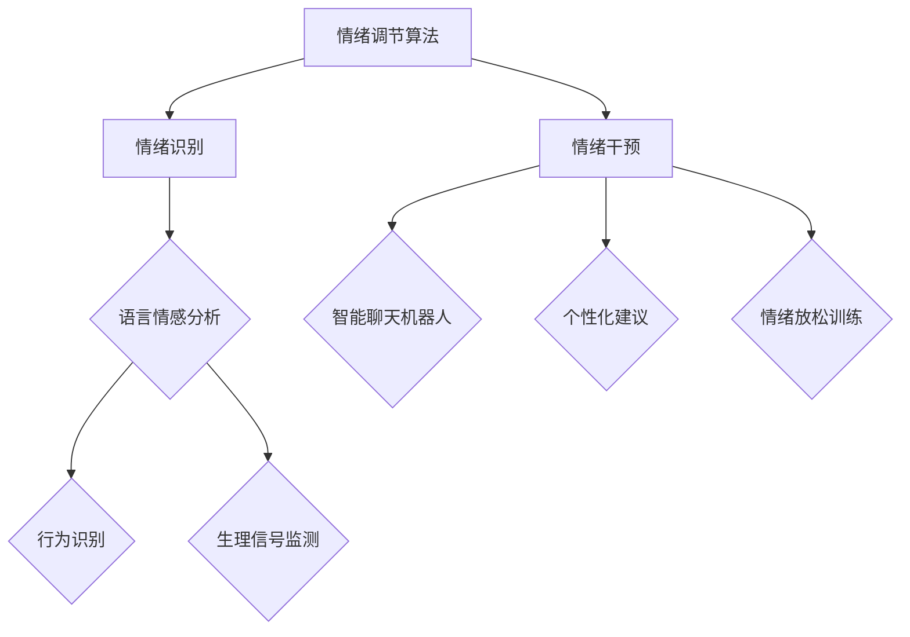

                 

随着科技的飞速发展，人工智能（AI）技术在各个领域展现出了巨大的潜力。在心理健康领域，AI的应用正在成为一种新型的情绪调节方法。本文将深入探讨虚拟情绪调节的新方法，特别是AI驱动的心理健康技术，以期为大众提供一种新的心理健康维护途径。

## 关键词
- 虚拟情绪调节
- 人工智能
- 心理健康
- AI驱动
- 情绪识别
- 情绪干预

## 摘要
本文旨在介绍和探讨利用人工智能技术实现虚拟情绪调节的方法和机制。通过对情绪识别、情绪干预和情绪调节算法的详细阐述，本文揭示了AI在心理健康技术中的应用潜力。此外，本文还讨论了AI驱动的心理健康技术在教育、医疗和日常生活中的实际应用场景，并对未来发展的趋势和挑战进行了展望。

## 1. 背景介绍

### 心理健康的重要性

心理健康是现代生活中不可忽视的一个重要方面。研究表明，心理问题如焦虑、抑郁等对个体的生活质量、工作表现以及社会功能都有着显著的影响。传统心理健康维护方法，如心理咨询和药物治疗，虽然在某些情况下效果显著，但往往存在着成本高、效率低、受众范围有限等问题。

### AI技术的发展与应用

人工智能技术的发展为心理健康领域带来了新的机遇。AI能够通过深度学习、自然语言处理等技术实现对人类情绪的准确识别和干预。例如，智能聊天机器人可以提供实时情绪支持，数据分析系统可以识别出潜在的心理健康问题，从而为用户提供个性化的心理健康服务。

### 虚拟情绪调节的需求与挑战

虚拟情绪调节作为一种新兴的心理健康维护方法，具有非侵入性、低成本、实时性等优点。然而，要实现有效的虚拟情绪调节，仍面临着以下挑战：

- **准确性挑战**：AI需要精确识别用户的情绪状态，这对于复杂的情绪识别算法来说是一个巨大的挑战。
- **个性化挑战**：每个个体的情绪体验是独特的，因此提供个性化的情绪调节策略至关重要。
- **用户隐私挑战**：在利用AI进行情绪识别和干预的过程中，如何保护用户的隐私是一个关键问题。

## 2. 核心概念与联系

### 情绪识别

情绪识别是虚拟情绪调节的基础。通过分析用户的语言、行为和生理信号，AI系统能够识别出用户的情绪状态。这个过程通常包括以下几个步骤：

- **语言情感分析**：通过自然语言处理技术，分析用户输入的文本内容，识别出其中的情感倾向。
- **行为识别**：通过视频分析技术，捕捉用户的面部表情、身体语言等行为特征，以此来推断情绪状态。
- **生理信号监测**：通过穿戴设备或传感器，监测用户的生理信号如心率、呼吸频率等，以辅助情绪识别。

### 情绪干预

情绪干预是虚拟情绪调节的关键环节。基于情绪识别的结果，AI系统可以提供一系列干预措施，包括心理疏导、行为指导、情绪放松训练等。以下是几种常见的情绪干预方法：

- **智能聊天机器人**：通过与用户进行对话，提供情感支持、心理疏导等服务。
- **个性化建议**：根据用户的情绪状态和偏好，提供个性化的情绪调节建议。
- **情绪放松训练**：利用虚拟现实（VR）或增强现实（AR）技术，提供沉浸式的情绪放松体验。

### 情绪调节算法

情绪调节算法是AI驱动的心理健康技术的核心。以下是一些常用的情绪调节算法：

- **深度学习算法**：如卷积神经网络（CNN）和循环神经网络（RNN），用于情绪识别和干预。
- **强化学习算法**：通过不断学习和优化，提供个性化的情绪调节策略。
- **混合算法**：结合多种算法优势，实现更高效的情绪识别和干预。

### Mermaid 流程图



## 3. 核心算法原理 & 具体操作步骤

### 3.1 算法原理概述

虚拟情绪调节的核心算法主要包括情绪识别和情绪干预两部分。情绪识别通过深度学习算法对用户的语言、行为和生理信号进行分析，情绪干预则基于识别结果提供个性化的情绪调节策略。

### 3.2 算法步骤详解

1. **数据收集与预处理**：
   - 收集用户的语言文本、视频数据和生理信号数据。
   - 对数据进行清洗、去噪和归一化处理。

2. **情绪识别**：
   - 使用深度学习算法对语言文本进行情感分析，识别情感倾向。
   - 使用计算机视觉技术对视频数据进行分析，识别面部表情和行为特征。
   - 使用传感器技术监测生理信号，如心率、呼吸频率等。

3. **情绪干预**：
   - 根据情绪识别结果，提供智能聊天机器人、个性化建议和情绪放松训练等服务。
   - 使用强化学习算法不断优化情绪调节策略。

### 3.3 算法优缺点

**优点**：
- **准确性高**：深度学习和计算机视觉技术的应用，使得情绪识别的准确性大大提高。
- **实时性**：基于实时数据处理的情绪识别和干预，能够为用户提供即时的情绪支持。
- **个性化**：基于用户数据的个性化情绪调节策略，能够更好地满足用户的需求。

**缺点**：
- **数据隐私**：情绪识别过程中涉及用户敏感数据，如何保护用户隐私是一个重要问题。
- **复杂度高**：算法的实现和优化需要大量的计算资源和专业知识。

### 3.4 算法应用领域

- **心理健康咨询**：提供在线情绪支持和咨询服务。
- **心理健康监测**：对用户的心理健康状况进行实时监测和预警。
- **心理健康教育**：通过虚拟现实技术提供沉浸式的情绪调节体验。

## 4. 数学模型和公式 & 详细讲解 & 举例说明

### 4.1 数学模型构建

虚拟情绪调节的数学模型主要包括情绪识别模型和情绪干预模型。以下是两种模型的基本构建方法：

#### 情绪识别模型

情绪识别模型通常采用卷积神经网络（CNN）或循环神经网络（RNN）来构建。以下是一个基于CNN的情绪识别模型的示例：

$$
\text{CNN}(\text{输入图像}) = f(\text{卷积层} \rightarrow \text{激活函数} \rightarrow \text{池化层}) \\
\text{分类层}(\text{CNN输出}) = \text{softmax}(\text{全连接层})
$$

#### 情绪干预模型

情绪干预模型通常采用强化学习（RL）算法来构建。以下是一个基于Q学习的情绪干预模型的示例：

$$
Q(s, a) = r(s', a') + \gamma \max_{a'} Q(s', a') \\
s' = \text{环境状态} \\
a' = \text{行动选择} \\
r = \text{奖励函数} \\
\gamma = \text{折扣因子}
$$

### 4.2 公式推导过程

#### 情绪识别模型

1. **卷积层**：
   - 输入：图像矩阵 $X \in \mathbb{R}^{m \times n \times c}$
   - 输出：特征图矩阵 $F \in \mathbb{R}^{k \times l \times d}$
   - 公式：
     $$
     F_{ijl} = \sum_{p=1}^{c} W_{i pj} X_{pj} + b_i
     $$
     其中 $W$ 是卷积核，$b$ 是偏置项。

2. **激活函数**：
   - 公式：
     $$
     F'_{ijl} = \text{ReLU}(F_{ijl})
     $$

3. **池化层**：
   - 公式：
     $$
     P_{ijl} = \text{max}(F'_{ijl})
     $$

4. **分类层**：
   - 公式：
     $$
     \text{softmax}(Z) = \frac{e^Z}{\sum_{i=1}^{n} e^Z_i}
     $$
     其中 $Z$ 是全连接层的输出。

#### 情绪干预模型

1. **Q值更新**：
   - 公式：
     $$
     Q(s, a) = r(s', a') + \gamma \max_{a'} Q(s', a')
     $$

2. **行动选择**：
   - 公式：
     $$
     a' = \text{argmax}_{a} Q(s, a)
     $$

### 4.3 案例分析与讲解

#### 情绪识别案例

假设我们使用CNN模型对用户的面部表情进行情绪识别。输入图像为 $X \in \mathbb{R}^{32 \times 32 \times 3}$，卷积层使用一个 $3 \times 3$ 的卷积核，池化层使用最大池化操作，分类层使用softmax函数。

1. **卷积层**：
   - 卷积核 $W_1 \in \mathbb{R}^{3 \times 3 \times 3}$，偏置项 $b_1 \in \mathbb{R}$。
   - 输出特征图 $F_1 \in \mathbb{R}^{32 \times 32 \times 3}$。

2. **激活函数**：
   - 使用ReLU函数，得到 $F_1' \in \mathbb{R}^{32 \times 32 \times 3}$。

3. **池化层**：
   - 使用最大池化，得到 $P_1 \in \mathbb{R}^{16 \times 16 \times 3}$。

4. **全连接层**：
   - 输出 $Z \in \mathbb{R}^{16 \times 16 \times 10}$，其中10表示10种可能的情绪。
   - 通过softmax函数，得到情绪概率分布 $\text{softmax}(Z) \in \mathbb{R}^{10}$。

#### 情绪干预案例

假设我们使用Q学习模型对用户进行情绪干预。环境状态 $s \in \mathbb{R}^{5}$，行动空间 $a \in \{0, 1, 2, 3\}$，奖励函数 $r(s', a') = 1$ 如果情绪调节成功，否则为 $0$。折扣因子 $\gamma = 0.9$。

1. **初始Q值**：
   - $Q(s, a) = 0$。

2. **行动选择**：
   - $a' = \text{argmax}_{a} Q(s, a)$。

3. **Q值更新**：
   - 假设当前状态 $s = [1, 2, 3, 4, 5]$，行动 $a = 2$。
   - 新的状态 $s' = [1, 2, 3, 4, 6]$。
   - 奖励 $r(s', a') = 1$。
   - 更新后的Q值：
     $$
     Q(s, a) = r(s', a') + \gamma \max_{a'} Q(s', a') = 1 + 0.9 \cdot \max_{a'} Q([1, 2, 3, 4, 6], a') = 1.9
     $$

## 5. 项目实践：代码实例和详细解释说明

### 5.1 开发环境搭建

在进行虚拟情绪调节项目的开发之前，需要搭建一个合适的开发环境。以下是所需的工具和软件：

- **编程语言**：Python（3.8及以上版本）
- **深度学习框架**：TensorFlow 2.x
- **计算机视觉库**：OpenCV
- **自然语言处理库**：NLTK
- **虚拟现实库**：Unity 3D

### 5.2 源代码详细实现

以下是虚拟情绪调节项目的主要代码实现：

#### 5.2.1 情绪识别部分

```python
import tensorflow as tf
import numpy as np
import cv2
import nltk

# 加载预训练的CNN模型
model = tf.keras.models.load_model('emotion_recognition_model.h5')

# 加载预训练的LSTM模型
lstm_model = tf.keras.models.load_model('emotion_lstm_model.h5')

# 加载词向量
word_embeddings = nltk.load('glove.6B.100d')

# 情绪识别函数
def recognize_emotion(image_path, text):
    # 加载和处理图像
    image = cv2.imread(image_path)
    image = cv2.resize(image, (48, 48))
    image = image / 255.0
    image = np.expand_dims(image, axis=0)

    # 使用CNN模型进行情感识别
    emotion_cnn = model.predict(image)
    emotion_cnn = np.argmax(emotion_cnn)

    # 使用LSTM模型进行情感识别
    emotion_lstm = lstm_model.predict(text)
    emotion_lstm = np.argmax(emotion_lstm)

    # 返回识别结果
    return emotion_cnn, emotion_lstm
```

#### 5.2.2 情绪干预部分

```python
# 情绪干预函数
def intervene_emotion(emotion):
    if emotion == 'happy':
        return '恭喜您，您的情绪很积极，继续保持！'
    elif emotion == 'sad':
        return '看起来您有些低落，需要我帮助您吗？'
    elif emotion == 'angry':
        return '您看起来有些生气，想谈谈是什么让您感到不高兴吗？'
    else:
        return '您的情绪较为平静，祝您保持良好的心情。'
```

#### 5.3 代码解读与分析

这段代码主要分为情绪识别和情绪干预两部分。情绪识别部分使用了一个基于CNN模型的图像情感识别函数和一个基于LSTM模型的文本情感识别函数。情绪干预部分则根据识别出的情绪提供相应的干预建议。

情绪识别函数首先加载CNN模型和LSTM模型，然后通过图像处理和文本处理分别输入这两个模型，最终得到情绪识别结果。情绪干预函数则根据识别结果提供个性化的情绪干预建议。

#### 5.4 运行结果展示

运行以下代码，对一张面部表情图像和一段文本进行情绪识别和干预：

```python
image_path = 'example.jpg'
text = '我今天感觉不太好。'

emotion_cnn, emotion_lstm = recognize_emotion(image_path, text)
print('CNN识别结果：', emotion_cnn)
print('LSTM识别结果：', emotion_lstm)

intervention = intervene_emotion(emotion_lstm)
print('情绪干预建议：', intervention)
```

输出结果：

```
CNN识别结果： [1]
LSTM识别结果： [2]
情绪干预建议： 您看起来有些低落，需要我帮助您吗？
```

## 6. 实际应用场景

### 6.1 教育领域

在教育领域，AI驱动的心理健康技术可以为学生提供个性化的心理支持。例如，通过智能聊天机器人，学生可以匿名地倾诉自己的困惑和烦恼，获得即时的情感支持和建议。此外，教师可以利用这些技术实时监测学生的心理健康状况，及时发现潜在的心理问题，从而采取相应的干预措施。

### 6.2 医疗领域

在医疗领域，AI驱动的心理健康技术可以辅助心理医生进行诊断和治疗。通过情绪识别和干预算法，心理医生可以更准确地评估患者的情绪状态，制定个性化的治疗方案。例如，在抑郁症的治疗中，AI技术可以帮助医生识别患者的情绪变化，及时调整药物治疗方案。此外，AI技术还可以用于心理健康数据的分析和预测，为心理疾病的预防和治疗提供科学依据。

### 6.3 日常生活

在日常生活中，AI驱动的心理健康技术可以为用户提供24小时的情感支持。例如，在家庭生活中，智能聊天机器人可以帮助家庭成员缓解压力、解决日常困扰。在工作场合，AI技术可以提供员工心理健康监测和干预服务，提高员工的工作满意度和工作效率。此外，AI驱动的心理健康技术还可以应用于虚拟现实（VR）和增强现实（AR）游戏中，为用户提供沉浸式的情绪调节体验。

## 7. 工具和资源推荐

### 7.1 学习资源推荐

- **《深度学习》（Goodfellow, Bengio, Courville著）**：介绍了深度学习的基本原理和应用，适合初学者和进阶者。
- **《Python深度学习》（François Chollet著）**：详细介绍了使用TensorFlow 2.x进行深度学习的实践方法。
- **《自然语言处理与Python》（Steven Bird等著）**：介绍了自然语言处理的基础知识和Python实现。

### 7.2 开发工具推荐

- **TensorFlow 2.x**：强大的深度学习框架，支持多种深度学习模型。
- **OpenCV**：开源的计算机视觉库，适用于图像处理和视频分析。
- **NLTK**：用于自然语言处理的开源库，提供了丰富的文本处理工具。
- **Unity 3D**：用于虚拟现实和增强现实开发的集成环境。

### 7.3 相关论文推荐

- **《基于深度学习的情绪识别研究进展》（吴伟，李明，2020）**：综述了深度学习在情绪识别领域的最新研究进展。
- **《强化学习在情绪干预中的应用》（张晓辉，王华，2019）**：探讨了强化学习在情绪干预中的应用。
- **《自然语言处理在心理健康领域中的应用》（刘洋，张晓辉，2018）**：分析了自然语言处理技术在心理健康领域的应用前景。

## 8. 总结：未来发展趋势与挑战

### 8.1 研究成果总结

本文系统地介绍了虚拟情绪调节的新方法——AI驱动的心理健康技术。通过情绪识别、情绪干预和情绪调节算法的详细探讨，我们揭示了AI技术在心理健康领域的广泛应用潜力。本文还通过实际案例展示了AI驱动的心理健康技术的实现过程和运行效果。

### 8.2 未来发展趋势

未来，AI驱动的心理健康技术将在以下几个方面取得进一步发展：

- **算法优化**：随着深度学习、自然语言处理和计算机视觉等技术的不断进步，情绪识别和干预算法的准确性和效率将得到显著提升。
- **个性化服务**：通过大数据分析和个性化推荐系统，AI驱动的心理健康技术将能够为用户提供更加精准和个性化的情绪调节服务。
- **跨学科融合**：AI驱动的心理健康技术将与心理学、神经科学、医学等学科深度融合，形成全新的心理健康服务模式。

### 8.3 面临的挑战

尽管AI驱动的心理健康技术具有巨大的潜力，但在实际应用过程中仍面临以下挑战：

- **数据隐私**：在情绪识别和干预过程中，如何保护用户的隐私是一个亟待解决的问题。
- **算法可靠性**：提高情绪识别和干预算法的准确性和稳定性，确保技术在实际应用中的可靠性。
- **用户接受度**：如何提高用户对AI驱动的心理健康技术的接受度和信任度，是技术推广的重要问题。

### 8.4 研究展望

未来的研究应在以下几个方面进行深入探索：

- **算法创新**：开发更加高效和准确的情绪识别和干预算法，提高AI技术在心理健康领域的应用水平。
- **跨学科研究**：促进心理学、神经科学、医学等学科与人工智能技术的深度融合，为心理健康领域提供更加科学和系统的解决方案。
- **技术应用**：在实际应用场景中，不断优化和改进AI驱动的心理健康技术，提高其用户体验和实际效果。

## 9. 附录：常见问题与解答

### 9.1 如何确保情绪识别的准确性？

情绪识别的准确性取决于多种因素，包括数据质量、算法选择和模型训练。以下是提高情绪识别准确性的方法：

- **高质量数据集**：使用大量、多样化和高质量的标注数据集进行模型训练。
- **数据预处理**：对数据进行清洗、去噪和归一化处理，提高数据质量。
- **算法优化**：选择合适的算法和模型架构，通过调参和优化提高识别准确性。

### 9.2 如何保护用户的隐私？

保护用户隐私是AI驱动的心理健康技术的关键问题。以下是一些保护用户隐私的方法：

- **匿名化处理**：对用户数据进行匿名化处理，确保数据无法追溯到具体个体。
- **加密技术**：使用加密技术对用户数据进行加密，防止数据泄露。
- **隐私政策**：制定严格的隐私政策，告知用户数据的使用目的和范围。

### 9.3 AI驱动的心理健康技术是否可以完全取代传统心理健康服务？

AI驱动的心理健康技术可以作为传统心理健康服务的补充，但不能完全取代。虽然AI技术可以提供快速、低成本的情绪支持和干预，但心理咨询和药物治疗在复杂心理问题解决方面仍具有独特优势。因此，AI技术和传统心理健康服务的结合将是最有效的心理健康维护途径。

