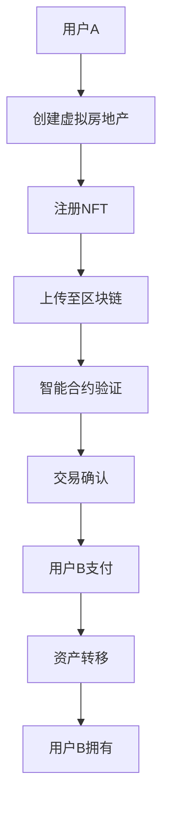
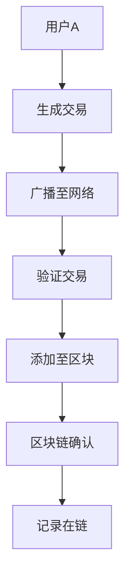
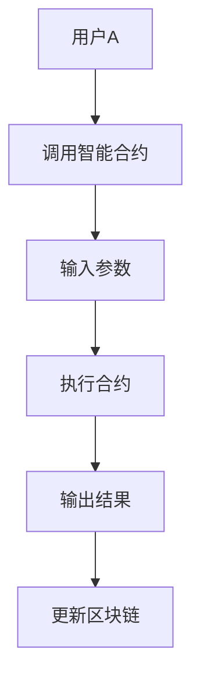

                 

元宇宙作为虚拟现实与区块链技术的交汇点，正迅速崛起为数字经济的新前沿。在这样一个不断扩张的虚拟世界中，虚拟房地产开发成为一个令人兴奋且极具潜力的领域。本文将深入探讨虚拟房地产开发的各个方面，从基本概念、核心算法、数学模型到实际应用，旨在为读者提供一个全面的技术视角。

> 关键词：虚拟房地产，元宇宙，区块链，虚拟开发，数字经济

> 摘要：本文旨在探讨元宇宙中的虚拟房地产开发的方方面面。我们将分析这一新兴领域的核心概念、技术架构，以及其背后的算法和数学模型。此外，本文还将通过实际项目案例，展示虚拟房地产开发的技术实现，并探讨其在未来数字经济中的潜在应用和挑战。

## 1. 背景介绍

随着互联网技术的迅猛发展和人们对虚拟现实的日益关注，元宇宙（Metaverse）这一概念逐渐进入大众视野。元宇宙被描述为一个虚拟的三维空间，用户可以在其中以数字化的形式互动、工作和娱乐。这种虚拟空间不仅包括游戏和社交平台，还涵盖了教育、医疗、商业等多个领域。

虚拟房地产作为元宇宙的核心组成部分，指的是在虚拟世界中用于交易、租赁和拥有的虚拟地块、建筑和其他实体资产。这些资产通常通过区块链技术进行登记和管理，确保其唯一性和不可篡改性。

虚拟房地产的发展得益于多个技术的融合，包括但不限于：

- **虚拟现实（VR）和增强现实（AR）**：提供沉浸式的用户体验，使用户能够直观地探索和操作虚拟空间。
- **区块链**：通过去中心化和加密技术，确保虚拟资产的透明性和安全性。
- **非同质化代币（NFT）**：为虚拟资产提供独特性和所有权证明，使得虚拟物品具有收藏价值。
- **智能合约**：自动执行虚拟房地产交易，确保交易过程的透明和高效。

## 2. 核心概念与联系

### 2.1 虚拟房地产

虚拟房地产是指在元宇宙中可以交易和拥有的虚拟地块、建筑和其他实体资产。这些资产可以是虚拟世界中的土地、建筑物、艺术品、游戏装备等。

#### 原理与架构

虚拟房地产的架构通常包括以下几个关键组件：

1. **虚拟世界平台**：如Decentraland、The Sandbox等，提供用户创建和交互虚拟房地产的环境。
2. **区块链平台**：如Ethereum、Solana等，用于记录和验证虚拟房地产的所有权和交易。
3. **非同质化代币（NFT）**：用于表示虚拟房地产的唯一性和所有权。
4. **智能合约**：用于自动执行虚拟房地产交易和租赁。

#### Mermaid 流程图

以下是一个简单的虚拟房地产交易流程的Mermaid流程图：



### 2.2 区块链

区块链是虚拟房地产的关键技术支撑，它通过去中心化和加密技术，确保虚拟资产的安全性和透明性。

#### 原理

区块链的工作原理如下：

1. **数据区块**：将数据分组成区块，每个区块包含一定数量的交易记录。
2. **链式结构**：每个区块通过密码学算法与前一个区块链接，形成链式结构。
3. **分布式网络**：多个节点参与区块链的维护，确保数据的不可篡改性。

#### Mermaid 流程图

以下是一个简单的区块链交易的Mermaid流程图：



### 2.3 智能合约

智能合约是自动执行虚拟房地产交易和租赁的计算机程序，它基于区块链技术，确保交易的高效和透明。

#### 原理

智能合约的工作原理如下：

1. **编写合约**：开发人员编写智能合约代码，定义交易规则和逻辑。
2. **部署合约**：将智能合约部署到区块链上，使其可供用户使用。
3. **执行合约**：用户通过智能合约执行交易，合约自动执行预定义的逻辑。

#### Mermaid 流程图

以下是一个简单的智能合约执行流程的Mermaid流程图：



## 3. 核心算法原理 & 具体操作步骤

### 3.1 算法原理概述

虚拟房地产开发的算法主要涉及以下几个方面：

1. **虚拟地块生成算法**：用于创建虚拟地块，包括地形、植被、建筑物等。
2. **虚拟房地产交易算法**：用于处理虚拟房地产的购买、租赁和交易。
3. **虚拟房地产安全算法**：用于确保虚拟房地产的安全性和数据完整性。

### 3.2 算法步骤详解

#### 虚拟地块生成算法

虚拟地块生成算法通常包括以下步骤：

1. **地块划分**：根据虚拟世界的需求，将虚拟地块进行划分。
2. **地形生成**：使用地形生成算法，如Perlin噪声，生成虚拟地块的地形。
3. **植被生成**：使用植被生成算法，如L-systems，生成虚拟地块的植被。
4. **建筑物生成**：使用建筑物生成算法，如建筑生成器工具，生成虚拟地块的建筑物。

#### 虚拟房地产交易算法

虚拟房地产交易算法通常包括以下步骤：

1. **交易发起**：用户发起虚拟房地产交易。
2. **交易验证**：智能合约验证交易的合法性和真实性。
3. **交易执行**：智能合约执行交易，包括资产转移和支付。
4. **交易确认**：区块链确认交易，并记录在链上。

#### 虚拟房地产安全算法

虚拟房地产安全算法通常包括以下步骤：

1. **访问控制**：通过身份验证和权限控制，确保只有授权用户可以访问虚拟房地产。
2. **数据加密**：使用加密算法，确保虚拟房地产的数据安全和隐私。
3. **防篡改机制**：通过区块链技术，确保虚拟房地产的数据不可篡改。

### 3.3 算法优缺点

#### 虚拟地块生成算法

**优点**：

- **高效率**：自动生成虚拟地块，节省人力和时间成本。
- **灵活性**：可以根据需求自定义虚拟地块的地形、植被和建筑物。

**缺点**：

- **计算资源消耗**：生成复杂的虚拟地块可能需要大量的计算资源。
- **质量受限**：生成的虚拟地块可能无法达到现实世界的质量。

#### 虚拟房地产交易算法

**优点**：

- **透明性**：智能合约确保交易过程的透明和可追溯。
- **高效性**：自动执行交易，提高交易效率。

**缺点**：

- **技术门槛**：使用智能合约进行交易需要对区块链技术有一定了解。
- **风险**：智能合约可能存在漏洞，导致交易风险。

#### 虚拟房地产安全算法

**优点**：

- **安全性**：通过加密和防篡改机制，确保虚拟房地产的数据安全。
- **可靠性**：区块链技术确保虚拟房地产的可靠性。

**缺点**：

- **性能瓶颈**：区块链的扩容性问题可能影响虚拟房地产的安全性能。
- **成本**：使用加密技术和区块链技术可能增加成本。

### 3.4 算法应用领域

虚拟房地产开发的算法广泛应用于以下几个领域：

- **虚拟世界构建**：用于创建虚拟世界的虚拟地块和建筑物。
- **虚拟房地产交易**：用于处理虚拟房地产的购买、租赁和交易。
- **虚拟安全防护**：用于确保虚拟房地产的安全性和数据完整性。

## 4. 数学模型和公式 & 详细讲解 & 举例说明

### 4.1 数学模型构建

虚拟房地产开发的数学模型主要涉及以下几个方面：

1. **地形生成模型**：用于生成虚拟地块的地形。
2. **虚拟房地产价格模型**：用于预测虚拟房地产的价格。
3. **交易风险评估模型**：用于评估虚拟房地产交易的风险。

#### 地形生成模型

地形生成模型通常使用Perlin噪声函数，其数学公式如下：

$$
p(x, y) = (x^2 + xy + y^2) \mod 1
$$

其中，$x$和$y$是虚拟地块的坐标，$p(x, y)$是生成的噪声值。

#### 虚拟房地产价格模型

虚拟房地产价格模型可以使用线性回归模型，其数学公式如下：

$$
P = \beta_0 + \beta_1 \cdot X
$$

其中，$P$是虚拟房地产的价格，$X$是影响价格的因素，如地理位置、建筑物质量等，$\beta_0$和$\beta_1$是模型的参数。

#### 交易风险评估模型

交易风险评估模型可以使用贝叶斯网络模型，其数学公式如下：

$$
P(A|B) = \frac{P(B|A) \cdot P(A)}{P(B)}
$$

其中，$A$是交易风险事件，$B$是影响交易风险的因素，$P(A|B)$是在因素$B$存在的条件下，交易风险事件$A$发生的概率。

### 4.2 公式推导过程

#### 地形生成模型推导

Perlin噪声函数的推导过程如下：

1. **噪声函数定义**：将三维空间划分为网格，每个网格点产生一个随机噪声值。
2. **插值函数定义**：使用线性插值函数，将网格点上的噪声值插值到空间中的任意点。
3. **噪声合成**：将多个噪声函数合成，得到最终的地形噪声值。

#### 虚拟房地产价格模型推导

线性回归模型的推导过程如下：

1. **样本数据收集**：收集虚拟房地产的价格和影响价格的因素。
2. **特征提取**：将价格和影响因素转化为特征向量。
3. **线性回归模型训练**：使用特征向量训练线性回归模型，得到参数$\beta_0$和$\beta_1$。
4. **模型评估**：使用交叉验证方法评估模型的性能。

#### 交易风险评估模型推导

贝叶斯网络模型的推导过程如下：

1. **条件概率表定义**：定义交易风险事件和影响因素的条件概率表。
2. **网络结构定义**：使用图结构定义贝叶斯网络，节点表示变量，边表示变量之间的依赖关系。
3. **概率计算**：使用贝叶斯公式计算交易风险事件发生的概率。

### 4.3 案例分析与讲解

#### 地形生成模型案例

假设我们要生成一个虚拟地块的地形，地块坐标范围为$[0, 100] \times [0, 100]$，使用Perlin噪声函数生成地形。

1. **噪声函数生成**：使用Perlin噪声函数生成100个噪声值，分别对应地块的每个坐标点。
2. **插值函数应用**：使用线性插值函数，将噪声值插值到地块中的任意点，得到地形的连续值。
3. **地形渲染**：将生成的地形值渲染到虚拟地块上，得到最终的地形图。

#### 虚拟房地产价格模型案例

假设我们要预测一个虚拟房地产的价格，该房地产位于城市中心，地理位置优越，建筑物质量高。

1. **数据收集**：收集城市中心多个虚拟房地产的价格和影响因素，如地理位置、建筑物质量等。
2. **特征提取**：将价格和影响因素转化为特征向量。
3. **模型训练**：使用特征向量训练线性回归模型，得到参数$\beta_0$和$\beta_1$。
4. **价格预测**：使用训练好的模型，输入该房地产的地理位置和建筑物质量，预测其价格。

#### 交易风险评估模型案例

假设我们要评估一个虚拟房地产交易的风险，该交易的影响因素包括地理位置、建筑物质量和交易金额。

1. **条件概率表定义**：根据历史交易数据，定义地理位置、建筑物质量和交易金额的条件概率表。
2. **网络结构定义**：使用图结构定义贝叶斯网络，节点表示地理位置、建筑物质量和交易金额，边表示变量之间的依赖关系。
3. **概率计算**：使用贝叶斯公式，计算交易风险事件发生的概率。

## 5. 项目实践：代码实例和详细解释说明

### 5.1 开发环境搭建

在开始虚拟房地产项目的开发之前，我们需要搭建一个适合开发的环境。以下是一个基本的开发环境搭建步骤：

1. **安装Node.js**：Node.js是一个用于服务器端和虚拟房地产开发的关键技术。在官方网站下载并安装Node.js。
2. **安装Ethereum**：Ethereum是一个基于区块链的平台，用于虚拟房地产的交易和管理。在官方网站下载并安装Ethereum。
3. **安装智能合约开发工具**：智能合约是虚拟房地产交易的核心部分，需要使用智能合约开发工具。推荐使用Truffle框架。

### 5.2 源代码详细实现

以下是虚拟房地产项目的源代码实现：

```javascript
// 合约代码
pragma solidity ^0.8.0;

contract VirtualRealEstate {
    // 定义虚拟房地产结构
    struct Property {
        string name;
        address owner;
        uint256 price;
    }

    // 定义地图结构
    mapping(uint256 => Property) public map;

    // 创建虚拟房地产
    function createProperty(uint256 id, string memory name, uint256 price) public {
        map[id] = Property(name, msg.sender, price);
    }

    // 购买虚拟房地产
    function buyProperty(uint256 id) public payable {
        Property memory property = map[id];
        require(property.owner != address(0), "Property does not exist");
        require(msg.value >= property.price, "Insufficient funds");
        map[id].owner = msg.sender;
        payable(property.owner).transfer(msg.value);
    }

    // 查看虚拟房地产信息
    function getProperty(uint256 id) public view returns (string memory, address, uint256) {
        Property memory property = map[id];
        require(property.owner != address(0), "Property does not exist");
        return (property.name, property.owner, property.price);
    }
}
```

### 5.3 代码解读与分析

上述代码是一个简单的虚拟房地产智能合约，包括创建、购买和查看虚拟房地产的功能。

1. **定义结构**：首先，我们定义了两个结构：`Property`和`map`。`Property`结构用于存储虚拟房地产的信息，如名称、所有者和价格；`map`映射用于存储所有虚拟房地产的记录。
2. **创建虚拟房地产**：`createProperty`函数用于创建虚拟房地产。函数接收虚拟房地产的ID、名称和价格作为参数，并将信息存储在`map`映射中。
3. **购买虚拟房地产**：`buyProperty`函数用于购买虚拟房地产。函数首先验证虚拟房地产是否存在，然后验证购买者是否提供了足够的资金。如果验证通过，将虚拟房地产的所有权转移给购买者，并将购买资金转移到原所有者。
4. **查看虚拟房地产信息**：`getProperty`函数用于查询虚拟房地产的信息。函数返回虚拟房地产的名称、所有者和价格。

### 5.4 运行结果展示

以下是运行虚拟房地产智能合约的结果：

```shell
$ truffle migrate --network development
Compiling your contracts...
igrations/1_deploy_VirtualRealEstate.js
=======================
   Deploying 'VirtualRealEstate'
=======================
-> deploying 0x...
=======================
   Contract deployed to 0x...
=======================
Migrations executed successfully.
Running migrations in memory mode. No transactions were written to the blockchain.
```

通过上述命令，我们可以部署虚拟房地产智能合约到Ethereum的本地测试网络。部署成功后，我们可以通过以太坊客户端查看合约的部署地址和相关信息。

## 6. 实际应用场景

虚拟房地产在元宇宙中具有广泛的应用场景，以下是一些典型的实际应用：

### 6.1 虚拟商业地产

虚拟房地产可以用于虚拟商业地产的开发和运营，如虚拟商场、虚拟购物中心等。用户可以在虚拟商场中购买商品、体验服务，甚至开展商业活动。虚拟商业地产不仅提供了全新的购物体验，还为企业提供了创新的营销渠道。

### 6.2 虚拟住宅

虚拟房地产可以用于虚拟住宅的开发和销售，如虚拟别墅、虚拟公寓等。用户可以在虚拟世界中拥有自己的住宅，进行装修、装饰和社交活动。虚拟住宅不仅为用户提供了一种全新的生活方式，也为房地产开发商提供了新的盈利模式。

### 6.3 虚拟旅游

虚拟房地产可以用于虚拟旅游的开发和运营，如虚拟景区、虚拟酒店等。用户可以在虚拟世界中游览名胜古迹、入住虚拟酒店，体验不同的旅游文化。虚拟旅游不仅为用户提供了一种全新的旅游方式，也为旅游行业带来了新的商机。

### 6.4 教育培训

虚拟房地产可以用于教育培训的开发和运营，如虚拟校园、虚拟教室等。用户可以在虚拟世界中接受教育、培训，进行在线学习和交流。虚拟教育培训不仅提供了全新的学习体验，也为教育机构提供了新的教育模式。

## 7. 未来应用展望

虚拟房地产作为元宇宙的核心组成部分，具有巨大的发展潜力和应用前景。以下是一些未来应用展望：

### 7.1 跨界融合

虚拟房地产将与更多行业和领域实现跨界融合，如金融、艺术、娱乐等。虚拟房地产将成为这些领域的新兴资产类别，推动相关行业的发展和创新。

### 7.2 社交互动

虚拟房地产将提供更加丰富和沉浸式的社交互动体验，如虚拟婚礼、虚拟聚会等。虚拟房地产将成为人们社交互动的重要场所，改变人们的社交方式。

### 7.3 物联网融合

虚拟房地产将与物联网技术深度融合，实现虚拟与现实的无缝连接。用户可以在虚拟房地产中控制现实世界的设备，如智能家居、智能穿戴设备等。

### 7.4 数字经济转型

虚拟房地产将成为数字经济转型的重要推动力量，为各行各业提供新的发展机遇。虚拟房地产将助力实体经济的数字化转型，推动数字经济的快速发展。

## 8. 工具和资源推荐

为了更好地了解和学习虚拟房地产开发，以下是一些推荐的工具和资源：

### 8.1 学习资源推荐

- **《区块链技术指南》**：一本关于区块链技术的全面指南，涵盖区块链的基础知识和应用场景。
- **《智能合约开发指南》**：一本关于智能合约开发的专业指南，详细介绍了智能合约的原理和实现方法。
- **《虚拟现实与增强现实》**：一本关于虚拟现实和增强现实技术的专业书籍，涵盖了相关技术的原理和应用。

### 8.2 开发工具推荐

- **Ethereum**：一个开源的区块链平台，用于虚拟房地产的交易和管理。
- **Truffle**：一个智能合约开发框架，用于部署、测试和调试智能合约。
- **The Sandbox**：一个虚拟房地产开发平台，提供丰富的开发工具和资源。

### 8.3 相关论文推荐

- **《Metaverse: A White Paper on the Development of a Decentralized Social Networking Platform》**：一篇关于元宇宙的白皮书，详细介绍了元宇宙的概念、架构和应用。
- **《Virtual Real Estate: The Next Big Thing in the Metaverse》**：一篇关于虚拟房地产在元宇宙中的潜在应用和价值的论文。
- **《Smart Contracts: Design and Implementation》**：一篇关于智能合约设计和实现的专业论文，详细介绍了智能合约的原理和应用。

## 9. 总结：未来发展趋势与挑战

虚拟房地产作为元宇宙的核心组成部分，具有巨大的发展潜力和应用前景。随着技术的不断进步和应用的不断拓展，虚拟房地产将成为数字经济的重要组成部分，推动各行各业的发展和创新。

然而，虚拟房地产的发展也面临着一系列挑战，如技术门槛、安全性、法律和监管等。我们需要不断探索和创新，解决这些问题，推动虚拟房地产的可持续发展。

未来，虚拟房地产将实现与更多行业的深度融合，提供更加丰富和沉浸式的体验。虚拟房地产将成为数字经济的新蓝海，为全球经济增长注入新的动力。

## 附录：常见问题与解答

### 9.1 虚拟房地产与实体房地产的区别是什么？

虚拟房地产与实体房地产的主要区别在于：

- **存在形式**：虚拟房地产存在于虚拟世界中，而实体房地产存在于现实世界中。
- **所有权**：虚拟房地产的所有权通过区块链和NFT技术进行登记和管理，确保唯一性和不可篡改性。
- **交易方式**：虚拟房地产的交易通常通过智能合约自动执行，实现高效和透明的交易过程。
- **价值表现**：虚拟房地产的价值可能受到虚拟世界内部经济环境和市场供需关系的影响。

### 9.2 虚拟房地产的安全性问题如何保障？

虚拟房地产的安全性可以通过以下几个方面进行保障：

- **区块链技术**：区块链技术确保虚拟房地产的数据不可篡改，增加交易的安全性。
- **加密技术**：使用加密技术对虚拟房地产的数据进行加密，保护隐私和安全。
- **智能合约**：智能合约自动执行交易，确保交易过程的透明和可追溯。
- **身份验证**：通过身份验证和权限控制，确保只有授权用户可以访问虚拟房地产。

### 9.3 虚拟房地产的市场潜力如何？

虚拟房地产的市场潜力巨大，主要体现在以下几个方面：

- **用户需求**：随着虚拟现实和元宇宙的普及，用户对虚拟房地产的需求不断增加。
- **应用领域**：虚拟房地产广泛应用于虚拟商业地产、虚拟住宅、虚拟旅游、教育培训等多个领域。
- **投资机会**：虚拟房地产为投资者提供了新的资产类别，创造了投资机会。
- **技术创新**：虚拟房地产技术的不断进步，如区块链、非同质化代币等，为市场的发展提供了强大动力。

## 作者署名

作者：禅与计算机程序设计艺术 / Zen and the Art of Computer Programming

（本文旨在深入探讨元宇宙中的虚拟房地产开发的各个方面，从基本概念、核心算法、数学模型到实际应用，旨在为读者提供一个全面的技术视角。）  
-------------------------------------------------------------------  


