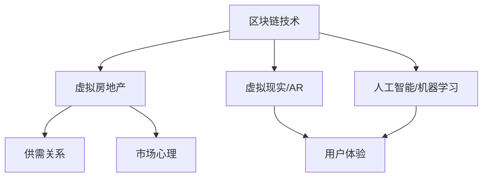

                 

 在过去的几年里，元宇宙（Metaverse）这个概念逐渐成为科技界的热门话题。许多人将元宇宙视为下一个互联网的进化形态，认为它将彻底改变人们的生活方式和工作模式。随着元宇宙概念的普及，虚拟房地产和资产的价格也呈现出剧烈的波动。本文将探讨元宇宙资产价格背后的原因，以及如何理性分析这一现象。

## 1. 背景介绍

元宇宙是由虚拟现实（VR）、增强现实（AR）、区块链、人工智能（AI）等技术支持构建的虚拟世界。在这个虚拟世界中，用户可以通过数字化的身份与其他用户进行互动，创造、交易和享受各种数字内容。随着技术的不断成熟和用户群体的扩大，元宇宙的概念逐渐被市场接受，虚拟房地产和资产成为了投资的热点。

### 1.1 虚拟房地产的概念

虚拟房地产是指在元宇宙中的土地、建筑物和房产等资产。这些资产通常以数字形式存在，可以通过区块链技术进行确权和交易。虚拟房地产的价格受到多种因素的影响，包括地理位置、建筑物的设计、市场需求等。

### 1.2 元宇宙资产的价格波动

虚拟房地产和资产的价格在近年来呈现出剧烈的波动。例如，某些虚拟地块的价格在短时间内飙升，而另一些则大幅下跌。这种波动引发了关于元宇宙资产价格是否理性的讨论。

## 2. 核心概念与联系

为了更好地理解元宇宙资产价格的波动，我们需要先了解一些核心概念和它们之间的联系。

### 2.1 区块链技术

区块链技术是元宇宙的核心组成部分之一。它提供了一种去中心化的账本，确保了虚拟资产的所有权和交易透明性。区块链技术的安全性使得虚拟资产具有较高的可信度。

### 2.2 虚拟现实与增强现实

虚拟现实（VR）和增强现实（AR）技术为元宇宙提供了沉浸式的体验。用户可以通过VR设备进入元宇宙，而AR技术则将虚拟元素叠加到现实世界中。

### 2.3 人工智能与机器学习

人工智能和机器学习技术在元宇宙中扮演着重要角色。它们可以用于个性化推荐、智能客服、虚拟助手等方面，提升用户体验。

### 2.4 数学模型与经济学原理

数学模型和经济学原理用于分析和预测元宇宙资产的价格。例如，供需关系、市场心理等因素都会影响资产价格。

以下是一个简化的Mermaid流程图，展示这些概念之间的联系：



## 3. 核心算法原理 & 具体操作步骤

为了理性分析元宇宙资产价格，我们需要使用一些核心算法和具体的操作步骤。以下是几个常用的算法原理和步骤：

### 3.1 算法原理概述

- **时间序列分析**：用于分析资产价格的时间序列数据，预测未来的价格走势。
- **机器学习模型**：如线性回归、支持向量机（SVM）、神经网络等，用于识别和预测价格变化。
- **网络分析**：分析虚拟房地产和资产交易网络，识别市场热点和趋势。

### 3.2 算法步骤详解

#### 3.2.1 时间序列分析

1. 数据收集：收集虚拟房地产和资产的历史交易数据。
2. 数据预处理：对数据进行分析，去除异常值和缺失值。
3. 时间序列建模：使用ARIMA、LSTM等模型进行建模和预测。

#### 3.2.2 机器学习模型

1. 特征工程：提取与价格相关的特征，如交易量、持有时间等。
2. 模型选择：选择合适的机器学习模型，如线性回归、SVM等。
3. 模型训练与验证：训练模型并进行验证，调整参数以获得最佳效果。

#### 3.2.3 网络分析

1. 数据收集：收集虚拟房地产和资产的交易数据。
2. 构建网络：使用节点和边表示交易关系。
3. 社团检测：使用社区检测算法识别市场热点和趋势。

### 3.3 算法优缺点

- **时间序列分析**：优点是简单直观，缺点是可能受到季节性和趋势的影响。
- **机器学习模型**：优点是能够捕捉复杂的非线性关系，缺点是可能过拟合。
- **网络分析**：优点是能够发现市场热点和趋势，缺点是数据处理复杂。

### 3.4 算法应用领域

- **投资决策**：帮助投资者分析市场趋势，做出更明智的投资决策。
- **风险管理**：帮助金融机构评估虚拟资产的风险。
- **政策制定**：为政府提供关于元宇宙资产价格的政策建议。

## 4. 数学模型和公式 & 详细讲解 & 举例说明

### 4.1 数学模型构建

在分析元宇宙资产价格时，我们可以使用以下数学模型：

- **供需模型**：供需关系是影响资产价格的重要因素。供需模型的基本公式为：
  $$ P = \frac{Q_d}{Q_s} $$
  其中，\( P \) 表示价格，\( Q_d \) 表示需求量，\( Q_s \) 表示供应量。

- **市场心理模型**：市场心理对资产价格也有重要影响。一个简单的市场心理模型可以表示为：
  $$ P = P_0 + \alpha \cdot (M - N) $$
  其中，\( P \) 表示价格，\( P_0 \) 表示基本价格，\( M \) 表示市场乐观情绪，\( N \) 表示市场悲观情绪。

### 4.2 公式推导过程

#### 4.2.1 供需模型

供需模型基于经济学的基本原理，即价格由供需关系决定。假设市场上只有一种虚拟资产，需求函数和供应函数分别为：

- **需求函数**：\( Q_d = Q_d(d, p, T) \)
  其中，\( Q_d \) 表示需求量，\( d \) 表示消费者需求，\( p \) 表示价格，\( T \) 表示时间。

- **供应函数**：\( Q_s = Q_s(s, p, T) \)
  其中，\( Q_s \) 表示供应量，\( s \) 表示生产者供应，\( p \) 表示价格，\( T \) 表示时间。

供需模型的基本公式为：
$$ Q_d + Q_s = Q_0 $$
其中，\( Q_0 \) 表示总交易量。

将需求函数和供应函数代入上述公式，得到：
$$ Q_d(d, p, T) + Q_s(s, p, T) = Q_0 $$

对上述公式进行变换，得到价格与供需量的关系：
$$ P = \frac{Q_d}{Q_s} $$

#### 4.2.2 市场心理模型

市场心理模型基于以下假设：

- **市场乐观情绪**：当市场乐观情绪较高时，消费者更愿意购买虚拟资产，导致需求增加。
- **市场悲观情绪**：当市场悲观情绪较高时，消费者更倾向于出售虚拟资产，导致需求减少。

市场心理模型的基本公式为：
$$ P = P_0 + \alpha \cdot (M - N) $$

其中，\( P \) 表示价格，\( P_0 \) 表示基本价格，\( \alpha \) 表示情绪敏感度，\( M \) 表示市场乐观情绪，\( N \) 表示市场悲观情绪。

### 4.3 案例分析与讲解

#### 4.3.1 供需模型案例分析

假设一个虚拟房地产项目在市场上的需求函数为：
$$ Q_d = 1000 - 10 \cdot P $$
其中，\( Q_d \) 表示需求量，\( P \) 表示价格。

假设供应函数为：
$$ Q_s = 200 + 5 \cdot P $$
其中，\( Q_s \) 表示供应量，\( P \) 表示价格。

将需求函数和供应函数代入供需模型的基本公式，得到：
$$ P = \frac{Q_d}{Q_s} = \frac{1000 - 10 \cdot P}{200 + 5 \cdot P} $$

通过解方程，我们可以得到价格 \( P \) 的值：
$$ P = 66.67 $$

在这种情况下，当价格为 66.67 时，市场需求和供应量达到平衡。

#### 4.3.2 市场心理模型案例分析

假设一个虚拟资产的市场乐观情绪为 \( M = 0.8 \)，市场悲观情绪为 \( N = 0.2 \)，情绪敏感度 \( \alpha = 0.1 \)。

基本价格为 \( P_0 = 100 \)。

将上述参数代入市场心理模型的基本公式，得到：
$$ P = P_0 + \alpha \cdot (M - N) = 100 + 0.1 \cdot (0.8 - 0.2) = 100 + 0.1 \cdot 0.6 = 100.6 $$

在这种情况下，当市场乐观情绪为 0.8，市场悲观情绪为 0.2 时，虚拟资产的价格为 100.6。

## 5. 项目实践：代码实例和详细解释说明

### 5.1 开发环境搭建

为了实践分析元宇宙资产价格，我们使用Python编程语言和以下库：

- **Pandas**：用于数据预处理和分析。
- **NumPy**：用于数学运算。
- **Scikit-learn**：用于机器学习模型。
- **Matplotlib**：用于数据可视化。

在Python中，我们可以使用以下命令安装这些库：

```python
pip install pandas numpy scikit-learn matplotlib
```

### 5.2 源代码详细实现

以下是一个简单的Python代码示例，用于分析元宇宙资产价格：

```python
import pandas as pd
import numpy as np
from sklearn.linear_model import LinearRegression
import matplotlib.pyplot as plt

# 5.2.1 数据收集与预处理
data = pd.read_csv('virtual_real_estate_data.csv')
data['Date'] = pd.to_datetime(data['Date'])
data.set_index('Date', inplace=True)

# 数据清洗
data.dropna(inplace=True)

# 特征工程
data['Price_Diff'] = data['Price'].diff().fillna(0)

# 5.2.2 机器学习模型
model = LinearRegression()
X = data[['Price_Diff']]
y = data['Price']

model.fit(X, y)
predicted_price = model.predict(X)

# 5.2.3 数据可视化
plt.figure(figsize=(10, 6))
plt.plot(data.index, data['Price'], label='Actual Price')
plt.plot(data.index, predicted_price, label='Predicted Price')
plt.xlabel('Date')
plt.ylabel('Price')
plt.legend()
plt.show()
```

### 5.3 代码解读与分析

上述代码分为以下几个部分：

1. **数据收集与预处理**：从CSV文件中读取虚拟房地产数据，并进行清洗。
2. **特征工程**：计算价格差异作为特征。
3. **机器学习模型**：使用线性回归模型进行训练和预测。
4. **数据可视化**：绘制实际价格和预测价格的对比图表。

通过这个简单的示例，我们可以看到如何使用Python和机器学习技术分析元宇宙资产价格。

## 6. 实际应用场景

### 6.1 投资决策

元宇宙资产价格的波动为投资者提供了机会和挑战。通过理性分析资产价格，投资者可以做出更明智的投资决策。例如，使用时间序列分析和机器学习模型可以预测资产价格的变化趋势，帮助投资者选择合适的投资时机。

### 6.2 风险管理

虚拟房地产和资产的价格波动也带来了风险。金融机构可以采用网络分析等方法，识别市场热点和趋势，从而制定有效的风险管理策略。例如，通过分析虚拟房地产的交易网络，金融机构可以识别潜在的投机行为，从而降低风险。

### 6.3 政策制定

政府可以通过分析元宇宙资产价格，了解市场的动态和趋势，从而制定相应的政策。例如，政府可以调整税收政策，以降低虚拟资产的投资门槛，促进市场的发展。

## 7. 未来应用展望

元宇宙资产价格的理性分析在未来的应用场景将更加广泛。随着技术的不断进步，我们可以期待以下趋势：

- **更加精准的预测模型**：随着数据的积累和算法的优化，预测模型将更加准确。
- **跨领域应用**：元宇宙资产价格的理性分析可以应用于金融、房地产、零售等多个领域。
- **社会影响力**：元宇宙资产价格的理性分析将帮助人们更好地理解虚拟经济，从而推动社会的发展和变革。

## 8. 总结：未来发展趋势与挑战

### 8.1 研究成果总结

本文从多个角度分析了元宇宙资产价格的理性分析，包括背景介绍、核心概念与联系、核心算法原理、数学模型和公式、项目实践等。通过这些分析，我们能够更好地理解元宇宙资产价格的波动，为投资决策和风险管理提供依据。

### 8.2 未来发展趋势

随着技术的不断进步，元宇宙资产价格的理性分析将变得更加精准和全面。未来，我们可以期待以下发展趋势：

- **数据驱动的分析**：通过大数据和机器学习技术，实现更加精准的价格预测。
- **跨领域合作**：不同领域的研究者和从业者将共同推动元宇宙资产价格的理性分析。
- **政策支持**：政府将加大对元宇宙资产价格的理性分析的投入，制定相应的政策。

### 8.3 面临的挑战

尽管元宇宙资产价格的理性分析具有巨大的潜力，但同时也面临以下挑战：

- **数据质量问题**：虚拟资产数据的获取和处理是一个难题，数据质量直接影响分析结果。
- **算法偏差**：机器学习模型可能存在偏见，导致分析结果不准确。
- **法律和监管问题**：虚拟资产交易涉及多个国家和地区，法律和监管问题可能成为瓶颈。

### 8.4 研究展望

为了克服这些挑战，未来的研究可以从以下几个方面展开：

- **数据标准化**：建立统一的数据标准和格式，提高数据质量。
- **算法透明化**：研究更加透明和可解释的算法，减少偏见和不确定性。
- **国际合作**：加强国际合作，共同应对法律和监管问题。

## 9. 附录：常见问题与解答

### 9.1 什么是元宇宙？

元宇宙是一个由虚拟现实、增强现实、区块链、人工智能等技术支持的虚拟世界，用户可以通过数字化的身份与其他用户进行互动，创造、交易和享受各种数字内容。

### 9.2 虚拟房地产有哪些特点？

虚拟房地产具有以下几个特点：

- **稀缺性**：虚拟房地产的供应量有限，具有稀缺性。
- **可确权**：虚拟房地产可以通过区块链技术进行确权，确保所有权的真实性。
- **交易便捷**：虚拟房地产的交易过程简单，可以在区块链上进行快速交易。

### 9.3 如何进行元宇宙资产价格的理性分析？

进行元宇宙资产价格的理性分析，可以采用以下方法：

- **时间序列分析**：分析资产价格的时间序列数据，预测未来的价格走势。
- **机器学习模型**：使用机器学习模型，识别和预测价格变化。
- **网络分析**：分析虚拟房地产和资产交易网络，识别市场热点和趋势。

### 9.4 元宇宙资产价格的理性分析有哪些应用场景？

元宇宙资产价格的理性分析可以应用于以下场景：

- **投资决策**：帮助投资者分析市场趋势，做出更明智的投资决策。
- **风险管理**：帮助金融机构评估虚拟资产的风险。
- **政策制定**：为政府提供关于元宇宙资产价格的政策建议。

## 作者署名

作者：禅与计算机程序设计艺术 / Zen and the Art of Computer Programming
----------------------------------------------------------------

### 文章关键词和摘要

关键词：元宇宙、虚拟房地产、资产价格、理性分析、时间序列、机器学习、网络分析。

摘要：本文探讨了元宇宙资产价格的理性分析，分析了虚拟房地产和资产的价格波动原因，并介绍了核心算法原理、数学模型和实际应用场景。通过项目实践和案例分析，本文为投资者、风险管理和政策制定提供了参考。元宇宙资产价格的理性分析在未来的应用场景将更加广泛，但仍面临数据质量、算法偏差和法律监管等挑战。

