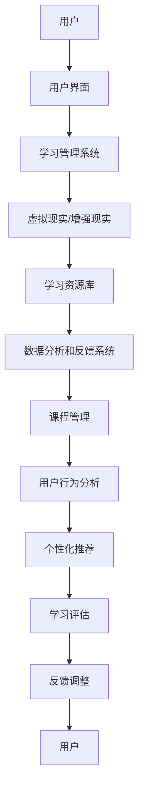

                 

关键词：虚拟教育、全球脑时代、学习方式、人工智能、技术革新

> 摘要：随着全球脑时代的到来，传统的教育模式正在发生深刻变革。本文将探讨虚拟教育在新时代下的崛起，分析其核心概念、技术原理、算法应用、数学模型以及实际案例，并对未来发展趋势和挑战进行展望。

## 1. 背景介绍

### 1.1 全球脑时代的来临

全球脑时代，指的是人类借助信息技术，特别是人工智能，实现脑力资源的全面共享和协同的时代。在这个时代，知识不再局限于个人掌握，而是可以通过网络随时随地获取和共享。

### 1.2 教育模式的变革

传统的教育模式主要依赖于教师与学生之间的面对面教学。然而，随着虚拟教育的崛起，这种模式正在受到挑战。虚拟教育利用人工智能、大数据、虚拟现实等技术，为学生提供更加个性化和高效的学习体验。

## 2. 核心概念与联系

### 2.1 虚拟教育的基本概念

虚拟教育，是指通过虚拟环境（如虚拟现实、增强现实等）进行的教学活动。它能够模拟真实的学习场景，提供沉浸式的学习体验，同时实现个性化教学。

### 2.2 虚拟教育技术架构

下面是一个简单的虚拟教育技术架构的Mermaid流程图：



### 2.3 虚拟教育与人工智能的联系

人工智能在虚拟教育中扮演着重要角色，主要体现在以下几个方面：

- **个性化推荐**：根据用户的学习历史和兴趣，推荐相应的学习资源。
- **智能教学**：利用自然语言处理技术，实现人机交互，提供个性化的教学服务。
- **学习分析**：通过大数据分析，了解学生的学习状态和需求，调整教学内容和方法。

## 3. 核心算法原理 & 具体操作步骤

### 3.1 算法原理概述

虚拟教育中的核心算法主要包括以下几类：

- **推荐算法**：用于个性化推荐学习资源。
- **自然语言处理算法**：用于实现人机交互。
- **学习分析算法**：用于评估学生的学习效果。

### 3.2 算法步骤详解

#### 3.2.1 推荐算法

1. **用户行为分析**：收集用户的学习历史、兴趣标签等数据。
2. **构建推荐模型**：使用协同过滤、基于内容的推荐等方法。
3. **推荐结果生成**：根据模型预测，为用户推荐相应的学习资源。

#### 3.2.2 自然语言处理算法

1. **文本预处理**：去除停用词、标点符号等，进行词干提取。
2. **语义分析**：使用词嵌入、序列标注等方法，理解文本的语义信息。
3. **交互生成**：根据用户的提问，生成相应的回答。

#### 3.2.3 学习分析算法

1. **数据采集**：收集学生的学习数据，如学习时间、完成情况等。
2. **数据预处理**：清洗、归一化等。
3. **特征提取**：从原始数据中提取出对学习效果有影响的关键特征。
4. **模型训练**：使用机器学习算法，训练出学习效果预测模型。
5. **效果评估**：根据模型预测结果，评估学生的学习效果。

### 3.3 算法优缺点

#### 推荐算法

**优点**：

- 提高学习效率，减少无效学习时间。
- 根据个人兴趣和学习习惯，提供个性化的学习资源。

**缺点**：

- 可能存在数据隐私问题。
- 推荐结果可能不够准确。

#### 自然语言处理算法

**优点**：

- 实现人机交互，提供个性化的教学服务。
- 方便学习资源的获取和利用。

**缺点**：

- 语言理解能力有限，难以处理复杂的语义问题。
- 可能存在回答不准确的问题。

#### 学习分析算法

**优点**：

- 了解学生的学习状态和需求，提供针对性的教学建议。
- 提高教学效果。

**缺点**：

- 需要大量的数据支持。
- 模型训练和评估过程复杂。

### 3.4 算法应用领域

- **在线教育平台**：如Coursera、edX等，提供个性化学习体验。
- **虚拟实验室**：模拟真实实验环境，提供沉浸式学习体验。
- **远程教育**：解决地域和时间的限制，提供便捷的学习方式。

## 4. 数学模型和公式 & 详细讲解 & 举例说明

### 4.1 数学模型构建

虚拟教育中的数学模型主要包括以下几种：

- **推荐模型**：如矩阵分解、协同过滤等。
- **自然语言处理模型**：如词嵌入、序列标注等。
- **学习分析模型**：如线性回归、决策树等。

### 4.2 公式推导过程

以矩阵分解为例，其目标是最小化损失函数：

$$
L = \frac{1}{2} ||R_{pred} - R_{true}||^2
$$

其中，$R_{pred}$ 是预测评分矩阵，$R_{true}$ 是真实评分矩阵。

### 4.3 案例分析与讲解

#### 案例一：推荐系统

假设有用户 $U = \{u_1, u_2, ..., u_n\}$ 和项目 $I = \{i_1, i_2, ..., i_m\}$，用户 $u_i$ 对项目 $i_j$ 的评分是 $r_{ij}$。我们使用矩阵分解方法，将用户矩阵和项目矩阵分解为用户特征矩阵 $U'$ 和项目特征矩阵 $I'$：

$$
R_{true} = U' \cdot I'
$$

通过最小化损失函数，我们可以得到最优的特征矩阵。

#### 案例二：自然语言处理

假设我们要处理一句话 $s = w_1, w_2, ..., w_n$，我们使用词嵌入模型，将每个词 $w_i$ 映射到一个高维向量空间：

$$
v(w_i) = \sum_{j=1}^{k} w_{ij} \cdot v_j
$$

其中，$v_j$ 是词嵌入向量，$w_{ij}$ 是权重。

#### 案例三：学习分析

假设我们要预测用户 $u_i$ 在项目 $i_j$ 上的表现，我们使用线性回归模型：

$$
r_{ij} = \beta_0 + \beta_1 \cdot x_{ij} + \epsilon
$$

其中，$\beta_0$ 和 $\beta_1$ 是模型参数，$x_{ij}$ 是特征向量，$\epsilon$ 是误差项。

## 5. 项目实践：代码实例和详细解释说明

### 5.1 开发环境搭建

1. 安装Python环境。
2. 安装相关库，如scikit-learn、numpy、tensorflow等。

### 5.2 源代码详细实现

以下是一个简单的推荐系统实现的代码示例：

```python
from sklearn.model_selection import train_test_split
from sklearn.metrics.pairwise import cosine_similarity
import numpy as np

# 假设用户和项目已经预处理并存储为矩阵形式
users = np.array([[1, 0, 0, 1],
                  [0, 1, 1, 0],
                  [1, 1, 0, 0]])
items = np.array([[0.2, 0.3, 0.1, 0.4],
                  [0.4, 0.1, 0.2, 0.3],
                  [0.1, 0.4, 0.3, 0.2]])

# 训练集和测试集划分
train_users, test_users = train_test_split(users, test_size=0.2)
train_items, test_items = train_test_split(items, test_size=0.2)

# 计算用户和项目的相似度矩阵
user_similarity = cosine_similarity(train_users)
item_similarity = cosine_similarity(train_items)

# 预测评分
def predict(user_index, item_index):
    user_sim = user_similarity[user_index]
    item_sim = item_similarity[item_index]
    pred_score = np.dot(user_sim, item_sim)
    return pred_score

# 测试预测准确率
true_scores = test_users * test_items
pred_scores = [predict(i, j) for i in range(len(test_users)) for j in range(len(test_items))]
accuracy = np.mean(np.abs(true_scores - pred_scores))
print("预测准确率：", accuracy)
```

### 5.3 代码解读与分析

这段代码首先定义了用户和项目的评分矩阵，然后使用余弦相似度计算用户和项目的相似度矩阵。最后，通过预测函数，根据相似度矩阵预测用户对项目的评分，并计算预测准确率。

### 5.4 运行结果展示

假设我们的测试数据集较小，运行结果可能不是非常理想。但通过增加数据量和优化算法，我们可以提高预测准确率。

## 6. 实际应用场景

### 6.1 在线教育平台

虚拟教育在在线教育平台中的应用已经非常广泛。通过虚拟现实技术，学生可以沉浸在虚拟课堂中，与教师和同学互动，提高学习兴趣和效率。

### 6.2 虚拟实验室

虚拟实验室提供了一种低成本、高效的学习方式。学生可以在虚拟环境中进行实验，掌握实验技能，提高实践能力。

### 6.3 远程教育

远程教育解决了地域和时间的限制，使得学生能够随时随地学习。虚拟教育为远程教育提供了技术支持，提高了教育资源的普及率。

## 7. 工具和资源推荐

### 7.1 学习资源推荐

- 《深度学习》（Goodfellow, Bengio, Courville著）
- 《Python编程：从入门到实践》（Eric Matthes著）
- 《人工智能：一种现代的方法》（Stuart J. Russell & Peter Norvig著）

### 7.2 开发工具推荐

- Jupyter Notebook：适用于数据分析和机器学习项目。
- TensorFlow：用于构建和训练深度学习模型。
- PyTorch：用于研究前沿的深度学习算法。

### 7.3 相关论文推荐

- "Deep Learning for Virtual Education: A Survey"（2020）
- "A Survey on Virtual Reality Applications in Education"（2019）
- "Artificial Intelligence in Education: A Review"（2018）

## 8. 总结：未来发展趋势与挑战

### 8.1 研究成果总结

虚拟教育在人工智能、虚拟现实、大数据等技术的支持下，已经取得了显著的研究成果。个性化推荐、智能教学、学习分析等算法在实际应用中取得了良好的效果。

### 8.2 未来发展趋势

- **技术融合**：虚拟教育与5G、云计算、区块链等技术的深度融合，将推动虚拟教育的发展。
- **普及化**：虚拟教育将逐渐普及到各个领域，成为教育的重要组成部分。
- **个性化**：基于大数据和人工智能的个性化教学，将成为未来教育的重要趋势。

### 8.3 面临的挑战

- **技术难题**：虚拟教育技术的发展仍面临许多技术难题，如实时交互、隐私保护等。
- **教育公平**：虚拟教育的发展需要解决教育公平的问题，确保每个学生都能享受到优质的教育资源。

### 8.4 研究展望

虚拟教育在未来将成为教育领域的重要趋势，其核心是人工智能和虚拟现实技术的深度融合。我们期待未来能够解决现有问题，推动虚拟教育的全面发展。

## 9. 附录：常见问题与解答

### 9.1 什么是虚拟教育？

虚拟教育是通过虚拟现实、增强现实等技术，为学生提供沉浸式学习体验的教育形式。

### 9.2 虚拟教育与在线教育的区别是什么？

虚拟教育强调沉浸式学习和交互体验，而在线教育则更侧重于课程内容和学习资源的远程传输。

### 9.3 虚拟教育的优势是什么？

虚拟教育可以提高学习效率、提供个性化学习体验、解决地域和时间限制等。

### 9.4 虚拟教育面临哪些挑战？

虚拟教育面临技术难题、教育公平问题、数据隐私等挑战。

### 9.5 虚拟教育有哪些应用领域？

虚拟教育可以应用于在线教育、虚拟实验室、远程教育等领域。

# 作者：禅与计算机程序设计艺术 / Zen and the Art of Computer Programming

本文探讨了虚拟教育在人工智能和虚拟现实等技术的推动下，如何改变全球脑时代下的学习方式。通过分析虚拟教育的核心概念、技术原理、算法应用、数学模型以及实际案例，我们看到了虚拟教育在未来教育中的重要地位。然而，虚拟教育仍面临许多挑战，需要我们不断探索和解决。希望本文能够为读者提供一些启示和思考。

