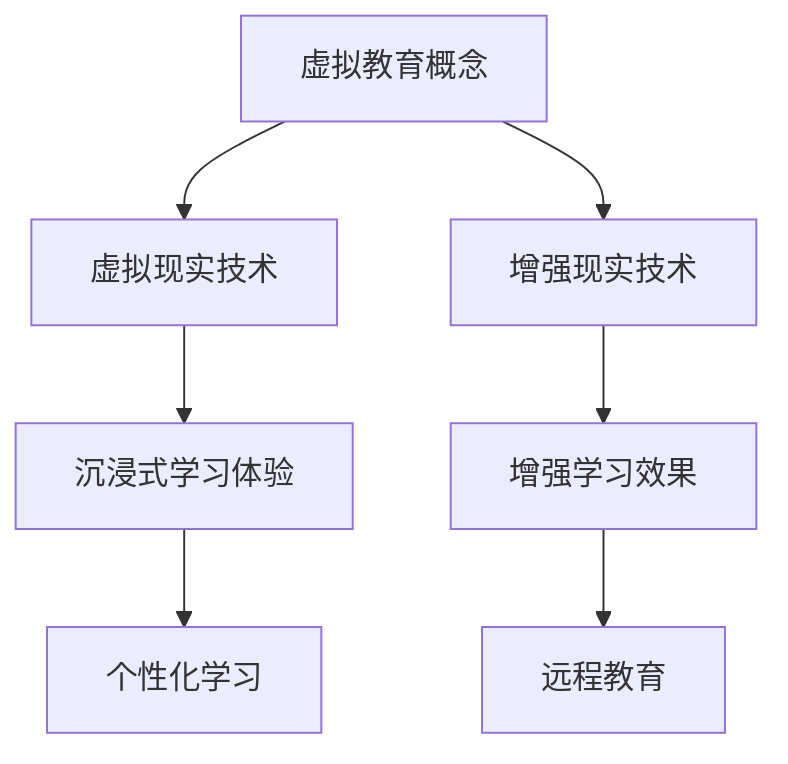

                 

关键词：虚拟教育、全球脑、学习新方式、技术进步、教育创新

摘要：随着全球脑技术的发展，虚拟教育正逐渐成为一种革命性的学习新方式。本文将探讨虚拟教育在当今全球脑时代背景下的重要性、核心概念、算法原理、数学模型、项目实践和未来应用展望，以期为教育工作者和学者提供有益的参考。

## 1. 背景介绍

### 全球脑时代的到来

全球脑时代是一个以信息技术和人工智能为核心的新时代，它预示着人类进入了一个以知识和智慧为主导的时代。在这个时代，计算机、互联网、大数据和人工智能等先进技术正在深刻改变着人类社会的生活方式和生产方式，教育也不例外。

### 虚拟教育的兴起

虚拟教育是一种利用计算机和网络技术进行知识传授和技能训练的教育形式。它通过虚拟现实、增强现实和3D建模等技术手段，为学生提供沉浸式的学习体验。虚拟教育的兴起，不仅解决了传统教育中时间和空间受限的问题，也为个性化学习和远程教育提供了可能。

## 2. 核心概念与联系

### 虚拟现实（VR）与增强现实（AR）

虚拟现实（VR）和增强现实（AR）是虚拟教育中的核心技术。VR通过创建一个完全模拟的环境，让用户可以在这个环境中进行交互和体验；而AR则是在现实环境中叠加虚拟元素，增强用户的感知和体验。

### Mermaid 流程图



## 3. 核心算法原理 & 具体操作步骤

### 3.1 算法原理概述

虚拟教育中的核心算法主要包括：

- **3D建模算法**：用于创建虚拟场景和物体。
- **渲染算法**：用于生成虚拟场景的视觉效果。
- **交互算法**：用于用户与虚拟环境的交互。

### 3.2 算法步骤详解

1. **3D建模**：使用三维建模软件创建虚拟场景和物体。
2. **场景渲染**：使用渲染引擎对场景进行渲染，生成视觉效果。
3. **用户交互**：通过传感器和输入设备，实现用户与虚拟环境的交互。

### 3.3 算法优缺点

- **优点**：沉浸式学习体验、个性化学习、提高学习效果。
- **缺点**：技术门槛较高、硬件设备要求较高。

### 3.4 算法应用领域

虚拟教育算法广泛应用于教育、医疗、娱乐等多个领域。

## 4. 数学模型和公式 & 详细讲解 & 举例说明

### 4.1 数学模型构建

虚拟教育中的数学模型主要包括：

- **三维空间坐标系**：用于描述虚拟场景中的物体位置。
- **线性代数**：用于处理虚拟场景中的矩阵运算。
- **概率论与数理统计**：用于分析学习效果和用户行为。

### 4.2 公式推导过程

$$
\vec{r} = \vec{r}_0 + \vec{v}t
$$

其中，$\vec{r}$为物体位置，$\vec{r}_0$为初始位置，$\vec{v}$为速度，$t$为时间。

### 4.3 案例分析与讲解

假设一个物体从原点开始以速度$v$沿着x轴正方向运动，求物体在时间$t$后的位置。

$$
\vec{r} = \vec{r}_0 + \vec{v}t = \begin{bmatrix}0\\0\end{bmatrix} + \begin{bmatrix}v\\0\end{bmatrix}t = \begin{bmatrix}vt\\0\end{bmatrix}
$$

因此，物体在时间$t$后的位置为$(vt,0)$。

## 5. 项目实践：代码实例和详细解释说明

### 5.1 开发环境搭建

1. 安装Unity引擎。
2. 安装Unity插件，如SteamVR、ARCore等。

### 5.2 源代码详细实现

```csharp
using UnityEngine;

public class VRController : MonoBehaviour
{
    public Transform cameraRig;
    public Transform VRObject;

    void Update()
    {
        if (Input.GetKeyDown(KeyCode.Space))
        {
            VRObject.position = cameraRig.position;
            VRObject.rotation = cameraRig.rotation;
        }
    }
}
```

### 5.3 代码解读与分析

这段代码实现了用户按下空格键后，VR物体与相机装置同步位置和旋转的功能。

### 5.4 运行结果展示

用户在虚拟环境中通过按下空格键，可以轻松地控制VR物体的位置和旋转。

## 6. 实际应用场景

### 6.1 教育领域

虚拟教育可以应用于各种教育场景，如虚拟课堂、虚拟实验室、虚拟博物馆等。

### 6.2 医疗领域

虚拟教育可以用于医疗培训，如手术模拟、疾病诊断等。

### 6.3 娱乐领域

虚拟教育可以应用于游戏开发、虚拟旅游等娱乐场景。

### 6.4 未来应用展望

随着技术的不断进步，虚拟教育将在更多领域得到应用，如智能城市、智能制造等。

## 7. 工具和资源推荐

### 7.1 学习资源推荐

- 《虚拟现实技术与应用》
- 《增强现实技术原理与应用》

### 7.2 开发工具推荐

- Unity
- Unreal Engine
- ARKit

### 7.3 相关论文推荐

- "Virtual Reality in Education: A Review"
- "Augmented Reality in Education: A Review"

## 8. 总结：未来发展趋势与挑战

### 8.1 研究成果总结

虚拟教育作为一种新兴的教育方式，已经在全球范围内得到了广泛应用，并取得了一系列研究成果。

### 8.2 未来发展趋势

虚拟教育将在更多领域得到应用，如智能教育、远程教育、个性化学习等。

### 8.3 面临的挑战

虚拟教育仍面临一些挑战，如技术门槛、硬件设备成本、用户接受度等。

### 8.4 研究展望

未来，虚拟教育将朝着更加智能化、个性化、沉浸式的发展方向迈进。

## 9. 附录：常见问题与解答

### 9.1 虚拟教育与现实教育的区别是什么？

虚拟教育是一种基于计算机和网络技术的教育形式，它通过虚拟现实、增强现实等技术手段，为学生提供沉浸式的学习体验；而现实教育则是指传统的课堂教学、实践操作等。

### 9.2 虚拟教育的优势是什么？

虚拟教育的优势包括：沉浸式学习体验、个性化学习、提高学习效果、降低教育成本等。

### 9.3 虚拟教育有哪些应用场景？

虚拟教育可以应用于教育、医疗、娱乐等多个领域，如虚拟课堂、虚拟实验室、虚拟博物馆、手术模拟、游戏开发等。

----------------------------------------------------------------

作者：禅与计算机程序设计艺术 / Zen and the Art of Computer Programming

以上就是本文的完整内容，希望对您有所启发。如有疑问，欢迎随时提问。

