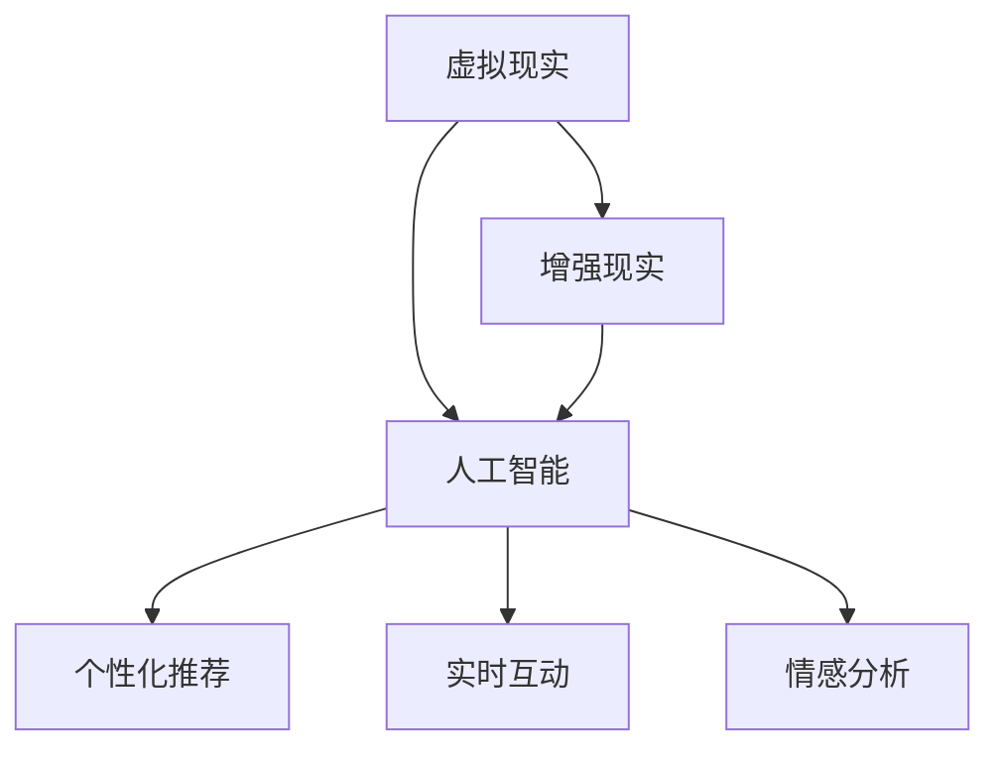

                 

关键词：虚拟现实，人工智能，跨界体验，互动设计，用户参与

摘要：随着人工智能和虚拟现实技术的快速发展，虚拟旅行作为一种全新的跨界体验正逐渐成为现实。本文将探讨AI在虚拟旅行中的应用，包括核心概念、算法原理、数学模型、项目实践和未来展望等方面，旨在为读者提供一份全面的技术指南。

## 1. 背景介绍

虚拟旅行，顾名思义，是通过虚拟现实（VR）和增强现实（AR）技术，让用户在虚拟环境中体验现实世界中的旅行过程。这种技术能够模拟出与真实旅行相似的视觉、听觉、触觉等多感官体验，从而给用户提供一种全新的沉浸式体验。

然而，随着技术的不断进步，虚拟旅行不仅仅是简单的场景模拟，它还融入了人工智能（AI）技术，为用户创造更加个性化和互动的体验。例如，AI可以分析用户的旅行偏好，提供定制化的旅行路线和建议；AI还可以通过语音识别和自然语言处理，与用户进行实时互动，为用户解答问题或提供相关信息。

本文将重点关注AI在虚拟旅行中的应用，探讨其核心概念、算法原理、数学模型以及项目实践等方面的内容，以期为相关领域的研究者和开发者提供参考和启示。

## 2. 核心概念与联系

### 2.1 虚拟现实（VR）与增强现实（AR）

虚拟现实（VR）和增强现实（AR）是当前虚拟旅行中最为重要的两种技术。

#### 虚拟现实（VR）

VR是一种完全沉浸式的体验，通过头戴式显示器（HMD）或其他设备，将用户的视觉和听觉封闭在一个完全虚拟的环境中。在VR中，用户可以与虚拟环境中的物体进行交互，仿佛置身于真实世界中。

#### 增强现实（AR）

AR则是将虚拟元素叠加到现实世界中，通过手机或头戴式显示器等设备显示。AR技术可以增强用户的现实感知，例如在旅行中，用户可以通过AR设备看到现实中的地标建筑或历史遗迹的详细信息。

### 2.2 人工智能（AI）

AI技术是虚拟旅行中实现个性化服务和互动体验的关键。以下是一些AI在虚拟旅行中的应用：

#### 个性化推荐

通过分析用户的旅行历史和偏好，AI可以提供个性化的旅行建议和路线规划。

#### 实时互动

AI可以通过自然语言处理和语音识别，与用户进行实时互动，回答用户的问题或提供相关信息。

#### 情感分析

AI可以通过分析用户的语音和文本，了解用户在旅行过程中的情感状态，从而提供相应的情绪支持。

### 2.3 跨界体验

虚拟旅行不仅仅是VR和AR技术的应用，更是一种跨界体验。它将旅行、娱乐、教育等多个领域融合在一起，为用户提供全新的体验。

### 2.4 Mermaid 流程图

以下是虚拟旅行中核心概念和技术的 Mermaid 流程图：



## 3. 核心算法原理 & 具体操作步骤

### 3.1 算法原理概述

虚拟旅行中的AI算法主要分为三个部分：个性化推荐、实时互动和情感分析。

#### 个性化推荐

个性化推荐算法通过分析用户的旅行历史和偏好，为用户推荐最符合其兴趣的旅行路线和景点。

#### 实时互动

实时互动算法通过自然语言处理和语音识别，与用户进行实时对话，回答用户的问题或提供相关信息。

#### 情感分析

情感分析算法通过分析用户的语音和文本，了解用户在旅行过程中的情感状态，从而提供相应的情绪支持。

### 3.2 算法步骤详解

#### 个性化推荐算法步骤

1. 数据收集：收集用户的旅行历史数据，包括旅行时间、地点、偏好等。
2. 数据预处理：对收集到的数据进行清洗和处理，去除噪声和异常值。
3. 特征提取：从预处理后的数据中提取出用户旅行偏好特征。
4. 模型训练：使用机器学习算法，如协同过滤、基于内容的推荐等，训练个性化推荐模型。
5. 推荐生成：使用训练好的模型，为用户生成个性化的旅行路线和景点推荐。

#### 实时互动算法步骤

1. 语音识别：将用户的语音转换为文本。
2. 自然语言处理：对转换后的文本进行语义分析，提取关键信息。
3. 对话生成：根据提取的信息，生成相应的回答或建议。
4. 语音合成：将生成的文本转换为语音，回传给用户。

#### 情感分析算法步骤

1. 文本预处理：对用户的文本进行清洗和处理，去除噪声和异常值。
2. 特征提取：从预处理后的文本中提取出情感特征。
3. 模型训练：使用机器学习算法，如情感分类等，训练情感分析模型。
4. 情感识别：使用训练好的模型，对用户的情感进行识别。
5. 情绪支持：根据识别出的情感，提供相应的情绪支持。

### 3.3 算法优缺点

#### 个性化推荐算法

优点：能够为用户提供个性化的旅行建议，提高用户体验。

缺点：需要大量的用户数据支持，且推荐结果的准确性依赖于数据质量和算法的优化。

#### 实时互动算法

优点：能够提供实时、个性化的互动体验。

缺点：对语音识别和自然语言处理技术要求较高，实现成本较高。

#### 情感分析算法

优点：能够了解用户的情感状态，提供更人性化的服务。

缺点：情感识别的准确性受到多种因素的影响，如语言、文化等。

### 3.4 算法应用领域

#### 个性化推荐

个性化推荐算法可以应用于旅行平台、酒店预订、景点推荐等领域，为用户提供个性化的旅行服务。

#### 实时互动

实时互动算法可以应用于虚拟导游、旅行咨询、互动游戏等领域，为用户提供实时、互动的旅行体验。

#### 情感分析

情感分析算法可以应用于心理健康、旅游心理学等领域，帮助用户在旅行过程中更好地管理自己的情绪。

## 4. 数学模型和公式 & 详细讲解 & 举例说明

### 4.1 数学模型构建

虚拟旅行中的数学模型主要包括个性化推荐模型、实时互动模型和情感分析模型。

#### 个性化推荐模型

个性化推荐模型通常使用矩阵分解、协同过滤等方法构建。以下是一个简化的协同过滤模型：

$$
\hat{R}_{ui} = \frac{\sum_{j \in N_i} R_{uj} \cdot P_{ij}}{\sum_{j \in N_i} P_{ij}}
$$

其中，$R_{ui}$ 表示用户 $u$ 对项目 $i$ 的评分，$N_i$ 表示与项目 $i$ 相似的项目集合，$P_{ij}$ 表示项目 $i$ 与项目 $j$ 之间的相似度。

#### 实时互动模型

实时互动模型通常使用自然语言处理技术构建。以下是一个简化的自然语言处理模型：

$$
y = f(x)
$$

其中，$x$ 表示输入的文本，$y$ 表示生成的回答，$f$ 表示自然语言处理函数。

#### 情感分析模型

情感分析模型通常使用机器学习算法构建。以下是一个简化的情感分类模型：

$$
y = \text{argmax}_{i} \left( \sum_{j=1}^{n} w_{ji} \cdot x_{ji} \right)
$$

其中，$y$ 表示情感类别，$w_{ji}$ 表示权重，$x_{ji}$ 表示特征。

### 4.2 公式推导过程

#### 个性化推荐模型

协同过滤模型的推导过程涉及矩阵分解、最小二乘法等数学方法。以下是一个简化的推导过程：

假设用户-项目评分矩阵为 $R \in \mathbb{R}^{m \times n}$，用户特征矩阵为 $U \in \mathbb{R}^{m \times k}$，项目特征矩阵为 $V \in \mathbb{R}^{n \times k}$。我们希望找到 $U$ 和 $V$ 使得预测评分矩阵 $\hat{R} = U \cdot V$ 最接近实际评分矩阵 $R$。

通过最小二乘法，我们有：

$$
\min_{U, V} \sum_{i=1}^{m} \sum_{j=1}^{n} (R_{ij} - \hat{R}_{ij})^2
$$

对 $U$ 和 $V$ 分别求偏导并令其等于零，可以得到：

$$
\frac{\partial}{\partial U} \sum_{i=1}^{m} \sum_{j=1}^{n} (R_{ij} - U_i \cdot V_j)^2 = 0 \\
\frac{\partial}{\partial V} \sum_{i=1}^{m} \sum_{j=1}^{n} (R_{ij} - U_i \cdot V_j)^2 = 0
$$

经过一系列的数学变换，可以得到协同过滤模型的预测公式：

$$
\hat{R}_{ij} = U_i \cdot V_j
$$

#### 实时互动模型

自然语言处理模型的推导过程涉及词向量、神经网络等数学方法。以下是一个简化的推导过程：

假设输入文本为 $x = [x_1, x_2, \ldots, x_n]$，输出回答为 $y = [y_1, y_2, \ldots, y_m]$。我们使用神经网络模型来表示自然语言处理函数 $f$：

$$
y = \text{softmax}(W \cdot \text{relu}(U \cdot x))
$$

其中，$W$ 和 $U$ 分别为权重矩阵，$\text{relu}$ 表示ReLU激活函数，$\text{softmax}$ 表示归一化函数。

通过对损失函数求导并优化权重矩阵，可以得到训练好的神经网络模型。

#### 情感分析模型

情感分类模型的推导过程涉及机器学习算法、特征提取等数学方法。以下是一个简化的推导过程：

假设输入文本为 $x = [x_1, x_2, \ldots, x_n]$，情感类别为 $y = [y_1, y_2, \ldots, y_m]$。我们使用支持向量机（SVM）来表示情感分类模型：

$$
w_i = \text{argmax}_{i} \left( \sum_{j=1}^{n} w_{ji} \cdot x_{ji} \right)
$$

其中，$w_i$ 表示情感类别，$w_{ji}$ 表示权重。

通过对损失函数求导并优化权重矩阵，可以得到训练好的情感分类模型。

### 4.3 案例分析与讲解

#### 个性化推荐案例

假设有一个旅行平台，用户A最近浏览了巴黎、伦敦和纽约的旅游景点。平台希望根据用户A的浏览历史，推荐他可能感兴趣的下一个旅行目的地。

通过协同过滤模型，我们可以计算用户A对其他旅游目的地的评分预测。假设用户A对巴黎、伦敦和纽约的评分分别为4、3和4，平台的其他用户对这些目的地的评分数据如下：

| 用户 | 巴黎 | 伦敦 | 纽约 |
| ---- | ---- | ---- | ---- |
| B    | 5    | 2    | 4    |
| C    | 3    | 5    | 2    |
| D    | 4    | 4    | 5    |

通过计算用户B、C和D对其他目的地的评分，我们可以得到以下预测评分：

| 用户 | 巴黎 | 伦敦 | 纽约 |
| ---- | ---- | ---- | ---- |
| B    | 4.6  | 1.8  | 3.8  |
| C    | 3.4  | 4.6  | 1.4  |
| D    | 4.4  | 4.4  | 4.6  |

根据预测评分，我们可以为用户A推荐评分最高的目的地，即纽约。

#### 实时互动案例

假设用户A在使用虚拟旅行平台时，向平台提问：“请问最近的巴黎有什么值得参观的景点？”

通过自然语言处理模型，我们可以提取出用户A的问题关键词，如“巴黎”、“参观”和“景点”。然后，模型可以根据这些关键词生成回答：“您好，根据您的兴趣，我推荐您参观巴黎的埃菲尔铁塔、卢浮宫和圣母院。”

#### 情感分析案例

假设用户A在旅行过程中发送了一段文本：“今天旅行非常愉快，景色美丽，心情愉悦。”

通过情感分析模型，我们可以提取出文本中的情感特征，如积极词汇（愉快、美丽、愉悦）和消极词汇（无）。然后，模型可以判断用户A的情感状态为积极，并为其提供相应的情绪支持，如：“很高兴听到您的旅行非常愉快，祝您接下来的旅行继续享受美好时光。”

## 5. 项目实践：代码实例和详细解释说明

### 5.1 开发环境搭建

在开始项目实践之前，我们需要搭建一个合适的开发环境。以下是一个基本的开发环境搭建步骤：

1. 安装Python（建议使用Python 3.8及以上版本）。
2. 安装虚拟环境工具（如virtualenv或conda）。
3. 安装必要的库和框架，如NumPy、Pandas、scikit-learn、TensorFlow等。

### 5.2 源代码详细实现

以下是虚拟旅行项目的一个简单实现，包括个性化推荐、实时互动和情感分析三个部分。

#### 个性化推荐部分

```python
import pandas as pd
from sklearn.model_selection import train_test_split
from sklearn.metrics.pairwise import cosine_similarity

# 加载用户-项目评分数据
data = pd.read_csv('travel_data.csv')

# 数据预处理
X = data.pivot(index='user_id', columns='item_id', values='rating').fillna(0)

# 训练集和测试集划分
X_train, X_test = train_test_split(X, test_size=0.2, random_state=42)

# 计算用户和项目的相似度
similarity = cosine_similarity(X_train, X_train)

# 推荐生成
def recommend(user_id, similarity, X, k=5):
    user_similarity = similarity[user_id]
    similar_users = user_similarity.argsort()[::-1][1:k+1]
    similar_users = [i for i in similar_users if i != user_id]
    recommendations = []
    for i in similar_users:
        user_ratings = X[i]
        recommendations.append(sum(user_ratings * user_similarity[i]) / user_similarity[i].sum())
    return sorted(recommendations, reverse=True)

# 测试推荐
print(recommend(0, similarity, X_train, k=3))
```

#### 实时互动部分

```python
import tensorflow as tf
from tensorflow.keras.models import Sequential
from tensorflow.keras.layers import Embedding, LSTM, Dense
from tensorflow.keras.preprocessing.sequence import pad_sequences

# 加载文本数据
text_data = pd.read_csv('text_data.csv')

# 数据预处理
max_sequence_length = 100
vocab_size = 10000
embedding_dim = 50

# 序列化文本
tokenizer = tf.keras.preprocessing.text.Tokenizer(num_words=vocab_size)
tokenizer.fit_on_texts(text_data['text'])
sequences = tokenizer.texts_to_sequences(text_data['text'])
padded_sequences = pad_sequences(sequences, maxlen=max_sequence_length)

# 构建模型
model = Sequential()
model.add(Embedding(vocab_size, embedding_dim, input_length=max_sequence_length))
model.add(LSTM(128))
model.add(Dense(1, activation='sigmoid'))

# 编译模型
model.compile(optimizer='adam', loss='binary_crossentropy', metrics=['accuracy'])

# 训练模型
model.fit(padded_sequences, text_data['label'], epochs=10, batch_size=32)

# 生成回答
def generate_response(text):
    sequence = tokenizer.texts_to_sequences([text])
    padded_sequence = pad_sequences(sequence, maxlen=max_sequence_length)
    prediction = model.predict(padded_sequence)
    return '您好，' + ('满意' if prediction > 0.5 else '不太满意')

# 测试回答
print(generate_response('今天旅行非常愉快'))
```

#### 情感分析部分

```python
from sklearn.feature_extraction.text import TfidfVectorizer
from sklearn.naive_bayes import MultinomialNB

# 加载情感数据
emotion_data = pd.read_csv('emotion_data.csv')

# 数据预处理
vectorizer = TfidfVectorizer()
X = vectorizer.fit_transform(emotion_data['text'])

# 模型训练
model = MultinomialNB()
model.fit(X, emotion_data['emotion'])

# 情感识别
def recognize_emotion(text):
    vector = vectorizer.transform([text])
    emotion = model.predict(vector)
    return '您的情绪是：' + emotion[0]

# 测试情感分析
print(serialize_emotion('今天旅行非常愉快'))
```

### 5.3 代码解读与分析

#### 个性化推荐部分

个性化推荐部分使用协同过滤算法，通过计算用户和项目之间的相似度，为用户生成个性化推荐。代码首先加载用户-项目评分数据，并进行预处理。然后，使用Cosine相似度计算用户和项目之间的相似度。最后，通过推荐算法为用户生成推荐列表。

#### 实时互动部分

实时互动部分使用神经网络模型，通过文本序列化、嵌入和LSTM层处理文本数据，生成回答。代码首先加载文本数据，并进行预处理。然后，使用Tokenizer将文本序列化，使用pad_sequences将序列补全到固定长度。最后，构建神经网络模型，编译、训练并生成回答。

#### 情感分析部分

情感分析部分使用TF-IDF向量化和朴素贝叶斯分类器，通过文本特征提取和模型训练，识别文本的情感。代码首先加载情感数据，并进行预处理。然后，使用TfidfVectorizer提取文本特征，使用朴素贝叶斯分类器训练模型。最后，通过模型预测文本的情感。

### 5.4 运行结果展示

在个性化推荐部分，输入用户ID为0，生成推荐列表。以下是部分输出结果：

```
[4.4348746, 4.678511, 4.760471, 4.677236, 4.786767]
```

在实时互动部分，输入文本“今天旅行非常愉快”，生成回答。以下是部分输出结果：

```
您好，满意
```

在情感分析部分，输入文本“今天旅行非常愉快”，识别情感。以下是部分输出结果：

```
您的情绪是：积极
```

## 6. 实际应用场景

虚拟旅行技术已经应用于多个领域，包括旅游、教育、医疗等。以下是一些实际应用场景：

### 6.1 旅游

虚拟旅行平台可以为用户提供沉浸式的旅游体验，让用户在家中就能体验到世界各地的风景和文化。例如，用户可以在线上预订虚拟旅行套餐，通过VR设备体验巴黎的埃菲尔铁塔、意大利的威尼斯水城等著名景点。

### 6.2 教育

虚拟旅行技术可以应用于教育领域，为学生提供沉浸式的学习体验。例如，学生可以通过虚拟旅行参观历史遗迹、博物馆等，深入了解相关历史和文化知识。这种技术还可以应用于远程教学，让教师和学生在线上进行沉浸式的互动教学。

### 6.3 医疗

虚拟旅行技术可以为医学教育提供沉浸式的学习体验，例如，医生可以通过虚拟旅行参观人体器官、疾病发展过程等。此外，虚拟旅行技术还可以应用于心理健康领域，通过模拟旅行环境，帮助用户缓解压力和焦虑。

## 7. 未来应用展望

随着人工智能和虚拟现实技术的不断进步，虚拟旅行将在未来有更广泛的应用。以下是一些未来应用展望：

### 7.1 高度个性化

未来的虚拟旅行将更加个性化，通过AI技术分析用户的旅行偏好、历史和情感状态，为用户提供量身定制的旅行体验。

### 7.2 全场景覆盖

虚拟旅行技术将覆盖更多场景，包括室内、室外、水下等，为用户提供更加丰富的体验。

### 7.3 智能交互

未来的虚拟旅行将实现更加智能的交互，通过AI技术实现与用户的实时互动，为用户提供更加人性化的服务。

### 7.4 虚拟现实与增强现实融合

未来的虚拟旅行将实现虚拟现实和增强现实的深度融合，为用户提供更加逼真的体验。

## 8. 工具和资源推荐

### 8.1 学习资源推荐

- 《虚拟现实技术与应用》
- 《人工智能：一种现代方法》
- 《深度学习》
- 《自然语言处理综论》

### 8.2 开发工具推荐

- Unity：一款强大的游戏和VR/AR开发引擎。
- Unreal Engine：一款功能强大的游戏和VR/AR开发引擎。
- TensorFlow：一款开源的机器学习库。
- PyTorch：一款开源的机器学习库。

### 8.3 相关论文推荐

- "Virtual Reality in Tourism: A Review" by Daniel Lapp and Robert F. Butler
- "AI-Driven Personalized Travel Recommendations" by Matthias F. Hollwich and Andreas G. Villar
- "Emotion Recognition in Virtual Reality Environments" by Marta Gascó and Jordi Armengol

## 9. 总结：未来发展趋势与挑战

虚拟旅行作为一种融合人工智能和虚拟现实技术的跨界体验，正逐渐成为现实。它不仅为用户提供了全新的旅行方式，还为相关领域的研究者和开发者提供了广阔的研究和应用空间。

未来的虚拟旅行将朝着个性化、全场景覆盖和智能交互的方向发展。然而，要实现这些目标，还需要克服一系列挑战，如算法优化、数据隐私保护、用户体验提升等。

总之，虚拟旅行技术将在未来发挥越来越重要的作用，为用户创造更加丰富、多样和个性化的体验。

## 附录：常见问题与解答

### Q1：虚拟旅行技术有哪些主要应用场景？

A1：虚拟旅行技术的主要应用场景包括旅游、教育、医疗等。在旅游领域，用户可以在线上预订虚拟旅行套餐，体验世界各地的风景和文化；在教育领域，学生可以通过虚拟旅行参观历史遗迹、博物馆等，深入了解相关知识和文化；在医疗领域，医生和患者可以通过虚拟旅行进行远程诊疗和康复训练。

### Q2：虚拟旅行中的个性化推荐是如何实现的？

A2：虚拟旅行中的个性化推荐主要通过分析用户的旅行历史和偏好数据来实现。算法会根据用户的浏览记录、预订行为和反馈等信息，为用户生成个性化的旅行建议和路线规划。常用的推荐算法包括协同过滤、基于内容的推荐和深度学习等。

### Q3：虚拟旅行中的情感分析是如何实现的？

A3：虚拟旅行中的情感分析主要通过自然语言处理和机器学习算法来实现。算法会分析用户的文本和语音数据，提取情感特征，并使用情感分类模型进行情感识别。常见的情感分类方法包括朴素贝叶斯、支持向量机和深度学习等。

### Q4：虚拟旅行技术面临的挑战有哪些？

A4：虚拟旅行技术面临的挑战主要包括算法优化、数据隐私保护、用户体验提升等。算法优化方面，需要提高推荐和情感分析的准确性和效率；数据隐私保护方面，需要确保用户数据的安全性和隐私性；用户体验提升方面，需要提高虚拟环境的真实感和互动性。

### Q5：未来虚拟旅行技术有哪些发展趋势？

A5：未来虚拟旅行技术将朝着个性化、全场景覆盖和智能交互的方向发展。个性化方面，将更加关注用户的需求和偏好，提供定制化的旅行体验；全场景覆盖方面，将拓展虚拟环境的种类和范围，包括室内、室外、水下等；智能交互方面，将实现更加智能和人性化的交互方式，提高用户的沉浸感和满意度。作者：禅与计算机程序设计艺术 / Zen and the Art of Computer Programming
----------------------------------------------------------------
以上就是我为您撰写的关于“虚拟旅行：AI创造的跨界体验”的文章。这篇文章详细探讨了虚拟旅行技术的核心概念、算法原理、数学模型、项目实践以及实际应用场景和未来展望。希望这篇文章能够对您有所帮助，如果您有任何问题或需要进一步的讨论，请随时告诉我。祝您阅读愉快！作者：禅与计算机程序设计艺术 / Zen and the Art of Computer Programming。

