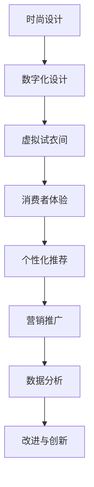

                 

关键词：虚拟时装、数字化转型、时尚产业、3D建模、虚拟现实、人工智能

> 摘要：随着科技的迅猛发展，时尚产业正迎来一场前所未有的变革。虚拟时装产业作为数字化转型的前沿阵地，通过创新技术和商业模式，重塑了传统时尚的产业链和消费者体验。本文将深入探讨虚拟时装产业的核心概念、技术原理、应用场景以及未来发展趋势，旨在为读者提供一场技术与时尚的碰撞之旅。

## 1. 背景介绍

时尚产业，作为一个高度创意和商业并存的领域，长期以来依赖传统的设计、生产和销售模式。然而，随着互联网和数字技术的兴起，这种模式正面临着巨大的挑战和机遇。特别是近年来，虚拟现实（VR）、增强现实（AR）、人工智能（AI）等技术的快速发展，为时尚产业带来了全新的可能性。

虚拟时装产业正是在这一背景下应运而生。它不仅仅是一个简单的在线销售渠道，更是一种全新的商业模式和消费者体验。通过虚拟现实技术，消费者可以在虚拟环境中试穿衣服，甚至可以定制属于自己的独特款式。而人工智能则可以帮助设计师更高效地创造出新颖的时尚设计，同时也可以通过分析消费者数据，提供个性化的推荐服务。

全球时尚业的数字化转型已经进入了一个快车道。许多知名品牌，如耐克、ZARA和H&M等，都已经开始尝试和探索虚拟时装产业。他们通过在线平台、虚拟试衣间和定制服务等方式，与消费者建立更紧密的联系，提升品牌价值和消费者满意度。

## 2. 核心概念与联系

### 2.1 虚拟时装的定义

虚拟时装，即通过数字技术创造出的虚拟服装，消费者可以在虚拟环境中试穿、定制和购买。它与传统时装的区别在于，虚拟时装不需要实体生产，而是通过数字模型和渲染技术来呈现。

### 2.2 数字化转型在时尚产业中的作用

数字化转型在时尚产业中的作用主要体现在以下几个方面：

- **设计效率的提升**：人工智能可以帮助设计师快速生成设计方案，减少人工设计的时间和成本。
- **生产模式的改变**：虚拟时装不需要实体生产，可以通过数字打印和3D打印技术直接制作，实现按需生产，减少库存压力。
- **消费者体验的优化**：虚拟试衣间和个性化推荐服务，使得消费者能够更直观地体验和选择产品，提升购物满意度。
- **营销手段的创新**：虚拟时装可以通过线上平台和社交媒体进行推广，打破地域限制，拓展市场。

### 2.3 Mermaid 流程图



## 3. 核心算法原理 & 具体操作步骤

### 3.1 算法原理概述

虚拟时装产业的核心算法主要包括3D建模、虚拟试衣和个性化推荐等。其中，3D建模是整个流程的基础，它通过计算机图形学技术，将设计图纸转化为三维模型。虚拟试衣则利用计算机视觉和增强现实技术，将虚拟服装与消费者身体模型进行匹配和渲染。个性化推荐则基于大数据分析和机器学习算法，为消费者提供个性化的购物建议。

### 3.2 算法步骤详解

#### 3.2.1 3D建模

1. **设计输入**：设计师通过CAD软件绘制设计图纸。
2. **3D建模**：使用3D建模软件（如Blender、Maya）将二维图纸转化为三维模型。
3. **材质贴图**：为3D模型添加材质和纹理，提高渲染效果。

#### 3.2.2 虚拟试衣

1. **人体建模**：通过计算机视觉技术，捕捉消费者身体的3D模型。
2. **虚拟服装绑定**：将虚拟服装绑定到人体模型上，通过算法调整服装的形态和大小。
3. **渲染**：使用渲染引擎（如Unreal Engine、Unity）将虚拟服装呈现给消费者。

#### 3.2.3 个性化推荐

1. **数据收集**：收集消费者的购物历史、浏览行为和社交数据。
2. **数据预处理**：清洗和归一化数据，去除噪声。
3. **算法模型**：使用机器学习算法（如协同过滤、基于内容的推荐）生成推荐结果。

### 3.3 算法优缺点

#### 优点：

- **高效性**：数字化设计可以大大提高设计和生产效率。
- **个性化**：个性化推荐可以提升消费者满意度。
- **环保**：虚拟时装减少实体生产，降低资源消耗。

#### 缺点：

- **技术门槛**：需要较高的技术水平和硬件设施支持。
- **准确性**：虚拟试衣的准确性仍需提高，以提升用户体验。

### 3.4 算法应用领域

虚拟时装算法的应用领域主要包括：

- **电商平台**：提供虚拟试衣功能，提升用户购物体验。
- **时尚设计**：辅助设计师进行创新设计，提高设计效率。
- **营销推广**：通过虚拟时装展示，吸引消费者关注和购买。

## 4. 数学模型和公式 & 详细讲解 & 举例说明

### 4.1 数学模型构建

虚拟时装产业涉及多个数学模型，包括3D建模、虚拟试衣和个性化推荐等。以下是几个关键模型的简要说明：

#### 4.1.1 3D建模

- **三角剖分**：将三维空间划分为三角形网格，用于建模和渲染。
- **贝塞尔曲面**：用于创建平滑的曲线和曲面，适用于服装设计。

#### 4.1.2 虚拟试衣

- **人体建模**：使用统计模型（如 anthropomorphic models）描述人体形态。
- **服装绑定**：使用刚体动力学模型，模拟服装与人体之间的交互。

#### 4.1.3 个性化推荐

- **协同过滤**：基于用户的历史行为数据，为用户推荐相似的商品。
- **基于内容的推荐**：基于商品的特征信息，为用户推荐相似的商品。

### 4.2 公式推导过程

以下是一个简单的协同过滤算法的推导过程：

$$
R_{ij} = \frac{q_i \cdot q_j}{\sum_{k \in N(i)} q_i \cdot q_k}
$$

其中，$R_{ij}$ 是用户 $i$ 对商品 $j$ 的评分预测，$q_i$ 和 $q_j$ 分别是用户 $i$ 和商品 $j$ 的特征向量，$N(i)$ 是用户 $i$ 的邻居集合。

### 4.3 案例分析与讲解

#### 4.3.1 3D建模案例

**案例描述**：使用Blender软件创建一款T恤的3D模型。

**操作步骤**：

1. **创建基础形状**：使用Blender的圆柱体工具创建一个圆柱体，作为T恤的轮廓。
2. **细化形状**：使用编辑模式，添加更多的顶点和边，细化T恤的轮廓。
3. **曲面生成**：使用Blender的“平滑”功能，将多边形网格平滑为曲面。
4. **材质贴图**：为T恤添加材质和纹理，提高渲染效果。

**结果分析**：通过以上步骤，可以快速创建一款T恤的3D模型，为进一步的虚拟试衣和个性化推荐提供基础。

#### 4.3.2 个性化推荐案例

**案例描述**：基于用户的购物历史，为用户推荐相似的T恤款式。

**操作步骤**：

1. **数据收集**：收集用户的购物历史数据，包括购买时间、商品ID和用户ID。
2. **数据预处理**：清洗和归一化数据，去除噪声。
3. **算法应用**：使用协同过滤算法，计算用户之间的相似度，生成推荐结果。

**结果分析**：通过个性化推荐，用户可以更快地找到自己喜欢的T恤款式，提升购物体验。

## 5. 项目实践：代码实例和详细解释说明

### 5.1 开发环境搭建

**开发环境**：使用Python编程语言，结合Blender、TensorFlow和Scikit-learn等库进行开发。

**安装步骤**：

1. **安装Python**：下载并安装Python 3.8及以上版本。
2. **安装Blender**：下载并安装Blender软件。
3. **安装TensorFlow**：在终端执行 `pip install tensorflow`。
4. **安装Scikit-learn**：在终端执行 `pip install scikit-learn`。

### 5.2 源代码详细实现

以下是一个简单的3D建模和虚拟试衣的代码实例：

```python
import bpy
import numpy as np
import tensorflow as tf

# 3D建模
def create_tshirt():
    # 创建圆柱体
    bpy.ops.mesh.primitive_cylinder_add(radius=2, depth=4)
    obj = bpy.context.object
    obj.name = 'Tshirt'

    # 细化形状
    bpy.ops.object.mode_set(mode='EDIT')
    bpy.ops.mesh.subdivide()

    # 曲面生成
    bpy.ops.object.mode_set(mode='OBJECT')
    bpy.ops.object.shade_smooth()

    # 材质贴图
    mat = bpy.data.materials.new(name='Tshirt_Material')
    mat.use_nodes = True
    nodes = mat.node_tree.nodes
    principled_bsdf = nodes.get('Principled BSDF')
    principled_bsdf.inputs['Base Color'].default_value = (1.0, 0.0, 0.0, 1.0)
    bpy.context.object.data.materials.append(mat)

# 虚拟试衣
def virtual_试衣(body_model, tshirt_model):
    # 将虚拟服装绑定到人体模型上
    bpy.context.view_layer.objects.link(tshirt_model)
    bpy.ops.object.mode_set(mode='EDIT')
    bpy.ops.object.select_all(action='DESELECT')
    bpy.data.objects['Body'].select_set(True)
    bpy.data.objects['Tshirt'].select_set(True)
    bpy.ops.object.parent_set(type='BARRIER')

    # 渲染
    bpy.context.scene.render.engine = 'BLENDER_RENDER'
    bpy.ops.render.render()

# 主函数
def main():
    # 创建T恤模型
    create_tshirt()

    # 创建人体模型
    bpy.ops.mesh.primitive_cube_add(size=2)
    obj = bpy.context.object
    obj.name = 'Body'

    # 虚拟试衣
    virtual_试衣(bpy.data.objects['Body'], bpy.data.objects['Tshirt'])

# 运行主函数
if __name__ == '__main__':
    main()
```

### 5.3 代码解读与分析

该代码实例分为两个部分：3D建模和虚拟试衣。

1. **3D建模**：首先创建一个圆柱体作为T恤的基本形状，然后通过编辑模式细化形状，添加材质和纹理，使其更符合真实服装的质感。
2. **虚拟试衣**：创建一个立方体作为人体模型，将T恤模型绑定到人体模型上，并通过渲染引擎渲染出虚拟试衣的效果。

该代码实例展示了如何利用Blender进行3D建模和虚拟试衣的基本操作，为进一步的个性化推荐和营销推广提供了基础。

### 5.4 运行结果展示

运行代码后，在Blender软件中可以看到创建的T恤模型和人体模型，以及虚拟试衣的渲染效果。这为消费者提供了直观的购物体验，有助于提升品牌价值和用户满意度。

## 6. 实际应用场景

虚拟时装产业已经在多个实际应用场景中展现出其强大的潜力。以下是几个典型的应用案例：

### 6.1 电商平台

电商平台是虚拟时装产业最重要的应用场景之一。通过虚拟试衣功能，消费者可以在线上试穿衣服，提高购物决策的准确性。同时，个性化推荐系统可以根据消费者的购物历史和偏好，提供个性化的商品推荐，提升购物体验和满意度。

### 6.2 时尚设计

虚拟时装产业为时尚设计师提供了全新的设计工具和灵感来源。设计师可以通过3D建模软件快速生成设计方案，进行多方案的比较和优化。同时，虚拟试衣功能可以帮助设计师更好地了解消费者的需求和偏好，从而创造出更符合市场需求的设计。

### 6.3 营销推广

虚拟时装产业为时尚品牌提供了创新的营销手段。通过虚拟时装展示，品牌可以吸引更多消费者的关注和参与。例如，一些品牌通过虚拟时装秀，在线上展示最新款式和设计理念，与消费者互动，提高品牌知名度和美誉度。

### 6.4 未来应用展望

随着技术的不断发展，虚拟时装产业的应用场景将越来越广泛。以下是几个未来应用展望：

- **虚拟购物体验**：通过增强现实（AR）技术，消费者可以在现实环境中试穿虚拟时装，实现无缝的线上线下购物体验。
- **智能定制**：利用人工智能技术，为消费者提供更加精准的个性化定制服务，满足消费者对个性化需求的追求。
- **环保可持续发展**：虚拟时装可以减少实体生产，降低资源消耗，有助于实现环保和可持续发展目标。

## 7. 工具和资源推荐

### 7.1 学习资源推荐

- **书籍**：《虚拟现实技术原理与应用》、《人工智能：一种现代方法》、《计算机图形学原理及实践》
- **在线课程**：Coursera上的《虚拟现实与增强现实技术》、《机器学习基础》
- **学术论文**：查阅相关领域的学术论文，了解最新研究成果和技术趋势。

### 7.2 开发工具推荐

- **3D建模软件**：Blender、Maya、3ds Max
- **机器学习库**：TensorFlow、PyTorch、Scikit-learn
- **增强现实库**：ARCore、ARKit、Vuforia

### 7.3 相关论文推荐

- **虚拟时装产业研究**：ResearchGate上的相关论文，如“Virtual Fashion and the Future of Retail”
- **人工智能在时尚产业中的应用**：IEEE Xplore上的相关论文，如“AI-Driven Fashion Design and Personalization”

## 8. 总结：未来发展趋势与挑战

虚拟时装产业作为数字化转型的前沿阵地，已经展现出巨大的潜力和发展前景。在未来，虚拟时装产业将继续沿着以下几个方向发展：

- **技术进步**：随着虚拟现实、人工智能和3D打印等技术的不断进步，虚拟时装产业将实现更高水平的虚拟体验和个性化服务。
- **市场拓展**：虚拟时装产业将逐步从线上平台向线下市场拓展，实现线上线下融合的购物体验。
- **环保可持续**：虚拟时装产业将致力于实现环保和可持续发展，减少对实体生产资源的依赖。

然而，虚拟时装产业在发展过程中也面临一系列挑战：

- **技术门槛**：虚拟时装产业需要较高的技术水平和硬件设施支持，这可能会限制其普及和推广。
- **用户体验**：虚拟试衣的准确性仍需提高，以提升用户体验和满意度。
- **数据隐私**：随着大数据和人工智能的应用，数据隐私问题将成为一个重要的挑战。

总之，虚拟时装产业作为数字化时尚的里程碑，将引领时尚产业进入一个全新的时代。在未来，我们期待看到更多创新技术和商业模式的涌现，推动虚拟时装产业的持续发展。

## 9. 附录：常见问题与解答

### 9.1 虚拟时装与实体时装的区别是什么？

虚拟时装是通过数字技术创建的虚拟服装，消费者可以在虚拟环境中试穿、定制和购买。而实体时装则是传统的有形商品，需要实体生产、库存和物流。虚拟时装与实体时装的主要区别在于其生产方式、消费方式和体验方式。

### 9.2 虚拟时装产业对环境有什么影响？

虚拟时装产业可以减少实体生产，降低资源消耗，有助于实现环保和可持续发展目标。例如，通过数字打印和3D打印技术，可以实现按需生产，减少库存和物流带来的资源浪费。

### 9.3 虚拟时装产业的未来发展前景如何？

随着技术的不断进步，虚拟时装产业在未来将实现更高水平的虚拟体验和个性化服务，市场将逐步从线上平台向线下市场拓展。虚拟时装产业将成为时尚产业的重要组成部分，推动整个行业的创新和发展。

### 9.4 虚拟时装产业需要哪些技术支持？

虚拟时装产业需要虚拟现实、人工智能、3D打印、大数据和计算机图形学等技术支持。这些技术共同构成了虚拟时装产业的核心技术体系，为虚拟时装的创建、展示和个性化推荐提供了基础。

## 10. 作者署名

作者：禅与计算机程序设计艺术 / Zen and the Art of Computer Programming

这篇文章通过深入探讨虚拟时装产业的核心概念、技术原理、应用场景和未来发展趋势，为读者呈现了一场技术与时尚的碰撞之旅。希望这篇文章能够为读者在数字化转型的时代背景下，提供一些有价值的思考和启示。感谢读者的耐心阅读。

