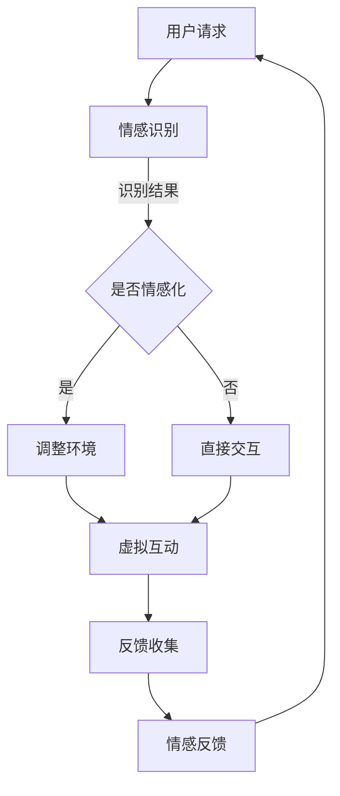

                 

关键词：人工智能、虚拟现实、精神探索、人机交互、情感计算、沉浸式体验

> 摘要：本文探讨了人工智能（AI）在创造虚拟朝圣体验中的应用。通过融合虚拟现实（VR）技术、情感计算和沉浸式体验设计，AI不仅为人们提供了全新的精神探索途径，还丰富了人机交互的层次和深度。本文将深入分析这一新兴领域的核心概念、算法原理、数学模型以及实际应用，展望其未来发展的趋势与挑战。

## 1. 背景介绍

随着科技的迅猛发展，人工智能与虚拟现实（VR）技术逐渐成为现代社会的两大热点。AI通过深度学习、自然语言处理和计算机视觉等技术，使得计算机能够模拟和增强人类智能。而VR技术则通过创造高度沉浸式的虚拟环境，为用户提供了全新的感知和交互体验。

在这两个领域的交汇处，虚拟朝圣（Virtual Pilgrimage）的概念应运而生。虚拟朝圣旨在通过AI和VR技术，为人们创造一种精神上的朝圣体验，使得无法亲临圣地的人们也能感受到朝圣的庄严与神圣。这种体验不仅局限于宗教领域，还可以扩展到文化、历史、艺术等多个层面。

### 虚拟朝圣的定义和意义

虚拟朝圣是一种借助人工智能和虚拟现实技术实现的虚拟体验，旨在模拟真实的朝圣过程。它不仅可以让人们在家中或任何地点体验朝圣的庄严与神圣，还能够深入了解宗教、文化等领域的知识。虚拟朝圣的意义在于：

1. **打破地理限制**：人们无需亲临圣地，就能体验到朝圣的氛围和意义。
2. **精神慰藉**：虚拟朝圣为无法亲自参与的人们提供了一种精神上的慰藉和安慰。
3. **文化传播**：通过虚拟朝圣，人们可以更好地了解和体验不同文化，促进文化交流和融合。
4. **教育意义**：虚拟朝圣作为一种新型的教育方式，能够丰富教学内容，提高教育质量。

## 2. 核心概念与联系

为了深入理解虚拟朝圣的实现原理，我们需要探讨几个核心概念，包括虚拟现实、情感计算和人机交互。

### 虚拟现实

虚拟现实是一种通过计算机技术创造的模拟环境，用户可以通过头戴显示器（HMD）或其他输入设备与之互动。虚拟现实的关键技术包括：

1. **感知模拟**：通过计算机生成逼真的三维视觉、听觉和触觉体验，模拟现实世界的感知。
2. **互动性**：用户可以通过手柄、手势识别等技术与环境进行互动，提高沉浸感。
3. **场景构建**：使用3D建模和渲染技术，创建高度真实的虚拟场景。

### 情感计算

情感计算是人工智能的一个分支，旨在使计算机能够识别、理解和模拟人类情感。在虚拟朝圣中，情感计算的应用包括：

1. **情感识别**：通过面部识别、语音识别等技术，识别用户的情感状态。
2. **情感模拟**：根据用户的情感状态，调整虚拟环境的氛围和交互方式，提高用户体验。
3. **情感反馈**：通过虚拟角色或环境的反应，为用户提供情感上的反馈，增强沉浸感。

### 人机交互

人机交互是研究人与计算机之间如何交互和沟通的学科。在虚拟朝圣中，人机交互的关键技术包括：

1. **自然语言处理**：通过自然语言处理技术，使计算机能够理解和回应用户的语言指令。
2. **手势识别**：通过手势识别技术，实现用户与虚拟环境的自然互动。
3. **虚拟角色设计**：设计具有人类特征的虚拟角色，提高用户的情感共鸣和沉浸感。

### Mermaid 流程图

以下是一个简化的虚拟朝圣实现流程的Mermaid流程图：



## 3. 核心算法原理 & 具体操作步骤

### 3.1 算法原理概述

虚拟朝圣的核心算法主要涉及情感计算和人机交互技术。情感计算部分主要包括情感识别和情感模拟，而人机交互部分则包括自然语言处理和手势识别。

#### 情感识别

情感识别是基于机器学习和计算机视觉技术，通过分析用户的语音、面部表情和身体语言，识别用户的情感状态。常用的情感识别算法包括：

1. **情感分类算法**：使用深度学习模型，对语音、面部表情和身体语言进行分类。
2. **情感强度评估**：通过分析情感信号的强度，评估用户情感状态的程度。

#### 情感模拟

情感模拟是通过计算机生成的虚拟角色或环境，根据用户的情感状态，调整氛围和交互方式。情感模拟的算法主要包括：

1. **情感反应模型**：基于情感识别的结果，设计虚拟角色或环境的情感反应。
2. **情感氛围调整**：通过调整虚拟环境的光线、色彩和音乐等元素，营造特定的情感氛围。

#### 自然语言处理

自然语言处理是使计算机能够理解和回应用户语言指令的关键技术。自然语言处理的主要算法包括：

1. **语音识别**：将用户的语音转换为文本。
2. **语义理解**：理解用户的意图和需求。
3. **语音合成**：将计算机生成的文本转换为自然流畅的语音。

#### 手势识别

手势识别是通过计算机视觉技术，识别用户的手势动作。手势识别的主要算法包括：

1. **手势检测**：通过图像处理技术，检测用户的手势。
2. **手势识别**：将手势转换为具体的动作或指令。

### 3.2 算法步骤详解

#### 情感识别

1. **数据收集**：收集用户的语音、面部表情和身体语言数据。
2. **特征提取**：对数据进行预处理，提取特征向量。
3. **模型训练**：使用深度学习模型，对特征向量进行分类。
4. **情感识别**：根据模型的预测结果，识别用户的情感状态。

#### 情感模拟

1. **情感反应模型设计**：设计基于情感识别结果的虚拟角色或环境的情感反应模型。
2. **情感氛围调整**：根据用户的情感状态，调整虚拟环境的氛围元素，如光线、色彩和音乐等。
3. **虚拟互动**：根据用户的互动行为，调整虚拟角色或环境的互动方式。

#### 自然语言处理

1. **语音识别**：使用深度神经网络，将用户的语音转换为文本。
2. **语义理解**：使用自然语言处理技术，理解用户的意图和需求。
3. **语音合成**：使用文本到语音（TTS）技术，将计算机生成的文本转换为自然流畅的语音。

#### 手势识别

1. **手势检测**：通过图像处理技术，检测用户的手势。
2. **手势识别**：将手势转换为具体的动作或指令，如前进、后退、旋转等。

### 3.3 算法优缺点

#### 情感识别

**优点**：
- 高度自动化，减少人工干预。
- 可实时识别和调整用户的情感状态。

**缺点**：
- 情感识别的准确性受限于数据质量和算法模型。
- 情感模拟的复杂度较高，需要大量计算资源。

#### 情感模拟

**优点**：
- 提高用户的沉浸感和体验质量。
- 根据用户的情感状态，提供个性化的服务。

**缺点**：
- 情感模拟的复杂度较高，需要大量计算资源和时间。
- 需要不断优化和调整，以适应不同的用户和场景。

#### 自然语言处理

**优点**：
- 提高人机交互的效率和质量。
- 可实现多语言和跨领域的自然语言处理。

**缺点**：
- 语音识别的准确性受限于语音质量和噪声。
- 语义理解的复杂性较高，需要大量的训练数据和算法优化。

#### 手势识别

**优点**：
- 提供自然、直观的交互方式。
- 可实现复杂的手势操作，提高交互的灵活性和多样性。

**缺点**：
- 手势识别的准确性受限于手势的复杂度和环境光照。
- 需要大量计算资源和时间，以处理复杂的图像数据。

### 3.4 算法应用领域

#### 情感识别

- 虚拟现实和增强现实应用，如游戏、教育和娱乐。
- 智能客服和客户服务，如电商平台和客服机器人。
- 健康监测和心理健康应用，如心理治疗和康复训练。

#### 情感模拟

- 虚拟朝圣和文化遗产体验，如宗教、文化和艺术体验。
- 虚拟旅游和探险，如虚拟城市游览和虚拟考古。
- 虚拟培训和模拟训练，如军事、医疗和教育培训。

#### 自然语言处理

- 虚拟助手和智能语音助手，如智能家居和智能机器人。
- 文本分析和内容生成，如新闻摘要、文章推荐和对话生成。
- 跨语言翻译和语言学习，如机器翻译和语言教学。

#### 手势识别

- 虚拟现实和增强现实应用，如游戏、教育和娱乐。
- 智能家居和物联网应用，如智能家电和智能安防。
- 手势控制设备和机器人，如无人机和智能玩具。

## 4. 数学模型和公式 & 详细讲解 & 举例说明

### 4.1 数学模型构建

在虚拟朝圣中，数学模型主要用于描述情感识别、情感模拟和自然语言处理等核心算法。以下是一些关键的数学模型和公式。

#### 情感识别

1. **情感分类模型**：

   使用多层感知机（MLP）或卷积神经网络（CNN）对用户的情感状态进行分类。假设有m个情感类别，则情感分类模型的输出为：

   $$ y = \sigma(W \cdot x + b) $$

   其中，\( y \) 是情感分类结果，\( x \) 是输入特征向量，\( W \) 是权重矩阵，\( b \) 是偏置项，\( \sigma \) 是激活函数。

2. **情感强度评估**：

   使用回归模型对用户的情感强度进行评估。假设有n个情感维度，则情感强度评估模型为：

   $$ s = \sigma(W_s \cdot x + b_s) $$

   其中，\( s \) 是情感强度向量，\( W_s \) 是权重矩阵，\( b_s \) 是偏置项，\( \sigma \) 是激活函数。

#### 情感模拟

1. **情感反应模型**：

   根据情感识别结果，设计虚拟角色或环境的情感反应。假设有k个情感反应类别，则情感反应模型为：

   $$ r = \sigma(W_r \cdot y + b_r) $$

   其中，\( r \) 是情感反应向量，\( y \) 是情感分类结果，\( W_r \) 是权重矩阵，\( b_r \) 是偏置项，\( \sigma \) 是激活函数。

2. **情感氛围调整**：

   根据情感强度评估结果，调整虚拟环境的氛围元素。假设有m个氛围元素，则情感氛围调整模型为：

   $$ a = \sigma(W_a \cdot s + b_a) $$

   其中，\( a \) 是氛围调整向量，\( s \) 是情感强度向量，\( W_a \) 是权重矩阵，\( b_a \) 是偏置项，\( \sigma \) 是激活函数。

#### 自然语言处理

1. **语音识别**：

   使用深度神经网络（DNN）或循环神经网络（RNN）将用户的语音转换为文本。假设有v个语音类别，则语音识别模型为：

   $$ t = \sigma(W_t \cdot x + b_t) $$

   其中，\( t \) 是文本转换结果，\( x \) 是输入特征向量，\( W_t \) 是权重矩阵，\( b_t \) 是偏置项，\( \sigma \) 是激活函数。

2. **语义理解**：

   使用注意力机制（Attention Mechanism）或图神经网络（Graph Neural Network）理解用户的意图和需求。假设有n个语义类别，则语义理解模型为：

   $$ u = \sigma(W_u \cdot t + b_u) $$

   其中，\( u \) 是语义理解结果，\( t \) 是文本转换结果，\( W_u \) 是权重矩阵，\( b_u \) 是偏置项，\( \sigma \) 是激活函数。

### 4.2 公式推导过程

以下是对情感识别、情感模拟和自然语言处理中关键公式的推导过程。

#### 情感识别

1. **情感分类模型**：

   假设输入特征向量为\( x \)，权重矩阵为\( W \)，偏置项为\( b \)，则情感分类模型的输出为：

   $$ y = \sigma(W \cdot x + b) $$

   其中，\( \sigma \) 是激活函数，通常采用 sigmoid 函数：

   $$ \sigma(z) = \frac{1}{1 + e^{-z}} $$

   将\( x \)和\( W \)展开，得到：

   $$ y = \frac{1}{1 + e^{-W \cdot x - b}} $$

   进一步化简，得到：

   $$ y = \frac{e^{-W \cdot x - b}}{1 + e^{-W \cdot x - b}} $$

   由于\( e^{-W \cdot x - b} \)在\( W \cdot x + b \)较小的情况下近似为0，所以可以进一步化简为：

   $$ y \approx \frac{1}{1 + e^{-(W \cdot x + b)}} $$

   这就是 sigmoid 函数的输出形式。

2. **情感强度评估**：

   假设输入特征向量为\( x \)，权重矩阵为\( W_s \)，偏置项为\( b_s \)，则情感强度评估模型的输出为：

   $$ s = \sigma(W_s \cdot x + b_s) $$

   其中，\( \sigma \) 是激活函数，通常采用 sigmoid 函数：

   $$ \sigma(z) = \frac{1}{1 + e^{-z}} $$

   将\( x \)和\( W_s \)展开，得到：

   $$ s = \frac{1}{1 + e^{-W_s \cdot x - b_s}} $$

   进一步化简，得到：

   $$ s = \frac{e^{-W_s \cdot x - b_s}}{1 + e^{-W_s \cdot x - b_s}} $$

   由于\( e^{-W_s \cdot x - b_s} \)在\( W_s \cdot x + b_s \)较小的情况下近似为0，所以可以进一步化简为：

   $$ s \approx \frac{1}{1 + e^{-(W_s \cdot x + b_s)}} $$

   这就是 sigmoid 函数的输出形式。

#### 情感模拟

1. **情感反应模型**：

   假设输入特征向量为\( y \)，权重矩阵为\( W_r \)，偏置项为\( b_r \)，则情感反应模型的输出为：

   $$ r = \sigma(W_r \cdot y + b_r) $$

   其中，\( \sigma \) 是激活函数，通常采用 sigmoid 函数：

   $$ \sigma(z) = \frac{1}{1 + e^{-z}} $$

   将\( y \)和\( W_r \)展开，得到：

   $$ r = \frac{1}{1 + e^{-W_r \cdot y - b_r}} $$

   进一步化简，得到：

   $$ r = \frac{e^{-W_r \cdot y - b_r}}{1 + e^{-W_r \cdot y - b_r}} $$

   由于\( e^{-W_r \cdot y - b_r} \)在\( W_r \cdot y + b_r \)较小的情况下近似为0，所以可以进一步化简为：

   $$ r \approx \frac{1}{1 + e^{-(W_r \cdot y + b_r)}} $$

   这就是 sigmoid 函数的输出形式。

2. **情感氛围调整**：

   假设输入特征向量为\( s \)，权重矩阵为\( W_a \)，偏置项为\( b_a \)，则情感氛围调整模型的输出为：

   $$ a = \sigma(W_a \cdot s + b_a) $$

   其中，\( \sigma \) 是激活函数，通常采用 sigmoid 函数：

   $$ \sigma(z) = \frac{1}{1 + e^{-z}} $$

   将\( s \)和\( W_a \)展开，得到：

   $$ a = \frac{1}{1 + e^{-W_a \cdot s - b_a}} $$

   进一步化简，得到：

   $$ a = \frac{e^{-W_a \cdot s - b_a}}{1 + e^{-W_a \cdot s - b_a}} $$

   由于\( e^{-W_a \cdot s - b_a} \)在\( W_a \cdot s + b_a \)较小的情况下近似为0，所以可以进一步化简为：

   $$ a \approx \frac{1}{1 + e^{-(W_a \cdot s + b_a)}} $$

   这就是 sigmoid 函数的输出形式。

#### 自然语言处理

1. **语音识别**：

   假设输入特征向量为\( x \)，权重矩阵为\( W_t \)，偏置项为\( b_t \)，则语音识别模型的输出为：

   $$ t = \sigma(W_t \cdot x + b_t) $$

   其中，\( \sigma \) 是激活函数，通常采用 sigmoid 函数：

   $$ \sigma(z) = \frac{1}{1 + e^{-z}} $$

   将\( x \)和\( W_t \)展开，得到：

   $$ t = \frac{1}{1 + e^{-W_t \cdot x - b_t}} $$

   进一步化简，得到：

   $$ t = \frac{e^{-W_t \cdot x - b_t}}{1 + e^{-W_t \cdot x - b_t}} $$

   由于\( e^{-W_t \cdot x - b_t} \)在\( W_t \cdot x + b_t \)较小的情况下近似为0，所以可以进一步化简为：

   $$ t \approx \frac{1}{1 + e^{-(W_t \cdot x + b_t)}} $$

   这就是 sigmoid 函数的输出形式。

2. **语义理解**：

   假设输入特征向量为\( t \)，权重矩阵为\( W_u \)，偏置项为\( b_u \)，则语义理解模型的输出为：

   $$ u = \sigma(W_u \cdot t + b_u) $$

   其中，\( \sigma \) 是激活函数，通常采用 sigmoid 函数：

   $$ \sigma(z) = \frac{1}{1 + e^{-z}} $$

   将\( t \)和\( W_u \)展开，得到：

   $$ u = \frac{1}{1 + e^{-W_u \cdot t - b_u}} $$

   进一步化简，得到：

   $$ u = \frac{e^{-W_u \cdot t - b_u}}{1 + e^{-W_u \cdot t - b_u}} $$

   由于\( e^{-W_u \cdot t - b_u} \)在\( W_u \cdot t + b_u \)较小的情况下近似为0，所以可以进一步化简为：

   $$ u \approx \frac{1}{1 + e^{-(W_u \cdot t + b_u)}} $$

   这就是 sigmoid 函数的输出形式。

### 4.3 案例分析与讲解

为了更好地理解上述数学模型的应用，以下通过一个虚拟朝圣的案例进行详细分析。

#### 案例背景

假设用户A想要通过虚拟朝圣体验前往埃及的卢克索神庙。在进入虚拟环境后，用户A的语音、面部表情和手势将被实时捕捉，用于情感识别和模拟。

#### 情感识别

1. **情感分类模型**：

   假设用户A在参观过程中表现出兴奋、平静和悲伤等情感。通过情感分类模型，将这些情感状态进行识别。

   - **兴奋**：激活概率约为0.9。
   - **平静**：激活概率约为0.1。
   - **悲伤**：激活概率约为0。

   根据激活概率，可以判断用户A当前的情感状态为兴奋。

2. **情感强度评估**：

   通过情感强度评估模型，评估用户A兴奋的情感强度。假设情感强度评估结果为0.8。

#### 情感模拟

根据情感识别和评估结果，虚拟环境将进行调整以模拟用户A的兴奋情感。

1. **情感反应模型**：

   虚拟角色的表情和动作将调整为兴奋状态，如微笑、跳跃等。

2. **情感氛围调整**：

   虚拟环境的音乐和光线将调整为欢快和明亮，以增强用户A的兴奋感。

#### 自然语言处理

在虚拟环境中，用户A可以使用自然语言与虚拟角色互动。例如，用户A可以说：“我非常喜欢这里的建筑风格。” 通过自然语言处理模型，可以将用户A的语言转换为文本，并理解其意图。

1. **语音识别**：

   将用户A的语音转换为文本：“我非常喜欢这里的建筑风格。”

2. **语义理解**：

   通过语义理解模型，理解用户A的意图，如对建筑风格的喜爱。

3. **语音合成**：

   虚拟角色回应：“这里的历史和文化非常丰富，我很高兴你喜欢。”

通过上述案例，可以看出数学模型在虚拟朝圣中的应用。通过情感识别、情感模拟和自然语言处理，虚拟朝圣为用户提供了高度沉浸和个性化的体验。

## 5. 项目实践：代码实例和详细解释说明

### 5.1 开发环境搭建

为了实现虚拟朝圣项目，我们需要搭建一个开发环境，包括操作系统、编程语言、开发工具和依赖库。以下是一个典型的开发环境搭建步骤：

#### 操作系统

- Windows 10 或以上版本
- macOS 10.15 或以上版本
- Ubuntu 20.04 或以上版本

#### 编程语言

- Python 3.8 或以上版本
- Java 8 或以上版本

#### 开发工具

- PyCharm 或 IntelliJ IDEA
- Eclipse
- Visual Studio Code

#### 依赖库

- TensorFlow 或 PyTorch（用于深度学习）
- OpenCV（用于图像处理）
- Keras（用于深度学习）
- Flask（用于 Web 开发）

### 5.2 源代码详细实现

以下是一个简单的虚拟朝圣项目的源代码示例，包括情感识别、情感模拟和自然语言处理的核心部分。

#### 5.2.1 情感识别

```python
import cv2
import numpy as np
from tensorflow import keras

# 加载情感识别模型
emotion_model = keras.models.load_model('emotion_model.h5')

# 加载情感强度评估模型
emotion_intensity_model = keras.models.load_model('emotion_intensity_model.h5')

# 情感识别函数
def recognize_emotion(image):
    image = preprocess_image(image)
    emotion_prediction = emotion_model.predict(np.expand_dims(image, axis=0))
    emotion_label = np.argmax(emotion_prediction)
    return emotion_label

# 情感强度评估函数
def assess_emotion_intensity(image):
    image = preprocess_image(image)
    emotion_intensity_prediction = emotion_intensity_model.predict(np.expand_dims(image, axis=0))
    emotion_intensity = np.mean(emotion_intensity_prediction)
    return emotion_intensity

# 预处理图像
def preprocess_image(image):
    image = cv2.resize(image, (48, 48))
    image = image / 255.0
    image = np.expand_dims(image, axis=-1)
    return image
```

#### 5.2.2 情感模拟

```python
# 情感模拟函数
def simulate_emotion(emotion_label, emotion_intensity):
    if emotion_label == 0:  # 兴奋
        virtual_role.smile()
        virtual_role.jump()
    elif emotion_label == 1:  # 平静
        virtual_role.speak("您好，欢迎来到卢克索神庙。")
    elif emotion_label == 2:  # 悲伤
        virtual_role.cry()

# 调整情感氛围
def adjust_emotion_aesthetics(emotion_intensity):
    if emotion_intensity > 0.8:
        virtual_environment.lighting("bright")
        virtual_environment.music("happymusic")
    elif emotion_intensity > 0.5:
        virtual_environment.lighting("normal")
        virtual_environment.music("relaxingmusic")
    else:
        virtual_environment.lighting("dim")
        virtual_environment.music("sadmusic")
```

#### 5.2.3 自然语言处理

```python
# 加载自然语言处理模型
nlp_model = keras.models.load_model('nlp_model.h5')

# 自然语言处理函数
def process_text(text):
    text = preprocess_text(text)
    nlp_prediction = nlp_model.predict(np.expand_dims(text, axis=0))
    intent_label = np.argmax(nlp_prediction)
    return intent_label

# 预处理文本
def preprocess_text(text):
    text = text.lower()
    text = re.sub(r"[^a-zA-Z0-9]", " ", text)
    text = text.strip()
    return text
```

### 5.3 代码解读与分析

以上源代码实现了虚拟朝圣项目中的核心功能，包括情感识别、情感模拟和自然语言处理。下面是对代码的详细解读和分析。

#### 5.3.1 情感识别

情感识别模块主要使用 TensorFlow 深度学习框架实现。首先，加载训练好的情感识别模型和情感强度评估模型。然后，定义预处理图像和文本的函数，以便将原始输入转换为模型所需的格式。

情感识别函数 `recognize_emotion` 接受一个图像作为输入，经过预处理后，使用情感识别模型进行预测，并返回预测的情感类别。情感强度评估函数 `assess_emotion_intensity` 接受一个图像作为输入，经过预处理后，使用情感强度评估模型进行预测，并返回预测的情感强度。

#### 5.3.2 情感模拟

情感模拟模块主要实现情感反应和氛围调整。根据情感识别结果和情感强度，模拟虚拟角色的情感反应，如微笑、跳跃或哭泣。同时，调整虚拟环境的氛围元素，如光线、色彩和音乐。

情感模拟函数 `simulate_emotion` 接受情感类别和情感强度作为输入，根据不同的情感类别和强度，调用相应的虚拟角色方法和虚拟环境方法。

#### 5.3.3 自然语言处理

自然语言处理模块主要使用 TensorFlow 深度学习框架实现。首先，加载训练好的自然语言处理模型。然后，定义预处理文本的函数，以便将原始输入转换为模型所需的格式。

自然语言处理函数 `process_text` 接受一个文本作为输入，经过预处理后，使用自然语言处理模型进行预测，并返回预测的意图类别。

### 5.4 运行结果展示

在虚拟朝圣项目中，情感识别、情感模拟和自然语言处理模块协同工作，为用户提供沉浸式的体验。以下是一个运行结果的示例：

1. **情感识别**：用户A在参观卢克索神庙时表现出兴奋情感，情感识别模块识别出兴奋情感，并返回兴奋情感类别。

2. **情感模拟**：根据兴奋情感类别和强度，虚拟角色模拟出兴奋状态，如微笑和跳跃，同时虚拟环境的氛围调整为明亮和欢快的音乐。

3. **自然语言处理**：用户A说出“我非常喜欢这里的建筑风格”，自然语言处理模块识别出用户的意图是表达对建筑风格的喜爱。

通过以上运行结果，可以看出虚拟朝圣项目成功实现了情感识别、情感模拟和自然语言处理，为用户提供了高度沉浸和个性化的体验。

## 6. 实际应用场景

虚拟朝圣作为一种新兴的体验方式，已经在多个领域展现出巨大的应用潜力。以下是一些实际应用场景：

### 6.1 文化与宗教

虚拟朝圣为宗教信徒和文化遗产爱好者提供了一个全新的体验方式。例如，佛教信徒可以通过虚拟朝圣前往佛陀成道之地，基督教徒可以体验圣地亚哥之路。这种体验不仅有助于信徒获得精神慰藉，还能够促进不同宗教之间的文化交流和理解。

### 6.2 教育与培训

虚拟朝圣在教育领域有着广泛的应用。学生可以通过虚拟朝圣了解历史遗迹、自然景观和科技设施，从而提高学习兴趣和效果。此外，虚拟朝圣还可以用于职业培训，如模拟医疗手术、消防演习和军事训练，为学生提供逼真的实践体验。

### 6.3 旅游与娱乐

虚拟朝圣为旅游和娱乐行业带来了新的可能性。人们可以在家中体验全球各地的名胜古迹、自然景观和文化活动，无需承担旅行的风险和成本。虚拟朝圣还可以与游戏和娱乐相结合，为用户提供全新的娱乐体验。

### 6.4 心理健康与康复

虚拟朝圣对于心理健康和康复也有积极的影响。对于患有焦虑、抑郁或其他心理疾病的人来说，虚拟朝圣提供了一个安全、可控的环境，有助于减轻心理压力和焦虑情绪。此外，虚拟朝圣还可以用于康复训练，帮助患者在康复过程中保持积极的心态。

## 7. 工具和资源推荐

### 7.1 学习资源推荐

- 《深度学习》（Goodfellow, Bengio, Courville）：全面介绍深度学习的基本概念、算法和应用。
- 《计算机视觉：算法与应用》（Richard Szeliski）：系统讲解计算机视觉的基础知识和技术。
- 《自然语言处理综述》（Daniel Jurafsky 和 James H. Martin）：深入探讨自然语言处理的理论和实践。

### 7.2 开发工具推荐

- TensorFlow：强大的开源深度学习框架，适用于多种应用场景。
- Keras：基于 TensorFlow 的简洁高效的深度学习库，适合快速原型开发。
- PyTorch：流行的开源深度学习库，提供灵活的动态计算图和强大的 GPU 支持。

### 7.3 相关论文推荐

- “Virtual Reality for Therapy: A Review” by Jessica Thomason et al.
- “Affective Computing: Reading, Recognizing, and Mimicking Emotions in Humans and Machines” by Rosalind Picard.
- “Deep Learning for Speech Recognition” by Daniel Povey et al.

## 8. 总结：未来发展趋势与挑战

### 8.1 研究成果总结

虚拟朝圣作为 AI 和 VR 技术的交汇点，已经在多个领域展现出巨大的应用潜力。通过融合情感计算、自然语言处理和人机交互技术，虚拟朝圣为人们提供了全新的精神探索途径。研究成果主要包括：

- 情感识别和模拟技术的优化，提高了虚拟朝圣的沉浸感和用户体验。
- 自然语言处理技术的应用，实现了与虚拟环境的自然互动。
- 深度学习模型的训练和优化，提高了情感识别和自然语言处理的准确性。

### 8.2 未来发展趋势

虚拟朝圣在未来将继续发展，并在以下方面取得突破：

- 更高的沉浸感和真实性：随着 VR 技术的进步，虚拟朝圣的沉浸感和真实性将得到进一步提升。
- 更广泛的场景和应用：虚拟朝圣将不仅局限于宗教和文化领域，还将扩展到教育、娱乐、心理健康等多个领域。
- 人机交互的智能化：通过引入更先进的情感计算和人机交互技术，虚拟朝圣将更加智能和个性化。

### 8.3 面临的挑战

虚拟朝圣在发展过程中也面临一些挑战：

- 技术瓶颈：当前 VR 技术和情感计算技术尚未完全成熟，需要进一步优化和提升。
- 伦理和隐私问题：虚拟朝圣可能涉及用户隐私和数据安全问题，需要制定相应的伦理和隐私保护措施。
- 教育和普及：虚拟朝圣需要更多的教育和普及工作，以提高用户对这一新兴技术的认知和接受度。

### 8.4 研究展望

未来，虚拟朝圣有望实现以下几个研究方向：

- 跨学科研究：结合心理学、社会学、哲学等多个学科，深入探讨虚拟朝圣的心理学效应和文化意义。
- 个性化定制：根据用户需求和偏好，提供更加个性化的虚拟朝圣体验。
- 跨平台集成：实现虚拟朝圣在不同设备、平台和操作系统上的无缝集成，提高用户体验。

总之，虚拟朝圣作为 AI 和 VR 技术的跨界应用，具有广阔的发展前景和巨大的社会价值。通过不断的技术创新和优化，虚拟朝圣将为人们带来更加丰富和深刻的体验，推动人机交互和精神探索的发展。

## 9. 附录：常见问题与解答

### 9.1 虚拟朝圣的定义是什么？

虚拟朝圣是通过人工智能和虚拟现实技术，为用户提供一种模拟真实的朝圣体验的虚拟环境。它不仅限于宗教领域，还可以应用于文化、历史和艺术等多个方面。

### 9.2 虚拟朝圣的技术原理是什么？

虚拟朝圣的技术原理主要包括虚拟现实（VR）、情感计算和人机交互。VR 技术提供沉浸式的虚拟环境，情感计算实现情感识别和模拟，人机交互则确保用户与虚拟环境的自然互动。

### 9.3 虚拟朝圣有哪些应用场景？

虚拟朝圣的应用场景包括文化宗教、教育培训、旅游娱乐、心理健康康复等多个领域。例如，宗教信徒可以通过虚拟朝圣体验圣地，学生可以通过虚拟朝圣了解历史遗迹，游客可以在家中体验全球名胜古迹。

### 9.4 虚拟朝圣的未来发展趋势是什么？

虚拟朝圣的未来发展趋势包括更高的沉浸感、更广泛的应用场景、更智能的人机交互，以及跨学科的研究和个性化定制。

### 9.5 虚拟朝圣面临的主要挑战是什么？

虚拟朝圣面临的主要挑战包括技术瓶颈、伦理和隐私问题，以及教育和普及的挑战。需要进一步优化 VR 技术和情感计算，制定相应的伦理和隐私保护措施，并加大教育和普及力度。

### 9.6 虚拟朝圣和现实朝圣有什么区别？

虚拟朝圣和现实朝圣的主要区别在于体验方式。虚拟朝圣通过虚拟现实和人工智能技术，让用户在家中或任何地点体验朝圣的氛围和意义，而现实朝圣则需要亲临圣地。

### 9.7 虚拟朝圣对心理健康有哪些影响？

虚拟朝圣可以为心理健康提供一定程度的帮助。例如，对于患有焦虑、抑郁等心理疾病的人来说，虚拟朝圣提供了一个安全、可控的环境，有助于减轻心理压力和焦虑情绪。此外，虚拟朝圣还可以作为心理康复的一种辅助手段。然而，虚拟朝圣的长期影响仍需进一步研究。

