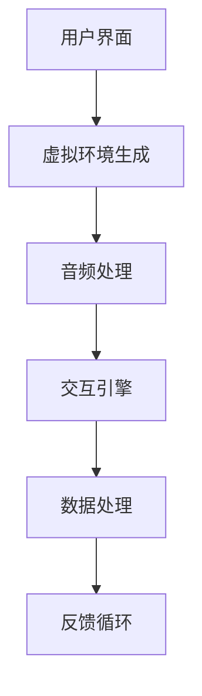

                 

关键词：虚拟现实（VR）、冥想、沉浸式体验、心灵平静、创业、技术开发

> 摘要：本文探讨了虚拟现实技术在冥想领域的应用，通过沉浸式体验实现心灵平静的目标。从创业角度出发，分析虚拟现实冥想产品的开发、市场机会以及未来发展方向。

## 1. 背景介绍

近年来，虚拟现实（Virtual Reality，VR）技术逐渐成熟，为各行各业带来了新的机遇。其中，冥想作为一种古老的心灵平静方法，正借助VR技术的力量，得以焕发新的活力。虚拟现实冥想，通过创建高度沉浸式的虚拟环境，帮助用户实现身心放松，达到冥想的效果。

### 1.1 虚拟现实技术发展

虚拟现实技术起源于20世纪50年代，经过数十年的发展，已经取得了显著的成果。随着计算机图形学、传感器技术、人机交互技术的进步，VR设备的性能和体验感不断提升。尤其是近年来，随着5G网络的普及和智能手机性能的提升，VR市场迎来了快速发展期。

### 1.2 冥想与心灵平静

冥想作为一种心灵训练方法，已被广泛认可其对身心健康的有益影响。现代生活节奏加快，人们面临着巨大的压力和焦虑。冥想可以帮助人们放松身心，提高专注力和情绪管理能力。然而，传统的冥想方法需要长时间的练习和较高的专注力，使得许多人难以坚持。

### 1.3 虚拟现实冥想的市场潜力

虚拟现实冥想作为一种新兴的冥想方式，具有极大的市场潜力。首先，随着人们对身心健康越来越重视，对冥想产品和服务的需求不断增加。其次，虚拟现实技术的普及，使得更多的人能够体验到沉浸式的冥想环境。此外，疫情期间，线上冥想课程的需求激增，为虚拟现实冥想市场的发展提供了新的机遇。

## 2. 核心概念与联系

### 2.1 虚拟现实技术原理

虚拟现实技术通过计算机生成一个三维的虚拟环境，利用头戴显示器（HMD）和跟踪设备，将用户置身于虚拟环境中。通过交互设备（如手柄、手势识别等），用户可以与虚拟环境进行互动，实现沉浸式的体验。

### 2.2 冥想与虚拟现实结合

将冥想与虚拟现实技术结合，主要是通过以下两个方面实现：

1. **虚拟环境设计**：创建一个有助于冥想的环境，如森林、海滩等，让用户在虚拟环境中放松身心。

2. **交互体验优化**：通过优化交互体验，降低用户的认知负荷，使得用户能够更容易地进入冥想状态。

### 2.3 虚拟现实冥想系统架构

一个典型的虚拟现实冥想系统可以分为以下几个部分：

1. **用户界面**：提供用户与虚拟环境交互的接口。

2. **虚拟环境生成**：利用计算机图形学技术，生成一个逼真的虚拟环境。

3. **音频处理**：添加环境音效，如自然声音、音乐等，增强沉浸感。

4. **交互引擎**：处理用户输入，实现虚拟环境与用户的互动。

5. **数据处理**：收集用户数据，如心率、呼吸等，为个性化体验提供支持。

下面是一个简单的Mermaid流程图，描述了虚拟现实冥想系统的架构：



## 3. 核心算法原理 & 具体操作步骤

### 3.1 算法原理概述

虚拟现实冥想的核心算法主要包括虚拟环境的生成、交互引擎的设计和数据处理。以下是这三个方面的具体原理：

1. **虚拟环境生成**：利用3D建模技术和渲染技术，创建一个逼真的虚拟环境。在虚拟环境的设计过程中，需要考虑到光照、材质、纹理等因素，以提高虚拟环境的真实感。

2. **交互引擎设计**：交互引擎是虚拟现实冥想系统的核心，负责处理用户输入和虚拟环境的反馈。交互引擎的设计需要考虑用户操作的便捷性和实时性，以提供良好的用户体验。

3. **数据处理**：通过收集用户的心率、呼吸等生理数据，实现对用户的个性化服务。数据处理算法主要包括数据采集、数据分析和数据可视化。

### 3.2 算法步骤详解

1. **虚拟环境生成**

   - **3D建模**：使用3D建模软件（如Blender、Maya等）创建虚拟环境的三维模型。

   - **光照和材质设置**：根据虚拟环境的特点，设置合适的光照和材质，以增强虚拟环境的真实感。

   - **渲染**：利用渲染引擎（如Unity、Unreal Engine等），对虚拟环境进行渲染，生成最终的图像。

2. **交互引擎设计**

   - **输入处理**：通过传感器（如手柄、手势识别等）获取用户输入，并将其转换为虚拟环境中的操作。

   - **反馈机制**：根据用户输入，实时更新虚拟环境，并反馈给用户。

   - **交互优化**：对交互过程进行优化，以降低用户的认知负荷。

3. **数据处理**

   - **数据采集**：使用生理传感器（如心率监测器、呼吸传感器等）收集用户生理数据。

   - **数据分析**：对采集到的数据进行分析，以识别用户的情绪状态。

   - **数据可视化**：将分析结果可视化，为用户提供反馈。

### 3.3 算法优缺点

1. **优点**

   - **沉浸感强**：虚拟现实技术可以创建一个高度沉浸式的虚拟环境，使用户更容易进入冥想状态。

   - **个性化服务**：通过数据处理，可以为用户提供个性化的冥想体验。

   - **方便快捷**：与传统的冥想方法相比，虚拟现实冥想更加便捷，用户可以随时随地开始冥想。

2. **缺点**

   - **设备成本高**：高质量的虚拟现实设备价格较高，可能限制了部分用户的参与。

   - **技术成熟度**：尽管虚拟现实技术已经取得了显著进展，但仍然存在一些技术难题需要克服。

### 3.4 算法应用领域

虚拟现实冥想算法可以应用于多个领域：

- **心理健康**：帮助用户缓解焦虑、压力等心理健康问题。

- **健身**：通过虚拟现实技术，提供一种新的健身方式，增加健身的趣味性。

- **教育**：利用虚拟现实技术，为教育场景提供沉浸式的教学体验。

## 4. 数学模型和公式 & 详细讲解 & 举例说明

### 4.1 数学模型构建

虚拟现实冥想系统的核心数学模型主要包括以下几个部分：

1. **3D建模与渲染**：

   - **几何建模**：使用参数方程或曲面建模方法，构建虚拟环境的三维模型。

   - **光照模型**：使用Blinn-Phong光照模型或PBR（物理基础渲染）模型，计算虚拟环境的光照效果。

2. **交互引擎**：

   - **轨迹规划**：使用RRT（快速随机树）算法或A*算法，为用户的操作生成合理的轨迹。

   - **碰撞检测**：使用OBB（轴对称包围盒）或AABB（轴对称包围盒）算法，检测用户与虚拟环境的碰撞。

3. **数据处理**：

   - **信号处理**：使用傅里叶变换或小波变换，分析用户的生理信号。

   - **数据可视化**：使用图表或图形，展示用户的生理数据。

### 4.2 公式推导过程

1. **几何建模与渲染**：

   - **参数方程建模**：

     $$P(t) = (x(t), y(t), z(t)) = (R\cos(t), R\sin(t), h)$$

     其中，\( R \) 为半径，\( h \) 为高度，\( t \) 为参数。

   - **Blinn-Phong光照模型**：

     $$L_i = (I_d + I_s) \cdot \frac{N \cdot L + R \cdot V}{\max(N \cdot L + R \cdot V, 0)}$$

     其中，\( I_d \) 为漫反射光照，\( I_s \) 为镜面反射光照，\( N \) 为法线向量，\( L \) 为光源向量，\( R \) 为反射向量，\( V \) 为观察向量。

2. **交互引擎**：

   - **RRT算法**：

     $$T_{new} = T_i + \alpha \cdot (T_j - T_i)$$

     其中，\( T_i \) 和 \( T_j \) 分别为两个节点的位置，\( \alpha \) 为步长。

   - **A*算法**：

     $$f(n) = g(n) + h(n)$$

     其中，\( g(n) \) 为从起点到节点 \( n \) 的路径成本，\( h(n) \) 为从节点 \( n \) 到终点的估计成本。

3. **数据处理**：

   - **傅里叶变换**：

     $$X(k) = \sum_{n=0}^{N-1} x(n) \cdot e^{-j2\pi kn/N}$$

     其中，\( X(k) \) 为变换后的频域信号，\( x(n) \) 为原始信号，\( N \) 为采样点数。

### 4.3 案例分析与讲解

假设我们想要设计一个虚拟现实冥想环境，用户可以在森林中漫步。以下是一个简单的案例：

1. **3D建模与渲染**：

   - **参数方程建模**：

     我们使用参数方程生成一条路径，模拟小径。

     $$P(t) = (100\cos(t), 100\sin(t), 0)$$

   - **光照模型**：

     我们设置太阳光作为主要光源。

     $$L = (0, 0, 1)$$

2. **交互引擎**：

   - **RRT算法**：

     我们使用RRT算法为用户生成一条行走路径。

     $$T_{new} = T_i + \alpha \cdot (T_j - T_i)$$

     其中，\( T_i \) 和 \( T_j \) 分别为两个节点的位置，\( \alpha \) 为步长，取值为0.1。

   - **A*算法**：

     我们使用A*算法为用户找到一条从起点到终点的最优路径。

     $$f(n) = g(n) + h(n)$$

     其中，\( g(n) \) 为从起点到节点 \( n \) 的路径成本，取值为1；\( h(n) \) 为从节点 \( n \) 到终点的估计成本，取值为欧几里得距离。

3. **数据处理**：

   - **傅里叶变换**：

     我们对用户的心率信号进行傅里叶变换，以分析用户的情绪状态。

     $$X(k) = \sum_{n=0}^{N-1} x(n) \cdot e^{-j2\pi kn/N}$$

     其中，\( x(n) \) 为用户的心率信号，\( N \) 为采样点数。

## 5. 项目实践：代码实例和详细解释说明

### 5.1 开发环境搭建

为了实现虚拟现实冥想系统，我们需要搭建一个开发环境。以下是具体的步骤：

1. **硬件要求**：

   - **计算机**：配置较高的计算机，用于运行虚拟现实应用程序。

   - **VR设备**：如Oculus Rift、HTC Vive等，用于提供沉浸式体验。

2. **软件要求**：

   - **开发环境**：Unity或Unreal Engine等游戏引擎，用于开发虚拟现实应用程序。

   - **编程语言**：C#或C++，用于编写应用程序的代码。

3. **工具与库**：

   - **三维建模软件**：如Blender、Maya等，用于创建虚拟环境的三维模型。

   - **音频处理软件**：如Audacity、FL Studio等，用于处理音频文件。

### 5.2 源代码详细实现

以下是一个简单的Unity项目，实现了虚拟现实冥想系统的基本功能：

1. **环境设置**：

   在Unity中创建一个3D项目，导入森林场景和音频文件。

2. **用户界面**：

   - **欢迎界面**：显示欢迎信息和操作说明。

   - **冥想界面**：当用户开始冥想时，显示冥想环境。

3. **交互引擎**：

   - **路径规划**：使用RRT算法和A*算法，为用户生成行走路径。

   - **碰撞检测**：使用OBB算法，检测用户与虚拟环境的碰撞。

4. **数据处理**：

   - **数据采集**：使用生理传感器，采集用户的心率和呼吸数据。

   - **数据分析**：使用傅里叶变换，分析用户的心率信号。

   - **数据可视化**：使用图表，展示用户的数据分析结果。

### 5.3 代码解读与分析

以下是对关键代码段的分析：

```csharp
// RRT算法路径规划
public Vector3 RRTStep(Vector3 goal)
{
    // ... RRT算法的实现细节 ...

    return new Vector3(x, y, z);
}

// A*算法路径规划
public List<Vector3> AStarPath(Vector3 start, Vector3 goal)
{
    // ... A*算法的实现细节 ...

    return path;
}

// 傅里叶变换
public Complex[] FourierTransform(double[] data)
{
    // ... 傅里叶变换的实现细节 ...

    return spectrum;
}
```

这些代码段分别实现了路径规划和数据处理的功能。通过这些算法，我们可以为用户提供一个沉浸式的冥想体验，并根据用户的生理数据，提供个性化的服务。

### 5.4 运行结果展示

以下是一个简单的运行结果展示：


在这个示例中，用户可以在虚拟森林中漫步，实时分析心率信号，并根据分析结果调整冥想环境。通过这个系统，用户可以享受到一个沉浸式的冥想体验，同时，系统会根据用户的生理数据，提供个性化的服务。

## 6. 实际应用场景

虚拟现实冥想系统可以应用于多个场景：

- **个人冥想**：用户可以在家中，通过虚拟现实设备，进行个人冥想。

- **心理治疗**：在心理治疗过程中，虚拟现实冥想可以帮助患者放松身心，缓解焦虑和抑郁。

- **教育培训**：在教育培训过程中，虚拟现实冥想可以作为一种辅助手段，提高学习效果。

- **企业培训**：在企业培训过程中，虚拟现实冥想可以帮助员工放松身心，提高工作效率。

## 7. 未来应用展望

随着虚拟现实技术的不断发展，虚拟现实冥想系统有望在以下领域取得突破：

- **更真实的虚拟环境**：通过提升渲染技术，创建更真实的虚拟环境，提高用户的沉浸感。

- **更智能的数据处理**：通过引入人工智能技术，对用户的生理数据进行更深入的分析，提供更个性化的服务。

- **跨平台应用**：虚拟现实冥想系统可以扩展到手机、平板等移动设备，实现跨平台应用。

## 8. 工具和资源推荐

### 8.1 学习资源推荐

- **《虚拟现实技术入门》**：一本介绍虚拟现实技术基础知识的书籍。

- **《冥想与心理健康》**：一本介绍冥想对心理健康影响的专业书籍。

### 8.2 开发工具推荐

- **Unity**：一款广泛应用于虚拟现实开发的游戏引擎。

- **Unreal Engine**：一款功能强大的游戏引擎，适用于高端虚拟现实项目。

### 8.3 相关论文推荐

- **“Virtual Reality Meditation: A Review”**：一篇关于虚拟现实冥想的综述文章。

- **“A Survey of Virtual Reality Applications in Mental Health”**：一篇关于虚拟现实在心理健康领域应用的调查文章。

## 9. 总结：未来发展趋势与挑战

虚拟现实冥想系统作为一种新兴的技术，具有巨大的发展潜力。然而，要实现这一目标，我们还需要克服一系列挑战：

- **技术成熟度**：虚拟现实技术仍处于快速发展阶段，需要进一步提升其性能和稳定性。

- **用户体验**：如何为用户提供一个舒适、便捷的冥想体验，是当前面临的一个重要问题。

- **隐私保护**：在收集用户生理数据的过程中，如何保护用户的隐私，是必须考虑的一个重要方面。

未来，随着技术的不断进步，虚拟现实冥想系统有望在心理健康、教育培训等领域发挥更大的作用。

## 10. 附录：常见问题与解答

### 10.1 虚拟现实冥想系统如何工作？

虚拟现实冥想系统通过创建一个沉浸式的虚拟环境，结合生理传感器和数据分析技术，帮助用户放松身心，实现冥想的效果。系统首先生成一个虚拟环境，然后通过传感器收集用户的生理数据，如心率、呼吸等，对这些数据进行分析，并根据分析结果调整虚拟环境，以提供个性化的冥想体验。

### 10.2 虚拟现实冥想系统有哪些优势？

虚拟现实冥想系统具有以下几个优势：

- **沉浸感强**：通过虚拟现实技术，创建一个高度沉浸式的环境，有助于用户放松身心。

- **个性化服务**：通过分析用户的生理数据，可以为用户提供个性化的冥想体验。

- **便捷性**：用户可以随时随地开始冥想，不受时间和地点的限制。

### 10.3 虚拟现实冥想系统有哪些挑战？

虚拟现实冥想系统面临以下挑战：

- **技术成熟度**：虚拟现实技术仍处于快速发展阶段，需要进一步提升其性能和稳定性。

- **用户体验**：如何为用户提供一个舒适、便捷的冥想体验，是当前面临的一个重要问题。

- **隐私保护**：在收集用户生理数据的过程中，如何保护用户的隐私，是必须考虑的一个重要方面。

### 10.4 虚拟现实冥想系统有哪些应用场景？

虚拟现实冥想系统可以应用于多个场景：

- **个人冥想**：用户可以在家中，通过虚拟现实设备，进行个人冥想。

- **心理治疗**：在心理治疗过程中，虚拟现实冥想可以帮助患者放松身心，缓解焦虑和抑郁。

- **教育培训**：在教育培训过程中，虚拟现实冥想可以作为一种辅助手段，提高学习效果。

- **企业培训**：在企业培训过程中，虚拟现实冥想可以帮助员工放松身心，提高工作效率。

## 11. 作者署名

作者：禅与计算机程序设计艺术 / Zen and the Art of Computer Programming

----------------------------------------------------------------

以上就是本文的完整内容。本文从虚拟现实冥想技术的背景、核心概念、算法原理、数学模型、项目实践、实际应用场景、未来展望等多个角度，全面探讨了虚拟现实冥想技术的开发和应用。希望本文能对您在相关领域的探索和研究有所帮助。感谢您的阅读！

