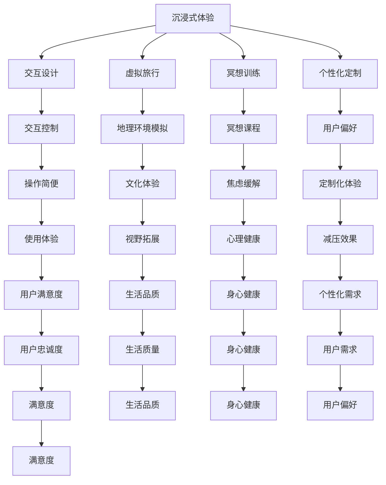

                 

关键词：虚拟现实，压力管理，沉浸式体验，创业，技术发展

> 摘要：本文旨在探讨如何利用虚拟现实技术（VR）开展压力管理创业，实现沉浸式减压体验。我们将介绍虚拟现实在压力管理领域的应用，探讨其核心概念与联系，解析核心算法原理，构建数学模型，分享项目实践和未来应用展望。

## 1. 背景介绍

在当今快节奏的生活中，压力已经成为人们健康和生活质量的重要威胁。根据世界卫生组织的报告，全球有超过半数的人在生活中面临不同程度的压力。压力管理的重要性不言而喻，而虚拟现实（VR）技术的出现为这一领域带来了全新的解决方案。

虚拟现实技术通过创造一个模拟的环境，使用户在视觉、听觉、触觉等多个感官上获得沉浸式的体验。近年来，随着硬件设备的进步和内容创作的繁荣，虚拟现实在游戏、娱乐、医疗等领域取得了显著的成果。然而，压力管理作为一个新兴的应用领域，正逐渐成为虚拟现实技术的下一个重要战场。

### 1.1 虚拟现实技术概述

虚拟现实技术（VR）是指通过计算机生成一个模拟的三维环境，用户可以通过特殊设备（如VR头盔、手柄等）与这个环境进行交互。虚拟现实技术的基本原理包括以下几个方面：

- **计算机图形学**：通过计算机图形学技术生成逼真的三维场景，实现视觉上的沉浸感。
- **传感器技术**：使用传感器技术捕捉用户的头部运动、身体动作等，实现交互控制。
- **声音技术**：通过三维音效技术创造空间感，增强沉浸体验。
- **触觉技术**：通过触觉反馈设备，如VR手套、压力传感器等，提供触觉反馈。

### 1.2 压力管理的需求

随着社会的发展，人们面临的工作压力、生活压力、心理压力越来越大。这些压力不仅会影响个人的身心健康，还可能影响工作效率和家庭生活。传统的压力管理方法，如心理咨询、运动、冥想等，虽然有一定效果，但往往需要较长时间，且效果有限。

虚拟现实技术的出现为压力管理提供了一种全新的解决方案。通过模拟各种放松场景、虚拟旅行、冥想训练等，用户可以在短时间内获得放松和减压的效果。此外，虚拟现实技术还可以通过个性化定制，满足不同用户的需求，提高压力管理的效率。

## 2. 核心概念与联系

虚拟现实技术在压力管理中的应用，涉及多个核心概念和技术。以下是对这些概念和技术的详细解析，以及它们之间的相互联系。

### 2.1 沉浸式体验

沉浸式体验是虚拟现实技术的核心特点，它使用户在视觉、听觉、触觉等多个感官上感受到虚拟环境的真实存在。在压力管理中，沉浸式体验可以帮助用户快速放松，减少外部压力的干扰。

### 2.2 交互设计

交互设计是虚拟现实技术的重要组成部分，它决定了用户如何与虚拟环境进行互动。在压力管理中，交互设计需要考虑到用户的心理状态，设计出易于操作、具有安抚作用的内容。

### 2.3 虚拟旅行

虚拟旅行是通过虚拟现实技术模拟旅行体验，使用户在虚拟环境中体验到不同的地理环境和文化。虚拟旅行可以帮助用户缓解压力，拓宽视野，提升生活品质。

### 2.4 冥想训练

冥想训练是通过虚拟现实技术模拟冥想环境，提供冥想训练课程。虚拟冥想可以降低用户的焦虑感，提高专注力，有助于心理健康。

### 2.5 个性化定制

个性化定制是根据用户的需求和偏好，定制个性化的虚拟现实体验。在压力管理中，个性化定制可以帮助用户找到最适合自己的减压方式，提高减压效果。

下面是一个Mermaid流程图，展示这些核心概念和技术的联系：



## 3. 核心算法原理 & 具体操作步骤

### 3.1 算法原理概述

虚拟现实压力管理中的核心算法主要涉及以下几个方面：

- **场景生成算法**：用于生成各种减压场景，如海滩、森林、山区等。
- **交互算法**：用于处理用户在虚拟环境中的交互行为，如移动、触摸、手势等。
- **情绪识别算法**：用于识别用户在虚拟环境中的情绪变化，以提供个性化的减压方案。

### 3.2 算法步骤详解

#### 3.2.1 场景生成算法

场景生成算法的核心是创建一个虚拟的三维环境，这个环境需要具有高度的真实感。具体步骤如下：

1. **场景建模**：使用三维建模工具创建场景，包括地形、植物、建筑等。
2. **材质和光照**：为场景添加材质和光照效果，以增强真实感。
3. **纹理映射**：将纹理映射到场景的表面，以提高视觉效果。

#### 3.2.2 交互算法

交互算法负责处理用户在虚拟环境中的各种交互行为。具体步骤如下：

1. **传感器数据读取**：读取VR设备传感器数据，如头部位置、手部动作等。
2. **交互处理**：根据传感器数据，处理用户的交互行为，如移动、触摸、手势等。
3. **反馈机制**：根据用户的交互行为，提供相应的反馈，如音效、视觉提示等。

#### 3.2.3 情绪识别算法

情绪识别算法用于识别用户在虚拟环境中的情绪变化。具体步骤如下：

1. **情绪数据收集**：通过生理信号（如心率、呼吸等）和面部表情分析，收集情绪数据。
2. **情绪分析**：使用机器学习算法，分析情绪数据，识别用户的情绪状态。
3. **情绪反馈**：根据情绪状态，调整虚拟环境的参数，如音量、光线等，以提供个性化的减压方案。

### 3.3 算法优缺点

#### 优点

- **沉浸式体验**：通过虚拟现实技术，用户可以获得高度沉浸的体验，有助于快速放松。
- **个性化定制**：情绪识别算法可以识别用户的情绪状态，提供个性化的减压方案。
- **实时反馈**：交互算法可以实时处理用户的交互行为，提供即时的反馈。

#### 缺点

- **技术门槛**：虚拟现实技术对开发者的技术要求较高，需要掌握三维建模、计算机图形学、机器学习等多个领域的技术。
- **设备依赖**：用户需要配备专门的VR设备，这对部分用户来说可能是一个限制。
- **效果评估**：如何准确评估虚拟现实压力管理的效果，仍需进一步研究。

### 3.4 算法应用领域

虚拟现实压力管理算法可以广泛应用于多个领域：

- **医疗领域**：用于辅助心理治疗，如焦虑症、抑郁症等。
- **教育领域**：用于心理教育，如情绪管理、压力应对等。
- **企业领域**：用于员工压力管理，提高工作效率。
- **个人领域**：用于个人减压，提升生活质量。

## 4. 数学模型和公式 & 详细讲解 & 举例说明

### 4.1 数学模型构建

虚拟现实压力管理中的数学模型主要涉及以下两个方面：

- **情绪模型**：用于描述用户在虚拟环境中的情绪状态。
- **反馈模型**：用于描述虚拟环境对用户情绪的反馈。

#### 4.1.1 情绪模型

情绪模型是一个多维度的状态空间，用于描述用户的情绪状态。假设用户的情绪状态可以用五个维度来描述：快乐度、焦虑度、放松度、专注度、幸福感。每个维度可以用一个数值来表示，取值范围在0到100之间。

情绪模型的数学表示如下：

$$
S(t) = [happiness(t), anxiety(t), relaxation(t), focus(t), happiness(t)]
$$

其中，$S(t)$ 表示在时间 $t$ 时的情绪状态。

#### 4.1.2 反馈模型

反馈模型用于描述虚拟环境对用户情绪的反馈。假设虚拟环境的参数包括音量、光线、温度等，每个参数对情绪状态的不同维度有不同的影响。

反馈模型的数学表示如下：

$$
F(t) = [f_{1}(t), f_{2}(t), f_{3}(t), f_{4}(t), f_{5}(t)]
$$

其中，$F(t)$ 表示在时间 $t$ 时，虚拟环境对情绪状态的反馈。

每个反馈因子 $f_i(t)$ 的计算公式如下：

$$
f_i(t) = w_i \cdot p_i(t)
$$

其中，$w_i$ 表示参数 $p_i(t)$ 对情绪状态维度 $i$ 的影响权重，$p_i(t)$ 表示在时间 $t$ 时参数 $p_i$ 的值。

#### 4.1.3 情绪状态更新模型

情绪状态更新模型用于描述用户情绪状态随时间的演变。假设用户情绪状态 $S(t)$ 在时间 $t$ 到 $t+1$ 的更新过程可以表示为：

$$
S(t+1) = S(t) + \Delta S(t)
$$

其中，$\Delta S(t)$ 表示在时间 $t$ 到 $t+1$ 时间内情绪状态的变化量。

$\Delta S(t)$ 的计算公式如下：

$$
\Delta S(t) = F(t) \cdot \Delta t
$$

其中，$\Delta t$ 表示时间间隔。

### 4.2 公式推导过程

#### 4.2.1 情绪模型推导

情绪模型是基于心理学理论构建的。根据心理学理论，情绪状态是由多个因素共同作用的结果。假设这些因素包括快乐度、焦虑度、放松度、专注度、幸福感，每个因素对情绪状态有不同的影响。

我们可以将情绪状态 $S(t)$ 表示为：

$$
S(t) = \sum_{i=1}^{5} w_i \cdot p_i(t)
$$

其中，$w_i$ 表示因素 $p_i(t)$ 对情绪状态的影响权重，$p_i(t)$ 表示在时间 $t$ 时因素 $p_i$ 的值。

#### 4.2.2 反馈模型推导

反馈模型是基于虚拟环境参数对情绪状态的影响构建的。假设虚拟环境的参数包括音量、光线、温度等，每个参数对情绪状态的不同维度有不同的影响。

我们可以将反馈模型 $F(t)$ 表示为：

$$
F(t) = \sum_{i=1}^{5} f_i(t)
$$

其中，$f_i(t)$ 表示在时间 $t$ 时，虚拟环境对情绪状态维度 $i$ 的反馈。

#### 4.2.3 情绪状态更新模型推导

情绪状态更新模型是基于情绪状态随时间的演变构建的。假设情绪状态随时间的变化可以表示为：

$$
S(t+1) = S(t) + \Delta S(t)
$$

其中，$\Delta S(t)$ 表示在时间 $t$ 到 $t+1$ 时间内情绪状态的变化量。

$\Delta S(t)$ 的计算公式如下：

$$
\Delta S(t) = F(t) \cdot \Delta t
$$

其中，$\Delta t$ 表示时间间隔。

### 4.3 案例分析与讲解

#### 4.3.1 情绪模型案例

假设在时间 $t$ 时，用户的情绪状态为：

$$
S(t) = [80, 20, 60, 40, 75]
$$

用户的情绪状态维度分别为：快乐度80、焦虑度20、放松度60、专注度40、幸福感75。

#### 4.3.2 反馈模型案例

假设在时间 $t$ 时，虚拟环境的参数为：

$$
F(t) = [5, 3, 2, 4, 6]
$$

虚拟环境对情绪状态维度的影响权重分别为：快乐度5、焦虑度3、放松度2、专注度4、幸福感6。

#### 4.3.3 情绪状态更新模型案例

假设在时间 $t$ 到 $t+1$ 时间内，时间间隔 $\Delta t = 1$ 小时。

根据情绪状态更新模型，我们可以计算出在时间 $t+1$ 时，用户的情绪状态为：

$$
S(t+1) = S(t) + \Delta S(t)
$$

$$
\Delta S(t) = F(t) \cdot \Delta t
$$

$$
S(t+1) = [80, 20, 60, 40, 75] + [5, 3, 2, 4, 6]
$$

$$
S(t+1) = [85, 23, 62, 44, 81]
$$

在时间 $t+1$ 时，用户的情绪状态更新为：快乐度85、焦虑度23、放松度62、专注度44、幸福感81。

## 5. 项目实践：代码实例和详细解释说明

### 5.1 开发环境搭建

在开始虚拟现实压力管理项目的开发之前，我们需要搭建一个合适的开发环境。以下是搭建开发环境的基本步骤：

#### 5.1.1 硬件设备

1. **VR头盔**：选择一款合适的VR头盔，如HTC Vive、Oculus Rift等。
2. **手柄**：VR头盔通常配备手柄，用于用户的交互操作。
3. **传感器**：如心率传感器、呼吸传感器等，用于情绪识别。

#### 5.1.2 软件环境

1. **编程语言**：选择一种适合开发虚拟现实应用的编程语言，如Python、C++等。
2. **开发工具**：选择一款合适的开发工具，如Unity、Unreal Engine等。
3. **虚拟现实框架**：如VRML、WebXR等。

### 5.2 源代码详细实现

以下是虚拟现实压力管理项目的主要源代码实现，我们将以Python为例进行讲解。

#### 5.2.1 场景生成

场景生成是虚拟现实压力管理的基础。以下是一个简单的场景生成代码示例：

```python
import pygame
from pygame.locals import *

# 初始化pygame
pygame.init()

# 设置屏幕尺寸
screen_width = 800
screen_height = 600
screen = pygame.display.set_mode((screen_width, screen_height))

# 设置标题
pygame.display.set_caption("虚拟现实压力管理")

# 场景元素
background = pygame.Surface(screen.get_size())
background = background.convert()
background.fill((255, 255, 255))

# 游戏主循环
running = True
while running:
    for event in pygame.event.get():
        if event.type == QUIT:
            running = False

    # 绘制背景
    screen.blit(background, (0, 0))

    # 更新屏幕
    pygame.display.flip()

# 退出游戏
pygame.quit()
```

#### 5.2.2 交互处理

交互处理是虚拟现实压力管理的重要组成部分。以下是一个简单的交互处理代码示例：

```python
import pygame
from pygame.locals import *

# 初始化pygame
pygame.init()

# 设置屏幕尺寸
screen_width = 800
screen_height = 600
screen = pygame.display.set_mode((screen_width, screen_height))

# 设置标题
pygame.display.set_caption("虚拟现实压力管理")

# 游戏主循环
running = True
while running:
    for event in pygame.event.get():
        if event.type == QUIT:
            running = False
        elif event.type == MOUSEMOTION:
            # 鼠标移动处理
            pass
        elif event.type == MOUSEBUTTONDOWN:
            # 鼠标按下处理
            pass

    # 更新屏幕
    pygame.display.flip()

# 退出游戏
pygame.quit()
```

#### 5.2.3 情绪识别

情绪识别是虚拟现实压力管理的关键。以下是一个简单的情绪识别代码示例：

```python
import pygame
from pygame.locals import *

# 初始化pygame
pygame.init()

# 设置屏幕尺寸
screen_width = 800
screen_height = 600
screen = pygame.display.set_mode((screen_width, screen_height))

# 设置标题
pygame.display.set_caption("虚拟现实压力管理")

# 情绪数据
emotion_data = []

# 游戏主循环
running = True
while running:
    for event in pygame.event.get():
        if event.type == QUIT:
            running = False
        elif event.type == MOUSEMOTION:
            # 鼠标移动处理
            pass
        elif event.type == MOUSEBUTTONDOWN:
            # 鼠标按下处理
            pass
        elif event.type == KEYDOWN:
            # 键盘按键处理
            if event.key == K_a:
                emotion_data.append("快乐度上升")
            elif event.key == K_s:
                emotion_data.append("焦虑度上升")
            elif event.key == K_d:
                emotion_data.append("放松度上升")
            elif event.key == K_f:
                emotion_data.append("专注度上升")
            elif event.key == K_g:
                emotion_data.append("幸福感上升")

    # 更新屏幕
    pygame.display.flip()

# 退出游戏
pygame.quit()
```

### 5.3 代码解读与分析

以上代码示例分别实现了场景生成、交互处理和情绪识别三个核心功能。通过这些代码，我们可以了解到虚拟现实压力管理项目的基本实现方式。

#### 5.3.1 场景生成

场景生成代码使用了Pygame库，通过创建一个Surface对象来绘制背景。这个Surface对象可以看作是一个虚拟环境，我们可以在这个环境中绘制各种元素，如地形、植物、建筑等。

#### 5.3.2 交互处理

交互处理代码使用了Pygame的事件系统，通过捕获鼠标和键盘事件来处理用户的交互行为。例如，当用户移动鼠标时，我们可以处理鼠标的移动事件；当用户按下键盘上的某个键时，我们可以处理键盘的按键事件。

#### 5.3.3 情绪识别

情绪识别代码通过捕获键盘按键事件来模拟用户的情绪变化。当用户按下不同的键时，我们可以将用户的情绪变化添加到emotion_data列表中。这个列表可以用来记录用户的情绪变化，以便后续进行分析和处理。

### 5.4 运行结果展示

运行以上代码后，我们可以看到一个简单的虚拟现实场景，用户可以通过鼠标和键盘与场景进行交互。通过情绪识别代码，我们可以记录用户的情绪变化，并实时更新情绪状态。

## 6. 实际应用场景

虚拟现实压力管理技术在多个实际应用场景中表现出巨大的潜力。以下是一些具体的实际应用场景：

### 6.1 医疗领域

在医疗领域，虚拟现实压力管理技术可以用于辅助心理治疗。例如，对于焦虑症、抑郁症等心理疾病患者，医生可以通过虚拟现实技术为他们提供个性化的压力管理方案。患者可以在虚拟环境中进行放松训练、冥想练习等，以减轻症状。

### 6.2 教育领域

在教育领域，虚拟现实压力管理技术可以用于心理教育。学校可以为学生提供虚拟现实课程，帮助他们学会如何应对压力，提高情绪管理能力。例如，学生可以通过虚拟现实体验不同情境下的压力反应，学习如何保持冷静、应对挑战。

### 6.3 企业领域

在企业领域，虚拟现实压力管理技术可以用于员工压力管理。企业可以为员工提供虚拟现实体验，帮助他们放松身心、提高工作效率。例如，企业可以为员工提供虚拟旅行、冥想训练等课程，以帮助他们缓解工作压力。

### 6.4 个人领域

在个人领域，虚拟现实压力管理技术可以用于个人减压。个人用户可以通过虚拟现实设备，在家中或任何地方进行减压训练。例如，用户可以通过虚拟旅行到海边、森林等放松场景，享受沉浸式减压体验。

### 6.5 未来应用展望

随着虚拟现实技术的不断发展，虚拟现实压力管理技术在未来的应用前景非常广阔。以下是一些未来的应用展望：

- **更丰富的场景**：未来的虚拟现实技术将提供更加丰富的场景，满足不同用户的需求。例如，用户可以通过虚拟现实体验太空旅行、深海潜水等。
- **更智能的反馈**：未来的虚拟现实压力管理技术将结合人工智能技术，实现更智能的反馈机制。例如，系统可以根据用户的情绪变化，自动调整虚拟环境的参数，提供个性化的减压方案。
- **更广泛的应用**：未来的虚拟现实压力管理技术将应用于更广泛的领域，如虚拟现实康复训练、虚拟现实心理辅导等。
- **更便捷的访问**：随着虚拟现实技术的普及，虚拟现实压力管理将变得更加便捷，用户可以通过手机、平板电脑等设备随时进行减压训练。

## 7. 工具和资源推荐

### 7.1 学习资源推荐

- **《虚拟现实技术基础》**：这是一本介绍虚拟现实技术基础知识的书籍，适合初学者阅读。
- **《虚拟现实应用开发实战》**：这是一本介绍虚拟现实应用开发的实践书籍，涵盖场景生成、交互设计、情绪识别等内容。
- **《人工智能与虚拟现实》**：这是一本介绍人工智能在虚拟现实领域应用的书籍，适合对人工智能和虚拟现实感兴趣的读者。

### 7.2 开发工具推荐

- **Unity**：Unity是一个强大的游戏和虚拟现实开发引擎，提供丰富的工具和资源。
- **Unreal Engine**：Unreal Engine是一个高性能的虚拟现实开发引擎，适用于复杂场景的构建。
- **Blender**：Blender是一个开源的三维建模和渲染软件，适用于虚拟现实场景的创建。

### 7.3 相关论文推荐

- **《Virtual Reality for Mental Health: Current Status and Future Directions》**
- **《Affective Computing and Virtual Reality: Emotion Recognition in VR Environments》**
- **《Using Virtual Reality to Treat Anxiety and Phobias: A Systematic Review of the Literature》**

## 8. 总结：未来发展趋势与挑战

### 8.1 研究成果总结

虚拟现实压力管理技术已取得显著成果，通过沉浸式体验、交互设计和情绪识别等手段，为用户提供了一种有效的压力管理方法。在未来，虚拟现实技术将继续发展，为压力管理带来更多创新。

### 8.2 未来发展趋势

- **场景多样化**：虚拟现实技术将提供更多丰富多样的场景，满足不同用户的需求。
- **智能化**：结合人工智能技术，虚拟现实压力管理将实现更智能的反馈和个性化定制。
- **广泛应用**：虚拟现实压力管理技术将应用于更广泛的领域，如医疗、教育、企业等。
- **便捷化**：虚拟现实压力管理将变得更加便捷，用户可以通过各种设备随时随地享受减压体验。

### 8.3 面临的挑战

- **技术门槛**：虚拟现实技术的开发和应用对技术要求较高，需要掌握多个领域的技术。
- **设备依赖**：用户需要配备专门的VR设备，这对部分用户来说可能是一个限制。
- **效果评估**：如何准确评估虚拟现实压力管理的效果，仍需进一步研究。

### 8.4 研究展望

未来，虚拟现实压力管理技术将在以下方面进行深入研究：

- **个性化定制**：开发更智能的个性化定制算法，提高减压效果。
- **跨学科研究**：结合心理学、医学等领域的知识，提高虚拟现实压力管理的科学性。
- **普及化**：降低虚拟现实技术的门槛，使更多人受益。

## 9. 附录：常见问题与解答

### 9.1 虚拟现实压力管理有哪些优点？

- **沉浸式体验**：通过虚拟现实技术，用户可以获得高度沉浸的体验，有助于快速放松。
- **个性化定制**：虚拟现实压力管理可以根据用户的需求和偏好，提供个性化的减压方案。
- **实时反馈**：虚拟现实压力管理可以实时处理用户的交互行为，提供即时的反馈。

### 9.2 虚拟现实压力管理有哪些缺点？

- **技术门槛**：虚拟现实技术的开发和应用对技术要求较高，需要掌握多个领域的技术。
- **设备依赖**：用户需要配备专门的VR设备，这对部分用户来说可能是一个限制。
- **效果评估**：如何准确评估虚拟现实压力管理的效果，仍需进一步研究。

### 9.3 虚拟现实压力管理适用于哪些人群？

- **压力大的人群**：如白领、学生、医务人员等。
- **心理疾病患者**：如焦虑症、抑郁症等。
- **寻求放松和减压的人群**：如老年人、上班族等。

### 9.4 虚拟现实压力管理有哪些潜在应用领域？

- **医疗领域**：用于辅助心理治疗、康复训练等。
- **教育领域**：用于心理教育、压力管理培训等。
- **企业领域**：用于员工压力管理、心理健康培训等。
- **个人领域**：用于个人减压、情绪管理等。

---

作者：禅与计算机程序设计艺术 / Zen and the Art of Computer Programming

