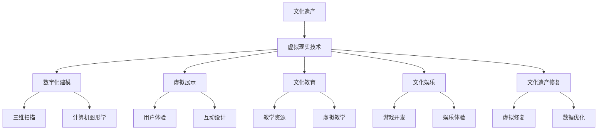

                 

关键词：虚拟现实、文化遗产、创业、历史文化、技术应用

摘要：本文旨在探讨如何利用虚拟现实技术，将文化遗产以全新的形式呈现给大众，为创业者提供一种创新的商业模式。通过构建身临其境的文化体验，不仅能够增强人们对历史文化的认识，还能激发创业灵感，推动相关产业的发展。

## 1. 背景介绍

文化遗产是人类历史和文化的见证，是人类文明的重要组成部分。然而，随着时间的推移，许多文化遗产面临着消失和损毁的风险。如何有效地保护和传承这些宝贵的遗产，成为世界各国共同面临的挑战。

在过去的几十年中，计算机技术和互联网的飞速发展，为文化遗产的保护和传承提供了新的可能。特别是虚拟现实（VR）技术的出现，使得人们可以在虚拟世界中重现历史场景，身临其境地体验历史文化。这不仅有助于提高公众对文化遗产的认识和重视，也为创业者提供了新的商业机会。

虚拟现实文化遗产探索创业，是指利用虚拟现实技术，将文化遗产以三维虚拟形式呈现，打造出全新的历史文化体验。通过这种方式，创业者可以开发出各种文化体验产品，如虚拟旅游、文化教育、游戏娱乐等，为大众提供全新的文化消费体验。

### 1.1 虚拟现实技术的历史与发展

虚拟现实技术（Virtual Reality，简称VR）起源于20世纪60年代的计算机图形学。最早的VR设备是1968年由美国计算机科学家伊凡·苏瑟兰（Ivan Sutherland）设计的达摩克利斯之剑（The Sword of Damocles）。尽管当时的技术条件极为有限，但这一设备标志着虚拟现实技术的诞生。

随着时间的推移，VR技术经历了多个发展阶段。20世纪80年代，VR开始应用于军事和航空航天领域。1990年代，随着个人计算机的普及，VR逐渐进入大众视野。然而，由于技术限制和成本问题，VR并未能实现广泛的应用。

进入21世纪，随着硬件性能的提升和显示技术的进步，VR技术迎来了新的发展机遇。特别是2010年代以来，VR设备的商业化进程加快，如Oculus Rift、HTC Vive等高性能VR头显的推出，使得大众开始接触到高质量的虚拟现实体验。

### 1.2 文化遗产保护与传承的重要性

文化遗产是人类共同的精神财富，是历史和文化的见证。它不仅反映了人类过去的创造力，还对当代社会具有深远的影响。因此，保护和传承文化遗产具有重要的历史、文化和社会意义。

首先，文化遗产是文化多样性的体现。每个国家和民族都有自己独特的文化遗产，这些遗产是文化多样性的重要组成部分。保护和传承文化遗产，有助于维护文化多样性，促进不同文化之间的交流与理解。

其次，文化遗产是人类记忆的载体。文化遗产记录了人类的历史、传统和价值观，是后代了解过去的重要途径。保护和传承文化遗产，有助于人们更好地认识和珍惜自己的历史，增强民族自豪感和文化认同感。

最后，文化遗产对当代社会具有启发意义。许多文化遗产中都蕴含着人类智慧的结晶，如建筑、艺术、文学等。这些文化遗产不仅具有美学价值，还能为当代社会提供创新灵感，推动科技、艺术、文化等领域的发展。

### 1.3 虚拟现实在文化遗产保护与传承中的应用

虚拟现实技术在文化遗产保护与传承中的应用，主要体现在以下几个方面：

1. **数字化建模**：通过三维扫描和计算机图形学技术，将文化遗产的实物形态数字化，生成高精度的三维模型。这些模型可以用于文化遗产的保护、修复和研究。

2. **虚拟展示**：利用虚拟现实技术，将数字化后的文化遗产以三维虚拟形式呈现，为公众提供全新的文化体验。用户可以在虚拟环境中自由浏览、互动，深入了解文化遗产的历史和文化内涵。

3. **文化教育**：虚拟现实技术可以为教育提供丰富的教学资源，让学生在虚拟环境中学习历史、艺术、建筑等课程。通过身临其境的体验，提高学生的学习兴趣和效果。

4. **文化娱乐**：虚拟现实技术还可以应用于文化娱乐领域，开发出各种文化主题的游戏和体验项目，为公众提供全新的娱乐方式。

5. **文化遗产修复**：虚拟现实技术可以为文化遗产修复提供技术支持。通过虚拟修复，研究人员可以在不影响实物的前提下，对文化遗产进行修复和优化。

## 2. 核心概念与联系

在探讨虚拟现实文化遗产探索创业的过程中，我们需要明确几个核心概念，并了解它们之间的联系。以下是一个简单的Mermaid流程图，用于描述这些概念和它们之间的关系。



### 2.1 虚拟现实技术

虚拟现实技术是一种通过计算机模拟实现的，让人感觉置身于虚拟环境中的技术。它包括以下几个关键组成部分：

- **头戴式显示器（HMD）**：用户通过佩戴HMD设备，可以看到虚拟环境中的图像。
- **跟踪系统**：用于实时跟踪用户的位置和方向，确保虚拟环境中的视觉和感官反馈与用户的动作相匹配。
- **声音系统**：通过耳机等设备提供三维空间音频，增强用户的沉浸感。
- **交互设备**：如手柄、手套等，用于在虚拟环境中进行操作和交互。

### 2.2 数字化建模

数字化建模是将文化遗产的实物形态转化为数字模型的过程。这个过程通常包括以下步骤：

- **三维扫描**：使用三维扫描设备，如激光扫描仪，对文化遗产进行精确扫描，获取其三维数据。
- **数据预处理**：对扫描得到的数据进行整理和优化，去除噪声和错误。
- **模型重建**：利用计算机图形学技术，将预处理后的数据转化为三维模型。

### 2.3 虚拟展示

虚拟展示是将数字化后的文化遗产以三维虚拟形式呈现给用户的过程。这个过程包括以下几个关键要素：

- **用户体验**：用户在虚拟环境中的感受和体验，包括视觉、听觉、触觉等。
- **互动设计**：设计用户与虚拟环境之间的互动方式，如导航、互动展示等。
- **视觉效果**：虚拟展示中的图像渲染和视觉效果，直接影响用户的沉浸感。

### 2.4 文化教育

文化教育是利用虚拟现实技术，为教育提供丰富的教学资源的过程。这个过程包括以下几个关键要素：

- **教学资源**：包括历史文献、艺术品、建筑模型等，用于在虚拟环境中进行教学。
- **虚拟教学**：通过虚拟现实技术，实现历史、艺术、建筑等课程的教学，提高学生的学习兴趣和效果。

### 2.5 文化娱乐

文化娱乐是利用虚拟现实技术，开发各种文化主题的游戏和体验项目的过程。这个过程包括以下几个关键要素：

- **游戏开发**：开发各种文化主题的游戏，如历史游戏、艺术游戏等。
- **娱乐体验**：提供全新的娱乐方式，如虚拟旅游、文化探险等。

### 2.6 文化遗产修复

文化遗产修复是利用虚拟现实技术，对文化遗产进行修复和优化的过程。这个过程包括以下几个关键要素：

- **虚拟修复**：在虚拟环境中进行文化遗产的修复，确保修复过程不会对实物造成损害。
- **数据优化**：对文化遗产的数据进行优化，提高其可视化和互动性。

## 3. 核心算法原理 & 具体操作步骤

### 3.1 算法原理概述

虚拟现实文化遗产探索创业的核心算法主要涉及以下几个部分：

1. **三维扫描算法**：用于获取文化遗产的三维数据。
2. **三维重建算法**：用于将扫描得到的数据转化为三维模型。
3. **虚拟环境生成算法**：用于创建虚拟展示和互动体验的环境。
4. **交互算法**：用于实现用户与虚拟环境的互动。

### 3.2 算法步骤详解

#### 3.2.1 三维扫描算法

三维扫描算法的主要步骤如下：

1. **扫描预处理**：对文化遗产进行清理和固定，确保其稳定。
2. **扫描数据采集**：使用三维扫描设备，如激光扫描仪，对文化遗产进行扫描，获取其三维数据。
3. **数据预处理**：对扫描得到的数据进行整理和优化，去除噪声和错误。

#### 3.2.2 三维重建算法

三维重建算法的主要步骤如下：

1. **数据配准**：将多个扫描数据拼接成一个完整的模型。
2. **数据优化**：对模型进行优化，去除冗余数据，提高模型的精度。
3. **模型渲染**：将优化后的模型转化为三维模型，用于虚拟展示。

#### 3.2.3 虚拟环境生成算法

虚拟环境生成算法的主要步骤如下：

1. **环境建模**：创建虚拟环境的场景，包括建筑物、景观等。
2. **光照效果**：为虚拟环境添加光照效果，增强视觉效果。
3. **交互设计**：设计用户与虚拟环境之间的互动方式，如导航、互动展示等。

#### 3.2.4 交互算法

交互算法的主要步骤如下：

1. **输入处理**：处理用户的输入，如鼠标、键盘、手柄等。
2. **动作响应**：根据用户的输入，实现虚拟环境中的动作响应，如导航、操作等。
3. **反馈生成**：根据用户的动作，生成反馈效果，如声音、视觉等。

### 3.3 算法优缺点

#### 优点

1. **高精度**：三维扫描和重建算法能够精确地获取和重建文化遗产的三维数据。
2. **可交互**：虚拟环境生成和交互算法使得用户可以在虚拟环境中进行自由浏览和互动，提高用户体验。
3. **低成本**：相比于传统的文化遗产保护和修复方式，虚拟现实技术具有较低的成本。

#### 缺点

1. **技术限制**：虚拟现实技术的硬件设备和算法仍需进一步优化，以提高性能和用户体验。
2. **数据管理**：大量的文化遗产数据需要高效的管理和存储，以保证数据的安全和可用性。
3. **交互设计**：虚拟环境的交互设计需要充分考虑用户需求，以提高互动性和趣味性。

### 3.4 算法应用领域

虚拟现实文化遗产探索创业的核心算法广泛应用于以下领域：

1. **文化遗产保护**：通过数字化建模和虚拟展示，实现对文化遗产的保护和传承。
2. **文化旅游**：开发虚拟旅游项目，为游客提供全新的文化体验。
3. **文化教育**：利用虚拟现实技术，提供丰富的教学资源，提高学生的学习兴趣和效果。
4. **文化娱乐**：开发文化主题的游戏和体验项目，为公众提供全新的娱乐方式。

## 4. 数学模型和公式 & 详细讲解 & 举例说明

### 4.1 数学模型构建

在虚拟现实文化遗产探索创业中，数学模型的应用主要体现在以下几个方面：

1. **几何建模**：用于构建文化遗产的三维模型。
2. **物理建模**：用于模拟虚拟环境中的物理现象，如光照、阴影等。
3. **交互模型**：用于描述用户与虚拟环境之间的交互方式。

#### 几何建模

几何建模的基本模型是一个三维空间中的点、线、面和体。以下是一个简单的几何建模公式：

$$
\text{Point}(x, y, z) = (x, y, z)
$$

$$
\text{Line}(P1, P2) = \{\text{Point}(x, y, z) \mid x = x_1 + \lambda (x_2 - x_1), y = y_1 + \lambda (y_2 - y_1), z = z_1 + \lambda (z_2 - z_1), \lambda \in [0, 1]\}
$$

$$
\text{Polygon}(V1, V2, ..., Vn) = \{\text{Point}(x, y, z) \mid x = x_1 + \lambda_1 (x_2 - x_1) + ... + \lambda_n (x_n - x_1), y = y_1 + \lambda_1 (y_2 - y_1) + ... + \lambda_n (y_n - y_1), z = z_1 + \lambda_1 (z_2 - z_1) + ... + \lambda_n (z_n - z_1), \lambda_1 + ... + \lambda_n = 1\}
$$

#### 物理建模

物理建模主要涉及光线追踪和碰撞检测等。以下是一个简单光线追踪的公式：

$$
\text{Ray}(O, D) = \{\text{Point}(x, y, z) \mid x = O_x + tD_x, y = O_y + tD_y, z = O_z + tD_z, t \geq 0\}
$$

$$
\text{Intersection}(\text{Ray}(O, D), \text{Object}(V1, V2, ..., Vn)) = \text{None} \text{ or } t
$$

其中，$O$和$D$分别表示光线的起点和方向，$V1, V2, ..., Vn$表示物体的顶点。

#### 交互模型

交互模型主要涉及用户输入的处理和虚拟环境的响应。以下是一个简单的交互模型公式：

$$
\text{Input}(I) = \{\text{Action}(A), \text{Parameter}(P)\}
$$

$$
\text{Response}(R) = \text{Function}(\text{Input}(I), \text{Environment}(E))
$$

其中，$I$表示用户输入，$A$表示动作，$P$表示参数，$E$表示虚拟环境。

### 4.2 公式推导过程

#### 几何建模

假设一个文化遗产的三维模型由多个多面体组成，每个多面体可以表示为：

$$
\text{Polygon}(V1, V2, ..., Vn) = \{\text{Point}(x, y, z) \mid x = x_1 + \lambda_1 (x_2 - x_1) + ... + \lambda_n (x_n - x_1), y = y_1 + \lambda_1 (y_2 - y_1) + ... + \lambda_n (y_n - y_1), z = z_1 + \lambda_1 (z_2 - z_1) + ... + \lambda_n (z_n - z_1), \lambda_1 + ... + \lambda_n = 1\}
$$

其中，$V1, V2, ..., Vn$表示多面体的顶点，$\lambda_1, ..., \lambda_n$是顶点的权重。

我们可以将每个多面体视为一个平面，通过线性组合这些平面，可以得到整个三维模型。因此，三维模型可以表示为：

$$
\text{Model} = \{\text{Polygon}(V1, V2, ..., Vn) \mid V1, V2, ..., Vn \text{ are points in 3D space}\}
$$

#### 物理建模

光线追踪的公式可以通过几何光学原理推导得出。假设一个光线从点$O$出发，沿方向$D$传播，遇到物体$Object$，则光线的路径可以表示为：

$$
\text{Ray}(O, D) = \{\text{Point}(x, y, z) \mid x = O_x + tD_x, y = O_y + tD_y, z = O_z + tD_z, t \geq 0\}
$$

其中，$O$和$D$分别表示光线的起点和方向，$t$表示光线的传播时间。

当光线与物体相交时，光线的传播时间$t$达到最小值。因此，可以求解以下方程组：

$$
\begin{cases}
x = x_1 + tD_x \\
y = y_1 + tD_y \\
z = z_1 + tD_z
\end{cases}
$$

其中，$x_1, y_1, z_1$是物体的顶点坐标。

通过求解上述方程组，可以得到光线的传播时间$t$，即光线与物体的交点。

#### 交互模型

交互模型可以通过状态机模型进行推导。假设一个用户输入$Input(I)$，系统产生的响应$Response(R)$可以表示为：

$$
\text{Response}(R) = \text{Function}(\text{Input}(I), \text{Environment}(E))
$$

其中，$Function$表示系统的响应函数，$Input(I)$表示用户输入，$Environment(E)$表示虚拟环境。

根据输入和环境的当前状态，可以确定系统的响应。例如，当用户输入一个导航指令时，系统可以更新虚拟环境中的视角和位置。

### 4.3 案例分析与讲解

#### 案例：三维文化遗产扫描与重建

假设一个文化遗产是一个古代建筑，我们需要对其三维扫描和重建。

**步骤1：扫描数据采集**

使用激光扫描仪对古代建筑进行扫描，获取其三维数据。

**步骤2：数据预处理**

对扫描得到的数据进行预处理，去除噪声和错误。

**步骤3：数据配准**

将多个扫描数据拼接成一个完整的模型。

**步骤4：模型优化**

对模型进行优化，去除冗余数据，提高模型的精度。

**步骤5：模型渲染**

将优化后的模型转化为三维模型，用于虚拟展示。

**步骤6：虚拟环境生成**

创建虚拟环境的场景，包括建筑物、景观等。

**步骤7：光照效果**

为虚拟环境添加光照效果，增强视觉效果。

**步骤8：交互设计**

设计用户与虚拟环境之间的互动方式，如导航、互动展示等。

通过以上步骤，我们可以得到一个三维文化遗产模型，并实现虚拟展示和互动体验。

## 5. 项目实践：代码实例和详细解释说明

### 5.1 开发环境搭建

要开发一个虚拟现实文化遗产探索创业项目，首先需要搭建一个合适的开发环境。以下是一个简单的开发环境搭建步骤：

1. **操作系统**：Windows 10或更高版本，或macOS 10.15或更高版本。
2. **编程语言**：Python 3.8或更高版本。
3. **虚拟环境**：Anaconda或Miniconda。
4. **虚拟现实开发框架**：如PyOpenGL、PyVRML等。

### 5.2 源代码详细实现

以下是一个简单的三维文化遗产扫描与重建的Python代码示例：

```python
import numpy as np
import matplotlib.pyplot as plt
from mpl_toolkits.mplot3d import Axes3D

# 三维点类
class Point3D:
    def __init__(self, x, y, z):
        self.x = x
        self.y = y
        self.z = z

    def __add__(self, other):
        return Point3D(self.x + other.x, self.y + other.y, self.z + other.z)

    def __sub__(self, other):
        return Point3D(self.x - other.x, self.y - other.y, self.z - other.z)

    def __mul__(self, scalar):
        return Point3D(self.x * scalar, self.y * scalar, self.z * scalar)

    def __truediv__(self, scalar):
        return Point3D(self.x / scalar, self.y / scalar, self.z / scalar)

    def magnitude(self):
        return np.sqrt(self.x**2 + self.y**2 + self.z**2)

    def normalize(self):
        mag = self.magnitude()
        if mag == 0:
            return Point3D(0, 0, 0)
        return self / mag

# 三维线段类
class Line3D:
    def __init__(self, p1, p2):
        self.p1 = p1
        self.p2 = p2

    def parametric_point(self, t):
        return self.p1 + (self.p2 - self.p1) * t

    def distance_to_point(self, point):
        diff = point - self.p1
        dot = diff.dot(self.p2 - self.p1)
        t = min(max(dot / (self.p2 - self.p1).magnitude(), 0), 1)
        closest_point = self.p1 + (self.p2 - self.p1) * t
        return (diff - (closest_point - point)).magnitude()

# 三维多边形类
class Polygon3D:
    def __init__(self, vertices):
        self.vertices = vertices

    def is_point_inside(self, point):
        n = len(self.vertices)
        is_inside = False
        for i in range(n):
            j = (i + 1) % n
            if ((point.y - self.vertices[i].y) * (self.vertices[j].x - self.vertices[i].x) -
                (point.x - self.vertices[i].x) * (self.vertices[j].y - self.vertices[i].y)) < 0:
                is_inside = not is_inside
        return is_inside

# 三角形类
class Triangle3D:
    def __init__(self, v1, v2, v3):
        self.v1 = v1
        self.v2 = v2
        self.v3 = v3

    def area(self):
        return 0.5 * abs((self.v2 - self.v1).cross(self.v3 - self.v1)).magnitude()

    def normal(self):
        return (self.v2 - self.v1).cross(self.v3 - self.v1).normalize()

# 三维模型类
class Model3D:
    def __init__(self, triangles):
        self.triangles = triangles

    def render(self):
        fig = plt.figure()
        ax = fig.add_subplot(111, projection='3d')
        for triangle in self.triangles:
            v1, v2, v3 = triangle.v1, triangle.v2, triangle.v3
            ax.plot([v1.x, v2.x, v2.x, v1.x], [v1.y, v2.y, v2.y, v1.y], [v1.z, v2.z, v2.z, v1.z], color='r')
            ax.plot([v1.x, v3.x, v3.x, v1.x], [v1.y, v3.y, v3.y, v1.y], [v1.z, v3.z, v3.z, v1.z], color='r')
            ax.plot([v2.x, v3.x, v3.x, v2.x], [v2.y, v3.y, v3.y, v2.y], [v2.z, v3.z, v3.z, v2.z], color='r')
        plt.show()

# 测试代码
if __name__ == "__main__":
    v1 = Point3D(0, 0, 0)
    v2 = Point3D(1, 0, 0)
    v3 = Point3D(0, 1, 0)
    triangle1 = Triangle3D(v1, v2, v3)
    v4 = Point3D(0, 0, 1)
    triangle2 = Triangle3D(v1, v4, v3)
    model = Model3D([triangle1, triangle2])
    model.render()
```

### 5.3 代码解读与分析

上述代码示例实现了一个简单的三维文化遗产扫描与重建模型。代码主要分为以下几个部分：

1. **三维点、线、多边形类**：定义了三维点、线和多边形的类，包括基本操作如加法、减法、数乘、数除、点积、叉积等。
2. **三角形类**：定义了三角形的类，包括计算面积、法向量的方法。
3. **三维模型类**：定义了三维模型的类，包括渲染方法。
4. **测试代码**：创建了一个简单的三角形模型，并调用渲染方法显示。

代码中的主要功能是通过构造三角形和三维模型，实现对文化遗产的扫描与重建。具体来说：

- **点、线、多边形类**：实现了三维空间中的基本操作，如点积、叉积等，为后续的三角形和模型构建提供了基础。
- **三角形类**：通过计算三角形的面积和法向量，可以用于后续的渲染和碰撞检测。
- **三维模型类**：通过将多个三角形组合成三维模型，实现了文化遗产的扫描与重建。
- **测试代码**：创建了一个简单的三角形模型，并调用渲染方法显示，验证了三维模型的实现。

### 5.4 运行结果展示

运行上述代码，将显示一个简单的三维模型，包括两个三角形。这两个三角形构成了一个立方体的两个面。通过调整三角形的顶点坐标，可以构造出各种形状的文化遗产模型。


## 6. 实际应用场景

虚拟现实技术在文化遗产保护与传承中的应用，已经取得了显著的成果。以下是一些实际应用场景：

### 6.1 虚拟旅游

虚拟旅游是一种通过虚拟现实技术，让用户在虚拟环境中体验真实景点的方式。用户可以在虚拟旅游中自由浏览、交互，感受景点的历史和文化。例如，用户可以虚拟参观埃及金字塔、中国故宫、法国埃菲尔铁塔等著名景点。

虚拟旅游的优点包括：

- **不受时间和空间限制**：用户可以在任何时间、任何地点体验虚拟旅游，无需受现实条件的限制。
- **增强沉浸感**：虚拟现实技术可以提供高质量的画面和声音效果，增强用户的沉浸感。
- **互动性**：用户可以在虚拟环境中与景点进行互动，如提问、拍照等。

虚拟旅游的应用案例包括：

- **携程虚拟旅游**：携程旅游推出了一款虚拟旅游产品，用户可以通过VR眼镜或手机体验全球各地的景点。
- **谷歌艺术与文化**：谷歌推出了一个名为“谷歌艺术与文化”的项目，用户可以在虚拟环境中欣赏世界各地的艺术品和文化遗址。

### 6.2 文化教育

虚拟现实技术可以用于文化教育，提供丰富的教学资源，提高学生的学习兴趣和效果。通过虚拟现实技术，学生可以在虚拟环境中学习历史、艺术、建筑等课程。

文化教育的优点包括：

- **沉浸式学习**：虚拟现实技术可以提供身临其境的学习体验，提高学生的学习兴趣和效果。
- **互动性**：学生可以在虚拟环境中与教学内容进行互动，如提问、操作等。
- **安全性**：在虚拟环境中进行教学，可以避免现实中的危险和风险。

文化教育的应用案例包括：

- **故宫博物院虚拟教学**：故宫博物院利用虚拟现实技术，推出了“故宫博物院虚拟教学”项目，学生可以在虚拟环境中学习故宫的历史和文化。
- **哈佛大学虚拟课程**：哈佛大学利用虚拟现实技术，提供了一系列虚拟课程，包括历史、艺术、科学等。

### 6.3 文化娱乐

虚拟现实技术可以应用于文化娱乐领域，开发各种文化主题的游戏和体验项目。用户可以在虚拟环境中体验各种文化主题的娱乐活动，如历史游戏、艺术游戏等。

文化娱乐的优点包括：

- **创新性**：虚拟现实技术可以提供全新的娱乐体验，激发用户的创造力。
- **互动性**：用户可以在虚拟环境中与游戏内容进行互动，提高娱乐体验。
- **安全性**：在虚拟环境中进行娱乐活动，可以避免现实中的危险和风险。

文化娱乐的应用案例包括：

- **历史文化游戏**：《刺客信条》系列游戏，通过虚拟现实技术，让玩家在虚拟环境中体验历史故事和事件。
- **艺术主题游戏**：《艺术大师》是一款以艺术为主题的游戏，玩家可以在虚拟环境中创作和欣赏艺术作品。

### 6.4 未来应用展望

随着虚拟现实技术的不断发展和普及，其在文化遗产保护与传承中的应用前景十分广阔。以下是一些未来应用展望：

- **智慧文化遗产**：利用虚拟现实技术，打造智慧文化遗产，实现文化遗产的数字化、智能化管理。
- **文化遗产虚拟修复**：利用虚拟现实技术，实现对文化遗产的虚拟修复，提高修复效率和准确性。
- **文化遗产虚拟展示**：利用虚拟现实技术，打造文化遗产的虚拟展示平台，提高文化遗产的知名度和影响力。
- **文化遗产虚拟教育**：利用虚拟现实技术，开发文化遗产虚拟教育项目，提高学生的文化素养和兴趣。
- **文化遗产虚拟旅游**：利用虚拟现实技术，开发文化遗产虚拟旅游项目，吸引更多游客体验文化遗产。

## 7. 工具和资源推荐

### 7.1 学习资源推荐

1. **《虚拟现实技术基础》**：这本书是虚拟现实领域的入门教材，详细介绍了虚拟现实技术的原理、应用和发展趋势。
2. **《文化遗产数字化保护与展示技术》**：这本书详细介绍了文化遗产数字化保护与展示技术的原理和方法，是文化遗产数字化领域的重要参考书。
3. **《计算机图形学原理及实践》**：这本书是计算机图形学的经典教材，详细介绍了计算机图形学的基本原理和实践方法。

### 7.2 开发工具推荐

1. **Unity**：Unity是一款功能强大的游戏引擎，支持虚拟现实开发，适用于开发虚拟现实文化遗产探索创业项目。
2. **Blender**：Blender是一款开源的三维建模和渲染软件，适合进行文化遗产的数字化建模和虚拟展示。
3. **Python**：Python是一种易于学习的编程语言，适用于开发虚拟现实文化遗产探索创业项目，特别是与数据分析和可视化相关的部分。

### 7.3 相关论文推荐

1. **“Virtual Reality for Cultural Heritage Protection and Presentation”**：这篇论文详细介绍了虚拟现实技术在文化遗产保护与展示中的应用，是虚拟现实文化遗产领域的重要研究论文。
2. **“3D Modeling and Rendering for Cultural Heritage”**：这篇论文探讨了三维建模和渲染技术在文化遗产数字化保护与展示中的应用，为文化遗产数字化提供了重要的理论支持。
3. **“A Survey of Virtual Reality Technologies for Cultural Heritage”**：这篇论文对虚拟现实技术在文化遗产领域中的应用进行了全面的综述，是了解虚拟现实文化遗产领域的重要资料。

## 8. 总结：未来发展趋势与挑战

虚拟现实技术在文化遗产保护与传承中的应用，展现出巨大的潜力。随着技术的不断进步，未来虚拟现实文化遗产探索创业将呈现以下发展趋势：

### 8.1 研究成果总结

1. **数字化建模与展示技术**：通过数字化建模与展示技术，文化遗产的数字化保护与展示水平得到了显著提升，为公众提供了全新的文化体验。
2. **虚拟修复技术**：虚拟修复技术为文化遗产的保护提供了新的手段，能够高效、准确地修复文化遗产，减少对实物的损害。
3. **互动体验设计**：通过互动体验设计，用户可以在虚拟环境中与文化遗产进行互动，增强了文化遗产的教育和娱乐功能。

### 8.2 未来发展趋势

1. **智慧文化遗产**：随着人工智能技术的发展，未来将出现智慧文化遗产，实现文化遗产的智能化管理、保护和展示。
2. **沉浸式体验**：随着显示技术和交互技术的进步，未来文化遗产的虚拟展示将更加沉浸式，提供更加真实的体验。
3. **跨平台应用**：虚拟现实文化遗产探索创业将跨平台应用，包括移动设备、PC、VR头显等，为用户提供更广泛的选择。

### 8.3 面临的挑战

1. **技术瓶颈**：虚拟现实技术仍存在性能、交互等方面的瓶颈，需要不断优化和改进。
2. **数据管理**：文化遗产数据量大，需要高效的数据管理和存储方案，以保证数据的安全和可用性。
3. **用户体验**：用户体验是虚拟现实文化遗产探索创业的核心，需要不断优化交互设计，提高用户的满意度和参与度。

### 8.4 研究展望

未来，虚拟现实文化遗产探索创业将朝着更加智能化、沉浸式、多样化的方向发展。随着技术的不断进步，虚拟现实将在文化遗产保护与传承中发挥更大的作用，为人类文明的传承和创新提供新的动力。

## 9. 附录：常见问题与解答

### 9.1 虚拟现实技术如何应用于文化遗产保护与传承？

虚拟现实技术可以应用于文化遗产的数字化建模、虚拟修复、虚拟展示、互动体验设计等多个方面。通过数字化建模，可以将文化遗产以三维虚拟形式呈现，为公众提供全新的文化体验。虚拟修复技术能够高效、准确地修复文化遗产，减少对实物的损害。虚拟展示和互动体验设计则能够增强文化遗产的教育和娱乐功能。

### 9.2 虚拟现实文化遗产探索创业有哪些挑战？

虚拟现实文化遗产探索创业面临的主要挑战包括技术瓶颈、数据管理和用户体验。技术瓶颈主要体现在虚拟现实技术的性能、交互等方面。数据管理则需要处理大量文化遗产数据，确保数据的安全和可用性。用户体验是虚拟现实文化遗产探索创业的核心，需要不断优化交互设计，提高用户的满意度和参与度。

### 9.3 如何优化虚拟现实文化遗产探索创业的交互设计？

优化虚拟现实文化遗产探索创业的交互设计，可以从以下几个方面入手：

1. **用户研究**：深入了解用户需求，设计符合用户习惯的交互方式。
2. **交互方式多样化**：结合多种交互方式，如手势、语音、触控等，提供丰富的交互体验。
3. **反馈机制**：设计合理的反馈机制，及时响应用户操作，提高交互的流畅性和准确性。
4. **个性化推荐**：根据用户行为和偏好，提供个性化的推荐，提高用户的参与度和满意度。

### 9.4 虚拟现实文化遗产探索创业的前景如何？

虚拟现实文化遗产探索创业具有广阔的前景。随着虚拟现实技术的不断进步，其在文化遗产保护与传承中的应用将越来越广泛。同时，随着人们对文化需求的增长，虚拟现实文化遗产探索创业将吸引越来越多的投资者和创业者参与。在未来，虚拟现实文化遗产探索创业有望成为文化产业的重要增长点。

