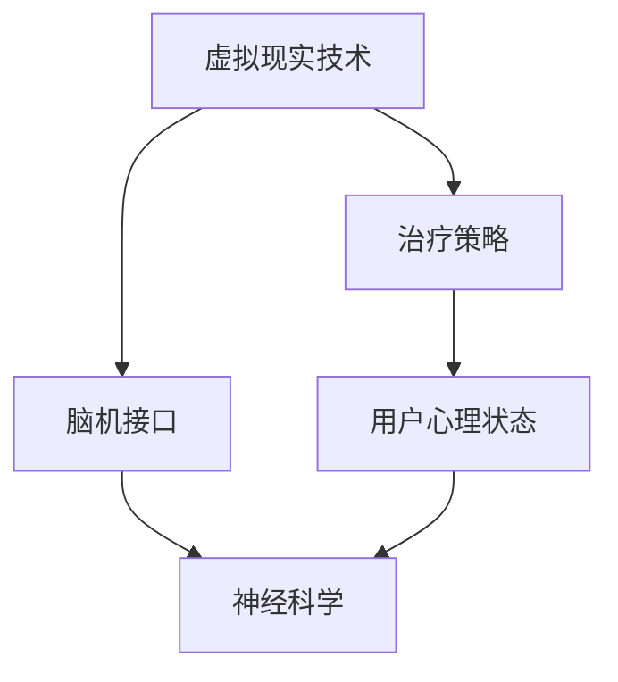

                 

关键词：虚拟现实治疗，心理健康，神经科学，技术应用，脑机接口，算法优化，医疗技术，AI算法，数据处理，用户体验，未来展望

> 摘要：随着科技的不断进步，虚拟现实（VR）技术在心理健康领域中的应用越来越受到关注。本文将探讨虚拟现实治疗（VR Therapy）的概念、核心技术、应用场景及其在神经科学和心理健康领域的重要作用。此外，本文还将分析VR治疗在当前面临的挑战，以及未来的发展趋势。

## 1. 背景介绍

在过去的几十年里，心理健康问题逐渐成为全球关注的焦点。焦虑、抑郁、创伤后应激障碍（PTSD）、恐惧症等心理疾病不仅影响个人的生活质量，也对社会的稳定和经济发展带来了巨大的压力。传统的心理治疗方法，如药物治疗和心理咨询，虽然在一定程度上能够缓解症状，但效果有限，且患者往往需要较长的治疗周期。随着技术的进步，尤其是虚拟现实技术的发展，为心理健康领域带来了一种全新的治疗方法——虚拟现实治疗。

虚拟现实治疗是一种利用计算机生成的人工环境，通过头戴式显示器（HMD）、传感器和其他设备，让用户沉浸在虚拟世界中。在这种环境中，患者可以进行一系列有针对性的心理训练和治疗。与传统治疗方法相比，VR治疗具有沉浸感强、互动性好、安全性高等优点，为患者提供了一种新颖、有效的心理治疗方式。

## 2. 核心概念与联系

虚拟现实治疗的核心概念包括虚拟现实技术、神经科学和脑机接口技术。以下是一个简化的Mermaid流程图，展示了这些核心概念之间的联系。



### 2.1 虚拟现实技术

虚拟现实技术是虚拟现实治疗的基石。它利用计算机图形学和传感器技术，创建一个模拟的三维环境，让用户在其中进行交互。虚拟现实技术包括以下几个关键组成部分：

- **头戴式显示器（HMD）**：为用户提供沉浸式的视觉体验。
- **传感器**：如动作捕捉器和位置追踪器，用于监测用户的动作和位置。
- **声音系统**：通过立体声或虚拟现实音频技术，为用户创造空间感和声音效果。
- **交互设备**：如手持控制器、手套等，让用户能够与虚拟环境进行互动。

### 2.2 神经科学

神经科学是理解心理疾病和开发治疗策略的重要基础。它研究大脑的结构和功能，以及神经信号传递的过程。在VR治疗中，神经科学家利用脑成像技术、神经电生理技术等，研究大脑在虚拟环境中的反应和变化。这些研究结果为设计有效的VR治疗方案提供了科学依据。

### 2.3 脑机接口

脑机接口（BMI）是一种直接将大脑信号转换为计算机指令的技术。在VR治疗中，脑机接口技术可以实时监测患者的脑活动，将其转换为虚拟环境中的动作。这种技术为VR治疗提供了更精确的控制，使患者能够更好地适应和参与治疗过程。

## 3. 核心算法原理 & 具体操作步骤

### 3.1 算法原理概述

虚拟现实治疗的核心算法主要包括以下几个方面：

- **环境模拟**：利用计算机图形学技术，创建一个逼真的虚拟环境。
- **用户交互**：通过传感器和交互设备，实现用户与虚拟环境的互动。
- **脑活动监测**：利用脑机接口技术，实时监测用户的脑活动。
- **数据分析和反馈**：对监测到的脑活动数据进行处理和分析，为治疗策略提供反馈。

### 3.2 算法步骤详解

虚拟现实治疗的具体操作步骤如下：

1. **环境设置**：根据患者的具体症状和治疗需求，设计一个虚拟环境。这个环境可以是室内、室外，甚至是虚拟的奇幻世界。
2. **设备准备**：为患者准备头戴式显示器、传感器和交互设备，并确保其正确佩戴和连接。
3. **用户训练**：在治疗过程中，患者需要学会如何与虚拟环境进行互动。例如，如何移动、如何操作虚拟物品等。
4. **脑活动监测**：利用脑机接口技术，实时监测患者的脑活动。这些数据将被用来分析和调整治疗策略。
5. **数据分析**：对监测到的脑活动数据进行处理和分析，以了解患者的心理状态和治疗反应。
6. **反馈调整**：根据数据分析结果，对治疗策略进行调整，以提高治疗效果。

### 3.3 算法优缺点

虚拟现实治疗算法具有以下几个优点：

- **沉浸感强**：通过虚拟现实技术，患者可以体验到高度沉浸式的心理治疗环境，有助于提高治疗效果。
- **互动性好**：患者可以在虚拟环境中进行互动，有助于增强治疗过程中的参与感和动机。
- **安全性高**：虚拟现实治疗相对于传统的心理治疗方法，风险较低，患者可以在安全的环境中接受治疗。

然而，虚拟现实治疗也存在一些缺点：

- **技术门槛较高**：虚拟现实技术和脑机接口技术较为复杂，需要专业的技术人员进行操作和维护。
- **患者适应性**：部分患者可能对虚拟现实技术不适应，需要额外的培训和指导。

### 3.4 算法应用领域

虚拟现实治疗在以下几个领域具有广泛的应用前景：

- **心理健康治疗**：如焦虑、抑郁、恐惧症、PTSD等心理疾病的辅助治疗。
- **康复治疗**：如中风、脑损伤等康复训练，帮助患者恢复肢体功能和认知能力。
- **教育培训**：利用虚拟现实技术，进行安全、高效的技能培训和心理教育。

## 4. 数学模型和公式 & 详细讲解 & 举例说明

虚拟现实治疗中的数学模型和公式主要用于脑活动数据的处理和分析。以下是一个简单的数学模型示例，用于描述脑电信号（EEG）的特征。

### 4.1 数学模型构建

脑电信号（EEG）是一种生物电信号，可以通过传感器记录下来。假设我们使用一个简单的滤波器模型来提取EEG信号中的特定频率成分，我们可以使用以下公式：

$$
y(t) = H(f) \cdot x(t)
$$

其中，$y(t)$ 是滤波后的信号，$x(t)$ 是原始信号，$H(f)$ 是滤波器的频率响应函数。

### 4.2 公式推导过程

滤波器的频率响应函数 $H(f)$ 可以通过以下公式推导：

$$
H(f) = \frac{1}{1 + \frac{f^2}{f_c^2}}
$$

其中，$f_c$ 是滤波器的中心频率。

### 4.3 案例分析与讲解

假设我们想要提取EEG信号中的$\alpha$频段（8-12 Hz），我们可以将滤波器的中心频率设置为10 Hz。使用上述公式，我们可以计算出滤波器的频率响应函数：

$$
H(f) = \frac{1}{1 + \frac{f^2}{10^2}}
$$

然后，我们可以将这个滤波器应用于EEG信号，以提取$\alpha$频段：

$$
y(t) = \frac{1}{1 + \frac{t^2}{10^2}} \cdot x(t)
$$

在这个例子中，$x(t)$ 是原始EEG信号，$y(t)$ 是滤波后的信号。通过这种方式，我们可以从复杂的EEG信号中提取出有意义的频率成分，为后续的分析提供基础。

## 5. 项目实践：代码实例和详细解释说明

为了更好地理解虚拟现实治疗中的算法原理，我们将使用Python编程语言实现一个简单的VR治疗环境。以下是一个简化的代码实例，用于创建一个虚拟环境，并实现基本的用户交互。

### 5.1 开发环境搭建

首先，我们需要搭建一个Python开发环境。以下是所需的基本步骤：

1. 安装Python 3.x版本。
2. 安装虚拟环境管理工具，如virtualenv或conda。
3. 创建一个虚拟环境，并安装必要的库，如PyOpenGL、Pygame等。

```bash
# 创建虚拟环境
virtualenv vrt_env
# 激活虚拟环境
source vrt_env/bin/activate
# 安装库
pip install pygame opengl
```

### 5.2 源代码详细实现

以下是一个简单的Python代码示例，用于创建一个虚拟环境并实现用户交互。

```python
import pygame
from pygame.locals import *
from OpenGL.GL import *
from OpenGL.GLU import *

# 初始化OpenGL环境
def init_gl():
    glEnable(GL_DEPTH_TEST)
    glClearColor(0.5, 0.5, 0.5, 1.0)
    glMatrixMode(GL_PROJECTION)
    glLoadIdentity()
    gluPerspective(45, 800/600, 0.1, 100.0)
    glMatrixMode(GL_MODELVIEW)

# 绘制虚拟环境
def draw_scene():
    glClear(GL_COLOR_BUFFER_BIT | GL_DEPTH_BUFFER_BIT)
    glLoadIdentity()
    gluLookAt(0, 0, 5, 0, 0, 0, 0, 1, 0)
    glBegin(GL_TRIANGLES)
    glVertex3f(-1, -1, 0)
    glVertex3f(1, -1, 0)
    glVertex3f(0, 1, 0)
    glEnd()
    pygame.display.flip()

# 主循环
def main():
    pygame.init()
    display = (800, 600)
    pygame.display.set_mode(display, DOUBLEBUF | OPENGL)
    init_gl()
    while True:
        for event in pygame.event.get():
            if event.type == QUIT:
                pygame.quit()
                return
        keys = pygame.key.get_pressed()
        if keys[K_ESCAPE]:
            pygame.quit()
            return
        draw_scene()
        pygame.time.wait(10)

if __name__ == "__main__":
    main()
```

### 5.3 代码解读与分析

这个示例代码主要实现了以下功能：

- **OpenGL环境初始化**：设置OpenGL的基本参数，如深度测试、颜色缓冲区等。
- **虚拟环境绘制**：创建一个简单的三角形作为虚拟环境的起点。
- **用户交互**：通过键盘事件处理，实现简单的用户交互。

这个示例代码虽然非常简单，但展示了OpenGL在虚拟现实治疗中的应用基础。在实际应用中，我们可以通过扩展OpenGL功能，实现更复杂的虚拟环境，并集成脑机接口技术，实现更精确的用户交互。

### 5.4 运行结果展示

运行上述代码后，将弹出一个窗口，显示一个简单的虚拟环境。用户可以通过键盘进行简单的交互，如移动视图。


## 6. 实际应用场景

虚拟现实治疗已经在多个实际应用场景中显示出其潜力。以下是一些典型的应用案例：

- **心理健康治疗**：在焦虑症、抑郁、恐惧症等心理疾病的辅助治疗中，虚拟现实治疗已被广泛应用于减少患者的焦虑水平，提高治疗满意度。例如，通过虚拟环境中的渐进性暴露疗法，患者可以逐步面对和克服他们的恐惧。
- **康复治疗**：在康复治疗领域，虚拟现实治疗被用于中风、脑损伤等患者的康复训练。通过虚拟环境的互动，患者可以进行针对性的肢体功能训练，提高康复效果。
- **教育培训**：在教育培训领域，虚拟现实治疗被用于心理教育、安全培训等。通过虚拟环境，教育者可以创造一个安全、互动的学习环境，帮助学生更好地理解和掌握相关知识和技能。

## 7. 未来应用展望

随着虚拟现实技术和神经科学的发展，虚拟现实治疗在未来有着广泛的应用前景。以下是一些可能的趋势：

- **个性化治疗**：通过结合人工智能和大数据分析，虚拟现实治疗可以实现更个性化的治疗方案，提高治疗效果。
- **远程治疗**：随着5G技术的发展，虚拟现实治疗可以实现远程操作，为偏远地区的患者提供治疗服务。
- **多感官融合**：未来虚拟现实治疗可能会结合更多感官体验，如触觉、味觉等，提供更真实的沉浸体验。
- **跨学科合作**：虚拟现实治疗将与其他领域，如心理学、医学、教育学等，开展更深入的合作，推动技术的创新和应用。

## 8. 工具和资源推荐

为了更好地了解和掌握虚拟现实治疗技术，以下是一些建议的学习资源和开发工具：

- **学习资源**：
  - 《虚拟现实技术与应用》
  - 《神经科学基础教程》
  - 《脑机接口技术导论》
- **开发工具**：
  - Unity3D：一款功能强大的游戏引擎，支持虚拟现实应用开发。
  - Blender：一款开源的三维建模和动画软件，适用于虚拟环境的创建。
  - OpenViBE：一款开源的脑机接口数据采集和处理工具。
- **相关论文**：
  - “Virtual Reality for Mental Health: A Comprehensive Review”
  - “A Brain-Computer Interface for Virtual Reality-Enhanced Mental Health Treatment”

## 9. 总结：未来发展趋势与挑战

虚拟现实治疗作为一种新兴的心理健康治疗手段，具有巨大的潜力和广阔的应用前景。然而，要实现其全面的应用和推广，仍面临以下挑战：

- **技术成熟度**：虚拟现实技术和脑机接口技术仍处于发展阶段，需要进一步优化和提升。
- **用户适应性**：部分患者可能对虚拟现实技术不适应，需要额外的培训和指导。
- **数据隐私和安全**：虚拟现实治疗涉及大量的个人数据，如何保障数据的安全和隐私是一个重要的问题。
- **监管和标准**：虚拟现实治疗需要建立健全的监管和标准体系，以确保其安全性和有效性。

未来的发展趋势包括个性化治疗、远程治疗、多感官融合和跨学科合作等。通过不断的技术创新和应用实践，虚拟现实治疗有望为心理健康领域带来更多的变革和突破。

## 10. 附录：常见问题与解答

### Q: 虚拟现实治疗是否真的有效？

A: 虚拟现实治疗已在多个研究中显示出其有效性。例如，在焦虑症、恐惧症和康复治疗等领域，VR治疗已被证明可以显著改善患者症状和治疗效果。

### Q: 脑机接口技术是否安全？

A: 脑机接口技术在不断发展和优化。目前，大多数脑机接口技术被认为是相对安全的。然而，仍需要进一步的研究和监管，以确保其长期安全性和可靠性。

### Q: 虚拟现实治疗是否适用于所有心理疾病？

A: 虚拟现实治疗在许多心理疾病中显示出潜力，如焦虑症、抑郁、恐惧症和康复治疗。然而，并非所有心理疾病都适用于VR治疗。因此，在应用VR治疗时，需要根据患者的具体症状和治疗需求进行个体化评估。

### Q: 虚拟现实治疗是否会导致依赖？

A: 目前没有证据表明虚拟现实治疗会导致依赖。与传统治疗方法相比，VR治疗通常具有更好的患者接受度和参与度，有助于提高治疗效果。

### Q: 虚拟现实治疗需要多少时间才能看到效果？

A: 虚拟现实治疗的效果因个体差异而异。一般来说，患者需要经历数个治疗周期（通常为几周到几个月）才能看到显著的效果。治疗周期和频率应由专业医生根据患者的具体情况制定。

### Q: 虚拟现实治疗是否适用于儿童？

A: 虚拟现实治疗在儿童心理健康治疗中也显示出潜力，如焦虑症、自闭症和康复治疗。然而，对于儿童患者，需要特别注意治疗的安全性和适应性，以确保其有效性和安全性。

### Q: 虚拟现实治疗是否具有成本效益？

A: 虚拟现实治疗的成本相对较高，但考虑到其潜在的治疗效果和长期效益，许多专家认为其具有成本效益。随着技术的不断进步和成本的降低，虚拟现实治疗有望在未来实现更广泛的应用。

### Q: 虚拟现实治疗是否可以替代传统治疗方法？

A: 虚拟现实治疗不能完全替代传统治疗方法，但可以作为传统治疗的有力补充。在许多情况下，虚拟现实治疗可以提供更安全、更灵活的治疗方案，帮助患者克服心理障碍和康复挑战。


----------------------------------------------------------------

以上即为本文的完整内容。感谢您的阅读。希望本文能对您在了解和探索虚拟现实治疗领域提供有益的参考和启示。若您有任何问题或建议，欢迎在评论区留言讨论。作者：禅与计算机程序设计艺术 / Zen and the Art of Computer Programming。

