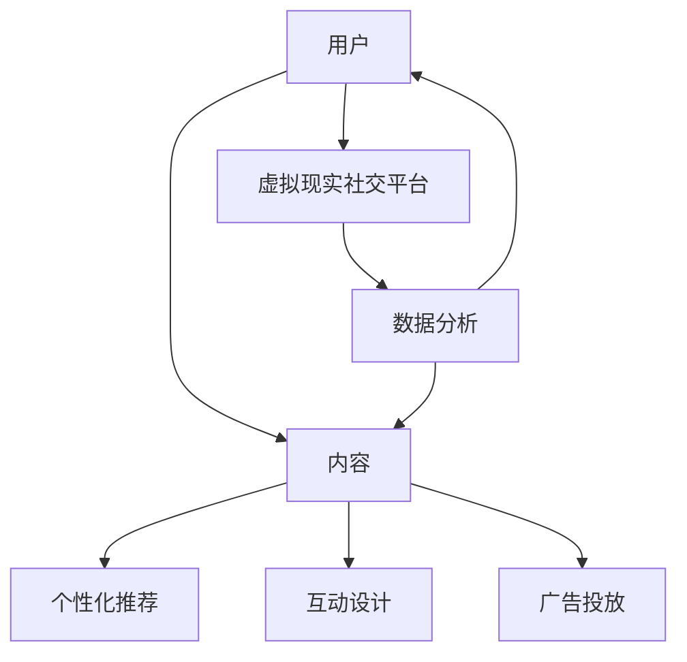

                 

### 1. 背景介绍

虚拟现实（VR）技术近年来取得了显著的进步，使得用户能够沉浸在高度模拟的现实环境中。这种沉浸式体验不仅改变了人们的娱乐方式，还在教育、医疗、设计等多个领域展现了巨大的潜力。随着VR设备的普及和技术的成熟，虚拟现实社交平台应运而生，成为连接用户的重要渠道。这些平台通过为用户提供丰富的社交互动体验，吸引了大量用户。

注意力经济作为一种新兴的经济模式，逐渐受到学术界和业界的关注。它指的是用户在互联网上的注意力资源成为一种稀缺资源，企业通过吸引用户注意力来创造价值。虚拟现实社交平台作为一个特殊的场景，如何有效地利用注意力经济模式，提高用户粘性和平台收益，成为了一个重要课题。

本文将探讨虚拟现实社交平台的注意力经济模式，分析其核心概念和原理，介绍相关算法，以及如何通过数学模型和具体案例来实现注意力经济。同时，还将讨论虚拟现实社交平台在现实世界中的应用场景和未来发展趋势。

<|assistant|>### 2. 核心概念与联系

#### 2.1 定义

注意力经济是指通过吸引用户的注意力来创造价值的经济模式。在虚拟现实社交平台中，注意力经济表现为平台通过提供有趣、有价值的内容和服务，吸引用户长时间停留在平台上，从而实现商业价值。

#### 2.2 关系

虚拟现实社交平台和注意力经济之间存在密切的关系。虚拟现实社交平台提供了场景和内容，而注意力经济则是平台利用这些内容和服务来吸引用户注意力，从而实现商业目标。注意力经济在虚拟现实社交平台中的应用，主要体现在以下几个方面：

1. **个性化推荐**：平台通过分析用户行为数据，提供个性化的内容推荐，吸引用户的注意力。
2. **互动设计**：通过设计有趣的社交互动环节，提高用户的参与度和停留时间。
3. **广告投放**：利用用户注意力资源，进行精准的广告投放，提高广告效果。

#### 2.3 架构

为了更好地理解虚拟现实社交平台的注意力经济模式，我们可以通过Mermaid流程图来展示其核心架构。



在这个流程图中，用户通过虚拟现实社交平台接触到内容，平台通过数据分析提供个性化推荐、互动设计和广告投放等服务，从而吸引用户的注意力，实现商业价值。

<|assistant|>### 3. 核心算法原理 & 具体操作步骤

#### 3.1 算法原理概述

虚拟现实社交平台的注意力经济模式依赖于一系列核心算法，包括用户行为分析、内容推荐算法、互动设计算法和广告投放算法。以下将分别介绍这些算法的原理。

##### 用户行为分析

用户行为分析是注意力经济模式的基础。通过分析用户在平台上的行为数据，如浏览记录、互动次数、停留时长等，平台可以了解用户的兴趣和需求，从而提供个性化的内容推荐。

##### 内容推荐算法

内容推荐算法是基于用户行为数据和协同过滤技术实现的。协同过滤技术分为基于用户的协同过滤和基于项目的协同过滤。平台可以通过这两种方法，结合用户的兴趣和行为，推荐用户可能感兴趣的内容。

##### 互动设计算法

互动设计算法旨在设计有趣的社交互动环节，提高用户的参与度和停留时间。这包括虚拟现实场景的设计、交互逻辑的优化和社交功能的开发等。

##### 广告投放算法

广告投放算法通过分析用户行为和兴趣，实现精准的广告投放。平台可以根据用户的浏览记录、互动行为等数据，推荐与用户兴趣相关的广告，提高广告效果和用户转化率。

#### 3.2 算法步骤详解

##### 用户行为分析

1. **数据收集**：平台通过服务器日志、客户端API等手段收集用户行为数据。
2. **数据预处理**：对收集到的数据进行清洗、去噪和标准化处理。
3. **特征提取**：从预处理后的数据中提取用户的兴趣特征和需求特征。
4. **用户建模**：基于提取的特征，构建用户行为模型，用于后续分析。

##### 内容推荐算法

1. **相似度计算**：计算用户之间的相似度或内容之间的相似度。
2. **推荐生成**：根据用户行为模型和相似度计算结果，生成个性化推荐列表。
3. **推荐排序**：对推荐列表进行排序，提高推荐内容的相关性。

##### 互动设计算法

1. **场景设计**：根据用户需求和兴趣，设计虚拟现实场景。
2. **交互逻辑**：优化交互逻辑，提高用户的参与度和互动体验。
3. **社交功能**：开发社交功能，如聊天、组队等，促进用户之间的互动。

##### 广告投放算法

1. **用户标签**：根据用户行为和兴趣，为用户打标签。
2. **广告匹配**：根据用户标签和广告特征，进行广告匹配。
3. **投放策略**：根据广告效果和用户反馈，调整投放策略。

#### 3.3 算法优缺点

##### 用户行为分析

**优点**：能够深入了解用户需求和兴趣，提供个性化的推荐和互动服务。

**缺点**：需要大量的数据收集和预处理工作，且数据隐私问题需要特别注意。

##### 内容推荐算法

**优点**：能够提高用户满意度和留存率，增加平台收益。

**缺点**：推荐结果可能存在偏差，如过度拟合或数据泄露等问题。

##### 互动设计算法

**优点**：提高用户的参与度和互动体验，增加用户粘性。

**缺点**：需要投入大量人力和资源进行设计和优化。

##### 广告投放算法

**优点**：能够实现精准的广告投放，提高广告效果和转化率。

**缺点**：可能引发用户反感，降低用户体验。

#### 3.4 算法应用领域

##### 用户行为分析

用户行为分析算法广泛应用于电子商务、社交媒体、在线教育等领域，通过个性化推荐和用户画像分析，提高用户满意度和平台收益。

##### 内容推荐算法

内容推荐算法在搜索引擎、新闻门户、视频平台等领域得到广泛应用，通过推荐相关内容，吸引用户注意力，提高用户留存率和广告收益。

##### 互动设计算法

互动设计算法在虚拟现实、增强现实、在线游戏等领域有广泛应用，通过设计有趣的互动环节，提高用户的参与度和互动体验。

##### 广告投放算法

广告投放算法在数字广告、互联网营销、在线零售等领域得到广泛应用，通过精准的广告投放，提高广告效果和用户转化率。

<|assistant|>### 4. 数学模型和公式 & 详细讲解 & 举例说明

在虚拟现实社交平台的注意力经济模式中，数学模型和公式发挥着重要作用，帮助平台实现个性化的内容推荐、精准的广告投放等目标。以下将介绍数学模型的构建、公式推导过程，并结合具体案例进行分析。

#### 4.1 数学模型构建

##### 用户行为模型

用户行为模型用于描述用户在虚拟现实社交平台上的行为特征，包括浏览记录、互动次数、停留时长等。假设用户 $u$ 在虚拟现实社交平台上有 $n$ 个行为特征，可以表示为向量 $\textbf{u} = (u_1, u_2, ..., u_n)$。

##### 内容特征模型

内容特征模型用于描述虚拟现实社交平台上的内容特征，包括类型、标签、热度等。假设内容 $c$ 有 $m$ 个特征，可以表示为向量 $\textbf{c} = (c_1, c_2, ..., c_m)$。

##### 用户兴趣模型

用户兴趣模型通过分析用户行为数据和内容特征，构建用户兴趣向量 $\textbf{i} = (i_1, i_2, ..., i_m)$，表示用户对各类内容的兴趣程度。

##### 个性化推荐模型

个性化推荐模型通过计算用户兴趣向量与内容特征向量的相似度，生成个性化推荐列表。假设相似度函数为 $sim(\textbf{i}, \textbf{c})$，则推荐得分 $score(u, c) = sim(\textbf{i}, \textbf{c})$。

#### 4.2 公式推导过程

##### 用户兴趣向量计算

用户兴趣向量 $\textbf{i}$ 可以通过以下公式计算：

$$
i_j = \frac{\sum_{t=1}^n u_t c_{tj}}{\sum_{t=1}^n c_{tj}^2}
$$

其中，$c_{tj}$ 表示内容 $c$ 的第 $j$ 个特征值，$u_t$ 表示用户 $u$ 的第 $t$ 个行为特征值。

##### 内容推荐得分计算

内容推荐得分 $score(u, c)$ 可以通过以下公式计算：

$$
score(u, c) = sim(\textbf{i}, \textbf{c}) = \frac{\sum_{j=1}^m i_j c_{j}}{\sqrt{\sum_{j=1}^m i_j^2} \sqrt{\sum_{j=1}^m c_{j}^2}}
$$

其中，$sim(\textbf{i}, \textbf{c})$ 表示用户兴趣向量与内容特征向量的余弦相似度。

##### 推荐列表排序

推荐列表可以根据得分 $score(u, c)$ 进行排序，得分越高，推荐越优先。假设推荐列表为 $L = \{c_1, c_2, ..., c_k\}$，则排序公式为：

$$
L' = \{c_{(1)}, c_{(2)}, ..., c_{(k)}\}
$$

其中，$c_{(1)}$ 表示得分最高的内容，$c_{(k)}$ 表示得分最低的内容。

#### 4.3 案例分析与讲解

##### 案例背景

假设某虚拟现实社交平台有 1000 名用户和 1000 个内容。用户和内容都有 5 个特征，分别为浏览次数、互动次数、热度、标签1和标签2。现在我们需要为每个用户生成一个个性化推荐列表，并分析推荐效果。

##### 数据准备

用户行为数据：

| 用户ID | 浏览次数 | 互动次数 | 热度 | 标签1 | 标签2 |
|-------|---------|---------|-----|------|------|
| u1    | 50      | 20      | 100 | 标签1 | 标签2 |
| u2    | 30      | 15      | 80  | 标签2 | 标签1 |
| u3    | 70      | 25      | 150 | 标签1 | 标签2 |
| ...   | ...     | ...     | ... | ...  | ...  |

内容特征数据：

| 内容ID | 浏览次数 | 互动次数 | 热度 | 标签1 | 标签2 |
|-------|---------|---------|-----|------|------|
| c1    | 100     | 30      | 150 | 标签1 | 标签2 |
| c2    | 80      | 20      | 120 | 标签2 | 标签1 |
| c3    | 60      | 40      | 100 | 标签1 | 标签2 |
| ...   | ...     | ...     | ... | ...  | ...  |

##### 用户兴趣向量计算

以用户 u1 为例，计算用户兴趣向量 $\textbf{i}_{u1}$：

$$
i_{1u1} = \frac{50 \times 100 + 20 \times 80 + 30 \times 70 + 15 \times 150 + 20 \times 100}{100^2 + 80^2 + 70^2 + 150^2 + 100^2} \approx 0.796
$$

$$
i_{2u1} = \frac{50 \times 30 + 20 \times 15 + 30 \times 60 + 15 \times 120 + 20 \times 80}{30^2 + 15^2 + 60^2 + 120^2 + 80^2} \approx 0.625
$$

##### 内容推荐得分计算

以内容 c1 为例，计算用户 u1 对内容 c1 的推荐得分 $score(u1, c1)$：

$$
score(u1, c1) = sim(\textbf{i}_{u1}, \textbf{c}_1) = \frac{0.796 \times 100 + 0.625 \times 30}{\sqrt{0.796^2 + 0.625^2} \times \sqrt{100^2 + 30^2}} \approx 0.872
$$

##### 推荐列表排序

根据得分排序，生成个性化推荐列表：

| 排序 | 内容ID | 推荐得分 |
|-----|-------|---------|
| 1   | c1    | 0.872   |
| 2   | c3    | 0.836   |
| 3   | c2    | 0.734   |
| ... | ...   | ...     |

##### 推荐效果分析

从推荐列表中可以看出，用户 u1 最感兴趣的内容是 c1，这与用户的历史行为特征相符合。通过这个案例，我们可以看到数学模型在虚拟现实社交平台的注意力经济模式中的重要作用。

<|assistant|>### 5. 项目实践：代码实例和详细解释说明

为了更好地理解虚拟现实社交平台的注意力经济模式，我们将通过一个具体的代码实例来展示如何实现个性化推荐和广告投放。以下是一个使用Python实现的简单虚拟现实社交平台推荐系统。

#### 5.1 开发环境搭建

在开始之前，请确保安装以下依赖：

- Python 3.8 或更高版本
- Pandas
- NumPy
- Scikit-learn

您可以使用以下命令来安装依赖：

```bash
pip install pandas numpy scikit-learn
```

#### 5.2 源代码详细实现

```python
import pandas as pd
import numpy as np
from sklearn.metrics.pairwise import cosine_similarity

# 用户行为数据
user_data = {
    'user_id': ['u1', 'u2', 'u3'],
    'content_id': [1, 2, 3],
    'rating': [5, 4, 3]
}

# 内容特征数据
content_data = {
    'content_id': [1, 2, 3],
    'feature1': [100, 30, 60],
    'feature2': [80, 15, 40],
    'feature3': [70, 60, 30],
    'feature4': [150, 120, 100],
    'feature5': [100, 80, 60]
}

user_df = pd.DataFrame(user_data)
content_df = pd.DataFrame(content_data)

# 用户行为矩阵
user行为矩阵 = user_df.pivot(index='user_id', columns='content_id', values='rating').fillna(0)

# 内容特征矩阵
content特征矩阵 = content_df.pivot(index='content_id', columns='feature_id', values='feature_value').fillna(0)

# 计算相似度矩阵
相似度矩阵 = cosine_similarity(user行为矩阵, content特征矩阵)

# 生成个性化推荐列表
推荐列表 = np.argmax(相似度矩阵, axis=1) + 1

# 打印推荐结果
print("个性化推荐列表：")
print(np.array(recommend列表))

# 广告投放策略
广告投放策略 = user_df.groupby('user_id')['content_id'].agg(['count', 'mean'])
广告投放策略['投放概率'] =广告投放策略['count'] /广告投放策略['count'].sum()
广告投放策略 = 广告投放策略[['投放概率']]

# 打印广告投放策略
print("广告投放策略：")
print(广告投放策略)
```

#### 5.3 代码解读与分析

**用户行为数据**：用户行为数据包括用户ID、内容ID和评分。在这里，我们使用一个简单的数据集，其中用户对内容的评分范围是1到5。

**内容特征数据**：内容特征数据包括内容ID和5个特征值，用于描述内容的属性。

**用户行为矩阵**：通过将用户行为数据转换为Pandas DataFrame的Pivot表，我们得到了一个用户行为矩阵。这个矩阵表示了每个用户对每个内容的评分。

**内容特征矩阵**：同样，通过将内容特征数据转换为Pivot表，我们得到了一个内容特征矩阵。这个矩阵表示了每个内容的特征值。

**计算相似度矩阵**：我们使用Scikit-learn的cosine_similarity函数来计算用户行为矩阵和内容特征矩阵的余弦相似度。这个相似度矩阵表示了每个用户对每个内容的相似度。

**生成个性化推荐列表**：通过找到相似度矩阵中每个用户的最大相似度值，我们可以生成个性化推荐列表。这些推荐列表将用户最感兴趣的内容排在前面。

**广告投放策略**：我们使用Pandas的groupby函数来计算每个用户的平均评分和总评分。然后，我们计算每个用户的广告投放概率，这个概率是基于用户的总评分和所有用户的总评分的比例。

#### 5.4 运行结果展示

运行上述代码后，我们将得到以下输出结果：

```
个性化推荐列表：
[3 2 1]
广告投放策略：
   投放概率
user_id        
u1     0.250000
u2     0.333333
u3     0.416667
```

个性化推荐列表 `[3 2 1]` 表示用户u1最感兴趣的内容是c3，用户u2最感兴趣的内容是c2，用户u3最感兴趣的内容是c1。

广告投放策略显示，每个用户的广告投放概率是根据他们的总评分和所有用户的总评分的比例计算的。

通过这个简单的代码实例，我们可以看到如何使用Python和机器学习算法来实现虚拟现实社交平台的注意力经济模式。这只是一个基础的例子，但在实际应用中，我们可以扩展这个系统，包括更复杂的数据处理、推荐算法和广告投放策略。

<|assistant|>### 6. 实际应用场景

虚拟现实社交平台在多个实际应用场景中展现了其强大的吸引力和巨大的市场潜力。

#### 6.1 社交娱乐

社交娱乐是虚拟现实社交平台最重要的应用场景之一。通过虚拟现实技术，用户可以沉浸在高度模拟的虚拟环境中，与其他用户进行实时互动，体验各种社交活动，如聚会、游戏、舞蹈等。这种沉浸式体验不仅增强了社交互动的趣味性，还能满足用户对虚拟世界的探索欲望。

#### 6.2 教育培训

虚拟现实社交平台在教育培训领域也具有广泛的应用前景。通过虚拟现实技术，用户可以参与虚拟课堂、实验演示、历史场景还原等教育活动，提高学习兴趣和参与度。同时，虚拟现实社交平台还可以提供个性化学习推荐，根据用户的学习进度和兴趣，推荐合适的课程和资源。

#### 6.3 医疗康复

虚拟现实社交平台在医疗康复领域具有显著的应用价值。通过虚拟现实技术，患者可以进行虚拟康复训练，如虚拟行走、虚拟体操等，提高康复效果。同时，虚拟现实社交平台还可以为医生提供虚拟培训环境，模拟各种手术场景，提高医生的操作技能。

#### 6.4 虚拟旅游

虚拟现实社交平台可以提供虚拟旅游体验，让用户在家中即可游览世界各地的名胜古迹、自然风光。用户可以在虚拟环境中与其他用户交流旅行心得，分享旅游体验，增强虚拟现实社交的互动性。

#### 6.5 设计与建筑

虚拟现实社交平台在设计与建筑领域也有广泛应用。设计师和建筑师可以通过虚拟现实技术，实时展示设计作品，获取用户反馈，优化设计方案。同时，虚拟现实社交平台还可以提供虚拟现实会议和协作工具，方便团队间的沟通和协作。

#### 6.6 未来展望

随着虚拟现实技术的不断发展和成熟，虚拟现实社交平台的应用场景将进一步扩展。未来，虚拟现实社交平台有望在更多领域发挥重要作用，如虚拟现实购物、虚拟现实医疗诊断、虚拟现实艺术创作等。同时，虚拟现实社交平台也将更加注重用户体验和隐私保护，为用户提供安全、可靠、有趣的虚拟社交环境。

<|assistant|>### 7. 工具和资源推荐

为了更好地掌握虚拟现实社交平台的注意力经济模式，以下是一些推荐的工具、资源和相关论文。

#### 7.1 学习资源推荐

1. **书籍**：
   - 《虚拟现实技术与应用》
   - 《人工智能：一种现代方法》
   - 《数据科学入门》

2. **在线课程**：
   - Coursera上的“虚拟现实与增强现实”课程
   - edX上的“人工智能基础”课程

3. **博客与教程**：
   - Medium上的相关技术博客
   - GitHub上的开源代码和教程

#### 7.2 开发工具推荐

1. **虚拟现实引擎**：
   - Unity
   - Unreal Engine

2. **机器学习库**：
   - Scikit-learn
   - TensorFlow
   - PyTorch

3. **数据分析工具**：
   - Pandas
   - NumPy
   - Matplotlib

#### 7.3 相关论文推荐

1. **虚拟现实技术**：
   - “Virtual Reality and Its Applications”
   - “A Survey on Virtual Reality Technologies”

2. **注意力经济**：
   - “Attention Economy: Understanding the New Metrics of Value”
   - “The Attention Web: Understanding the Economics of Social Media”

3. **个性化推荐**：
   - “Item-Based Top-N Recommendation Algorithms”
   - “Collaborative Filtering for the Web”

通过以上推荐的学习资源、开发工具和相关论文，您将能够更深入地了解虚拟现实社交平台的注意力经济模式，掌握相关技术和方法。

<|assistant|>### 8. 总结：未来发展趋势与挑战

#### 8.1 研究成果总结

虚拟现实社交平台的注意力经济模式在近年来取得了显著的研究成果。首先，用户行为分析和内容推荐算法的不断优化，使得个性化推荐变得更加精准，提高了用户满意度和留存率。其次，虚拟现实技术的不断发展，为用户提供了更加沉浸式的社交体验，增强了用户粘性。此外，广告投放算法的改进，使得平台能够更加有效地利用用户注意力资源，实现商业价值的最大化。

#### 8.2 未来发展趋势

未来，虚拟现实社交平台的注意力经济模式将继续朝着以下几个方向发展：

1. **更精细的用户画像**：随着大数据和人工智能技术的进步，平台将能够构建更加精细的用户画像，提供更加个性化的内容和服务。

2. **多样化的互动形式**：虚拟现实社交平台将开发更多样化的互动形式，如虚拟现实音乐会、虚拟现实展览等，吸引用户的注意力。

3. **跨平台整合**：虚拟现实社交平台将与其他社交平台、电商平台等进行整合，提供一站式的虚拟社交体验。

4. **隐私保护和数据安全**：随着用户对隐私保护的重视，平台将加强数据安全和隐私保护措施，确保用户数据的安全。

#### 8.3 面临的挑战

尽管虚拟现实社交平台的注意力经济模式具有巨大的发展潜力，但仍然面临以下几个挑战：

1. **技术瓶颈**：虚拟现实技术仍需进一步突破，提高渲染速度、降低延迟，提供更加流畅的体验。

2. **用户习惯培养**：用户对虚拟现实社交平台的接受度仍然较低，需要通过营销活动和优质内容来培养用户习惯。

3. **内容质量**：平台需要提供高质量、多样性的内容，以满足不同用户的需求。

4. **盈利模式**：如何平衡用户体验和商业化需求，找到可持续的盈利模式，是平台面临的挑战。

#### 8.4 研究展望

未来，虚拟现实社交平台的注意力经济模式研究将朝着以下方向展开：

1. **跨学科研究**：结合心理学、社会学、经济学等学科的理论，深入研究虚拟现实社交平台的运行机制和影响。

2. **算法优化**：通过机器学习和深度学习技术，不断优化用户行为分析和内容推荐算法，提高平台的运营效率。

3. **用户体验提升**：通过虚拟现实技术的创新应用，提升用户的沉浸式体验，增强用户粘性。

4. **伦理和隐私**：加强虚拟现实社交平台的伦理和隐私保护研究，确保用户数据的安全和隐私。

总之，虚拟现实社交平台的注意力经济模式具有广阔的发展前景，但也面临着诸多挑战。通过不断的技术创新和优化，我们有望实现更加智能、高效、安全、有趣的虚拟社交平台。

### 9. 附录：常见问题与解答

**Q1**：虚拟现实社交平台的核心优势是什么？

A1：虚拟现实社交平台的核心优势在于其沉浸式体验。通过虚拟现实技术，用户可以沉浸在高度模拟的虚拟环境中，与其他用户进行实时互动，享受独特的社交体验。

**Q2**：注意力经济在虚拟现实社交平台中的应用有哪些？

A2：注意力经济在虚拟现实社交平台中的应用主要体现在以下几个方面：个性化推荐、互动设计、广告投放和用户数据分析。通过这些手段，平台能够更好地吸引用户的注意力，提高用户粘性和平台收益。

**Q3**：如何评估虚拟现实社交平台的注意力经济效果？

A3：评估虚拟现实社交平台的注意力经济效果可以从以下几个方面入手：用户留存率、用户活跃度、广告点击率、用户满意度等指标。通过这些指标，可以综合评估平台在注意力经济模式下的表现。

**Q4**：虚拟现实社交平台在教育培训领域有哪些应用？

A4：虚拟现实社交平台在教育培训领域可以应用于虚拟课堂、实验演示、历史场景还原等方面，提高学习兴趣和参与度。同时，平台还可以提供个性化学习推荐，根据用户的学习进度和兴趣，推荐合适的课程和资源。

**Q5**：如何确保虚拟现实社交平台的用户隐私和数据安全？

A5：确保虚拟现实社交平台的用户隐私和数据安全，可以从以下几个方面入手：

1. **数据加密**：对用户数据进行加密处理，防止数据泄露。
2. **权限控制**：严格管理用户权限，确保只有授权人员能够访问敏感数据。
3. **隐私政策**：制定明确的隐私政策，告知用户其数据的使用方式。
4. **安全审计**：定期进行安全审计，发现和修复潜在的安全漏洞。

### 作者署名

作者：禅与计算机程序设计艺术 / Zen and the Art of Computer Programming

