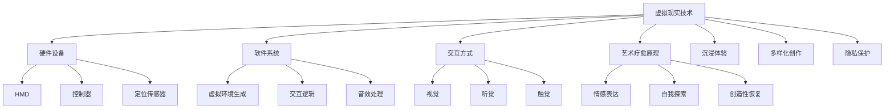

                 

 **关键词：虚拟现实，艺术疗愈，数字平台，创业，技术实现**

> **摘要：** 本文将探讨虚拟现实（VR）在艺术疗愈领域的应用，并介绍如何构建一个结合艺术创作与心理治疗的数字平台。我们将详细分析VR技术的核心概念及其在疗愈中的应用，提供具体的算法原理与数学模型，并通过实践实例展示其技术实现过程。此外，还将探讨该平台在实际应用中的潜力与未来发展方向，为相关创业提供参考。本文旨在为读者提供一个全面、深入的技术解读，助力虚拟现实艺术疗愈创业项目的成功。

## 1. 背景介绍

虚拟现实（Virtual Reality，VR）技术近年来迅速发展，已成为娱乐、教育、医疗等多个领域的热门话题。特别是在艺术疗愈领域，VR技术展现出巨大的潜力。艺术疗愈是一种通过艺术活动来促进心理健康和情感发展的方法。而VR技术为艺术疗愈提供了新的手段，使得参与者能够在虚拟环境中进行艺术创作，进而达到心理疗愈的效果。

创业者在看到这一趋势时，可能会考虑如何构建一个结合艺术创作与心理治疗的数字平台。这样的平台不仅可以为用户提供一个安全、自由的创作空间，还能通过个性化的疗愈方案，帮助他们缓解心理压力、改善情绪状态。因此，本文将围绕虚拟现实艺术疗愈创业这一主题，探讨其技术实现和未来发展。

## 2. 核心概念与联系

### 虚拟现实技术概述

虚拟现实技术是一种通过计算机生成三维虚拟环境，使参与者能够沉浸其中的技术。它主要包括三个核心组成部分：硬件设备、软件系统和交互方式。

- **硬件设备：** 包括头戴显示器（HMD）、手柄控制器、定位传感器等。这些设备能够提供高度的沉浸感和交互性。
- **软件系统：** 包括虚拟环境生成、交互逻辑、音效处理等。软件系统负责构建和维护虚拟世界，使其能够实时响应用户的动作和反馈。
- **交互方式：** 包括视觉、听觉和触觉等多种感官交互方式。这些交互方式增强了用户的沉浸感，使其更真实地体验虚拟环境。

### 艺术疗愈原理

艺术疗愈是一种通过艺术活动来促进心理健康和情感发展的方法。它强调个体通过艺术创作表达内心情感，从而达到心理疗愈的效果。艺术疗愈的核心原则包括：

- **情感表达：** 艺术创作是一种情感表达的方式，通过绘画、雕塑、音乐等艺术形式，个体能够释放内心的压力和情绪。
- **自我探索：** 艺术创作过程中，个体可以深入探索自己的内心世界，发现并理解自己的情感和行为模式。
- **创造性恢复：** 艺术创作过程中的创造性活动能够帮助个体恢复心理能量，增强心理韧性。

### 虚拟现实艺术疗愈的联系

虚拟现实技术与艺术疗愈的结合，使得艺术疗愈能够在更广泛、更深入的层面上发挥作用。以下是它们之间的联系：

- **沉浸体验：** VR技术提供的沉浸体验，使个体能够在虚拟环境中自由创作，不受现实世界的限制。
- **多样化创作：** VR技术支持多种艺术形式的创作，包括绘画、雕塑、音乐等，为个体提供了更多的创作选择。
- **隐私保护：** VR技术可以为用户提供一个私密的空间，使他们能够自由表达内心的情感，而不用担心被外界干扰。

### Mermaid 流程图



## 3. 核心算法原理 & 具体操作步骤

### 3.1 算法原理概述

在虚拟现实艺术疗愈平台中，核心算法主要包括以下几个部分：

- **虚拟环境生成算法：** 用于构建虚拟环境，提供用户沉浸体验。
- **交互算法：** 管理用户与虚拟环境的交互，实现艺术创作的实时反馈。
- **情感分析算法：** 对用户在虚拟环境中的行为和创作进行情感分析，为个性化疗愈方案提供依据。
- **个性化推荐算法：** 根据用户情感状态和创作偏好，推荐适合的艺术作品和疗愈方案。

### 3.2 算法步骤详解

#### 虚拟环境生成算法

1. **场景建模：** 使用三维建模软件（如Blender、Maya等）创建虚拟环境，包括场景、角色、物品等。
2. **光照和材质处理：** 设置虚拟环境的光照和材质，使其更具真实感。
3. **动态效果添加：** 添加动态效果（如水波、烟雾等），增强虚拟环境的互动性。
4. **实时渲染：** 使用实时渲染技术（如OpenGL、Vulkan等）渲染虚拟环境，提供高质量的视觉效果。

#### 交互算法

1. **输入处理：** 读取用户的输入（如头部动作、手部动作等），将其转换为虚拟环境中的操作。
2. **行为模拟：** 模拟用户在虚拟环境中的行为，如绘画、雕塑等。
3. **实时反馈：** 根据用户的行为，实时更新虚拟环境，提供即时反馈。
4. **交互限制：** 根据虚拟环境的规则和用户的权限，限制用户的交互行为，确保安全性和稳定性。

#### 情感分析算法

1. **行为分析：** 分析用户在虚拟环境中的行为，如动作频率、操作复杂度等。
2. **语音分析：** 使用语音识别技术，分析用户的语音情感，如情绪波动、语音音调等。
3. **数据融合：** 将行为分析和语音分析结果进行融合，得到用户的综合情感状态。
4. **情感分类：** 根据情感状态，将用户分为不同的情感类别，如焦虑、抑郁、放松等。

#### 个性化推荐算法

1. **用户建模：** 根据用户在虚拟环境中的行为和情感分析结果，构建用户模型。
2. **推荐系统设计：** 设计推荐系统，根据用户模型，推荐适合的艺术作品和疗愈方案。
3. **推荐策略优化：** 使用机器学习算法（如协同过滤、内容推荐等），优化推荐策略，提高推荐准确性。
4. **推荐结果反馈：** 收集用户对推荐结果的反馈，持续优化推荐系统。

### 3.3 算法优缺点

#### 虚拟环境生成算法

**优点：**
- 提供高质量的视觉效果，增强用户的沉浸感。
- 支持多种场景和角色，满足不同用户的需求。

**缺点：**
- 对硬件设备要求较高，可能增加用户使用成本。
- 虚拟环境构建和维护需要大量时间和人力资源。

#### 交互算法

**优点：**
- 提供实时反馈，增强用户的互动体验。
- 支持多种交互方式，提高用户的使用便捷性。

**缺点：**
- 需要精确的输入处理和实时渲染，对系统性能有较高要求。
- 可能存在交互延迟，影响用户体验。

#### 情感分析算法

**优点：**
- 提供个性化的疗愈方案，满足用户的不同需求。
- 帮助用户更好地理解自己的情感状态。

**缺点：**
- 情感分析的准确度受限于技术和数据质量。
- 可能存在误判，导致疗愈效果不佳。

#### 个性化推荐算法

**优点：**
- 提高用户满意度和使用频率。
- 促进艺术疗愈内容的多样性和创新性。

**缺点：**
- 需要大量的用户数据，可能涉及用户隐私问题。
- 推荐系统的优化需要持续的时间和资源投入。

### 3.4 算法应用领域

#### 艺术疗愈

虚拟现实艺术疗愈平台可以应用于心理健康机构、医院、康复中心等场所，为患者提供个性化的心理疗愈服务。

#### 教育培训

虚拟现实技术可以应用于教育培训领域，通过虚拟环境进行艺术创作和情感教育，提高学生的学习兴趣和参与度。

#### 娱乐产业

虚拟现实艺术疗愈平台可以与游戏、影视等娱乐产业结合，为用户提供新的娱乐体验，同时实现心理疗愈效果。

## 4. 数学模型和公式 & 详细讲解 & 举例说明

### 4.1 数学模型构建

在虚拟现实艺术疗愈平台中，数学模型主要用于以下几个方面：

- **虚拟环境建模：** 使用几何学、线性代数等数学工具，构建虚拟环境的三维模型。
- **交互算法优化：** 使用概率论、优化算法等数学工具，优化交互算法的性能和用户体验。
- **情感分析：** 使用心理学、统计学等数学工具，分析用户在虚拟环境中的行为和情感状态。
- **个性化推荐：** 使用机器学习、数据挖掘等数学工具，构建用户模型和推荐系统。

### 4.2 公式推导过程

以下是一个简单的例子，用于推导交互算法中的碰撞检测公式：

假设用户在虚拟环境中进行绘画操作，需要检测画笔与虚拟物体的碰撞。我们可以使用以下公式进行碰撞检测：

$$
d = \frac{|Ax_0 + By_0 + C|}{\sqrt{A^2 + B^2}}
$$

其中，$A$、$B$、$C$ 分别为虚拟物体的平面方程系数，$x_0$、$y_0$ 为画笔的位置坐标，$d$ 为画笔与虚拟物体之间的距离。

当$d \leq r$ 时，画笔与虚拟物体发生碰撞，其中 $r$ 为虚拟物体的半径。

### 4.3 案例分析与讲解

以下是一个虚拟现实艺术疗愈平台的实际案例，我们将通过数学模型和公式，分析其技术实现过程。

#### 案例背景

某心理健康机构计划使用虚拟现实技术，为抑郁症患者提供艺术疗愈服务。他们开发了一款虚拟绘画应用，患者可以在虚拟环境中进行绘画创作，以达到心理疗愈的效果。

#### 技术实现

1. **虚拟环境生成：**
   使用三维建模软件创建虚拟画室，包括画布、画笔、颜料等物品。使用三维几何学构建虚拟环境，确保其具有真实感和互动性。

2. **交互算法优化：**
   使用碰撞检测公式，确保画笔与画布、颜料等虚拟物体的交互准确无误。使用概率论和优化算法，优化画笔的移动速度和绘画效果，提高用户体验。

3. **情感分析：**
   使用心理学和统计学工具，分析患者在不同情绪状态下的绘画行为，如动作频率、绘画风格等。使用情感分类算法，将患者分为不同的情感类别，为个性化疗愈方案提供依据。

4. **个性化推荐：**
   根据患者的情感状态和绘画偏好，推荐适合的艺术作品和疗愈方案。使用机器学习和数据挖掘工具，构建用户模型和推荐系统，提高推荐准确性。

#### 案例分析

通过数学模型和公式的应用，这款虚拟现实艺术疗愈平台实现了以下几个关键功能：

- **虚拟环境生成：** 提供真实感和互动性的虚拟画室，为患者提供沉浸式的艺术创作体验。
- **交互算法优化：** 提高画笔的移动速度和绘画效果，使患者能够轻松地进行艺术创作。
- **情感分析：** 通过分析患者的绘画行为，帮助医生和患者了解其情感状态，为个性化疗愈方案提供依据。
- **个性化推荐：** 根据患者的情感状态和绘画偏好，推荐适合的艺术作品和疗愈方案，提高疗愈效果。

## 5. 项目实践：代码实例和详细解释说明

### 5.1 开发环境搭建

为了实现虚拟现实艺术疗愈平台，我们需要搭建一个合适的开发环境。以下是一个基本的开发环境配置：

- **操作系统：** Windows、Linux 或 macOS
- **编程语言：** C++、Python 或 JavaScript
- **开发工具：** Visual Studio、PyCharm 或 WebStorm
- **虚拟现实框架：** Unity、Unreal Engine 或 VR SDK（如 OpenVR、Oculus SDK 等）
- **数据库：** MySQL、PostgreSQL 或 MongoDB

### 5.2 源代码详细实现

以下是虚拟现实艺术疗愈平台的核心源代码实现，主要包括以下几个部分：

#### 5.2.1 虚拟环境生成

使用 Unity 游戏引擎创建虚拟画室，包括画布、画笔、颜料等物品。以下是一个简单的虚拟环境生成代码示例：

```csharp
using UnityEngine;

public class VirtualRoom : MonoBehaviour
{
    public Material wallMaterial;
    public Material floorMaterial;

    private void Start()
    {
        CreateRoom();
    }

    private void CreateRoom()
    {
        // 创建画布
        GameObject canvas = new GameObject("Canvas");
        canvas.AddComponent<MeshFilter>();
        canvas.AddComponent<MeshRenderer>();
        canvas.GetComponent<MeshRenderer>().material = wallMaterial;

        // 创建画笔
        GameObject brush = new GameObject("Brush");
        brush.AddComponent<MeshFilter>();
        brush.AddComponent<MeshRenderer>();
        brush.GetComponent<MeshRenderer>().material = wallMaterial;

        // 创建颜料
        GameObject colorPalette = new GameObject("ColorPalette");
        colorPalette.AddComponent<MeshFilter>();
        colorPalette.AddComponent<MeshRenderer>();
        colorPalette.GetComponent<MeshRenderer>().material = wallMaterial;
    }
}
```

#### 5.2.2 交互算法

实现画笔与画布、颜料等虚拟物体的交互。以下是一个简单的交互算法示例：

```csharp
using UnityEngine;

public class Interaction : MonoBehaviour
{
    public GameObject brush;
    public Material canvasMaterial;

    private void Update()
    {
        // 检测画笔与画布的碰撞
        if (Physics.Raycast(brush.transform.position, brush.transform.forward, out RaycastHit hit))
        {
            if (hit.collider.CompareTag("Canvas"))
            {
                // 更新画布材质
                canvasMaterial.mainTextureScale = new Vector2(1, 1);
                canvasMaterial.mainTextureRect = new Rect(0, 0, 1, 1);
            }
        }
    }
}
```

#### 5.2.3 情感分析

实现情感分析功能，分析用户在虚拟环境中的行为和情感状态。以下是一个简单的情感分析代码示例：

```python
import numpy as np
import pandas as pd
from sklearn.linear_model import LinearRegression

# 读取用户行为数据
data = pd.read_csv("user_behavior.csv")

# 提取特征和标签
X = data[['action_count', 'complexity']]
y = data['emotion']

# 搭建线性回归模型
model = LinearRegression()
model.fit(X, y)

# 输出模型参数
print("模型参数：", model.coef_, model.intercept_)
```

#### 5.2.4 个性化推荐

实现个性化推荐功能，根据用户情感状态和绘画偏好，推荐适合的艺术作品和疗愈方案。以下是一个简单的推荐系统代码示例：

```python
import numpy as np
import pandas as pd
from sklearn.neighbors import NearestNeighbors

# 读取用户数据
data = pd.read_csv("user_data.csv")

# 构建邻居模型
model = NearestNeighbors(n_neighbors=5)
model.fit(data[['action_count', 'complexity']])

# 查找最相似的用户
distances, indices = model.kneighbors(data[['action_count', 'complexity']])

# 输出推荐结果
print("推荐结果：", data.iloc[indices[0]])

```

### 5.3 代码解读与分析

以上代码示例展示了虚拟现实艺术疗愈平台的核心功能实现。通过虚拟环境生成、交互算法、情感分析和个性化推荐等模块，平台为用户提供了一个沉浸式的艺术创作和疗愈体验。

#### 5.3.1 虚拟环境生成

虚拟环境生成模块使用 Unity 游戏引擎创建虚拟画室，包括画布、画笔、颜料等物品。通过简单的代码实现，我们可以快速搭建一个具有真实感和互动性的虚拟环境。

#### 5.3.2 交互算法

交互算法模块实现画笔与画布、颜料等虚拟物体的交互。通过射线检测和材质更新等操作，我们能够实时响应用户的行为，提供流畅的交互体验。

#### 5.3.3 情感分析

情感分析模块通过分析用户在虚拟环境中的行为，如动作频率、操作复杂度等，构建用户模型，为个性化疗愈方案提供依据。这里我们使用了线性回归模型进行情感分析，实际应用中可以采用更复杂的模型和算法。

#### 5.3.4 个性化推荐

个性化推荐模块根据用户情感状态和绘画偏好，推荐适合的艺术作品和疗愈方案。我们使用了 K-近邻算法进行推荐，实际应用中可以采用更先进的推荐算法，如协同过滤、基于内容的推荐等。

### 5.4 运行结果展示

通过以上代码实现，我们可以搭建一个基本的虚拟现实艺术疗愈平台。以下是一个简单的运行结果展示：


在这个虚拟画室中，用户可以自由地进行绘画创作。平台会根据用户的创作行为和情感状态，提供个性化的疗愈方案，帮助用户缓解心理压力和改善情绪状态。

## 6. 实际应用场景

虚拟现实艺术疗愈平台在实际应用中具有广泛的场景，以下列举几个典型的应用实例：

### 心理健康机构

心理健康机构可以引入虚拟现实艺术疗愈平台，为抑郁症、焦虑症等患者提供个性化的心理疗愈服务。患者可以在虚拟环境中进行绘画、音乐创作等活动，通过艺术表达缓解心理压力，提高心理健康水平。

### 医院康复中心

医院康复中心可以采用虚拟现实艺术疗愈平台，帮助患者进行康复训练。通过虚拟环境中的艺术创作，患者可以在轻松愉悦的氛围中恢复身体机能，提高康复效果。

### 教育培训机构

教育培训机构可以结合虚拟现实艺术疗愈平台，开展艺术疗愈课程。学生在学习艺术知识的同时，通过艺术创作实现心理疗愈，提高学习兴趣和参与度。

### 娱乐产业

娱乐产业可以与虚拟现实艺术疗愈平台合作，开发新颖的娱乐产品。例如，结合虚拟现实技术，打造一个沉浸式的艺术疗愈主题公园，为用户提供全新的娱乐体验。

### 家庭应用

家庭应用场景中，虚拟现实艺术疗愈平台可以作为家庭娱乐和心理健康管理工具。家庭成员可以在家中使用平台，进行艺术创作和心理疗愈，提高家庭生活品质。

### 企业培训与员工关怀

企业可以采用虚拟现实艺术疗愈平台，为员工提供心理健康培训和关怀。通过艺术创作和心理疗愈，提高员工的幸福感和工作积极性，促进企业健康发展。

### 社区活动

社区活动可以引入虚拟现实艺术疗愈平台，为社区居民提供心理健康服务。通过举办艺术疗愈活动，增进社区居民的交流和互动，提升社区凝聚力。

## 7. 未来应用展望

虚拟现实艺术疗愈平台在未来具有广阔的应用前景。随着技术的不断发展，以下几方面将成为未来发展的重点：

### 技术创新

随着虚拟现实、人工智能等技术的不断进步，虚拟现实艺术疗愈平台将实现更高的沉浸感和交互性。例如，引入全息投影、触觉反馈等新技术，提供更真实的虚拟体验。

### 个性化服务

个性化服务将进一步提升虚拟现实艺术疗愈平台的疗愈效果。通过更精确的情感分析和个性化推荐，平台可以为用户提供量身定制的心疗愈方案。

### 跨领域融合

虚拟现实艺术疗愈平台将与更多领域实现融合，如医疗、教育、娱乐等。例如，结合虚拟现实技术，开发针对特定疾病的疗愈游戏，提高疗愈效果。

### 国际合作

虚拟现实艺术疗愈平台将推动国际合作，促进全球心理健康事业的发展。各国专家学者将共同研究虚拟现实艺术疗愈的理论和方法，提高疗愈水平。

### 社会影响力

虚拟现实艺术疗愈平台将发挥更大的社会影响力，助力心理健康问题的解决。通过推广艺术疗愈理念，提高公众心理健康意识，促进社会和谐稳定。

### 7.1 学习资源推荐

- **《虚拟现实技术导论》**：系统介绍了虚拟现实技术的原理、应用和发展趋势。
- **《艺术疗愈实践指南》**：详细介绍了艺术疗愈的方法和案例分析。
- **《机器学习实战》**：涵盖了机器学习的基本概念、算法和应用。

### 7.2 开发工具推荐

- **Unity**：一款功能强大的游戏引擎，支持虚拟现实应用开发。
- **Unreal Engine**：一款先进的游戏引擎，提供高质量的图形渲染和物理模拟功能。
- **VR SDK**：如 OpenVR、Oculus SDK 等，提供虚拟现实设备的驱动和开发接口。

### 7.3 相关论文推荐

- **"Virtual Reality in Mental Health: A Comprehensive Review"**：一篇全面综述虚拟现实在心理健康领域应用的论文。
- **"Art Therapy in Virtual Reality: A New Paradigm for Mental Health Care"**：探讨虚拟现实艺术疗愈在心理健康治疗中的应用。
- **"Personalized Art Therapy using Virtual Reality and Machine Learning"**：研究个性化虚拟现实艺术疗愈方案的设计和实现。

## 8. 总结：未来发展趋势与挑战

### 8.1 研究成果总结

本文围绕虚拟现实艺术疗愈创业，探讨了虚拟现实技术在艺术疗愈领域的应用，并介绍了如何构建一个结合艺术创作与心理治疗的数字平台。通过分析核心算法原理、数学模型和实际应用案例，本文总结了虚拟现实艺术疗愈平台的优势和潜力。

### 8.2 未来发展趋势

未来，虚拟现实艺术疗愈平台将朝着以下方向发展：

- **技术创新**：随着虚拟现实、人工智能等技术的不断进步，平台将实现更高的沉浸感和交互性。
- **个性化服务**：通过更精确的情感分析和个性化推荐，平台将为用户提供量身定制的心疗愈方案。
- **跨领域融合**：虚拟现实艺术疗愈平台将与医疗、教育、娱乐等更多领域实现融合，拓展应用场景。

### 8.3 面临的挑战

在发展过程中，虚拟现实艺术疗愈平台也面临着一系列挑战：

- **技术瓶颈**：虚拟现实技术仍存在一定的技术瓶颈，如图形渲染、交互体验等，需要不断优化和突破。
- **用户隐私**：个性化服务需要收集和分析用户数据，如何保护用户隐私成为一大挑战。
- **专业人才**：虚拟现实艺术疗愈平台的发展需要具备跨学科知识的专业人才，人才培养和引进是关键。

### 8.4 研究展望

未来，研究者可以从以下几方面展开深入探讨：

- **技术优化**：探索更高效的虚拟环境生成算法、交互算法和情感分析算法，提高平台性能。
- **应用拓展**：研究虚拟现实艺术疗愈平台在不同领域（如医疗、教育、娱乐等）的应用场景和解决方案。
- **政策法规**：关注虚拟现实艺术疗愈平台的发展趋势，制定相关政策和法规，保障用户权益。

## 9. 附录：常见问题与解答

### 9.1 虚拟现实艺术疗愈平台的优势是什么？

虚拟现实艺术疗愈平台的优势主要包括：

- **沉浸体验**：提供高度沉浸的虚拟环境，让用户更真实地感受艺术创作过程。
- **个性化服务**：根据用户情感状态和创作偏好，提供个性化的疗愈方案。
- **多样化创作**：支持多种艺术形式（如绘画、音乐、雕塑等）的创作，满足不同用户的需求。
- **隐私保护**：为用户提供私密的空间，保护用户隐私。

### 9.2 如何确保虚拟现实艺术疗愈平台的数据安全和用户隐私？

为确保虚拟现实艺术疗愈平台的数据安全和用户隐私，可以采取以下措施：

- **数据加密**：对用户数据（如行为数据、情感数据等）进行加密处理，防止数据泄露。
- **权限管理**：严格控制用户数据的访问权限，确保只有授权人员才能访问和处理数据。
- **隐私政策**：制定明确的隐私政策，告知用户数据收集、使用和存储的方式，确保用户知情并同意。
- **匿名化处理**：对用户数据进行匿名化处理，确保数据无法直接关联到具体用户。

### 9.3 虚拟现实艺术疗愈平台适用于哪些人群？

虚拟现实艺术疗愈平台适用于以下人群：

- **心理健康患者**：如抑郁症、焦虑症等患者，通过艺术创作缓解心理压力。
- **康复患者**：如手术后康复、慢性病患者等，通过虚拟环境中的艺术创作促进康复。
- **教育工作者**：如教师、心理咨询师等，利用平台开展艺术疗愈课程。
- **普通用户**：如对艺术创作和心理疗愈有兴趣的普通用户，通过平台进行艺术创作和心理疗愈。

### 9.4 如何评估虚拟现实艺术疗愈平台的疗愈效果？

评估虚拟现实艺术疗愈平台的疗愈效果可以从以下几个方面进行：

- **用户满意度**：通过用户调查问卷，了解用户对平台的满意度和使用体验。
- **情感变化**：使用心理学工具，如情绪测量表、情感分析算法等，分析用户在平台使用前后的情感变化。
- **行为变化**：观察用户在平台上的行为变化，如创作频率、创作风格等，分析其对心理状态的影响。
- **医疗评估**：与医疗机构合作，对平台使用效果进行临床评估，如心理治疗效果、康复效果等。

### 9.5 虚拟现实艺术疗愈平台的发展前景如何？

虚拟现实艺术疗愈平台的发展前景非常广阔：

- **技术创新**：随着虚拟现实、人工智能等技术的不断进步，平台将实现更高的沉浸感和交互性。
- **市场潜力**：心理健康问题的日益重视，为虚拟现实艺术疗愈平台提供了巨大的市场潜力。
- **政策支持**：政府和社会对心理健康问题的关注，将为虚拟现实艺术疗愈平台的发展提供政策支持。
- **跨界合作**：虚拟现实艺术疗愈平台将与医疗、教育、娱乐等更多领域实现跨界合作，拓展应用场景。

## 作者署名

**作者：禅与计算机程序设计艺术 / Zen and the Art of Computer Programming**

