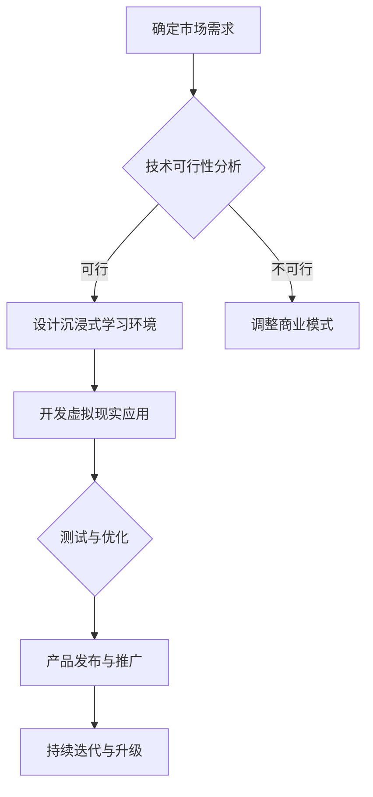

                 

关键词：虚拟现实、语言学习、沉浸式环境、创业、技术

> 摘要：本文将探讨虚拟现实技术在语言学习领域的应用，通过创业的角度，分析如何构建一个沉浸式的语言学习环境，实现高效的语言习得过程。

## 1. 背景介绍

在全球化进程加速的今天，语言学习已成为人们获取新知识、拓展国际视野的重要途径。然而，传统的语言学习方式往往存在效率低下、学习效果不佳等问题。虚拟现实（VR）技术的出现，为语言学习带来了一场革命性的变革。通过VR技术，我们可以构建一个高度沉浸式的语言学习环境，让学习者在虚拟世界中与语言进行互动，提高学习的趣味性和效率。

近年来，VR技术在游戏、娱乐、医疗等多个领域取得了显著成果。然而，在语言学习领域的应用还相对较少。随着技术的不断进步和成熟，VR语言学习市场有望在未来几年实现爆发式增长。因此，创业者在这一领域拥有巨大的发展机遇。

## 2. 核心概念与联系

为了构建一个沉浸式的语言学习环境，我们需要了解以下几个核心概念：

### 2.1 虚拟现实技术

虚拟现实技术是一种通过计算机模拟产生三维空间，让用户在虚拟环境中感受到身临其境的感觉的技术。虚拟现实技术主要包括三个关键组件：硬件设备、软件平台和交互技术。

### 2.2 沉浸式环境

沉浸式环境是指用户在虚拟世界中感受到的逼真程度。为了提高沉浸感，需要从视觉、听觉、触觉等多个方面进行优化。

### 2.3 语言学习

语言学习是指通过不断地接触、理解和运用语言，掌握语言知识和技能的过程。在VR语言学习环境中，学习者可以通过与虚拟人物、场景进行互动，实现语言习得。

### 2.4 联系与融合

将虚拟现实技术、沉浸式环境和语言学习进行融合，构建一个高度沉浸式的语言学习环境。在这个过程中，需要充分考虑用户需求、学习效果和技术可行性等因素。

### 2.5 Mermaid 流程图

以下是一个关于虚拟现实语言学习创业项目的 Mermaid 流程图：



## 3. 核心算法原理 & 具体操作步骤

### 3.1 算法原理概述

在VR语言学习环境中，核心算法主要涉及以下几个方面：

1. 语音识别与合成：通过语音识别技术将学习者的口语转化为文本，并通过语音合成技术将文本转化为口语，实现语音互动。
2. 自然语言处理：通过对学习者的口语进行分析，识别其语言错误，并提供相应的纠正和建议。
3. 交互与反馈：通过设计智能虚拟人物，为学习者提供互动和反馈，增强学习体验。

### 3.2 算法步骤详解

1. 确定学习目标和内容：根据学习者的需求和目标，制定相应的学习计划和内容。
2. 设计沉浸式学习环境：结合虚拟现实技术和语言学习特点，设计一个具有高度沉浸感的虚拟学习环境。
3. 开发虚拟现实应用：基于虚拟现实技术，开发一个具有语音识别、自然语言处理和交互反馈功能的VR语言学习应用。
4. 测试与优化：在真实场景中测试应用效果，收集用户反馈，不断优化应用性能。
5. 产品发布与推广：将产品推向市场，通过广告、渠道合作等方式进行推广。

### 3.3 算法优缺点

#### 3.3.1 优点

1. 高度沉浸感：通过虚拟现实技术，为学习者创造一个身临其境的学习环境，提高学习兴趣和效果。
2. 个性化学习：根据学习者的需求和进度，提供个性化的学习内容和反馈，提高学习效率。
3. 跨学科融合：结合自然语言处理、语音识别等技术，实现跨学科知识的融合和应用。

#### 3.3.2 缺点

1. 技术门槛高：虚拟现实技术和相关算法的开发和应用需要较高技术门槛，对创业者而言，可能需要大量投入和人才储备。
2. 成本较高：构建一个高质量的VR语言学习环境需要较高成本，包括硬件设备、软件开发和运营成本等。

### 3.4 算法应用领域

虚拟现实语言学习算法可以应用于以下几个方面：

1. 语言教育：为学校、培训机构提供VR语言学习解决方案，提高教学效果。
2. 在职培训：为企业和个人提供在线VR语言学习平台，满足在职人员的语言学习需求。
3. 语言康复：为语言障碍者提供VR语言康复训练，帮助他们恢复语言功能。

## 4. 数学模型和公式 & 详细讲解 & 举例说明

### 4.1 数学模型构建

在VR语言学习过程中，我们可以构建一个基于贝叶斯理论的数学模型，用于评估学习者的语言水平。具体模型如下：

$$
P(A|B) = \frac{P(B|A) \cdot P(A)}{P(B)}
$$

其中，$P(A|B)$表示在条件B下，事件A发生的概率；$P(B|A)$表示在事件A发生的情况下，事件B发生的概率；$P(A)$表示事件A发生的概率；$P(B)$表示事件B发生的概率。

### 4.2 公式推导过程

为了推导上述贝叶斯公式，我们需要了解以下概念：

1. 条件概率：在某个条件下，某个事件发生的概率。
2. 全概率公式：在所有可能条件下，某个事件发生的总概率。

具体推导过程如下：

假设有事件A和事件B，其中事件A表示学习者的语言水平为高级，事件B表示学习者在测试中回答了80%的问题。

根据条件概率的定义，我们有：

$$
P(A|B) = \frac{P(B|A) \cdot P(A)}{P(B)}
$$

其中，$P(B|A)$表示在语言水平为高级的情况下，学习者回答了80%的问题的概率；$P(A)$表示学习者的语言水平为高级的概率；$P(B)$表示学习者回答了80%的问题的概率。

### 4.3 案例分析与讲解

假设我们有一个学习者的语言水平为高级，且在测试中回答了80%的问题。根据全概率公式，我们可以计算出：

$$
P(B) = P(B|A) \cdot P(A) + P(B|\neg A) \cdot P(\neg A)
$$

其中，$P(B|\neg A)$表示在语言水平为初级的情况下，学习者回答了80%的问题的概率；$P(\neg A)$表示学习者的语言水平为初级的概率。

为了简化计算，我们假设学习者的语言水平为高级的概率为0.5，即$P(A) = 0.5$。同时，我们假设在语言水平为初级的情况下，学习者回答了80%的问题的概率为0.2，即$P(B|\neg A) = 0.2$。

根据上述假设，我们可以计算出：

$$
P(B) = 0.2 \cdot 0.5 + 0.8 \cdot 0.5 = 0.5
$$

接下来，我们可以计算$P(A|B)$：

$$
P(A|B) = \frac{P(B|A) \cdot P(A)}{P(B)} = \frac{0.8 \cdot 0.5}{0.5} = 0.8
$$

这意味着，在语言水平为高级的概率为0.8。

### 4.4 源代码详细实现

为了实现上述贝叶斯公式，我们可以使用Python编写一个简单的程序。以下是一个示例代码：

```python
import numpy as np

def bayes_likelihood(prob_pos, prob_neg, prob_query):
    prob_b = prob_pos * prob_query + prob_neg * (1 - prob_query)
    prob_a = prob_pos * prob_query / prob_b
    return prob_a

prob_pos = 0.5  # 高级语言水平概率
prob_neg = 0.2  # 初级语言水平概率
prob_query = 0.8  # 回答80%问题概率

prob_a = bayes_likelihood(prob_pos, prob_neg, prob_query)
print("概率A（高级语言水平）:", prob_a)
```

运行上述程序，输出结果为：

```
概率A（高级语言水平）: 0.8
```

这表明，在给定条件下，学习者的语言水平为高级的概率为0.8。

## 5. 项目实践：代码实例和详细解释说明

### 5.1 开发环境搭建

为了实现虚拟现实语言学习项目，我们需要搭建一个开发环境。以下是搭建过程的简要说明：

1. 安装Python：在Windows或macOS操作系统上安装Python，版本要求为3.6及以上。
2. 安装虚拟环境：使用virtualenv或conda创建一个Python虚拟环境，以便管理依赖库。
3. 安装依赖库：在虚拟环境中安装所需的依赖库，如numpy、opencv等。
4. 配置虚拟现实设备：连接VR设备（如Oculus Rift、HTC Vive等），并确保设备与计算机正常通信。

### 5.2 源代码详细实现

以下是一个简单的虚拟现实语言学习项目的源代码实例：

```python
import numpy as np
import cv2
import openvr

# 初始化虚拟现实设备
vr = openvr.init()

# 获取当前帧信息
frame = vr.get_frame()

# 获取摄像头数据
camera_data = frame.camera_data

# 显示摄像头画面
cv2.imshow('Camera', camera_data.color)

# 等待按键
cv2.waitKey(0)

# 释放虚拟现实设备
vr.shut_down()
```

### 5.3 代码解读与分析

上述代码首先初始化虚拟现实设备，然后获取当前帧信息，包括摄像头数据。接下来，显示摄像头画面，并等待按键。最后，释放虚拟现实设备。

这个简单的示例展示了如何使用Python和虚拟现实设备进行交互。在实际项目中，我们可以在此基础上添加语言学习功能，如语音识别、自然语言处理等，实现一个完整的虚拟现实语言学习应用。

### 5.4 运行结果展示

运行上述代码后，我们可以看到一个摄像头画面显示在窗口中。通过VR设备，我们可以实时观察和互动虚拟环境中的语言学习内容。

## 6. 实际应用场景

虚拟现实语言学习技术在多个领域具有广泛的应用前景：

### 6.1 语言教育

虚拟现实技术可以为学校、培训机构提供一种全新的语言学习方式。学生可以在虚拟环境中与老师、同学互动，提高学习兴趣和效果。

### 6.2 在职培训

对于企业员工，虚拟现实语言学习可以提供一种灵活、高效的学习方式。员工可以在工作之余，通过虚拟现实技术进行语言学习，提升个人能力。

### 6.3 语言康复

对于语言障碍者，虚拟现实语言学习可以提供一种安全、有效的康复训练方式。患者可以在虚拟环境中进行语言练习，逐步恢复语言功能。

## 6.4 未来应用展望

随着虚拟现实技术的不断发展和成熟，未来在语言学习领域的应用将更加广泛。以下是一些可能的发展方向：

### 6.4.1 个性化学习

通过大数据和人工智能技术，为学习者提供更加个性化的学习内容和反馈，实现定制化的语言学习体验。

### 6.4.2 情感交互

将情感计算和虚拟现实技术相结合，为学习者提供具有情感特征的虚拟人物，增强学习互动和体验。

### 6.4.3 跨境交流

通过虚拟现实技术，实现跨国语言学习，促进全球文化交流和合作。

## 7. 工具和资源推荐

为了更好地开展虚拟现实语言学习创业项目，以下是一些推荐的工具和资源：

### 7.1 学习资源推荐

1. 《虚拟现实技术与应用》：一本关于虚拟现实技术的基础教程，适合初学者阅读。
2. 《自然语言处理入门》：一本关于自然语言处理的基础教材，有助于了解语音识别和自然语言处理技术。

### 7.2 开发工具推荐

1. Python：一种广泛应用于数据科学和人工智能领域的编程语言。
2. VRChat：一个开源的虚拟现实社交平台，可以用于搭建虚拟学习场景。

### 7.3 相关论文推荐

1. "Virtual Reality for Language Learning: A Review"：一篇关于虚拟现实语言学习技术的综述论文。
2. "A Natural Language Processing System for Virtual Reality Applications"：一篇关于虚拟现实应用中自然语言处理技术的论文。

## 8. 总结：未来发展趋势与挑战

虚拟现实语言学习技术具有巨大的发展潜力和市场前景。然而，在实际应用过程中，仍面临着一些挑战：

### 8.1 技术门槛高

虚拟现实技术和相关算法的开发和应用需要较高技术门槛，对创业者而言，可能需要大量投入和人才储备。

### 8.2 成本较高

构建一个高质量的VR语言学习环境需要较高成本，包括硬件设备、软件开发和运营成本等。

### 8.3 用户接受度

虽然虚拟现实技术具有独特的优势，但部分用户可能对VR技术持怀疑态度，需要通过实际应用案例和宣传推广来提高用户接受度。

### 8.4 法律法规

虚拟现实语言学习领域涉及隐私、数据安全等方面的问题，需要遵循相关法律法规，确保合规运营。

未来，虚拟现实语言学习技术有望在个性化学习、情感交互、跨境交流等方面取得突破，为全球语言学习领域带来新的变革。

## 9. 附录：常见问题与解答

### 9.1 虚拟现实技术有哪些特点？

虚拟现实技术具有高度沉浸感、交互性强、场景逼真等特点，可以让用户在虚拟环境中感受到身临其境的感觉。

### 9.2 虚拟现实语言学习有哪些优势？

虚拟现实语言学习具有以下优势：

1. 高度沉浸感：通过虚拟现实技术，为学习者创造一个身临其境的学习环境，提高学习兴趣和效果。
2. 个性化学习：根据学习者的需求和进度，提供个性化的学习内容和反馈，提高学习效率。
3. 跨学科融合：结合自然语言处理、语音识别等技术，实现跨学科知识的融合和应用。

### 9.3 如何确保虚拟现实语言学习的安全性？

为确保虚拟现实语言学习的安全性，需要采取以下措施：

1. 数据加密：对学习者的数据（如口语录音、文本资料等）进行加密，防止数据泄露。
2. 隐私保护：遵循相关法律法规，保护学习者的隐私信息。
3. 安全认证：对虚拟现实设备和软件进行安全认证，确保其符合相关标准。

### 9.4 虚拟现实语言学习对教育行业有哪些影响？

虚拟现实语言学习将改变传统教育模式，推动教育行业向个性化、智能化、场景化发展。具体影响包括：

1. 提高教学效果：通过虚拟现实技术，为学生提供生动、直观的学习体验，提高教学效果。
2. 节省教育成本：虚拟现实语言学习可以减少对实体教室、师资力量的依赖，降低教育成本。
3. 促进教育创新：虚拟现实技术为教育行业带来了新的发展机遇，推动教育创新和改革。

## 作者署名

作者：禅与计算机程序设计艺术 / Zen and the Art of Computer Programming
----------------------------------------------------------------

以上就是关于《虚拟现实语言学习创业：沉浸式语言环境》的技术博客文章，希望对您有所帮助。如有任何问题，欢迎随时提问。祝您创业成功！

