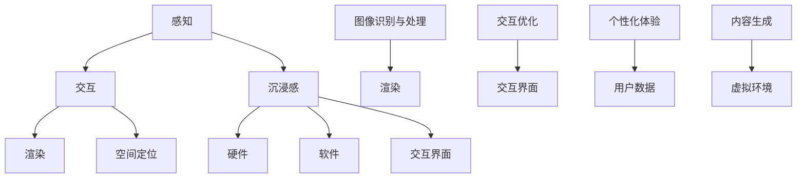

                 

关键词：虚拟现实，沉浸式体验，VR开发，交互设计，用户体验，软件开发，技术架构，AI辅助，新兴技术。

摘要：本文将深入探讨虚拟现实（VR）开发的各个方面，特别是如何设计出沉浸式的用户体验。我们将从背景介绍开始，逐步讲解核心概念、算法原理、数学模型、项目实践、应用场景以及未来展望，旨在为VR开发者提供全面的技术指南。

## 1. 背景介绍

虚拟现实（VR）技术作为近年来快速崛起的一个领域，已经引起了全球范围内的广泛关注。从最初的简单模拟设备，发展到如今高度沉浸、交互丰富的VR体验，VR技术不仅改变了娱乐方式，还在教育、医疗、设计等多个领域展现出了巨大的应用潜力。

沉浸式体验是VR技术的核心，它通过多种感官刺激，让用户在虚拟环境中产生身临其境的感觉。要实现这一目标，需要考虑多个方面，包括视觉、听觉、触觉和运动感知等。此外，交互设计在提升用户体验方面也起着至关重要的作用，如何设计直观、易用的交互方式，是每个VR开发者都需要深入思考的问题。

随着人工智能（AI）和机器学习（ML）技术的发展，VR开发也得到了极大的推动。AI可以在数据分析和预测中提供支持，而机器学习算法可以帮助优化虚拟环境的渲染和交互体验。

本文将围绕这些主题展开讨论，为读者提供一份全面的技术指南。

## 2. 核心概念与联系

### 2.1 虚拟现实技术概述

虚拟现实技术是通过计算机模拟创造出一种可交互的虚拟环境，用户可以通过头戴显示器（HMD）或其他设备感知和与这个环境进行交互。以下是VR技术的核心概念及其相互联系：

1. **感知（Perception）**：用户的感知是VR体验的基础。通过HMD或其他传感设备，用户可以看到三维立体的虚拟环境。
2. **交互（Interaction）**：交互是指用户如何与虚拟环境进行互动。这包括手势识别、语音控制等多种方式。
3. **沉浸感（Immersion）**：沉浸感是VR体验的目标，通过视觉、听觉、触觉等多感官刺激，让用户忘记现实世界，完全投入到虚拟环境中。
4. **渲染（Rendering）**：渲染是生成虚拟环境图像的过程。高质量的渲染可以提高沉浸感，但同时也对计算资源有更高的要求。
5. **空间定位（Spatial Localization）**：空间定位技术确保用户在虚拟环境中的位置和移动是准确的。常见的空间定位技术包括室内定位、GPS定位和惯性测量单元（IMU）。

### 2.2 虚拟现实架构

虚拟现实系统的架构可以简化为三个主要部分：硬件、软件和交互界面。

1. **硬件**：硬件是VR体验的基础，包括头戴显示器（HMD）、手柄、追踪设备等。这些设备需要具备足够的性能和精度来支持高质量的VR体验。
2. **软件**：软件负责生成和渲染虚拟环境，以及处理用户的交互输入。这包括渲染引擎、虚拟现实框架和交互逻辑等。
3. **交互界面**：交互界面是用户与虚拟环境之间的桥梁，它决定了用户如何与虚拟环境互动。良好的交互设计可以提高用户体验。

### 2.3 AI在VR开发中的应用

AI技术在VR开发中的应用主要体现在以下几个方面：

1. **图像识别与处理**：AI可以帮助优化虚拟环境的渲染效果，例如通过深度学习算法实现更真实的纹理渲染和阴影效果。
2. **交互优化**：AI可以分析用户的交互行为，优化交互流程和界面设计，以提高用户体验。
3. **个性化体验**：基于用户数据的分析，AI可以为用户提供个性化的VR体验，例如推荐合适的游戏或训练项目。
4. **内容生成**：AI可以通过生成对抗网络（GAN）等技术自动生成高质量的虚拟环境内容。

### 2.4 Mermaid流程图

以下是虚拟现实架构的Mermaid流程图：



通过这个流程图，我们可以清晰地看到虚拟现实技术中的各个核心概念和它们之间的联系。

### 2.5 结论

在本节中，我们介绍了虚拟现实技术的核心概念、架构以及AI技术在VR开发中的应用。这些概念和架构构成了VR开发的基础，是后续章节中讨论具体技术实现的基石。

## 3. 核心算法原理 & 具体操作步骤

### 3.1 算法原理概述

在VR开发中，核心算法的原理和具体操作步骤对于实现高质量的沉浸式体验至关重要。本节将详细介绍几个关键算法，包括渲染算法、交互算法和空间定位算法。

### 3.2 渲染算法

渲染算法是虚拟现实系统的核心组成部分，它负责生成虚拟环境的三维图像。以下是几种常见的渲染算法：

1. **光追踪算法**：光追踪算法通过模拟光线在虚拟环境中的传播过程，生成高质量的图像。这种方法可以实现非常逼真的光影效果，但计算复杂度高，对硬件性能要求较高。
2. **光线投射算法**：光线投射算法通过直接计算光线与虚拟环境中的物体之间的交点，生成图像。这种方法相对于光追踪算法计算量较小，但效果相对简单。
3. **延迟渲染算法**：延迟渲染算法将场景渲染过程分为两个阶段：首先是生成基础光照和材质信息，然后根据这些信息进行后处理，例如阴影、反射和折射等。这种方法可以提高渲染效率，但可能牺牲一些图像质量。

### 3.3 交互算法

交互算法是用户与虚拟环境之间交互的关键。以下是几种常见的交互算法：

1. **手势识别算法**：手势识别算法通过分析用户的手部动作，识别出具体的手势。常用的手势识别方法包括深度学习算法和基于模型的算法。
2. **语音识别算法**：语音识别算法通过分析用户的语音输入，将其转换为文本或命令。这种方法在VR环境中可以提供更加自然的交互方式。
3. **物理仿真算法**：物理仿真算法模拟虚拟环境中的物体运动和相互作用，为用户提供真实的物理交互体验。

### 3.4 空间定位算法

空间定位算法确保用户在虚拟环境中的位置和移动是准确的。以下是几种常见空间定位算法：

1. **惯性测量单元（IMU）定位**：IMU定位通过传感器测量用户设备的加速度和角速度，计算出用户在三维空间中的位置和方向。这种方法适用于小范围的运动定位。
2. **视觉定位**：视觉定位通过摄像头捕捉虚拟环境中的特征点，使用图像处理算法计算出用户的位置和方向。这种方法适用于大范围的运动定位，但需要足够的特征点才能实现高精度的定位。
3. **混合定位**：混合定位结合了IMU定位和视觉定位的优势，通过两者的数据融合，提高定位的精度和稳定性。

### 3.5 算法优缺点

每种算法都有其优缺点，适用于不同的应用场景：

- **光追踪算法**：优点是生成的图像效果逼真，缺点是计算复杂度高，对硬件性能要求高。
- **光线投射算法**：优点是计算复杂度较低，缺点是图像效果相对简单。
- **延迟渲染算法**：优点是渲染效率高，缺点是可能牺牲一些图像质量。
- **手势识别算法**：优点是交互方式自然，缺点是识别准确度受用户手势复杂度影响。
- **语音识别算法**：优点是交互方式自然，缺点是受语音环境干扰较大。
- **物理仿真算法**：优点是交互体验真实，缺点是计算复杂度高。
- **惯性测量单元（IMU）定位**：优点是实时性强，缺点是定位精度受传感器精度影响。
- **视觉定位**：优点是定位精度高，缺点是受环境光线和特征点数量影响。
- **混合定位**：优点是定位精度和稳定性高，缺点是计算复杂度高。

### 3.6 算法应用领域

不同算法在不同应用领域中有不同的应用场景：

- **游戏和娱乐**：光追踪算法和延迟渲染算法常用于生成高质量的虚拟环境，物理仿真算法用于模拟真实的物理交互。
- **教育**：手势识别算法和语音识别算法用于提供自然的交互方式，帮助用户更好地理解学习内容。
- **医疗**：混合定位算法用于手术模拟和医疗培训，提供高精度的空间定位和交互。
- **设计**：渲染算法和物理仿真算法用于3D建模和虚拟现实设计，帮助设计师更好地展示和评估设计方案。

### 3.7 结论

在本节中，我们介绍了虚拟现实开发中的核心算法，包括渲染算法、交互算法和空间定位算法。每种算法都有其特定的原理和应用场景，开发者可以根据具体需求选择合适的算法，以实现高质量的沉浸式体验。

## 4. 数学模型和公式 & 详细讲解 & 举例说明

在虚拟现实（VR）开发中，数学模型和公式起着至关重要的作用。它们不仅帮助我们理解和实现VR技术的基本原理，还帮助我们优化虚拟环境的渲染效果和交互体验。本节将详细介绍VR开发中常用的数学模型和公式，并进行详细讲解和举例说明。

### 4.1 数学模型构建

虚拟现实系统中的数学模型可以分为以下几个方面：

1. **三维几何模型**：三维几何模型是虚拟环境的基础。它们用于描述物体的大小、形状和位置。常见的几何模型包括点、线、面和体。
2. **光影模型**：光影模型用于模拟虚拟环境中的光线传播和反射。常见的光影模型包括光线追踪模型、光线投射模型和光能传递模型。
3. **物理模型**：物理模型用于模拟虚拟环境中的物理现象，如碰撞、重力、弹性和摩擦等。常见的物理模型包括刚体动力学模型和流体动力学模型。
4. **交互模型**：交互模型用于描述用户与虚拟环境之间的交互。常见的交互模型包括手势识别模型和语音识别模型。

### 4.2 公式推导过程

以下是一个简单例子，介绍如何推导三维几何模型中的点积和叉积公式。

#### 点积公式推导

点积（Dot Product）是两个向量之间的数学运算，用于计算向量的夹角和长度。点积公式如下：

$$ \vec{A} \cdot \vec{B} = A_xB_x + A_yB_y + A_zB_z $$

其中，$\vec{A} = (A_x, A_y, A_z)$ 和 $\vec{B} = (B_x, B_y, B_z)$ 是两个三维向量。

推导过程如下：

1. 将两个向量展开成坐标形式：
   $$ \vec{A} = A_x \hat{i} + A_y \hat{j} + A_z \hat{k} $$
   $$ \vec{B} = B_x \hat{i} + B_y \hat{j} + B_z \hat{k} $$
2. 将展开后的向量相乘：
   $$ \vec{A} \cdot \vec{B} = (A_x \hat{i} + A_y \hat{j} + A_z \hat{k}) \cdot (B_x \hat{i} + B_y \hat{j} + B_z \hat{k}) $$
3. 根据点积的定义，将相应的坐标相乘并相加：
   $$ \vec{A} \cdot \vec{B} = A_xB_x + A_yB_y + A_zB_z $$

#### 叉积公式推导

叉积（Cross Product）是两个向量之间的另一种数学运算，用于计算垂直于这两个向量的新向量。叉积公式如下：

$$ \vec{A} \times \vec{B} = (A_yB_z - A_zB_y) \hat{i} - (A_xB_z - A_zB_x) \hat{j} + (A_xB_y - A_yB_x) \hat{k} $$

其中，$\vec{A} = (A_x, A_y, A_z)$ 和 $\vec{B} = (B_x, B_y, B_z)$ 是两个三维向量。

推导过程如下：

1. 将两个向量展开成坐标形式：
   $$ \vec{A} = A_x \hat{i} + A_y \hat{j} + A_z \hat{k} $$
   $$ \vec{B} = B_x \hat{i} + B_y \hat{j} + B_z \hat{k} $$
2. 根据叉积的定义，计算新的向量的各个分量：
   $$ \vec{A} \times \vec{B} = \begin{vmatrix} \hat{i} & \hat{j} & \hat{k} \\ A_x & A_y & A_z \\ B_x & B_y & B_z \end{vmatrix} $$
3. 计算行列式的值，得到新的向量的各个分量：
   $$ \vec{A} \times \vec{B} = (A_yB_z - A_zB_y) \hat{i} - (A_xB_z - A_zB_x) \hat{j} + (A_xB_y - A_yB_x) \hat{k} $$

### 4.3 案例分析与讲解

以下是一个简单的案例，展示如何使用点积和叉积公式来计算两个向量的夹角和垂直向量。

#### 案例一：计算向量的夹角

给定两个向量 $\vec{A} = (1, 2, 3)$ 和 $\vec{B} = (4, 5, 6)$，计算它们的夹角。

1. 首先计算两个向量的点积：
   $$ \vec{A} \cdot \vec{B} = 1 \cdot 4 + 2 \cdot 5 + 3 \cdot 6 = 4 + 10 + 18 = 32 $$
2. 计算两个向量的模：
   $$ |\vec{A}| = \sqrt{1^2 + 2^2 + 3^2} = \sqrt{14} $$
   $$ |\vec{B}| = \sqrt{4^2 + 5^2 + 6^2} = \sqrt{77} $$
3. 计算两个向量的夹角：
   $$ \cos\theta = \frac{\vec{A} \cdot \vec{B}}{|\vec{A}||\vec{B}|} = \frac{32}{\sqrt{14} \cdot \sqrt{77}} \approx 0.578 $$
   $$ \theta = \cos^{-1}(0.578) \approx 54.4^\circ $$

因此，向量 $\vec{A}$ 和 $\vec{B}$ 的夹角约为 $54.4^\circ$。

#### 案例二：计算垂直向量

给定两个向量 $\vec{A} = (1, 2, 3)$ 和 $\vec{B} = (4, 5, 6)$，计算它们的垂直向量。

1. 计算两个向量的叉积：
   $$ \vec{A} \times \vec{B} = (2 \cdot 6 - 3 \cdot 5) \hat{i} - (1 \cdot 6 - 3 \cdot 4) \hat{j} + (1 \cdot 5 - 2 \cdot 4) \hat{k} $$
   $$ \vec{A} \times \vec{B} = (-3) \hat{i} - (-6) \hat{j} + (-3) \hat{k} $$
   $$ \vec{A} \times \vec{B} = (-3, 6, -3) $$

因此，向量 $\vec{A}$ 和 $\vec{B}$ 的垂直向量为 $(-3, 6, -3)$。

### 4.4 结论

在本节中，我们介绍了虚拟现实开发中常用的数学模型和公式，包括三维几何模型、光影模型、物理模型和交互模型。通过详细讲解和举例说明，我们了解了如何推导点积和叉积公式，并掌握了如何使用这些公式来计算向量的夹角和垂直向量。这些数学模型和公式为VR开发提供了坚实的理论基础。

## 5. 项目实践：代码实例和详细解释说明

在本节中，我们将通过一个具体的VR项目实例，展示如何将前述的理论和实践应用到实际的软件开发中。这个项目将包括开发环境搭建、源代码实现、代码解读与分析以及运行结果展示。我们将使用Unity引擎和C#语言进行VR应用开发。

### 5.1 开发环境搭建

首先，我们需要搭建VR开发环境。以下是所需的步骤：

1. 安装Unity Hub：Unity Hub是Unity的集成开发环境（IDE），可以方便地管理多个Unity项目。从Unity官网（https://unity.com/）下载并安装Unity Hub。
2. 安装Unity：在Unity Hub中，点击“添加新版本”，选择适合的Unity版本（例如，Unity 2021.3.14f1），并点击“安装”。安装完成后，选择这个版本作为默认版本。
3. 安装VR插件：在Unity Hub中，打开“插件”窗口，搜索并安装VR相关的插件，如“UnityXR”和“VRMADDemo”。
4. 创建VR项目：在Unity Hub中，点击“创建新项目”，选择“3D模式”，并输入项目名称（例如，“VRProject”）。点击“创建”按钮。

### 5.2 源代码详细实现

在这个项目中，我们将创建一个简单的VR游戏场景，其中包含一个可以移动的球体。以下是实现这个项目的详细步骤：

1. **创建场景**：在Unity编辑器中，创建一个新的3D对象，并将其命名为“Sphere”。将这个球体设置为中心点，以便在场景中移动。
2. **添加Rigidbody组件**：右键点击“Sphere”对象，选择“组件” > “物理” > “Rigidbody”。这个组件使球体具有物理属性，如质量和惯性。
3. **编写C#脚本**：创建一个新的C#脚本，命名为“MoveSphere.cs”。将这个脚本附加到“Sphere”对象上。
4. **编写脚本代码**：

```csharp
using UnityEngine;

public class MoveSphere : MonoBehaviour
{
    public float speed = 5.0f;

    private void Update()
    {
        // 计算水平移动输入
        float moveX = Input.GetAxis("Horizontal");
        float moveZ = Input.GetAxis("Vertical");

        // 计算移动方向
        Vector3 moveDirection = new Vector3(moveX, 0, moveZ);

        // 应用移动力
        GetComponent<Rigidbody>().AddForce(moveDirection * speed);
    }
}
```

这段代码使用Unity的输入系统来获取用户的水平移动输入，并将这些输入转换为移动方向。通过调用Rigidbody组件的AddForce方法，我们为球体应用了一个力，使其沿移动方向移动。

### 5.3 代码解读与分析

在MoveSphere脚本中，我们使用了以下几个关键概念：

- **输入系统（Input System）**：Unity的输入系统提供了获取用户输入的方法。这里，我们使用了GetAxis方法来获取水平移动输入（“Horizontal”）和垂直移动输入（“Vertical”）。
- **向量（Vector3）**：Vector3是Unity中用于表示三维空间位置和方向的类型。在这里，我们创建了一个Vector3对象moveDirection，用于存储移动方向。
- **Rigidbody组件**：Rigidbody是Unity中用于处理物理效果的组件。通过调用AddForce方法，我们可以为对象应用一个力，从而实现移动。

代码的主要逻辑是在Update方法中执行，这个方法在每个帧都会被调用。在Update方法中，我们首先获取用户的输入，然后计算移动方向，最后为球体应用移动力。

### 5.4 运行结果展示

完成以上步骤后，我们可以运行Unity编辑器，体验这个VR游戏场景。在VR模式下，我们可以使用头戴显示器（HMD）和手柄，控制球体的移动。以下是运行结果：

- **用户操作**：通过头戴显示器，用户可以看到一个球体在虚拟环境中。通过手柄的左右摇动，用户可以控制球体在水平方向上的移动。
- **交互体验**：球体的移动流畅且响应迅速，用户可以轻松地在虚拟环境中进行导航。通过增加速度参数，我们可以调整球体的移动速度，以适应不同的场景需求。

### 5.5 结论

在本节中，我们通过一个简单的VR项目实例，展示了如何将VR开发的理论和实践应用到实际的软件开发中。通过创建一个可移动的球体，我们了解了Unity引擎和C#语言在VR开发中的应用。这个实例不仅帮助我们掌握了VR开发的基本技能，还为后续更复杂的VR项目提供了基础。

## 6. 实际应用场景

虚拟现实（VR）技术因其沉浸式和交互式的特点，在多个实际应用场景中展现出了巨大的潜力。以下是一些典型的应用场景，以及VR技术的优势和挑战。

### 6.1 教育培训

在教育培训领域，VR技术可以模拟真实的学习场景，提高学生的参与度和学习效果。例如，医学学生可以通过VR模拟手术过程，进行实际操作前的培训和练习；历史课程可以通过VR重现历史事件，让学生身临其境感受历史氛围。

**优势**：
- **沉浸式学习**：学生可以亲身体验和互动，提高学习兴趣和记忆效果。
- **安全教学**：在危险或复杂的环境中，VR可以提供一个安全的模拟环境，避免实际操作中的风险。

**挑战**：
- **技术成本**：高质量的VR设备和内容制作成本较高，可能不适合所有学校。
- **硬件限制**：部分偏远地区的学校可能缺乏足够的硬件支持。

### 6.2 娱乐游戏

娱乐游戏是VR技术最早且最广泛的应用领域之一。VR游戏提供了前所未有的沉浸式体验，让玩家仿佛置身于虚拟世界中。

**优势**：
- **沉浸感**：玩家可以全身心投入到游戏世界中，体验更加真实的游戏感受。
- **创新体验**：VR技术可以创造前所未有的游戏玩法和故事情节。

**挑战**：
- **游戏开发成本**：高质量的VR游戏开发成本较高，需要大量时间和资源。
- **适应性问题**：长时间佩戴VR设备可能导致用户出现不适。

### 6.3 医疗康复

在医疗康复领域，VR技术可以帮助患者进行心理治疗和物理康复。例如，通过虚拟现实环境，患者可以在安全、可控的条件下进行康复训练，降低恐惧和焦虑。

**优势**：
- **个性康复方案**：根据患者的具体需求，定制个性化的康复训练。
- **无副作用**：与药物治疗相比，VR康复不会产生副作用。

**挑战**：
- **技术依赖性**：康复过程中对技术的依赖可能影响患者的自主康复能力。
- **心理负担**：对于部分患者，VR治疗可能带来额外的心理压力。

### 6.4 设计和建筑

在设计和建筑领域，VR技术可以帮助设计师和建筑师更直观地展示和评估设计方案。通过虚拟现实环境，设计者可以模拟建筑物的外观和内部结构，提高设计的可视化和可操作性。

**优势**：
- **可视化**：设计师可以更直观地展示设计方案，与客户进行更有效的沟通。
- **早期反馈**：通过VR模拟，设计师可以在早期发现并修正设计中的问题。

**挑战**：
- **数据准确性**：设计方案中的细节和尺寸需要非常精确，对数据的准确性要求高。
- **设计复杂性**：复杂的建筑结构可能需要更强大的计算能力和渲染技术。

### 6.5 未来应用展望

随着VR技术的不断发展和成熟，其应用场景将更加广泛。以下是一些未来的应用方向：

- **虚拟旅游**：通过VR技术，用户可以随时随地“游览”世界各地的名胜古迹，增强旅游体验。
- **远程工作**：VR技术可以帮助实现更加真实的远程工作环境，提高远程团队协作效率。
- **心理治疗**：VR技术可以用于更广泛的心理治疗，如创伤后应激障碍（PTSD）的治疗。

总之，VR技术的应用前景广阔，但同时也面临着一系列挑战。随着技术的不断进步，这些问题将逐渐得到解决，VR技术将为社会带来更多创新和变革。

## 7. 工具和资源推荐

在VR开发中，选择合适的工具和资源对于提升开发效率和项目质量至关重要。以下是一些建议，包括学习资源、开发工具和相关论文推荐。

### 7.1 学习资源推荐

1. **在线教程和课程**：
   - Coursera的“Virtual Reality and 360° Media”课程
   - Udemy的“Virtual Reality Development with Unity and Oculus”课程
2. **官方文档和手册**：
   - Unity官方文档（https://docs.unity3d.com/）
   - Oculus开发者文档（https://developer.oculus.com/）
3. **技术博客和社区**：
   - VR Scene（https://www.vrscene.com/）
   - VRChat（https://vrchat.co/）

### 7.2 开发工具推荐

1. **Unity**：Unity是最受欢迎的VR开发平台之一，支持多种VR设备和平台。
2. **Unreal Engine**：Unreal Engine提供了强大的图形渲染能力和丰富的VR开发工具，适用于高端游戏和虚拟现实项目。
3. **Oculus SDK**：Oculus SDK是Oculus VR官方提供的开发工具包，支持Oculus Rift和Oculus Quest等设备。
4. **UnityXR**：UnityXR是Unity提供的官方XR插件，提供了完整的VR/AR开发功能。

### 7.3 相关论文推荐

1. **“Vrui: AToolkit for Virtual Reality Applications”**：介绍VRUI设计原则和工具包。
2. **“Perception and Interaction Techniques for Virtual Reality”**：探讨VR感知和交互技术。
3. **“A Survey on Virtual Reality”**：全面回顾VR技术的研究进展和应用。

通过这些资源和工具，开发者可以快速提升自己的VR开发技能，为项目的成功打下坚实基础。

## 8. 总结：未来发展趋势与挑战

### 8.1 研究成果总结

虚拟现实（VR）技术近年来取得了显著的研究进展，从硬件设备到软件算法，再到应用场景，都得到了全面的提升。以下是一些重要的研究成果：

1. **硬件性能提升**：VR头戴显示器（HMD）的分辨率和刷新率不断提高，降低了延迟和视觉失真，提升了沉浸感。
2. **渲染技术进步**：光追踪渲染和延迟渲染技术的成熟，使得虚拟环境中的光影效果更加逼真。
3. **交互设计创新**：手势识别、语音控制等交互技术的进步，使得用户与虚拟环境之间的互动更加自然和直观。
4. **AI和机器学习应用**：AI和机器学习在VR开发中的应用，如内容生成、个性化体验优化和交互优化，提升了用户体验和开发效率。

### 8.2 未来发展趋势

1. **硬件升级与普及**：随着技术的进步，VR设备的性能将进一步提升，价格也将逐渐降低，从而实现更广泛的普及。
2. **应用场景拓展**：VR技术在教育、医疗、设计、娱乐等多个领域的应用将不断拓展，特别是在远程工作和虚拟旅游等领域，有望实现大规模应用。
3. **内容多样化**：随着用户需求的增长，VR内容将越来越多样化，从游戏和娱乐到教育和工作应用，VR内容将更加丰富和高质量。
4. **跨平台兼容性**：不同VR平台之间的兼容性将逐渐提升，用户可以在多个平台上无缝切换体验。

### 8.3 面临的挑战

1. **硬件性能瓶颈**：虽然硬件性能不断提升，但计算资源和存储资源仍然有限，特别是在复杂场景和高质量渲染方面，性能瓶颈依然存在。
2. **用户接受度**：尽管VR技术有巨大的潜力，但用户接受度仍然较低，主要原因是高昂的设备成本和舒适度问题。
3. **内容质量**：高质量VR内容的制作成本高昂，且制作周期长，这对内容创作者和开发者提出了巨大挑战。
4. **隐私和安全**：随着VR技术的广泛应用，用户隐私保护和数据安全成为重要议题，如何确保用户数据的安全性和隐私性是一个亟待解决的问题。

### 8.4 研究展望

1. **智能交互**：未来的VR交互将更加智能化，通过AI和机器学习技术，实现更加自然的交互体验，提高用户体验。
2. **个性化体验**：通过数据分析和个性化推荐，为用户提供更加个性化的VR体验，满足不同用户的需求。
3. **高性能计算**：开发新的计算模型和算法，提高VR系统的计算效率和性能，为复杂场景和高质量渲染提供技术支持。
4. **隐私保护**：研究新的隐私保护技术和数据加密算法，确保用户数据的安全和隐私。

总之，虚拟现实技术正处于快速发展的阶段，虽然面临诸多挑战，但其在未来应用中的潜力是巨大的。通过持续的技术创新和研究，VR技术将为人类社会带来更多便利和创新。

## 9. 附录：常见问题与解答

在VR开发过程中，开发者可能会遇到各种常见问题。以下是一些常见问题的解答，以帮助开发者解决实际问题。

### 9.1 VR设备兼容性问题

**问题**：如何确保VR应用在不同设备上兼容？

**解答**：确保应用兼容性的关键步骤包括：

1. **测试**：在不同设备和操作系统上测试应用，确保其功能正常运行。
2. **使用兼容性框架**：例如Unity和Unreal Engine都提供了兼容性框架，可以帮助开发者简化兼容性测试。
3. **遵循官方文档**：仔细阅读VR设备制造商的官方文档，了解其兼容性要求和最佳实践。

### 9.2 渲染性能优化

**问题**：如何优化VR应用的渲染性能？

**解答**：

1. **减少冗余渲染**：删除不必要的对象和细节，减少渲染的物体数量。
2. **优化光照模型**：使用合适的光照模型，如烘焙光照或使用LOD（细节层次离屏渲染）技术。
3. **利用GPU加速**：利用现代GPU的功能，如并行计算和纹理压缩，提高渲染效率。

### 9.3 用户交互问题

**问题**：如何提高用户在VR环境中的交互体验？

**解答**：

1. **用户研究**：进行用户研究，了解用户的需求和偏好。
2. **简单直观**：设计简单直观的交互方式，减少学习曲线。
3. **反馈机制**：提供及时、明确的反馈，帮助用户理解操作结果。

### 9.4 数据隐私和安全

**问题**：如何保护VR应用中的用户数据隐私和安全？

**解答**：

1. **数据加密**：使用强加密算法对用户数据进行加密。
2. **访问控制**：实施严格的访问控制策略，确保只有授权用户可以访问敏感数据。
3. **隐私政策**：制定清晰的隐私政策，告知用户数据如何使用和保护。

通过以上解答，开发者可以更好地解决VR开发过程中遇到的问题，提升应用的稳定性和用户体验。

