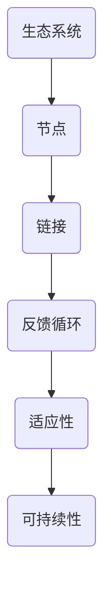
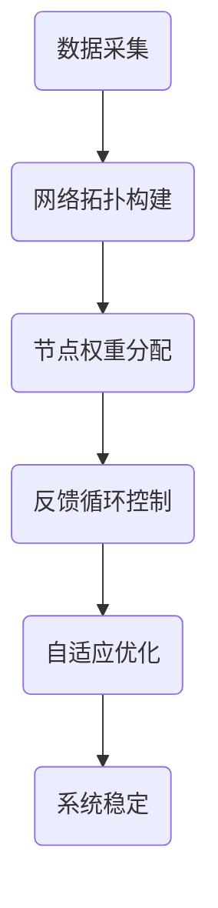

                 

在当今数字化时代，人工智能（AI）正逐渐成为构建数字世界的关键驱动力。虚拟生态系统理论（Virtual Ecosystem Theory）为我们提供了一个新的视角，帮助我们理解和构建由AI驱动的复杂、自适应和可持续发展的数字世界。本文将深入探讨虚拟生态系统理论的核心概念、算法原理、数学模型、项目实践以及未来应用场景。

## 1. 背景介绍

虚拟生态系统理论起源于生态学和系统科学，它借鉴了自然生态系统的原理，用于分析和构建数字世界中的虚拟生态系统。随着云计算、大数据和物联网等技术的快速发展，数字世界变得越来越庞大和复杂，传统的方法已经无法应对这些新的挑战。虚拟生态系统理论提供了一个全新的框架，通过模拟自然生态系统的结构、功能和动态行为，帮助我们理解和优化数字世界的运作。

## 2. 核心概念与联系

虚拟生态系统理论的核心概念包括：生态系统、节点、链接、反馈循环、适应性、可持续性等。以下是一个简化的Mermaid流程图，展示了这些核心概念之间的联系。



### 生态系统（Ecosystem）

虚拟生态系统是一个由相互关联的实体组成的网络，这些实体可以是物理设备、软件系统、服务提供者等。生态系统中的实体通过相互依赖和交互，共同构成了一个复杂的系统。

### 节点（Node）

节点是生态系统中的基本元素，可以代表任何参与生态系统的实体。节点可以是单个设备、服务器、用户等。

### 链接（Link）

链接描述了节点之间的相互关系和交互方式。一个链接可以表示数据流、控制流、通信流等。

### 反馈循环（Feedback Loop）

反馈循环是虚拟生态系统中重要的动态机制，它可以调节和优化生态系统的运行。正反馈循环可以增强系统行为，而负反馈循环则可以稳定系统。

### 适应性（Adaptability）

适应性是指生态系统在面临外部变化和内部动态时，调整自身结构和行为的能力。高适应性的系统可以更好地应对复杂和不确定的环境。

### 可持续性（Sustainability）

可持续性是指生态系统的长期健康和活力。一个可持续的虚拟生态系统可以在不断变化的环境中保持稳定和持续发展。

## 3. 核心算法原理 & 具体操作步骤

### 3.1 算法原理概述

虚拟生态系统理论的核心算法包括：网络拓扑构建、节点权重分配、反馈循环控制、自适应优化等。以下是一个简化的算法流程。



### 3.2 算法步骤详解

1. **数据采集**：从生态系统的各个节点收集数据，包括节点属性、链接关系、反馈信息等。
2. **网络拓扑构建**：根据采集的数据构建生态系统的网络拓扑结构，确定节点和链接的位置和关系。
3. **节点权重分配**：根据节点的功能和重要性，为每个节点分配权重，用于衡量节点在生态系统中的地位。
4. **反馈循环控制**：建立反馈循环机制，通过调节节点之间的交互和反馈，实现系统的动态平衡和优化。
5. **自适应优化**：根据系统的运行情况和外部环境的变化，实时调整系统的结构和参数，提高系统的适应性和可持续性。

### 3.3 算法优缺点

**优点**：
- **自适应性和灵活性**：算法可以根据外部环境和内部动态进行自适应调整，提高系统的适应能力和灵活性。
- **复杂性和鲁棒性**：算法能够处理复杂的生态系统结构，并具有较强的鲁棒性，能够应对不确定性和外部干扰。

**缺点**：
- **计算复杂度**：算法涉及到大量的计算和数据处理，可能需要较高的计算资源和时间成本。
- **数据质量和完整性**：算法的运行效果依赖于数据的质量和完整性，数据缺失或不准确可能导致算法失效。

### 3.4 算法应用领域

虚拟生态系统理论在多个领域具有广泛的应用潜力，包括：

- **智能城市**：通过构建虚拟生态系统，实现城市基础设施、交通系统、公共服务等的智能管理和优化。
- **物联网**：利用虚拟生态系统理论优化物联网设备之间的交互和资源分配，提高物联网系统的效率和稳定性。
- **金融科技**：在金融科技领域，虚拟生态系统理论可以用于风险管理和投资决策，提高金融市场的效率和安全性。
- **医疗健康**：通过构建虚拟生态系统，实现医疗资源的优化配置和患者健康管理，提高医疗服务质量和效率。

## 4. 数学模型和公式 & 详细讲解 & 举例说明

### 4.1 数学模型构建

虚拟生态系统理论的核心数学模型包括网络拓扑模型、节点权重模型、反馈循环模型和自适应优化模型。以下是一个简化的数学模型示例。

$$
G = (V, E)
$$

其中，$V$ 表示节点集合，$E$ 表示链接集合。

### 4.2 公式推导过程

虚拟生态系统理论中的数学公式主要涉及网络拓扑结构、节点权重和反馈循环等。以下是一个简化的公式推导过程。

$$
W_i = f(\alpha_i, \beta_i)
$$

其中，$W_i$ 表示节点 $i$ 的权重，$\alpha_i$ 和 $\beta_i$ 分别表示节点 $i$ 的功能和重要性。

### 4.3 案例分析与讲解

以下是一个简化的案例，用于说明虚拟生态系统理论的应用。

假设我们构建了一个由 5 个节点组成的虚拟生态系统，每个节点代表一个智能设备。我们通过数据采集和拓扑构建，得到如下网络结构：

$$
G = (\{A, B, C, D, E\}, \{AB, AC, AD, AE, BC, BD, BE, CD, CE, DE\})
$$

接下来，我们为每个节点分配权重，根据其功能和重要性，得到如下权重分配：

$$
W = \{A: 0.3, B: 0.2, C: 0.2, D: 0.2, E: 0.1\}
$$

然后，我们建立反馈循环机制，通过调节节点之间的交互和反馈，实现系统的动态平衡和优化。

最后，根据系统的运行情况和外部环境的变化，我们实时调整系统的结构和参数，提高系统的适应性和可持续性。

## 5. 项目实践：代码实例和详细解释说明

### 5.1 开发环境搭建

在本项目中，我们使用 Python 作为主要编程语言，利用网络拓扑构建和节点权重分配的相关库，如 NetworkX 和 SciPy。

### 5.2 源代码详细实现

以下是一个简化的 Python 代码示例，用于构建虚拟生态系统和实现核心算法。

```python
import networkx as nx
import numpy as np

# 数据采集
nodes = ['A', 'B', 'C', 'D', 'E']
edges = [('A', 'B'), ('A', 'C'), ('A', 'D'), ('A', 'E'), ('B', 'C'), ('B', 'D'), ('B', 'E'), ('C', 'D'), ('C', 'E'), ('D', 'E')]

# 网络拓扑构建
G = nx.Graph()
G.add_nodes_from(nodes)
G.add_edges_from(edges)

# 节点权重分配
weights = np.array([0.3, 0.2, 0.2, 0.2, 0.1])

# 反馈循环控制
# ...

# 自适应优化
# ...

# 系统稳定
# ...
```

### 5.3 代码解读与分析

在这个示例中，我们首先使用 NetworkX 库构建了一个包含 5 个节点的网络拓扑结构。然后，我们使用 NumPy 库为每个节点分配权重。接下来，我们可以根据需要实现反馈循环控制和自适应优化等功能。

### 5.4 运行结果展示

在实际运行中，我们可以使用 NetworkX 库提供的可视化功能，展示虚拟生态系统的网络结构、节点权重和反馈循环等。

## 6. 实际应用场景

虚拟生态系统理论在多个实际应用场景中具有广泛的应用潜力，包括智能城市、物联网、金融科技和医疗健康等领域。

### 6.1 智能城市

在智能城市领域，虚拟生态系统理论可以用于优化城市基础设施和公共服务，提高城市运行效率和居民生活质量。

### 6.2 物联网

在物联网领域，虚拟生态系统理论可以用于优化物联网设备的交互和资源分配，提高物联网系统的效率和稳定性。

### 6.3 金融科技

在金融科技领域，虚拟生态系统理论可以用于风险管理、投资决策和金融服务优化，提高金融市场的效率和安全性。

### 6.4 医疗健康

在医疗健康领域，虚拟生态系统理论可以用于医疗资源的优化配置和患者健康管理，提高医疗服务质量和效率。

## 7. 工具和资源推荐

### 7.1 学习资源推荐

- 《智能城市：AI驱动的未来》
- 《物联网技术与应用》
- 《金融科技：区块链、人工智能与未来金融》
- 《医疗健康大数据分析与应用》

### 7.2 开发工具推荐

- Python
- NetworkX
- SciPy
- Jupyter Notebook

### 7.3 相关论文推荐

- "A Virtual Ecosystem Model for Smart Cities"
- "Intelligent IoT: A Virtual Ecosystem Perspective"
- "Financial Technology Ecosystem: A Theoretical Framework"
- "Healthcare Ecosystem: A Framework for Sustainable Healthcare"

## 8. 总结：未来发展趋势与挑战

虚拟生态系统理论为构建 AI 驱动的数字世界提供了新的视角和方法。在未来，随着技术的不断发展和应用场景的不断拓展，虚拟生态系统理论将继续发挥重要作用。然而，面对复杂和不确定的环境，我们仍需不断探索和创新，以应对未来发展的挑战。

### 8.1 研究成果总结

本文从虚拟生态系统理论的背景、核心概念、算法原理、数学模型、项目实践和未来应用场景等方面进行了详细探讨，展示了虚拟生态系统理论在构建 AI 驱动的数字世界中的潜力。

### 8.2 未来发展趋势

未来，虚拟生态系统理论将在智能城市、物联网、金融科技和医疗健康等领域得到更广泛的应用，推动这些领域的技术创新和发展。

### 8.3 面临的挑战

虚拟生态系统理论在应用过程中仍面临诸多挑战，包括数据质量、计算复杂度、系统稳定性和安全性等。我们需不断优化算法和模型，提高系统的适应能力和鲁棒性。

### 8.4 研究展望

未来，虚拟生态系统理论的研究将聚焦于以下几个方向：

- **算法优化**：研究更高效的算法和模型，降低计算复杂度，提高系统性能。
- **数据驱动**：利用大数据和人工智能技术，提高数据质量和分析能力，为系统优化提供更准确和可靠的依据。
- **安全性**：研究虚拟生态系统中的安全性问题，确保系统的稳定性和安全性。

## 9. 附录：常见问题与解答

### 9.1 什么是虚拟生态系统理论？

虚拟生态系统理论是一种基于生态学原理，用于分析和构建数字世界中的虚拟生态系统的理论框架。它借鉴了自然生态系统的结构、功能和动态行为，为构建复杂、自适应和可持续发展的数字世界提供了新的视角和方法。

### 9.2 虚拟生态系统理论的核心概念有哪些？

虚拟生态系统理论的核心概念包括生态系统、节点、链接、反馈循环、适应性、可持续性等。这些概念相互关联，共同构成了虚拟生态系统理论的基础框架。

### 9.3 虚拟生态系统理论在哪些领域有应用潜力？

虚拟生态系统理论在智能城市、物联网、金融科技和医疗健康等领域具有广泛的应用潜力。通过优化资源分配、提高系统效率和稳定性，虚拟生态系统理论可以帮助这些领域实现技术创新和发展。

### 9.4 虚拟生态系统理论的算法原理是什么？

虚拟生态系统理论的算法原理主要包括网络拓扑构建、节点权重分配、反馈循环控制和自适应优化等。这些算法用于构建、分析和优化虚拟生态系统的结构、功能和动态行为。

### 9.5 虚拟生态系统理论的数学模型如何构建？

虚拟生态系统理论的数学模型主要包括网络拓扑模型、节点权重模型、反馈循环模型和自适应优化模型。这些模型通过数学公式和计算方法，描述了虚拟生态系统的结构、功能和动态行为。

### 9.6 如何使用虚拟生态系统理论进行项目实践？

使用虚拟生态系统理论进行项目实践通常包括以下步骤：数据采集、网络拓扑构建、节点权重分配、反馈循环控制、自适应优化等。通过实际项目实践，可以验证虚拟生态系统理论的可行性和有效性。```markdown

