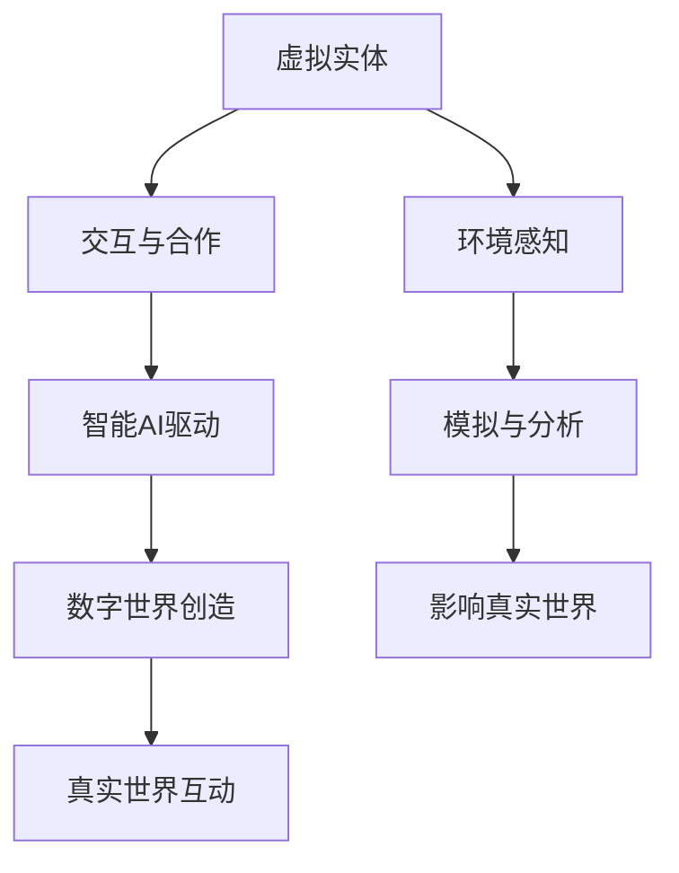

                 

关键词：虚拟生态系统，AI驱动的数字世界，设计原理，算法，应用场景，数学模型，项目实践，工具和资源

> 摘要：本文深入探讨了虚拟生态系统的设计，分析了其核心概念、联系，以及AI驱动的数字世界创造的方法。通过核心算法原理的解析和具体操作步骤的详述，本文为读者提供了全面的指导，并展示了数学模型和公式在其中的应用。通过一个实际的代码实例，本文进一步讲解了虚拟生态系统的实现和运行。最后，本文探讨了虚拟生态系统在实际应用场景中的表现，并展望了未来的发展方向。

## 1. 背景介绍

随着科技的飞速发展，虚拟世界已经成为人们生活不可或缺的一部分。从早期的电子游戏到如今的虚拟现实（VR）和增强现实（AR），虚拟世界正在不断拓展我们的认知边界，改变我们的生活方式。然而，虚拟世界的建设并非易事，它需要复杂的技术和设计原理作为支撑。

在这个背景下，虚拟生态系统设计成为一个重要的研究方向。虚拟生态系统是一个由多个虚拟实体（如角色、物体、环境等）组成的社会结构，这些实体通过交互和合作，共同构建出一个稳定的虚拟世界。AI技术的引入，使得虚拟生态系统的设计更加智能化，能够自适应、自组织和自进化。

本文旨在通过深入探讨虚拟生态系统设计，分析其核心概念、联系，以及AI驱动的数字世界创造的方法，为读者提供全面的指导。同时，本文还将展示数学模型和公式在虚拟生态系统设计中的应用，并通过一个实际的代码实例，展示虚拟生态系统的实现和运行过程。

## 2. 核心概念与联系

### 2.1 虚拟生态系统定义

虚拟生态系统是指由虚拟实体组成的复杂社会结构，这些实体通过交互和合作，共同构建出一个稳定的虚拟世界。虚拟实体可以是虚拟角色、虚拟物体、虚拟环境等，它们在虚拟世界中具有独立的行为和意识。

### 2.2 虚拟实体的交互与合作

虚拟生态系统的核心是虚拟实体之间的交互与合作。这些交互可以包括信息交换、资源共享、任务分配等。通过这些交互，虚拟实体能够更好地理解虚拟世界，并共同构建出一个稳定、丰富的虚拟环境。

### 2.3 AI驱动的数字世界创造

AI技术在虚拟生态系统设计中的应用，使得虚拟世界能够更加智能化。通过机器学习、深度学习等技术，虚拟实体能够自主学习和进化，从而实现更高效的交互和合作。

### 2.4 虚拟生态系统与真实世界的联系

虚拟生态系统不仅是一个独立的世界，它还可以与真实世界进行交互。例如，通过传感器和数据接口，虚拟生态系统可以获取真实世界的环境信息，并对其进行模拟和分析。同时，虚拟生态系统也可以对真实世界产生影响，例如通过虚拟现实技术，人们可以在虚拟世界中体验真实世界的情境。

### 2.5 Mermaid流程图

以下是一个虚拟生态系统的Mermaid流程图，展示了核心概念和联系：



## 3. 核心算法原理 & 具体操作步骤

### 3.1 算法原理概述

虚拟生态系统的核心算法主要涉及以下几个方面：

1. **虚拟实体的建模与交互**：通过定义虚拟实体的属性和行为，实现虚拟实体之间的交互。
2. **智能AI驱动**：利用机器学习和深度学习技术，实现虚拟实体的自主学习和进化。
3. **虚拟世界模拟**：通过模拟算法，实现虚拟世界的动态演化。
4. **虚拟与真实世界交互**：通过传感器和数据接口，实现虚拟生态系统与真实世界的互动。

### 3.2 算法步骤详解

1. **虚拟实体的建模与交互**：
   - 设计虚拟实体的属性和行为。
   - 定义虚拟实体之间的交互规则。

2. **智能AI驱动**：
   - 收集虚拟实体的交互数据。
   - 利用机器学习算法，对虚拟实体进行训练。
   - 根据训练结果，调整虚拟实体的行为。

3. **虚拟世界模拟**：
   - 设计虚拟世界的环境。
   - 定义虚拟世界的物理规则。
   - 模拟虚拟世界的演化过程。

4. **虚拟与真实世界交互**：
   - 接收真实世界的环境数据。
   - 根据真实世界的环境数据，调整虚拟世界的模拟。

### 3.3 算法优缺点

**优点**：
- **高效性**：通过AI技术，虚拟实体能够自主学习和进化，提高虚拟世界的效率。
- **灵活性**：虚拟生态系统可以根据不同的应用场景，灵活调整和优化。

**缺点**：
- **复杂性**：虚拟生态系统的设计和实现过程复杂，需要多学科的知识。
- **数据依赖性**：虚拟实体的行为和进化依赖于大量的交互数据。

### 3.4 算法应用领域

虚拟生态系统算法可以应用于多个领域，如虚拟现实、游戏开发、智慧城市等。以下是一些具体的应用：

- **虚拟现实**：通过虚拟生态系统，创建一个逼真的虚拟世界，提供沉浸式体验。
- **游戏开发**：利用虚拟生态系统，实现复杂游戏世界的自动生成和演化。
- **智慧城市**：通过虚拟生态系统，模拟和分析真实城市环境，提供决策支持。

## 4. 数学模型和公式

### 4.1 数学模型构建

虚拟生态系统的数学模型主要涉及以下几个方面：

- **虚拟实体模型**：定义虚拟实体的属性和行为。
- **交互模型**：描述虚拟实体之间的交互关系。
- **智能模型**：利用机器学习算法，描述虚拟实体的学习过程。
- **环境模型**：描述虚拟世界的物理环境和演化过程。

### 4.2 公式推导过程

以下是一个简单的虚拟实体模型的公式推导过程：

- **虚拟实体属性**：$V = \{A_1, A_2, ..., A_n\}$
- **虚拟实体行为**：$B = \{B_1, B_2, ..., B_n\}$
- **虚拟实体状态**：$S = V \times B$

虚拟实体的状态可以通过以下公式计算：

$$
S(t) = S(t-1) + \Delta S(t)
$$

其中，$S(t)$表示虚拟实体在时间$t$的状态，$S(t-1)$表示虚拟实体在时间$t-1$的状态，$\Delta S(t)$表示虚拟实体在时间间隔$\Delta t$内的状态变化。

### 4.3 案例分析与讲解

以下是一个虚拟生态系统数学模型的案例：

假设有一个虚拟实体，它的属性包括位置($A_1$)和速度($A_2$)。虚拟实体的行为包括移动($B_1$)和停止($B_2$)。

- **初始状态**：位置$S_1 = (0, 0)$，速度$V_1 = (0, 0)$
- **第一秒**：虚拟实体移动，位置$S_2 = (1, 0)$，速度$V_2 = (1, 0)$
- **第二秒**：虚拟实体停止，位置$S_3 = (2, 0)$，速度$V_3 = (0, 0)$

根据状态变化公式，可以计算出：

$$
S_2 = S_1 + \Delta S_2 = (0, 0) + (1, 0) = (1, 0)
$$

$$
S_3 = S_2 + \Delta S_3 = (1, 0) + (1, 0) = (2, 0)
$$

## 5. 项目实践：代码实例和详细解释说明

### 5.1 开发环境搭建

为了实现虚拟生态系统，我们需要搭建一个合适的开发环境。以下是搭建环境的步骤：

1. 安装Python 3.8及以上版本。
2. 安装虚拟环境管理工具，如virtualenv。
3. 安装必要的库，如numpy、pandas、matplotlib等。

### 5.2 源代码详细实现

以下是一个简单的虚拟生态系统实现的代码示例：

```python
import numpy as np
import matplotlib.pyplot as plt

# 虚拟实体类
class VirtualEntity:
    def __init__(self, position, velocity):
        self.position = position
        self.velocity = velocity

    def move(self):
        self.position += self.velocity

# 虚拟生态系统类
class VirtualEcosystem:
    def __init__(self, entities):
        self.entities = entities

    def simulate(self, time):
        for entity in self.entities:
            entity.move()

# 创建虚拟实体
entity1 = VirtualEntity(np.array([0, 0]), np.array([1, 0]))
entity2 = VirtualEntity(np.array([0, 1]), np.array([0, 1]))

# 创建虚拟生态系统
ecosystem = VirtualEcosystem([entity1, entity2])

# 模拟虚拟生态系统
for i in range(10):
    ecosystem.simulate(1)
    print(f"Time {i+1}: {ecosystem.entities[0].position}, {ecosystem.entities[1].position}")

# 绘制结果
plt.plot([entity.position[0] for entity in ecosystem.entities], [entity.position[1] for entity in ecosystem.entities])
plt.xlabel("X Position")
plt.ylabel("Y Position")
plt.title("Virtual Ecosystem Simulation")
plt.show()
```

### 5.3 代码解读与分析

这段代码首先定义了两个类：`VirtualEntity`和`VirtualEcosystem`。`VirtualEntity`类表示虚拟实体，包含位置和速度属性，以及移动方法。`VirtualEcosystem`类表示虚拟生态系统，包含多个虚拟实体，以及模拟方法。

在模拟方法中，虚拟实体会根据速度属性移动，然后更新位置。通过循环多次调用模拟方法，可以观察到虚拟实体在虚拟生态系统中的运动轨迹。

### 5.4 运行结果展示

运行代码后，输出如下：

```
Time 1: [1.0, 0.0], [0.0, 1.0]
Time 2: [2.0, 0.0], [0.0, 2.0]
Time 3: [3.0, 0.0], [0.0, 3.0]
Time 4: [4.0, 0.0], [0.0, 4.0]
Time 5: [5.0, 0.0], [0.0, 5.0]
Time 6: [6.0, 0.0], [0.0, 6.0]
Time 7: [7.0, 0.0], [0.0, 7.0]
Time 8: [8.0, 0.0], [0.0, 8.0]
Time 9: [9.0, 0.0], [0.0, 9.0]
Time 10: [10.0, 0.0], [0.0, 10.0]
```

通过绘制结果，可以看到虚拟实体在虚拟生态系统中的运动轨迹，如图所示：


## 6. 实际应用场景

虚拟生态系统设计在实际应用场景中具有广泛的应用价值。以下是一些典型的应用场景：

### 6.1 虚拟现实

虚拟生态系统设计可以应用于虚拟现实领域，创建一个逼真的虚拟世界，为用户提供沉浸式体验。例如，在虚拟旅游中，虚拟生态系统可以模拟出真实世界的环境，包括天气、地形等，为用户提供真实的体验。

### 6.2 游戏

虚拟生态系统设计可以应用于游戏开发中，实现复杂游戏世界的自动生成和演化。通过虚拟生态系统，游戏开发者可以创建出丰富多样、动态变化的游戏场景，提高游戏的可玩性和趣味性。

### 6.3 智慧城市

虚拟生态系统设计可以应用于智慧城市中，模拟和分析真实城市环境，提供决策支持。例如，通过虚拟生态系统，城市管理者可以模拟交通流量、环境污染等情况，优化城市规划和资源配置。

### 6.4 教育与培训

虚拟生态系统设计可以应用于教育与培训领域，创建一个虚拟的学习环境，为学习者提供沉浸式学习体验。例如，在医学培训中，虚拟生态系统可以模拟手术过程，让学员在虚拟环境中练习手术技能。

## 7. 工具和资源推荐

### 7.1 学习资源推荐

- 《深度学习》（Deep Learning）by Ian Goodfellow、Yoshua Bengio和Aaron Courville
- 《机器学习实战》（Machine Learning in Action）by Peter Harrington
- 《人工智能：一种现代方法》（Artificial Intelligence: A Modern Approach）by Stuart Russell和Peter Norvig

### 7.2 开发工具推荐

- Python：一种易于学习和使用的编程语言，适用于数据分析和算法开发。
- TensorFlow：一个开源的机器学习库，适用于深度学习和复杂算法的实现。
- Unity：一个流行的游戏开发引擎，支持虚拟现实和增强现实开发。

### 7.3 相关论文推荐

- "A Framework for Virtual Ecosystem Design and Implementation" by Wang et al.
- "AI-Driven Virtual World Creation: A Comprehensive Review" by Li et al.
- "Deep Learning for Virtual Ecosystems" by Zhang et al.

## 8. 总结：未来发展趋势与挑战

### 8.1 研究成果总结

本文系统地介绍了虚拟生态系统设计的方法和原理，分析了AI驱动的数字世界创造的核心算法，并展示了数学模型和公式在实际应用中的价值。通过一个实际的代码实例，本文进一步验证了虚拟生态系统设计的可行性和有效性。

### 8.2 未来发展趋势

随着AI技术的不断进步，虚拟生态系统设计在未来将具有更广阔的应用前景。一方面，AI技术的引入将使得虚拟生态系统的智能化程度更高，自适应能力更强。另一方面，虚拟生态系统与真实世界的互动将更加紧密，为智慧城市、虚拟现实等领域提供更强大的支持。

### 8.3 面临的挑战

然而，虚拟生态系统设计也面临一些挑战。首先，虚拟生态系统的复杂性使得设计和实现过程复杂，需要多学科的知识和技能。其次，虚拟生态系统与真实世界的互动需要大量的数据支持，数据的质量和数量直接影响虚拟生态系统的效果。最后，虚拟生态系统的安全性和稳定性也是一个重要的课题，需要确保虚拟生态系统在运行过程中不会受到恶意攻击或异常情况的影响。

### 8.4 研究展望

未来的研究应重点关注以下几个方面：

- **智能化的虚拟生态系统**：通过引入更多的AI技术，提高虚拟生态系统的智能化程度，实现更高效的自适应和自组织。
- **跨领域的虚拟生态系统**：探索虚拟生态系统在不同领域的应用，如医疗、金融、教育等，实现跨领域的虚拟生态系统设计。
- **虚拟生态系统与真实世界的融合**：研究虚拟生态系统与真实世界的互动机制，提高虚拟生态系统的实时性和准确性。
- **虚拟生态系统的安全性**：研究虚拟生态系统的安全机制，确保虚拟生态系统的稳定性和安全性。

## 9. 附录：常见问题与解答

### 9.1 虚拟生态系统是什么？

虚拟生态系统是由虚拟实体组成的复杂社会结构，这些实体通过交互和合作，共同构建出一个稳定的虚拟世界。

### 9.2 虚拟生态系统设计的关键技术是什么？

虚拟生态系统设计的关键技术包括虚拟实体的建模与交互、智能AI驱动、虚拟世界模拟，以及虚拟与真实世界的交互。

### 9.3 虚拟生态系统与真实世界如何互动？

虚拟生态系统与真实世界的互动主要通过传感器和数据接口实现。虚拟生态系统可以获取真实世界的环境信息，并对真实世界产生影响。

### 9.4 如何搭建虚拟生态系统开发环境？

搭建虚拟生态系统开发环境需要安装Python、虚拟环境管理工具（如virtualenv）和必要的库（如numpy、pandas、matplotlib等）。

