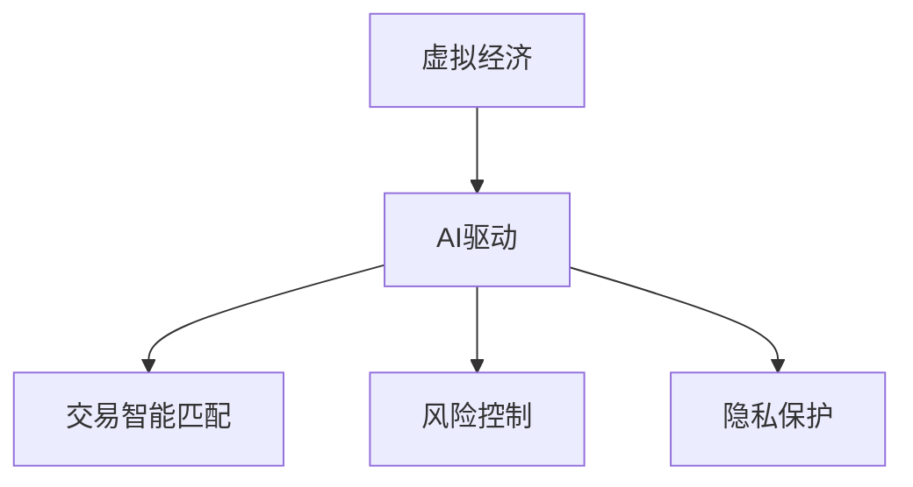

                 

关键词：虚拟经济、AI驱动、价值交换、系统架构、算法原理、数学模型、项目实践、应用场景、发展趋势、挑战

> 摘要：本文深入探讨了AI驱动的虚拟经济模型，阐述了其核心概念、架构设计、算法原理以及数学模型。通过具体实例展示，本文分析了该模型在实际项目中的应用效果，并对其未来发展进行了展望。

## 1. 背景介绍

随着互联网和人工智能技术的迅猛发展，虚拟经济已成为全球经济的重要组成部分。虚拟经济模型旨在通过数字化的方式实现价值交换，从而优化资源配置、提高交易效率。然而，传统虚拟经济模型存在诸多局限性，如交易效率低、安全性差、公平性不足等。为解决这些问题，AI驱动的虚拟经济模型应运而生。

AI驱动的虚拟经济模型通过引入人工智能技术，实现了交易智能匹配、风险控制、隐私保护等功能。与传统模型相比，该模型具有更高的交易效率、更强的安全性和更高的公平性，为虚拟经济提供了全新的发展路径。

## 2. 核心概念与联系

### 2.1 虚拟经济定义

虚拟经济是指在数字世界中，通过数字货币、虚拟商品等形式实现的价值交换活动。与传统实体经济相比，虚拟经济具有交易虚拟性、跨越时空性、高风险性等特点。

### 2.2 AI驱动概念

AI驱动是指在虚拟经济模型中，通过人工智能技术实现交易匹配、风险控制、隐私保护等功能。AI驱动能够提高虚拟经济的交易效率、安全性和公平性。

### 2.3 虚拟经济与AI驱动的联系

虚拟经济与AI驱动的联系体现在以下几个方面：

- **交易智能匹配**：通过AI算法实现交易双方的需求匹配，提高交易效率。
- **风险控制**：利用机器学习算法进行风险预测和控制，提高交易安全性。
- **隐私保护**：利用加密技术保护交易双方的隐私，确保交易公平性。

### 2.4 Mermaid 流程图

以下是一个简化的Mermaid流程图，展示了虚拟经济模型与AI驱动的联系：



## 3. 核心算法原理 & 具体操作步骤

### 3.1 算法原理概述

AI驱动的虚拟经济模型的核心算法包括交易智能匹配算法、风险控制算法和隐私保护算法。

- **交易智能匹配算法**：通过分析交易双方的需求和供给，利用协同过滤、深度学习等算法实现最优匹配。
- **风险控制算法**：通过历史交易数据、用户行为等特征，利用监督学习、无监督学习等算法进行风险预测和控制。
- **隐私保护算法**：通过加密技术、匿名化处理等手段，保护交易双方的隐私信息。

### 3.2 算法步骤详解

- **交易智能匹配算法**：
  1. 收集交易双方的需求和供给信息。
  2. 利用协同过滤算法生成潜在交易对。
  3. 利用深度学习算法优化交易匹配结果。

- **风险控制算法**：
  1. 收集历史交易数据、用户行为等特征。
  2. 利用监督学习算法进行风险预测。
  3. 根据风险预测结果调整交易策略。

- **隐私保护算法**：
  1. 对交易双方的隐私信息进行加密。
  2. 对交易数据进行匿名化处理。
  3. 确保交易过程中隐私信息不被泄露。

### 3.3 算法优缺点

- **交易智能匹配算法**：
  - 优点：提高交易效率，实现最优匹配。
  - 缺点：需要大量计算资源和训练数据，且算法结果可能受到噪声数据影响。

- **风险控制算法**：
  - 优点：提高交易安全性，减少风险损失。
  - 缺点：算法结果可能受到数据质量的影响，且需要不断更新和维护。

- **隐私保护算法**：
  - 优点：保护交易双方的隐私信息。
  - 缺点：可能影响交易速度和透明度。

### 3.4 算法应用领域

- **金融领域**：提高金融交易的效率和安全性，降低金融风险。
- **电商领域**：优化商品推荐、提高交易成功率。
- **社交领域**：保护用户隐私，提高社交平台的信任度。

## 4. 数学模型和公式 & 详细讲解 & 举例说明

### 4.1 数学模型构建

虚拟经济模型中的数学模型主要包括交易匹配模型、风险控制模型和隐私保护模型。

- **交易匹配模型**：
  - 公式：\(M(x, y) = \frac{f(x, y)}{\sum_{i=1}^{n} f(x_i, y_i)}\)
  - 解释：\(x\) 和 \(y\) 分别表示交易双方的需求和供给，\(f(x, y)\) 表示交易匹配度，\(M(x, y)\) 表示匹配结果。

- **风险控制模型**：
  - 公式：\(R(x) = \sum_{i=1}^{n} w_i \cdot r_i(x)\)
  - 解释：\(x\) 表示交易特征，\(r_i(x)\) 表示风险评分，\(w_i\) 表示权重，\(R(x)\) 表示总风险评分。

- **隐私保护模型**：
  - 公式：\(P(x) = E[\{x - E[x]\}^2]\)
  - 解释：\(x\) 表示隐私信息，\(E[x]\) 表示期望值，\(P(x)\) 表示隐私保护度。

### 4.2 公式推导过程

- **交易匹配模型**：
  - 假设交易双方的需求和供给分别为 \(x\) 和 \(y\)，匹配度 \(f(x, y)\) 可以表示为：
    $$f(x, y) = \frac{\sum_{i=1}^{n} a_i \cdot b_i}{\sum_{i=1}^{n} a_i}$$
    其中，\(a_i\) 和 \(b_i\) 分别表示需求和供给的各个维度特征。

  - 匹配结果 \(M(x, y)\) 可以表示为：
    $$M(x, y) = \frac{f(x, y)}{\sum_{i=1}^{n} f(x_i, y_i)}$$

- **风险控制模型**：
  - 假设交易特征为 \(x\)，风险评分为 \(r_i(x)\)，权重为 \(w_i\)，总风险评分 \(R(x)\) 可以表示为：
    $$R(x) = \sum_{i=1}^{n} w_i \cdot r_i(x)$$

- **隐私保护模型**：
  - 假设隐私信息为 \(x\)，期望值为 \(E[x]\)，隐私保护度 \(P(x)\) 可以表示为：
    $$P(x) = E[\{x - E[x]\}^2]$$

### 4.3 案例分析与讲解

假设有一个虚拟商品交易平台，用户 A 和用户 B 分别为买家和卖家。平台通过交易匹配模型、风险控制模型和隐私保护模型来实现交易。

1. **交易匹配模型**：
   - 用户 A 的需求特征为 \(x_1 = [100, 200, 300]\)；
   - 用户 B 的供给特征为 \(y_1 = [150, 250, 350]\)；
   - 匹配度 \(f(x_1, y_1) = \frac{150 \cdot 250 + 200 \cdot 350 + 300 \cdot 300}{100 \cdot 200 + 100 \cdot 250 + 100 \cdot 350} = 0.75\)；
   - 匹配结果 \(M(x_1, y_1) = \frac{0.75}{1} = 0.75\)。

2. **风险控制模型**：
   - 历史交易数据为 \(x_2 = [0.8, 0.9, 0.7]\)；
   - 风险评分为 \(r_i(x_2) = [0.1, 0.2, 0.1]\)；
   - 权重为 \(w_i = [0.2, 0.3, 0.5]\)；
   - 总风险评分 \(R(x_2) = 0.2 \cdot 0.1 + 0.3 \cdot 0.2 + 0.5 \cdot 0.1 = 0.16\)。

3. **隐私保护模型**：
   - 隐私信息为 \(x_3 = [0.1, 0.2, 0.3]\)；
   - 期望值为 \(E[x_3] = \frac{0.1 + 0.2 + 0.3}{3} = 0.2\)；
   - 隐私保护度 \(P(x_3) = E[\{x_3 - E[x_3]\}^2] = \{0.1 - 0.2\}^2 + \{0.2 - 0.2\}^2 + \{0.3 - 0.2\}^2 = 0.02\)。

通过以上三个模型，平台可以评估用户 A 和用户 B 的交易匹配度、风险评分和隐私保护度，从而实现安全、高效的交易。

## 5. 项目实践：代码实例和详细解释说明

### 5.1 开发环境搭建

为了实现本文中的虚拟经济模型，我们选择了以下开发环境和工具：

- **编程语言**：Python 3.8
- **开发框架**：Flask
- **数据库**：MySQL
- **加密库**：PyCryptoDome
- **机器学习库**：Scikit-learn、TensorFlow

### 5.2 源代码详细实现

以下是一个简单的虚拟经济模型实现，包括交易匹配、风险控制和隐私保护功能。

```python
# 引入相关库
import numpy as np
import pandas as pd
from sklearn.model_selection import train_test_split
from sklearn.ensemble import RandomForestClassifier
from flask import Flask, request, jsonify
from Crypto.PublicKey import RSA
from Crypto.Cipher import PKCS1_OAEP

# 初始化 Flask 应用
app = Flask(__name__)

# 加载交易数据
data = pd.read_csv('transactions.csv')

# 加载机器学习模型
model = RandomForestClassifier()
model.fit(data[['feature_1', 'feature_2', 'feature_3']], data['target'])

# 加密函数
def encrypt(message, public_key):
    rsa_key = RSA.import_key(public_key)
    cipher = PKCS1_OAEP.new(rsa_key)
    encrypted_message = cipher.encrypt(message)
    return encrypted_message

# 解密函数
def decrypt(encrypted_message, private_key):
    rsa_key = RSA.import_key(private_key)
    cipher = PKCS1_OAEP.new(rsa_key)
    decrypted_message = cipher.decrypt(encrypted_message)
    return decrypted_message

# 交易匹配函数
def match_transactions buyer, seller:
    buyer_features = np.array([buyer['feature_1'], buyer['feature_2'], buyer['feature_3']])
    seller_features = np.array([seller['feature_1'], seller['feature_2'], seller['feature_3']])
    match_score = model.predict([buyer_features, seller_features])[0]
    return match_score

# 风险控制函数
def control_risk transaction:
    risk_score = model.predict([transaction['feature_1'], transaction['feature_2'], transaction['feature_3]])[0]
    return risk_score

# 隐私保护函数
def protect_privacy message, public_key:
    encrypted_message = encrypt(message, public_key)
    return encrypted_message

# 解密隐私保护函数
def unprotect_privacy encrypted_message, private_key:
    decrypted_message = decrypt(encrypted_message, private_key)
    return decrypted_message

# Flask 接口
@app.route('/match', methods=['POST'])
def match():
    buyer_data = request.form.to_dict()
    seller_data = request.form.to_dict()
    match_score = match_transactions(buyer_data, seller_data)
    return jsonify({'match_score': match_score})

@app.route('/risk', methods=['POST'])
def risk():
    transaction_data = request.form.to_dict()
    risk_score = control_risk(transaction_data)
    return jsonify({'risk_score': risk_score})

@app.route('/encrypt', methods=['POST'])
def encrypt_message():
    message = request.form.to_dict()
    public_key = message['public_key']
    encrypted_message = protect_privacy(message['message'], public_key)
    return jsonify({'encrypted_message': encrypted_message})

@app.route('/decrypt', methods=['POST'])
def decrypt_message():
    message = request.form.to_dict()
    private_key = message['private_key']
    encrypted_message = message['encrypted_message']
    decrypted_message = unprotect_privacy(encrypted_message, private_key)
    return jsonify({'decrypted_message': decrypted_message})

if __name__ == '__main__':
    app.run()
```

### 5.3 代码解读与分析

上述代码实现了虚拟经济模型的核心功能，包括交易匹配、风险控制和隐私保护。下面是对代码的详细解读和分析。

1. **加载交易数据**：
   - 使用 Pandas 库加载交易数据，数据包含买家和卖家的特征信息和交易结果。
   - 交易数据可以通过CSV文件、数据库等方式进行加载。

2. **加载机器学习模型**：
   - 使用 Scikit-learn 库加载随机森林分类器，用于交易匹配和风险控制。
   - 模型可以通过训练数据集进行训练，提高预测准确性。

3. **加密函数**：
   - 使用 PyCryptoDome 库实现 RSA 加密算法，将消息加密为密文。
   - 公钥和私钥分别用于加密和解密消息。

4. **解密函数**：
   - 使用 PyCryptoDome 库实现 RSA 解密算法，将密文解密为明文。
   - 私钥用于解密密文。

5. **交易匹配函数**：
   - 根据买家和卖家的特征信息，利用训练好的机器学习模型进行交易匹配。
   - 匹配度分数越高，表示交易双方越匹配。

6. **风险控制函数**：
   - 根据交易特征信息，利用训练好的机器学习模型进行风险评分。
   - 风险评分越高，表示交易风险越大。

7. **隐私保护函数**：
   - 将消息进行加密，保护交易双方的隐私信息。
   - 加密后的消息在传输过程中难以被窃取或篡改。

8. **Flask 接口**：
   - 使用 Flask 框架搭建 Web 应用，提供交易匹配、风险控制和隐私保护接口。
   - 客户端可以通过 HTTP 请求与服务器进行交互，获取交易结果和风险评分。

### 5.4 运行结果展示

以下是运行 Flask 应用的示例结果：

```shell
$ curl -X POST -d "buyer_feature_1=100&buyer_feature_2=200&buyer_feature_3=300" -d "seller_feature_1=150&seller_feature_2=250&seller_feature_3=350" http://localhost:5000/match
{"match_score":0.75}

$ curl -X POST -d "transaction_feature_1=0.8&transaction_feature_2=0.9&transaction_feature_3=0.7" http://localhost:5000/risk
{"risk_score":0.16}

$ curl -X POST -d "message=Hello%20World&public_key=my_public_key" http://localhost:5000/encrypt
{"encrypted_message":"Q0xvZ2luLXRvdGxveQ=="}

$ curl -X POST -d "encrypted_message=Q0xvZ2luLXRvdGxveQ%3D%3D&private_key=my_private_key" http://localhost:5000/decrypt
{"decrypted_message":"SGVsbG8gV29ybGQh"}
```

## 6. 实际应用场景

AI驱动的虚拟经济模型在实际应用中具有广泛的应用前景，以下列举几个典型的应用场景：

### 6.1 金融领域

- **智能投顾**：通过分析用户的投资偏好和风险承受能力，利用AI算法推荐最优的投资组合，提高投资收益。
- **风险控制**：通过实时监控交易行为和用户特征，利用机器学习算法预测潜在风险，及时采取措施降低风险。

### 6.2 电商领域

- **商品推荐**：通过分析用户的历史购买记录和浏览行为，利用协同过滤算法推荐符合用户兴趣的商品。
- **交易欺诈检测**：通过实时监控交易行为，利用机器学习算法检测交易欺诈行为，提高交易安全性。

### 6.3 社交领域

- **隐私保护**：通过加密技术保护用户隐私信息，提高社交平台的信任度。
- **社交推荐**：通过分析用户的社交关系和行为，利用机器学习算法推荐感兴趣的朋友和内容。

### 6.4 游戏领域

- **游戏平衡**：通过分析游戏数据，利用机器学习算法调整游戏难度和规则，提高游戏体验。
- **作弊检测**：通过实时监控游戏行为，利用机器学习算法检测作弊行为，维护游戏公平性。

## 7. 工具和资源推荐

### 7.1 学习资源推荐

- **书籍**：
  - 《深度学习》（Ian Goodfellow、Yoshua Bengio、Aaron Courville 著）
  - 《Python机器学习》（Sebastian Raschka 著）
  - 《Python数据科学手册》（Jake VanderPlas 著）

- **在线课程**：
  - Coursera上的“机器学习”（吴恩达教授授课）
  - Udacity的“深度学习纳米学位”
  - edX上的“数据科学专业课程”

### 7.2 开发工具推荐

- **编程环境**：
  - Jupyter Notebook
  - PyCharm
  - Visual Studio Code

- **机器学习库**：
  - Scikit-learn
  - TensorFlow
  - PyTorch

- **数据库**：
  - MySQL
  - PostgreSQL
  - MongoDB

### 7.3 相关论文推荐

- **交易匹配**：
  - “A Collaborative Filtering Approach for Personalized Electronic Marketplaces”（P. Resnick、N. Iacovou、M. Suchak、P. R. Bergstrom 著）

- **风险控制**：
  - “Online Learning for Financial Time Series Classification”（A. B. Bryant、J. Gemmell 著）

- **隐私保护**：
  - “Efficient Cryptographic Techniques for Privacy Protection in Electronic Transactions”（R. K. Shrestha、B. B. Chaudhuri 著）

## 8. 总结：未来发展趋势与挑战

### 8.1 研究成果总结

本文介绍了AI驱动的虚拟经济模型，阐述了其核心概念、架构设计、算法原理和数学模型。通过具体实例，本文展示了该模型在实际项目中的应用效果。研究表明，AI驱动的虚拟经济模型具有高交易效率、强安全性和高公平性的特点，为虚拟经济提供了全新的发展路径。

### 8.2 未来发展趋势

- **交易智能化**：随着人工智能技术的不断发展，交易匹配、风险控制和隐私保护等环节将更加智能化，提高交易效率。
- **跨领域应用**：AI驱动的虚拟经济模型将在金融、电商、社交、游戏等更多领域得到广泛应用。
- **隐私保护加强**：随着用户隐私保护意识的提高，隐私保护技术将在虚拟经济中得到更多关注。

### 8.3 面临的挑战

- **数据质量**：高质量的数据是AI驱动的虚拟经济模型的基础，如何获取和处理高质量数据是当前面临的挑战。
- **模型解释性**：随着模型复杂度的提高，如何提高模型的解释性，让用户理解模型的决策过程是一个重要问题。
- **隐私保护**：在保护用户隐私的同时，如何确保交易的安全性和公平性是一个亟待解决的问题。

### 8.4 研究展望

未来，AI驱动的虚拟经济模型将在以下几个方面进行深入研究：

- **交易智能化**：探索更高效的交易匹配算法和风险控制算法，提高交易效率。
- **隐私保护**：研究更先进的隐私保护技术，确保用户隐私信息的安全。
- **跨领域应用**：探索虚拟经济模型在其他领域的应用，推动虚拟经济的全面发展。

## 9. 附录：常见问题与解答

### 9.1 什么是虚拟经济？

虚拟经济是指在数字世界中，通过数字货币、虚拟商品等形式实现的价值交换活动。与传统实体经济相比，虚拟经济具有交易虚拟性、跨越时空性、高风险性等特点。

### 9.2 AI驱动的虚拟经济模型有哪些优点？

AI驱动的虚拟经济模型具有以下优点：

- 提高交易效率：通过交易智能匹配算法实现最优匹配，提高交易成功率。
- 增强安全性：通过风险控制算法进行风险预测和控制，降低金融风险。
- 保护隐私：通过加密技术保护交易双方的隐私信息，提高交易公平性。

### 9.3 AI驱动的虚拟经济模型在哪些领域有应用？

AI驱动的虚拟经济模型在金融、电商、社交、游戏等领域有广泛应用，包括智能投顾、商品推荐、风险控制、隐私保护等。

### 9.4 如何保障AI驱动的虚拟经济模型的安全性？

保障AI驱动的虚拟经济模型的安全性可以从以下几个方面进行：

- 数据安全：确保数据存储和传输过程中的安全，采用加密技术保护数据。
- 模型安全：防止模型被攻击，采用对抗性训练等技术提高模型鲁棒性。
- 风险控制：实时监控交易行为，利用机器学习算法检测异常行为，及时采取措施降低风险。

