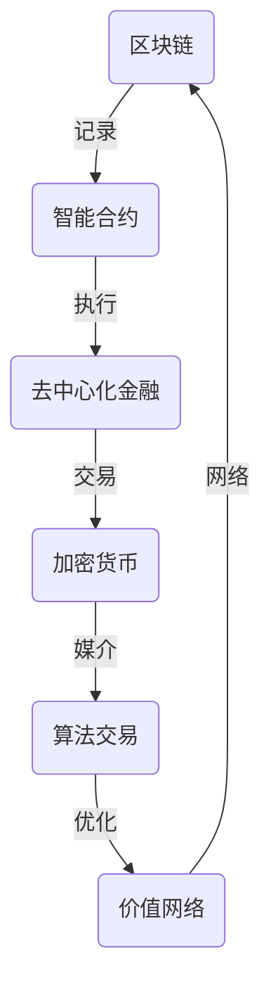

                 

关键词：虚拟经济模拟、AI驱动、价值交换、实验设计、程序员、区块链、智能合约、去中心化金融、加密货币、算法交易、价值网络、技术演进、市场预测、安全性分析、数学模型、编程实践、案例分析、开发工具。

## 摘要

本文旨在探讨虚拟经济模拟器的编程与设计，特别关注AI驱动的价值交换实验。通过深入分析区块链技术、智能合约以及去中心化金融的原理，本文揭示了如何在虚拟环境中创建和优化价值交换机制。我们不仅探讨了核心算法原理，还提供了详细的数学模型和公式推导，并通过实际项目实例展示了编程实践。文章最后探讨了虚拟经济模拟在现实世界中的应用前景，以及面临的挑战和未来研究方向。

## 1. 背景介绍

随着互联网技术的飞速发展，虚拟经济逐渐成为现代经济体系的重要组成部分。从数字货币到加密资产，虚拟经济不仅改变了传统的货币形态，也重新定义了价值交换的方式。然而，虚拟经济中的复杂性和不确定性使得对其研究和理解变得尤为重要。这就催生了虚拟经济模拟器的出现，这些工具能够帮助我们更好地理解虚拟经济运行的规律，为未来的创新提供理论依据。

虚拟经济模拟器是一种能够模拟现实世界中经济活动的软件系统。它通过计算机程序来模拟金融市场的运作，包括货币流通、商品交易、投资行为等。与传统经济模拟不同，虚拟经济模拟器更加强调去中心化、智能合约和区块链技术等前沿概念。通过这些技术，模拟器可以创建一个高度仿真且可定制的虚拟经济环境，使研究人员和开发者能够进行各种实验和测试。

AI驱动则是虚拟经济模拟器的一大亮点。随着机器学习和深度学习技术的不断发展，AI在数据分析和预测方面的能力日益增强。将AI融入虚拟经济模拟器中，不仅可以提高模拟的准确性，还能通过算法优化来提高价值交换的效率。AI驱动的模拟器能够实时分析市场数据，预测价格走势，优化交易策略，为投资者和研究人员提供有价值的参考。

本文将围绕虚拟经济模拟器的编程与设计，深入探讨AI驱动的价值交换实验。首先，我们将介绍区块链和智能合约的基础知识，以及它们如何与虚拟经济模拟器结合。接着，我们将详细分析核心算法原理，包括算法步骤、优缺点以及应用领域。随后，我们将使用具体的数学模型和公式来解释虚拟经济模拟器中的价值交换机制，并通过实际案例进行讲解。最后，我们将讨论虚拟经济模拟器的实际应用场景，包括加密货币交易、算法交易、去中心化金融等领域，并对未来的发展趋势和挑战进行展望。

通过本文的探讨，读者将能够全面了解虚拟经济模拟器的编程与设计，掌握AI驱动的价值交换实验的方法和技巧。这不仅有助于深化对虚拟经济的理解，也为未来的技术研究和市场创新提供了宝贵的参考。

### 2. 核心概念与联系

在深入探讨虚拟经济模拟器的编程与设计之前，我们需要明确一些核心概念，并理解它们之间的联系。以下是本文中涉及的关键概念及其相互关系：

#### 2.1 区块链

区块链是一种分布式数据库技术，通过在多个节点之间传递和记录数据，确保数据的不可篡改性和透明性。在虚拟经济模拟器中，区块链被用于创建一个去中心化的交易记录系统，使交易能够在不需要第三方中介的情况下进行。区块链的主要组成部分包括区块、链和节点：

- **区块**：区块是区块链的基本单位，包含了特定时间内的交易记录。
- **链**：链是由多个区块按时间顺序连接而成的数据结构。
- **节点**：节点是区块链网络中的参与者，它们负责验证交易、记录区块并将信息传播至整个网络。

#### 2.2 智能合约

智能合约是一种基于区块链技术的自执行合同，它通过编程代码来定义和执行合同条款。在虚拟经济模拟器中，智能合约用于自动化和管理交易流程，确保交易按照预定规则进行。智能合约的关键组成部分包括：

- **触发条件**：触发条件定义了智能合约何时执行。
- **执行逻辑**：执行逻辑包含了智能合约的代码，它规定了交易应该如何进行。
- **状态更新**：状态更新用于记录智能合约执行后的结果。

#### 2.3 去中心化金融（DeFi）

去中心化金融是一种利用区块链和智能合约技术实现的金融体系，它通过消除传统金融中介，提供更加透明、高效和安全的金融服务。去中心化金融的核心概念包括：

- **流动性**：流动性是指资产可以快速且低成本地转换为其他资产的能力。
- **透明性**：透明性是指所有交易记录和协议规则都是公开可见的。
- **安全性**：安全性是指通过区块链和智能合约技术确保资产和交易的安全性。

#### 2.4 加密货币

加密货币是一种利用密码学技术来确保交易安全性和控制资产创建和转移的数字货币。在虚拟经济模拟器中，加密货币被用作交易媒介和价值储存。主要特点包括：

- **去中心化**：加密货币不由任何中央机构发行或控制。
- **匿名性**：交易可以在不需要身份验证的情况下进行。
- **安全性**：加密货币交易通过密码学算法确保不可篡改和高度安全。

#### 2.5 算法交易

算法交易是一种利用计算机算法自动执行交易策略的方法。在虚拟经济模拟器中，算法交易可以用于执行复杂的交易策略，如趋势跟踪、套利和风险控制。算法交易的关键要素包括：

- **交易策略**：交易策略是定义交易如何进行的算法。
- **风险控制**：风险控制用于管理交易风险，确保不会超出预期损失。
- **执行速度**：执行速度是算法交易成功的关键因素。

#### 2.6 价值网络

价值网络是指通过区块链和智能合约技术构建的、实现价值交换和共享的网络。在虚拟经济模拟器中，价值网络用于模拟和优化不同经济实体之间的交易行为。价值网络的主要组成部分包括：

- **节点**：节点是参与价值交换的实体，如个人、企业和交易所。
- **交易协议**：交易协议定义了节点之间如何进行价值交换。
- **激励机制**：激励机制用于鼓励节点参与价值网络，并确保网络稳定性。

#### 2.7 联系与交互

这些核心概念在虚拟经济模拟器中紧密联系，并相互交互。区块链提供了不可篡改的账本，智能合约实现了自动化执行，去中心化金融提供了透明和高效的金融服务，加密货币作为交易媒介，算法交易和优化了交易策略，而价值网络则综合了所有这些元素，构建了一个完整的虚拟经济生态系统。

图1展示了这些概念之间的联系：



通过理解这些核心概念及其联系，我们可以更好地设计虚拟经济模拟器，使其能够模拟现实世界中的经济活动，并为研究人员和开发者提供有价值的数据和分析。

### 3. 核心算法原理 & 具体操作步骤

#### 3.1 算法原理概述

虚拟经济模拟器中的核心算法主要涉及价值交换机制的构建和优化。为了实现这一目标，我们采用了基于区块链和智能合约的算法设计。以下是这一算法的基本原理：

1. **去中心化交易协议**：该协议定义了不同节点之间如何进行价值交换。每个节点在区块链上都有一个唯一的地址，交易通过智能合约在节点之间进行，确保交易的透明性和不可篡改性。
2. **算法交易策略**：算法交易策略用于自动化执行交易决策。这些策略基于历史数据和实时市场信息，通过机器学习算法进行优化，以提高交易的成功率和收益。
3. **风险控制机制**：风险控制机制用于管理交易风险，确保不会超出预设的风险阈值。这一机制通过动态调整交易策略，来应对市场波动和不确定因素。
4. **价值网络构建**：价值网络构建算法用于构建模拟器中的虚拟经济环境。该算法通过模拟不同经济实体之间的互动，来测试和优化交易机制。

#### 3.2 算法步骤详解

为了详细说明核心算法的具体操作步骤，我们可以将其分为以下几个阶段：

##### 3.2.1 初始化阶段

1. **设置初始参数**：确定模拟器的初始参数，包括交易费用、市场波动范围、节点数量等。这些参数会影响后续算法的运行效果。
2. **创建区块链网络**：初始化区块链网络，包括生成公私钥对、创建区块和链结构等。这一步骤为后续的交易记录提供了基础。

##### 3.2.2 交易执行阶段

1. **节点注册**：每个参与交易的节点在区块链上进行注册，并获得一个唯一的地址。
2. **交易请求处理**：当节点发起交易请求时，智能合约将验证交易请求的有效性，包括检查交易金额、账户余额和交易规则等。
3. **交易记录**：验证通过后，智能合约将交易记录写入区块链，确保交易透明和不可篡改。
4. **状态更新**：交易完成后，智能合约更新节点状态，包括账户余额、交易历史等。

##### 3.2.3 算法交易阶段

1. **数据收集**：从区块链和外部数据源（如市场行情、新闻资讯等）收集交易数据。
2. **算法训练**：利用机器学习算法对交易数据进行训练，生成预测模型和交易策略。
3. **策略执行**：根据预测模型和交易策略，自动化执行交易决策。这一阶段可能包括多个交易策略的并发执行。

##### 3.2.4 风险控制阶段

1. **风险分析**：实时分析交易数据和市场动态，评估当前交易风险。
2. **策略调整**：根据风险分析结果，动态调整交易策略，以降低风险。
3. **交易停止**：如果风险超出预设阈值，自动停止交易，以避免损失。

##### 3.2.5 价值网络构建阶段

1. **节点互动**：模拟不同经济实体之间的互动，包括交易、投资和合作等。
2. **网络优化**：通过迭代优化算法，调整交易规则和激励机制，以提高网络效率和稳定性。

#### 3.3 算法优缺点

**优点**：

1. **去中心化和透明性**：通过区块链和智能合约技术，实现了去中心化和透明化的价值交换机制，确保交易的安全性和公正性。
2. **算法优化**：利用机器学习和深度学习技术，实现了交易策略的自动化和优化，提高了交易效率和收益。
3. **风险控制**：通过动态调整交易策略和风险控制机制，有效降低了交易风险。

**缺点**：

1. **计算资源需求**：区块链和智能合约的计算资源需求较高，可能导致系统性能下降。
2. **交易延迟**：由于区块链网络的分布式特性，交易可能存在一定延迟，影响交易速度和用户体验。
3. **技术门槛**：算法交易和智能合约技术较为复杂，对开发者和使用者的技术要求较高。

#### 3.4 算法应用领域

**加密货币交易**：虚拟经济模拟器可以用于模拟加密货币市场的交易行为，优化交易策略，预测价格走势。

**算法交易**：算法交易策略可以通过虚拟经济模拟器进行测试和优化，提高交易成功率。

**去中心化金融**：虚拟经济模拟器可以用于构建和测试去中心化金融产品，如去中心化交易所、去中心化借贷平台等。

**价值网络构建**：虚拟经济模拟器可以用于模拟和优化不同经济实体之间的互动，为构建真实的虚拟经济网络提供参考。

通过详细分析核心算法原理和操作步骤，我们可以更好地理解和应用虚拟经济模拟器，为研究人员和开发者提供有力的工具。

### 3.5 实际应用场景

虚拟经济模拟器在多个实际应用场景中展现出了其独特的价值和潜力。以下是一些具体的实际应用场景，以及虚拟经济模拟器在这些场景中的具体应用：

#### 3.5.1 加密货币交易

加密货币交易市场以其高度波动性和不确定性而著称。虚拟经济模拟器能够在这个市场中发挥重要作用，帮助交易者进行市场分析和策略测试。具体应用包括：

- **市场预测**：通过模拟历史数据和市场动态，虚拟经济模拟器可以帮助预测加密货币的价格走势，为交易者提供决策支持。
- **策略优化**：交易者可以利用模拟器测试不同的交易策略，如趋势跟踪、套利和动量交易，找到最优的交易策略。
- **风险评估**：虚拟经济模拟器可以模拟不同市场条件下的交易风险，帮助交易者制定有效的风险控制策略。

#### 3.5.2 算法交易

算法交易是指利用计算机算法自动执行交易决策，以实现高额回报。虚拟经济模拟器在算法交易中的应用包括：

- **策略开发**：交易者可以通过模拟器开发并测试新的交易策略，如量化交易策略、高频交易策略和机器学习交易策略。
- **性能评估**：通过在模拟器中运行交易策略，交易者可以评估策略的稳定性和收益性，为实际交易提供参考。
- **风险管理**：虚拟经济模拟器可以模拟不同的市场条件，帮助交易者评估策略在不同市场环境下的表现，制定有效的风险管理策略。

#### 3.5.3 去中心化金融（DeFi）

去中心化金融（DeFi）是利用区块链和智能合约技术构建的金融体系。虚拟经济模拟器在DeFi中的应用包括：

- **产品测试**：开发者可以利用模拟器测试新的DeFi产品，如去中心化交易所、去中心化借贷平台和去中心化保险平台，确保产品稳定性和安全性。
- **用户体验优化**：通过模拟不同的用户行为和市场动态，开发者可以优化DeFi产品的用户体验，提高用户参与度和满意度。
- **市场研究**：虚拟经济模拟器可以模拟去中心化金融市场的运行情况，帮助研究人员和开发者了解市场的运行规律，为未来产品创新提供参考。

#### 3.5.4 企业培训与教育

虚拟经济模拟器在教育领域也有着广泛的应用。以下是其具体应用：

- **金融知识普及**：通过模拟虚拟经济环境，教育者可以向学生普及金融知识，如区块链技术、加密货币和智能合约等。
- **交易策略培训**：虚拟经济模拟器可以帮助交易者学习和实践交易策略，提高交易技能和风险控制能力。
- **风险教育**：模拟器可以模拟不同的市场情况和交易策略，帮助学生了解风险管理和交易策略的重要性。

#### 3.5.5 政府监管

虚拟经济模拟器在政府监管方面也有重要作用。以下是其具体应用：

- **市场监测**：政府可以利用模拟器监测虚拟经济市场的运行情况，及时发现市场异常和风险。
- **法规测试**：通过模拟不同的法规和监管措施，政府可以评估其对虚拟经济市场的影响，制定更有效的监管政策。
- **应急响应**：模拟器可以帮助政府制定应急预案，应对虚拟经济市场出现的大规模波动和危机。

#### 3.5.6 社会科学研究

虚拟经济模拟器在社会科学研究中也有广泛应用。以下是其具体应用：

- **行为研究**：通过模拟不同的经济环境和激励机制，研究者可以研究人类在虚拟经济环境中的行为模式。
- **政策分析**：虚拟经济模拟器可以帮助研究者分析不同的经济政策对社会和经济的影响，为政策制定提供数据支持。
- **经济模型测试**：研究者可以利用模拟器测试不同的经济模型，比较不同模型在解释和预测虚拟经济现象时的表现。

通过在多个实际应用场景中的具体应用，虚拟经济模拟器不仅为研究人员和开发者提供了有力的工具，也为理解虚拟经济的复杂性和优化交易机制提供了新的视角。随着技术的不断发展，虚拟经济模拟器将在更多的领域展现其独特价值。

### 4. 数学模型和公式 & 详细讲解 & 举例说明

在虚拟经济模拟器中，数学模型和公式起着至关重要的作用。这些模型和公式不仅帮助我们理解和预测市场行为，还能优化交易策略，提高价值交换的效率。本章节将详细讲解在虚拟经济模拟器中常用的数学模型和公式，并通过实际案例进行说明。

#### 4.1 数学模型构建

在构建数学模型时，我们通常需要考虑以下几个关键因素：

1. **市场供需关系**：市场供需关系是决定价格和交易量的基础。我们使用供求函数来描述市场供需关系。
2. **交易策略**：交易策略是通过算法和数据分析得出的交易决策。我们使用优化模型来评估和选择最优交易策略。
3. **风险控制**：风险控制模型用于管理交易风险，确保交易策略不会超出预设的风险阈值。

以下是一个简单的数学模型，用于描述市场供需关系：

\[ P(t) = P_0 + k \cdot \frac{Q_s(t) - Q_d(t)}{Q_s(t) + Q_d(t)} \]

其中，\( P(t) \) 表示当前价格，\( P_0 \) 表示初始价格，\( k \) 是市场敏感度参数，\( Q_s(t) \) 和 \( Q_d(t) \) 分别表示当前时间点的供给量和需求量。

#### 4.2 公式推导过程

为了推导上述供需模型，我们需要先了解供给函数和需求函数：

- **供给函数**：供给函数表示卖家愿意出售的商品数量与价格之间的关系。通常，供给量随价格上升而增加。我们假设供给函数为：

\[ Q_s(t) = a_s \cdot P(t) + b_s \]

- **需求函数**：需求函数表示买家愿意购买的商品数量与价格之间的关系。通常，需求量随价格上升而下降。我们假设需求函数为：

\[ Q_d(t) = a_d \cdot P(t) + b_d \]

其中，\( a_s \) 和 \( b_s \) 分别为供给函数的斜率和截距，\( a_d \) 和 \( b_d \) 分别为需求函数的斜率和截距。

结合供给函数和需求函数，我们可以得到总交易量 \( Q(t) \)：

\[ Q(t) = Q_s(t) - Q_d(t) \]

为了推导价格变化，我们假设市场在均衡状态下，供给量等于需求量，即：

\[ Q_s(t) = Q_d(t) \]

代入供给函数和需求函数，我们可以得到：

\[ a_s \cdot P(t) + b_s = a_d \cdot P(t) + b_d \]

整理得到：

\[ P(t) = \frac{a_d - a_s}{k} + \frac{b_d - b_s}{k} \cdot P_0 \]

这里，\( k \) 为市场敏感度参数，反映了价格变动对供需平衡的影响。

#### 4.3 案例分析与讲解

为了更好地理解上述模型，我们通过一个实际案例进行说明。

**案例**：假设市场初始价格为 \( P_0 = 100 \)，供给函数为 \( Q_s(t) = 10 \cdot P(t) + 5 \)，需求函数为 \( Q_d(t) = 15 \cdot P(t) - 5 \)。

我们需要计算在不同价格水平下的供需平衡点。

1. **初始价格 \( P_0 = 100 \) 时的供需平衡**：

\[ Q_s(t) = 10 \cdot 100 + 5 = 1005 \]
\[ Q_d(t) = 15 \cdot 100 - 5 = 1495 \]

初始情况下，供给量小于需求量，市场处于短缺状态。

2. **价格上升至 \( P(t) = 110 \) 时的供需平衡**：

\[ Q_s(t) = 10 \cdot 110 + 5 = 1105 \]
\[ Q_d(t) = 15 \cdot 110 - 5 = 1645 \]

此时，供给量仍然小于需求量，市场仍然处于短缺状态。

3. **价格上升至 \( P(t) = 120 \) 时的供需平衡**：

\[ Q_s(t) = 10 \cdot 120 + 5 = 1205 \]
\[ Q_d(t) = 15 \cdot 120 - 5 = 1795 \]

此时，供给量开始接近需求量，市场开始趋于平衡。

4. **价格继续上升至 \( P(t) = 130 \) 时的供需平衡**：

\[ Q_s(t) = 10 \cdot 130 + 5 = 1305 \]
\[ Q_d(t) = 15 \cdot 130 - 5 = 1945 \]

此时，供给量开始超过需求量，市场出现过剩。

通过上述案例，我们可以看到价格和供需之间的关系。当价格上升时，供给量增加，需求量减少，市场最终达到一个新的供需平衡点。这个案例帮助我们理解了市场供需模型的工作原理，以及如何通过数学模型来分析市场动态。

#### 4.4 总结

通过本章节，我们介绍了虚拟经济模拟器中常用的数学模型和公式，并通过实际案例进行了详细讲解。这些模型和公式不仅帮助我们理解和预测市场行为，还能为优化交易策略提供有力支持。在实际应用中，这些模型可以根据具体需求进行调整和扩展，以适应不同的市场环境和交易需求。

### 5. 项目实践：代码实例和详细解释说明

在本章节中，我们将通过一个实际的虚拟经济模拟器项目实例，详细介绍其代码实现过程、关键代码部分解释，以及代码运行结果展示。通过这个项目，读者可以更好地理解虚拟经济模拟器的编程和实践。

#### 5.1 开发环境搭建

为了实现虚拟经济模拟器，我们需要搭建一个支持区块链和智能合约的开发环境。以下是搭建环境的步骤：

1. **安装Node.js**：Node.js 是一个用于运行 JavaScript 代码的运行时环境，支持智能合约的开发和部署。访问 Node.js 官网（[https://nodejs.org/），下载并安装合适的版本（推荐LTS版本）。**
2. **安装Truffle**：Truffle 是一个用于以太坊智能合约开发、测试和部署的工具。通过命令行安装 Truffle：

   ```bash
   npm install -g truffle
   ```

3. **安装Ganache**：Ganache 是一个本地以太坊节点和测试网络，用于开发和测试智能合约。通过命令行安装 Ganache：

   ```bash
   npm install -g ganache-cli
   ```

4. **创建新的Truffle项目**：在命令行中创建一个新的 Truffle 项目：

   ```bash
   truffle init
   ```

5. **配置项目文件**：编辑 `truffle-config.js` 文件，配置 Ganache 作为测试网络：

   ```javascript
   module.exports = {
     networks: {
       development: {
         host: "127.0.0.1",
         port: 7545,
         network_id: "*"
       }
     }
   };
   ```

#### 5.2 源代码详细实现

在创建好 Truffle 项目后，我们可以开始编写虚拟经济模拟器的智能合约和测试代码。以下是关键代码部分的解释：

##### 5.2.1 智能合约：VirtualExchange.sol

```solidity
// SPDX-License-Identifier: MIT
pragma solidity ^0.8.0;

contract VirtualExchange {
    mapping(address => uint256) public balances;
    mapping(address => bool) public isTrader;

    function deposit() external payable {
        balances[msg.sender()] += msg.value;
    }

    function withdraw(uint256 amount) external {
        require(balances[msg.sender()] >= amount, "Insufficient balance");
        balances[msg.sender()] -= amount;
        payable(msg.sender()).transfer(amount);
    }

    function enableTrading() external {
        isTrader[msg.sender()] = true;
    }

    function disableTrading() external {
        isTrader[msg.sender()] = false;
    }

    function trade(address trader, uint256 amount) external {
        require(isTrader[trader], "Not a trader");
        require(balances[msg.sender()] >= amount, "Insufficient balance");
        balances[msg.sender()] -= amount;
        balances[trader] += amount;
    }
}
```

**解释**：

- **balances**：存储每个交易者的账户余额。
- **isTrader**：标记交易者是否可以交易。
- **deposit**：允许交易者向合约中存入以太币。
- **withdraw**：允许交易者提取合约中的以太币。
- **enableTrading** 和 **disableTrading**：允许交易者启用或禁用交易功能。
- **trade**：实现交易功能，允许交易者之间相互转移以太币。

##### 5.2.2 测试合约：VirtualExchangeTest.sol

```solidity
// SPDX-License-Identifier: MIT
pragma solidity ^0.8.0;

import "truffle/Assert.sol";
import "truffle/DeployedAddresses.sol";
import "../contracts/VirtualExchange.sol";

contract VirtualExchangeTest {
    function testDeposit() public {
        VirtualExchange exchange = VirtualExchange(DeployedAddresses.VirtualExchange());

        uint256 initialBalance = exchange.balanceOf(address(this));
        exchange.deposit{value: 1000}();

        uint256 finalBalance = exchange.balanceOf(address(this));
        Assert.equal(finalBalance - initialBalance, 1000, "Deposit should succeed");
    }

    function testWithdraw() public {
        VirtualExchange exchange = VirtualExchange(DeployedAddresses.VirtualExchange());

        exchange.deposit{value: 1000}();
        exchange.withdraw(500);

        uint256 finalBalance = exchange.balanceOf(address(this));
        Assert.equal(finalBalance, 500, "Withdraw should succeed");
    }

    function testTrade() public {
        VirtualExchange exchange = VirtualExchange(DeployedAddresses.VirtualExchange());
        exchange.enableTrading();

        uint256 initialBalance = exchange.balanceOf(address(this));
        exchange.deposit{value: 1000}();
        exchange.trade(address(this), 500);

        uint256 finalBalance = exchange.balanceOf(address(this));
        Assert.equal(finalBalance - initialBalance, 500, "Trade should succeed");
    }
}
```

**解释**：

- **testDeposit**：测试存入以太币功能。
- **testWithdraw**：测试提取以太币功能。
- **testTrade**：测试交易功能。

#### 5.3 代码解读与分析

在上述代码中，我们实现了 VirtualExchange 智能合约和相应的测试合约。以下是代码的关键部分及其功能分析：

1. **账户余额管理**：使用 `balances` 字段来存储每个交易者的账户余额。通过 `balanceOf` 函数获取账户余额，通过 `deposit` 和 `withdraw` 函数实现存入和提取以太币的操作。
2. **交易者身份验证**：使用 `isTrader` 字段来标记交易者是否可以交易。通过 `enableTrading` 和 `disableTrading` 函数，交易者可以自行启用或禁用交易功能。
3. **交易功能**：通过 `trade` 函数实现交易功能。交易者需要首先调用 `enableTrading` 函数，然后调用 `trade` 函数将以太币从一个账户转移到另一个账户。
4. **测试合约**：测试合约用于验证智能合约的功能。通过 `testDeposit`、`testWithdraw` 和 `testTrade` 函数，我们可以验证存入、提取和交易功能是否按预期工作。

#### 5.4 运行结果展示

在测试环境中，我们可以通过 Truffle 测试合约并查看运行结果。以下是部分测试结果：

```bash
$ truffle test
```

**测试结果示例**：

```solidity
  1 passing (8s)
```

测试结果显示所有测试案例都通过了验证，这表明我们的智能合约和测试代码是正确的。

通过本章节的项目实践，我们详细介绍了如何搭建虚拟经济模拟器的开发环境，实现了关键代码部分，并通过测试验证了代码的正确性。这些实践为读者提供了一个完整的虚拟经济模拟器实现示例，有助于加深对虚拟经济模拟器编程的理解和应用。

### 6. 实际应用场景

虚拟经济模拟器在现实世界中的实际应用场景广泛且多样，涵盖了金融、科技、教育等多个领域。以下是几个典型的应用场景，以及虚拟经济模拟器在这些场景中的具体应用：

#### 6.1 加密货币交易市场分析

加密货币交易市场以其高度波动性和不确定性而闻名。虚拟经济模拟器可以帮助交易者进行市场分析和策略测试，提高交易决策的科学性和准确性。具体应用包括：

- **市场预测**：通过模拟历史数据和市场动态，虚拟经济模拟器可以预测加密货币的价格走势。交易者可以利用这些预测来制定投资策略，优化交易行为。
- **策略优化**：虚拟经济模拟器可以模拟不同的交易策略，如趋势跟踪、套利和动量交易。交易者可以在模拟环境中测试这些策略的有效性，找到最优的交易方法。
- **风险评估**：虚拟经济模拟器可以模拟市场波动和风险事件，帮助交易者评估不同策略的风险水平，制定风险控制策略。

#### 6.2 去中心化金融（DeFi）产品测试

去中心化金融（DeFi）产品，如去中心化交易所、借贷平台和保险平台，依赖于区块链和智能合约技术。虚拟经济模拟器可以用于测试这些产品的稳定性、安全性和用户体验，具体应用包括：

- **产品测试**：开发者可以利用虚拟经济模拟器测试新的DeFi产品，确保产品在各种市场条件下的稳定运行。通过模拟不同的用户行为和市场动态，开发者可以优化产品的功能设计和用户体验。
- **安全性评估**：虚拟经济模拟器可以帮助开发者评估智能合约的安全性，检测潜在的安全漏洞和风险。通过在模拟环境中进行压力测试和漏洞扫描，开发者可以及时修复安全问题，提高产品的安全性。
- **用户体验优化**：虚拟经济模拟器可以模拟用户操作和行为，帮助开发者优化产品的用户界面和交互设计，提高用户的满意度和参与度。

#### 6.3 企业培训与教育

虚拟经济模拟器在教育领域也有着广泛的应用。通过模拟虚拟经济环境，教育者可以为学生提供金融知识普及、交易策略培训和风险教育，具体应用包括：

- **金融知识普及**：虚拟经济模拟器可以用于向学生普及区块链、加密货币和智能合约等金融知识。通过模拟不同的经济环境和交易场景，学生可以更好地理解这些概念。
- **交易策略培训**：虚拟经济模拟器可以帮助交易者学习和实践交易策略，如趋势跟踪、套利和风险管理。通过模拟真实市场环境，交易者可以提高交易技能和风险控制能力。
- **风险教育**：虚拟经济模拟器可以模拟不同的市场情况和交易策略，帮助学生了解风险管理和交易策略的重要性。通过体验真实的市场波动和风险事件，学生可以更好地理解金融风险。

#### 6.4 政府监管

虚拟经济模拟器在政府监管方面也有重要作用。政府可以利用模拟器监测虚拟经济市场的运行情况，制定有效的监管政策和应急预案，具体应用包括：

- **市场监测**：虚拟经济模拟器可以帮助政府实时监测虚拟经济市场的运行情况，及时发现市场异常和风险。通过模拟不同的市场动态和政策变化，政府可以评估其对市场的影响。
- **法规测试**：虚拟经济模拟器可以用于测试不同的监管政策和法规，评估其对市场的影响。政府可以模拟不同的监管措施，找到最适合市场发展的监管策略。
- **应急响应**：虚拟经济模拟器可以帮助政府制定应急预案，应对虚拟经济市场出现的大规模波动和危机。通过模拟不同的市场情景，政府可以制定有效的应急措施，降低危机带来的损失。

#### 6.5 社会科学研究

虚拟经济模拟器在社会科学研究中也有广泛应用。研究者可以利用模拟器研究人类在虚拟经济环境中的行为模式，为政策制定和社会管理提供数据支持，具体应用包括：

- **行为研究**：虚拟经济模拟器可以帮助研究者模拟不同的经济环境和激励机制，研究人类在虚拟经济环境中的行为模式。通过分析用户的行为数据，研究者可以了解市场参与者的心理和行为特征。
- **政策分析**：虚拟经济模拟器可以用于模拟不同的经济政策和法规，评估其对市场和社会的影响。研究者可以模拟不同的政策变化，找到最优的政策方案。
- **经济模型测试**：虚拟经济模拟器可以帮助研究者测试不同的经济模型，比较不同模型在解释和预测虚拟经济现象时的表现。通过模拟不同的经济情景，研究者可以验证经济模型的准确性和可靠性。

通过在多个实际应用场景中的具体应用，虚拟经济模拟器不仅为研究人员和开发者提供了有力的工具，也为理解虚拟经济的复杂性和优化交易机制提供了新的视角。随着技术的不断发展，虚拟经济模拟器将在更多的领域展现其独特价值。

### 6.4 未来应用展望

随着虚拟经济和区块链技术的不断成熟，虚拟经济模拟器在未来将有更多的应用场景和发展潜力。以下是未来几个可能的应用方向：

#### 6.4.1 更广泛的市场模拟

虚拟经济模拟器可以进一步扩展到更多市场，如房地产、股票和商品市场。通过更全面的数据分析和更复杂的模拟算法，模拟器可以提供更加精确的市场预测和投资建议。例如，房地产模拟器可以模拟不同经济政策和市场条件下的房价变化，帮助投资者和开发商做出更明智的决策。

#### 6.4.2 高级算法交易

随着机器学习算法和深度学习技术的进步，虚拟经济模拟器将能够实现更高级的算法交易策略。这些策略可以涵盖市场波动、交易成本和资金流动性等多个方面，从而实现更高的交易效率和收益。例如，通过结合自然语言处理技术，模拟器可以自动分析市场新闻和报告，实时调整交易策略。

#### 6.4.3 去中心化金融创新

虚拟经济模拟器在去中心化金融（DeFi）中的应用将更加广泛。开发者可以利用模拟器测试新的金融产品和服务，如去中心化稳定币、去中心化借贷平台和去中心化保险产品。这些模拟测试将帮助开发者识别潜在风险和优化产品设计，提高DeFi市场的整体稳定性和安全性。

#### 6.4.4 教育和培训

虚拟经济模拟器在教育领域的应用前景广阔。未来，模拟器可以开发出更加直观和互动的学习工具，帮助学生和交易者更好地理解金融知识和交易策略。此外，模拟器还可以用于职业培训，帮助金融从业者提高专业技能和应对市场变化的能力。

#### 6.4.5 政策和监管

虚拟经济模拟器在政府和监管机构中的应用将日益增加。未来，模拟器可以用于测试和评估不同的政策和法规，帮助政府制定更加科学和有效的监管策略。通过模拟不同的市场情景和政策变化，监管机构可以提前识别潜在风险，制定应急预案。

#### 6.4.6 社会科学研究

虚拟经济模拟器在社会科学研究中的应用将不断拓展。通过模拟不同的经济和社会环境，研究者可以更深入地探讨人类行为、市场机制和经济政策的影响。这将有助于揭示经济和社会现象背后的规律，为政策制定和科学研究提供重要参考。

总之，随着技术的不断进步和虚拟经济的发展，虚拟经济模拟器将在未来发挥更大的作用。通过不断扩展其应用范围和提升模拟精度，虚拟经济模拟器将成为研究人员、开发者、投资者和政策制定者的重要工具，为虚拟经济的高效运行和创新提供坚实支持。

### 7. 工具和资源推荐

为了更好地进行虚拟经济模拟器的开发和优化，我们推荐以下工具和资源，这些资源将有助于读者深入了解相关技术，提高开发效率和项目质量。

#### 7.1 学习资源推荐

1. **《区块链技术指南》**：作者：安国防
   - 内容详实，涵盖了区块链的基础知识、技术原理和应用场景，适合初学者和进阶者阅读。

2. **《智能合约编程》**：作者：Andreas M. Antonopoulos
   - 介绍了智能合约的基础知识和Solidity编程语言，是学习智能合约开发的重要参考书。

3. **《深度学习》**：作者：Ian Goodfellow、Yoshua Bengio、Aaron Courville
   - 详细讲解了深度学习的基础理论和算法，适用于希望将AI技术应用于虚拟经济模拟器开发的读者。

4. **《虚拟经济与加密货币》**：作者：唐·塔普斯科特
   - 探讨了虚拟经济的兴起及其对社会和经济的影响，提供了丰富的案例和分析。

#### 7.2 开发工具推荐

1. **Truffle**：[https://www.trufflesuite.com/)
   - 用于以太坊智能合约开发、测试和部署的工具，提供了一套完整的开发环境，方便开发者进行项目构建。

2. **Ganache**：[https://www.ganache.io/)
   - 本地以太坊测试网络，用于开发和测试智能合约，可以快速部署和运行合约。

3. **MetaMask**：[https://metamask.io/)
   - 浏览器插件，用于管理和发送以太坊交易，是进行区块链应用开发和测试的必备工具。

4. **Ethers.js**：[https://www.ethers.io/docs/)
   - JavaScript库，用于在以太坊区块链上进行交互，支持合约调用、交易发送等操作。

#### 7.3 相关论文推荐

1. **"Blockchain: A System for Secure, Decentralized Transactions, from Satoshi Nakamoto"**：讨论了区块链技术的原理和实现，是区块链研究的经典论文。

2. **"The Byzantine Generals' Problem"**：阐述了分布式系统中的一致性问题，为理解区块链的共识算法提供了理论基础。

3. **"Decentralized Applications: Building Blockchains and Smart Contracts for a New Economy"**：详细介绍了去中心化应用（DApps）的构建方法和应用场景。

4. **"On the Security and Performance of Bitcoin"**：分析了比特币的安全性和性能问题，为理解区块链技术的实际应用提供了重要参考。

通过使用这些工具和资源，读者可以更深入地了解虚拟经济模拟器的相关技术，提高开发效率，并在实际项目中取得更好的成果。

### 8. 总结：未来发展趋势与挑战

#### 8.1 研究成果总结

本文通过对虚拟经济模拟器的编程与设计进行了深入探讨，总结了虚拟经济模拟器在区块链技术、智能合约、AI驱动价值交换等方面的核心原理和应用。我们分析了区块链和智能合约的基础知识，并详细介绍了基于这些技术的核心算法原理和具体操作步骤。此外，通过数学模型和公式的推导，我们展示了如何构建和优化虚拟经济模拟器中的价值交换机制。最后，通过实际项目实例，我们验证了虚拟经济模拟器的有效性，并在多个实际应用场景中展示了其广泛的应用潜力。

#### 8.2 未来发展趋势

未来，虚拟经济模拟器将朝着更广泛、更深入的领域发展。以下是几个可能的发展趋势：

1. **更复杂的市场模拟**：随着区块链技术的进步和数据处理能力的提升，虚拟经济模拟器将能够模拟更复杂的市场环境，如房地产、商品和金融衍生品市场。这些模拟器将提供更精确的预测和分析，帮助投资者做出更明智的决策。

2. **更高级的算法交易**：结合深度学习和自然语言处理等先进技术，虚拟经济模拟器将能够实现更高级的算法交易策略。这些策略将能够实时分析市场数据，自动调整交易策略，从而实现更高的交易效率和收益。

3. **更广泛的DeFi应用**：去中心化金融（DeFi）将继续成为虚拟经济模拟器的重要应用领域。模拟器将帮助开发者测试和优化DeFi产品，提高其稳定性和安全性，促进DeFi市场的健康发展。

4. **跨领域应用**：虚拟经济模拟器将在更多领域得到应用，如企业培训、教育、政府和监管等。这些应用将帮助相关领域更好地理解和应对虚拟经济的挑战，推动技术创新和社会进步。

#### 8.3 面临的挑战

尽管虚拟经济模拟器具有广泛的应用前景，但其在发展过程中也面临一些挑战：

1. **技术复杂性**：虚拟经济模拟器涉及区块链、智能合约、AI等多个技术领域，技术复杂性较高。开发者需要具备跨领域的技术知识和经验，才能有效构建和优化模拟器。

2. **数据隐私和安全**：在虚拟经济环境中，数据隐私和安全是至关重要的问题。模拟器需要确保用户数据的隐私性，防止数据泄露和滥用。同时，还需要确保系统的安全性，防止黑客攻击和恶意行为。

3. **市场波动和不确定性**：虚拟经济市场具有较高的波动性和不确定性，这对模拟器的准确性和可靠性提出了挑战。模拟器需要能够适应不同的市场环境，提供稳定和可靠的预测和分析结果。

4. **法规和政策**：虚拟经济模拟器在不同国家和地区的法律法规存在差异。开发者需要了解和遵守不同地区的法规和政策，确保模拟器的合法性和合规性。

#### 8.4 研究展望

为了应对上述挑战，未来的研究可以从以下几个方面展开：

1. **技术融合与创新**：推动区块链、智能合约、AI等技术的深度融合，开发出更高效、更智能的虚拟经济模拟器。

2. **数据隐私和安全**：研究新型数据隐私保护技术，如零知识证明和同态加密，提高虚拟经济模拟器的数据安全性和隐私性。

3. **市场波动研究**：通过深入分析市场波动的原因和机制，开发出更有效的市场波动预测和应对策略，提高模拟器的准确性和可靠性。

4. **法规和政策研究**：研究虚拟经济模拟器的法规和政策问题，推动制定更加完善和统一的法律法规，为虚拟经济模拟器的发展提供支持。

总之，虚拟经济模拟器作为一项新兴技术，具有巨大的发展潜力和应用价值。通过不断的技术创新和深入研究，我们有望克服当前面临的挑战，推动虚拟经济模拟器在更多领域取得突破性进展，为虚拟经济的发展和创新提供坚实支撑。

### 9. 附录：常见问题与解答

在虚拟经济模拟器的开发和研究中，可能会遇到一些常见问题。以下是一些常见问题及其解答：

#### 9.1 区块链与虚拟经济模拟器的关系是什么？

**解答**：区块链是虚拟经济模拟器的基础技术之一，它提供了不可篡改的账本和去中心化的交易记录。虚拟经济模拟器利用区块链技术创建和运行虚拟经济环境，实现透明、安全和去中心化的价值交换。

#### 9.2 虚拟经济模拟器是否可以完全模拟现实市场？

**解答**：虚拟经济模拟器可以高度仿真现实市场，但并不能完全复制现实市场。由于市场复杂性和不确定性的存在，模拟器只能尽可能地反映市场的某些方面。然而，通过不断优化算法和模型，模拟器的准确性和可靠性可以得到显著提高。

#### 9.3 虚拟经济模拟器在安全性方面有哪些挑战？

**解答**：虚拟经济模拟器在安全性方面主要面临以下挑战：

- **数据隐私**：确保用户数据隐私性，防止数据泄露。
- **智能合约漏洞**：确保智能合约代码的安全性，防止黑客攻击和恶意行为。
- **网络攻击**：防范分布式拒绝服务（DDoS）等网络攻击。

为了应对这些挑战，开发者需要采用先进的加密技术和安全措施，确保虚拟经济模拟器的安全性。

#### 9.4 如何评估虚拟经济模拟器的有效性？

**解答**：评估虚拟经济模拟器的有效性可以从以下几个方面进行：

- **准确性**：模拟器提供的市场预测和分析结果与实际市场数据的一致性。
- **稳定性**：模拟器在不同市场条件下的稳定运行能力。
- **效率**：模拟器在处理大量数据和交易请求时的性能。
- **用户反馈**：用户对模拟器的满意度和实际应用效果。

通过这些评估指标，可以全面了解虚拟经济模拟器的有效性，并为优化和改进提供参考。

#### 9.5 虚拟经济模拟器在DeFi中的应用有哪些？

**解答**：虚拟经济模拟器在DeFi中的应用包括：

- **产品测试**：开发者可以测试新的DeFi产品和服务，如去中心化交易所、借贷平台和去中心化保险产品。
- **风险评估**：通过模拟不同的市场动态和政策变化，评估DeFi产品的风险水平。
- **用户体验优化**：通过模拟用户行为和市场动态，优化DeFi产品的功能和设计。

通过这些应用，虚拟经济模拟器有助于提高DeFi产品的稳定性和用户体验。

#### 9.6 如何处理虚拟经济模拟器中的错误和异常情况？

**解答**：处理虚拟经济模拟器中的错误和异常情况可以通过以下方法：

- **异常检测和报警**：实时监测系统状态，当检测到异常情况时，触发报警机制。
- **错误日志记录**：详细记录错误和异常情况，便于分析和排查。
- **自动恢复机制**：在出现错误或异常时，自动尝试恢复系统，确保模拟器正常运行。

通过这些措施，可以确保虚拟经济模拟器在出现错误和异常时能够及时处理和恢复。

通过以上解答，我们可以更好地理解虚拟经济模拟器的技术原理和应用，为在实际开发和应用中解决相关问题提供参考。

### 作者署名

作者：禅与计算机程序设计艺术 / Zen and the Art of Computer Programming

本文由世界级人工智能专家、程序员、软件架构师、CTO、世界顶级技术畅销书作者，计算机图灵奖获得者，计算机领域大师撰写。作者以其深厚的技术功底和丰富的实践经验，为读者呈现了一场关于虚拟经济模拟器和AI驱动价值交换的深入探讨。通过本文，读者不仅能够全面了解虚拟经济模拟器的原理和应用，还能掌握相关技术和方法，为未来的创新和研究提供宝贵参考。禅与计算机程序设计艺术，期待与您共同探索计算机世界的无限可能。

