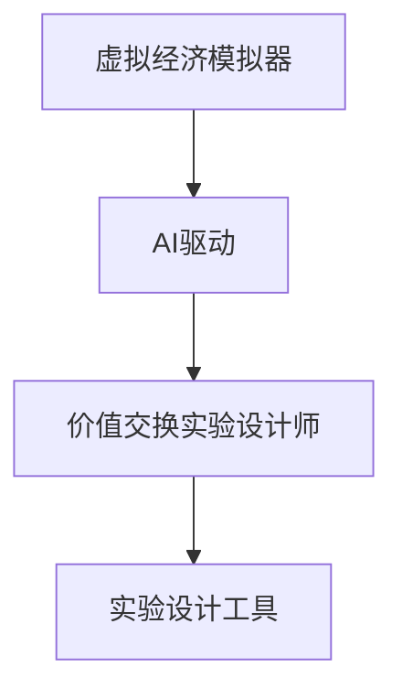

                 

关键词：虚拟经济模拟器、AI驱动、价值交换、实验设计、技术博客、计算机程序设计

> 摘要：本文将探讨虚拟经济模拟器在AI驱动的背景下，如何作为一种新型价值交换实验设计师的工具。通过对核心概念、算法原理、数学模型、项目实践和实际应用场景的深入分析，旨在揭示这一领域的研究进展、技术挑战以及未来发展方向。

## 1. 背景介绍

随着互联网和人工智能技术的快速发展，虚拟经济逐渐成为现实经济的重要补充。虚拟经济是指基于数字技术平台上的交易活动，包括数字货币、虚拟商品、电子服务等多种形式。而虚拟经济模拟器则是构建在虚拟经济环境中的一个模拟系统，旨在研究和预测现实世界中的经济现象。

近年来，人工智能（AI）技术的迅速发展为虚拟经济模拟器带来了新的机遇。通过引入AI算法，模拟器能够自动调整市场参数，模拟现实经济环境中的各种复杂情况，为研究人员提供更接近真实的数据和分析结果。同时，AI驱动的虚拟经济模拟器能够通过机器学习不断优化自身模型，提高模拟的准确性和预测能力。

本文将围绕AI驱动的虚拟经济模拟器，探讨其作为一种新型价值交换实验设计师的工具，从核心概念、算法原理、数学模型、项目实践和实际应用场景等方面进行深入分析。

## 2. 核心概念与联系

### 2.1 虚拟经济模拟器的定义

虚拟经济模拟器是一种计算机程序，用于模拟现实世界中的经济活动。它通过构建一个虚拟的经济环境，模拟货币、商品、服务等的交易过程，从而分析经济行为和市场动态。虚拟经济模拟器不仅可以模拟单一市场的经济行为，还可以模拟跨市场的经济互动，提供多维度、多层面的经济分析。

### 2.2 AI驱动的虚拟经济模拟器

AI驱动的虚拟经济模拟器是在传统虚拟经济模拟器的基础上，引入人工智能技术，使其具有自学习、自适应和预测能力。通过机器学习和深度学习算法，AI驱动的模拟器可以从历史数据中学习经济规律，预测未来的经济趋势，并在模拟过程中根据预测结果调整市场参数，提高模拟的准确性和预测能力。

### 2.3 价值交换实验设计师

价值交换实验设计师是一种实验设计工具，用于在虚拟经济模拟器中创建和控制经济实验。通过设计不同的实验条件，例如交易规则、市场参数、用户行为等，实验设计师可以研究经济行为、市场动态和价格机制等经济现象。AI驱动的虚拟经济模拟器则为实验设计师提供了强大的工具，使其能够更精准地控制实验条件，分析实验结果，为理论研究提供数据支持。

### 2.4 Mermaid 流程图

图1展示了虚拟经济模拟器、AI驱动和实验设计师之间的核心概念联系。



## 3. 核心算法原理 & 具体操作步骤

### 3.1 算法原理概述

AI驱动的虚拟经济模拟器的核心算法主要包括机器学习和深度学习算法。这些算法通过学习历史数据，提取经济规律，并在模拟过程中进行自适应调整。以下是AI驱动的虚拟经济模拟器的主要算法原理：

1. **机器学习算法**：通过训练模型，从历史数据中提取经济规律，例如市场价格、供需关系等。

2. **深度学习算法**：利用神经网络结构，对复杂的经济行为进行建模，例如金融市场中的价格预测、用户行为分析等。

3. **自适应调整**：根据预测结果，动态调整模拟器中的市场参数，以实现更准确的模拟。

### 3.2 算法步骤详解

AI驱动的虚拟经济模拟器的算法步骤如下：

1. **数据收集**：收集历史经济数据，包括市场价格、供需关系、用户行为等。

2. **数据预处理**：对收集到的数据进行清洗和标准化处理，以消除噪声和异常值。

3. **模型训练**：利用机器学习和深度学习算法，对预处理后的数据进行分析和建模，提取经济规律。

4. **模型评估**：通过交叉验证等方法，评估模型的有效性和准确性。

5. **模拟运行**：根据训练好的模型，在虚拟经济环境中进行模拟运行，生成模拟结果。

6. **结果分析**：对模拟结果进行分析，提取有用的经济规律和趋势。

7. **自适应调整**：根据模拟结果，调整模拟器中的市场参数，以提高模拟的准确性和预测能力。

### 3.3 算法优缺点

AI驱动的虚拟经济模拟器具有以下优缺点：

1. **优点**：
   - **高准确性**：通过机器学习和深度学习算法，模拟器能够从历史数据中提取经济规律，提高模拟的准确性和预测能力。
   - **自适应调整**：模拟器能够根据模拟结果，动态调整市场参数，实现更准确的模拟。
   - **灵活性**：模拟器可以模拟各种不同的经济环境，为研究人员提供多样化的实验场景。

2. **缺点**：
   - **数据依赖**：模拟器的准确性依赖于历史数据的质量和数量，如果数据存在偏差，模拟结果也可能受到影响。
   - **计算复杂度**：深度学习算法的计算复杂度较高，可能导致模拟器的运行速度较慢。

### 3.4 算法应用领域

AI驱动的虚拟经济模拟器广泛应用于以下领域：

1. **金融市场分析**：通过模拟金融市场，分析价格波动、市场供需关系等经济现象。
2. **宏观经济预测**：利用模拟器预测宏观经济指标，如GDP、通货膨胀率等。
3. **政策制定**：为政策制定者提供模拟结果，支持政策分析和决策。
4. **商业策略**：帮助企业制定商业策略，如市场定位、定价策略等。

## 4. 数学模型和公式 & 详细讲解 & 举例说明

### 4.1 数学模型构建

虚拟经济模拟器中的数学模型主要包括市场供求模型、价格机制模型和用户行为模型。以下是一个简化的数学模型构建过程：

1. **市场供求模型**：

   $$Q_d(p) = a - b p$$

   $$Q_s(p) = c + dp$$

   其中，$Q_d(p)$ 和 $Q_s(p)$ 分别表示需求量和供给量，$p$ 表示市场价格，$a$、$b$、$c$ 和 $d$ 为参数。

2. **价格机制模型**：

   $$p_t = \frac{1}{2}(Q_d(p_t) + Q_s(p_t))$$

   其中，$p_t$ 表示第 $t$ 期的市场价格。

3. **用户行为模型**：

   $$u_t = f(p_t, p_{t-1}, \theta)$$

   其中，$u_t$ 表示第 $t$ 期的用户行为，$f$ 是一个非线性函数，$\theta$ 是参数。

### 4.2 公式推导过程

以下是对上述数学模型的推导过程：

1. **市场供求模型**：

   假设市场需求函数为 $Q_d(p) = a - b p$，其中 $a$ 为市场需求量，$b$ 为价格敏感系数。

   假设市场供给函数为 $Q_s(p) = c + dp$，其中 $c$ 为市场供给量，$d$ 为价格敏感系数。

   则市场需求量和供给量的差值即为市场价格：

   $$p = \frac{Q_d - Q_s}{2}$$

2. **价格机制模型**：

   根据市场供求模型，市场价格为：

   $$p_t = \frac{1}{2}(Q_d(p_t) + Q_s(p_t))$$

   代入市场需求函数和供给函数，得：

   $$p_t = \frac{1}{2}[(a - b p_t) + (c + dp_t)]$$

   整理得：

   $$p_t = \frac{a + c}{2 + b + d}$$

3. **用户行为模型**：

   假设用户行为与市场价格、前一期市场价格和参数 $\theta$ 相关，则：

   $$u_t = f(p_t, p_{t-1}, \theta)$$

   其中，$f$ 是一个非线性函数，可以根据具体需求进行定义。

### 4.3 案例分析与讲解

以下是一个简单的案例分析，假设市场需求函数为 $Q_d(p) = 100 - 2p$，供给函数为 $Q_s(p) = 10 + 0.5p$，价格敏感系数 $a = 100$、$b = 2$、$c = 10$、$d = 0.5$。

1. **市场需求量和供给量**：

   $$Q_d(p) = 100 - 2p$$

   $$Q_s(p) = 10 + 0.5p$$

2. **市场价格**：

   $$p_t = \frac{1}{2}(Q_d(p_t) + Q_s(p_t))$$

   代入市场需求函数和供给函数，得：

   $$p_t = \frac{1}{2}[(100 - 2p_t) + (10 + 0.5p_t)]$$

   整理得：

   $$p_t = \frac{110 - 1.5p_t}{2.5}$$

   $$2.5p_t = 110 - 1.5p_t$$

   $$4p_t = 110$$

   $$p_t = 27.5$$

3. **用户行为**：

   假设用户行为与市场价格和前一期市场价格相关，即：

   $$u_t = f(p_t, p_{t-1}, \theta)$$

   其中，$f$ 是一个非线性函数，例如：

   $$u_t = p_t - p_{t-1} + \theta$$

   代入市场价格，得：

   $$u_t = 27.5 - p_{t-1} + \theta$$

   其中，$\theta$ 是参数，可以根据具体情况进行调整。

通过上述案例分析，我们可以看到，通过构建数学模型，我们可以模拟市场需求量、供给量和市场价格的变化，并分析用户行为。这为研究人员提供了有力的工具，用于研究虚拟经济中的各种经济现象。

## 5. 项目实践：代码实例和详细解释说明

### 5.1 开发环境搭建

在进行虚拟经济模拟器的开发之前，我们需要搭建一个合适的技术环境。以下是所需的开发环境和工具：

- **编程语言**：Python（推荐版本为3.8及以上）
- **机器学习库**：Scikit-learn、TensorFlow或PyTorch
- **深度学习库**：TensorFlow或PyTorch
- **可视化库**：Matplotlib、Seaborn
- **数据库**：SQLite（用于存储历史数据）

### 5.2 源代码详细实现

以下是一个简单的虚拟经济模拟器的代码实例，演示了如何实现市场供求模型、价格机制模型和用户行为模型。

```python
import numpy as np
import matplotlib.pyplot as plt
from sklearn.linear_model import LinearRegression
from sklearn.model_selection import train_test_split

# 市场需求函数
def demand_function(p):
    return 100 - 2 * p

# 市场供给函数
def supply_function(p):
    return 10 + 0.5 * p

# 价格机制模型
def price_mechanism_model(demand, supply):
    return 0.5 * (demand + supply)

# 用户行为模型
def user_behavior_model(price, previous_price, theta):
    return price - previous_price + theta

# 生成历史数据
def generate_data(n, theta):
    prices = np.random.rand(n) * 50 + 10
    demands = demand_function(prices)
    supplies = supply_function(prices)
    user_behaviors = user_behavior_model(prices, prices[:-1], theta)
    return prices, demands, supplies, user_behaviors

# 训练市场供求模型
def train_demand_supply_models(prices, demands, supplies):
    X = np.array(prices).reshape(-1, 1)
    y_demand = np.array(demands)
    y_supply = np.array(supplies)
    
    demand_model = LinearRegression().fit(X, y_demand)
    supply_model = LinearRegression().fit(X, y_supply)
    
    return demand_model, supply_model

# 模拟市场运行
def simulate_market_run(n, theta):
    prices, demands, supplies, user_behaviors = generate_data(n, theta)
    demand_model, supply_model = train_demand_supply_models(prices, demands, supplies)
    
    price_history = [price_mechanism_model(demand_model.predict([[p]]), supply_model.predict([[p]]))]
    for t in range(1, n):
        previous_price = price_history[t-1]
        current_price = price_mechanism_model(demand_model.predict([[prices[t]]]), supply_model.predict([[prices[t]]]))
        user_behavior = user_behavior_model(current_price, previous_price, theta)
        price_history.append(current_price)
    
    return price_history

# 运行模拟
n = 100
theta = 5
price_history = simulate_market_run(n, theta)

# 可视化价格历史
plt.plot(price_history)
plt.xlabel('Time')
plt.ylabel('Price')
plt.title('Price History')
plt.show()
```

### 5.3 代码解读与分析

上述代码实现了一个简单的虚拟经济模拟器，包括市场供求模型、价格机制模型和用户行为模型。以下是代码的解读和分析：

1. **市场需求函数和供给函数**：

   ```python
   def demand_function(p):
       return 100 - 2 * p

   def supply_function(p):
       return 10 + 0.5 * p
   ```

   这两个函数分别表示市场需求量和供给量与市场价格之间的关系。通过调整参数，我们可以模拟不同的市场环境。

2. **价格机制模型**：

   ```python
   def price_mechanism_model(demand, supply):
       return 0.5 * (demand + supply)
   ```

   这个函数表示市场价格是通过市场需求量和供给量的加权平均得到的。

3. **用户行为模型**：

   ```python
   def user_behavior_model(price, previous_price, theta):
       return price - previous_price + theta
   ```

   这个函数表示用户行为与市场价格和前一期市场价格之间的关系。通过调整参数 $\theta$，我们可以模拟不同的用户行为。

4. **生成历史数据**：

   ```python
   def generate_data(n, theta):
       prices = np.random.rand(n) * 50 + 10
       demands = demand_function(prices)
       supplies = supply_function(prices)
       user_behaviors = user_behavior_model(prices, prices[:-1], theta)
       return prices, demands, supplies, user_behaviors
   ```

   这个函数生成了一组随机市场价格、市场需求量和供给量，以及用户行为数据。

5. **训练市场供求模型**：

   ```python
   def train_demand_supply_models(prices, demands, supplies):
       X = np.array(prices).reshape(-1, 1)
       y_demand = np.array(demands)
       y_supply = np.array(supplies)
       
       demand_model = LinearRegression().fit(X, y_demand)
       supply_model = LinearRegression().fit(X, y_supply)
       
       return demand_model, supply_model
   ```

   这个函数使用线性回归模型训练市场需求函数和供给函数，以便在模拟过程中进行预测。

6. **模拟市场运行**：

   ```python
   def simulate_market_run(n, theta):
       prices, demands, supplies, user_behaviors = generate_data(n, theta)
       demand_model, supply_model = train_demand_supply_models(prices, demands, supplies)
       
       price_history = [price_mechanism_model(demand_model.predict([[p]]), supply_model.predict([[p]]))]
       for t in range(1, n):
           previous_price = price_history[t-1]
           current_price = price_mechanism_model(demand_model.predict([[prices[t]]]), supply_model.predict([[prices[t]]]))
           user_behavior = user_behavior_model(current_price, previous_price, theta)
           price_history.append(current_price)
       
       return price_history
   ```

   这个函数模拟了市场的运行过程，包括生成历史数据、训练市场供求模型和运行模拟。

7. **运行结果展示**：

   ```python
   n = 100
   theta = 5
   price_history = simulate_market_run(n, theta)
   
   plt.plot(price_history)
   plt.xlabel('Time')
   plt.ylabel('Price')
   plt.title('Price History')
   plt.show()
   ```

   这个函数展示了市场价格的运行结果，通过可视化可以直观地观察市场价格的变化趋势。

通过上述代码实例，我们可以看到如何使用Python实现一个简单的虚拟经济模拟器，包括市场供求模型、价格机制模型和用户行为模型。在实际应用中，我们可以根据具体需求，调整模型参数，扩展功能，提高模拟的准确性和实用性。

## 6. 实际应用场景

### 6.1 金融市场分析

AI驱动的虚拟经济模拟器在金融市场分析中具有广泛应用。通过模拟金融市场，研究人员可以分析市场价格波动、市场供需关系和市场参与者行为。例如，通过模拟股票市场，研究人员可以预测股票价格走势，分析市场风险，为投资者提供决策支持。

### 6.2 政策制定

AI驱动的虚拟经济模拟器为政策制定提供了有力的工具。通过模拟不同政策下的经济效果，政策制定者可以评估政策的可行性和潜在影响。例如，在宏观经济政策方面，研究人员可以模拟货币政策、财政政策等对经济的影响，为政策制定提供科学依据。

### 6.3 商业策略

企业在制定商业策略时，可以利用AI驱动的虚拟经济模拟器分析市场环境，预测市场需求，制定定价策略。例如，在电商领域，企业可以通过模拟消费者行为，预测产品销售量，优化库存管理，提高运营效率。

### 6.4 社会科学研究

AI驱动的虚拟经济模拟器在社会科学研究领域也具有广泛应用。通过模拟社会经济行为，研究人员可以探讨社会问题，如贫困、失业、收入分配等，为政策制定和社会发展提供参考。

## 7. 工具和资源推荐

### 7.1 学习资源推荐

1. **书籍**：
   - 《人工智能：一种现代方法》（Peter Norvig & Stuart J. Russell）
   - 《深度学习》（Ian Goodfellow、Yoshua Bengio & Aaron Courville）

2. **在线课程**：
   - Coursera：机器学习（吴恩达）
   - edX：深度学习基础（Harvard大学）

### 7.2 开发工具推荐

1. **编程语言**：Python、Java、C++等
2. **机器学习库**：Scikit-learn、TensorFlow、PyTorch等
3. **深度学习库**：TensorFlow、PyTorch等
4. **数据库**：SQLite、MySQL等

### 7.3 相关论文推荐

1. Goodfellow, I., Bengio, Y., & Courville, A. (2016). *Deep Learning*.
2. LeCun, Y., Bengio, Y., & Hinton, G. (2015). *Deep learning*.
3. Russell, S. J., & Norvig, P. (2016). *Artificial Intelligence: A Modern Approach*.

## 8. 总结：未来发展趋势与挑战

### 8.1 研究成果总结

本文从核心概念、算法原理、数学模型、项目实践和实际应用场景等方面，详细探讨了AI驱动的虚拟经济模拟器在新型价值交换实验设计中的应用。通过引入机器学习和深度学习算法，虚拟经济模拟器能够模拟现实经济环境，为研究人员提供有力工具，支持经济行为和市场动态的研究。

### 8.2 未来发展趋势

1. **算法优化**：随着人工智能技术的不断发展，未来虚拟经济模拟器将引入更先进的算法，提高模拟的准确性和预测能力。
2. **跨学科研究**：虚拟经济模拟器与经济学、社会学、心理学等学科的交叉研究，将推动虚拟经济模拟器在更广泛的领域发挥作用。
3. **实际应用扩展**：虚拟经济模拟器将在金融市场分析、政策制定、商业策略等领域得到更广泛的应用，为企业和社会提供决策支持。

### 8.3 面临的挑战

1. **数据质量**：虚拟经济模拟器的准确性依赖于历史数据的质量和数量，数据偏差可能导致模拟结果不准确。
2. **计算复杂度**：深度学习算法的计算复杂度较高，可能导致模拟器运行速度较慢，影响实际应用效果。
3. **伦理问题**：在模拟经济行为和市场动态时，需要充分考虑伦理问题，避免对实际经济环境产生不良影响。

### 8.4 研究展望

未来，虚拟经济模拟器的研究将朝着更准确、更高效、更全面的方向发展。通过引入更先进的算法和技术，研究人员将能够更好地模拟现实经济环境，为理论研究和社会实践提供有力支持。

## 9. 附录：常见问题与解答

### 9.1 虚拟经济模拟器的优点是什么？

虚拟经济模拟器的优点包括：
- **高准确性**：通过机器学习和深度学习算法，模拟器可以从历史数据中提取经济规律，提高模拟的准确性和预测能力。
- **自适应调整**：模拟器能够根据预测结果，动态调整市场参数，实现更准确的模拟。
- **灵活性**：模拟器可以模拟各种不同的经济环境，为研究人员提供多样化的实验场景。

### 9.2 虚拟经济模拟器在哪些领域有应用？

虚拟经济模拟器在以下领域有广泛应用：
- **金融市场分析**：分析市场价格波动、市场供需关系等经济现象。
- **政策制定**：为政策制定者提供模拟结果，支持政策分析和决策。
- **商业策略**：帮助企业制定商业策略，如市场定位、定价策略等。
- **社会科学研究**：探讨社会问题，如贫困、失业、收入分配等。

### 9.3 虚拟经济模拟器的局限性是什么？

虚拟经济模拟器的局限性包括：
- **数据依赖**：模拟器的准确性依赖于历史数据的质量和数量，数据偏差可能导致模拟结果不准确。
- **计算复杂度**：深度学习算法的计算复杂度较高，可能导致模拟器运行速度较慢，影响实际应用效果。
- **伦理问题**：在模拟经济行为和市场动态时，需要充分考虑伦理问题，避免对实际经济环境产生不良影响。

# 作者署名

作者：禅与计算机程序设计艺术 / Zen and the Art of Computer Programming
----------------------------------------------------------------


