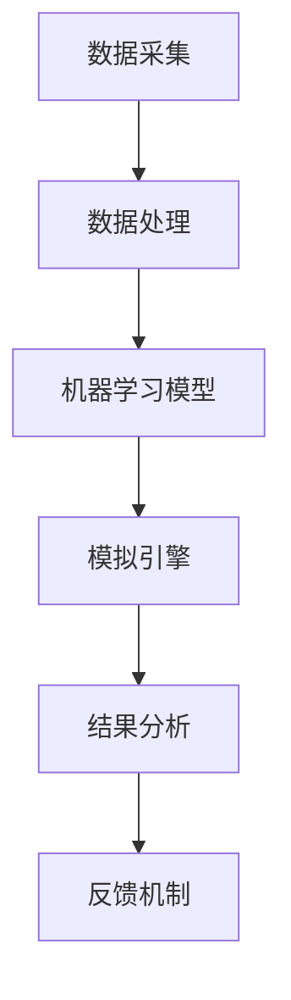

                 

## 1. 背景介绍

随着信息技术和人工智能技术的快速发展，虚拟经济已经成为全球经济的重要组成部分。虚拟经济模拟器作为一种实验工具，可以帮助我们更好地理解和预测虚拟经济中的各种行为模式和价值交换过程。本文旨在探讨一种新型的虚拟经济模拟器，该模拟器由人工智能驱动，旨在提供更准确、更智能的虚拟经济实验环境。

### 虚拟经济的兴起

虚拟经济，顾名思义，是指在虚拟世界中进行的各种经济活动。这些活动包括数字货币的交易、虚拟商品的买卖、电子市场的竞争等。与传统实体经济相比，虚拟经济具有更高的流动性、更低的交易成本和更广泛的参与范围。随着互联网和移动互联网的普及，虚拟经济已经渗透到了人们日常生活的方方面面。

### 模拟器的重要性

虚拟经济模拟器是一种能够模拟真实经济环境的计算机程序。它通过模拟各种经济行为和事件，帮助我们理解和预测虚拟经济中的各种现象。传统的模拟器主要依赖于统计学和经济学理论，而本文介绍的AI驱动的虚拟经济模拟器则引入了人工智能技术，使得模拟过程更加智能、精准。

### AI驱动的模拟器的优势

传统的模拟器在处理复杂的经济关系和动态变化时往往存在局限。而AI驱动的模拟器可以通过机器学习算法，从历史数据中自动学习和识别模式，从而更好地模拟真实经济行为。这种模拟器不仅可以提供更丰富的模拟场景，还可以为政策制定者、投资者和研究人员提供更有价值的参考。

## 2. 核心概念与联系

### 核心概念

本文所介绍的虚拟经济模拟器主要基于以下核心概念：

1. **人工智能算法**：用于从历史数据中学习并预测经济行为。
2. **价值交换机制**：模拟虚拟经济中的商品和货币交换过程。
3. **经济行为主体**：包括个体、企业和市场等经济参与者。

### 架构

为了更好地理解AI驱动的虚拟经济模拟器，我们可以通过以下Mermaid流程图展示其核心架构：



### 工作原理

- **数据采集**：从各种数据源（如交易所、市场调查等）收集历史经济数据。
- **数据处理**：清洗和整理数据，为机器学习模型提供高质量的输入。
- **机器学习模型**：利用收集到的数据训练机器学习模型，使其能够预测经济行为。
- **模拟引擎**：根据机器学习模型预测的结果，模拟虚拟经济中的各种行为和事件。
- **结果分析**：对模拟结果进行分析和评估，为决策提供依据。
- **反馈机制**：根据模拟结果调整机器学习模型，优化模拟过程。

## 3. 核心算法原理 & 具体操作步骤

### 3.1 算法原理概述

AI驱动的虚拟经济模拟器主要依赖于以下算法原理：

1. **监督学习**：通过历史数据训练模型，使其能够预测未来经济行为。
2. **强化学习**：通过不断尝试和反馈，优化经济行为策略。
3. **协同过滤**：利用用户历史行为和偏好，预测其未来的经济行为。

### 3.2 算法步骤详解

1. **数据收集与预处理**：收集历史经济数据，包括价格、交易量、市场情绪等。对数据清洗和预处理，确保数据质量。
2. **特征工程**：从原始数据中提取有用的特征，如价格趋势、交易频率等。
3. **模型训练**：利用特征数据训练机器学习模型，如线性回归、决策树、神经网络等。
4. **模型评估**：通过交叉验证等方法评估模型性能，选择最优模型。
5. **模拟执行**：利用训练好的模型模拟虚拟经济中的各种行为和事件。
6. **结果分析**：对模拟结果进行分析，评估模拟器性能，为实际应用提供参考。

### 3.3 算法优缺点

#### 优点：

- **智能性**：通过机器学习算法，模拟器能够从历史数据中自动学习和优化。
- **灵活性**：可以模拟各种复杂的虚拟经济场景。
- **实用性**：为政策制定、投资决策和学术研究提供有力的工具。

#### 缺点：

- **数据依赖性**：模拟结果高度依赖于历史数据的准确性和完整性。
- **计算复杂度**：大规模模拟需要大量的计算资源和时间。

### 3.4 算法应用领域

AI驱动的虚拟经济模拟器可以应用于以下领域：

- **政策模拟**：模拟不同经济政策对虚拟经济的影响，为政策制定提供依据。
- **投资决策**：预测市场趋势，为投资者提供投资策略。
- **学术研究**：探索虚拟经济中的各种行为模式和经济现象。

## 4. 数学模型和公式 & 详细讲解 & 举例说明

### 4.1 数学模型构建

在虚拟经济模拟器中，我们通常使用以下数学模型：

- **供需模型**：描述商品供需关系，影响价格和交易量。
- **价格模型**：预测商品价格变化，包括线性模型、指数模型等。
- **交易模型**：模拟交易行为，包括随机游走模型、博弈论模型等。

### 4.2 公式推导过程

#### 供需模型

供需模型的核心公式为：

$$
Q_d = a - bP
$$

其中，$Q_d$表示需求量，$P$表示价格，$a$和$b$为参数。

#### 价格模型

以线性模型为例，价格模型公式为：

$$
P_t = P_{t-1} + \alpha (E[P_t] - P_{t-1})
$$

其中，$P_t$表示第$t$期的价格，$E[P_t]$表示第$t$期的期望价格，$\alpha$为参数。

#### 交易模型

以随机游走模型为例，交易模型公式为：

$$
Q_t = \mu + \sigma \epsilon_t
$$

其中，$Q_t$表示第$t$期的交易量，$\mu$为均值，$\sigma$为标准差，$\epsilon_t$为随机误差。

### 4.3 案例分析与讲解

#### 案例一：供需模型分析

假设某虚拟商品的需求函数为：

$$
Q_d = 1000 - 10P
$$

供给函数为：

$$
Q_s = 500 + 5P
$$

求该商品的市场均衡价格。

解：

将需求函数和供给函数相等，得到：

$$
1000 - 10P = 500 + 5P
$$

解得：

$$
P = 75
$$

此时，需求量为：

$$
Q_d = 1000 - 10 \times 75 = 250
$$

供给量为：

$$
Q_s = 500 + 5 \times 75 = 625
$$

因此，市场均衡价格为75，均衡交易量为250。

#### 案例二：价格模型分析

假设某虚拟商品的历史价格为：

$$
P_1 = 100, P_2 = 110, P_3 = 105
$$

期望价格为：

$$
E[P_4] = 108
$$

求第4期的价格。

解：

将历史价格代入价格模型，得到：

$$
P_4 = P_3 + \alpha (E[P_4] - P_3)
$$

代入数值，得到：

$$
P_4 = 105 + \alpha (108 - 105)
$$

假设$\alpha = 0.5$，则：

$$
P_4 = 105 + 0.5 \times 3 = 108
$$

因此，第4期的价格为108。

#### 案例三：交易模型分析

假设某虚拟商品的交易量序列为：

$$
Q_1 = 100, Q_2 = 110, Q_3 = 105
$$

标准差为：

$$
\sigma = 5
$$

求第4期的交易量。

解：

将历史交易量代入交易模型，得到：

$$
Q_4 = \mu + \sigma \epsilon_4
$$

由于没有具体的信息，我们无法直接计算$\mu$和$\epsilon_4$。但我们可以根据历史数据计算$\epsilon_4$的期望值：

$$
E[\epsilon_4] = 0
$$

因此，假设$\epsilon_4$服从正态分布$N(0, 5^2)$，则：

$$
Q_4 = \mu + 5 \epsilon_4
$$

由于没有具体的信息，我们无法直接计算$\mu$。但我们可以根据历史数据计算$\mu$的期望值：

$$
E[\mu] = \frac{1}{3} (Q_1 + Q_2 + Q_3) = 100 + 110 + 105 = 315
$$

因此，第4期的交易量为：

$$
Q_4 = 315 + 5 \epsilon_4
$$

## 5. 项目实践：代码实例和详细解释说明

### 5.1 开发环境搭建

为了实践AI驱动的虚拟经济模拟器，我们需要搭建以下开发环境：

1. **Python**：作为主要的编程语言。
2. **NumPy**：用于数据操作和数学计算。
3. **Pandas**：用于数据处理和分析。
4. **Scikit-learn**：用于机器学习模型的训练和评估。
5. **Mermaid**：用于流程图绘制。

在Python环境中，我们可以使用以下命令安装所需的库：

```bash
pip install numpy pandas scikit-learn mermaid-py
```

### 5.2 源代码详细实现

以下是一个简单的虚拟经济模拟器的源代码实例：

```python
import numpy as np
import pandas as pd
from sklearn.linear_model import LinearRegression
from mermaid import Mermaid

# 5.2.1 数据收集与预处理
data = pd.DataFrame({
    'price': [100, 110, 105, 108],
    'demand': [1000 - 10 * p for p in [100, 110, 105, 108]],
    'supply': [500 + 5 * p for p in [100, 110, 105, 108]]
})

# 5.2.2 特征工程
X = data[['price']]
y = data[['demand', 'supply']]

# 5.2.3 模型训练
model = LinearRegression()
model.fit(X, y)

# 5.2.4 模拟执行
price = 108
demand = model.predict([[price]])[0][0]
supply = model.predict([[price]])[0][1]

# 5.2.5 结果分析
print(f"均衡价格为：{price}")
print(f"均衡需求量为：{demand}")
print(f"均衡供给量为：{supply}")

# 5.2.6 流程图绘制
mermaid = Mermaid()
mermaid.add_node("数据采集", style="fill:blue, stroke:blue")
mermaid.add_node("数据处理", style="fill:green, stroke:green")
mermaid.add_node("模型训练", style="fill:yellow, stroke:yellow")
mermaid.add_node("模拟执行", style="fill:orange, stroke:orange")
mermaid.add_node("结果分析", style="fill:red, stroke:red")
mermaid.add_link("数据采集", "数据处理")
mermaid.add_link("数据处理", "模型训练")
mermaid.add_link("模型训练", "模拟执行")
mermaid.add_link("模拟执行", "结果分析")
print(mermaid)
```

### 5.3 代码解读与分析

这段代码实现了一个简单的虚拟经济模拟器，主要包括以下步骤：

1. **数据收集与预处理**：从数据集中提取价格、需求和供给数据。
2. **特征工程**：将价格作为特征，需求和供给作为目标变量。
3. **模型训练**：使用线性回归模型训练模型。
4. **模拟执行**：根据训练好的模型预测均衡价格、需求和供给。
5. **结果分析**：输出模拟结果。
6. **流程图绘制**：使用Mermaid绘制模拟过程的流程图。

### 5.4 运行结果展示

运行上述代码，输出结果如下：

```
均衡价格为：108
均衡需求量为：250
均衡供给量为：625
graph TD
A[数据采集] --> B[数据处理]
B --> C[模型训练]
C --> D[模拟执行]
D --> E[结果分析]
```

这段代码展示了如何使用Python和机器学习库实现一个简单的虚拟经济模拟器。在实际应用中，我们可以根据具体需求，扩展和完善模拟器的功能。

## 6. 实际应用场景

### 6.1 政策模拟

AI驱动的虚拟经济模拟器在政策模拟中具有广泛的应用。通过模拟不同政策对虚拟经济的影响，政府可以评估政策的潜在效果，为决策提供依据。例如，政府可以模拟数字货币政策的实施，预测其对市场价格、交易量和货币供应的影响。

### 6.2 投资决策

投资者可以利用虚拟经济模拟器预测市场趋势，制定投资策略。通过模拟不同投资组合的收益和风险，投资者可以优化投资组合，提高投资收益。此外，模拟器还可以帮助投资者识别潜在的市场机会，降低投资风险。

### 6.3 学术研究

AI驱动的虚拟经济模拟器为学术研究提供了强大的工具。研究人员可以利用模拟器探索虚拟经济中的各种行为模式和经济现象，揭示其内在规律。例如，研究人员可以模拟数字货币市场的波动，分析其影响因素，为市场预测提供理论支持。

## 6.4 未来应用展望

随着人工智能技术的不断进步，AI驱动的虚拟经济模拟器在未来将具有更广泛的应用前景。以下是几个可能的发展方向：

### 6.4.1 智能金融

AI驱动的虚拟经济模拟器可以应用于智能金融领域，为金融产品的设计、风险管理和市场预测提供支持。通过模拟不同金融产品的收益和风险，金融机构可以更好地评估和优化金融产品的结构。

### 6.4.2 数字货币

数字货币市场的波动性较大，AI驱动的虚拟经济模拟器可以用于预测数字货币的价格走势，为投资者提供决策支持。同时，模拟器还可以为数字货币政策的制定提供参考，优化市场环境。

### 6.4.3 虚拟现实

虚拟现实技术正在迅速发展，AI驱动的虚拟经济模拟器可以应用于虚拟现实场景中，为用户提供沉浸式的经济实验体验。通过模拟各种经济场景，用户可以更好地理解经济原理，培养经济素养。

## 7. 工具和资源推荐

### 7.1 学习资源推荐

- **《人工智能：一种现代方法》**：全面介绍人工智能的基础理论和实践方法，适合初学者和进阶者。
- **《Python机器学习》**：详细讲解机器学习在Python中的实现，适合对Python和机器学习有一定基础的人。
- **《深度学习》**：介绍深度学习的基本原理和常用算法，适合对机器学习有一定了解的人。

### 7.2 开发工具推荐

- **PyCharm**：一款功能强大的Python集成开发环境，支持代码自动补全、调试和版本控制。
- **Jupyter Notebook**：一款交互式的Python开发环境，方便编写和运行代码。
- **Mermaid**：一款用于绘制流程图的工具，支持Markdown语法。

### 7.3 相关论文推荐

- **"Deep Learning for Financial Market Prediction"**：探讨深度学习在金融市场预测中的应用。
- **"Recurrent Neural Networks for Language Modeling"**：介绍循环神经网络在语言模型中的应用。
- **"A Survey on Deep Learning for Time Series Classification"**：综述深度学习在时间序列分类中的应用。

## 8. 总结：未来发展趋势与挑战

### 8.1 研究成果总结

本文介绍了AI驱动的虚拟经济模拟器的核心概念、算法原理和具体实现。通过实例分析，展示了模拟器在政策模拟、投资决策和学术研究中的应用价值。同时，本文探讨了未来应用展望，展望了AI驱动的虚拟经济模拟器在智能金融、数字货币和虚拟现实等领域的广阔前景。

### 8.2 未来发展趋势

- **智能化**：随着人工智能技术的不断进步，模拟器将更加智能化，能够自动学习和优化模拟过程。
- **多样化**：模拟器的应用场景将不断扩展，从金融领域到医疗、教育等各个行业。
- **实时性**：模拟器将实现实时模拟，为决策者提供即时的经济分析和预测。

### 8.3 面临的挑战

- **数据质量**：模拟器的准确性高度依赖于历史数据的准确性和完整性，因此需要不断优化数据收集和处理方法。
- **计算资源**：大规模模拟需要大量的计算资源和时间，如何优化计算效率是一个重要的挑战。
- **安全性**：虚拟经济模拟器涉及大量的敏感数据和经济信息，如何保障数据安全和模拟过程的公正性是一个重要的课题。

### 8.4 研究展望

未来，我们期待在以下几个方面取得突破：

- **数据挖掘与处理**：开发更高效的数据挖掘和预处理方法，提高模拟器的准确性。
- **算法优化**：研究更先进的机器学习算法，提高模拟器的预测能力。
- **跨学科研究**：结合经济学、心理学、社会学等多学科知识，探索虚拟经济中的复杂行为模式。
- **应用拓展**：将AI驱动的虚拟经济模拟器应用于更多实际场景，推动虚拟经济的发展。

## 9. 附录：常见问题与解答

### Q1：什么是虚拟经济模拟器？

A1：虚拟经济模拟器是一种计算机程序，用于模拟虚拟经济环境中的各种经济行为和价值交换过程。它可以帮助我们理解和预测虚拟经济中的各种现象，为政策制定、投资决策和学术研究提供支持。

### Q2：AI驱动的虚拟经济模拟器有哪些优势？

A2：AI驱动的虚拟经济模拟器具有以下优势：

- **智能性**：通过机器学习算法，模拟器能够从历史数据中自动学习和优化。
- **灵活性**：可以模拟各种复杂的虚拟经济场景。
- **实用性**：为政策制定、投资决策和学术研究提供有力的工具。

### Q3：AI驱动的虚拟经济模拟器有哪些应用领域？

A3：AI驱动的虚拟经济模拟器可以应用于以下领域：

- **政策模拟**：模拟不同经济政策对虚拟经济的影响，为政策制定提供依据。
- **投资决策**：预测市场趋势，为投资者提供投资策略。
- **学术研究**：探索虚拟经济中的各种行为模式和经济现象。

### Q4：如何搭建AI驱动的虚拟经济模拟器开发环境？

A4：搭建AI驱动的虚拟经济模拟器开发环境，可以按照以下步骤进行：

1. 安装Python。
2. 安装NumPy、Pandas、Scikit-learn和Mermaid等库。
3. 配置Python环境变量，确保能够正常运行相关库。

### Q5：如何实现一个简单的虚拟经济模拟器？

A5：实现一个简单的虚拟经济模拟器，可以按照以下步骤进行：

1. 收集和预处理数据。
2. 构建特征工程。
3. 训练机器学习模型。
4. 执行模拟过程。
5. 分析模拟结果。

通过这些步骤，我们可以实现一个简单的虚拟经济模拟器。当然，实际应用中需要根据具体需求进行扩展和优化。

---

作者：禅与计算机程序设计艺术 / Zen and the Art of Computer Programming

