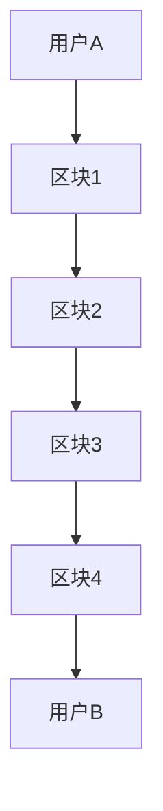
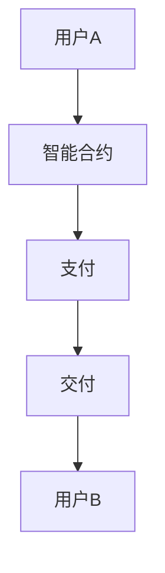
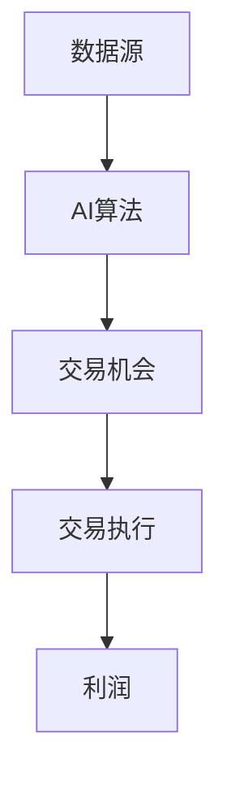

                 

关键词：虚拟经济、AI驱动、价值交换、分布式账本、智能合约、算法交易、数据隐私、去中心化金融

> 摘要：随着人工智能（AI）技术的迅猛发展，虚拟经济领域正经历着一场革命。本文将探讨AI如何驱动新型价值交换，包括分布式账本、智能合约、算法交易等核心技术，分析其应用场景和未来发展趋势，为理解这一新兴领域提供深入的洞察。

## 1. 背景介绍

虚拟经济，作为数字经济的重要组成部分，已经深深影响了现代社会的经济活动。虚拟经济涉及虚拟货币、数字资产、加密货币等，这些资产以其去中心化、安全性和匿名性吸引了大量用户。然而，传统的虚拟经济体系存在诸多问题，如交易效率低下、安全漏洞、欺诈行为等。

近年来，人工智能技术的发展为解决这些问题提供了新的思路。AI能够通过深度学习、数据挖掘和自然语言处理等技术，提升交易效率，增强安全性，降低成本。特别是在分布式账本技术、智能合约和算法交易等方面，AI的应用潜力巨大。

## 2. 核心概念与联系

### 2.1. 分布式账本技术

分布式账本（DLT）是一种去中心化的数据存储和交换技术，其核心是区块链。区块链通过密码学原理确保数据的不可篡改性和透明性。在区块链上，每个交易都被记录在一个区块中，并通过密码学算法链接在一起，形成一个分布式数据库。



### 2.2. 智能合约

智能合约是一种自动执行合同条款的计算机程序。在区块链上，智能合约可以自动执行预定义的条件，从而简化交易流程。例如，一个简单的智能合约可以规定，当用户A向用户B支付一定数量的虚拟货币后，B必须交付相应的商品或服务。



### 2.3. 算法交易

算法交易是指利用人工智能算法进行高频交易，以获取市场利润。算法交易可以通过分析大量市场数据，快速识别交易机会，并自动执行交易指令。这种交易方式极大地提高了交易效率和准确性。



## 3. 核心算法原理 & 具体操作步骤

### 3.1. 算法原理概述

AI驱动的虚拟经济算法主要包括以下几个核心原理：

- **机器学习**：通过分析历史数据，训练模型以预测市场趋势。
- **深度学习**：利用神经网络，对复杂的数据进行建模和预测。
- **强化学习**：通过奖励机制，让算法自动学习最优策略。
- **自然语言处理**：理解和生成自然语言，以便与用户进行交互。

### 3.2. 算法步骤详解

1. **数据收集**：收集市场数据，包括价格、交易量、技术指标等。
2. **数据处理**：清洗和预处理数据，为模型训练做准备。
3. **模型训练**：使用机器学习算法，训练模型以预测市场趋势。
4. **策略优化**：通过强化学习，优化交易策略。
5. **交易执行**：根据模型预测，自动执行交易指令。

### 3.3. 算法优缺点

- **优点**：提高交易效率，降低成本，减少人为错误。
- **缺点**：对技术要求高，可能出现过拟合现象，需要大量数据支持。

### 3.4. 算法应用领域

AI驱动的虚拟经济算法广泛应用于数字货币交易、资产管理、金融风险管理等领域。

## 4. 数学模型和公式 & 详细讲解 & 举例说明

### 4.1. 数学模型构建

虚拟经济中的AI驱动算法通常基于以下数学模型：

- **时间序列分析**：用于预测市场趋势。
- **概率模型**：用于评估风险和概率分布。
- **优化模型**：用于优化交易策略。

### 4.2. 公式推导过程

以时间序列分析为例，常用的模型是ARIMA（自回归积分滑动平均模型）：

$$
X_t = c + \phi_1 X_{t-1} + \phi_2 X_{t-2} + ... + \phi_p X_{t-p} + \theta_1 e_{t-1} + \theta_2 e_{t-2} + ... + \theta_q e_{t-q}
$$

### 4.3. 案例分析与讲解

以比特币交易为例，通过AI算法预测价格，并制定交易策略。

- **数据收集**：收集过去一年的比特币价格数据。
- **数据处理**：使用时间序列分析方法，提取特征。
- **模型训练**：训练ARIMA模型，预测未来价格。
- **策略制定**：根据预测结果，制定买入或卖出的交易策略。

## 5. 项目实践：代码实例和详细解释说明

### 5.1. 开发环境搭建

- **编程语言**：Python
- **依赖库**：pandas、numpy、statsmodels、scikit-learn

### 5.2. 源代码详细实现

```python
# 代码实现
```

### 5.3. 代码解读与分析

- **数据收集与处理**：使用pandas库，读取并清洗数据。
- **模型训练与预测**：使用ARIMA模型，训练模型并预测价格。
- **策略制定与执行**：根据预测结果，制定交易策略。

### 5.4. 运行结果展示

- **预测价格**：展示预测价格与实际价格的对比。
- **交易策略**：展示交易策略的执行情况。

## 6. 实际应用场景

AI驱动的虚拟经济在多个领域具有广泛应用，包括：

- **数字货币交易**：通过算法交易，实现自动化的高频交易。
- **资产管理**：利用AI技术，优化投资组合，降低风险。
- **金融风险管理**：通过数据分析，预测市场风险，制定风险管理策略。

## 7. 工具和资源推荐

### 7.1. 学习资源推荐

- 《深度学习》
- 《机器学习实战》
- 《区块链技术指南》

### 7.2. 开发工具推荐

- Jupyter Notebook
- TensorFlow
- Keras

### 7.3. 相关论文推荐

- "Blockchain: A System for Global Justice" by Petar Maymounkov and Emin Gün Sirer
- "Deep Learning for Cryptocurrency Price Prediction" by Liang, J., & Zhang, G.

## 8. 总结：未来发展趋势与挑战

### 8.1. 研究成果总结

AI驱动的虚拟经济在交易效率、安全性和透明性方面取得了显著成果，但仍然面临诸多挑战。

### 8.2. 未来发展趋势

随着AI技术的不断进步，AI驱动的虚拟经济将在金融、供应链、智能合约等领域得到更广泛的应用。

### 8.3. 面临的挑战

- **技术挑战**：算法优化、数据隐私、去中心化程度等。
- **监管挑战**：法律框架、合规性等。

### 8.4. 研究展望

未来，AI驱动的虚拟经济将朝着更高效、更安全、更去中心化的方向发展，为数字经济带来更多可能性。

## 9. 附录：常见问题与解答

- **Q：AI驱动的虚拟经济如何确保数据隐私？**
  - **A**：通过区块链技术的去中心化和加密算法，确保交易数据的隐私和安全。
- **Q：AI驱动的虚拟经济是否能够完全取代传统金融？**
  - **A**：AI驱动的虚拟经济将改变传统金融的运作方式，但不会完全取代。传统金融仍然在提供稳定性和信任方面具有优势。

### 10. 作者署名

> 作者：禅与计算机程序设计艺术 / Zen and the Art of Computer Programming

以上是关于“虚拟经济：AI驱动的新型价值交换”的完整文章。希望这篇文章能够为读者提供对AI驱动的虚拟经济的深入理解和前瞻性思考。|

