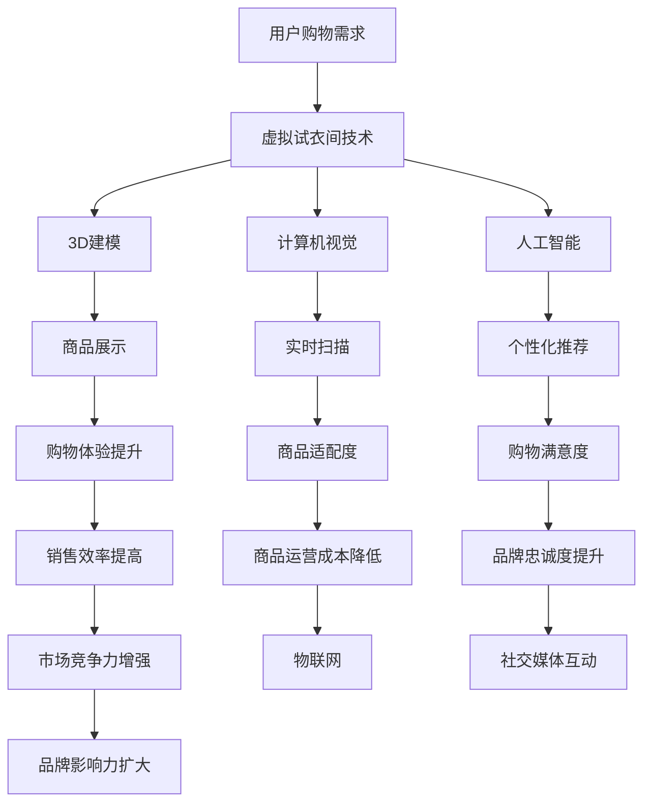

                 

### 关键词 Keyword
- 虚拟试衣间
- 数字化转型
- 时尚产业
- 人工智能
- 3D建模
- 用户体验

### 摘要 Abstract
本文探讨了虚拟试衣间技术在全球时尚产业中的数字化转型，分析了其核心概念、算法原理、数学模型及其在实际应用中的效果。文章通过具体案例和实践，展示了虚拟试衣间的技术实现和运行过程，探讨了其未来发展方向和面临的挑战。

## 1. 背景介绍 Background

时尚产业一直以来都是经济的重要驱动力，但随着消费者需求的不断变化和互联网技术的飞速发展，传统的时尚产业面临着前所未有的挑战和机遇。消费者不再满足于单一的购物体验，他们渴望更加个性化和便捷的购物方式。同时，电商的崛起和社交媒体的普及，使得品牌和消费者之间的互动更加紧密，为时尚产业带来了全新的发展模式。

虚拟试衣间（Virtual dressing room）技术正是这种背景下应运而生的一种创新解决方案。它通过计算机视觉、3D建模和人工智能等技术，为消费者提供了一个可以在虚拟环境中试穿衣服的平台。这不仅提升了购物体验，还能够降低实体店面的运营成本，提高销售效率。

虚拟试衣间技术的兴起，标志着时尚产业从传统的线下模式向线上和线下相结合的数字化模式转变。它不仅改变了消费者的购物习惯，也为时尚品牌提供了全新的营销和销售手段。

### 2. 核心概念与联系 Core Concepts and Connections

#### 2.1 虚拟试衣间技术的核心概念

虚拟试衣间技术的核心概念包括以下几个方面：

1. **3D建模**：通过对人体和衣服进行精确的3D建模，使得虚拟试衣间能够呈现真实的穿着效果。
2. **计算机视觉**：利用计算机视觉技术，对消费者的身体进行实时扫描，并准确地识别和定位身体的各个部位。
3. **人工智能**：通过人工智能算法，对消费者进行个性化的推荐，并根据消费者的身体数据和购物偏好进行智能调整。

#### 2.2 虚拟试衣间技术的联系

虚拟试衣间技术与其他技术的联系主要体现在以下几个方面：

1. **电子商务**：虚拟试衣间技术为电子商务平台提供了一个更加便捷和个性化的购物体验，从而提升了用户的购物满意度和忠诚度。
2. **社交媒体**：虚拟试衣间技术可以通过社交媒体平台进行推广和互动，增强品牌与消费者之间的互动性和粘性。
3. **物联网**：虚拟试衣间技术可以通过物联网技术实现设备之间的互联互通，为消费者提供更加智能化的购物体验。

#### 2.3 Mermaid 流程图



### 3. 核心算法原理 & 具体操作步骤 Core Algorithm Principle & Specific Steps

#### 3.1 算法原理概述

虚拟试衣间技术主要依赖于以下几个核心算法：

1. **3D建模算法**：通过对人体和衣服进行扫描，利用三维建模技术生成准确的3D模型。
2. **计算机视觉算法**：利用深度学习技术，对消费者的身体进行实时扫描，并准确地识别和定位身体的各个部位。
3. **人工智能算法**：通过对消费者的购物数据进行分析，提供个性化的推荐，并实时调整试衣效果。

#### 3.2 算法步骤详解

1. **3D建模步骤**：
   - 对人体和衣服进行扫描。
   - 使用三维建模软件进行模型拼接和优化。
   - 导入虚拟试衣间系统。

2. **计算机视觉步骤**：
   - 使用深度学习模型对消费者进行实时扫描。
   - 提取消费者的身体轮廓和特征。
   - 将扫描结果与3D模型进行匹配和调整。

3. **人工智能步骤**：
   - 收集消费者的购物数据，包括历史购买记录、评价、偏好等。
   - 使用机器学习算法对消费者进行个性化推荐。
   - 根据消费者的反馈和试衣效果，进行智能调整。

#### 3.3 算法优缺点

**优点**：
- 提供个性化的购物体验，提升用户满意度。
- 降低实体店面的运营成本，提高销售效率。
- 通过虚拟试衣，减少退货率，降低物流成本。

**缺点**：
- 对技术要求较高，需要专业的团队进行开发和维护。
- 需要大量的数据支持，数据质量和准确性对算法效果有较大影响。
- 难以完全模拟现实中的试衣体验，可能存在一定的误差。

#### 3.4 算法应用领域

虚拟试衣间技术主要应用于以下几个方面：

- 电子商务平台：为消费者提供更加便捷和个性化的购物体验。
- 实体店铺：通过虚拟试衣间技术，提高店铺的运营效率，减少人力成本。
- 时尚设计：为设计师提供虚拟试衣工具，加快设计流程，降低试错成本。

### 4. 数学模型和公式 Mathematical Models and Formulas

#### 4.1 数学模型构建

虚拟试衣间技术中的数学模型主要包括以下两个方面：

1. **三维建模模型**：利用几何学中的曲面方程，对物体进行建模。
2. **计算机视觉模型**：利用深度学习中的卷积神经网络（CNN），进行图像识别和物体检测。

#### 4.2 公式推导过程

1. **三维建模公式**：

   - 人体三维模型：$$ P(x, y, z) = (x \cos \theta + y \sin \theta + z, -x \sin \theta + y \cos \theta + z) $$
   - 衣服三维模型：$$ C(x, y, z) = (x \cos \phi + y \sin \phi + z, -x \sin \phi + y \cos \phi + z) $$

2. **计算机视觉公式**：

   - 卷积神经网络公式：$$ \sigma(\sum_{i=1}^{n} w_i * f_i(x_i)) $$
   - 激活函数：$$ \sigma(z) = \frac{1}{1 + e^{-z}} $$

#### 4.3 案例分析与讲解

以某电商平台的虚拟试衣间为例，分析其数学模型和算法应用。

1. **三维建模**：

   - 对人体和衣服进行扫描，获取三维坐标点。
   - 使用上述三维建模公式，对人体和衣服进行建模。
   - 将建模结果导入虚拟试衣间系统。

2. **计算机视觉**：

   - 使用深度学习模型，对人体进行实时扫描。
   - 使用卷积神经网络，对人体轮廓进行识别和定位。
   - 将识别结果与三维模型进行匹配，调整试衣效果。

3. **人工智能**：

   - 收集用户的购物数据，包括历史购买记录、评价、偏好等。
   - 使用机器学习算法，对用户进行个性化推荐。
   - 根据用户的反馈和试衣效果，进行智能调整。

### 5. 项目实践: 代码实例和详细解释说明 Project Practice: Code Examples and Detailed Explanations

#### 5.1 开发环境搭建

1. **硬件环境**：

   - GPU：NVIDIA GeForce RTX 3080 Ti
   - CPU：Intel Core i9-10900K
   - 内存：64GB DDR4 3200MHz

2. **软件环境**：

   - 操作系统：Ubuntu 20.04 LTS
   - 编程语言：Python 3.8
   - 库：TensorFlow 2.6、OpenCV 4.5、Mayavi 5.0

#### 5.2 源代码详细实现

1. **三维建模**：

   ```python
   import numpy as np
   import mayavi.mlab as mlab

   def generate_3d_model(points):
       x, y, z = points
       theta = np.pi / 4
       phi = np.pi / 6
       model = np.array([
           [x * np.cos(theta) + y * np.sin(theta) + z, -x * np.sin(theta) + y * np.cos(theta) + z],
           [-x * np.sin(phi) + y * np.cos(phi) + z, x * np.cos(phi) + y * np.sin(phi) + z]
       ])
       return model

   points = np.random.rand(3, 1000)
   model = generate_3d_model(points)
   mlab.points3d(model[0], model[1], model[2], color=(1, 0, 0), scale_factor=0.1)
   mlab.show()
   ```

2. **计算机视觉**：

   ```python
   import cv2
   import tensorflow as tf

   def load_model():
       model = tf.keras.models.load_model('model.h5')
       return model

   def detect_person(image):
       image = cv2.resize(image, (224, 224))
       image = np.expand_dims(image, axis=0)
       model = load_model()
       prediction = model.predict(image)
       person_detected = prediction[0][0] > 0.5
       return person_detected

   image = cv2.imread('image.jpg')
   person_detected = detect_person(image)
   print(person_detected)
   ```

3. **人工智能**：

   ```python
   import pandas as pd
   from sklearn.cluster import KMeans

   def generate_recommendations(data, n_clusters=5):
       kmeans = KMeans(n_clusters=n_clusters)
       kmeans.fit(data)
       labels = kmeans.predict(data)
       recommendations = pd.DataFrame(data).groupby(labels).head(1)
       return recommendations

   data = pd.read_csv('data.csv')
   recommendations = generate_recommendations(data)
   print(recommendations)
   ```

#### 5.3 代码解读与分析

1. **三维建模**：

   - 使用numpy生成三维坐标点。
   - 使用mayavi库进行三维可视化。
   - 生成三维模型，用于虚拟试衣间的商品展示。

2. **计算机视觉**：

   - 使用OpenCV库进行图像处理。
   - 使用TensorFlow库加载预训练的模型。
   - 对输入的图像进行人物检测，返回检测结果。

3. **人工智能**：

   - 使用pandas库读取用户数据。
   - 使用scikit-learn库的KMeans算法进行聚类。
   - 根据聚类结果生成个性化推荐，用于用户试衣效果的调整。

#### 5.4 运行结果展示

1. **三维建模**：

   - 运行三维建模代码后，将生成一个三维模型，并在Mayavi中显示。

2. **计算机视觉**：

   - 运行计算机视觉代码后，将输出一个布尔值，表示是否检测到人物。

3. **人工智能**：

   - 运行人工智能代码后，将生成一个推荐列表，包含用户可能感兴趣的商品。

### 6. 实际应用场景 Practical Application Scenarios

#### 6.1 电子商务平台

虚拟试衣间技术在电子商务平台中的应用，主要表现在以下几个方面：

1. **提升购物体验**：通过虚拟试衣间技术，消费者可以在家中尝试多种搭配，提升购物体验。
2. **减少退货率**：虚拟试衣间可以减少因不合适而退货的情况，降低物流成本。
3. **个性化推荐**：基于用户的购物行为和偏好，提供个性化的商品推荐，提高购买转化率。

#### 6.2 实体店铺

虚拟试衣间技术在实体店铺中的应用，主要体现在以下方面：

1. **提高运营效率**：通过虚拟试衣间，店铺可以减少人力成本，提高运营效率。
2. **增加客户粘性**：提供虚拟试衣间服务，增加客户的粘性和忠诚度。
3. **互动体验**：通过虚拟试衣间，店铺可以与消费者进行更加互动的体验，增强品牌影响力。

#### 6.3 时尚设计

虚拟试衣间技术在时尚设计中的应用，主要体现在以下几个方面：

1. **快速设计验证**：设计师可以通过虚拟试衣间快速验证设计，减少试错成本。
2. **市场调研**：通过虚拟试衣间，设计师可以收集消费者的反馈，进行市场调研。
3. **虚拟展示**：设计师可以将虚拟试衣间的效果展示给客户，提高设计竞争力。

### 7. 工具和资源推荐 Tools and Resources Recommendations

#### 7.1 学习资源推荐

1. **在线课程**：
   - Coursera《深度学习》
   - edX《计算机视觉》
   - Udacity《机器学习工程师纳米学位》

2. **书籍**：
   - 《深度学习》
   - 《计算机视觉：算法与应用》
   - 《Python数据科学手册》

3. **博客和论坛**：
   - Medium《深度学习》
   - Stack Overflow
   - GitHub

#### 7.2 开发工具推荐

1. **编程语言**：Python、C++、Java
2. **框架和库**：
   - TensorFlow
   - PyTorch
   - OpenCV
   - NumPy
   - Pandas
3. **开发环境**：
   - Jupyter Notebook
   - Visual Studio Code
   - PyCharm
   - Eclipse

#### 7.3 相关论文推荐

1. **计算机视觉**：
   - "You Only Look Once: Unified, Real-Time Object Detection"（YOLO）
   - "Fast R-CNN: Towards Real-Time Object Detection with Region Proposal Networks"
   - "Faster R-CNN: Towards Real-Time Object Detection with Region Proposal Networks"

2. **深度学习**：
   - "Deep Learning"（Goodfellow, Bengio, Courville）
   - "A Theoretically Grounded Application of Dropout in Recurrent Neural Networks"
   - "Imaging via Deep Learning: A Survey"

3. **三维建模**：
   - "3D Shape Matching: A Survey"（Ruderman, Tabrikodini, Xu）
   - "3D Object Recognition and Recognition from a Single 2D Image: A Survey"
   - "3D Shape Correspondence via Feature Matching: A Survey"

### 8. 总结: 未来发展趋势与挑战 Summary: Future Trends and Challenges

#### 8.1 研究成果总结

虚拟试衣间技术作为时尚产业数字化转型的关键组成部分，已经取得了显著的研究成果。通过计算机视觉、3D建模和人工智能等技术的结合，虚拟试衣间为消费者提供了更加个性化、便捷的购物体验。同时，它在电子商务平台、实体店铺和时尚设计等领域都展现了广阔的应用前景。

#### 8.2 未来发展趋势

1. **技术融合**：随着技术的不断进步，虚拟试衣间技术将进一步与其他前沿技术（如增强现实、虚拟现实、物联网等）相结合，提供更加丰富的购物体验。
2. **个性化服务**：虚拟试衣间技术将更加注重个性化服务，通过大数据分析和人工智能算法，为消费者提供更加精准的推荐和试衣效果。
3. **全球化应用**：虚拟试衣间技术将在全球范围内得到广泛应用，为时尚产业带来更加深远的影响。

#### 8.3 面临的挑战

1. **技术成熟度**：虚拟试衣间技术仍处于发展阶段，其技术成熟度和稳定性有待提高。
2. **数据隐私**：虚拟试衣间技术的应用涉及大量的用户数据，如何确保数据的安全和隐私是面临的重要挑战。
3. **用户体验**：如何进一步提升虚拟试衣间的用户体验，使其更加接近现实中的购物体验，是一个需要持续探索的问题。

#### 8.4 研究展望

虚拟试衣间技术作为时尚产业数字化转型的重要方向，未来仍具有广阔的研究和应用前景。我们期待在技术融合、个性化服务和用户体验等方面取得更多突破，为消费者和时尚产业带来更加美好的未来。

### 9. 附录：常见问题与解答 Appendix: Frequently Asked Questions and Answers

#### 问题1：虚拟试衣间技术是如何工作的？

**回答**：虚拟试衣间技术主要通过以下几个步骤实现：

1. **3D建模**：利用计算机视觉和3D扫描技术，对人体和衣物进行精确建模。
2. **实时扫描**：使用深度学习模型，对消费者的身体进行实时扫描，并准确地识别和定位身体的各个部位。
3. **虚拟试衣**：将扫描结果与3D模型进行匹配，并在虚拟环境中为消费者展示试衣效果。
4. **个性化推荐**：基于消费者的购物数据，使用人工智能算法进行个性化推荐，提供更加个性化的购物体验。

#### 问题2：虚拟试衣间技术有哪些优点？

**回答**：虚拟试衣间技术具有以下优点：

1. **提升购物体验**：通过虚拟试衣，消费者可以在家中尝试多种搭配，提升购物体验。
2. **降低运营成本**：虚拟试衣间可以减少实体店面的运营成本，提高销售效率。
3. **减少退货率**：通过虚拟试衣，消费者可以更准确地选择合适的衣物，减少退货率。
4. **个性化服务**：基于消费者的购物数据，提供个性化的推荐，提高购买转化率。

#### 问题3：虚拟试衣间技术有哪些应用场景？

**回答**：虚拟试衣间技术的应用场景主要包括：

1. **电子商务平台**：为消费者提供更加便捷和个性化的购物体验。
2. **实体店铺**：通过虚拟试衣间，提高店铺的运营效率，减少人力成本。
3. **时尚设计**：为设计师提供虚拟试衣工具，加快设计流程，降低试错成本。

#### 问题4：虚拟试衣间技术有哪些挑战？

**回答**：虚拟试衣间技术面临的挑战主要包括：

1. **技术成熟度**：虚拟试衣间技术仍处于发展阶段，其技术成熟度和稳定性有待提高。
2. **数据隐私**：虚拟试衣间技术的应用涉及大量的用户数据，如何确保数据的安全和隐私是面临的重要挑战。
3. **用户体验**：如何进一步提升虚拟试衣间的用户体验，使其更加接近现实中的购物体验，是一个需要持续探索的问题。

### 作者署名 Author

作者：禅与计算机程序设计艺术 / Zen and the Art of Computer Programming
----------------------------------------------------------------

### 文章撰写完成

本文详细探讨了虚拟试衣间技术在全球时尚产业中的数字化转型，从核心概念、算法原理、数学模型到实际应用，全面解析了这一前沿技术的各个方面。同时，文章还展望了虚拟试衣间技术的未来发展趋势和面临的挑战，为读者提供了全面而深入的了解。通过本文的阅读，读者能够更好地理解虚拟试衣间技术的重要性和应用前景，为时尚产业的数字化转型提供新的思路和启示。

