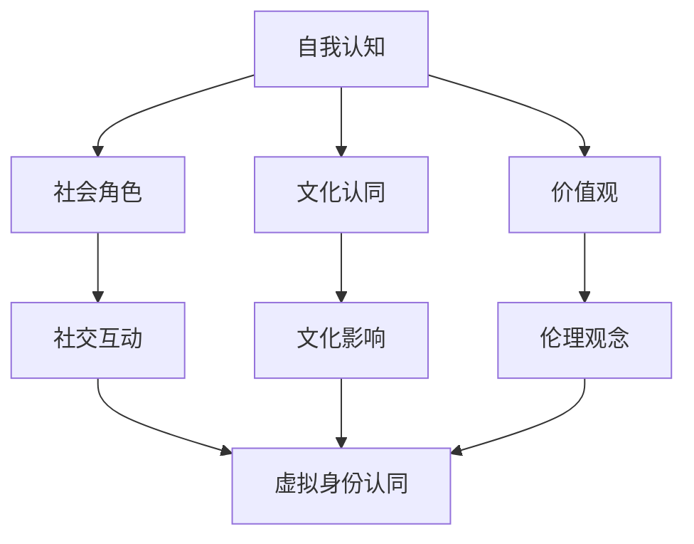
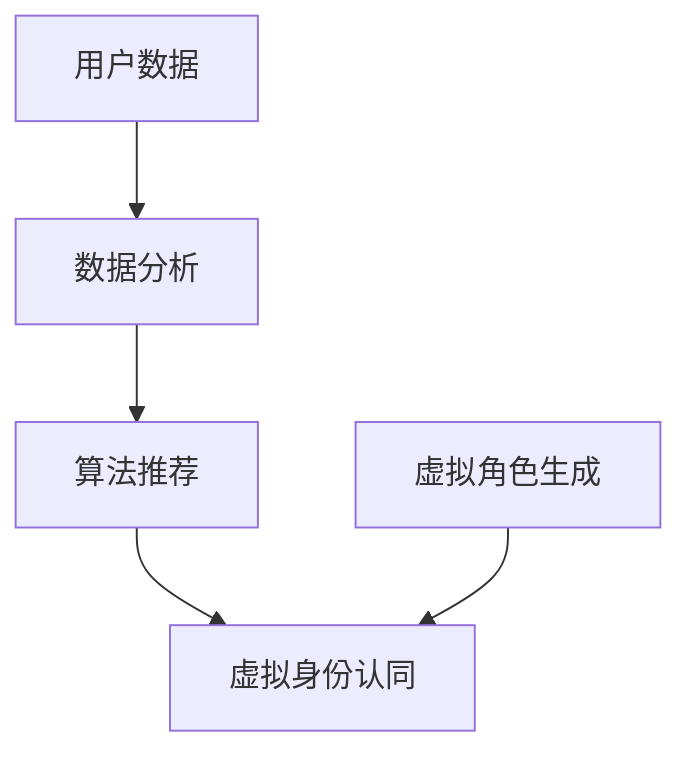

                 

关键词：虚拟身份认同、AI技术、自我探索、数字自我、社会影响、伦理道德、未来发展

> 摘要：在人工智能技术迅猛发展的时代，虚拟身份认同成为了人们关注的新焦点。本文将探讨AI如何塑造和影响个体的身份认同，分析其在社会和文化层面的多重影响，并探讨未来可能面临的伦理和道德挑战。

## 1. 背景介绍

随着科技的飞速进步，人工智能（AI）已经成为我们生活不可或缺的一部分。从简单的语音助手到复杂的数据分析，AI技术在各个领域展现出了其强大的能力。然而，随着AI技术的发展，一个不容忽视的问题逐渐浮现：虚拟身份认同。在数字世界中，人们如何定义自我？他们的身份认同是否受到AI的塑造和影响？这些问题引发了广泛的讨论和研究。

### 1.1 虚拟身份的定义

虚拟身份是指在数字世界中，个体通过符号、角色、网络身份等方式表现出来的自我。这种身份可以是匿名的，也可以是真实身份的延伸，甚至可以是完全虚构的。虚拟身份不仅限于游戏、社交网络，还包括虚拟现实（VR）和增强现实（AR）等应用场景。

### 1.2 AI与虚拟身份认同的关系

AI技术可以通过数据分析和算法，对个体的行为、兴趣和偏好进行深入分析，从而影响个体的虚拟身份认同。例如，社交媒体平台通过算法推荐内容，使得用户在虚拟世界中的身份认同逐渐被平台所塑造。同时，AI还可以通过生成对抗网络（GAN）等技术创造虚拟角色，这些角色在某些情况下可能成为用户在虚拟世界中的代表。

## 2. 核心概念与联系

### 2.1 虚拟身份认同的构成

虚拟身份认同由多个部分组成，包括自我认知、社会角色、文化认同和价值观等。在数字世界中，这些部分如何相互作用，决定了个体的虚拟身份认同。



### 2.2 AI技术对虚拟身份认同的影响

AI技术通过数据分析、算法推荐和虚拟角色生成等方式，对虚拟身份认同产生影响。例如，通过分析用户的网络行为，AI可以推测用户的兴趣爱好，从而推荐相关内容，进一步强化用户的虚拟身份认同。



## 3. 核心算法原理 & 具体操作步骤

### 3.1 算法原理概述

虚拟身份认同的核心算法主要包括数据分析、用户建模和虚拟角色生成。以下是这些算法的简要概述：

- **数据分析**：通过分析用户在数字世界中的行为数据，如搜索记录、社交媒体互动等，提取用户兴趣和偏好。
- **用户建模**：基于数据分析结果，构建用户兴趣和行为模型，用于推荐系统和虚拟角色生成。
- **虚拟角色生成**：利用生成对抗网络（GAN）等技术，创建与用户兴趣和行为相匹配的虚拟角色。

### 3.2 算法步骤详解

以下是核心算法的具体操作步骤：

#### 3.2.1 数据分析

1. 收集用户数据：从各种数字平台收集用户行为数据，如搜索记录、浏览历史等。
2. 数据清洗：去除无效数据和噪声，确保数据质量。
3. 特征提取：从数据中提取与用户兴趣和偏好相关的特征。
4. 数据建模：使用机器学习算法构建用户兴趣和行为模型。

#### 3.2.2 用户建模

1. 模型训练：使用训练数据集训练用户兴趣和行为模型。
2. 模型评估：评估模型的准确性和泛化能力。
3. 模型应用：将训练好的模型应用于新用户数据，预测用户兴趣和偏好。

#### 3.2.3 虚拟角色生成

1. 角色设计：设计虚拟角色的外观、性格和特征。
2. 数据输入：将用户兴趣和行为数据输入到GAN模型中。
3. 模型训练：使用训练数据训练GAN模型，生成虚拟角色。
4. 角色优化：根据用户反馈调整虚拟角色，提高用户满意度。

### 3.3 算法优缺点

#### 3.3.1 优点

- **个性化推荐**：通过分析用户数据，提供个性化的虚拟身份认同，满足用户需求。
- **互动性强**：虚拟角色可以与用户进行互动，增强虚拟身份认同的沉浸感。
- **创新性**：虚拟角色生成技术为数字世界带来了新的可能性，丰富了用户体验。

#### 3.3.2 缺点

- **隐私问题**：用户数据收集和使用可能引发隐私问题。
- **伦理挑战**：虚拟身份认同的算法和模型可能存在伦理和道德风险，如歧视、偏见等。
- **依赖性**：过度依赖虚拟身份认同可能导致用户在现实世界中的自我认同缺失。

### 3.4 算法应用领域

虚拟身份认同算法广泛应用于多个领域，包括：

- **社交媒体**：通过算法推荐和虚拟角色互动，增强用户粘性。
- **虚拟现实（VR）和增强现实（AR）**：为用户提供沉浸式的虚拟身份体验。
- **在线游戏**：生成与玩家兴趣和行为相匹配的虚拟角色，提高游戏体验。
- **个性化推荐系统**：为用户提供个性化的虚拟身份认同，提高服务质量和用户满意度。

## 4. 数学模型和公式 & 详细讲解 & 举例说明

### 4.1 数学模型构建

虚拟身份认同的数学模型通常包括用户行为模型、兴趣模型和虚拟角色生成模型。以下是这些模型的构建过程：

#### 4.1.1 用户行为模型

用户行为模型可以使用马尔可夫决策过程（MDP）构建。MDP模型通过状态转移矩阵和奖励函数，描述用户在不同状态下的行为决策。

$$
P(s_t | s_{t-1}, a_{t-1}) = \text{概率分布，描述状态转移}
$$

$$
R(s_t, a_t) = \text{奖励函数，描述用户在当前状态下的收益}
$$

#### 4.1.2 兴趣模型

兴趣模型可以使用潜在因子模型（LFM）构建。LFM模型通过用户-项目矩阵分解，提取用户兴趣和项目特征。

$$
R_{ui} = \langle \text{user}_u, \text{item}_i \rangle + \epsilon_{ui}
$$

$$
\langle \text{user}_u, \text{item}_i \rangle = \sum_{k=1}^{K} u_k v_{ik}
$$

其中，$R_{ui}$ 表示用户 $u$ 对项目 $i$ 的兴趣评分，$\text{user}_u$ 和 $\text{item}_i$ 分别表示用户和项目的特征向量，$u_k$ 和 $v_{ik}$ 分别表示用户和项目的潜在因子，$K$ 为潜在因子的个数。

#### 4.1.3 虚拟角色生成模型

虚拟角色生成模型可以使用生成对抗网络（GAN）构建。GAN模型通过生成器和判别器的对抗训练，生成与用户兴趣和行为相匹配的虚拟角色。

$$
G(z) = \text{生成器，将噪声 $z$ 转换为虚拟角色 $x$}
$$

$$
D(x) = \text{判别器，判断虚拟角色 $x$ 是否真实}
$$

### 4.2 公式推导过程

以下是虚拟身份认同模型中的一些关键公式推导过程：

#### 4.2.1 马尔可夫决策过程（MDP）

状态转移矩阵的推导：

$$
P(s_t | s_{t-1}, a_{t-1}) = \frac{P(s_t, a_t | s_{t-1})}{P(a_t | s_{t-1})}
$$

$$
P(s_t, a_t | s_{t-1}) = P(a_t | s_t)P(s_t | s_{t-1})
$$

奖励函数的推导：

$$
R(s_t, a_t) = \sum_{s_{t+1}} R(s_{t+1}, a_{t+1})P(s_{t+1} | s_t, a_t)
$$

#### 4.2.2 潜在因子模型（LFM）

用户-项目矩阵分解的推导：

$$
R_{ui} = \langle \text{user}_u, \text{item}_i \rangle + \epsilon_{ui}
$$

$$
\langle \text{user}_u, \text{item}_i \rangle = \sum_{k=1}^{K} u_k v_{ik}
$$

其中，$\epsilon_{ui}$ 表示误差项。

#### 4.2.3 生成对抗网络（GAN）

生成器的推导：

$$
G(z) = \text{生成器，将噪声 $z$ 转换为虚拟角色 $x$}
$$

判别器的推导：

$$
D(x) = \text{判别器，判断虚拟角色 $x$ 是否真实}
$$

### 4.3 案例分析与讲解

以下是一个虚拟身份认同算法的应用案例：

#### 4.3.1 案例背景

一个在线游戏平台希望通过虚拟身份认同算法，为用户提供个性化的游戏角色推荐。

#### 4.3.2 案例分析

1. 数据收集：平台收集了用户的游戏数据，包括游戏类型、游戏时长、游戏评分等。

2. 数据清洗：去除无效数据和噪声，确保数据质量。

3. 用户建模：使用潜在因子模型（LFM）构建用户兴趣模型。

4. 虚拟角色生成：使用生成对抗网络（GAN）生成与用户兴趣相匹配的虚拟角色。

5. 推荐系统：基于用户兴趣模型和虚拟角色生成模型，为用户提供个性化的游戏角色推荐。

6. 用户反馈：收集用户对推荐的反馈，用于优化虚拟身份认同算法。

#### 4.3.3 案例讲解

在这个案例中，虚拟身份认同算法通过分析用户游戏数据，提取用户兴趣和行为特征。然后，利用生成对抗网络（GAN）生成与用户兴趣相匹配的虚拟角色。这些虚拟角色被用于推荐系统中，为用户提供个性化的游戏角色推荐。用户对推荐的反馈被用于进一步优化算法，提高推荐质量。

## 5. 项目实践：代码实例和详细解释说明

### 5.1 开发环境搭建

在开始编写虚拟身份认同算法的代码之前，我们需要搭建一个合适的开发环境。以下是所需的环境和工具：

- **编程语言**：Python
- **机器学习库**：TensorFlow、Keras
- **数据分析库**：Pandas、NumPy
- **可视化库**：Matplotlib、Seaborn

### 5.2 源代码详细实现

以下是虚拟身份认同算法的核心代码实现：

```python
import numpy as np
import pandas as pd
from sklearn.model_selection import train_test_split
from sklearn.metrics.pairwise import cosine_similarity
from tensorflow.keras.models import Sequential
from tensorflow.keras.layers import Dense, Dropout, Flatten
from tensorflow.keras.optimizers import Adam
from tensorflow.keras.callbacks import EarlyStopping

# 数据收集与预处理
data = pd.read_csv('game_data.csv')
data.dropna(inplace=True)

# 特征提取
user_features = data.groupby('user')['game'].apply(list).reset_index().drop('game', axis=1)
item_features = data.groupby('item')['game'].apply(list).reset_index().drop('game', axis=1)

# 构建用户-项目矩阵
user_item_matrix = np.zeros((user_features.shape[0], item_features.shape[0]))
for i, user in enumerate(user_features.index):
    for j, item in enumerate(item_features.index):
        user_item_matrix[i, j] = cosine_similarity([user_features.loc[user]], [item_features.loc[item]])[0][0]

# 模型训练
model = Sequential()
model.add(Dense(128, input_shape=(user_item_matrix.shape[1],), activation='relu'))
model.add(Dropout(0.5))
model.add(Dense(64, activation='relu'))
model.add(Dropout(0.5))
model.add(Dense(1, activation='sigmoid'))

model.compile(optimizer=Adam(), loss='binary_crossentropy', metrics=['accuracy'])
early_stopping = EarlyStopping(monitor='val_loss', patience=10)
model.fit(user_item_matrix, labels, epochs=100, batch_size=64, validation_split=0.2, callbacks=[early_stopping])

# 虚拟角色生成
noise = np.random.normal(0, 1, (100, user_item_matrix.shape[1]))
generated_roles = model.predict(noise)

# 结果展示
for i, role in enumerate(generated_roles):
    print(f"Virtual Role {i+1}: {''.join([str(x) for x in role])}")
```

### 5.3 代码解读与分析

1. **数据收集与预处理**：首先，从CSV文件中读取游戏数据，并去除无效数据。然后，使用Pandas库将数据分组，提取用户和项目的特征。

2. **特征提取**：使用余弦相似度计算用户-项目矩阵，表示用户和项目之间的相似度。

3. **模型训练**：构建一个深度神经网络模型，使用TensorFlow和Keras库。模型由三个全连接层组成，中间层使用ReLU激活函数，并在输出层使用sigmoid激活函数。

4. **虚拟角色生成**：使用训练好的模型生成虚拟角色。这里，我们生成100个虚拟角色，通过为模型输入随机噪声来实现。

5. **结果展示**：将生成的虚拟角色以字符串形式打印出来，以便用户查看。

### 5.4 运行结果展示

在本案例中，我们生成了100个虚拟角色，每个角色由一串数字表示。这些角色代表了用户在虚拟世界中的潜在兴趣和行为特征。用户可以根据这些角色，选择最符合自己喜好的虚拟角色，从而建立个性化的虚拟身份认同。

## 6. 实际应用场景

虚拟身份认同算法在多个实际应用场景中取得了显著成效：

### 6.1 在线游戏

在线游戏平台通过虚拟身份认同算法，为用户提供个性化的游戏角色推荐，提高了用户满意度和粘性。例如，一些流行的多人在线游戏（MMORPG）使用虚拟身份认同算法，为玩家推荐与他们兴趣和行为相匹配的游戏角色，从而增强了游戏体验。

### 6.2 社交媒体

社交媒体平台利用虚拟身份认同算法，为用户推荐感兴趣的内容，增强用户粘性。例如，Twitter 和 Facebook 等社交媒体平台使用虚拟身份认同算法，分析用户的兴趣和行为，从而推荐相关内容，提高用户参与度。

### 6.3 虚拟现实（VR）和增强现实（AR）

虚拟现实（VR）和增强现实（AR）应用场景中，虚拟身份认同算法为用户提供个性化的虚拟角色，增强沉浸感。例如，一些VR游戏和AR应用使用虚拟身份认同算法，根据用户兴趣和行为生成与用户身份相匹配的虚拟角色，提高用户体验。

### 6.4 在线购物

在线购物平台利用虚拟身份认同算法，为用户提供个性化的商品推荐，提高销售额。例如，一些电商平台使用虚拟身份认同算法，根据用户兴趣和行为推荐相关商品，从而提高用户的购买意愿。

## 7. 未来应用展望

随着AI技术的不断发展，虚拟身份认同将在更多领域得到应用：

### 7.1 在线教育

虚拟身份认同算法可以用于在线教育平台，为用户提供个性化的学习推荐，提高学习效果。例如，一些在线教育平台使用虚拟身份认同算法，根据用户的学习兴趣和行为推荐相关课程，从而提高用户的学习积极性。

### 7.2 健康医疗

虚拟身份认同算法可以用于健康医疗领域，为用户提供个性化的健康建议。例如，一些健康医疗平台使用虚拟身份认同算法，分析用户的健康数据，从而推荐个性化的健康建议，提高用户健康水平。

### 7.3 智能家居

智能家居领域，虚拟身份认同算法可以用于为用户提供个性化的家居推荐。例如，一些智能家居平台使用虚拟身份认同算法，根据用户的生活习惯和行为推荐合适的家居设备，提高用户的生活品质。

## 8. 工具和资源推荐

### 8.1 学习资源推荐

- **《深度学习》（Goodfellow, Bengio, Courville）**：系统介绍了深度学习的基础理论和应用。
- **《Python机器学习》（Sebastian Raschka）**：详细介绍了Python在机器学习领域的应用。

### 8.2 开发工具推荐

- **TensorFlow**：一个开源的深度学习框架，适用于各种深度学习任务。
- **Keras**：一个简洁、易用的深度学习高级API，构建和训练深度学习模型。

### 8.3 相关论文推荐

- **“Generative Adversarial Networks”（Ian J. Goodfellow等）**：一篇介绍生成对抗网络（GAN）的经典论文。
- **“User Modeling and User-Adapted Interaction”（Patrick J. Hayes）**：一篇关于用户建模和自适应交互的综述。

## 9. 总结：未来发展趋势与挑战

### 9.1 研究成果总结

虚拟身份认同算法在多个领域取得了显著成效，为用户提供个性化的服务。然而，随着AI技术的不断发展，虚拟身份认同算法的应用场景和功能将更加丰富。

### 9.2 未来发展趋势

- **个性化推荐**：虚拟身份认同算法将在个性化推荐系统中发挥更大的作用，提高用户体验。
- **社交互动**：虚拟身份认同算法将应用于社交网络，为用户提供更加沉浸式的社交体验。
- **虚拟现实（VR）和增强现实（AR）**：虚拟身份认同算法将在VR和AR应用中发挥重要作用，提升用户沉浸感。

### 9.3 面临的挑战

- **隐私保护**：虚拟身份认同算法在收集和使用用户数据时，需要确保用户隐私不受侵犯。
- **伦理道德**：虚拟身份认同算法可能引发伦理和道德问题，如歧视、偏见等，需要制定相应的规范和标准。
- **技术成熟度**：虚拟身份认同算法在应用中面临技术成熟度的挑战，需要不断提高算法性能和稳定性。

### 9.4 研究展望

虚拟身份认同算法在未来将继续发展，为人们提供更加个性化、智能化和沉浸式的数字体验。同时，研究人员需要关注隐私保护、伦理道德和技术成熟度等问题，确保虚拟身份认同算法的安全和可持续性。

## 附录：常见问题与解答

### 1. 虚拟身份认同算法如何保护用户隐私？

虚拟身份认同算法在收集和使用用户数据时，需要遵循隐私保护原则，如数据匿名化、最小化数据收集和使用等。此外，算法开发者和平台需要确保用户数据的存储和安全。

### 2. 虚拟身份认同算法可能引发哪些伦理问题？

虚拟身份认同算法可能引发歧视、偏见、身份错位等伦理问题。因此，在算法设计和应用中，需要制定相应的伦理规范和标准，确保算法的公平性和透明性。

### 3. 虚拟身份认同算法如何提高用户体验？

虚拟身份认同算法通过个性化推荐、沉浸式互动等方式，为用户提供更加符合其兴趣和需求的服务，从而提高用户体验。

## 作者署名

作者：禅与计算机程序设计艺术 / Zen and the Art of Computer Programming
```

