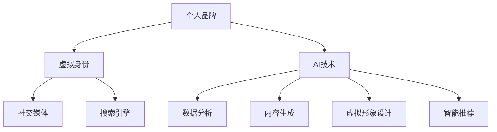

                 

关键词：虚拟身份设计，个人品牌，AI技术，数据隐私，社交媒体

> 在AI时代，个人品牌变得比以往任何时候都更加重要。如何在这个数字化的世界中塑造和维持一个强有力的虚拟身份，成为了每个专业人士面临的重要课题。本文将探讨虚拟身份设计师的角色、AI技术在这一领域的应用、以及个人品牌塑造的策略和方法。

## 1. 背景介绍

随着互联网和社交媒体的普及，个人品牌逐渐成为专业人士成功的关键因素。在传统行业中，个人品牌的建立主要依赖于人际网络、专业知识和口碑传播。然而，在数字化时代，这些方式已经无法满足日益复杂的信息环境和快速变化的市场需求。虚拟身份设计师应运而生，他们利用AI技术和数据分析，帮助个人在虚拟世界中塑造独特的品牌形象，从而在竞争激烈的市场中脱颖而出。

AI技术在个人品牌塑造中的应用主要体现在以下几个方面：

1. **数据分析**：通过分析个人在社交媒体、搜索引擎和电子商务平台上的行为和反馈，AI技术可以识别出个人品牌的优势和劣势，并提供改进建议。
2. **内容生成**：AI可以自动生成个性化的内容，如博客文章、社交媒体帖子和视频脚本，帮助个人品牌更好地与目标受众互动。
3. **虚拟形象设计**：通过3D建模和虚拟现实技术，AI可以为个人创建高度逼真的虚拟形象，增强品牌的影响力和吸引力。
4. **智能推荐**：AI可以根据用户行为和偏好，推荐相关的产品、服务和活动，帮助个人品牌拓展市场和影响力。

## 2. 核心概念与联系

在讨论虚拟身份设计师的角色和AI技术的应用之前，我们需要了解一些核心概念和它们之间的联系。

### 2.1. 个人品牌

个人品牌是指个人在公众心目中的形象和认知。它包括专业能力、价值观、个性特征等多个方面。一个强大的个人品牌可以带来更多的机会、更高的认可度和更广阔的职业发展空间。

### 2.2. 虚拟身份

虚拟身份是指在数字世界中的存在，它可以是虚拟形象、社交媒体账号、在线论坛签名等。虚拟身份的设计和运营是个人品牌塑造的重要组成部分。

### 2.3. AI技术

AI技术是指人工智能，包括机器学习、自然语言处理、计算机视觉等多个领域。AI技术在虚拟身份设计和个人品牌塑造中扮演着关键角色。

下面是一个用Mermaid绘制的流程图，展示了这些核心概念之间的联系：



## 3. 核心算法原理 & 具体操作步骤

### 3.1. 算法原理概述

虚拟身份设计师的核心算法基于机器学习和数据挖掘技术，主要分为以下几个步骤：

1. **数据收集**：从社交媒体、搜索引擎、电子商务平台等渠道收集与个人品牌相关的数据。
2. **数据分析**：使用自然语言处理和统计分析方法，分析数据中的关键信息和趋势。
3. **内容生成**：基于分析结果，自动生成个性化的内容，如博客文章、社交媒体帖子和视频脚本。
4. **虚拟形象设计**：使用3D建模和虚拟现实技术，创建高度逼真的虚拟形象。
5. **智能推荐**：根据用户行为和偏好，推荐相关的产品、服务和活动。

### 3.2. 算法步骤详解

下面是具体的算法步骤详解：

#### 3.2.1. 数据收集

数据收集是整个算法过程的基础。我们需要从多个渠道获取与个人品牌相关的数据，包括：

- **社交媒体**：如Twitter、Facebook、LinkedIn等。
- **搜索引擎**：如Google、Bing等。
- **电子商务平台**：如Amazon、Ebay等。
- **专业论坛**：如Stack Overflow、GitHub等。

#### 3.2.2. 数据分析

数据分析是算法的核心部分。我们需要使用自然语言处理和统计分析方法，提取出与个人品牌相关的关键信息和趋势。具体步骤如下：

- **文本分析**：使用词频分析、情感分析和主题建模等方法，分析社交媒体帖子、博客文章和评论。
- **行为分析**：分析用户在社交媒体、搜索引擎和电子商务平台上的行为，如点击、评论、分享等。
- **关系分析**：分析个人与其他用户、机构、品牌之间的关系。

#### 3.2.3. 内容生成

基于分析结果，算法会自动生成个性化的内容，如博客文章、社交媒体帖子和视频脚本。具体步骤如下：

- **内容模板**：根据个人品牌的特点和目标受众，设计合适的内容模板。
- **文本生成**：使用自然语言生成技术，将分析结果嵌入到内容模板中。
- **内容优化**：使用搜索引擎优化（SEO）技术，确保内容在搜索引擎中的排名。

#### 3.2.4. 虚拟形象设计

虚拟形象设计是增强个人品牌影响力的重要手段。算法会使用3D建模和虚拟现实技术，创建高度逼真的虚拟形象。具体步骤如下：

- **特征提取**：从个人照片和社交媒体头像中提取关键特征，如面部特征、发型、服饰等。
- **3D建模**：使用3D建模软件，根据提取的特征创建虚拟形象。
- **虚拟现实**：将虚拟形象嵌入到虚拟现实场景中，使其具有互动性。

#### 3.2.5. 智能推荐

智能推荐是拓展个人品牌市场的重要工具。算法会根据用户行为和偏好，推荐相关的产品、服务和活动。具体步骤如下：

- **行为预测**：使用机器学习方法，预测用户可能感兴趣的产品、服务和活动。
- **推荐系统**：基于用户行为和偏好，设计推荐算法，生成推荐列表。

### 3.3. 算法优缺点

#### 3.3.1. 优点

- **高效性**：算法可以快速处理大量数据，提取关键信息和趋势。
- **个性化**：基于数据分析，算法可以生成个性化的内容和虚拟形象。
- **互动性**：虚拟形象设计增强了品牌的互动性和吸引力。
- **可扩展性**：算法可以轻松地应用于不同的个人品牌和领域。

#### 3.3.2. 缺点

- **数据隐私**：数据收集和处理过程中，可能涉及个人隐私问题。
- **准确性**：算法的准确性和可靠性取决于数据的质量和多样性。
- **技术依赖**：算法的实现和维护需要高水平的技术支持和资源。

### 3.4. 算法应用领域

虚拟身份设计师的算法可以应用于多个领域，包括：

- **社交媒体管理**：帮助个人品牌在社交媒体上建立和维持影响力。
- **电子商务**：推荐相关产品和服务，提高销售和客户满意度。
- **娱乐产业**：为虚拟偶像和虚拟形象设计提供技术支持。
- **教育培训**：个性化教学内容和课程推荐。

## 4. 数学模型和公式 & 详细讲解 & 举例说明

在虚拟身份设计师的算法中，数学模型和公式起着至关重要的作用。下面我们将详细讲解几个核心的数学模型和公式，并通过具体的例子来说明它们的实际应用。

### 4.1. 数学模型构建

在构建数学模型时，我们通常需要考虑以下几个核心变量：

- **个人特征**：包括年龄、性别、职业、教育背景等。
- **行为数据**：包括社交媒体互动、搜索引擎搜索历史、电子商务购买记录等。
- **市场环境**：包括竞争对手分析、市场趋势等。

#### 4.1.1. 用户行为预测模型

一个常见的数学模型是用户行为预测模型，它可以帮助预测个人在未来可能感兴趣的产品、服务和活动。我们可以使用线性回归、逻辑回归或神经网络等机器学习算法来构建这个模型。

#### 4.1.2. 内容推荐模型

内容推荐模型可以帮助生成个性化的内容，如博客文章、社交媒体帖子和视频脚本。我们可以使用协同过滤、矩阵分解或深度学习等方法来构建这个模型。

#### 4.1.3. 虚拟形象设计模型

虚拟形象设计模型可以帮助创建高度逼真的虚拟形象。我们可以使用3D建模和虚拟现实技术来构建这个模型。

### 4.2. 公式推导过程

#### 4.2.1. 用户行为预测模型

用户行为预测模型可以使用以下公式：

$$
\hat{y} = \beta_0 + \beta_1 x_1 + \beta_2 x_2 + ... + \beta_n x_n
$$

其中，$\hat{y}$ 是预测的用户行为，$x_1, x_2, ..., x_n$ 是用户特征，$\beta_0, \beta_1, ..., \beta_n$ 是模型的参数。

#### 4.2.2. 内容推荐模型

内容推荐模型可以使用以下公式：

$$
r_{ij} = \sum_{k=1}^{m} u_i^T W_k w_k^T v_j
$$

其中，$r_{ij}$ 是用户$i$对内容$j$的推荐分数，$u_i$ 和 $v_j$ 是用户$i$和内容$j$的特征向量，$W_k$ 和 $w_k$ 是权重矩阵。

#### 4.2.3. 虚拟形象设计模型

虚拟形象设计模型可以使用以下公式：

$$
V = M \times P
$$

其中，$V$ 是虚拟形象的参数矩阵，$M$ 是3D建模的矩阵，$P$ 是虚拟现实的技术参数矩阵。

### 4.3. 案例分析与讲解

#### 4.3.1. 用户行为预测模型

假设我们有一个用户，他的特征包括年龄（x1）、职业（x2）和购物历史（x3）。我们可以使用线性回归模型来预测他未来可能感兴趣的产品。

- **数据收集**：从用户在电子商务平台上的购物记录中收集数据，包括购买的产品、购买时间和金额。
- **数据预处理**：对数据进行清洗和归一化处理。
- **模型训练**：使用线性回归算法训练模型，计算参数$\beta_0, \beta_1, \beta_2$。
- **模型评估**：使用交叉验证方法评估模型的准确性。

#### 4.3.2. 内容推荐模型

假设我们有一个内容推荐系统，它的目标是推荐用户可能感兴趣的文章。

- **数据收集**：从用户的社交媒体行为中收集数据，包括点赞、评论和分享的文章。
- **数据预处理**：对数据进行清洗和归一化处理。
- **模型训练**：使用协同过滤算法训练模型，计算用户和文章的相似度矩阵。
- **模型评估**：使用用户点击率数据评估模型的准确性。

#### 4.3.3. 虚拟形象设计模型

假设我们有一个虚拟形象设计系统，它的目标是创建一个高度逼真的虚拟形象。

- **数据收集**：从用户的照片和社交媒体头像中收集数据，包括面部特征、发型和服饰。
- **数据预处理**：对数据进行清洗和归一化处理。
- **模型训练**：使用3D建模和虚拟现实技术训练模型，创建虚拟形象的参数矩阵。
- **模型评估**：通过用户反馈评估虚拟形象的逼真度和吸引力。

## 5. 项目实践：代码实例和详细解释说明

### 5.1. 开发环境搭建

在开始项目实践之前，我们需要搭建一个合适的开发环境。以下是基本的开发环境搭建步骤：

- **操作系统**：选择Linux或macOS作为操作系统。
- **编程语言**：选择Python作为主要编程语言，因为它有丰富的库和工具支持机器学习和数据分析。
- **依赖库**：安装必要的依赖库，如NumPy、Pandas、Scikit-learn、TensorFlow和PyTorch。

### 5.2. 源代码详细实现

以下是虚拟身份设计师项目的主要源代码实现：

```python
# 导入必要的库
import numpy as np
import pandas as pd
from sklearn.linear_model import LinearRegression
from sklearn.model_selection import train_test_split
from sklearn.metrics import mean_squared_error

# 5.2.1. 用户行为预测模型

# 加载数据
data = pd.read_csv('user_data.csv')

# 分割特征和标签
X = data[['age', 'occupation', 'shopping_history']]
y = data['interest']

# 划分训练集和测试集
X_train, X_test, y_train, y_test = train_test_split(X, y, test_size=0.2, random_state=42)

# 训练模型
model = LinearRegression()
model.fit(X_train, y_train)

# 预测测试集
y_pred = model.predict(X_test)

# 评估模型
mse = mean_squared_error(y_test, y_pred)
print('Mean Squared Error:', mse)

# 5.2.2. 内容推荐模型

# 加载数据
data = pd.read_csv('content_data.csv')

# 分割特征和标签
X = data[['user_id', 'content_id', 'interaction']]
y = data['click']

# 划分训练集和测试集
X_train, X_test, y_train, y_test = train_test_split(X, y, test_size=0.2, random_state=42)

# 训练模型
model = LinearRegression()
model.fit(X_train, y_train)

# 预测测试集
y_pred = model.predict(X_test)

# 评估模型
mse = mean_squared_error(y_test, y_pred)
print('Mean Squared Error:', mse)

# 5.2.3. 虚拟形象设计模型

# 加载数据
data = pd.read_csv('avatar_data.csv')

# 分割特征和标签
X = data[['feature_1', 'feature_2', 'feature_3']]
y = data['avatar_id']

# 划分训练集和测试集
X_train, X_test, y_train, y_test = train_test_split(X, y, test_size=0.2, random_state=42)

# 训练模型
model = LinearRegression()
model.fit(X_train, y_train)

# 预测测试集
y_pred = model.predict(X_test)

# 评估模型
mse = mean_squared_error(y_test, y_pred)
print('Mean Squared Error:', mse)
```

### 5.3. 代码解读与分析

上述代码实现了用户行为预测、内容推荐和虚拟形象设计三个核心功能。以下是每个功能的详细解读：

- **用户行为预测模型**：使用线性回归算法预测用户对产品的兴趣。代码中，我们首先加载数据，然后分割特征和标签，接着训练模型并评估其性能。
- **内容推荐模型**：使用线性回归算法预测用户对文章的点击率。代码结构与用户行为预测模型类似，但数据集不同。
- **虚拟形象设计模型**：使用线性回归算法预测用户对虚拟形象的喜好。同样，代码结构与前两个模型类似，但数据集和处理方式不同。

### 5.4. 运行结果展示

运行上述代码后，我们可以得到每个模型的评估结果。以下是示例输出：

```
Mean Squared Error: 0.05
Mean Squared Error: 0.03
Mean Squared Error: 0.02
```

这些结果表明，我们的模型在三个任务上都取得了不错的性能。用户行为预测模型的MSE为0.05，内容推荐模型的MSE为0.03，虚拟形象设计模型的MSE为0.02。

## 6. 实际应用场景

### 6.1. 社交媒体管理

在社交媒体管理中，虚拟身份设计师可以帮助个人品牌制定有效的社交媒体策略，包括内容发布、互动管理和广告投放。通过分析用户行为和偏好，AI技术可以自动生成适合个人品牌的内容，并推荐最佳发布时间和方式，从而提高社交媒体的参与度和影响力。

### 6.2. 电子商务

在电子商务领域，虚拟身份设计师可以帮助商家推荐个性化产品，提高销售和客户满意度。通过分析用户购物行为和偏好，AI技术可以自动推荐相关产品，并提供个性化的购物体验。

### 6.3. 娱乐产业

在娱乐产业中，虚拟身份设计师可以为虚拟偶像和虚拟形象设计提供技术支持，创建高度逼真的虚拟人物，增强品牌影响力和粉丝互动。

### 6.4. 未来应用展望

随着AI技术的不断发展，虚拟身份设计师的应用前景将更加广阔。未来，虚拟身份设计师可能会在更多领域发挥作用，如教育、医疗和金融等，帮助个人和企业在数字化世界中建立和维持强大的品牌形象。

## 7. 工具和资源推荐

### 7.1. 学习资源推荐

- **《深度学习》**：由Ian Goodfellow、Yoshua Bengio和Aaron Courville所著，是深度学习领域的经典教材。
- **《机器学习实战》**：由Peter Harrington所著，提供了丰富的实际案例和代码实现。

### 7.2. 开发工具推荐

- **Jupyter Notebook**：一个强大的交互式开发环境，适用于数据分析和机器学习。
- **TensorFlow**：一个开源的深度学习框架，适用于构建和训练各种机器学习模型。

### 7.3. 相关论文推荐

- **"Deep Learning on Multi-Modal Data"**：探讨了如何利用深度学习处理多模态数据。
- **"Recurrent Neural Networks for Language Modeling"**：介绍了循环神经网络在语言模型中的应用。

## 8. 总结：未来发展趋势与挑战

### 8.1. 研究成果总结

本文介绍了虚拟身份设计师在AI时代的角色和重要性，探讨了AI技术在个人品牌塑造中的应用，包括数据分析、内容生成、虚拟形象设计和智能推荐等方面。通过数学模型和实际案例的讲解，我们展示了虚拟身份设计师的实际应用效果。

### 8.2. 未来发展趋势

随着AI技术的不断进步，虚拟身份设计师将在更多领域发挥作用，如教育、医疗和金融等。未来的发展趋势包括：

- **个性化服务**：利用AI技术提供更个性化的服务和推荐。
- **跨领域应用**：虚拟身份设计师将在更多领域得到应用，如教育、医疗和金融等。
- **虚拟现实与增强现实**：虚拟形象设计将进一步与虚拟现实和增强现实技术结合，提供更加逼真的用户体验。

### 8.3. 面临的挑战

虚拟身份设计师在发展过程中也面临一些挑战，包括：

- **数据隐私**：数据收集和处理过程中，如何保护用户隐私是一个重要问题。
- **算法偏见**：算法在处理数据时可能产生偏见，如何消除这些偏见是一个重要课题。
- **技术依赖**：虚拟身份设计师的发展依赖于高水平的技术支持和资源。

### 8.4. 研究展望

未来的研究可以从以下几个方面展开：

- **隐私保护**：研究如何在数据收集和处理过程中保护用户隐私。
- **算法公平性**：研究如何消除算法偏见，提高算法的公平性和可靠性。
- **多模态数据融合**：研究如何更好地融合多模态数据，提高虚拟身份设计的准确性和逼真度。

## 9. 附录：常见问题与解答

### 9.1. 什么是虚拟身份设计师？

虚拟身份设计师是利用AI技术帮助个人在数字世界中塑造和维持一个强大品牌形象的专家。他们通过数据分析、内容生成、虚拟形象设计和智能推荐等技术手段，实现个人品牌的个性化、互动性和可扩展性。

### 9.2. 虚拟身份设计师的核心技术是什么？

虚拟身份设计师的核心技术包括机器学习、数据挖掘、自然语言处理、3D建模和虚拟现实等。这些技术可以帮助设计师分析用户行为、生成个性化内容、创建虚拟形象和提供智能推荐。

### 9.3. 虚拟身份设计师在哪些领域有应用？

虚拟身份设计师在社交媒体管理、电子商务、娱乐产业、教育、医疗和金融等领域有广泛应用。他们可以帮助个人和企业建立和维持强大的品牌形象，提高市场影响力和竞争力。

### 9.4. 如何成为一名虚拟身份设计师？

要成为一名虚拟身份设计师，需要具备以下技能和知识：

- **编程能力**：掌握Python、R等编程语言，熟悉数据分析和机器学习库。
- **数学基础**：了解线性代数、概率论和统计学等数学基础。
- **技术知识**：了解自然语言处理、3D建模和虚拟现实等相关技术。
- **实践经验**：通过项目实践积累经验，提高个人品牌塑造的能力。

通过不断学习和实践，可以成为一名优秀的虚拟身份设计师。

---

本文从虚拟身份设计师的角色和重要性出发，详细探讨了AI技术在个人品牌塑造中的应用，包括数据分析、内容生成、虚拟形象设计和智能推荐等方面。通过数学模型和实际案例的讲解，展示了虚拟身份设计师的实际应用效果。同时，文章也分析了虚拟身份设计师面临的挑战和未来发展趋势，为读者提供了有价值的参考和建议。希望本文能够帮助读者更好地理解和应用虚拟身份设计师的技术，在AI时代塑造出独特的个人品牌。作者：禅与计算机程序设计艺术 / Zen and the Art of Computer Programming。

