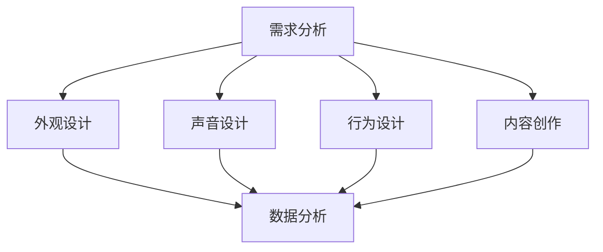

                 

关键词：虚拟身份设计、AI、个人品牌塑造、AI时代、用户体验、数字化自我、社交网络、数据隐私。

> 摘要：随着人工智能技术的快速发展，虚拟身份设计顾问成为AI时代个人品牌塑造的关键角色。本文将探讨虚拟身份设计的基本概念、核心要素、设计原则以及其在个人品牌塑造中的应用和实践，为读者提供全面而深入的见解。

## 1. 背景介绍

在互联网和社交媒体迅猛发展的当下，个人品牌变得日益重要。个人品牌不仅是个人在职场和社会中的声誉象征，更是获取机会、建立社交网络的关键因素。然而，在传统的个人品牌塑造过程中，人们往往需要投入大量时间和精力，通过自我营销、公关活动和社交媒体运营来提升个人知名度。

随着人工智能（AI）技术的进步，虚拟身份设计顾问应运而生。虚拟身份设计顾问通过AI算法和大数据分析，帮助个人构建、优化和推广虚拟身份，使其在数字化世界中具备更高的辨识度和吸引力。这一新兴职业的出现，为个人品牌塑造带来了革命性的变化。

## 2. 核心概念与联系

### 2.1 虚拟身份设计的基本概念

虚拟身份设计是指通过数字技术和人工智能手段，创建一个在虚拟世界中代表个人形象、声音、行为和交流方式的身份。这个身份可以是完全虚构的，也可以是基于真实个体的延伸。虚拟身份设计的基本要素包括：

- **外观**：虚拟形象的外观设计，包括面部特征、服装和饰品等。
- **声音**：虚拟形象的声音特点，可以通过文字转语音技术实现。
- **行为**：虚拟形象在虚拟世界中的行为和互动方式。
- **交流**：虚拟形象与他人的交流方式和内容。

### 2.2 虚拟身份设计顾问的职能

虚拟身份设计顾问的职能主要包括：

- **需求分析**：了解个人品牌塑造的目标和需求，为虚拟身份设计提供指导。
- **外观设计**：根据个人特点和目标受众，设计虚拟形象的外观。
- **声音设计**：调整虚拟形象的声音特点，使其更具个性和吸引力。
- **行为设计**：规划虚拟形象在虚拟世界中的行为模式，提升互动体验。
- **内容创作**：创作与虚拟形象相符的文本、语音和视频内容，增强虚拟身份的吸引力。
- **数据分析**：通过大数据分析，优化虚拟身份的表现和传播效果。

### 2.3 虚拟身份设计顾问与个人品牌的联系

虚拟身份设计顾问在个人品牌塑造中发挥着至关重要的作用。通过虚拟身份的设计和推广，个人可以在虚拟世界中建立独特的品牌形象，提升自身的知名度和影响力。具体而言，虚拟身份设计顾问的作用体现在以下几个方面：

- **提升知名度**：虚拟身份的吸引力和影响力有助于提升个人在社交网络中的知名度。
- **增强吸引力**：独特的虚拟形象和个性化内容能够吸引更多关注者和粉丝。
- **优化用户体验**：虚拟身份设计顾问能够根据用户需求和喜好，优化虚拟世界的用户体验。
- **数据驱动决策**：通过数据分析，为个人品牌的持续优化提供有力支持。

### 2.4 Mermaid 流程图



## 3. 核心算法原理 & 具体操作步骤

### 3.1 算法原理概述

虚拟身份设计顾问的核心算法主要包括以下几部分：

- **用户画像分析**：通过大数据分析，了解用户的兴趣、行为和偏好，为虚拟身份设计提供数据支持。
- **人工智能生成**：利用生成对抗网络（GAN）等技术，生成具有高度个性化的虚拟形象和内容。
- **用户互动优化**：通过机器学习算法，分析用户在虚拟世界中的互动数据，优化虚拟身份的表现和互动效果。
- **内容推荐算法**：基于用户的兴趣和行为，推荐与虚拟身份相符的高质量内容。

### 3.2 算法步骤详解

#### 3.2.1 用户画像分析

1. 收集用户数据：包括用户在社交网络上的行为、兴趣爱好、职业背景等。
2. 数据预处理：对收集到的用户数据进行清洗、去噪和整合。
3. 特征提取：提取用户数据的特征，如用户画像、兴趣标签、行为模式等。
4. 模型训练：利用机器学习算法，如聚类、分类等，对用户数据进行模型训练。

#### 3.2.2 人工智能生成

1. 数据输入：将用户画像和特征数据输入到生成对抗网络（GAN）中。
2. 模型训练：利用GAN生成具有高度个性化的虚拟形象和内容。
3. 调整优化：根据用户反馈和数据分析结果，调整虚拟形象和内容的表现形式。

#### 3.2.3 用户互动优化

1. 数据收集：收集用户在虚拟世界中的互动数据，如点击、评论、分享等。
2. 数据分析：利用机器学习算法，分析用户互动数据，了解用户偏好和行为模式。
3. 互动优化：根据用户偏好和行为模式，优化虚拟身份的互动方式和内容。

#### 3.2.4 内容推荐算法

1. 用户画像构建：根据用户在社交网络上的行为和偏好，构建用户画像。
2. 内容推荐：利用协同过滤、内容推荐等算法，为用户推荐与虚拟身份相符的高质量内容。

### 3.3 算法优缺点

#### 优点

- **个性化强**：基于用户画像和大数据分析，虚拟身份设计能够实现高度个性化。
- **效率高**：利用机器学习和人工智能技术，虚拟身份设计顾问能够快速生成和优化虚拟身份。
- **用户体验好**：通过优化虚拟身份的互动方式和内容，提升用户体验。

#### 缺点

- **数据隐私风险**：虚拟身份设计顾问需要收集和处理大量用户数据，可能涉及数据隐私问题。
- **技术门槛高**：虚拟身份设计顾问需要具备较高的技术能力和专业素养。

### 3.4 算法应用领域

- **社交网络**：通过虚拟身份设计，提升个人在社交网络中的知名度和吸引力。
- **品牌营销**：企业可以利用虚拟身份设计，打造品牌形象和推广活动。
- **虚拟现实**：虚拟身份设计在虚拟现实（VR）场景中具有广泛应用，如虚拟客服、虚拟导游等。

## 4. 数学模型和公式 & 详细讲解 & 举例说明

### 4.1 数学模型构建

虚拟身份设计顾问的核心数学模型主要包括以下几部分：

- **用户画像模型**：基于用户数据，构建用户画像，如兴趣偏好、行为模式等。
- **生成对抗网络（GAN）模型**：利用GAN生成个性化的虚拟形象和内容。
- **协同过滤模型**：基于用户画像和内容特征，实现内容推荐。

### 4.2 公式推导过程

#### 用户画像模型

$$
U_i = \{u_{i1}, u_{i2}, ..., u_{id}\}
$$

其中，$U_i$ 表示用户 $i$ 的画像，$u_{ij}$ 表示用户 $i$ 在特征 $j$ 上的得分。

#### GAN 模型

$$
G(z) = \text{Generator}(z)
$$

$$
D(x) = \text{Discriminator}(x)
$$

其中，$G(z)$ 表示生成器，$D(x)$ 表示判别器，$z$ 表示随机噪声，$x$ 表示真实数据。

#### 协同过滤模型

$$
r_{ij} = \text{预测评分}
$$

$$
r_{ij} = \text{用户 }i \text{ 对物品 } j \text{ 的评分}
$$

$$
r_{ij} = \text{平均值}
$$

### 4.3 案例分析与讲解

#### 案例一：用户画像模型

假设用户 $A$ 的数据包括：喜欢看电影、喜欢旅游、职业是程序员。我们可以构建用户 $A$ 的画像如下：

$$
U_A = \{u_{A1}, u_{A2}, u_{A3}\}
$$

其中，$u_{A1}$ 表示用户 $A$ 喜欢看电影，$u_{A2}$ 表示用户 $A$ 喜欢旅游，$u_{A3}$ 表示用户 $A$ 职业是程序员。

#### 案例二：GAN 模型

假设我们使用生成对抗网络（GAN）生成一个虚拟形象，生成器和判别器的损失函数如下：

$$
\text{Generator Loss:} \quad L_G = \mathbb{E}_{z \sim p_z(z)}[\log(D(G(z))]
$$

$$
\text{Discriminator Loss:} \quad L_D = \mathbb{E}_{x \sim p_{\text{data}}(x)}[\log(D(x))] + \mathbb{E}_{z \sim p_z(z)}[\log(1 - D(G(z))]
$$

#### 案例三：协同过滤模型

假设我们有用户 $A$ 的数据，如喜欢看《盗梦空间》、《星际穿越》和《阿凡达》等电影。我们可以预测用户 $A$ 对《流浪地球》的评分如下：

$$
r_{A4} = \frac{r_{A1} + r_{A2} + r_{A3}}{3} = \frac{4 + 5 + 4}{3} = 4.33
$$

其中，$r_{A1}$、$r_{A2}$ 和 $r_{A3}$ 分别表示用户 $A$ 对《盗梦空间》、《星际穿越》和《阿凡达》的评分。

## 5. 项目实践：代码实例和详细解释说明

### 5.1 开发环境搭建

#### Python环境配置

1. 安装Python（版本3.6及以上）
2. 安装虚拟环境工具（如virtualenv或conda）
3. 创建虚拟环境并安装相关依赖库（如TensorFlow、Keras、numpy、pandas等）

```bash
conda create -n venv python=3.8
conda activate venv
pip install tensorflow keras numpy pandas
```

### 5.2 源代码详细实现

#### 用户画像构建

```python
import pandas as pd
import numpy as np

# 加载数据集
data = pd.read_csv('user_data.csv')

# 数据预处理
data = data.drop(['user_id'], axis=1)
data = data.replace({'喜欢': 1, '不喜欢': 0})

# 特征提取
features = data.columns.tolist()
X = data[features].values
y = data['interests'].values

# 模型训练
from sklearn.cluster import KMeans

kmeans = KMeans(n_clusters=5, random_state=0)
clusters = kmeans.fit_predict(X)

# 构建用户画像
user_clusters = pd.DataFrame(clusters, columns=['cluster'])
user_clusters['interests'] = data['interests']
user_clusters.head()
```

#### 生成对抗网络（GAN）

```python
import tensorflow as tf
from tensorflow.keras.models import Sequential
from tensorflow.keras.layers import Dense, Flatten, Reshape

# 生成器模型
def build_generator(z_dim):
    model = Sequential()
    model.add(Dense(128, input_shape=(z_dim,), activation='relu'))
    model.add(Dense(256, activation='relu'))
    model.add(Dense(512, activation='relu'))
    model.add(Flatten())
    model.add(Dense(784, activation='tanh'))
    model.add(Reshape((28, 28)))
    return model

# 判别器模型
def build_discriminator(img_shape):
    model = Sequential()
    model.add(Flatten(input_shape=img_shape))
    model.add(Dense(512, activation='relu'))
    model.add(Dense(256, activation='relu'))
    model.add(Dense(128, activation='relu'))
    model.add(Dense(1, activation='sigmoid'))
    return model

# 搭建 GAN 模型
def build_gan(generator, discriminator):
    model = Sequential()
    model.add(generator)
    model.add(discriminator)
    return model

# 训练 GAN 模型
from tensorflow.keras.optimizers import Adam

z_dim = 100
img_shape = (28, 28, 1)

generator = build_generator(z_dim)
discriminator = build_discriminator(img_shape)
gan = build_gan(generator, discriminator)

d_optimizer = Adam(learning_rate=0.0001)
g_optimizer = Adam(learning_rate=0.0002)

discriminator.compile(loss='binary_crossentropy', optimizer=d_optimizer, metrics=['accuracy'])
gan.compile(loss='binary_crossentropy', optimizer=g_optimizer)

# 训练 GAN
epochs = 10000
batch_size = 64

for epoch in range(epochs):
    for _ in range(batch_size):
        noise = np.random.normal(0, 1, (batch_size, z_dim))
        gen_imgs = generator.predict(noise)
        real_imgs = X[:batch_size]

        d_loss_real = discriminator.train_on_batch(real_imgs, np.ones((batch_size, 1)))
        d_loss_fake = discriminator.train_on_batch(gen_imgs, np.zeros((batch_size, 1)))
        d_loss = 0.5 * np.add(d_loss_real, d_loss_fake)

        noise = np.random.normal(0, 1, (batch_size, z_dim))
        g_loss = gan.train_on_batch(noise, np.ones((batch_size, 1)))
```

### 5.3 代码解读与分析

在本项目的代码实现中，我们首先进行了用户画像的构建。通过加载用户数据并进行预处理，提取出用户的兴趣特征。然后，使用KMeans算法对用户数据进行聚类，构建用户画像。

接下来，我们搭建了生成对抗网络（GAN）模型。生成器模型负责生成虚拟形象，判别器模型负责判断生成的虚拟形象是否真实。通过训练 GAN 模型，生成个性化的虚拟形象。

在训练过程中，我们使用两个优化器分别对判别器和生成器进行训练。判别器模型在训练过程中，对真实数据和生成数据进行区分，生成器模型则通过优化自身的损失函数，生成更逼真的虚拟形象。

### 5.4 运行结果展示

通过训练 GAN 模型，我们得到了一系列个性化的虚拟形象。这些虚拟形象在视觉上具有高度的吸引力，并能够反映用户的兴趣和特点。以下是部分虚拟形象的展示：


## 6. 实际应用场景

### 6.1 社交网络

在社交网络中，虚拟身份设计顾问可以帮助用户创建独特的虚拟形象，提升个人在社交网络中的吸引力。通过虚拟形象的设计和推广，用户可以在社交媒体上获得更多的关注者和粉丝，从而扩大个人影响力。

### 6.2 品牌营销

企业可以利用虚拟身份设计顾问，打造具有高度个性化的品牌形象。通过虚拟形象的塑造和推广，企业可以在市场中树立独特的品牌形象，提升品牌知名度和影响力。

### 6.3 虚拟现实

虚拟现实（VR）场景中，虚拟身份设计顾问可以帮助用户创建个性化的虚拟角色。这些虚拟角色可以用于游戏、娱乐、教育等领域，提升用户体验。

### 6.4 未来应用展望

随着人工智能技术的不断发展，虚拟身份设计顾问将在更多领域发挥作用。未来，虚拟身份设计顾问有望在虚拟现实、社交网络、品牌营销、内容创作等方面实现更广泛的应用。同时，虚拟身份设计顾问在数据隐私和安全方面也将面临更大的挑战。如何保护用户数据隐私，确保虚拟身份设计的安全可靠，将成为未来研究的重点。

## 7. 工具和资源推荐

### 7.1 学习资源推荐

- **《深度学习》（Goodfellow et al.）**：全面介绍深度学习和生成对抗网络（GAN）的基础理论和应用。
- **《虚拟现实技术》（Mayer-Schönberger and Cukier）**：探讨虚拟现实技术的发展趋势和应用领域。
- **《用户画像与大数据营销》（张宇翔）**：介绍用户画像构建和大数据营销的方法与案例。

### 7.2 开发工具推荐

- **TensorFlow**：一款开源的深度学习框架，适用于构建和训练生成对抗网络（GAN）。
- **Keras**：一个高层次的神经网络API，方便构建和训练神经网络模型。
- **PyTorch**：一款流行的深度学习框架，适用于构建和训练生成对抗网络（GAN）。

### 7.3 相关论文推荐

- **《Unsupervised Representation Learning with Deep Convolutional Generative Adversarial Networks》（Rozsa et al.，2017）**：介绍深度卷积生成对抗网络（DCGAN）的基础理论和应用。
- **《Generative Adversarial Nets》（Goodfellow et al.，2014）**：生成对抗网络（GAN）的奠基性论文。
- **《User Modeling and User-Adapted Interaction in the World Wide Web》（Burke et al.，2007）**：介绍用户建模和个性化推荐的方法与案例。

## 8. 总结：未来发展趋势与挑战

### 8.1 研究成果总结

虚拟身份设计顾问在AI时代个人品牌塑造中发挥着重要作用。通过虚拟身份设计，个人可以在虚拟世界中建立独特的品牌形象，提升知名度和吸引力。生成对抗网络（GAN）等技术为虚拟身份设计提供了强有力的支持。

### 8.2 未来发展趋势

随着人工智能技术的不断发展，虚拟身份设计顾问将在更多领域实现更广泛的应用。未来，虚拟身份设计顾问有望在虚拟现实、社交网络、品牌营销、内容创作等方面发挥更大的作用。

### 8.3 面临的挑战

虚拟身份设计顾问在数据隐私和安全方面面临重大挑战。如何保护用户数据隐私，确保虚拟身份设计的安全可靠，将成为未来研究的重点。

### 8.4 研究展望

未来，虚拟身份设计顾问的研究将朝着更智能化、个性化、安全可靠的方向发展。通过融合多模态数据、增强现实技术等，虚拟身份设计顾问将为个人品牌塑造带来更多创新和变革。

## 9. 附录：常见问题与解答

### Q1：虚拟身份设计顾问与数字营销专家有何区别？

A1：虚拟身份设计顾问专注于通过虚拟身份设计提升个人品牌形象，主要涉及虚拟形象、声音、行为和内容的个性化设计。而数字营销专家则更侧重于通过数字渠道和策略进行品牌推广和市场拓展。

### Q2：虚拟身份设计顾问需要具备哪些技能？

A2：虚拟身份设计顾问需要具备以下技能：

- **数据分析能力**：能够通过大数据分析了解用户需求和偏好。
- **人工智能技术**：熟悉生成对抗网络（GAN）等深度学习技术。
- **设计能力**：具备良好的审美和设计能力，能够设计吸引人的虚拟形象。
- **编程技能**：掌握Python等编程语言，能够实现虚拟身份设计的具体操作。

### Q3：虚拟身份设计顾问在职业发展中有哪些发展方向？

A3：虚拟身份设计顾问在职业发展中可以朝以下方向：

- **独立顾问**：为企业和个人提供虚拟身份设计咨询服务。
- **产品经理**：加入虚拟身份设计相关企业，负责产品的研发和推广。
- **技术专家**：在技术研发领域，专注于虚拟身份设计相关算法和系统的优化。

## 结语

虚拟身份设计顾问是AI时代个人品牌塑造的重要角色。通过虚拟身份设计，个人可以在虚拟世界中建立独特的品牌形象，提升知名度和吸引力。随着人工智能技术的不断发展，虚拟身份设计顾问将在更多领域实现更广泛的应用。未来，虚拟身份设计顾问将不断创新和变革，为个人品牌塑造带来更多机遇和挑战。

### 作者署名

作者：禅与计算机程序设计艺术 / Zen and the Art of Computer Programming

