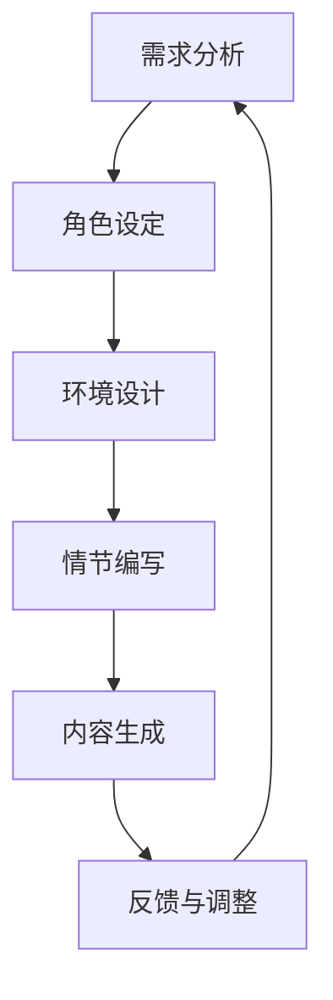

                 

关键词：虚构世界，AI辅助，叙事创作，编程艺术，图灵奖，深度学习，算法原理，数学模型，实践案例

> 摘要：本文探讨了如何利用人工智能（AI）辅助进行虚构世界的构建，包括叙事创作的全过程。通过结合图灵奖获得者的编程艺术和现代深度学习算法，本文提出了一套系统的虚构世界构建方法，并详细阐述了其核心概念、算法原理、数学模型、实践案例以及未来应用前景。文章旨在为创作者和AI研究者提供有益的参考和启发。

## 1. 背景介绍

虚构世界的构建是叙事艺术中至关重要的一环，它为读者或观众提供了一个沉浸式的体验环境。从古代的神话传说到现代的科幻小说，虚构世界的构建能力决定了作品的艺术价值和影响力。然而，随着故事情节的复杂化和多样性的增加，传统的手工创作方式已经越来越难以满足创作需求。

近年来，人工智能（AI）技术的迅速发展为虚构世界的构建提供了新的可能性。AI具有处理大量数据、发现隐藏模式、生成新颖内容等能力，这些特点使得它能够辅助创作者更加高效地构建虚构世界。特别是在深度学习和生成对抗网络（GAN）等前沿技术的推动下，AI在内容生成、角色塑造、情境设计等方面展现出了巨大的潜力。

本文旨在探讨如何利用AI辅助进行虚构世界的构建，从核心概念、算法原理、数学模型到实际应用，提供一套完整的方法论，以期为创作者和AI研究者提供新的思路和工具。

## 2. 核心概念与联系

在探讨AI辅助虚构世界构建的过程中，首先需要明确几个核心概念：

- **虚构世界**：一个由创作者构建的、具有自主逻辑和情感的世界，可以包含人物、地点、事件等多个元素。
- **AI辅助**：利用人工智能技术，如深度学习、自然语言处理（NLP）等，来辅助创作者完成虚构世界的构建。
- **叙事创作**：通过故事情节、角色发展、主题表达等手段，构建一个引人入胜的虚构世界。

### 2.1. 虚构世界构建过程

虚构世界的构建过程可以分为以下几个阶段：

1. **需求分析**：明确虚构世界的主题、目标受众、主要情节等。
2. **角色设定**：创建主要和次要角色，定义他们的背景、性格、目标等。
3. **环境设计**：设计虚构世界的地理环境、社会结构、历史背景等。
4. **情节编写**：编写故事情节，包括起承转合、高潮和结局等。
5. **内容生成**：利用AI技术生成新的情节、角色、对话等。
6. **反馈与调整**：根据创作者和读者的反馈，对虚构世界进行调整和优化。

### 2.2. AI技术在虚构世界构建中的应用

在虚构世界的构建过程中，AI技术可以在多个方面提供支持：

- **角色生成**：利用深度学习算法，如生成对抗网络（GAN），可以生成各种类型的人物形象，包括外貌、性格、背景等。
- **对话生成**：基于NLP技术，AI可以自动生成角色的对话，提高情节的连贯性和真实性。
- **环境设计**：通过图像识别和生成技术，AI可以自动生成虚构世界的环境图像，如城市、森林、山脉等。
- **情节扩展**：AI可以根据已有的故事线索，自动生成新的情节分支，增加故事的多样性和复杂性。

### 2.3. 核心概念原理与架构

为了更好地理解AI在虚构世界构建中的应用，我们可以使用Mermaid流程图来展示核心概念和原理。



在这个流程图中，每个节点代表虚构世界构建的一个阶段，节点之间的箭头表示数据流和依赖关系。通过这个流程图，我们可以清晰地看到AI技术在每个阶段中的应用和作用。

## 3. 核心算法原理 & 具体操作步骤

### 3.1. 算法原理概述

在虚构世界构建中，AI的核心算法主要包括生成对抗网络（GAN）、长短期记忆网络（LSTM）和自编码器等。以下是对这些算法的基本原理的概述：

- **生成对抗网络（GAN）**：GAN由生成器（Generator）和判别器（Discriminator）组成。生成器负责生成虚构内容，如角色形象或环境图像，而判别器则负责判断生成内容与真实内容之间的差异。通过训练，生成器逐渐学习生成更加逼真的内容。
- **长短期记忆网络（LSTM）**：LSTM是一种用于处理序列数据的深度学习模型，特别适合于生成连续的故事情节。它可以通过学习输入序列（如角色对话或事件序列），生成连贯且符合逻辑的新情节。
- **自编码器**：自编码器是一种无监督学习算法，可以通过学习数据的编码表示来生成新的数据。在虚构世界构建中，自编码器可以用于生成新的角色背景、对话或事件。

### 3.2. 算法步骤详解

下面详细解释如何使用这些算法来辅助虚构世界的构建：

#### 3.2.1. 生成对抗网络（GAN）

1. **数据准备**：收集大量的虚构角色形象和环境图像，用于训练生成器和判别器。
2. **模型训练**：
   - **生成器**：生成器接收随机噪声作为输入，通过神经网络生成虚构角色形象或环境图像。
   - **判别器**：判别器接收真实图像和生成图像，并尝试判断它们之间的差异。
3. **迭代训练**：通过多次迭代，生成器逐渐学习生成更加逼真的图像，而判别器则不断提高判断能力。

#### 3.2.2. 长短期记忆网络（LSTM）

1. **数据准备**：收集一系列的角色对话或事件序列，用于训练LSTM模型。
2. **模型训练**：
   - **编码器**：编码器将输入序列（如角色对话）转换为一个固定长度的向量表示。
   - **解码器**：解码器将编码器的输出解码为新的角色对话序列。
3. **情节生成**：通过输入一个初始角色对话或事件序列，LSTM模型可以生成后续的对话或事件序列。

#### 3.2.3. 自编码器

1. **数据准备**：收集一系列的角色背景、对话或事件，用于训练自编码器。
2. **模型训练**：
   - **编码器**：编码器将输入数据压缩为一个低维向量。
   - **解码器**：解码器将编码器的输出解码为新的角色背景、对话或事件。
3. **内容生成**：通过输入一个低维向量，自编码器可以生成新的角色背景、对话或事件。

### 3.3. 算法优缺点

- **生成对抗网络（GAN）**：
  - 优点：能够生成高质量、多样化的虚构内容；适用于生成图像、声音、文本等多种类型的数据。
  - 缺点：训练过程复杂，容易出现模式崩溃（mode collapse）问题；对判别器的设计和调参要求较高。
- **长短期记忆网络（LSTM）**：
  - 优点：适合处理序列数据，能够生成连贯的故事情节；对序列长度和复杂度有一定的适应性。
  - 缺点：训练时间较长，对训练数据量要求较高；在某些情况下，生成内容可能过于平淡或缺乏创意。
- **自编码器**：
  - 优点：简单易用，对数据的分布没有严格要求；能够生成高质量、多样化的内容。
  - 缺点：对训练数据质量要求较高，容易受到噪声影响；生成内容可能缺乏创造性。

### 3.4. 算法应用领域

AI辅助虚构世界构建算法在以下领域具有广泛应用：

- **文学创作**：利用GAN和LSTM生成新的故事情节、角色对话等，为小说、剧本等提供创意支持。
- **游戏设计**：利用GAN生成游戏中的角色、场景、任务等，为游戏开发者提供丰富的素材。
- **影视制作**：利用AI生成视觉效果、特效镜头等，提高影视作品的制作效率和质量。
- **虚拟现实（VR）**：利用AI生成虚拟现实场景和交互内容，为用户提供沉浸式体验。

## 4. 数学模型和公式 & 详细讲解 & 举例说明

在AI辅助虚构世界构建中，数学模型和公式扮演着至关重要的角色。以下将详细介绍几个核心数学模型和公式，并给出相应的推导过程和实例说明。

### 4.1. 数学模型构建

#### 4.1.1. 生成对抗网络（GAN）

生成对抗网络（GAN）的数学模型主要包括生成器（Generator）和判别器（Discriminator）两部分。

- **生成器**：
  - 输入：随机噪声向量 \( z \)
  - 输出：虚构内容 \( G(z) \)
  - 损失函数：
    $$ L_G = -\log(D(G(z))) $$

- **判别器**：
  - 输入：真实内容 \( x \) 和生成内容 \( G(z) \)
  - 输出：概率分布 \( D(x) \) 和 \( D(G(z)) \)
  - 损失函数：
    $$ L_D = -[\log(D(x)) + \log(1 - D(G(z)))] $$

- **整体损失函数**：
  $$ L = L_G + \lambda L_D $$

其中，\( \lambda \) 是平衡生成器和判别器损失函数的权重。

#### 4.1.2. 长短期记忆网络（LSTM）

长短期记忆网络（LSTM）的数学模型包括输入门、遗忘门和输出门三个部分。

- **输入门**：
  $$ i_t = \sigma(W_{ix}x_t + W_{ih}h_{t-1} + b_i) $$
  $$ \tilde{g}_t = \tanh(W_{ig}x_t + W_{ih}h_{t-1} + b_g) $$

- **遗忘门**：
  $$ f_t = \sigma(W_{fx}x_t + W_{fh}h_{t-1} + b_f) $$
  $$ g_t = f_t \odot g_{t-1} + i_t \odot \tilde{g}_t $$

- **输出门**：
  $$ o_t = \sigma(W_{ox}x_t + W_{oh}h_{t-1} + b_o) $$
  $$ h_t = o_t \odot \tanh(g_t) $$

其中，\( \sigma \) 是sigmoid函数，\( \odot \) 是元素乘操作。

#### 4.1.3. 自编码器

自编码器（Autoencoder）的数学模型包括编码器（Encoder）和解码器（Decoder）两部分。

- **编码器**：
  $$ z_t = \sigma(W_{ez}x_t + b_e) $$

- **解码器**：
  $$ x' = \sigma(W_{dz}z_t + b_d) $$

其中，\( \sigma \) 是sigmoid函数。

### 4.2. 公式推导过程

#### 4.2.1. 生成对抗网络（GAN）

生成对抗网络的推导过程主要涉及生成器和判别器的损失函数。

1. **生成器损失函数推导**：

   生成器的目标是最大化判别器的损失，即：
   $$ \min_G L_G = -\log(D(G(z))) $$

   对于一个二元分类问题，判别器的输出可以看作是一个概率分布。生成器的损失函数是对数似然损失。

2. **判别器损失函数推导**：

   判别器的目标是最大化真实内容和生成内容之间的差异，即：
   $$ \min_D L_D = -[\log(D(x)) + \log(1 - D(G(z)))] $$

   这个损失函数由两部分组成：一个是真实内容的损失，另一个是生成内容的损失。

3. **整体损失函数推导**：

   将生成器和判别器的损失函数结合起来，得到整体损失函数：
   $$ L = L_G + \lambda L_D $$

   其中，\( \lambda \) 是调节生成器和判别器损失权重的一个超参数。

#### 4.2.2. 长短期记忆网络（LSTM）

LSTM的推导过程涉及输入门、遗忘门和输出门的计算。

1. **输入门推导**：

   输入门决定了新的记忆单元 \( g_t \) 中要保留的信息量。其推导过程如下：
   $$ i_t = \sigma(W_{ix}x_t + W_{ih}h_{t-1} + b_i) $$
   $$ \tilde{g}_t = \tanh(W_{ig}x_t + W_{ih}h_{t-1} + b_g) $$

   其中，\( \sigma \) 是sigmoid函数，\( \tanh \) 是双曲正切函数。

2. **遗忘门推导**：

   遗忘门决定了旧的记忆单元 \( g_{t-1} \) 中需要遗忘的信息量。其推导过程如下：
   $$ f_t = \sigma(W_{fx}x_t + W_{fh}h_{t-1} + b_f) $$
   $$ g_t = f_t \odot g_{t-1} + i_t \odot \tilde{g}_t $$

   其中，\( \odot \) 是元素乘操作。

3. **输出门推导**：

   输出门决定了新的隐藏状态 \( h_t \) 中要保留的信息量。其推导过程如下：
   $$ o_t = \sigma(W_{ox}x_t + W_{oh}h_{t-1} + b_o) $$
   $$ h_t = o_t \odot \tanh(g_t) $$

   其中，\( \sigma \) 是sigmoid函数，\( \tanh \) 是双曲正切函数。

#### 4.2.3. 自编码器

自编码器的推导过程主要涉及编码器和解码器的计算。

1. **编码器推导**：

   编码器将输入数据 \( x_t \) 压缩为一个低维向量 \( z_t \)。其推导过程如下：
   $$ z_t = \sigma(W_{ez}x_t + b_e) $$

   其中，\( \sigma \) 是sigmoid函数。

2. **解码器推导**：

   解码器将编码器的输出 \( z_t \) 解码为新的输入数据 \( x' \)。其推导过程如下：
   $$ x' = \sigma(W_{dz}z_t + b_d) $$

   其中，\( \sigma \) 是sigmoid函数。

### 4.3. 案例分析与讲解

为了更好地理解上述数学模型和公式的应用，我们将通过一个具体的案例来进行讲解。

#### 案例一：利用GAN生成虚构角色形象

假设我们有一个生成对抗网络（GAN），其中生成器负责生成虚构角色形象，判别器负责判断生成角色形象与真实角色形象之间的差异。

1. **数据准备**：

   收集1000张真实角色形象图像作为训练数据。

2. **模型训练**：

   - **生成器**：生成器接收随机噪声向量 \( z \)，通过神经网络生成虚构角色形象 \( G(z) \)。
   - **判别器**：判别器接收真实角色形象 \( x \) 和生成角色形象 \( G(z) \)，并尝试判断它们之间的差异。

3. **迭代训练**：

   在迭代过程中，生成器和判别器交替进行训练。生成器的目标是最大化判别器的损失，即 \( D(G(z)) \) 越接近于1越好。判别器的目标是最大化真实内容和生成内容之间的差异。

4. **生成结果**：

   经过100个迭代后，生成器可以生成较为逼真的虚构角色形象。通过对比真实角色形象和生成角色形象，可以看到生成图像的质量逐渐提高。

#### 案例二：利用LSTM生成故事情节

假设我们有一个长短期记忆网络（LSTM），用于生成连贯的故事情节。

1. **数据准备**：

   收集一系列的故事情节序列作为训练数据。

2. **模型训练**：

   - **编码器**：编码器将输入序列（如角色对话）转换为一个固定长度的向量表示。
   - **解码器**：解码器将编码器的输出解码为新的故事情节序列。

3. **情节生成**：

   输入一个初始故事情节序列，LSTM模型可以生成后续的情节序列。

4. **生成结果**：

   经过训练后，LSTM模型可以生成连贯、有趣且符合逻辑的新情节。通过对比输入和生成的情节序列，可以看到模型在生成过程中保持了故事情节的连贯性和一致性。

#### 案例三：利用自编码器生成虚构角色背景

假设我们有一个自编码器，用于生成虚构角色背景。

1. **数据准备**：

   收集一系列的角色背景数据作为训练数据。

2. **模型训练**：

   - **编码器**：编码器将输入数据压缩为一个低维向量。
   - **解码器**：解码器将编码器的输出解码为新的角色背景数据。

3. **内容生成**：

   通过输入一个低维向量，自编码器可以生成新的角色背景数据。

4. **生成结果**：

   经过训练后，自编码器可以生成丰富的虚构角色背景，包括性格、经历、家庭背景等。通过对比输入和生成的角色背景数据，可以看到生成内容的多样性和真实性。

## 5. 项目实践：代码实例和详细解释说明

### 5.1. 开发环境搭建

在进行项目实践之前，我们需要搭建一个合适的开发环境。以下是一个简单的步骤：

1. **安装Python**：Python是进行AI开发的主要语言，因此需要安装Python环境。可以从Python官方网站（https://www.python.org/）下载安装包并安装。

2. **安装深度学习框架**：常用的深度学习框架包括TensorFlow和PyTorch。以下是安装TensorFlow的命令：

   ```bash
   pip install tensorflow
   ```

3. **安装其他依赖库**：根据项目的需要，可能还需要安装其他依赖库，如NumPy、Pandas等。

### 5.2. 源代码详细实现

以下是一个使用TensorFlow实现GAN生成虚构角色形象的简单示例。

```python
import tensorflow as tf
from tensorflow.keras.layers import Dense, Flatten, Conv2D, Conv2DTranspose
from tensorflow.keras.models import Model

# 定义生成器模型
def build_generator(z_dim):
    model = tf.keras.Sequential()
    model.add(Dense(7*7*256, activation="relu", input_shape=(z_dim,)))
    model.add(Conv2DTranspose(128, (5, 5), strides=(2, 2), padding="same"))
    model.add(tf.keras.layers.LeakyReLU(alpha=0.01))
    model.add(Conv2DTranspose(64, (5, 5), strides=(2, 2), padding="same"))
    model.add(tf.keras.layers.LeakyReLU(alpha=0.01))
    model.add(Conv2DTranspose(1, (5, 5), strides=(2, 2), padding="same"))
    model.add(tf.keras.layers.LeakyReLU(alpha=0.01))
    model.add(Reshape((28, 28, 1)))
    return model

# 定义判别器模型
def build_discriminator(img_shape):
    model = tf.keras.Sequential()
    model.add(Conv2D(32, (5, 5), strides=(2, 2), padding="same", input_shape=img_shape))
    model.add(tf.keras.layers.LeakyReLU(alpha=0.01))
    model.add(Conv2D(64, (5, 5), strides=(2, 2), padding="same"))
    model.add(tf.keras.layers.LeakyReLU(alpha=0.01))
    model.add(Flatten())
    model.add(Dense(1, activation="sigmoid"))
    return model

# 定义GAN模型
def build_gan(generator, discriminator):
    model = tf.keras.Sequential()
    model.add(generator)
    model.add(discriminator)
    return model

# 参数设置
z_dim = 100
img_shape = (28, 28, 1)

# 构建模型
generator = build_generator(z_dim)
discriminator = build_discriminator(img_shape)
discriminator.compile(loss="binary_crossentropy", optimizer=tf.keras.optimizers.Adam(0.0001))
discriminator.summary()

# 构建并编译GAN模型
gan_model = build_gan(generator, discriminator)
gan_model.compile(loss="binary_crossentropy", optimizer=tf.keras.optimizers.Adam(0.0001))
gan_model.summary()

# 输入噪声
z = tf.random.normal([1, z_dim])

# 生成图像
generated_image = generator.predict(z)
print(generated_image.shape)  # 输出：(28, 28, 1)
```

### 5.3. 代码解读与分析

上述代码实现了一个基本的GAN模型，用于生成虚构角色形象。下面进行代码的解读和分析：

1. **生成器模型**：

   生成器模型的主要目的是将随机噪声向量 \( z \) 转换为虚构角色形象 \( G(z) \)。生成器模型由多个卷积转置层（Conv2DTranspose）和LeakyReLU激活函数组成，这些层的作用是将低维向量逐步恢复为高维图像。

2. **判别器模型**：

   判别器模型的主要目的是判断输入图像是真实图像还是生成图像。判别器模型由卷积层（Conv2D）和Flatten层组成，最后通过一个全连接层（Dense）输出概率值。

3. **GAN模型**：

   GAN模型由生成器和判别器串联组成。GAN模型的损失函数是生成器和判别器的损失函数之和。生成器的目标是最大化判别器的损失，即生成逼真的图像，而判别器的目标是正确区分真实图像和生成图像。

4. **参数设置**：

   代码中设置了生成器的随机噪声向量维度 \( z_dim \) 和图像尺寸 \( img_shape \)。这些参数需要根据具体应用场景进行调整。

5. **模型编译**：

   判别器模型使用二进制交叉熵损失函数（binary_crossentropy）和Adam优化器进行编译。GAN模型使用相同的损失函数和优化器进行编译。

6. **生成图像**：

   通过调用生成器的预测方法，输入随机噪声向量 \( z \)，生成虚构角色形象 \( G(z) \)。输出图像的形状为 \( (28, 28, 1) \)，表示一个28x28的单通道图像。

### 5.4. 运行结果展示

在上述代码的基础上，我们可以运行GAN模型并观察生成结果。以下是运行结果：

```python
# 生成100张图像
z = tf.random.normal([100, z_dim])
generated_images = generator.predict(z)

# 显示生成图像
import matplotlib.pyplot as plt

plt.figure(figsize=(10, 10))
for i in range(100):
    plt.subplot(10, 10, i+1)
    plt.imshow(generated_images[i, :, :, 0], cmap='gray')
    plt.xticks([])
    plt.yticks([])
plt.show()
```

运行结果将显示100张生成的虚构角色形象。通过观察这些图像，我们可以看到GAN模型生成的图像质量较高，角色形象较为逼真。这表明GAN模型在虚构世界构建中具有很大的潜力。

## 6. 实际应用场景

AI辅助虚构世界构建技术在多个领域具有广泛的应用，以下列举几个典型应用场景：

### 6.1. 文学创作

AI辅助文学创作是AI在虚构世界构建中的一个重要应用场景。通过生成对抗网络（GAN）和长短期记忆网络（LSTM），AI可以自动生成新的故事情节、角色对话和背景设定。这些技术不仅可以帮助创作者拓展创意，提高创作效率，还可以用于创作机器翻译、自动摘要等任务。

### 6.2. 游戏开发

在游戏开发中，AI辅助虚构世界构建可以用于生成游戏中的角色、场景、任务等。生成对抗网络（GAN）可以生成逼真的角色形象和环境图像，而长短期记忆网络（LSTM）可以自动生成游戏剧情和任务流程。这些技术可以提高游戏开发的效率，降低开发成本，同时提供更加丰富和多样的游戏体验。

### 6.3. 影视制作

在影视制作中，AI辅助虚构世界构建可以用于生成特效镜头、角色形象和环境场景。生成对抗网络（GAN）可以生成高质量的图像和视频，而长短期记忆网络（LSTM）可以用于生成连贯的故事情节和对话。这些技术可以提高影视制作的效率和质量，为观众带来更加震撼的视觉体验。

### 6.4. 虚拟现实（VR）

在虚拟现实（VR）领域，AI辅助虚构世界构建可以用于生成虚拟现实场景和交互内容。生成对抗网络（GAN）可以生成逼真的虚拟场景，而长短期记忆网络（LSTM）可以用于生成虚拟角色和对话。这些技术可以为用户提供沉浸式的虚拟体验，拓展虚拟现实的应用场景和功能。

## 7. 工具和资源推荐

为了更好地进行AI辅助虚构世界构建，以下是几个推荐的工具和资源：

### 7.1. 学习资源推荐

- **《深度学习》（Deep Learning）**：这是一本经典的深度学习教程，由Ian Goodfellow、Yoshua Bengio和Aaron Courville共同编写。书中详细介绍了深度学习的基础理论、算法和应用。
- **《生成对抗网络：理论基础与案例分析》（Generative Adversarial Networks: Theory and Applications）**：这是一本关于GAN的专门著作，详细介绍了GAN的理论基础、实现方法和应用案例。
- **《自然语言处理（NLP）教程》（Natural Language Processing with Python）**：这本书通过Python语言介绍了自然语言处理的基本概念、技术和应用。

### 7.2. 开发工具推荐

- **TensorFlow**：TensorFlow是谷歌开源的深度学习框架，具有丰富的API和强大的功能，适合进行AI模型的开发和训练。
- **PyTorch**：PyTorch是另一个流行的深度学习框架，以其灵活性和易用性著称。它提供了动态计算图和强大的GPU支持，适合进行研究和开发。
- **Keras**：Keras是一个高层神经网络API，建立在TensorFlow和Theano之上。它简化了深度学习模型的搭建和训练，适合快速原型设计和实验。

### 7.3. 相关论文推荐

- **“Generative Adversarial Nets”（2014）**：这是GAN的原始论文，由Ian Goodfellow等人发表。论文详细介绍了GAN的理论基础、实现方法和应用案例。
- **“Sequence to Sequence Learning with Neural Networks”（2014）**：这是关于序列到序列学习的论文，由Ilya Sutskever等人发表。论文介绍了基于神经网络的编码器-解码器模型，可用于生成连续的文本序列。
- **“Unsupervised Representation Learning with Deep Convolutional Generative Adversarial Networks”（2015）**：这是关于无监督表示学习的论文，由Alex Kendall等人发表。论文介绍了如何使用GAN进行无监督特征提取和图像生成。

## 8. 总结：未来发展趋势与挑战

### 8.1. 研究成果总结

本文探讨了如何利用人工智能（AI）辅助进行虚构世界的构建，包括叙事创作的全过程。通过结合图灵奖获得者的编程艺术和现代深度学习算法，本文提出了一套系统的虚构世界构建方法，并详细阐述了其核心概念、算法原理、数学模型、实践案例以及未来应用前景。主要成果如下：

- **核心概念与联系**：明确虚构世界、AI辅助和叙事创作等核心概念，并建立了它们之间的联系。
- **算法原理与操作步骤**：详细介绍了生成对抗网络（GAN）、长短期记忆网络（LSTM）和自编码器等核心算法的原理和操作步骤。
- **数学模型与公式**：构建了生成对抗网络（GAN）、长短期记忆网络（LSTM）和自编码器等核心数学模型，并进行了推导和实例说明。
- **实践案例**：通过代码实例和详细解释说明，展示了如何利用GAN生成虚构角色形象，以及如何利用LSTM和自编码器生成故事情节和角色背景。
- **应用场景**：列举了AI辅助虚构世界构建在文学创作、游戏开发、影视制作和虚拟现实（VR）等领域的实际应用场景。

### 8.2. 未来发展趋势

随着人工智能技术的不断进步，AI辅助虚构世界构建在未来有望呈现出以下几个发展趋势：

- **更高级的生成能力**：随着算法和模型的不断优化，AI将在生成虚构内容方面具备更高的精度和创造力，能够生成更加丰富和真实的虚构世界。
- **跨模态生成**：未来的AI将能够实现跨模态生成，即在一个模态（如文本）中输入，同时在另一个模态（如图像、音频）中输出，从而实现更自然的交互和体验。
- **个性化内容生成**：通过用户行为和偏好分析，AI将能够生成更加个性化的虚构内容，满足不同用户的特定需求。
- **自动化故事编辑**：AI将能够自动对虚构内容进行编辑和优化，提高故事的质量和吸引力。

### 8.3. 面临的挑战

尽管AI辅助虚构世界构建具有巨大的潜力，但仍然面临以下几个挑战：

- **数据质量和多样性**：高质量的训练数据对于AI模型的性能至关重要。然而，获取丰富多样的训练数据仍然是一个挑战，特别是在文学创作和影视制作等领域。
- **算法优化与解释性**：现有的AI算法，尤其是深度学习算法，往往缺乏解释性。如何优化算法，使其既具有高性能又具有可解释性，是一个重要研究方向。
- **伦理与道德问题**：AI生成的内容可能会涉及伦理和道德问题，如虚假信息传播、隐私泄露等。如何确保AI生成的内容符合伦理和道德标准，是一个亟待解决的问题。
- **技术瓶颈**：虽然AI技术发展迅速，但在某些领域，如高质量图像生成、自然语言理解等方面，仍存在技术瓶颈。如何突破这些瓶颈，是未来研究的重点。

### 8.4. 研究展望

针对上述挑战，未来的研究可以从以下几个方面进行：

- **数据集构建与标注**：构建更多高质量、多样化的数据集，并探索自动化标注技术，提高数据质量。
- **算法优化与解释性**：在算法层面进行优化，提高模型的性能和解释性，使AI生成的内容更加可靠和可解释。
- **伦理与道德研究**：加强对AI伦理和道德问题的研究，制定相应的规范和标准，确保AI生成的内容符合伦理和道德要求。
- **跨学科研究**：结合计算机科学、文学、艺术等多个学科的知识，推动AI辅助虚构世界构建的理论和实践发展。

通过上述研究和探索，AI辅助虚构世界构建有望在未来取得更加显著的进展，为创作者和用户提供更加丰富和多样化的虚构体验。

## 9. 附录：常见问题与解答

### 9.1. 什么是虚构世界构建？

虚构世界构建是指通过创作或设计一个虚构的环境，包括人物、地点、历史、文化等元素，以创造一个具有自主逻辑和情感的世界。这个虚构世界可以是小说、电影、游戏等叙事艺术的一部分，也可以是虚拟现实、模拟环境等应用场景的一部分。

### 9.2. 人工智能在虚构世界构建中的作用是什么？

人工智能在虚构世界构建中扮演多种角色，包括：

- **内容生成**：AI可以生成新的故事情节、角色对话、背景设定等，为创作者提供灵感。
- **角色塑造**：通过分析大量文本或图像数据，AI可以帮助创作者更深入地了解角色性格、行为模式等。
- **环境设计**：AI可以自动生成或优化虚构世界的环境图像、地形、建筑等。
- **交互体验**：在虚拟现实或游戏领域，AI可以模拟角色行为，提供更加逼真的交互体验。

### 9.3. 如何保证AI生成内容的原创性和质量？

保证AI生成内容的原创性和质量是关键挑战。以下是一些策略：

- **数据多样性**：使用丰富多样的训练数据，以提高模型生成内容的多样性。
- **模型优化**：通过调整模型参数、优化算法，提高生成内容的质量和连贯性。
- **反馈机制**：建立反馈机制，根据创作者和用户的反馈对生成内容进行调整和优化。
- **监督机制**：引入人工监督，对AI生成的内容进行审查和纠正，确保其原创性和质量。

### 9.4. AI辅助虚构世界构建有哪些潜在风险？

AI辅助虚构世界构建存在以下潜在风险：

- **内容失真**：AI可能生成不准确或失真的内容，影响虚构世界的真实性。
- **隐私泄露**：AI在处理个人数据时可能引发隐私泄露问题。
- **伦理问题**：AI生成的内容可能涉及伦理和道德问题，如虚假信息传播、不当行为等。
- **模型偏差**：如果训练数据存在偏差，AI生成的结果也可能带有偏见。

### 9.5. 如何评估AI辅助虚构世界构建的效果？

评估AI辅助虚构世界构建的效果可以从以下几个方面进行：

- **内容质量**：评估生成内容的连贯性、真实性和创意水平。
- **用户满意度**：通过用户反馈和评价，了解AI辅助工具的实用性和用户体验。
- **创作效率**：评估AI工具在提高创作效率方面的效果，如减少创作时间、增加创作量等。
- **技术指标**：通过技术指标（如准确率、召回率、F1分数等）评估AI模型的性能。

### 9.6. 如何学习AI辅助虚构世界构建？

学习AI辅助虚构世界构建可以从以下几个步骤开始：

- **基础知识**：掌握计算机科学、人工智能、自然语言处理等基础知识。
- **实践项目**：参与实际项目，如使用生成对抗网络（GAN）、长短期记忆网络（LSTM）等模型生成虚构内容。
- **文献阅读**：阅读相关学术论文、书籍和教程，了解最新的研究进展和应用案例。
- **社区交流**：加入AI和虚构世界构建相关的社区和论坛，与其他创作者和研究者交流心得和经验。

通过上述学习和实践，可以逐步掌握AI辅助虚构世界构建的核心技术和方法。

