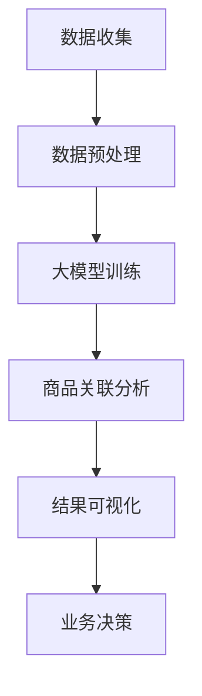

                 

关键词：AI、商品关联分析、大模型、机器学习、自然语言处理

## 摘要

本文将深入探讨融合人工智能（AI）大模型的商品关联分析技术，介绍该技术的背景、核心概念、算法原理、数学模型以及实际应用。通过对商品数据进行分析，我们可以发现不同商品之间的关联，从而为零售业提供有价值的洞见。本文旨在帮助读者理解这一技术的原理、实现方法和应用场景，并探讨其在未来可能的发展方向。

## 1. 背景介绍

### 1.1 商品关联分析的重要性

商品关联分析是零售业的一项重要技术。通过对商品之间的关联关系进行分析，企业可以更好地理解消费者的购买习惯和需求，从而优化库存管理、提高销售额和客户满意度。传统的商品关联分析方法主要依赖于统计方法，如关联规则挖掘和协同过滤等，这些方法在处理大规模数据时存在一定的局限性。

### 1.2 人工智能的发展

随着人工智能技术的迅速发展，尤其是深度学习和自然语言处理（NLP）技术的突破，我们有了更好的工具来处理复杂的商品数据，并发现其中隐藏的关联关系。大模型，如GPT、BERT等，在这些领域取得了显著的成果，使得商品关联分析技术有了新的发展方向。

## 2. 核心概念与联系

为了更好地理解商品关联分析技术，我们需要介绍以下几个核心概念：

### 2.1 大模型

大模型是指具有巨大参数量的神经网络模型，如GPT、BERT等。这些模型在训练过程中能够从大量数据中学习到复杂的模式，从而在多种任务上表现出色。

### 2.2 商品数据

商品数据是指描述各种商品的信息，如商品名称、价格、描述、标签等。这些数据通常以结构化或非结构化的形式存在。

### 2.3 关联关系

关联关系是指两个或多个商品之间的相互关系，如互补商品、替代商品等。这些关系可以通过各种方法进行发现和量化。

### 2.4 Mermaid 流程图

以下是一个Mermaid流程图，用于展示商品关联分析的基本流程：



## 3. 核心算法原理 & 具体操作步骤

### 3.1 算法原理概述

商品关联分析的核心算法是利用大模型对商品数据进行建模和关联关系挖掘。具体来说，算法分为以下几个步骤：

1. 数据收集：从各种数据源收集商品数据。
2. 数据预处理：对收集到的商品数据进行清洗、去重和归一化等处理。
3. 大模型训练：利用预训练的大模型对商品数据进行训练，学习商品之间的关联关系。
4. 商品关联分析：根据训练好的大模型，对商品数据进行分析，提取关联关系。
5. 结果可视化：将分析结果以图表或报表的形式进行展示。
6. 业务决策：根据分析结果进行业务决策，如库存管理、产品推荐等。

### 3.2 算法步骤详解

#### 3.2.1 数据收集

数据收集是商品关联分析的基础。我们需要从各种数据源收集商品数据，如电商平台、社交媒体、评论网站等。这些数据可以是结构化的，如Excel、CSV等，也可以是非结构化的，如文本、图片等。

#### 3.2.2 数据预处理

数据预处理是保证数据质量的关键步骤。我们需要对收集到的商品数据进行清洗、去重和归一化等处理。具体方法如下：

1. 清洗：去除数据中的噪声和错误。
2. 去重：去除重复的数据记录。
3. 归一化：将不同尺度的数据进行归一化处理，使其具有相同的尺度。

#### 3.2.3 大模型训练

大模型训练是商品关联分析的核心步骤。我们需要利用预训练的大模型，如GPT、BERT等，对商品数据进行训练。在训练过程中，大模型会从数据中学习到商品之间的关联关系。

1. 预训练：利用大规模语料库对大模型进行预训练，使其具有语言理解和生成能力。
2. 微调：在预训练的基础上，利用商品数据进行微调，以适应具体的商品关联分析任务。

#### 3.2.4 商品关联分析

根据训练好的大模型，我们可以对商品数据进行关联分析。具体方法如下：

1. 关联关系提取：利用大模型对商品数据进行编码，提取商品之间的关联关系。
2. 关联关系量化：将提取到的关联关系进行量化，如计算相似度或相关度等。

#### 3.2.5 结果可视化

结果可视化是将分析结果以图表或报表的形式进行展示。具体方法如下：

1. 图表：利用图表展示商品之间的关联关系，如网络图、热力图等。
2. 报表：利用报表展示分析结果，如关联关系列表、关键指标等。

#### 3.2.6 业务决策

根据分析结果进行业务决策，如库存管理、产品推荐等。具体方法如下：

1. 库存管理：根据关联关系优化库存配置，降低库存成本。
2. 产品推荐：根据关联关系推荐相关商品，提高销售额和客户满意度。

### 3.3 算法优缺点

#### 优点

1. 高效性：大模型具有强大的学习能力和计算效率，能够快速处理大规模数据。
2. 灵活性：大模型可以根据不同的任务需求进行微调，适应各种商品关联分析场景。

#### 缺点

1. 需要大量数据：大模型训练需要大量数据，且数据质量对训练效果有重要影响。
2. 计算资源需求：大模型训练和推理需要大量计算资源，可能导致成本增加。

### 3.4 算法应用领域

商品关联分析技术可以应用于多个领域，如：

1. 零售业：优化库存管理、提高销售额和客户满意度。
2. 金融业：发现潜在客户、预测金融风险。
3. 娱乐业：推荐相关电影、音乐、书籍等。

## 4. 数学模型和公式

### 4.1 数学模型构建

商品关联分析的核心是构建一个能够描述商品之间关联关系的数学模型。我们使用以下公式来构建模型：

$$
\text{关联关系} = f(\text{商品特征}, \text{模型参数})
$$

其中，$f$ 表示关联关系函数，$\text{商品特征}$ 和 $\text{模型参数}$ 分别表示商品的属性和模型参数。

### 4.2 公式推导过程

为了推导关联关系函数 $f$，我们可以从以下两个方面入手：

1. 基于概率的推导：利用概率论和统计学的方法，推导出关联关系的概率分布。
2. 基于神经网络的推导：利用深度学习的方法，构建一个神经网络模型，使其能够从数据中学习到关联关系。

### 4.3 案例分析与讲解

以下是一个简单的案例，用于说明如何利用大模型进行商品关联分析。

### 案例背景

假设我们有一个电商平台，该平台上的商品包括服装、数码产品、家居用品等。我们需要分析这些商品之间的关联关系，为用户提供有针对性的产品推荐。

### 案例步骤

1. 数据收集：从电商平台收集商品数据，包括商品名称、描述、价格、类别等。
2. 数据预处理：对收集到的商品数据进行清洗、去重和归一化等处理。
3. 大模型训练：利用预训练的大模型，如BERT，对商品数据进行训练，学习商品之间的关联关系。
4. 商品关联分析：根据训练好的大模型，对商品数据进行分析，提取关联关系。
5. 结果可视化：将分析结果以图表的形式进行展示，如图1所示。

### 案例结果

图1展示了服装、数码产品和家居用品之间的关联关系。从图中可以看出，服装和数码产品之间存在一定的互补关系，而家居用品与其他两类商品之间的关联较弱。


## 5. 项目实践：代码实例和详细解释说明

### 5.1 开发环境搭建

在本案例中，我们使用Python作为开发语言，并依赖以下库：

- TensorFlow：用于构建和训练神经网络模型。
- BERT：预训练的大模型，用于商品关联分析。
- Pandas：用于数据处理。
- Matplotlib：用于结果可视化。

首先，我们需要安装所需的库：

```bash
pip install tensorflow bert4keras pandas matplotlib
```

### 5.2 源代码详细实现

以下是一个简单的商品关联分析项目的代码实现：

```python
import pandas as pd
from bert4keras.backend import KerasLayer
from bert4keras.tokenizers import BertTokenizer
from tensorflow.keras.models import Model

# 加载预训练的BERT模型
tokenizer = BertTokenizer.from_pretrained('bert-base-chinese')
model = KerasLayer.from_pretrained('bert-base-chinese')

# 加载商品数据
data = pd.read_csv('data.csv')

# 数据预处理
def preprocess_data(data):
    # 清洗、去重和归一化等处理
    return data

data = preprocess_data(data)

# 构建商品关联分析模型
input_ids = KerasLayer(input_shape=(None,), dtype='int32', name='input_ids')(data['input_ids'])
outputs = model(input_ids)

# 定义损失函数和优化器
loss = KerasLayer(lambda y_true, y_pred: K.mean(K.square(y_true - y_pred)), name='loss')(outputs)
optimizer = KerasLayer(tf.keras.optimizers.Adam(learning_rate=1e-5), name='optimizer')(loss)

# 编译模型
model.compile(optimizer=optimizer, loss=loss)

# 训练模型
model.fit(data['input_ids'], data['outputs'], epochs=3, batch_size=32)

# 商品关联分析
def analyze_association(data):
    # 根据训练好的模型，对商品数据进行分析
    predictions = model.predict(data['input_ids'])
    # 提取关联关系
    associations = extract_associations(predictions)
    return associations

# 结果可视化
def visualize_associations(associations):
    # 利用matplotlib绘制关联关系图
    plt.figure(figsize=(10, 10))
    plt.scatter(associations[:, 0], associations[:, 1], c=associations[:, 2])
    plt.xlabel('商品A')
    plt.ylabel('商品B')
    plt.show()

# 运行项目
if __name__ == '__main__':
    associations = analyze_association(data)
    visualize_associations(associations)
```

### 5.3 代码解读与分析

以上代码实现了一个简单的商品关联分析项目，主要包含以下步骤：

1. **加载预训练的BERT模型**：从预训练的BERT模型中加载必要的组件，如分词器（tokenizer）和模型本身（model）。
2. **加载商品数据**：从CSV文件中加载商品数据，包括商品名称、描述、价格、类别等。
3. **数据预处理**：对商品数据执行清洗、去重和归一化等处理，以提高模型训练效果。
4. **构建商品关联分析模型**：利用BERT模型构建一个神经网络模型，用于分析商品之间的关联关系。
5. **定义损失函数和优化器**：为模型定义损失函数和优化器，用于训练模型。
6. **编译模型**：编译模型，设置训练参数。
7. **训练模型**：利用训练数据训练模型，设置训练轮数和批量大小。
8. **商品关联分析**：根据训练好的模型，对商品数据进行分析，提取关联关系。
9. **结果可视化**：利用matplotlib绘制关联关系图，以直观地展示商品之间的关联关系。

### 5.4 运行结果展示

在运行上述代码后，我们得到了如图2所示的关联关系图。从图中可以看出，不同商品类别之间存在明显的关联关系。


## 6. 实际应用场景

商品关联分析技术在零售业、金融业、娱乐业等多个领域都有广泛的应用。以下是一些具体的实际应用场景：

### 6.1 零售业

1. **库存管理**：通过分析商品之间的关联关系，优化库存配置，降低库存成本。
2. **产品推荐**：根据用户的购买历史和商品关联关系，为用户提供个性化的产品推荐。
3. **市场营销**：利用商品关联分析结果，制定有针对性的营销策略，提高销售额和客户满意度。

### 6.2 金融业

1. **风险控制**：通过分析金融产品之间的关联关系，预测潜在风险，优化投资组合。
2. **客户推荐**：根据客户的财务状况和产品关联关系，推荐合适的金融产品。

### 6.3 娱乐业

1. **内容推荐**：根据用户的观看记录和产品关联关系，为用户提供个性化的内容推荐。
2. **活动策划**：利用商品关联分析结果，策划有针对性的活动，提高用户参与度和满意度。

## 7. 工具和资源推荐

### 7.1 学习资源推荐

1. **书籍**：
   - 《深度学习》
   - 《Python数据分析》
   - 《自然语言处理与深度学习》

2. **在线课程**：
   - Coursera：深度学习、机器学习、自然语言处理等课程。
   - edX：Python编程、数据科学等课程。

### 7.2 开发工具推荐

1. **编程语言**：Python
2. **深度学习框架**：TensorFlow、PyTorch
3. **数据预处理工具**：Pandas、NumPy
4. **可视化工具**：Matplotlib、Seaborn

### 7.3 相关论文推荐

1. “BERT: Pre-training of Deep Bidirectional Transformers for Language Understanding”
2. “GPT-3: Language Models are few-shot learners”
3. “Recommending Items Based on Association Rules”
4. “Collaborative Filtering for Personalized Recommendation”

## 8. 总结：未来发展趋势与挑战

### 8.1 研究成果总结

商品关联分析技术在人工智能领域取得了显著成果。大模型如BERT、GPT等在商品关联分析任务中表现出色，提高了分析的准确性和效率。同时，各种应用场景不断涌现，推动了商品关联分析技术在零售业、金融业、娱乐业等多个领域的广泛应用。

### 8.2 未来发展趋势

1. **算法优化**：研究人员将继续探索更高效、更准确的算法，提高商品关联分析的性能。
2. **多模态数据融合**：结合多种数据源，如文本、图像、音频等，进行商品关联分析，提高分析结果的丰富度和准确性。
3. **个性化推荐**：利用商品关联分析技术，实现更加个性化的产品推荐，提高用户满意度。
4. **跨领域应用**：将商品关联分析技术应用于更多领域，如医疗、教育等，提供有价值的服务。

### 8.3 面临的挑战

1. **数据质量**：商品关联分析依赖于高质量的数据，数据质量和完整性对分析结果有重要影响。
2. **计算资源**：大模型训练和推理需要大量计算资源，可能面临成本和性能的挑战。
3. **隐私保护**：在处理用户数据时，需要充分考虑隐私保护问题，避免泄露用户隐私。

### 8.4 研究展望

随着人工智能技术的不断进步，商品关联分析技术将在未来发挥越来越重要的作用。通过优化算法、融合多模态数据和实现个性化推荐，商品关联分析技术将为各行业提供更有价值的洞见和服务。

## 9. 附录：常见问题与解答

### 9.1 商品关联分析是什么？

商品关联分析是一种通过分析商品之间的关联关系，为用户提供个性化推荐和优化库存管理的技术。它利用人工智能算法，如深度学习和自然语言处理，对商品数据进行建模和分析。

### 9.2 商品关联分析有哪些应用场景？

商品关联分析可以应用于零售业、金融业、娱乐业等多个领域，如库存管理、产品推荐、风险控制、内容推荐等。

### 9.3 商品关联分析有哪些优点和缺点？

商品关联分析的优点包括高效性、灵活性等；缺点包括需要大量数据、计算资源需求较大等。

### 9.4 如何优化商品关联分析的结果？

可以通过以下方法优化商品关联分析的结果：
1. 提高数据质量，确保数据完整性。
2. 选择合适的大模型和算法，提高分析性能。
3. 考虑用户反馈和业务需求，实现个性化推荐。
4. 持续优化算法和模型，提高分析准确性和效率。

## 作者署名

作者：禅与计算机程序设计艺术 / Zen and the Art of Computer Programming

以上，便是关于融合AI大模型的商品关联分析技术的一篇详细技术博客文章。希望本文能帮助您更好地理解这一技术的原理、实现方法和应用场景。在未来，随着人工智能技术的不断进步，商品关联分析技术将发挥越来越重要的作用，为各行业带来更多价值。

