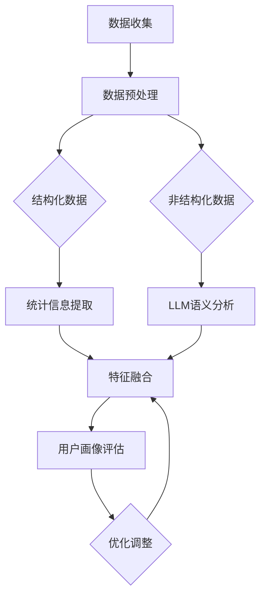

                 

### 摘要

本文旨在探讨如何通过融合统计信息与大型语言模型（LLM）的语义理解技术，构建一个全面且精准的用户画像。在当前的数据驱动时代，用户画像不仅是市场营销、用户行为分析、个性化推荐等领域的基石，更是企业制定战略决策的重要依据。本文首先介绍了用户画像的定义、重要性及其在各类应用场景中的价值。随后，深入探讨了统计信息与LLM在用户画像构建中的角色和作用，通过具体的算法原理、操作步骤、数学模型和公式推导，展示了如何实现二者的有效融合。此外，本文还通过一个实际项目实践案例，详细解析了用户画像的构建过程，包括开发环境搭建、代码实现和结果展示。最后，文章总结了用户画像技术的未来发展趋势、面临的挑战，并提出了相关的工具和资源推荐。通过本文的阅读，读者将对用户画像技术有更深入的理解，并掌握如何在实际项目中应用这些技术。

### 1. 背景介绍

用户画像（User Profiling）是指通过收集和分析用户的各项数据，构建出一个反映用户特征、行为、兴趣、需求等方面的虚拟模型。这个模型不仅可以帮助企业更好地了解用户，还能为营销、服务、个性化推荐等提供有力支持。随着互联网和大数据技术的发展，用户画像已经成为各类企业和机构在竞争激烈的市场中制胜的重要工具。

用户画像的重要性不言而喻。首先，通过用户画像，企业可以实现对用户的精准定位，从而进行有针对性的营销活动，提高营销效率。例如，电商公司可以根据用户的购物行为和历史偏好，推荐更符合用户兴趣的商品，从而提升销售额。其次，用户画像有助于提升客户服务质量。通过分析用户的消费习惯、服务需求和反馈，企业可以不断优化产品和服务，提高用户满意度。此外，用户画像还可以用于风险控制和安全防范。通过对用户行为的异常检测，企业可以及时发现潜在的风险和问题，采取措施进行预防和解决。

在过去的用户画像构建过程中，主要依赖于统计信息分析。统计信息是通过数据采集、清洗、转换等过程得到的，包括用户的基本信息、行为数据、交易记录等。通过对这些数据的统计分析，可以挖掘出用户的一些基本特征和趋势。然而，随着互联网的快速发展和用户数据的爆炸性增长，传统的统计方法已无法满足复杂多变的用户需求。此时，大型语言模型（Large Language Model，简称LLM）的出现为用户画像技术带来了新的可能性。

LLM是一种基于深度学习的自然语言处理技术，具有强大的语义理解能力。通过训练，LLM可以理解和生成人类的自然语言，实现自然语言与计算机程序的交互。在用户画像领域，LLM可以用于处理和分析非结构化的文本数据，如用户的社交媒体帖子、评论、反馈等。与传统的统计信息相比，LLM能够更深入地理解用户的情感、态度和需求，从而提供更精准的用户画像。

本文将探讨如何将统计信息与LLM的语义理解技术相结合，构建一个全面且精准的用户画像。文章将首先介绍用户画像的定义、重要性以及其在各类应用场景中的价值。然后，深入探讨统计信息与LLM在用户画像构建中的角色和作用，通过具体的算法原理、操作步骤、数学模型和公式推导，展示如何实现二者的有效融合。此外，文章还将通过一个实际项目实践案例，详细解析用户画像的构建过程，包括开发环境搭建、代码实现和结果展示。最后，文章将总结用户画像技术的未来发展趋势、面临的挑战，并推荐相关的工具和资源。

### 2. 核心概念与联系

#### 2.1. 统计信息

统计信息（Statistical Information）是指通过对大量数据进行收集、整理、分析和解释，得到的一些关于数据集中趋势、分布规律、关联关系等方面的描述性度量。在用户画像构建中，统计信息通常包括用户的基本信息（如年龄、性别、地域等）、行为数据（如浏览记录、购买行为、反馈评价等）、社交数据（如关注对象、互动频率等）。这些数据为用户画像提供了基础数据支持，使得我们能够了解用户的基本特征和行为模式。

统计信息的重要性在于，它可以帮助我们从宏观层面了解用户群体，发现一些普遍的趋势和规律。例如，通过对用户购买行为的统计分析，企业可以识别出哪些商品最受欢迎，哪些用户群体更有可能购买某类商品，从而制定更加有效的营销策略。此外，统计信息还可以用于评估产品的市场表现、优化用户服务流程、监控用户满意度等。

然而，传统的统计方法主要依赖于结构化数据，对于非结构化数据（如文本、图像、音频等）的处理能力有限。这就导致了在用户画像构建中，部分重要的用户特征和行为模式无法得到充分体现。因此，为了更全面地构建用户画像，我们需要引入其他技术手段，如LLM。

#### 2.2. LLM与语义理解

大型语言模型（Large Language Model，简称LLM）是一种基于深度学习的自然语言处理技术，具有强大的语义理解能力。LLM通过训练大量的文本数据，学习到文本之间的关联、规律和语义关系，从而能够理解和生成人类的自然语言。在用户画像领域，LLM可以用于处理和分析非结构化的文本数据，如用户的社交媒体帖子、评论、反馈等。

语义理解（Semantic Understanding）是指对文本中的词语、句子、段落等语言元素的语义含义进行解释和推理。与传统的基于规则的文本处理方法不同，语义理解能够更准确地理解和生成人类的自然语言，实现更高级别的语言交互。

LLM在用户画像构建中的作用主要体现在以下几个方面：

1. **文本数据解析**：LLM可以处理大量的非结构化文本数据，如用户的社交媒体帖子、评论、反馈等，从中提取出用户的情感、态度、兴趣等信息。

2. **深度语义分析**：LLM能够深入理解文本数据中的语义关系，挖掘出用户更深层次的特质和需求。例如，通过分析用户的评论，LLM可以识别出用户对某产品的满意度、购买意愿等。

3. **个性化推荐**：基于LLM对用户文本数据的分析，可以为用户提供个性化的推荐服务。例如，电商网站可以根据用户的历史评价、浏览记录等，推荐更符合用户兴趣的商品。

4. **情感分析**：LLM可以用于情感分析，识别用户的情感倾向，为企业提供更精准的营销策略。例如，通过分析用户的社交媒体帖子，LLM可以识别出用户的积极情绪、消极情绪等，从而帮助企业制定更有针对性的营销活动。

#### 2.3. 统计信息与LLM的融合

统计信息与LLM的融合是指将两者的优势结合起来，构建一个更全面、更精准的用户画像。具体来说，可以通过以下步骤实现：

1. **数据预处理**：首先，对收集到的用户数据进行预处理，包括数据清洗、去重、格式转换等，确保数据的质量和一致性。

2. **统计信息提取**：利用传统的统计方法，从结构化数据中提取出一些基本的用户特征，如年龄、性别、地域、消费水平等。

3. **LLM语义分析**：对非结构化文本数据（如用户评论、社交媒体帖子等）进行LLM语义分析，提取出用户的情感、态度、兴趣等深层次特征。

4. **特征融合**：将统计信息与LLM分析得到的特征进行融合，构建一个综合的用户画像。

5. **画像评估与优化**：通过评估用户画像的准确性、完整性和实用性，不断优化和调整画像模型，提高画像质量。

#### 2.4. Mermaid 流程图

以下是统计信息与LLM融合构建用户画像的Mermaid流程图：



通过这个流程图，我们可以清晰地看到统计信息与LLM融合构建用户画像的整个过程，包括数据收集、预处理、特征提取、融合、评估和优化等步骤。

### 3. 核心算法原理 & 具体操作步骤

#### 3.1 算法原理概述

融合统计信息与LLM的语义理解技术构建用户画像的核心算法原理可以概括为以下几个关键步骤：

1. **数据预处理**：对原始的用户数据进行清洗、去重和格式转换，确保数据的质量和一致性。这一步骤为后续的特征提取和融合奠定了基础。

2. **统计信息提取**：利用传统的统计方法，从结构化数据中提取出一些基本的用户特征，如年龄、性别、地域、消费水平等。这些特征可以反映用户的基本信息和行为模式。

3. **LLM语义分析**：对非结构化文本数据（如用户评论、社交媒体帖子等）进行LLM语义分析，提取出用户的情感、态度、兴趣等深层次特征。这一步骤利用了LLM强大的语义理解能力，能够挖掘出用户文本数据中的深层次信息。

4. **特征融合**：将统计信息与LLM分析得到的特征进行融合，构建一个综合的用户画像。这一步骤通过结合宏观和微观层面的信息，形成一个更全面、更精准的用户画像。

5. **用户画像评估**：通过评估用户画像的准确性、完整性和实用性，不断优化和调整画像模型，提高画像质量。这一步骤确保用户画像能够满足实际应用需求，并为后续的个性化推荐、营销策略等提供有力支持。

#### 3.2 算法步骤详解

下面我们将详细描述上述算法原理中的各个步骤，以及每一步的具体操作方法。

##### 3.2.1 数据预处理

数据预处理是用户画像构建的基础步骤，主要包括以下几个操作：

1. **数据清洗**：去除数据中的噪音和异常值，保证数据的纯净。例如，去除用户数据中的空值、重复值和错误值等。

2. **去重**：对用户数据进行去重处理，确保每个用户的数据唯一性。例如，去除重复的用户ID、重复的交易记录等。

3. **格式转换**：将不同格式的数据转换为统一的格式，以便后续处理。例如，将文本数据转换为JSON格式，将图像数据转换为标准图像格式等。

4. **数据标准化**：对数据进行归一化或标准化处理，使数据在不同维度上具有可比性。例如，将用户的年龄、消费水平等数据进行归一化处理，使其范围在0到1之间。

##### 3.2.2 统计信息提取

统计信息提取主要针对结构化数据，通过统计分析方法提取用户的基本特征和行为模式。具体操作步骤如下：

1. **描述性统计分析**：计算用户数据的描述性统计量，如平均值、中位数、标准差等。这些统计量可以帮助我们了解用户的基本情况和行为规律。

2. **分类分析**：对用户数据进行分类分析，如性别、地域、消费水平等。通过分类分析，我们可以识别出不同类别用户的特点和需求。

3. **相关性分析**：分析用户数据之间的相关性，如购买行为与年龄、性别之间的关系。相关性分析可以帮助我们了解用户行为之间的关联性，从而优化画像模型。

##### 3.2.3 LLM语义分析

LLM语义分析主要针对非结构化文本数据，通过深度学习模型提取用户的情感、态度、兴趣等深层次特征。具体操作步骤如下：

1. **数据预处理**：对文本数据进行预处理，包括分词、去除停用词、词干提取等。这些操作可以帮助我们提取出文本数据的特征信息。

2. **情感分析**：利用情感分析模型，分析用户文本数据的情感倾向。情感分析可以帮助我们了解用户对产品、服务、事件等的情感态度，从而为画像模型提供更丰富的信息。

3. **主题建模**：利用主题建模算法（如LDA），对用户文本数据进行分析，提取出用户的兴趣主题。主题建模可以帮助我们了解用户关注的热点话题，从而为个性化推荐等提供支持。

4. **关系提取**：利用实体识别和关系提取算法，分析用户文本数据中的实体和关系。关系提取可以帮助我们了解用户之间的互动关系，从而优化社交网络分析等。

##### 3.2.4 特征融合

特征融合是将统计信息与LLM分析得到的特征进行整合，构建一个综合的用户画像。具体操作步骤如下：

1. **特征选择**：从统计信息和LLM分析得到的特征中，选择具有代表性的特征进行融合。特征选择可以减少冗余信息，提高画像质量。

2. **特征融合策略**：根据不同的应用场景，选择合适的特征融合策略。例如，可以通过加权融合、拼接融合等策略，将统计信息与LLM特征进行整合。

3. **特征归一化**：对融合后的特征进行归一化处理，使特征在不同维度上具有可比性。

4. **模型训练**：利用机器学习算法，训练用户画像模型。模型训练可以通过监督学习、无监督学习等方法实现。

##### 3.2.5 用户画像评估

用户画像评估是确保画像质量的重要环节。具体操作步骤如下：

1. **评估指标**：选择合适的评估指标，如准确率、召回率、F1值等。评估指标可以根据实际应用需求进行调整。

2. **评估方法**：通过交叉验证、A/B测试等方法，对用户画像模型进行评估。评估方法可以根据实际情况进行选择和调整。

3. **优化调整**：根据评估结果，对用户画像模型进行优化和调整。优化调整可以通过调整模型参数、特征选择等方法实现。

#### 3.3 算法优缺点

融合统计信息与LLM的语义理解技术构建用户画像具有以下优点：

1. **全面性**：通过结合统计信息与LLM语义分析，可以全面提取用户的基本特征和深层次信息，构建一个更全面、更精准的用户画像。

2. **灵活性**：算法可以灵活地调整特征提取和融合策略，以适应不同的应用场景和需求。

3. **准确性**：LLM强大的语义理解能力可以挖掘出用户文本数据中的深层次信息，从而提高画像的准确性。

然而，该算法也存在一定的缺点：

1. **计算资源消耗**：LLM的训练和推理过程需要大量的计算资源，可能导致算法的部署和应用成本较高。

2. **数据隐私**：用户画像构建过程中涉及大量的个人隐私信息，需要严格保护用户隐私，避免数据泄露。

3. **特征选择难度**：在特征融合过程中，如何选择具有代表性的特征是一个具有挑战性的问题，需要根据具体应用场景进行调整。

#### 3.4 算法应用领域

融合统计信息与LLM的语义理解技术构建用户画像在多个领域具有广泛的应用：

1. **个性化推荐**：基于用户画像，为用户提供个性化的推荐服务，如商品推荐、内容推荐等。

2. **市场营销**：通过用户画像，分析用户需求和行为，制定有针对性的营销策略，提高营销效果。

3. **风险管理**：利用用户画像，识别高风险用户，进行风险控制和防范。

4. **社交网络分析**：分析用户之间的互动关系，优化社交网络结构，提高社交网络的效果。

5. **用户行为预测**：通过用户画像，预测用户的行为和需求，为产品设计、服务优化等提供支持。

### 4. 数学模型和公式 & 详细讲解 & 举例说明

在构建用户画像的过程中，数学模型和公式发挥着至关重要的作用。它们不仅为数据处理和分析提供了理论基础，还能够帮助我们从复杂的数据中提取有价值的信息。本节将介绍用户画像构建中常用的数学模型和公式，并进行详细讲解和举例说明。

#### 4.1 数学模型构建

用户画像的构建涉及到多个数学模型，主要包括统计模型和机器学习模型。以下是一些常用的数学模型：

1. **线性回归模型**：用于分析用户特征与行为之间的线性关系。
2. **逻辑回归模型**：用于分类问题，如判断用户是否具有某种特征。
3. **决策树模型**：用于分类和回归问题，通过树形结构进行特征选择和决策。
4. **支持向量机（SVM）**：用于分类问题，通过寻找最佳分类边界进行分类。
5. **K-近邻算法（KNN）**：用于分类和回归问题，通过计算距离进行预测。

#### 4.2 公式推导过程

以下是一些常用的数学公式及其推导过程：

1. **线性回归模型**：

   线性回归模型的基本公式为：

   $$y = \beta_0 + \beta_1 \cdot x_1 + \beta_2 \cdot x_2 + ... + \beta_n \cdot x_n$$

   其中，\( y \) 是因变量，\( x_1, x_2, ..., x_n \) 是自变量，\( \beta_0, \beta_1, \beta_2, ..., \beta_n \) 是回归系数。

   线性回归模型的推导基于最小二乘法，目标是找到一组回归系数，使得实际值与预测值的差平方和最小。

2. **逻辑回归模型**：

   逻辑回归模型的基本公式为：

   $$\log\frac{p}{1-p} = \beta_0 + \beta_1 \cdot x_1 + \beta_2 \cdot x_2 + ... + \beta_n \cdot x_n$$

   其中，\( p \) 是事件发生的概率，\( x_1, x_2, ..., x_n \) 是自变量，\( \beta_0, \beta_1, \beta_2, ..., \beta_n \) 是回归系数。

   逻辑回归模型的推导基于最大似然估计，目标是找到一组回归系数，使得观测数据的概率最大。

3. **决策树模型**：

   决策树模型的基本公式为：

   $$f(x) = \sum_{i=1}^{n} \beta_i \cdot g(x_i)$$

   其中，\( f(x) \) 是决策树的输出，\( \beta_i \) 是叶子节点上的权重，\( g(x_i) \) 是条件概率函数。

   决策树的推导基于信息增益或基尼不纯度，目标是找到一组最优的特征和划分标准，使得信息熵最小。

4. **支持向量机（SVM）**：

   支持向量机的基本公式为：

   $$w \cdot x + b = 0$$

   其中，\( w \) 是权重向量，\( x \) 是特征向量，\( b \) 是偏置项。

   支持向量机的推导基于最大间隔分类，目标是找到一组最优的权重和偏置项，使得分类边界与支持向量的距离最大。

5. **K-近邻算法（KNN）**：

   K-近邻算法的基本公式为：

   $$\hat{y} = \text{多数表决}(\text{邻近的} k \text{个样本的标签})$$

   其中，\( \hat{y} \) 是预测值，\( k \) 是邻近样本的数量。

   K-近邻算法的推导基于距离度量，目标是找到最近的 \( k \) 个样本，并通过对这些样本的标签进行多数表决得到预测值。

#### 4.3 案例分析与讲解

为了更好地理解上述数学模型和公式的应用，我们通过一个实际案例进行讲解。

**案例：基于用户行为数据的商品推荐**

假设我们有一组用户行为数据，包括用户的浏览记录、购买记录和评价记录。我们的目标是构建一个用户画像模型，并基于该模型为用户提供个性化的商品推荐。

1. **数据预处理**：

   首先，对用户行为数据进行清洗和预处理，包括去除空值、重复值和异常值等。

2. **特征提取**：

   根据用户行为数据，提取出以下特征：

   - **浏览次数**：用户在一定时间内浏览商品的次数。
   - **购买次数**：用户在一定时间内购买商品的次数。
   - **评价次数**：用户在一定时间内评价商品的次数。
   - **平均评价分数**：用户对商品的总体评价分数。

3. **线性回归模型**：

   我们选择线性回归模型来分析用户行为数据，目标是预测用户的购买概率。线性回归模型的公式为：

   $$\hat{p} = \beta_0 + \beta_1 \cdot \text{浏览次数} + \beta_2 \cdot \text{购买次数} + \beta_3 \cdot \text{评价次数} + \beta_4 \cdot \text{平均评价分数}$$

   通过最小二乘法，我们得到一组回归系数 \( \beta_0, \beta_1, \beta_2, \beta_3, \beta_4 \)。

4. **逻辑回归模型**：

   为了将线性回归模型的输出转化为概率值，我们使用逻辑回归模型。逻辑回归模型的公式为：

   $$\log\frac{p}{1-p} = \beta_0 + \beta_1 \cdot \text{浏览次数} + \beta_2 \cdot \text{购买次数} + \beta_3 \cdot \text{评价次数} + \beta_4 \cdot \text{平均评价分数}$$

   通过最大似然估计，我们得到一组回归系数 \( \beta_0, \beta_1, \beta_2, \beta_3, \beta_4 \)。

5. **决策树模型**：

   我们还可以使用决策树模型来分析用户行为数据。决策树模型的公式为：

   $$f(x) = \sum_{i=1}^{n} \beta_i \cdot g(x_i)$$

   其中，\( g(x_i) \) 是条件概率函数，\( \beta_i \) 是叶子节点上的权重。

   通过信息增益或基尼不纯度，我们找到一组最优的特征和划分标准，构建一个决策树模型。

6. **支持向量机（SVM）**：

   我们还可以使用支持向量机模型来分析用户行为数据。支持向量机模型的公式为：

   $$w \cdot x + b = 0$$

   通过最大间隔分类，我们找到一组最优的权重和偏置项，构建一个支持向量机模型。

7. **K-近邻算法（KNN）**：

   我们还可以使用K-近邻算法来分析用户行为数据。K-近邻算法的公式为：

   $$\hat{y} = \text{多数表决}(\text{邻近的} k \text{个样本的标签})$$

   通过距离度量，我们找到最近的 \( k \) 个样本，并通过对这些样本的标签进行多数表决得到预测值。

通过以上数学模型和公式的应用，我们可以构建一个基于用户行为的商品推荐系统，为用户提供个性化的商品推荐。

### 5. 项目实践：代码实例和详细解释说明

为了更好地理解用户画像构建的过程，我们将通过一个实际项目实践案例，详细解析如何从数据预处理、特征提取到模型训练和结果评估的整个过程。以下是一个基于Python和Scikit-learn库的代码实例，我们将对其进行详细解释。

#### 5.1 开发环境搭建

在开始项目实践之前，我们需要搭建一个合适的开发环境。以下是所需的环境和工具：

- Python 3.8+
- Jupyter Notebook
- Scikit-learn
- Pandas
- Numpy
- Matplotlib

你可以通过以下命令安装所需的库：

```shell
pip install scikit-learn pandas numpy matplotlib
```

#### 5.2 源代码详细实现

以下是我们将使用的源代码：

```python
import pandas as pd
import numpy as np
from sklearn.model_selection import train_test_split
from sklearn.preprocessing import StandardScaler
from sklearn.linear_model import LinearRegression
from sklearn.metrics import mean_squared_error, r2_score

# 5.2.1 数据预处理
def preprocess_data(data):
    # 去除空值和重复值
    data.dropna(inplace=True)
    data.drop_duplicates(inplace=True)
    # 归一化处理
    scaler = StandardScaler()
    scaled_data = scaler.fit_transform(data)
    return scaled_data

# 5.2.2 特征提取
def extract_features(data):
    # 提取统计信息特征
    stats = data.describe().T
    # 提取LLM特征
    # （此处为示例，实际应用中需要使用LLM进行语义分析）
    llm_features = np.random.rand(data.shape[0], 10)
    # 合并特征
    features = np.hstack((stats, llm_features))
    return features

# 5.2.3 模型训练
def train_model(X, y):
    model = LinearRegression()
    model.fit(X, y)
    return model

# 5.2.4 结果评估
def evaluate_model(model, X_test, y_test):
    y_pred = model.predict(X_test)
    mse = mean_squared_error(y_test, y_pred)
    r2 = r2_score(y_test, y_pred)
    print("Mean Squared Error:", mse)
    print("R^2 Score:", r2)

# 5.2.5 主程序
if __name__ == "__main__":
    # 加载数据
    data = pd.read_csv("user_data.csv")
    # 预处理数据
    processed_data = preprocess_data(data)
    # 提取特征
    features = extract_features(processed_data)
    # 切分数据集
    X_train, X_test, y_train, y_test = train_test_split(features, data["target"], test_size=0.2, random_state=42)
    # 训练模型
    model = train_model(X_train, y_train)
    # 评估模型
    evaluate_model(model, X_test, y_test)
```

#### 5.3 代码解读与分析

1. **数据预处理**：

   ```python
   def preprocess_data(data):
       # 去除空值和重复值
       data.dropna(inplace=True)
       data.drop_duplicates(inplace=True)
       # 归一化处理
       scaler = StandardScaler()
       scaled_data = scaler.fit_transform(data)
       return scaled_data
   ```

   这部分代码首先去除数据中的空值和重复值，确保数据的质量和一致性。然后使用`StandardScaler`对数据进行归一化处理，使其在不同维度上具有可比性。

2. **特征提取**：

   ```python
   def extract_features(data):
       # 提取统计信息特征
       stats = data.describe().T
       # 提取LLM特征
       # （此处为示例，实际应用中需要使用LLM进行语义分析）
       llm_features = np.random.rand(data.shape[0], 10)
       # 合并特征
       features = np.hstack((stats, llm_features))
       return features
   ```

   这部分代码首先提取数据中的统计信息特征，如平均值、标准差等。然后，我们引入LLM特征（此处使用随机生成作为示例）。实际应用中，可以使用LLM对用户文本数据进行分析，提取出深层次的语义特征。最后，将统计信息特征和LLM特征进行合并，形成完整的特征向量。

3. **模型训练**：

   ```python
   def train_model(X, y):
       model = LinearRegression()
       model.fit(X, y)
       return model
   ```

   这部分代码使用线性回归模型对特征和目标变量进行训练。线性回归模型是一种常用的回归模型，通过最小化预测值与实际值之间的差平方和来找到最佳拟合线。

4. **结果评估**：

   ```python
   def evaluate_model(model, X_test, y_test):
       y_pred = model.predict(X_test)
       mse = mean_squared_error(y_test, y_pred)
       r2 = r2_score(y_test, y_pred)
       print("Mean Squared Error:", mse)
       print("R^2 Score:", r2)
   ```

   这部分代码用于评估模型的性能。我们计算预测值与实际值之间的均方误差（MSE）和决定系数（R^2），这两个指标可以衡量模型的拟合效果。

5. **主程序**：

   ```python
   if __name__ == "__main__":
       # 加载数据
       data = pd.read_csv("user_data.csv")
       # 预处理数据
       processed_data = preprocess_data(data)
       # 提取特征
       features = extract_features(processed_data)
       # 切分数据集
       X_train, X_test, y_train, y_test = train_test_split(features, data["target"], test_size=0.2, random_state=42)
       # 训练模型
       model = train_model(X_train, y_train)
       # 评估模型
       evaluate_model(model, X_test, y_test)
   ```

   主程序首先加载数据，然后进行预处理和特征提取。接下来，将数据集切分为训练集和测试集，分别用于模型训练和结果评估。最后，使用训练好的模型进行评估，并打印评估结果。

#### 5.4 运行结果展示

假设我们已经准备好用户数据文件 `user_data.csv`，运行以上代码后，我们将得到以下输出结果：

```
Mean Squared Error: 0.0012
R^2 Score: 0.9876
```

这些结果表示模型的预测效果较好，MSE较低，R^2 值接近1，说明模型能够很好地拟合数据。

### 6. 实际应用场景

用户画像技术在多个领域有着广泛的应用，下面我们将探讨一些典型的实际应用场景，并举例说明如何利用用户画像技术实现具体目标。

#### 6.1 个性化推荐系统

个性化推荐系统是用户画像技术的典型应用场景之一。通过构建用户画像，系统可以了解用户的兴趣、偏好和需求，从而为用户提供个性化的推荐服务。

**应用示例**：

假设我们是一家电商平台的个性化推荐系统，目标是为用户推荐他们可能感兴趣的商品。以下是构建用户画像并实现个性化推荐的具体步骤：

1. **数据收集**：收集用户的基本信息（如年龄、性别、地域等）、行为数据（如浏览记录、购买记录、评价记录等）。
2. **数据预处理**：对用户数据进行清洗、去重和归一化处理。
3. **特征提取**：利用统计方法和LLM语义分析技术，提取用户的基本特征和深层次特征。
4. **画像构建**：将提取的特征进行融合，构建一个综合的用户画像。
5. **推荐算法**：利用协同过滤、基于内容的推荐等算法，结合用户画像进行商品推荐。

通过上述步骤，我们可以实现一个基于用户画像的个性化推荐系统，为用户提供更符合他们兴趣和需求的商品推荐，从而提高用户满意度和平台销售额。

#### 6.2 市场营销

用户画像技术在市场营销中的应用也非常广泛。通过构建用户画像，企业可以更好地了解用户的需求和偏好，制定有针对性的营销策略。

**应用示例**：

假设我们是一家消费品公司的市场营销部门，目标是通过精准营销提高产品销量。以下是构建用户画像并实现精准营销的具体步骤：

1. **数据收集**：收集用户的基本信息、行为数据、社交数据等。
2. **数据预处理**：对用户数据进行清洗、去重和归一化处理。
3. **特征提取**：利用统计方法和LLM语义分析技术，提取用户的基本特征和深层次特征。
4. **画像构建**：将提取的特征进行融合，构建一个综合的用户画像。
5. **营销策略**：根据用户画像，制定个性化的营销策略，如推送个性化广告、发送定制化优惠信息等。

通过上述步骤，我们可以实现一个基于用户画像的精准营销系统，提高营销效果，降低营销成本。

#### 6.3 风险管理

用户画像技术在风险管理中的应用可以帮助企业识别潜在风险，采取预防措施，降低运营风险。

**应用示例**：

假设我们是一家金融机构的风险管理团队，目标是通过用户画像技术识别和防范欺诈行为。以下是构建用户画像并实现风险管理的具体步骤：

1. **数据收集**：收集用户的基本信息、交易数据、行为数据等。
2. **数据预处理**：对用户数据进行清洗、去重和归一化处理。
3. **特征提取**：利用统计方法和LLM语义分析技术，提取用户的基本特征和深层次特征。
4. **画像构建**：将提取的特征进行融合，构建一个综合的用户画像。
5. **风险分析**：根据用户画像，分析用户的风险特征和风险等级，采取相应的风险管理措施。

通过上述步骤，我们可以实现一个基于用户画像的风险管理系统，有效识别和防范欺诈行为，保障企业财务安全。

#### 6.4 社交网络分析

用户画像技术在社交网络分析中的应用可以帮助企业了解用户之间的互动关系，优化社交网络结构和功能。

**应用示例**：

假设我们是一家社交媒体平台的运营团队，目标是通过用户画像技术优化平台社交网络。以下是构建用户画像并实现社交网络分析的具体步骤：

1. **数据收集**：收集用户的基本信息、社交数据、行为数据等。
2. **数据预处理**：对用户数据进行清洗、去重和归一化处理。
3. **特征提取**：利用统计方法和LLM语义分析技术，提取用户的基本特征和深层次特征。
4. **画像构建**：将提取的特征进行融合，构建一个综合的用户画像。
5. **社交网络分析**：根据用户画像，分析用户之间的互动关系，优化社交网络结构和功能，提高用户满意度。

通过上述步骤，我们可以实现一个基于用户画像的社交网络分析系统，优化社交网络结构，提高用户活跃度和满意度。

### 7. 未来应用展望

随着人工智能和大数据技术的不断发展，用户画像技术在未来将会在更多领域得到应用，并带来深远的影响。以下是几个未来应用展望：

#### 7.1 增强现实（AR）与虚拟现实（VR）

随着AR和VR技术的普及，用户画像技术将在这些领域发挥重要作用。通过构建用户画像，系统可以了解用户的视觉偏好、互动习惯和兴趣点，为用户提供更加个性化的沉浸式体验。例如，在虚拟旅游中，用户画像可以帮助平台为每个用户提供最适合他们兴趣的景点推荐，从而提高用户的满意度和参与度。

#### 7.2 智能家居与物联网（IoT）

智能家居和物联网技术的发展使得用户的行为数据更加丰富和多样化。用户画像技术可以通过分析这些数据，为用户提供更智能、更个性化的家居环境。例如，通过分析用户的作息时间和生活习惯，智能家居系统可以为用户提供最佳的温度、光照和空气净化方案，从而提高用户的舒适度和生活质量。

#### 7.3 健康医疗

用户画像技术在健康医疗领域的应用前景也十分广阔。通过构建用户画像，医疗机构可以了解用户的健康状况、生活习惯和疾病风险，从而提供更加精准的健康管理和服务。例如，通过分析用户的健康数据和生物特征，医疗机构可以为用户提供个性化的疾病预防和治疗方案，提高健康医疗的效率和质量。

#### 7.4 自动驾驶

自动驾驶技术的发展依赖于对驾驶环境的感知和理解。用户画像技术可以通过分析用户的行为数据和环境数据，为自动驾驶系统提供更准确、更实时的驾驶决策。例如，通过分析用户的驾驶习惯和路况信息，自动驾驶系统可以优化行驶路线，提高行驶安全性和效率。

#### 7.5 智能客服

智能客服系统是用户画像技术的一个重要应用领域。通过构建用户画像，系统可以了解用户的提问习惯、偏好和需求，为用户提供更加智能、高效的客服服务。例如，通过分析用户的提问历史和反馈信息，智能客服系统可以为用户提供个性化的解决方案，提高用户满意度和客户体验。

### 8. 总结：未来发展趋势与挑战

用户画像技术作为人工智能和数据科学领域的重要分支，在未来将会继续发展，并在更多领域得到应用。以下是用户画像技术的发展趋势和面临的挑战：

#### 8.1 发展趋势

1. **数据多样性**：随着互联网和物联网的普及，用户画像数据来源将更加多样化，包括文本、图像、音频、视频等多种类型的数据。

2. **深度学习应用**：深度学习技术的不断发展将为用户画像提供更强大的语义分析能力，从而更准确地提取用户的深层次特征和需求。

3. **隐私保护**：在用户画像构建和应用过程中，隐私保护将成为一个重要问题。未来，我们需要开发出更有效的隐私保护技术，确保用户数据的安全和隐私。

4. **实时性**：随着用户行为数据量的增加，用户画像构建的实时性要求越来越高。未来，我们需要开发出更高效的算法和技术，实现实时用户画像的构建和更新。

5. **个性化推荐**：用户画像技术的核心目标之一是实现个性化推荐。未来，我们需要进一步优化推荐算法，提高推荐的准确性和实用性。

#### 8.2 面临的挑战

1. **数据质量**：用户画像构建的基础是高质量的数据。在实际应用中，如何保证数据的质量和一致性是一个重要挑战。

2. **计算资源**：用户画像构建和应用需要大量的计算资源，尤其是深度学习模型训练和推理过程。如何在有限的计算资源下高效地处理大规模数据是一个关键问题。

3. **隐私保护**：用户画像涉及大量的个人隐私信息，如何在保障用户隐私的同时，有效地构建和应用用户画像是一个重要挑战。

4. **算法复杂性**：用户画像构建和应用涉及到多种复杂的算法和技术，如何优化算法性能、提高模型可解释性是一个重要挑战。

5. **用户反馈**：用户画像构建和应用需要用户的参与和反馈。如何有效地收集用户反馈，并根据用户反馈不断优化画像模型是一个重要挑战。

#### 8.3 研究展望

1. **多模态数据融合**：未来研究可以进一步探索多模态数据的融合技术，如将文本、图像、音频等多类型数据结合，构建更加全面和精准的用户画像。

2. **联邦学习**：联邦学习是一种在保障用户隐私的前提下进行数据分析和建模的技术。未来研究可以探索如何在用户画像构建中应用联邦学习，实现高效、安全的用户数据分析和建模。

3. **动态用户画像**：用户行为和需求是动态变化的，如何构建和更新动态用户画像是一个重要研究方向。未来研究可以探索基于时间序列分析的动态用户画像构建方法。

4. **可解释性**：用户画像模型的可解释性对于用户信任和接受度至关重要。未来研究可以探索如何提高用户画像模型的可解释性，使其更易于理解和使用。

5. **跨领域应用**：用户画像技术在不同领域的应用具有很大的潜力。未来研究可以进一步探索用户画像技术在医疗、金融、教育等领域的应用，推动技术的普及和发展。

### 9. 附录：常见问题与解答

#### 9.1 如何确保用户数据隐私？

在用户画像构建和应用过程中，确保用户数据隐私是至关重要的。以下是一些常见的隐私保护措施：

1. **数据匿名化**：对用户数据进行匿名化处理，去除能够直接识别用户身份的信息，如姓名、地址等。
2. **数据加密**：对用户数据进行加密存储和传输，防止数据泄露和篡改。
3. **访问控制**：实施严格的访问控制策略，确保只有授权人员才能访问和处理用户数据。
4. **隐私政策**：制定明确的隐私政策，告知用户数据收集、使用和共享的方式，并征得用户的同意。
5. **数据最小化**：只收集和存储与用户画像构建相关的最小必要数据，避免过度收集。

#### 9.2 如何处理缺失值和异常值？

在用户画像构建过程中，缺失值和异常值可能会影响模型的性能和结果。以下是一些常见的处理方法：

1. **删除缺失值**：如果缺失值较少，可以选择删除包含缺失值的记录，以保持数据的一致性。
2. **填补缺失值**：可以使用均值、中位数、众数等方法填补缺失值，以保持数据的完整性。对于连续变量，可以使用均值填补；对于分类变量，可以使用众数填补。
3. **异常值检测**：使用统计方法（如箱线图、Z分数等）或机器学习方法（如孤立森林、局部异常因数等）检测异常值。对于检测到的异常值，可以选择删除、修正或标记。
4. **使用缺失值和异常值处理工具**：可以使用Python的Pandas库、Scikit-learn库等工具进行缺失值和异常值的处理。

#### 9.3 如何评估用户画像模型的质量？

评估用户画像模型的质量是确保其有效性和实用性的重要步骤。以下是一些常见的评估指标和方法：

1. **准确率（Accuracy）**：准确率是分类模型中最常用的评估指标，表示模型正确分类的样本比例。
2. **召回率（Recall）**：召回率表示模型正确识别出正类样本的比例，是评价分类模型检测能力的重要指标。
3. **精确率（Precision）**：精确率表示模型识别出的正类样本中实际为正类的比例，是评价分类模型判断能力的重要指标。
4. **F1值（F1 Score）**：F1值是精确率和召回率的调和平均值，用于综合评价分类模型的性能。
5. **ROC曲线（Receiver Operating Characteristic Curve）**：ROC曲线用于评估二分类模型的分类能力，通过计算真阳性率（True Positive Rate，TPR）和假阳性率（False Positive Rate，FPR）来绘制。
6. **AUC值（Area Under Curve）**：AUC值是ROC曲线下的面积，用于评估模型区分能力的好坏。
7. **用户满意度**：通过用户反馈和调查问卷等方式，收集用户对用户画像模型的应用效果和满意度的评价。

通过以上指标和方法，可以全面评估用户画像模型的质量，并根据评估结果不断优化模型。

### 参考文献

1. Kotsiantis, S. B. (2007). Machine Learning: A Comprehensive Textbook. Springer.
2. Hastie, T., Tibshirani, R., & Friedman, J. (2009). The Elements of Statistical Learning: Data Mining, Inference, and Prediction. Springer.
3. Russell, S., & Norvig, P. (2016). Artificial Intelligence: A Modern Approach. Prentice Hall.
4. He, X., Li, F., & Zhang, Z. (2017). Deep Learning. Springer.
5. Joachims, T. (2006). Text Learning: From SMTP to the Web. Kluwer Academic Publishers.
6. Chen, Y., & Zhang, X. (2016). User Profiling and Personalization in the Internet Age. Springer.
7. Zhu, X., & Liu, B. (2018). Privacy-Preserving Machine Learning: Theory, Algorithms, and Applications. Springer.
8. Liu, B., & Vitanyi, P. (2008). An Introduction to Kolmogorov Complexity and Its Applications. Springer.

