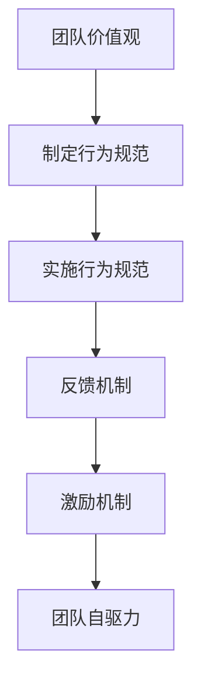

                 

关键字：行为模型、团队自驱力、IT项目管理、敏捷开发、组织效能

> 摘要：本文将探讨行为模型在IT项目管理中的应用，以及如何通过培养团队自驱力，提升项目管理和开发效率。行为模型不仅可以帮助团队成员明确行为规范，还能促进自我管理，提高团队整体绩效。

## 1. 背景介绍

在快速发展的IT行业，团队自驱力成为衡量一个团队成功与否的重要指标。然而，如何培养团队自驱力，如何使每个成员都能在自己的岗位上积极主动地工作，这是一个复杂而关键的问题。行为模型作为一种有效的管理工具，可以为团队提供一套明确的行为规范，指导成员的行为，从而促进团队自驱力的培养。

### 1.1 行为模型的概念

行为模型是指将行为准则和期望规范化的系统，通过定义一系列行为规则，来指导和约束团队成员的行为。行为模型可以基于心理学、组织行为学等多学科的理论，结合实际情况进行设计。

### 1.2 团队自驱力的概念

团队自驱力是指团队成员在没有外部压力的情况下，自发地投入到工作中，主动追求目标和完成任务的能力。一个具有自驱力的团队，能够在没有强制管理的情况下，保持高效运作，实现组织目标。

### 1.3 行为模型与团队自驱力的关系

行为模型为团队提供了行为规范，使团队成员在遇到问题时知道应该如何行动，从而降低了团队成员的心理压力，提高了工作积极性。同时，通过行为模型的实施，可以逐步培养团队成员的自我管理能力，促进团队自驱力的形成。

## 2. 核心概念与联系

下面将介绍行为模型在IT项目管理中的核心概念和架构，通过一个Mermaid流程图来展示其组成和运行机制。

### 2.1 核心概念

- **团队价值观**：团队共同的信念和目标，是行为模型的基石。
- **行为规范**：具体的行动准则，指导团队成员的行为。
- **反馈机制**：对团队成员行为的评价和反馈，以促进改进。
- **激励机制**：通过奖励和认可来激励团队成员，提升自驱力。

### 2.2 Mermaid 流程图



## 3. 核心算法原理 & 具体操作步骤

### 3.1 算法原理概述

行为模型的实施是一个系统性工程，包括以下关键步骤：

1. **定义团队价值观**：通过沟通和共识，确定团队的核心信念和目标。
2. **制定行为规范**：根据团队价值观，定义具体的行动准则，包括工作态度、协作方式、目标设定等。
3. **实施行为规范**：将行为规范融入到日常工作中，通过培训和指导，确保团队成员理解和遵循。
4. **建立反馈机制**：定期收集团队成员的反馈，评估行为规范的效果，调整和改进。
5. **实施激励机制**：通过奖励和认可，激励团队成员积极践行行为规范。

### 3.2 算法步骤详解

1. **定义团队价值观**
   - 通过团队会议和讨论，共同确定团队的核心信念和目标。
   - 制定团队使命宣言，明确团队的目标和价值观。

2. **制定行为规范**
   - 根据团队价值观，制定具体的行动准则。
   - 行为规范应涵盖工作态度、团队合作、目标设定等方面。

3. **实施行为规范**
   - 对新成员进行行为规范培训，确保他们理解并遵循行为规范。
   - 通过日常管理和监督，确保行为规范得到执行。

4. **建立反馈机制**
   - 定期收集团队成员的反馈，了解行为规范的实施效果。
   - 针对反馈，进行评估和改进，确保行为规范的有效性。

5. **实施激励机制**
   - 设计激励机制，如奖金、晋升、表彰等，以激励团队成员积极践行行为规范。
   - 通过公开认可和奖励，提升团队成员的积极性和满意度。

### 3.3 算法优缺点

#### 优点：

- **提高团队自驱力**：通过明确的行为规范，使团队成员能够自我管理，提高工作积极性。
- **增强团队合作**：行为规范促进团队成员之间的协作，提高团队整体效能。
- **提升组织文化**：通过共同的价值观和行为规范，增强组织的凝聚力和文化氛围。

#### 缺点：

- **实施难度大**：行为模型的实施需要时间和资源的投入，初期可能面临一定的挑战。
- **效果评估困难**：行为模型的长期效果难以直接量化，需要持续观察和评估。

### 3.4 算法应用领域

行为模型在IT项目管理中具有广泛的应用前景，特别是在以下领域：

- **敏捷开发**：通过行为模型，提高团队成员的沟通和协作效率，实现快速迭代和持续交付。
- **项目管理**：通过行为模型，规范团队成员的工作流程，提高项目管理和执行能力。
- **组织发展**：通过行为模型，提升组织文化和团队自驱力，促进组织持续发展。

## 4. 数学模型和公式 & 详细讲解 & 举例说明

### 4.1 数学模型构建

为了评估行为模型对团队自驱力的影响，可以构建以下数学模型：

$$
E = f(V, S, F, I)
$$

其中：

- \( E \)：团队自驱力水平。
- \( V \)：团队价值观的强度。
- \( S \)：行为规范的实施程度。
- \( F \)：反馈机制的效能。
- \( I \)：激励机制的强度。

### 4.2 公式推导过程

通过分析行为模型对团队自驱力的影响机制，可以得到以下推导：

- 团队价值观的强度 \( V \) 与团队自驱力 \( E \) 成正相关，即 \( f(V) > 0 \)。
- 行为规范的实施程度 \( S \) 与团队自驱力 \( E \) 成正相关，即 \( f(S) > 0 \)。
- 反馈机制的效能 \( F \) 与团队自驱力 \( E \) 成正相关，即 \( f(F) > 0 \)。
- 激励机制的强度 \( I \) 与团队自驱力 \( E \) 成正相关，即 \( f(I) > 0 \)。

因此，可以得到以下公式：

$$
E = f(V, S, F, I) = V \cdot S \cdot F \cdot I
$$

### 4.3 案例分析与讲解

以某IT公司的敏捷开发团队为例，分析行为模型的应用效果。

1. **团队价值观的强度 \( V \)**：通过团队会议，团队成员一致认同“快速响应客户需求，持续交付高质量产品”的价值观。
2. **行为规范的实施程度 \( S \)**：团队成员严格遵守敏捷开发的行为规范，如每日站立会议、迭代回顾等。
3. **反馈机制的效能 \( F \)**：团队定期收集客户反馈，并根据反馈进行改进，确保产品的持续优化。
4. **激励机制的强度 \( I \)**：公司对表现优秀的团队成员给予奖金和晋升机会，激励团队成员积极践行行为规范。

通过以上措施，该团队的自驱力得到了显著提升，项目质量和客户满意度均有所提高。

## 5. 项目实践：代码实例和详细解释说明

### 5.1 开发环境搭建

在本节中，我们将搭建一个简单的行为模型应用环境，包括：

- **编程语言**：Python
- **依赖库**：Flask（Web框架）、SQLAlchemy（数据库ORM）
- **数据库**：SQLite

首先，安装所需的依赖库：

```bash
pip install Flask SQLAlchemy
```

然后，创建一个名为`behavior_model`的虚拟环境，并安装依赖：

```bash
python -m venv behavior_model
source behavior_model/bin/activate
pip install Flask SQLAlchemy
```

### 5.2 源代码详细实现

下面是一个简单的行为模型实现，包括团队价值观、行为规范、反馈机制和激励机制。

```python
# app.py

from flask import Flask, request, jsonify
from flask_sqlalchemy import SQLAlchemy

app = Flask(__name__)
app.config['SQLALCHEMY_DATABASE_URI'] = 'sqlite:///behavior_model.db'
db = SQLAlchemy(app)

class TeamValue(db.Model):
    id = db.Column(db.Integer, primary_key=True)
    value = db.Column(db.String(100))

class BehaviorNorm(db.Model):
    id = db.Column(db.Integer, primary_key=True)
    norm = db.Column(db.String(100))

class Feedback(db.Model):
    id = db.Column(db.Integer, primary_key=True)
    feedback = db.Column(db.String(100))

class Incentive(db.Model):
    id = db.Column(db.Integer, primary_key=True)
    incentive = db.Column(db.String(100))

@app.route('/add_value', methods=['POST'])
def add_value():
    data = request.get_json()
    new_value = TeamValue(value=data['value'])
    db.session.add(new_value)
    db.session.commit()
    return jsonify({'message': 'Value added successfully!'})

@app.route('/add_norm', methods=['POST'])
def add_norm():
    data = request.get_json()
    new_norm = BehaviorNorm(norm=data['norm'])
    db.session.add(new_norm)
    db.session.commit()
    return jsonify({'message': 'Norm added successfully!'})

@app.route('/add_feedback', methods=['POST'])
def add_feedback():
    data = request.get_json()
    new_feedback = Feedback(feedback=data['feedback'])
    db.session.add(new_feedback)
    db.session.commit()
    return jsonify({'message': 'Feedback added successfully!'})

@app.route('/add_incentive', methods=['POST'])
def add_incentive():
    data = request.get_json()
    new_incentive = Incentive(incentive=data['incentive'])
    db.session.add(new_incentive)
    db.session.commit()
    return jsonify({'message': 'Incentive added successfully!'})

if __name__ == '__main__':
    db.create_all()
    app.run(debug=True)
```

### 5.3 代码解读与分析

1. **数据库模型**：定义了四个数据库模型，分别为`TeamValue`、`BehaviorNorm`、`Feedback`和`Incentive`，分别用于存储团队价值观、行为规范、反馈和激励机制的信息。
2. **API接口**：通过定义四个API接口，可以分别添加新的团队价值观、行为规范、反馈和激励机制。
3. **主程序**：创建数据库表，并启动Flask应用。

### 5.4 运行结果展示

启动Flask应用后，可以通过以下命令访问API：

```bash
curl -X POST -H "Content-Type: application/json" -d '{"value": "Customer-centric"}' http://127.0.0.1:5000/add_value
```

成功后，将返回：

```json
{"message": "Value added successfully!"}
```

通过类似的方式，可以添加其他行为规范、反馈和激励机制。

## 6. 实际应用场景

### 6.1 项目管理中的行为模型应用

在项目管理中，行为模型可以帮助团队明确项目目标、任务分工和责任落实。例如，通过行为规范，确保团队成员按时提交任务报告、参与团队会议和及时响应问题。

### 6.2 敏捷开发中的行为模型应用

在敏捷开发中，行为模型可以帮助团队保持高效的协作和持续交付。通过明确的行为规范，如每日站立会议、迭代回顾和用户故事地图等，促进团队成员之间的沟通和协作。

### 6.3 组织发展中的行为模型应用

在组织发展中，行为模型可以帮助提升组织文化，培养团队自驱力。通过共同的价值观和行为规范，增强团队的凝聚力和执行力，实现组织的长期发展。

## 6.4 未来应用展望

随着人工智能和大数据技术的发展，行为模型在团队管理和组织效能提升方面具有广阔的应用前景。未来的研究可以重点关注以下几个方面：

1. **行为模型的智能优化**：利用机器学习和数据挖掘技术，对行为模型进行智能优化，提高模型的准确性和适应性。
2. **跨组织行为模型共享**：建立跨组织的行为模型共享平台，促进不同组织之间的经验交流和协作。
3. **个性化行为模型设计**：根据不同团队和组织的特点，设计个性化的行为模型，提高模型的适用性和效果。

## 7. 工具和资源推荐

### 7.1 学习资源推荐

- **书籍**：《团队协作工具手册》、《敏捷开发：原则、实践与模式》
- **在线课程**：Coursera的《敏捷软件开发》课程，edX的《团队协作与管理》课程
- **博客和网站**：Atlassian的博客，Scrum.org的官方网站

### 7.2 开发工具推荐

- **项目管理工具**：Jira、Trello、Asana
- **敏捷开发工具**：Jenkins、GitLab、Git
- **协作工具**：Slack、Zoom、Microsoft Teams

### 7.3 相关论文推荐

- **“Behavior Modeling for Agile Teams”**
- **“The Impact of Team Values on Team Performance”**
- **“Self-Driving Teams: The Role of Self-Determination Theory in Agile Teams”**

## 8. 总结：未来发展趋势与挑战

### 8.1 研究成果总结

行为模型在团队管理和组织效能提升方面取得了显著成果，通过明确的行为规范和激励机制，有效提升了团队自驱力和项目成功率。

### 8.2 未来发展趋势

未来，行为模型将朝着智能化、个性化、共享化的方向发展，结合人工智能和大数据技术，实现更加精准和高效的管理。

### 8.3 面临的挑战

在行为模型的应用过程中，面临的主要挑战包括：如何设计有效的行为规范、如何平衡规范与灵活性、如何评估和改进行为模型的效果。

### 8.4 研究展望

未来，行为模型的研究将重点关注跨组织协作、智能优化和个性化设计等方面，为团队管理和组织效能提升提供更加全面和有效的解决方案。

## 9. 附录：常见问题与解答

### Q1. 如何确保行为规范的执行力？

A1. 要确保行为规范的执行力，可以从以下几个方面入手：

- **明确规范内容**：确保行为规范具体、明确，易于理解和执行。
- **加强培训**：对团队成员进行行为规范培训，确保他们理解并遵循规范。
- **建立监督机制**：建立监督机制，定期检查行为规范的执行情况。

### Q2. 行为模型是否适用于所有团队和组织？

A2. 行为模型具有一定的通用性，但不同团队和组织的特点和需求不同，因此需要根据实际情况进行定制和调整。在应用行为模型时，需要充分考虑团队和组织的特点，确保其适用性和效果。

### Q3. 如何评估行为模型的效果？

A3. 评估行为模型的效果可以从以下几个方面入手：

- **团队成员满意度**：通过调查问卷或访谈，了解团队成员对行为模型的满意度。
- **项目成功率**：通过对比行为模型实施前后的项目成功率，评估行为模型的效果。
- **组织绩效**：通过对比行为模型实施前后的组织绩效指标，如员工离职率、客户满意度等，评估行为模型的效果。

### 作者署名

作者：禅与计算机程序设计艺术 / Zen and the Art of Computer Programming
----------------------------------------------------------------


