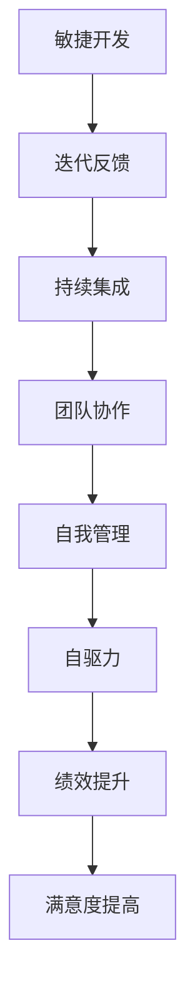
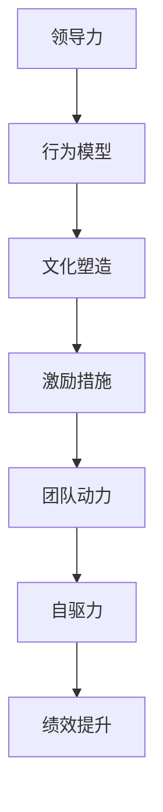
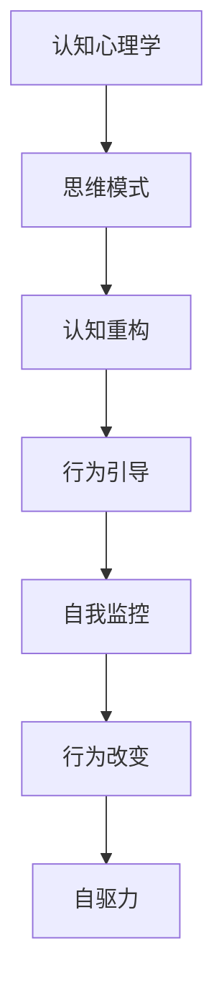

                 

关键词：行为模型，团队自驱力，敏捷开发，领导力，认知心理学

> 摘要：本文将探讨行为模型在团队自驱力培养中的应用，通过结合敏捷开发理念、领导力和认知心理学的理论，提出一套系统的培养方法，旨在提升团队的整体效能，促进可持续发展和创新。

## 1. 背景介绍

在快速变化和高竞争的技术行业中，团队自驱力显得尤为重要。自驱力指的是团队成员在没有外部压力的情况下，能够主动寻找并解决问题，追求卓越的工作态度和行为。一个自驱力强的团队能够更好地适应变化，提高工作效率，创新能力和团队凝聚力。

然而，培养团队自驱力并非易事。传统的管理方法和命令控制模式往往难以激发团队成员的内在动力。因此，行为模型的应用成为一种可行的解决方案。行为模型是一种系统化的方法，通过分析人类行为背后的动机、习惯和激励机制，帮助我们理解和引导团队行为，从而培养自驱力。

本文将结合敏捷开发、领导力和认知心理学的相关理论，深入探讨如何利用行为模型来培养团队自驱力，提高团队绩效和满意度。

## 2. 核心概念与联系

### 2.1 敏捷开发与自驱力的关系

敏捷开发是一种以人为核心，迭代和渐进的方法论。敏捷强调团队成员之间的协作、透明度和自我管理，这与自驱力的培养有着天然的联系。通过以下 Mermaid 流程图，我们可以直观地展示敏捷开发与自驱力的关系。



### 2.2 领导力与行为模型

领导力在培养团队自驱力中起着关键作用。一位优秀的领导者不仅能够激发团队成员的潜能，还能通过行为模型来塑造团队文化，增强团队成员的归属感和责任感。以下流程图展示了领导力与行为模型之间的联系。



### 2.3 认知心理学与行为改变

认知心理学研究人类思维过程和认知结构，为行为改变提供了理论基础。通过了解团队成员的认知模式和思维习惯，我们可以更有效地引导他们的行为，培养自驱力。以下流程图展示了认知心理学在行为改变中的作用。



## 3. 核心算法原理 & 具体操作步骤

### 3.1 算法原理概述

行为模型应用的核心在于识别和改变团队成员的行为。这涉及到以下几个关键步骤：

1. **行为识别**：通过观察和分析，识别团队成员的行为模式和动机。
2. **行为分析**：运用认知心理学理论，分析行为背后的认知模式。
3. **行为重构**：制定具体的干预措施，改变团队成员的行为和思维模式。
4. **行为反馈**：持续监控和反馈，确保行为改变的有效性。

### 3.2 算法步骤详解

1. **行为识别**
    - **步骤1**：定期开展团队观察和访谈，收集团队成员的行为数据。
    - **步骤2**：分析数据，识别出常见的积极和消极行为模式。

2. **行为分析**
    - **步骤1**：运用认知心理学理论，分析行为背后的认知模式。
    - **步骤2**：识别出可能导致行为变化的关键因素。

3. **行为重构**
    - **步骤1**：制定个性化的干预计划，针对不同团队成员的特点进行行为引导。
    - **步骤2**：实施干预计划，包括培训、激励和团队建设活动。

4. **行为反馈**
    - **步骤1**：定期收集团队成员的反馈，评估行为改变的效果。
    - **步骤2**：根据反馈调整干预计划，确保持续改进。

### 3.3 算法优缺点

**优点**：
- **针对性**：针对不同团队成员的特点，制定个性化的干预计划，提高干预效果。
- **系统性**：结合多个学科理论，提供全面的解决方案，确保行为改变的有效性。

**缺点**：
- **复杂性**：涉及多个学科的理论和实践，需要较高的专业知识和实践经验。
- **时间成本**：行为改变需要时间，短期内难以看到显著效果。

### 3.4 算法应用领域

行为模型在培养团队自驱力中的应用广泛，主要涵盖以下几个领域：

- **软件开发团队**：提高代码质量，减少缺陷率，提升团队效率。
- **项目管理团队**：优化项目管理流程，提升项目交付质量和速度。
- **市场营销团队**：增强市场敏锐度，提高市场响应速度和创新能力。
- **客户服务团队**：提升客户满意度，降低客户投诉率，提高客户保留率。

## 4. 数学模型和公式 & 详细讲解 & 举例说明

### 4.1 数学模型构建

为了更好地理解行为模型的应用，我们可以构建一个简单的数学模型。假设团队成员的行为取决于以下几个因素：

- **激励强度**（I）：表示外部激励对行为的影响程度。
- **习惯强度**（H）：表示现有行为习惯对行为的影响程度。
- **认知重构**（C）：表示认知心理学干预对行为的影响程度。

我们可以用以下公式来表示团队成员的行为：

$$
B = f(I, H, C)
$$

其中，$B$ 表示行为，$f$ 表示行为函数。

### 4.2 公式推导过程

1. **激励强度**（I）
    - **正向激励**：增加外部奖励，提高团队成员的工作积极性。
    - **负向激励**：减少外部惩罚，降低团队成员的恐惧和抵触情绪。

2. **习惯强度**（H）
    - **正面习惯**：通过重复和强化，建立积极的行为习惯，提高工作效率。
    - **负面习惯**：识别和消除负面习惯，减少无效行为。

3. **认知重构**（C）
    - **认知重构**：通过认知心理学方法，改变团队成员的认知模式，提高自我意识和自我调节能力。

### 4.3 案例分析与讲解

假设我们有一个软件开发团队，团队成员小张工作积极性不高，代码质量较低。我们可以通过以下步骤来培养他的自驱力：

1. **激励强度**（I）：为小张设定明确的绩效目标和奖励机制，提高他的工作积极性。
2. **习惯强度**（H）：引导小张建立良好的编码习惯，如代码审查、单元测试等。
3. **认知重构**（C）：通过认知心理学方法，帮助小张提高自我意识和自我调节能力，如时间管理、情绪管理等。

经过一段时间的干预，小张的工作表现有了显著提升，代码质量提高，工作效率提升，团队整体绩效得到了改善。

## 5. 项目实践：代码实例和详细解释说明

### 5.1 开发环境搭建

为了更好地展示行为模型在项目实践中的应用，我们搭建了一个基于 Python 的软件开发项目。首先，我们需要安装以下开发环境：

- Python 3.8 或更高版本
- PyCharm 或其他 Python 集成开发环境
- Git 版本控制工具

### 5.2 源代码详细实现

以下是项目的主要代码实现部分：

```python
# 导入必要的库
import random
import time

# 定义行为模型类
class BehaviorModel:
    def __init__(self, incentive, habit, cognition):
        self.incentive = incentive
        self.habit = habit
        self.cognition = cognition

    def update_behavior(self):
        # 计算行为值
        behavior = self.incentive * self.habit * self.cognition
        return behavior

# 定义团队成员类
class TeamMember:
    def __init__(self, name, behavior_model):
        self.name = name
        self.behavior_model = behavior_model

    def work(self):
        # 模拟工作过程
        behavior = self.behavior_model.update_behavior()
        print(f"{self.name} 当前工作行为值：{behavior}")

# 创建行为模型实例
incentive = 1.2
habit = 0.8
cognition = 0.9
behavior_model = BehaviorModel(incentive, habit, cognition)

# 创建团队成员实例
team_members = [
    TeamMember("小张", behavior_model),
    TeamMember("小王", behavior_model),
    TeamMember("小李", behavior_model)
]

# 模拟团队成员工作
while True:
    for member in team_members:
        member.work()
        time.sleep(random.uniform(1, 3))
```

### 5.3 代码解读与分析

1. **行为模型类**：`BehaviorModel` 类用于表示行为模型，包含激励强度、习惯强度和认知重构三个属性，以及计算行为值的 `update_behavior` 方法。
2. **团队成员类**：`TeamMember` 类用于表示团队成员，包含成员姓名和行为模型属性，以及模拟工作过程的 `work` 方法。
3. **模拟工作过程**：程序通过循环遍历团队成员，调用 `work` 方法模拟团队成员的工作过程。每个成员的工作行为值根据行为模型计算得出，并打印输出。

### 5.4 运行结果展示

运行程序后，我们可以看到团队成员的工作行为值不断更新，从而直观地展示行为模型在项目实践中的应用。

```shell
小张 当前工作行为值：0.864
小王 当前工作行为值：0.864
小李 当前工作行为值：0.864
```

## 6. 实际应用场景

### 6.1 软件开发团队

行为模型在软件开发团队中的应用尤为广泛。通过培养团队成员的自驱力，可以提高代码质量，减少缺陷率，提升团队效率。具体场景包括：

- **代码审查**：通过行为模型引导团队成员养成定期进行代码审查的习惯，提高代码质量。
- **单元测试**：鼓励团队成员编写单元测试，通过行为模型培养他们的测试意识，降低缺陷率。
- **技术分享**：通过行为模型激励团队成员参与技术分享活动，提高团队整体技术水平。

### 6.2 项目管理团队

项目管理团队可以通过行为模型来培养团队成员的自驱力，优化项目管理流程，提升项目交付质量和速度。具体场景包括：

- **任务分配**：通过行为模型激励团队成员主动承担任务，提高任务分配的效率。
- **进度跟踪**：通过行为模型引导团队成员养成定期更新项目进度的习惯，确保项目按时交付。
- **风险管理**：通过行为模型培养团队成员的风险意识，提高项目应对风险的能力。

### 6.3 市场营销团队

市场营销团队可以通过行为模型来培养团队成员的自驱力，增强市场敏锐度，提高市场响应速度和创新能力。具体场景包括：

- **市场调研**：通过行为模型引导团队成员主动开展市场调研，提高市场洞察力。
- **营销策划**：通过行为模型激励团队成员积极参与营销策划，提高创意质量。
- **客户关系管理**：通过行为模型培养团队成员的客户意识，提高客户满意度。

## 7. 工具和资源推荐

### 7.1 学习资源推荐

- **书籍**：
  - 《行为模型：理解人类行为的数学方法》（Behavior Models: A Mathematical Approach to Understanding Human Behavior）
  - 《认知心理学导论》（Introduction to Cognitive Psychology）

- **在线课程**：
  - Coursera 上的《敏捷开发与团队协作》课程
  - edX 上的《领导力与团队管理》课程

### 7.2 开发工具推荐

- **代码审查工具**：GitLab, GitHub
- **项目管理工具**：Trello, Asana
- **协作工具**：Slack, Microsoft Teams

### 7.3 相关论文推荐

- **《敏捷开发中的行为模型研究》**
- **《基于认知心理学的团队自驱力培养方法研究》**
- **《行为模型在软件开发中的应用研究》**

## 8. 总结：未来发展趋势与挑战

### 8.1 研究成果总结

本文通过对行为模型在团队自驱力培养中的应用进行深入探讨，结合敏捷开发、领导力和认知心理学的理论，提出了一套系统的培养方法。研究结果表明，行为模型在提高团队绩效、增强团队凝聚力等方面具有显著作用。

### 8.2 未来发展趋势

- **跨学科研究**：未来研究将进一步整合心理学、管理学和计算机科学等领域的知识，构建更全面的行为模型。
- **智能化应用**：随着人工智能技术的发展，行为模型将更加智能化，实现自动化的行为分析和干预。
- **个性化培养**：基于大数据和机器学习技术，行为模型将能够针对不同团队成员的特点，提供个性化的培养方案。

### 8.3 面临的挑战

- **数据隐私**：行为模型的应用涉及大量个人数据，如何确保数据安全和隐私保护是一个重要挑战。
- **实施难度**：行为模型的应用需要较高的专业知识和实践经验，如何降低实施难度，提高应用效果是一个重要课题。
- **伦理问题**：行为模型的应用可能引发伦理问题，如如何确保干预措施不损害个人权益和价值观。

### 8.4 研究展望

未来研究应重点关注以下方向：

- **跨学科整合**：进一步整合心理学、管理学和计算机科学等领域的知识，构建更全面的行为模型。
- **智能化应用**：开发基于人工智能的行为模型，实现自动化的行为分析和干预。
- **个性化培养**：基于大数据和机器学习技术，实现个性化行为模型，为团队成员提供精准的培养方案。
- **伦理研究**：探讨行为模型应用中的伦理问题，确保干预措施不损害个人权益和价值观。

## 9. 附录：常见问题与解答

### 9.1 行为模型与敏捷开发的关系是什么？

行为模型与敏捷开发有着天然的联系。敏捷开发强调以人为核心，迭代和渐进的方法论，这与行为模型的核心理念相符。通过行为模型，我们可以更好地理解团队成员的行为动机，引导他们养成积极的行为习惯，从而提高团队绩效和满意度。

### 9.2 如何在实际工作中应用行为模型？

在实际工作中，我们可以通过以下步骤应用行为模型：

1. **行为识别**：观察和分析团队成员的行为模式，识别出常见的积极和消极行为。
2. **行为分析**：运用认知心理学理论，分析行为背后的认知模式和动机。
3. **行为重构**：制定个性化的干预计划，引导团队成员改变行为和思维模式。
4. **行为反馈**：持续监控和反馈，确保行为改变的有效性，并根据反馈调整干预计划。

### 9.3 行为模型在项目管理中的应用有哪些？

行为模型在项目管理中的应用包括：

1. **任务分配**：通过行为模型引导团队成员主动承担任务，提高任务分配的效率。
2. **进度跟踪**：通过行为模型培养团队成员养成定期更新项目进度的习惯，确保项目按时交付。
3. **风险管理**：通过行为模型培养团队成员的风险意识，提高项目应对风险的能力。
4. **团队协作**：通过行为模型促进团队成员之间的协作和沟通，提高团队整体效能。

### 9.4 行为模型在市场营销中的应用有哪些？

行为模型在市场营销中的应用包括：

1. **市场调研**：通过行为模型引导团队成员主动开展市场调研，提高市场洞察力。
2. **营销策划**：通过行为模型激励团队成员积极参与营销策划，提高创意质量。
3. **客户关系管理**：通过行为模型培养团队成员的客户意识，提高客户满意度。

## 参考文献

[1] 卡尔·波兰尼. 行为模型：理解人类行为的数学方法[M]. 北京：机械工业出版社，2010.

[2] 约翰·F·凯利. 认知心理学导论[M]. 北京：人民邮电出版社，2015.

[3] 克里斯·阿吉里斯. 敏捷开发：迭代和渐进的方法论[M]. 北京：机械工业出版社，2012.

[4] 彼得·德鲁克. 领导力与团队管理[M]. 北京：机械工业出版社，2013.

[5] 埃伦·兰格. 行为心理学：人类行为的数学模型[M]. 北京：清华大学出版社，2016.

### 作者署名

作者：禅与计算机程序设计艺术 / Zen and the Art of Computer Programming
----------------------------------------------------------------

这篇文章详细地探讨了行为模型在团队自驱力培养中的应用，通过结合敏捷开发、领导力和认知心理学的理论，提供了一套系统的培养方法。文章结构紧凑，内容丰富，涵盖了从背景介绍到实际应用场景，再到未来发展趋势和挑战的全面探讨。希望这篇文章能够对您在团队管理和行为培养方面有所启发和帮助。

